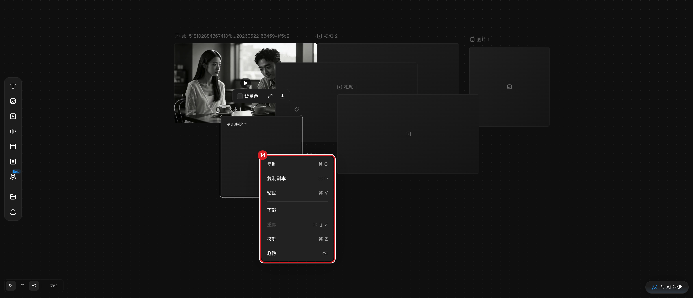

# 复制、删除与撤销

## 适用角色

已登录的即梦画布创作者。

## 目标

复制节点（含副本命名规则）、删除节点与连线，并用撤销/重做恢复误操作。

## 前置条件

画布中已有至少一个节点。

## 入口

- 节点右键菜单。
- 键盘：**⌘C**（复制）、**⌘D**（复制副本）、**⌘V**（粘贴）、**⌫**（删除）、
  **⌘Z**（撤销）、**⌘⇧Z / ⌘Y**（重做，快捷键面板声明）。

## 节点右键菜单（文本节点实测逐字）

复制 ⌘C ｜ 复制副本 ⌘D ｜ 粘贴 ⌘V ｜ 下载 ｜ 重做 ⌘⇧Z（无操作时禁用，附
「无需重做操作」）｜ 撤销 ⌘Z ｜ 删除 ⌫

- 媒体节点的菜单可能多出「保存到主体库」等项——**菜单项按节点类型变化**，
  以当前右键所见为准。

## 原子步骤

### 复制副本（实测）

1. 右键节点 → 点击 **复制副本 ⌘D**（或选中后直接按 **⌘D**）。
2. 结果：副本出现在原节点右侧相邻位置，自动选中，命名追加序号
   （「文本 1」→「文本 1 (2)」）。
   - 成功判据：节点计数加一，副本呈选中态。
   - 注意：今日命名后缀为 ` (2)`；连按多次 ⌘D 生成 (3)、(4)…

### 删除（实测）

1. 选中节点（或连线）。
2. 按 **⌫**，或右键 → **删除 ⌫**。
   - 成功判据：目标消失、计数减一；被删节点上的连线一并移除。
   - 注意：焦点在输入框（如生成面板提示词）内时 **⌫** 只删文字；先点空白
     取消焦点再删。

### 撤销 / 重做（实测 ⌘Z）

1. 误删后立即按 **⌘Z** → 被删节点/连线恢复（多次实测，包括恢复整条连线）。
2. 重做：右键菜单 **重做 ⌘⇧Z**（快捷键面板另有 **⌘Y**）。
3. **撤销历史不跨会话**：刷新页面后 ⌘Z 不再回退任何内容（实测）。

### 粘贴（未生效，待复测）

- 本轮以真实键盘事件发送 **⌘V** 未产生新节点。**不要依赖 ⌘V 完成关键操作**，
  复制节点请优先用 **复制副本 ⌘D**。若必须跨画布搬运，使用下载/上传或资产库。

## 常见错误与恢复

| 现象 | 处理 |
|---|---|
| 按 ⌫ 没删掉节点 | 焦点在输入框里；点空白后重新选中再按 |
| 删错了 | 立即 **⌘Z**；刷新过后无法撤销 |
| 重做菜单是灰的（无需重做操作） | 当前没有可重做的历史，属正常 |

## 相关任务

[创建节点](create-first-node.md) ｜ [连接节点](connect-nodes.md) ｜
[编组、排列与整理](organize-group-layout.md)

## 已验证说明

右键菜单逐字、复制副本（菜单+⌘D）、⌫ 删除（节点与连线）、⌘Z 多步撤销、
重做禁用态、撤销历史不跨刷新均为 2026-09-23 实测；⌘V 粘贴未生效、⌘⇧Z/⌘Y
未单独执行，按「声明/待验证」标注。

## 步骤图

