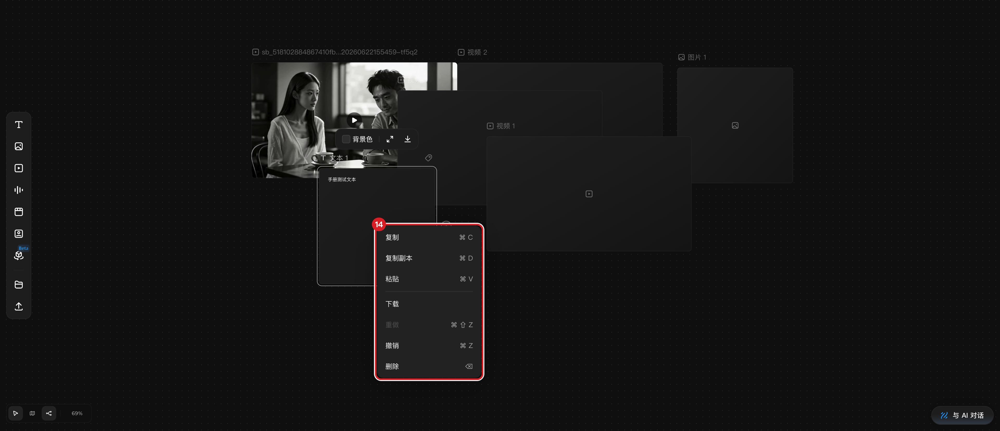
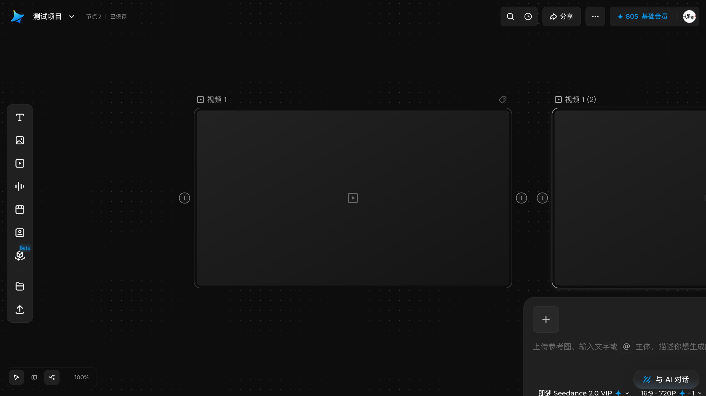
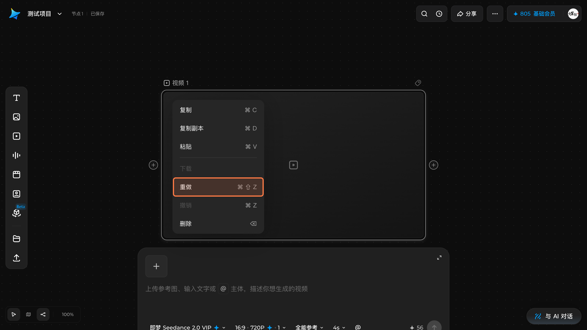
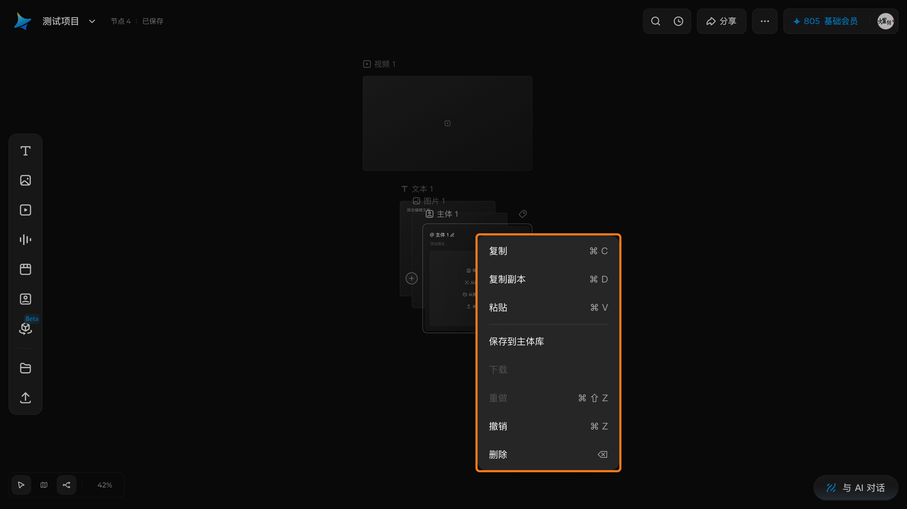

# 复制、删除与撤销

## 适用角色

已登录的即梦画布创作者。

## 目标

复制节点（含副本命名规则）、删除节点与连线，并用撤销/重做恢复误操作。

## 前置条件

画布中已有至少一个节点。

## 入口

- 节点右键菜单。
- 键盘：**⌘C**（复制）、**⌘D**（复制副本）、**⌘V**（粘贴）、**⌫**（删除）、
  **⌘Z**（撤销）、**⌘⇧Z / ⌘Y**（重做，两者均已实测可用）。

## 节点右键菜单（实测逐字）

容器统一是 `role="menu"`、aria 逐字 **`Canvas context menu`**、DOM 为
`[data-testid="canvas-context-menu"]`，**宽恒为 200**，每项 192×36。
**高度与条目数随节点类型变化**（2026-10-01 逐类型实测；**批次 77 全类型复测并补上音频行**）：

| 节点类型 | 条目数 | 容器尺寸 | 与「空视频」基线的差异 |
|---|---|---|---|
| 空视频 | 7 | 200×292 | —— 基线 |
| 文本 | 7 | 200×292 | **「下载」可用**（不附原因文案） |
| 时间线 | 7 | 200×292 | 「下载」禁用，原因文案逐字 **`请选择至少一个组、文本、图片或视频项`**（批次 111 补全原文，此前只记了「原因文案不同」） |
| **空**音频 | 7 | 200×292 | 「下载」禁用，原因同空视频（见下） |
| 导演台 | 7 | 200×292 | 同时间线 |
| **空**图片 | 8 | **200×332** | 多出 **「复制为图片 ⌘⇧C」**（禁用，附「无法复制或剪切此选区。」）；**没有**「保存到主体库」 |
| **主体** | 8 | **200×332** | 多出 **「保存到主体库」**（**可用**，无快捷键、无原因文案） |
| **有资源的图片**（批次 22 实测） | 9 | **200×372** | 「复制为图片 ⌘⇧C」+ **「保存到主体库」** 两项都有 |
| **有资源的视频**（批次 105 实测） | **8** | **200×332** | 多出 **「保存到主体库」**（可用）；**没有**「复制为图片」 |
| **组**（批次 108 实测，0 成员空组） | **8** | — | 第四项是 **「取消编组」**（不是「布局」也不是「下载」）；**「下载」在、但禁用**，附「**没有可用的就绪资源**」 |

> ⚠️ **「空节点」和「有资源的节点」菜单不一样**，别混记：
> 空图片节点是 **8 项 200×332**，**没有**「保存到主体库」；
> 上传过图片之后变成 **9 项 200×372**，**才有**这一项。
> 视频同理：空态 **7 项 200×292**，有资源后 **8 项 200×332**。
>
> 📌 **两项的归属规则（2026-10-01 合并批次 22 与批次 30 的两组实测；
> 2026-10-02 批次 105 补上视频这一格后重写）**：
> - **「复制为图片 ⌘⇧C」** → **图片节点**（空/有资源都有；空态时禁用）。视频节点**没有**这一项。
> - **「保存到主体库」** → 归一后的规则是：**属于「有可用资源」这个条件，不属于「节点类型」**。
>   实测三格：主体节点**空态**就有（例外）、有资源的图片节点有、**有资源的视频节点也有**（批次 105）；
>   而空视频、空图片、空音频节点**一律没有**。

### 七个共有项（以空视频节点为基线，2026-10-01 复测逐字）

| 逐字 | 快捷键 | 状态 |
|---|---|---|
| 复制 | ⌘C | 可用 |
| 复制副本 | ⌘D | 可用 |
| 粘贴 | ⌘V | 可用 |
| **下载** | — | **禁用**，附逐字原因「**没有可用的就绪资源**」 |
| 重做 | ⌘⇧Z | 禁用时附「无需重做操作」 |
| 撤销 | ⌘Z | 禁用时附「无需撤销操作」 |
| 删除 | ⌫ | 可用 |

- **禁用项不是灰着就算**，而是在条目下方附一句**原因文案**
  （「没有可用的就绪资源」/「无需重做操作」/「无需撤销操作」）——
  这是判断「为什么不能点」的第一手信息，比猜要准。
- 禁用态同时有三种可脚本化判据：`aria-disabled="true"`、文字色
  `rgba(255,255,255,0.2)`（可用态是 `rgb(255,255,255)`）、**没有右侧快捷键字样**。

### 「下载」的禁用原因分两种（2026-10-01 新发现）

| 节点类型 | 「下载」逐字原因 |
|---|---|
| 空视频 / 图片 / **音频** | **没有可用的就绪资源** |
| 主体 / 时间线 / 导演台 | **请选择至少一个组、文本、图片或视频项** |
| 文本 | 不禁用，直接可用 |

第二种原因说的是「这类节点根本不在可下载的范围内」，第一种说的是
「在范围内但还没有就绪资源」——**两句话含义不同，不要当成同一条**。

> ✅ **已关闭一个旧疑问**：本手册早前写「早前记『媒体节点的菜单可能多出
> 『保存到主体库』等项』—— 实测空视频节点没有这一项；『保存到主体库』是否出现在
> **有资源的媒体节点**上，**仍未验证**」。
> **分两次关闭**：
> - **批次 22（已有记录）**：有资源的**图片**节点 **200×372 九项**，含该项 →
>   它**不是**空节点的专利。
> - **批次 30（本批实测）**：**主体**节点**空态就已经有**这一项且**可用**；
>   **空**图片节点**没有**。→ 见上表「两项的归属规则」。
>
> 🔴 **批次 105（2026-10-02）订正第三格：视频**。本页下面那句
> 「空视频节点（无论有无资源）都没有这一项，也没有『复制为图片』」——
> 其中「**无论有无资源**」这半句是**错的**。
> **有资源的视频节点有「保存到主体库」**：实测菜单为 `200×332`、**8 项**，
> 每项 `192×36`，逐字
> `复制 ⌘ C ｜ 复制副本 ⌘ D ｜ 粘贴 ⌘ V ｜ 保存到主体库 ｜ 下载 ｜ 重做 ⌘ ⇧ Z 无需重做操作 ｜ 撤销 ⌘ Z ｜ 删除 ⌫`。
> （与批次 101 在视频侧独立测得的 `200×332` 8 项逐字吻合。）
> - ✅「没有『复制为图片』」这半句在视频上**成立** —— 8 项里没有它。
> - ⇒ 归一后的规则是：**「保存到主体库」属于「有可用资源」的节点，不属于「节点类型」**。
>   空态一律没有；视频/图片一旦有资源就有；主体节点是例外（空态就有）。
>
> 🆕 **批次 108（2026-10-02）补一行「组」**：0 成员空组的右键菜单是 **8 项**，逐字
> `复制 ⌘ C ｜ 复制副本 ⌘ D ｜ 粘贴 ⌘ V ｜ **取消编组** ｜ **下载**（禁用，附「没有可用的就绪资源」）｜ 重做 ⌘ ⇧ Z 无需重做操作 ｜ 撤销 ⌘ Z ｜ 删除 ⌫`。
> 与七个共有项的差别只有**第四项换成了「取消编组」**，
> 而「下载」**仍然在、只是禁用**（空组没有可下载的资源）。
> ⇒ 「组」是**唯一把「取消编组」放进右键菜单**的宿主 —— 工具条上也有，但菜单里这一项
> 是它独有的。

> 🔧 **订正一条旧结论**：批次 5 曾记录「节点右键菜单在自动化下不弹出，脚本场景不可依赖」。
> **该结论错误。** 批次 11 用 `mouse.down({button:'right'})` + 150ms 停顿稳定复现，
> 批次 30 进一步用**在选中节点上直接派发 `contextmenu` 事件**复现（更稳，
> 不受节点互相遮挡的命中测试影响）。**右键菜单是可靠的删除路径之一**
> （与「单击选中 + Backspace」并列）。

## 原子步骤

### 复制副本（实测）

1. 右键节点 → 点击 **复制副本 ⌘D**（或选中后直接按 **⌘D**）。
2. 结果：副本出现在原节点右侧相邻位置，自动选中，命名追加序号
   （「文本 1」→「文本 1 (2)」）。
   - 成功判据：节点计数加一，副本呈选中态。
   - 注意：今日命名后缀为 ` (2)`；连按多次 ⌘D 生成 (3)、(4)…
   - **2026-10-01 精确复测**（569×320 的视频节点）：⌘D 后状态行
     `1 node, 0 edges, 1 selected` → `2 nodes, 0 edges, 1 selected`；
     副本 aria 逐字 **`视频 node: 视频 1 (2)`**，尺寸与原节点**完全相同**
     （569×320），位置在原节点**正右方、同一水平线**，且**副本自动成为选中态**。
   - 🔴 **`dx` 不是常量，因节点类型而异**（批次 77 补测，`dy` 都是 `0`）：

     | 源节点类型 | 副本命名（逐字） | 偏移 | 副本尺寸 |
     |---|---|---|---|
     | 视频 | `视频 1 (2)`（批次 30） | `dx=648` | 与原节点相同 |
     | 主体 | `主体 1 (2)`（批次 77） | `dx=432` | 与原节点相同 |
     | 图片 | `图片 1 (2)`（批次 77） | `dx=400` | 与原节点相同 |
     | 文本 | ⚠️ **本轮未取到命名读数**（节点 `innerText` 前两行是占位「双击编辑文本」，标题不在采样窗口内）⇒ **不作断言** | — | — |

     ⇒ 旧记「实测偏移 `dx=648`」是**视频专属**的值，别当成通用常量。
   - ✅ **⌘Z 可撤销副本**在**图片 / 主体**上也复现（批次 77 两次都回到删除前的节点数）。
   - **⌘Z 可撤销副本**：实测按一次 ⌘Z 回到 `1 node, 0 edges, 0 selected`，
     副本消失、原节点保留。
   - ⚠️ **必须先真正选中节点**才有效果。（本批曾因缩放后坐标变化、单击落空
     导致 `0 selected`，此时按 ⌘D 毫无反应——先看状态行再按。⚠️ 这串读数屏上不可见（🔴 批次 120 订正，见 [界面速查](../20-reference.md)）；**肉眼的等价判据是「节点有没有选中描边／浮动工具条」**。）
   - ⚠️⚠️ **选中 ≠ 焦点在画布上**（批次 77 实测，这是快捷键类操作最隐蔽的前置条件）：
     | 点的地方 | 焦点落在哪 | 能不能安全按字母类快捷键 |
     |---|---|---|
     | 文本节点**卡片主体** | `DIV aria="Text"`（编辑器内） | ❌ 会被当成打字 |
     | 主体节点**卡片主体** | `TEXTAREA aria="描述"`（批次 71 记录） | ❌ |
     | 文本节点**标题行** | `DIV[rf__node-<id>]`（节点容器） | ✅ |
     | 主体节点**标题行** | `DIV[subject-source-picker-chip]`（批次 77） | ✅ |
     **正解**：点**空白画布**取消焦点 → 再点节点**标题行**选中它 → 此时按 ⌘D 才生效。

### 删除（实测）

1. 选中节点（或连线）。
2. 按 **⌫（Backspace）**，或右键 → **删除 ⌫**。
   - 成功判据：目标消失、计数减一；被删节点上的连线一并移除。
   - 注意：焦点在输入框（如生成面板提示词）内时 **⌫** 只删文字；先点空白
     取消焦点再删。

> ⚠️ **文本节点在「编辑态」时 ⌫ 只删文字、不删节点**（2026-10-01 实测踩坑）：
> 症状是「节点明明选中了，按 ⌫ 毫无反应，节点数不变」。
> 原因是点**卡片主体**会进入编辑态，焦点落在 `.ProseMirror` 编辑器里。
> **两种正解**（均实测有效）：
> - 点节点的**标题行**（那一行文字）来选中它 —— 焦点落在 `.react-flow` 而不是
>   编辑器里，此时 ⌫ 正常删除；
> - 或先按一次 **Esc** 退出编辑态，再选中并按 ⌫。

> ⚠️ **请按 Backspace，不要按 Delete**（2026-10-01 实测对照）：
> 同一个已选中的节点，按 **Backspace** 立刻删除（5→4→3→2→1 连续生效）；
> 按 **Delete**（数字小键盘右侧那颗）**没有任何反应**，节点数不变。
> 快捷键面板与右键菜单标注的都是 **⌫**，那就是 Backspace。
>
> 删除脚本化时也要注意：**Delete 与 Backspace 不可互换**，
> 只发 Delete 会得到「看似选中成功、实则什么都没删」的假象。

> ⚠️ **从「搜索」面板选中的节点，按 ⌫ 删不掉**（2026-10-01 实测）：
> 用顶栏 **搜索** 面板点结果行，节点**确实被选中了**（状态行变成
> `1 selected`、浮动工具条也出现了），但按 **⌫** 节点数**完全不变**。
> 原因是**焦点没落到画布上**——点结果行时 `document.activeElement` 是 `body`
> 或搜索按钮，React Flow 的画布容器收不到按键。
> **两种正解**（均实测有效）：
> - 点一下节点本体把焦点交回画布，再按 ⌫；
> - 或直接用**右键 → 删除 ⌫**（本手册推荐的脚本化路径，见上文）。
>
> 这和「文本节点编辑态下 ⌫ 只删文字」是两回事：症状都是「按 ⌫ 没反应」，
> 但前者焦点在编辑器里、后者焦点在面板里，**根因不同，别混着记**。

### 撤销 / 重做（实测 ⌘Z）

1. 误删后立即按 **⌘Z** → 被删节点/连线恢复（多次实测，包括恢复整条连线）。
2. **2026-10-01 对照实测**：建 2 个文本节点（3 节点）→ 右键删除其中一个 →
   2 节点；按 ⌘Z 第 1 次恢复到 3 节点，第 2 次再删回去，第 3 次退回到建节点前。
   结论：⌘Z 对**删除**有效，且能连续回退多步。
3. **重做 ⌘⇧Z（2026-10-01 已单独实测，确认可用）**：
   - 实测链：选中「视频 2」→ **⌫** 删除（`2 nodes` → `1 node`）→ **⌘Z** 撤销（回到
     `2 nodes`）→ **⌘⇧Z** 重做（又回到 `1 node`）。三步读数连续可核。
   - **菜单里的状态提示就是判据**：⌘Z 之后右键，**「重做 ⌘⇧Z」不再带
     「无需重做操作」副文案** → 说明此时重做可用；一旦重做完，它会重新变灰。
   - ✅ **⌘Y 也已单独实测确认可用（2026-10-01 批次 21，关闭多批以来的长期缺口）**。
     早前几批一直标「单独未验证」，原因是**试按 ⌘Y 时恰好已无可重做内容**，读数自然
     不变 —— 那是**测试条件不成立**，不是功能不可用。批次 21 用
     **⌘D → ⌘Z** 主动造出「有可重做历史」的状态再按 ⌘Y：
     `1 node` →（⌘D）`2 nodes` →（⌘Z）`1 node` →（**⌘Y**）**`2 nodes`** ✅。
     复现两轮，读数连续可核。
4. **撤销历史不跨会话**：刷新页面后 ⌘Z 不再回退任何内容（2026-09-23 实测；
   2026-10-01 复现——删除后先刷新，再连按 10 次 ⌘Z 仍为删除后状态，无任何恢复）。

> ⚠️ 两条实测合起来才是完整结论：**⌘Z 能撤销删除，但只在同一个页面会话内。**
> 误删后先按 ⌘Z 再去干别的；一旦刷新，删除就找不回来了。

### 粘贴（2026-10-01 复测：可用）

- 2026-09-23 曾以真实键盘事件发送 **⌘V** 未产生新节点，记为「不可用」。
- **2026-10-01 复测推翻**：先 ⌘C 再 ⌘V，节点数 5 → 6，**粘贴确实生效**，
  粘贴出的是选中节点的副本（内容与被复制节点一致）。
- 结论：⌘V 可用，但它是**面板未声明**的快捷键，稳定性没有保证。
  关键操作仍建议用 **复制副本 ⌘D**（声明在右键菜单里，行为可预期）。

## 🔑 撤销/重做的状态机（2026-10-05 批次 177 受控实测）

上面那张表记的是「有哪些菜单项」，**没记「它们什么时候会亮」**。
批次 177 用**受控实验**跑了一遍（走菜单「复制副本」造一次可撤销的操作 ——
因为 `⌘D` 实测无效，见[帮助与快捷键](help-and-shortcuts.md)）：

| 步骤 | 「撤销」菜单项逐字 | 「重做」菜单项逐字 |
|---|---|---|
| **刚刷新完、还没做任何操作** | 🔴 `撤销 ｜ ⌘ Z ｜ 无需撤销操作`（**禁用**） | 🔴 `重做 ｜ ⌘ ⇧ Z ｜ 无需重做操作`（**禁用**） |
| **做过一次「复制副本」之后** | ✅ `撤销 ｜ ⌘ Z`（**可用，「无需撤销操作」那一段整个消失**） | 🔴 `重做 ｜ ⌘ ⇧ Z ｜ 无需重做操作`（**仍禁用**） |
| **按 `⌘Z` 之后** | 副本**消失**、节点数 **77 → 76** | — |

三条能直接用的结论：

1. **「能不能撤销」只看有没有历史，不看你选没选节点。**
   上表 S0 是**选中了一个文本节点**的状态，撤销照样是灰的。
2. **禁用原因是直接拼进菜单项文字的第三段，可用时那段消失。**
   ⇒ 自动化里**别假设第三段永远存在**。
3. 🔴 **撤销会把选中态一起清掉**（已订正）—— 它**不会**让你原来选中的节点**还保持选中**。
   S2 之后：**节点回到 76、副本消失，但选中集变成空的、菜单也读不到了**。
   ⇒ 刚按完 `⌘Z` **撤销后什么都没有选中**，这是**正常**的，不是撤销失败。
   ⇒ 刚按完 `⌘Z` 屏幕上「什么都没有选中」是**正常的**，不是撤销失败。
   想继续操作要**重新点一次节点**。

### ✅ 「重做什么时候会亮」：2026-10-05 批次 178 补齐 —— **撤销与重做严格互补**

上表留的空白（批次 177）已收口。关键做法：**`⌘Z` 会清空选中态**，
所以读「重做」那一格时**要重新选中一次再读**，不能沿用 `⌘Z` 之前那个选中态。

| 状态 | 「撤销」逐字 | 「重做」逐字 |
|---|---|---|
| 无任何历史 | 🔴 `撤销 ｜ ⌘ Z ｜ 无需撤销操作` | 🔴 `重做 ｜ ⌘ ⇧ Z ｜ 无需重做操作` |
| 做过一次操作 | ✅ `撤销 ｜ ⌘ Z` | 🔴 `重做 ｜ ⌘ ⇧ Z ｜ 无需重做操作` |
| **刚按过 `⌘Z`** | 🔴 `撤销 ｜ ⌘ Z ｜ 无需撤销操作` | ✅ **`重做 ｜ ⌘ ⇧ Z`** |
| **刚按过 `⌘⇧Z`** | ✅ `撤销 ｜ ⌘ Z` | 🔴 `重做 ｜ ⌘ ⇧ Z ｜ 无需重做操作` |

⇒ **两个按钮的启用态永远一开一关**，不会出现「两个都能按」或「两个都灰」。
⇒ **`⌘⇧Z` 真的会重做**：按它之后节点数 **76 → 77**（被 `⌘Z` 撤掉的那个节点回来了）。
⇒ 所以「刚做完一次操作时重做为什么还是灰的」答案是：**你还没撤销过，重做栈是空的**。
⇒ 🔴 换句话说，「重做**基本永远点不动**」这个印象**已被推翻**（已订正）：
   它只是**默认**灰，一撤销过就立刻可用。
⇒ 原来那句「**不要**写成『必须先撤销一次才能重做』」**已被本批实测推翻** ——
   现在可以说，但要连着「**且必须紧接着再操作**」一起说。

> 📌 附录：全画布「灰」的普查（批次 177）——8 个浮层 + 6 种节点类型的工具条里，
> **禁用元素总共只有 4 个**，且**禁用的视觉口径统一**为
> `color: rgba(255,255,255,0.2)` + `cursor: default`。
> 逐字清单见 [20-reference 的「浮层里的灰」](../20-reference.md)。

## 常见错误与恢复

| 现象 | 处理 |
|---|---|
| 按 ⌫ 没删掉节点 | 焦点在输入框里；点空白后重新选中再按 |
| 删错了 | **立刻按 ⌘Z**；刷新过页面就撤不回来了 |
| ⌘Z 连按没反应 | 检查是不是刷新过页面——撤销栈已清空 |
| 重做菜单是灰的（无需重做操作） | 当前没有可重做的历史，属正常 |
| 刚按完 ⌘Z，节点没了但也没有任何高亮 | **正常** —— 撤销会清空选中态，重新点一次节点即可 |
| 菜单里「撤销」明明有历史却还是灰的 | 先确认**刷新过没有**：刷新会清空撤销栈（本页上方已记） |

## 相关任务

[创建节点](create-first-node.md) ｜ [连接节点](connect-nodes.md) ｜
[编组、排列与整理](organize-group-layout.md) ｜ [帮助与快捷键](help-and-shortcuts.md)

## 已验证说明

右键菜单逐字、复制副本（菜单+⌘D）、⌫ 删除（节点与连线）、⌘Z 多步撤销、
重做禁用态、撤销历史不跨刷新均为 2026-09-23 实测。**2026-10-01 补测**：⌘Z 对删除
的连续回退（3 步节点数 3→2→3→2→1）、删除后刷新再按 10 次 ⌘Z 无恢复、⌘C/⌘V 粘贴
生效（节点数 5→6），均为当日实测。**⌘⇧Z 重做已于批次 17 单独实测确认可用**（见上）；
**⌘Y 也已于批次 21 单独实测确认可用**（⌘D → ⌘Z 造出可重做历史后按 ⌘Y，
1 → 2 节点，两轮复现）—— 此前「单独未验证」的标注是**测试条件不成立**所致，已作废。**2026-09-23 的「⌘V 未生效」结论已被 2026-10-01 复测推翻并在上文更正。**

**2026-10-01 批次 11 补测**：

- **节点右键菜单在自动化下能稳定弹出**（推翻批次 5「不弹出、脚本不可依赖」的
  旧结论），空视频节点菜单七项逐字与尺寸已抓全（见上文表格）。
- **订正「媒体节点可能多出『保存到主体库』」**：实测空视频节点**没有**该项。
  **2026-10-01 批次 30 补测已关闭这个疑问**：该项出现在**主体节点**上（可用），
  与是否有资源无关；图片节点另有独有的「复制为图片 ⌘⇧C」。
- **⌘D 精确复测**：副本 aria 逐字 `视频 node: 视频 1 (2)`、尺寸与原节点完全相同、
  置于正右方同一水平线（`dx=648 dy=0`）、副本自动选中、**⌘Z 可撤销**。
  并记录了一条使用前提：**必须先真正选中节点**（`0 selected` 时按 ⌘D 无反应）。
- **禁用项都会附原因文案**（「没有可用的就绪资源」/「无需重做操作」/
  「无需撤销操作」），这是判断「为什么不能点」的第一手信息。

**2026-10-01 批次 77 复测**（本页此前最新只到批次 30，是全册最陈旧的任务页之一）：

- **右键菜单逐类型全部复核通过**：视频 / 文本 / 时间线 / 导演台 **7 项 200×292**、
  空图片 **8 项 200×332**、主体 **8 项 200×332**；逐项的可用/禁用态与
  `sr-only` 原因文案**与上表逐字一致**（本轮只读菜单，未点任何条目）。
- **补上表格缺的「空音频」一行**：**7 项 200×292**，「下载」禁用原因同空视频。
- **⌘D 副本的 `dx` 因类型而异**（视频 648 / 主体 432 / 图片 400，`dy` 均为 0），
  命名后缀 ` (2)` 在**图片与主体**上确认；**文本本轮未取到读数，不作断言**。
- ⌘Z 撤销副本在图片 / 主体上复现。
- 新增「**选中 ≠ 焦点在画布上**」前置条件表（见「复制副本」小节）。

**2026-10-01 批次 30 补测**：

- **逐类型枚举右键菜单**（见上文表格）：文本 / 图片 / 主体 / 时间线 / 导演台
  全部实测。「保存到主体库」确认为**主体节点独有且可用**，本节此前标注的
  「仍未验证」**已关闭**；图片节点另有一项独有的「复制为图片 ⌘⇧C」。
  🔴 **订正（批次 105，2026-10-02）**：上面那句「**主体节点独有**」**不成立** ——
  **有资源的视频节点也有这一项**（`200×332`、8 项）。当时的枚举表里**没有「有资源的视频」这一行**，
  所以「独有」是从一张缺了一格的表里读出来的。见上文[归属规则](#节点右键菜单实测逐字)。
- **「下载」的禁用原因分两种逐字文案**（媒体节点一种、主体/时间线/导演台一种），
  已在上文列表说明。
- **新增一条删除陷阱**：「从搜索面板点结果行选中的节点按 ⌫ 删不掉」，
  根因是焦点不在画布上；脚本化删除请走右键菜单。
- 右键菜单的稳定触发方式：**在选中节点上直接派发 `contextmenu` 事件**，
  可绕开多节点互相遮挡时的命中测试（本批删 9 个节点全部一次命中）。

## 步骤图









## 🔑 复制与撤销的机械契约（2026-10-02 批次 92 新增实测）

本页把「⌘Z 能撤销删除」写得很细，但有**三件机械事实从头到尾没写过**，
而它们恰好是「删错了能不能救回来」的关键。全部用**自己建的节点**在共享画布上实测。

### 1. 「复制副本」造出来的是一个**全新 id**，位置偏移是**恰好 canvas +400, dy 0**

| 项 | 实测 |
|---|---|
| 源节点 | `node_z3qd75wjaf`　`文本 node: 文本 4`　canvas `(1916.57, 956.112)` |
| 副本 | `node_kc7ww2k1ch`　`文本 node: 文本 4 (2)`　canvas `(2316.57, 956.112)` |
| 偏移 | **dx = 400.00，dy = 0** |
| 计数 | 加一 |

⇒ **副本是新节点**（新 id），不是同一节点的第二个渲染。
命名规则与本页已有记载一致（追加 ` (2)`）。

### 2. ⌘Z 恢复的是**同一个 id、同一个 canvas 坐标**

两格对照（**焦点是唯一变量**，本批专门为它设计）：

| 格 | 删除后焦点 | 按 ⌘Z | 副本是否回来 | 回来的 aria | 回来的 canvas 坐标 |
|---|---|---|---|---|---|
| 格 1 | `BODY`（`inCanvas: false`） | 是 | ✅ | — | — |
| 格 2 | `DIV[rf__wrapper]` aria `Canvas`（`inCanvas: true`） | 是 | ✅ | `文本 node: 文本 5 (2)` | `(2356.57, 1036.11)` |

⇒ **两格都恢复** ⇒ **「⌘Z 依赖画布焦点」在这条路径上不成立**（与本页第 178 行
「搜索面板选中的节点按 ⌫ 删不掉」那条**不是同一回事**，别混）。
⇒ 🔑 **恢复后 id 与 canvas 坐标逐字相同** ——
这解释了本页第 168 行「⌘Z 能恢复整条连线」**为什么能成立**：
节点没换身份，连在它上面的线才有地方可回。

### 3. 文本节点的右键菜单逐字（7 项）

```text
复制 ⌘ C ｜ 复制副本 ⌘ D ｜ 粘贴 ⌘ V ｜ 下载
｜ 重做 ⌘ ⇧ Z 无需重做操作 ｜ 撤销 ⌘ Z ｜ 删除 ⌫
```

💡 **「重做 ⌘⇧Z」带「无需重做操作」副文案 = 当前没有可重做的内容** ——
这是[概念页](../30-concepts.md)教的「改别人数据前先看一眼撤销在不在」的**机械判据**，
本页此前只把它写在概念页里，没写进操作步骤。

### ⚠️ 工具向：三条会让人「明明做了却什么都没发生」的坑

1. 🔴 **右键菜单在自动化下要用 `down` + 停顿 + `up`**：
   `mouse.click(x, y, { button: 'right' })` **弹不出菜单**（本轮 `menu: null`）。
   批次 22 早就推翻过「自动化下弹不出」并给了正解，这里再确认一次。
2. 🔴 **节点密集区的落点要逐级放宽**：新建节点落在别人那一片，
   `elementFromPoint` 扫描**从 0.05 步长一路放宽到 0.33 才找到 1 个可用点**；
   要求节点「完全在视口内」的话会**一个落点都找不到** ⇒ 后续全部作废。
3. ⚠️ **删除不该依赖「先选中」**：被完全盖住时点不到，但元素还在。
   逐级放大画布（节点会散开）→ 每档重扫落点 → 找到再删。
   ⚠️ 本轮就有两个自建节点一度没删掉，**写死 id + 逐字核对 aria 是「文本 node: 文本 N」**才删干净。

### ❗ 一条**未复核**的观测，不写成结论

本轮有一次在**副本已选中**的状态下按 **⌘D**，节点数**没变**（菜单项版本则正常加一）。
**这一条没有第二次复现，因此不记「⌘D 不可用」**，只如实记：
> **观测到一次「键盘 ⌘D 无反应、菜单项正常」**；未复核。
> 在复核之前，**关键操作请走右键菜单的「复制副本 ⌘ D」**——这也正是本页原有的建议。
