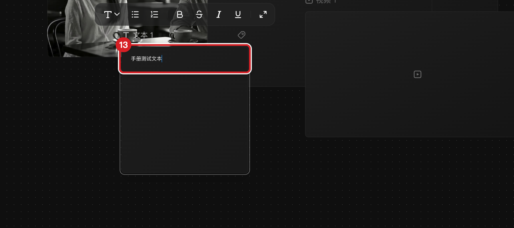

# 创建与编辑文本节点

## 适用角色

已登录的即梦画布创作者。

## 目标

创建文本节点、输入/修改富文本内容（标题、列表、加粗等）。

## 前置条件

已打开一个画布。

## 入口

- 左栏 **文本**（新建）。
- 双击已有文本节点（进入编辑）。

## 原子步骤

### 新建并编辑（实测）

1. 点击左栏 **文本** → 画布中央出现「文本 1」（320×320），自动选中。
2. **双击节点主体** → 进入编辑态，光标落入富文本编辑器（tiptap 编辑器）。
3. 输入文字（如「手册测试文本」）。
4. **点击空白处提交** → 节点显示新文本，编辑态关闭。
   - 成功判据：节点主体显示所输入文字；再次双击可继续修改。
- **注意**：双击**标题行**同样直接进入文本编辑（不是打开菜单）。

### 富文本格式（面板声明，实测编辑器为 tiptap）

快捷键面板的「文本编辑」组列出：加粗 **⌘B**、倾斜 **⌘I**、下划线 **⌘U**、
删除线 **⌘⇧X**、一级/二级/三级标题 **⌘⌥1/2/3**、普通文本 **⌘⌥0**、
无序列表 **⌘⇧8**、有序列表 **⌘⇧7**。
（以上为快捷键面板逐字声明；除基础输入与提交外未逐项执行。）

### 行内重命名（标题）

1. 悬停节点标题行 → 出现 **Rename** 钮（aria `Rename <节点名>`）。
2. 点击后标题变为输入框，改名后回车提交。
   （Rename 按钮存在性实测；改名提交动作未执行，保持画布原状。）

## 文本节点的选中工具条

选中文本节点时上方工具条为：**背景色** ｜ **全屏** ｜ **下载**。
- **背景色**：为文本卡片选择底色。
- 右键菜单含 复制 ⌘C/复制副本 ⌘D/粘贴 ⌘V/下载/撤销/删除（无「保存到主体库」，
  该项出现在媒体节点菜单）。

## 取消 / 恢复

- 编辑中想放弃：**不要点击空白**（会提交）；改回原文再提交，或提交后 **⌘Z**。
- 误删文本节点：**⌘Z** 立即恢复（删除可撤销）。

## 相关任务

[创建节点](create-first-node.md) ｜ [复制、删除与撤销](duplicate-delete-history.md) ｜
[帮助与快捷键](help-and-shortcuts.md)

## 已验证说明

新建、双击编辑、输入、点空白提交、右键菜单、背景色/全屏/下载工具条、Rename
按钮存在性为 2026-09-23 实测；富文本格式快捷键为面板声明，未逐项执行。

## 步骤图

