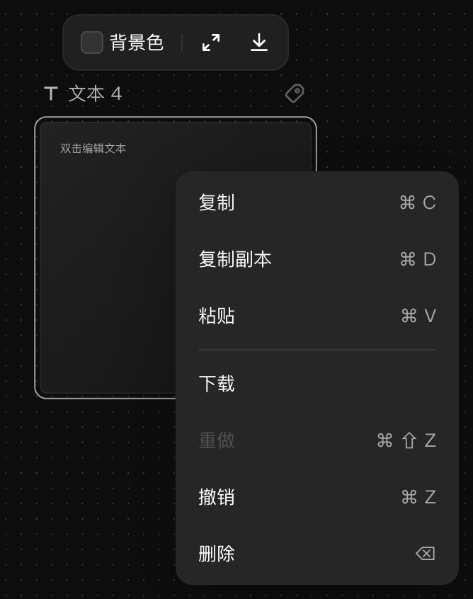
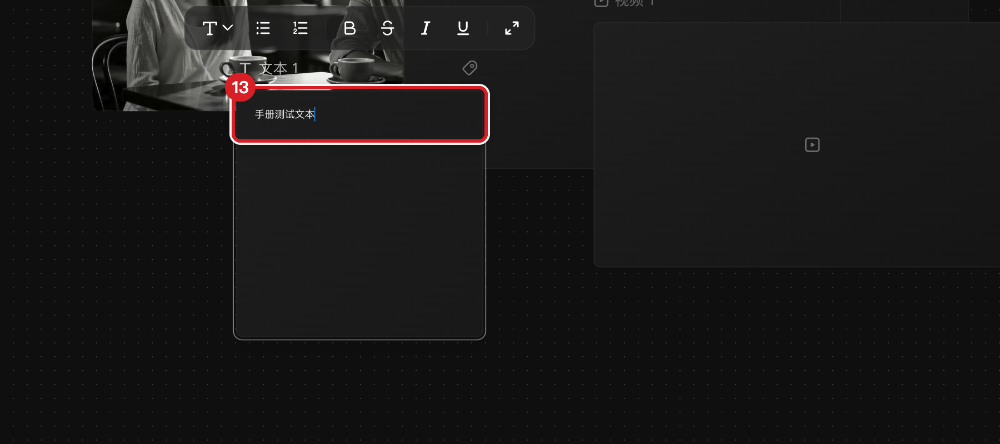
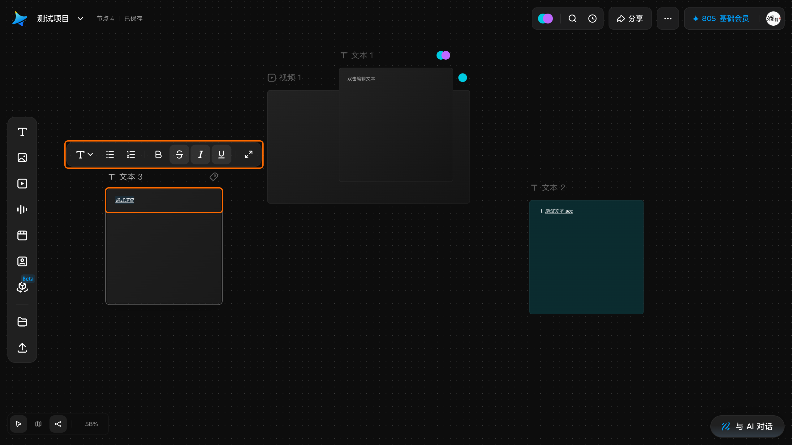
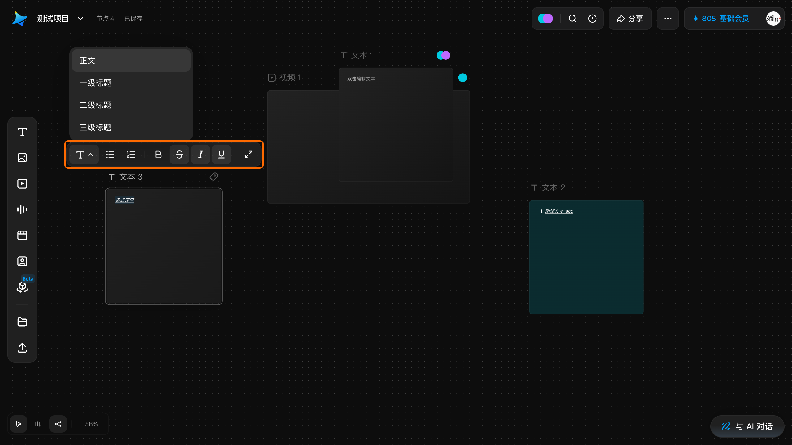

# 创建与编辑文本节点

## 适用角色

已登录的即梦画布创作者。

## 目标

创建文本节点、输入/修改富文本内容（标题、列表、加粗等）、给文本卡片换底色。

## 前置条件

已打开一个画布。

## 入口

- 左栏 **文本**（新建）。
- 双击已有文本节点（进入编辑）。

## 原子步骤

### 新建并编辑（实测）

1. 点击左栏 **文本** → 画布中央出现「文本 1」，自动选中。
2. **双击节点主体** → 进入编辑态，光标落入富文本编辑器。
3. 输入文字（如「格式速查」）。
4. **点击空白处提交** → 节点显示新文本，编辑态关闭。
   - 成功判据：节点主体显示所输入文字；再次双击可继续修改。
- **注意**：双击**标题行**同样直接进入文本编辑（不是打开菜单）。

编辑器是 **tiptap / ProseMirror**：DOM 为 `.ProseMirror`，带 `contenteditable="true"`。

### 编辑态工具条（实测，316×40）

进入编辑态后节点上方浮出工具条，共 8 个按钮，aria 逐字为：

`Text style`（显示为 **T ˅**）｜`无序列表`｜`有序列表`｜`加粗`｜`删除线`｜`倾斜`｜`下划线`｜`全屏`

> 顺序注意：删除线（B S）在**倾斜（I）之前**，与常见编辑器排布不同。

### 块级格式：Text style 菜单（实测）

点击 **T ˅** 向上弹出菜单，**共四项**（每项 192×36）：

**正文** ｜ **一级标题** ｜ **二级标题** ｜ **三级标题**

> 「普通段落」在菜单里的逐字文案是 **「正文」**，不是「普通文本」。

### 全部格式快捷键逐项实测（2026-10-01）

在编辑态、**先选中文字**的前提下，快捷键面板「文本编辑」组声明的 9 个快捷键
**全部可用**，实测 HTML 变化如下：

| 快捷键 | 实测结果 | 判定 |
|---|---|---|
| ⌘⌥1 | `<h1>格式速查</h1>` | 确认可用 |
| ⌘⌥2 | `<h2>格式速查</h2>` | 确认可用 |
| ⌘⌥0 | `
格式速查
` | 确认可用（回到正文） |
| ⌘⇧8 | `<ul><li>
…
</li></ul>` | 确认可用（无序列表） |
| ⌘⇧7 | `<ol><li>
…
</li></ol>` | 确认可用（有序列表） |
| ⌘B | `<strong>…</strong>` | 确认可用 |
| ⌘I | `<em>…</em>` | 确认可用 |
| ⌘U | `<u>…</u>` | 确认可用 |
| ⌘⇧X | `<s>…</s>` | 确认可用（删除线） |

> **重要前提**：行内快捷键（⌘B/⌘I/⌘U/⌘⇧X）**必须先有选区**。
> 对照实验：把光标折叠在文末（无选区）时按 ⌘B，`innerHTML` **无任何变化**；
> 全选后按 ⌘B 立即生效；只选 2 个字则只有这 2 个字被加粗
> （`
格式<strong>速查</strong>
`）——即**按词/按选区作用，不是全文切换**。
>
> 块级快捷键（⌘⌥0-3、⌘⇧7-8）不受此限制，光标在文内即可生效。

### 工具条按钮 vs 快捷键（实测等价）

四个行内按钮与对应快捷键效果一致，且**可叠加**：依次点击后得到
`
<strong><em><u><s>格式速查</s></u></em></strong>
`。
再次点击同一按钮可**逐层撤销**（点加粗 → `<em><s><u>`）。

### 节点背景色（实测）

选中（未进入编辑态）文本节点，工具条为三项：**背景色** ｜ **全屏** ｜ **下载**。

1. 点击 **背景色** → 下方展开 214×40 色板，**6 枚** 28×28 色块：

| 色板文案 | 色块 computed backgroundColor |
|---|---|
| 无颜色（当前选中，带白环） | `rgb(61, 61, 61)` |
| 青绿色 | `rgb(0, 202, 224)` |
| 靛蓝色 | `rgb(109, 124, 255)` |
| 紫色 | `rgb(190, 104, 255)` |
| 橙色 | `rgb(255, 146, 48)` |
| 黄色 | `rgb(255, 214, 0)` |

2. 点击任一色块 → 整张卡片底色即时变更，**工具条「背景色」按钮图标同步变色**。
   - 成功判据：卡片底色变化 + 按钮图标变为对应色块。
3. 选回 **无颜色** 即恢复默认深灰。

> 色板浮层的容器背景为 `rgb(38, 38, 38)`，圆角 12px。

### 行内重命名（标题）

1. 悬停或选中节点标题行 → 出现 **Rename** 钮（aria 逐字 `Rename <节点名>`）。
2. 🔴 **订正（批次 80）**：本页此前写「点击后标题变为输入框，改名后回车提交」——
   **未复现**。2026-10-02 试了三种点法，**没有任何一种让标题变成输入框**：
   ① 单击 Rename 钮；② 再单击一次；③ 双击标题行。
   三次之后全文档都**没有**出现 `input` / `textarea` / `contenteditable`
   （只有两个 `type=file` 的隐藏上传框），焦点仍停在 Rename 钮上。
   ⇒ 本页**不给出行内改名的可行路径**，因为没找到。
   若你要改名，可考虑先双击进入正文编辑，或用右键菜单的「复制副本」另建一个节点。

### 「全屏」打开的全屏文本编辑器（2026-10-01 实测）

工具条上的「**全屏**」按钮（以及快捷键 **F**）打开的是
`div[text-editor-fullscreen-dialog]` —— **铺满整个窗口的文本编辑器**。
🔴 **批次 82 订正：上面这个裸属性写法已被推翻**，它在真实 DOM 里匹配不到任何元素；
尺寸 `1280×720@0,0` 本身没错，错的只是定位方式。正确定位器是
`[data-testid="text-editor-fullscreen-dialog"]`：

| 项 | 实测 |
|---|---|
| 容器 | **1280×720@0,0** |
| 标题片 | 逐字 **`文本 3.md`**（节点名 + `.md`）**66×22@81,28** |
| 关闭钮 | aria 逐字 `Close full-screen editor` **36×36@1191,28** |
| 工具条 | `div[text-editor-toolbar]` **1173×40@53,84** |
| 分隔片 | `span[text-editor-toolbar-separator]` **8×16@627,96** |
| 正文区 | `div[text-editor-scroll-region]` **1173×596@53,124** |
| 工具条 7 项 | `Text style` 48×32@509,88 ｜ `无序列表` 32×32@559 ｜ `有序列表` 32×32@593 ｜ `加粗` 32×32@637 ｜ `删除线` 32×32@671 ｜ `倾斜` 32×32@705 ｜ `下划线` 32×32@739 |
| 右上角 | `下载` 80×36@1094,28 |
| 退出 | **Esc 一次即关**，关闭后画布工具条原样恢复 |

- 打开的瞬间，画布上的节点工具条（`node-toolbar` 192×40）与
  `node-feature-chrome-host`（192×192）**被顶掉**，关闭后恢复原样。
- ⚠️ **快捷键面板把 F 叫「预览视图」，但它并不是预览，而是全屏编辑。**
- ✅ **其它节点类型按 F 的行为已于 2026-10-01 批次 40/41 补齐**
  （本表只是文本节点这一格的契约）：
  **时间线** → 打开时间线全屏编辑器 ｜ **视频 / 图片** → 弹「此快捷键当前不可用」｜
  **主体** → F 被打进节点标题 ｜ **未选中任何节点** → 完全静默。

### 右键菜单（2026-10-02 批次 80 逐项复测，**7 项** `200×292`，每项 `192×36`）

按**实际顺序**：

| # | 逐字 | 快捷键 | 状态 |
|---|---|---|---|
| 1 | 复制 | ⌘C | 可点 |
| 2 | 复制副本 | ⌘D | 可点 |
| 3 | 粘贴 | ⌘V | 可点 |
| 4 | 下载 | — | 可点 |
| 5 | **重做** | ⇧⌘Z | **禁用**（`aria-disabled="true"`、`cursor: not-allowed`，无障碍文案「无需重做操作」） |
| 6 | 撤销 | ⌘Z | 可点 |
| 7 | 删除 | ⌫ | 可点 |

🔴 **订正（批次 80）**：本页此前只列了 **6 项，漏了「重做」**，
而且顺序也不对 —— 「重做」在**「下载」和「撤销」之间**。
（「保存到主体库」确实**不**在文本节点菜单里，那一项出现在媒体节点菜单。）

## 取消 / 恢复

- 编辑中想放弃：**没有「放弃」这一步**。实测（批次 80）**点空白**与**按 Esc 都会提交** ——
  按 Esc 后编辑器关闭、输入的文字已经落到节点上，且**节点仍保持选中**。
  ⇒ 唯一可靠的回退是**提交后按 ⌘Z**。
- 误删文本节点：**⌘Z** 立即恢复（删除可撤销，但**不跨刷新**）。
- 背景色改错：在色板里选 **无颜色** 即可复原。

## 相关任务

[创建节点](create-first-node.md) ｜ [复制、删除与撤销](duplicate-delete-history.md) ｜
[节点工具条](use-node-toolbar.md) ｜ [帮助与快捷键](help-and-shortcuts.md)

## 已验证说明

新建、双击编辑、输入、点空白提交、右键菜单、选中态工具条三项、**背景色色板全部
6 色取色与应用结果**、Rename 按钮存在性为 2026-09-23 ~ 2026-10-01 实测。

**2026-10-02 批次 80 复测（全册最陈旧页，从批次 40 起未再核）**：

1. 🔴 右键菜单实为 **7 项**，本页此前只列 6 项、漏「重做」，顺序也错（见上表）。
2. ✅ **编辑态按 Esc 是「提交」不是「撤销」**：编辑器关闭、文本落到节点、节点保持选中。
   ⇒ 编辑态**没有放弃路径**，只能提交后 ⌘Z。
3. 🔴 **行内改名未复现**：三种点法都不产生输入框（详见上文）。
4. 📏 **两个尺寸契约终于分清**（承接批次 78/79）：

   | 元素 | 是否随画布缩放 | 契约 |
   |---|---|---|
   | 节点浮动工具条 `node-toolbar` | **随**（60% → `192×40`、100% → `320×40`） | **canvas 恒 `320×67`**（🔴 批次 85 订正，原写 `192×40` 是把屏上值当 canvas 了） |
   | 右键菜单 `canvas-context-menu` | **不随**（60% 与 100% 都是 `200×292`） | **屏上恒 `200×292`** |
   | **生成面板 `node-toolbar`（空视频/图片/音频）** | **不随**（60/100/40% **一律 `680×208`**） | **屏上恒 `680×208`**（音频 `680×204`） |

   ⚠️ 测量陷阱：`[data-testid="node-toolbar"]` 在文档里有**两个** ——
   一个 `.react-flow__renderer` 下的**占位**、一个真身。
   **用单数 `querySelector` 会量到占位**（本轮第一次就量成了 `0×0`），必须按面积筛选。

   🔴 **批次 85 订正两条**：
   ① 「canvas 恒 `192×40`」错了——`192×40` 是**屏上**值，
   60% 下除以 0.6 得 canvas **`320×67`**。这是本册「屏上读数冒充 canvas」老病的又一次复发。
   ② 占位**不是恒 `0×0`**：选中**空视频/图片/音频**节点时，它是
   **「宽度 = 节点屏上宽、高度 = 0」**（视频 `341`@60% / `569`@100% / `228`@40%）；
   只有选中**文本**节点（弹浮动工具条时）它才是真 `0×0`。
   ③ 🔴 **`node-toolbar` 一个 testid 覆盖两类面板**：
   **生成面板 `680×208`（不随缩放）** 与 **文本节点浮动工具条 `192×40`@60%（随缩放）**。
   「`node-toolbar` = 节点浮动工具条」是**错的等式**——详见
   [准备生成](prepare-generation.md)。

**2026-10-01 更正两处早期结论**：

1. 早期记录称「⌘B/⌘I/⌘U/⌘⇧X 按压后页面无反应，疑被 macOS 系统层拦截」——
   **该结论错误，已推翻**。真实原因是**缺少选区**；补上选区后 4 个快捷键全部生效。
2. 早期记录称 Text style 菜单「仅三项，无普通文本项」——**不准确**。
   菜单实为四项，普通段落项的逐字文案是 **「正文」**。

## 步骤图

