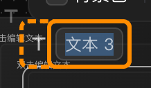
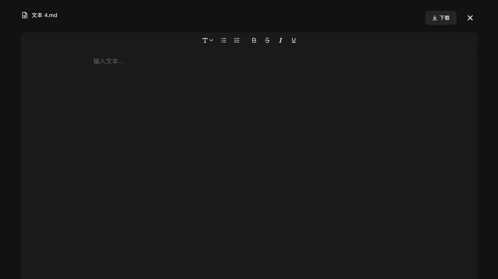
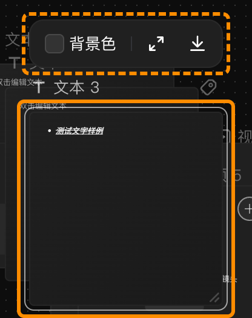
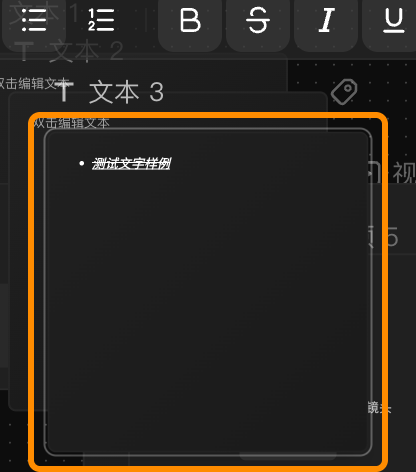
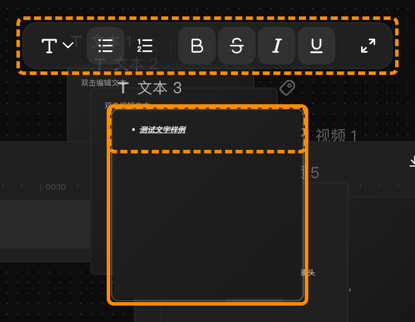

# 创建与编辑文本节点

## 适用角色

已登录的即梦画布创作者。

## 目标

创建文本节点、输入/修改富文本内容（标题、列表、加粗等）、给文本卡片换底色。

## 前置条件

已打开一个画布。

## 入口

- 左栏 **文本**（新建）。
- 双击已有文本节点（进入编辑）。

## 原子步骤

### 新建并编辑（实测）

1. 点击左栏 **文本** → 画布中央出现「文本 1」，自动选中。
2. **双击节点主体** → 进入编辑态，光标落入富文本编辑器。
3. 输入文字（如「格式速查」）。
4. **点击空白处提交** → 节点显示新文本，编辑态关闭。
   - 成功判据：节点主体显示所输入文字；再次双击可继续修改。
- **注意**：双击**标题行**同样直接进入文本编辑（不是打开菜单）。

编辑器是 **tiptap / ProseMirror**：DOM 为 `.ProseMirror`，带 `contenteditable="true"`。

### 编辑态工具条（实测，316×40）

进入编辑态后节点上方浮出工具条，共 8 个按钮，aria 逐字为：

`Text style`（显示为 **T ˅**）｜`无序列表`｜`有序列表`｜`加粗`｜`删除线`｜`倾斜`｜`下划线`｜`全屏`

> 顺序注意：删除线（B S）在**倾斜（I）之前**，与常见编辑器排布不同。

### 块级格式：Text style 菜单（实测）

点击 **T ˅** 向上弹出菜单，**共四项**（每项 192×36）：

**正文** ｜ **一级标题** ｜ **二级标题** ｜ **三级标题**

> 「普通段落」在菜单里的逐字文案是 **「正文」**，不是「普通文本」。

### 全部格式快捷键逐项实测（2026-10-01）

在编辑态、**先选中文字**的前提下，快捷键面板「文本编辑」组声明的 9 个快捷键
**全部可用**，实测 HTML 变化如下：

| 快捷键 | 实测结果 | 判定 |
|---|---|---|
| ⌘⌥1 | `<h1>格式速查</h1>` | 确认可用 |
| ⌘⌥2 | `<h2>格式速查</h2>` | 确认可用 |
| ⌘⌥0 | `
格式速查
` | 确认可用（回到正文） |
| ⌘⇧8 | `<ul><li>
…
</li></ul>` | 确认可用（无序列表） |
| ⌘⇧7 | `<ol><li>
…
</li></ol>` | 确认可用（有序列表） |
| ⌘B | `<strong>…</strong>` | 确认可用 |
| ⌘I | `<em>…</em>` | 确认可用 |
| ⌘U | `<u>…</u>` | 确认可用 |
| ⌘⇧X | `<s>…</s>` | 确认可用（删除线） |

> **重要前提**：行内快捷键（⌘B/⌘I/⌘U/⌘⇧X）**必须先有选区**。
> 对照实验：把光标折叠在文末（无选区）时按 ⌘B，`innerHTML` **无任何变化**；
> 全选后按 ⌘B 立即生效；只选 2 个字则只有这 2 个字被加粗
> （`
格式<strong>速查</strong>
`）——即**按词/按选区作用，不是全文切换**。
>
> 块级快捷键（⌘⌥0-3、⌘⇧7-8）不受此限制，光标在文内即可生效。

### 工具条按钮 vs 快捷键（实测等价）

四个行内按钮与对应快捷键效果一致，且**可叠加**：依次点击后得到
`
<strong><em><u><s>格式速查</s></u></em></strong>
`。
再次点击同一按钮可**逐层撤销**（点加粗 → `<em><s><u>`）。

### 节点背景色（实测）

选中（未进入编辑态）文本节点，工具条为三项：**背景色** ｜ **全屏** ｜ **下载**。

1. 点击 **背景色** → 下方展开 214×40 色板，**6 枚** 28×28 色块：

| 色板文案 | 色块 computed backgroundColor |
|---|---|
| 无颜色（当前选中，带白环） | `rgb(61, 61, 61)` |
| 青绿色 | `rgb(0, 202, 224)` |
| 靛蓝色 | `rgb(109, 124, 255)` |
| 紫色 | `rgb(190, 104, 255)` |
| 橙色 | `rgb(255, 146, 48)` |
| 黄色 | `rgb(255, 214, 0)` |

2. 点击任一色块 → 整张卡片底色即时变更，**工具条「背景色」按钮图标同步变色**。
   - 成功判据：卡片底色变化 + 按钮图标变为对应色块。
3. 选回 **无颜色** 即恢复默认深灰。

> 色板浮层的容器背景为 `rgb(38, 38, 38)`，圆角 12px。

### 行内重命名（标题）

1. 悬停或选中节点标题行 → 出现 **Rename** 钮（aria 逐字 `Rename <节点名>`）。
2. ✅ **路径找到了（2026-10-03 批次 117，推翻批次 80 的「未复现」）**：
   **双击那个 `Rename` 钮** ⇒ 标题行变成
   **`INPUT aria="Node title"`**（实测 `49×24@280,248`，初值是原节点名）。

   🔴 **订正（批次 80 → 批次 117）**：本页此前写「点击后标题变为输入框，改名后回车提交
   —— **未复现**……2026-10-02 试了三种点法，**没有任何一种让标题变成输入框**
   ……⇒ 本页**不给出行内改名的可行路径**，因为没找到」。
   **这个结论是错的，路径存在。**

3. ⚠️ **五种点法必须分开判**（批次 117 实测，A/B 两个判据不共享假设）：

| # | 操作 | 进**标题**编辑态 | 进**正文**编辑态 | 焦点落在 |
|---|---|---|---|---|
| ① | **单击** `Rename` 钮 | ❌ | ❌ | `BUTTON[Rename <名>]` |
| ② | **双击** `Rename` 钮 | ✅ | ❌ | **`INPUT[Node title]`** `49×24` |
| ③ | 单击 → **Enter** | ❌ | ✅ | **`DIV[aria="Text"]`** contenteditable |
| ④ | 单击 → **Space** | ❌ | ❌ | `BUTTON[Rename <名>]`（**什么也没发生**） |
| ⑤ | 单击后**立刻**双击 | ✅ | ❌ | `INPUT[Node title]` |

🔑 **批次 80 试的三种，恰好绕开了唯一有效的落点**：
它试的是「单击钮」「再单击一次」「双击**标题行**（避开按钮）」，
而有效的是「双击**那个按钮**」—— 按钮和它所在的标题行**是两个不同的落点**。

🔑 **③ 是个陷阱**：单击后按 `Enter` 进的是**正文**编辑器
（`DIV contenteditable aria="Text"`，出现在**卡片位置**，不在标题行），
不是标题改名。批次 80 很可能就是撞上了这个，才觉得「什么都没找到」。

📌 **判「有没有进标题编辑态」要按位置筛**：只看「有没有多出输入面」会把
**正文编辑器**也算进去；必须看**输入面是否落在标题行矩形内**。

✅ **批次 194 复测（50% 档）**：`input[aria-label="Node title"]` 存在、**值逐字是原节点名「文本 3」**、
屏上 **`49×24`**（与批次 117 记的 `49×24` 逐字一致）、**焦点就在它上面**、
**落在标题行矩形内 = `true`**、而**同一时刻 `.tiptap.ProseMirror` 数 = 0** ——
⇒ 最后这一格正是「**只看『有没有多出输入面』会把正文编辑器也算进去**」的实证：
**这里只有一个输入面**（正文编辑器根本没开），所以「按位置筛」与「数输入面」在本例上结论相同；
真正需要位置判据的是**③（单击 → Enter）**那条路，它会同时冒出正文编辑器。
📌 收尾：`Esc` 取消后节点 `aria` 仍是 `文本 node: 文本 3`、标题文字仍是 `文本 3` ⇒ **本轮没有真改名**。

📌 另：**单击后按 `Space` 在文本节点上什么也不发生**
（同一操作在**主体节点**上能进编辑态 —— 节点类型差异，见[主体节点](subject-node.md)）。

### 🆕 空文本节点的提示逐字是「双击编辑文本」（2026-10-03 批次 117）

自建的空文本节点，`innerText` 逐字 **`双击编辑文本 文本 4`** ——
**产品自己就把操作方式写在占位提示里了**（对照主体节点的「添加描述...」）。

它对应一个 testid：**`text-node-empty-placeholder`**。

⚠️ 有意思的是：占位提示说「**双击**」，而实测**双击标题行**进的是**正文**编辑器
（`aria="Text"`）—— 与提示不矛盾（双击进的是正文，这正是提示的意思），
但**改名**要双击的是**`Rename` 钮**，不是标题行。

### 🆕 文本节点的完整 testid 家族（17 个，批次 117 读全）

`text-flow-node-full`｜**`text-node-empty-placeholder`**｜`text-node-resize-controls`｜
`text-node-resize-top-left` / `-top` / `-top-right` / `-right` / `-bottom-right` /
`-bottom` / `-bottom-left` / `-left`（8 个缩放手柄）｜`textarea-resize-affordance`｜
`text-node-selection-outline`｜`flow-node-target-handle`｜`flow-node-title`｜
`flow-node-selected-tag`｜`flow-node-source-handle`｜`flow-node-source-connection-menu-button`

11 个按钮逐字：8 个 `Resize text from …`（各 `24×24` 或 `10×178`/`178×10` 的细长条，
后四个 aria 带 `Press Enter to reset this dimension`）＋ `Rename <名>` `38×24` ＋
`Add tags`（🔴 **批次 89 订正：屏上 `24×24` 不是契约** —— 屏上 =
`24px × 视口 scale × 该节点自身的 --octo-canvas-node-chrome-counter-scale`；
🔴 **批次 150 再订正**：原文「**各自的**」是在断言「同族不同节点必然不同」，而这从未被验证 ——
批次 150 建了**文本族 3 个节点**实测，该变量**三者逐字相同**（`1.6666666666666667`），
且**新建的文本节点上 `Add tags` 恒为 `24` 见方**（3/3）；
批次 88 记的 24/28/29 见方是**历史混合样本**的读数，与之不同源，机制仍待查）＋
`Create connected node after <名>` `36×36`。
**没有 `Create connected node before`**（与音频/视频节点不同）。

📌 **批次 150 在文本族上顺带逐字复现了本页的缩放手柄读数**（60% 下新建节点）：
四角 `24×24`、四边细长条 **`177.6×10` / `10×177.6`**、`text-node-resize-controls` `192×192`、
`text-node-selection-outline` `200×200`、`textarea-resize-affordance` `16×16`、
两个连线手柄 `36×72`、标题 `58.1×24`。
（页面上面写的 `10×178` / `178×10` 是取整写法，精确值是 `177.6`。）
⚠️ 这些元素**只在选中态出现** —— 文本族 3 个节点里前两个静息态全是 `null`。

### 「全屏」打开的全屏文本编辑器（2026-10-01 实测）

工具条上的「**全屏**」按钮（以及快捷键 **F**）打开的是
`div[text-editor-fullscreen-dialog]` —— **铺满整个窗口的文本编辑器**。
🔴 **批次 82 订正：上面这个裸属性写法已被推翻**，它在真实 DOM 里匹配不到任何元素；
尺寸 `1280×720@0,0` 本身没错，错的只是定位方式。正确定位器是
`[data-testid="text-editor-fullscreen-dialog"]`：

| 项 | 实测（2026-10-04 批次 144 复测，**逐字与 2026-10-01 批次 82 一致**） |
|---|---|
| 容器 | `[data-testid="text-editor-fullscreen-dialog"]`（`role="dialog"`）**1280×720@0,0** |
| 标题片 | 逐字 **`文本 4.md`**，**66×22@81,28** ⇒ 公式：**<节点标题> + `.md`** |
| 关闭钮 | aria 逐字 `Close full-screen editor` **36×36@1191,28** |
| 工具条 | `[data-testid="text-editor-toolbar"]` **1173.3×40@53,84**，**aria 逐字 `Text formatting`** |
| 分隔片 | `[data-testid="text-editor-toolbar-separator"]` **8×16@627,96** |
| 正文区 | `[data-testid="text-editor-scroll-region"]` **1173.3×596@53,124** |
| 🆕 占位 | `[data-testid="text-editor-fullscreen-placeholder"]` **80×26@240,145**，逐字 `输入文本…` |
| 工具条 7 项 | `Text style` 48×32@509,88 ｜ `无序列表` 32×32@559 ｜ `有序列表` 32×32@593 ｜ `加粗` 32×32@637 ｜ `删除线` 32×32@671 ｜ `倾斜` 32×32@705 ｜ `下划线` 32×32@739 |
| 右上角 | `下载` 80×36@1094,28 |
| 退出 | **Esc 一次即关**，也可用右上角的 ✕ 按钮（`Close full-screen editor`）；关闭后画布工具条**逐字**恢复 |

#### 🔑 编辑器里**只有 4 个 testid**（批次 144 首次数清）

`text-editor-fullscreen-dialog` 子树里的 `[data-testid]` **恰好 4 个**：
`text-editor-toolbar` / `text-editor-toolbar-separator` / `text-editor-scroll-region` /
`text-editor-fullscreen-placeholder`。
正文编辑器本身是 tiptap `ProseMirror` 的 `[contenteditable]`，**没有 testid**。

🔴 **`text-editor-fullscreen-scroll-region` 这个 testid 不存在**（实测命中 **0**）——
真身是 **`text-editor-scroll-region`**，**没有 `fullscreen` 前缀**。
（另有一个 `text-editor-placeholder` 也是 0 命中，`fullscreen` 那个才存在。）
⚠️ 这个错拼法来自 SOURCE_OBSERVATIONS §4.49 的「全灭 testid」分诊表 ——
它大概是**从 `text-editor-fullscreen-dialog` 顺推前缀**写出来的。
📌 **别从一个 testid 的名字顺推同族的名字**；同族的另几个（`text-editor-toolbar`）
就**没有** `fullscreen` 前缀。

- 打开的瞬间，画布上的节点 chrome **不是「被顶掉」，而是真的从 DOM 里移除**：
  批次 144 在**同条件下前后对比**（建节点 → 悬停 → 打开）实测，
  `node-toolbar` / `node-feature-chrome-host` / `selection-context-toolbar` /
  `selection-context-toolbar-popup-host` / `default-feature-overlay-interaction-boundary`
  **全部变成 0 个实例**，编辑器关闭后**逐字**恢复到打开前。
  ⚠️ 想复现这个对比，**基准必须是「同一个前置状态下」**——
  批次 144 b 轮把基准取在「建节点之前」，于是这些 testid 被算成「新增」而不是「消失」，
  一度让人以为 §3.56.2 记错了。
- ⚠️ **快捷键面板把 F 叫「预览视图」，但它并不是预览，而是全屏编辑。**
- ✅ **其它节点类型按 F 的行为已于 2026-10-01 批次 40/41 补齐**
  （本表只是文本节点这一格的契约）：
  **时间线** → 打开时间线全屏编辑器 ｜ **视频 / 图片** → 弹「此快捷键当前不可用」｜
  **主体** → F 被打进节点标题 ｜ **未选中任何节点** → 完全静默。

### 右键菜单（2026-10-02 批次 80 逐项复测，**7 项** `200×292`，每项 `192×36`）

按**实际顺序**：

| # | 逐字 | 快捷键 | 状态 |
|---|---|---|---|
| 1 | 复制 | ⌘C | 可点 |
| 2 | 复制副本 | ⌘D | 可点 |
| 3 | 粘贴 | ⌘V | 可点 |
| 4 | 下载 | — | 可点 |
| 5 | **重做** | ⇧⌘Z | **禁用**（`aria-disabled="true"`、`cursor: not-allowed`，无障碍文案「无需重做操作」） |
| 6 | 撤销 | ⌘Z | 可点 |
| 7 | 删除 | ⌫ | 可点 |

🔴 **订正（批次 80）**：本页此前只列了 **6 项，漏了「重做」**，
而且顺序也不对 —— 「重做」在**「下载」和「撤销」之间**。
（「保存到主体库」确实**不**在文本节点菜单里，那一项出现在媒体节点菜单。）

✅ **批次 95 第五次独立复核**：容器 `200×292`、7 项**逐字顺序与每项 `192×36` 与上表逐字一致**，
容器 testid 仍是 `canvas-context-menu`（**与画布空白处右键同一个 testid，但几何不同** ——
空白处是 `240×172`、对外可见项 `232×36`）。
⚠️ 前提：**节点不能处在编辑态**。编辑态下右键**弹不出菜单**（见下节）。

### 📌 编辑态与选中态是**两套完全不同的画布**（2026-10-02 批次 95）

「选中」和「编辑」在画布上长得**完全不一样**，不是「同一个框多了一根光标」：

| | 未选中 | 选中 | **编辑** |
|---|---|---|---|
| 工具条 | 无 | 有（背景色/全屏/下载） | **无** |
| 八向缩放把手 | 无 | 有 | **无** |
| 选中描边 | 无 | 有 | **无** |
| 右键菜单 | 弹得出 | 弹得出 | **弹不出来** |

**下面两张是同一个节点、画布 50%**（节点框在两图里的位置一致，可叠着看）：

⇒ 这就是「**两套完全不同的画布**」的实拍：工具条**从 3 项变 8 项**，
**八向把手与选中描边一起消失** —— 不是「同一个框多了一根光标」。

进入编辑态有**两种**方式（都已实测）：**双击**节点，或**在已选中的节点上再单击一次**。

⇒ **要复制/删除一个文本节点时，先确认它不是编辑态**：
如果刚点过它，按 **Esc 一次**退回选中态即可（编辑 → 选中 → 未选中，**Esc 是逐级回退**）。

### 🔑 编辑态的真身：TipTap / ProseMirror，而且**不在节点 DOM 里**（2026-10-02 批次 107）

这一条是批次 107 为了验一个快捷键而撞出来的，**它比那个快捷键本身更有用** ——
因为「怎么找到编辑器」是自动化与排障的第一个门槛。

| 项 | 实测 |
|---|---|
| 可编辑面 | **`DIV`**，class 逐字 **`tiptap ProseMirror min-h-full w-full py-canvas-text-node-content-block …`** |
| 属性 | `contenteditable="true"` + `role="textbox"` + `aria-label="Text"` + `aria-multiline="true"` + `translate="no"` |
| 位置 | **`192×116@544,312`**（60% 缩放下） |
| 焦点 | 进入编辑态后**焦点就在它上面** |
| 工具条 | `[data-testid="text-editor-toolbar"]` **`316×40@482,236`**，父元素 `DIV[text-editor-toolbar-boundary]` |
| 工具条 8 项 | `Text style` ｜ `无序列表` ｜ `有序列表` ｜ `加粗` ｜ `删除线` ｜ `倾斜` ｜ `下划线` ｜ `全屏` |

🔴 **两处都不在 `.react-flow__node` 里面** —— 可编辑面与工具条都是
**portal 出来的浮层**。本轮因此连着两轮把编辑器读成「没开」
（`节点内 [contenteditable] 数量 === 0`），而**编辑器明明开着**。
⇒ 📌 **判「在不在编辑态」不能只扫节点内部**，要么扫全局的 `.tiptap.ProseMirror`，
要么看 `document.activeElement` 是否 contenteditable。

✅ **批次 194 复测（50% 档，四项逐字对上）**：
`.tiptap.ProseMirror` 实例数 **1** ｜ **`.react-flow__node [contenteditable]` 数 = 0**（编辑器明明开着）｜
`编辑面在节点内 = false`（`closest('.react-flow__node')` 读出 `null`）｜ 焦点逐字是 **`DIV[Text]`**；
编辑面屏上 **`160×31`** —— ⚠️ **它只占卡片顶部一条窄带，不是整张卡片**（卡片是 `160×160`）。

#### 四个标题层级的**可测读数**（不靠肉眼）

正文直接是**真语义标签**（`.md` 上传的内容也照样被解析成 `H1/H2/H3/P`），
四个层级各有**固定且互不相同**的一组读数：

| 层级 | 标签 | 字号 | 字重 | 行高 | 元素盒子（60% 档） |
|---|---|---|---|---|---|
| 一级标题 | `H1` | **24px** | 500 | 40px | `163×24` |
| 二级标题 | `H2` | **18px** | 500 | 28px | `163×17` |
| **三级标题** | **`H3`** | **16px** | 500 | 24px | `163×14` |
| 普通文本 | `P` | **13px** | **400** | 22px | `163×13` |

⇒ **字号是单调递减的 `24 / 18 / 16 / 13`**，而只有普通文本的字重是 `400`。
这两条合起来足够区分四层，**不需要截图对比**。

#### ⏱ 双击进编辑态是**异步**的：等了 1.6 秒会读成「没生效」

批次 107 第一版在 `p.mouse.dblclick()` 之后只等 **1600ms**，读到的
`document.activeElement` 还是 `DIV`（**不带 `(ce)`**），于是判成「双击没进编辑态」；
到下一轮一开始再看，**同一个元素已经变成 contenteditable 了**。
⇒ 📌 **双击后至少等 3.5 秒再下结论。**
这与[使用音频节点](audio-node-voice.md)里「暂停要读两次采样」是同一类错：
**读数必须等状态真的落定，否则会把「还没生效」写成「没有」。**

## 取消 / 恢复

- 编辑中想放弃：**没有「放弃」这一步**。实测（批次 80）**点空白**与**按 Esc 都会提交** ——
  按 Esc 后编辑器关闭、输入的文字已经落到节点上，且**节点仍保持选中**。
  ⇒ 唯一可靠的回退是**提交后按 ⌘Z**。
- 误删文本节点：**⌘Z** 立即恢复（删除可撤销，但**不跨刷新**）。
- 背景色改错：在色板里选 **无颜色** 即可复原。

## 相关任务

[创建节点](create-first-node.md) ｜ [复制、删除与撤销](duplicate-delete-history.md) ｜
[节点工具条](use-node-toolbar.md) ｜ [帮助与快捷键](help-and-shortcuts.md)

## 已验证说明

新建、双击编辑、输入、点空白提交、右键菜单、选中态工具条三项、**背景色色板全部
6 色取色与应用结果**、Rename 按钮存在性为 2026-09-23 ~ 2026-10-01 实测。

**2026-10-02 批次 80 复测（全册最陈旧页，从批次 40 起未再核）**：

1. 🔴 右键菜单实为 **7 项**，本页此前只列 6 项、漏「重做」，顺序也错（见上表）。
2. ✅ **编辑态按 Esc 是「提交」不是「撤销」**：编辑器关闭、文本落到节点、节点保持选中。
   ⇒ 编辑态**没有放弃路径**，只能提交后 ⌘Z。
3. 🔴 **行内改名未复现**：三种点法都不产生输入框（详见上文）。
4. 📏 **两个尺寸契约终于分清**（承接批次 78/79）：

   | 元素 | 是否随画布缩放 | 契约 |
   |---|---|---|
   | 节点浮动工具条 `node-toolbar` | **随**（60% → `192×40`、100% → `320×40`） | **canvas 恒 `320×67`**（🔴 批次 85 订正，原写 `192×40` 是把屏上值当 canvas 了） |
   | 右键菜单 `canvas-context-menu` | **不随**（60% 与 100% 都是 `200×292`） | **屏上恒 `200×292`** |
   | **生成面板 `node-toolbar`（空视频/图片/音频）** | **不随**（60/100/40% **一律 `680×208`**） | **屏上恒 `680×208`**（音频 `680×204`） |

   ⚠️ 测量陷阱：`[data-testid="node-toolbar"]` 在文档里有**两个** ——
   一个 `.react-flow__renderer` 下的**占位**、一个真身。
   **用单数 `querySelector` 会量到占位**（本轮第一次就量成了 `0×0`），必须按面积筛选。

   🔴 **批次 85 订正两条**：
   ① 「canvas 恒 `192×40`」错了——`192×40` 是**屏上**值，
   60% 下除以 0.6 得 canvas **`320×67`**。这是本册「屏上读数冒充 canvas」老病的又一次复发。
   ② 占位**不是恒 `0×0`**：选中**空视频/图片/音频**节点时，它是
   **「宽度 = 节点屏上宽、高度 = 0」**（视频 `341`@60% / `569`@100% / `228`@40%）；
   只有选中**文本**节点（弹浮动工具条时）它才是真 `0×0`。
   ③ 🔴 **`node-toolbar` 一个 testid 覆盖两类面板**：
   **生成面板 `680×208`（不随缩放）** 与 **文本节点浮动工具条 `192×40`@60%（随缩放）**。
   「`node-toolbar` = 节点浮动工具条」是**错的等式**——详见
   [准备生成](prepare-generation.md)。

**2026-10-01 更正两处早期结论**：

1. 早期记录称「⌘B/⌘I/⌘U/⌘⇧X 按压后页面无反应，疑被 macOS 系统层拦截」——
   **该结论错误，已推翻**。真实原因是**缺少选区**；补上选区后 4 个快捷键全部生效。
2. 早期记录称 Text style 菜单「仅三项，无普通文本项」——**不准确**。
   菜单实为四项，普通段落项的逐字文案是 **「正文」**。

## 步骤图

