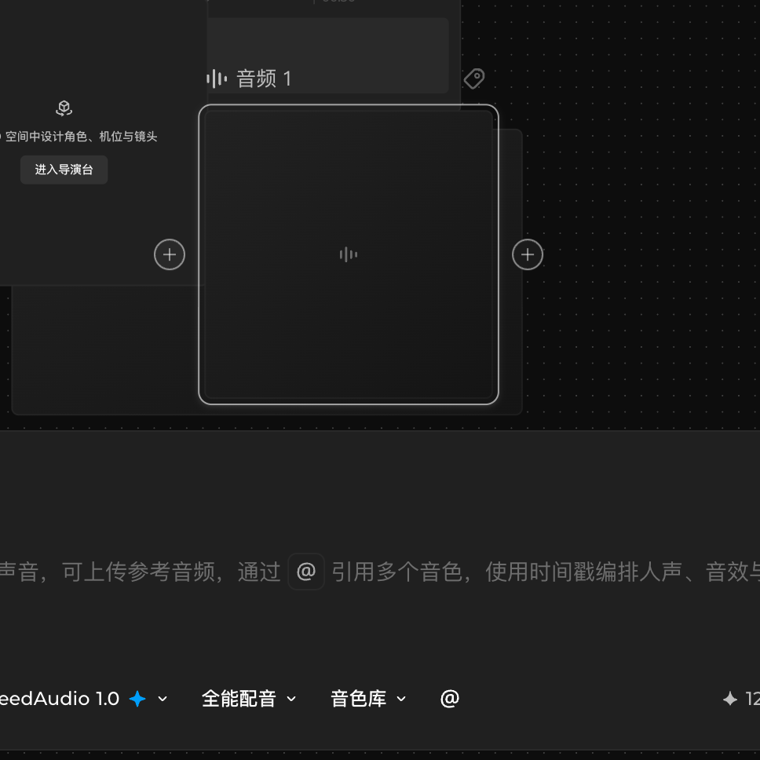

# 打开帮助与使用快捷键

## 适用角色

已登录的即梦画布创作者。

## 目标

找到帮助入口，查看画布快捷键全表，并知道每一项在你当前版本里是否真的可用。

## 前置条件

已打开画布。

## 入口

顶栏 **用户菜单**（右上角头像）→ 菜单（**2026-10-01 实测六项**）：帮助中心 ｜ 使用手册 ｜
**快捷键** ｜ AI生成水印设置 ｜ 即梦CLI ｜ **新功能许愿**。菜单实测 240×312，
顶部还有一块账号信息区（头像 + 昵称，**截图已脱敏**）。

**快捷键** 会在右侧滑出一个抽屉面板，标题「快捷键」，右上角 ✕ 关闭。实测 **240×604**，
内容需**向下滚动**（可滚动高度 1300 > 可见 548）才能看完四组。

## 快捷键全表（面板逐字，2026-10-01 复核 / 2026-10-02 重抓）

面板把快捷键分成四组：通用操作 / 视图 / 时间线 / 文本编辑。

> ✅ **2026-10-02 批次 82 把整个面板重抓了一遍**：滚动区
> `[data-testid="shortcut-help-scroll-region"]`（可滚动 **1300**、可见 **548**，
> 抽屉本体 **240×604@1028,56**），逐行导出 **62 行**，
> 扣掉 4 个组标题恰好 **28 项**——与下面四张表**逐字一致，无漏项、无多项**。
> 这是本手册第二次全量对账（第一次 2026-10-01），结论不变。

### 通用操作

| 功能 | 快捷键 |
|---|---|
| 打开/关闭 Agent | ⌘ / **（2026-10-01 已实测：两按两态）** |
| 撤销 | ⌘ Z |
| 还原 | ⌘ ⇧ Z **（2026-10-01 已实测可用）** 或 ⌘ Y（**同日亦实测可用**） |
| 移动工具 | V |
| 预览视图 | F |
| 宫格视图 | G |
| 创建编组 | ⌘ G |
| 取消编组 | ⌘ ⇧ G |

### 视图

| 功能 | 快捷键 |
|---|---|
| 放大视图 | ⌘ + |
| 缩小视图 | ⌘ − |
| 适配画布 | ⇧ 1 或 ⌘ 0 |
| 缩放至 100% | ⌘ 1 |
| 缩放至选中项 | ⇧ 2 |
| 缩放画布 | `⌘ scroll` |

### 时间线

| 功能 | 快捷键 |
|---|---|
| 分割片段 | ⌘ B |
| 向左裁剪 | Q |
| 向右裁剪 | W |
| 缩放时间线 | `⌘ scroll` |

### 文本编辑

| 功能 | 快捷键 |
|---|---|
| 加粗 | ⌘ B |
| 倾斜 | ⌘ I |
| 下划线 | ⌘ U |
| 删除线 | ⌘ ⇧ X |
| 一级标题 | ⌘ ⌥ 1 |
| 二级标题 | ⌘ ⌥ 2 |
| 三级标题 | ⌘ ⌥ 3 |
| 普通文本 | ⌘ ⌥ 0 |
| 无序列表 | ⌘ ⇧ 8 |
| 有序列表 | ⌘ ⇧ 7 |

> **⌘ B 出现两次**：时间线里是「分割片段」，文本编辑里是「加粗」。同一个键按当前
> 焦点落在哪个对象上生效——在时间线上按是分割，在文本里按是加粗。
>
> 🔴 **2026-10-02 批次 82 补一个更要紧的**：`⌘ scroll` 也**出现两次**——
> 「视图」组的**缩放画布**和「时间线」组的**缩放时间线**用的是**同一个键**，
> 而且面板上**两处写出来的字符串逐字一模一样**。
> ⇒ 光看面板你**分不出**这两个功能共用一个键，只能靠「当前焦点在画布还是在时间线」判断。
> 这和 ⌘B 是同一回事，区别在于 ⌘B 的两个名字不同、容易发现，**`⌘ scroll` 是两个名字也相同**。
> 抓面板数据时按字符串去重会把第二次出现吃掉——本批第一次抓就栽在这儿，
> 「缩放时间线」看起来像没有键。
>
> **两处面板文案与本手册用词不同，照抄即可**：
> - 面板把缩放类写作 **`⌘ scroll`**（英文 scroll），本手册此前译作「⌘ + 滚轮」——
>   2026-10-01 已按面板逐字订正为 `⌘ scroll`。
> - 面板的「缩小视图」是**半角** `⌘ -`，本手册写作 `⌘ −`（U+2212 减号），
>   视觉等价、便于阅读，按键本身相同。
> - 面板的「普通文本 ⌘⌥0」指的是**正文**；而文本编辑器里的 Text style 菜单
>   那一项逐字叫「**正文**」。同一个功能，**两处文案不同**，别以为是两项。

## 逐项实测结果（2026-10-01，1280×720 视口）

面板声明的是产品意图，**下面才是你这一版能不能按出效果**。两栏都可能不一致。

### 确认可用

| 快捷键 | 实测结果 |
|---|---|
| ⌘ 0 / ⇧ 1（适配画布） | 视口缩放从 100% 变为 62%，全部节点回到视野内 |
| ⌘ 1（缩放至 100%） | 缩放从 62% 回到 100% |
| ⌘ + / ⌘ − | 100% → 120% → 100%，逐级生效 |
| ⌘ G（创建编组） | 6 节点 → **7 节点**（组卡片本身计入节点数），组卡片出现 |
| ⌘ ⇧ G（取消编组） | 7 节点 → 6 节点，成员恢复并保持选中 |
| ⌘ Z（撤销） | 可撤销布局重排、编组/解组，**也可撤销删除**（实测：删掉一个节点后按一次 ⌘Z 即恢复；再按继续回退到删除前、建节点前） |
| ⌘ V（粘贴） | 面板未列出，但实测可粘贴出一个副本节点（节点数 +1） |
| ⌘ D（复制副本） | 面板未列出，复制节点实测可用 |
| **⌘ Y（还原）** | **2026-10-01 批次 21 实测可用**：⌘D → ⌘Z 造出可重做历史后按 ⌘Y，`1 node` → `2 nodes`，两轮复现 |
| ⌘ ⌥ 1 / ⌘ ⌥ 2 / ⌘ ⌥ 0 | 文本编辑态实测生效：`<h1>` / `<h2>` / `
` |
| ⌘ ⇧ 8 / ⌘ ⇧ 7 | 文本编辑态实测生效：`<ul><li>` / `<ol><li>` |
| ⌘ B / ⌘ I / ⌘ U / ⌘ ⇧ X | 文本编辑态**有选区时**实测生效：`<strong>` / `<em>` / `<u>` / `<s>`，可叠加 |
| ⌘ B（分割片段） | 时间线内**播放头位于片段内时**实测生效：`2 clips` → `3 clips`，5.0 秒切成 2.2 + 2.8 秒 |
| **⌘ /（打开/关闭 Agent）** | **2026-10-01 逐项实测可用**：按一次右侧 Agent 抽屉出现（`canvas-agent-*` 容器 0 → 7 个有面积的元素，焦点移到 `ASIDE`），再按一次完全收起（7 → 0），画布状态与积分均不变 |
| **⌘ + 滚轮（缩放画布）** | **2026-10-01 逐项实测可用**：`60%` → `72%` → 反向滚回 **`60%`**（transform 与起点逐字相同）。一格 = 12 个百分点 |

> **同一个 ⌘B 在两处都是真的**：焦点在文本里是加粗，焦点在时间线片段里是分割。
>
> **文本编辑组的前置条件（实测对照）**：块级键（⌘⌥0-3、⌘⇧7-8）光标在文内即可生效；
> 行内键（⌘B/I/U/⌘⇧X）**必须先选中文字**——把光标折叠在文末再按 ⌘B，
> 编辑器 `innerHTML` 完全不变；选中 2 个字则只有这 2 个字被加粗。
> 详见 [创建与编辑文本节点](edit-text-node.md)。
>
> **时间线的 ⌘B 前置条件**：播放头必须落在目标片段**内部**。落在两段之间的空隙时
> 按 ⌘B 只会弹提示「将播放头移动到目标片段内进行剪切。」，片段数不变。

### 声明了但当前不可用

| 快捷键 | 实测结果 |
|---|---|
| G（宫格视图） | **必须先选中节点**才会给反馈：顶部弹提示「**此快捷键当前不可用**」（**360×44@460,32**，实测 **300ms 内**出现）。**未选中任何节点时按 G，画面完全无变化、连提示都没有** —— 别把「没提示」当成「没按到」 |
| Q（向左裁剪） | 无有效前置时弹同一个提示「**此快捷键当前不可用**」；等价功能改用片段左侧把手 `向左裁剪` 拖动。详见[时间线节点](timeline-node.md) |
| W（向右裁剪） | 同上；改用片段右侧把手 `向右裁剪` 拖动 |

> 那句「此快捷键当前不可用」是**同一个提示复用于 G / Q / W**。
> ⚠️ **判断「这个键有没有被按下」，不能只看有没有提示** ——
> **未选中节点时 G 连提示都不给**，必须先选中再按才看得到。

#### 🔑 「选中」其实有**三层前置**，少一层就什么都看不到（2026-10-02 批次 82 实测）

G 是全册最能踩坑的一个键。同一个 G，三种前置给出**三种完全不同的结果**：

| 做到了哪几层 | 焦点落在哪 | 按 G 的结果（实测） |
|---|---|---|
| 只做到「有节点被选中」 | 节点上（点标题行） | 🔴 **完全静默**：采样 2500ms，无提示、无任何可见元素增减 |
| 「选中」+「**焦点在画布**」 | `.react-flow__pane` | ✅ 300ms 内弹「此快捷键当前不可用」`360×44@460,32`，可见元素 +12 |
| 「选中」但焦点在 **Agent 面板** | Agent 抽屉里的输入框 | 🔴 键盘事件被输入框吃掉，画布毫无反应 |

- 🔑 **怎么同时拿到前两层**：**在空白处按住鼠标拖出一个矩形框选**——
  按下的位置在画布空白上，松开也在画布上，焦点自然留在画布，同时罩住的节点被选中。
  只点节点标题行是**拿不到焦点那层的**（焦点会跑到节点上）。
- ⛔ **别在 Agent 抽屉开着的时候按画布快捷键**：按 **⌘ /** 打开的 Agent 面板
  底部有个输入框，键盘焦点一旦进去，画布快捷键就全部失效。
  先按 **Esc** 或再按一次 **⌘ /** 把它收掉再操作画布。

### 🔑 F（预览视图）名不副实：它按节点类型打开**对应的全屏编辑器**

面板写「**预览视图 F**」，实测它**不是预览，而是「把当前节点类型的编辑器铺满全屏」**：

| 当前选中的节点 | 按 F | 打开的东西 |
|---|---|---|
| **文本** | ✅ | `text-editor-fullscreen-dialog` **1280×720**（详见下） |
| **时间线** | ✅ | `timeline-fullscreen-editor` **1280×720**（即节点上的「全屏编辑」） |
| **视频 / 图片** | ❌ | 顶部提示「**此快捷键当前不可用**」（外层 `DIV` **360×44@460,32**，两者完全同型） |
| **音频** | 🔴 **完全静默** | **既不开编辑器，也不报「不可用」** —— 8 次密集采样（t=0…3000ms）可见元素**恒 513、零新增**。**看起来像 F 没绑定** |
| **主体** | 🟡 | **F 会被当成字母打进节点标题** —— 选中主体节点时标题输入框就已自动聚焦，标题从 `主体 1` 变成 **`f`**。见[使用主体节点](subject-node.md) |
| **什么都没选** | ❌ | **完全静默，连提示都没有**（与**音频**同型） |
| 导演台 | ⛔ | **未验证** —— ⚠️ 见下方「为什么仍然不按 F」 |

- ⚠️ **它被归在「通用操作」组，但实际是上下文相关的** —— 不同节点类型结果完全不同。
- 🔑 **F 有三种截然不同的结局**：**打开编辑器**（文本、时间线）、
  **报「不可用」**（视频、图片）、**完全静默**（音频、什么都没选），
  外加第四种**变成打字**（主体）。
- 🔴 **批次 60 订正**：本手册此前写「**媒体类（视频、图片）明确报不可用**」——
  那是从**两个样本**归纳的。音频是第 3 个媒体类型，实测**不报「不可用」而是完全静默**。
  ⇒ 这条规律**不成立**，别拿它去预测没试过的类型。

#### 🔑 为什么「音频」这一行**曾经**写着「未验证」，而那个理由已经过期

原文写「**音频节点需素材**」。🔴 **这个理由在本批次之前就已经不成立**：
批次 57 与 59 都已经从左栏**建成过空音频节点**并完整测过（批次 59 还量了它的 7×7 连线矩阵），
**根本不需要素材**。
⇒ 「未验证」是**遗留状态没销账**，不是**当下真的做不了**。

#### ⛔ 为什么「导演台」这一行仍然不按 F —— 而且原来的理由也是错的

原文写「**导演台属跨页面动作需授权**」。🔴 **张冠李戴**：
那条授权管的是**点「进入导演台」那个按钮**，
而这一行要测的是**按 F 键**——是另一件事。
**按 F 会不会跳进 3D 工作台，恰恰是未知的**；真按下去若触发了跳转，
做的就正是那件没获授权的事。
⇒ 本批**不按**，但理由必须落在**真正的**风险上：
**不是「按钮会导航」，而是「按键本身未测会不会导航，未验证，因此不冒险」。**
- **前提是先选中节点**，且 **Esc 一次即关**。

#### 全屏文本编辑器（F 在文本节点上打开的就是它）

| | 实测 |
|---|---|
| 容器 | `[data-testid="text-editor-fullscreen-dialog"]` **1280×720@0,0**（外层另有 `fixed inset-0` 遮罩，`data-state="open"`） |
| 标题片 | 逐字 **`文本 3.md`**（节点名 + `.md`）**66×22@81,28** |
| 关闭钮 | aria 逐字 `Close full-screen editor` **36×36@1191,28** |
| 工具条 | `[data-testid="text-editor-toolbar"]` **1173×40@53,84** |
| 正文区 | `[data-testid="text-editor-scroll-region"]` **1173×596@53,124**，其中编辑器本体 `800×106@240,125` |
| 退出 | **Esc 一次即关**（实测），关闭后节点工具条原样恢复 |

> 🔴 **2026-10-02 批次 82 订正**：本页此前把容器写作 `div[text-editor-fullscreen-dialog]`，
> 那是**裸属性选择器**，在真实 DOM 里**匹配不到任何元素**（实测 `[text-editor-fullscreen-dialog] → 无`，
> 而 `[data-testid="text-editor-fullscreen-dialog"] → 1280×720@0,0`）。
> 尺寸本身没错，**错的是定位方式**。⚠️ 用错选择器会得出「F 什么也没打开」的假结论——
> 本批就因此连着四轮误判 F 失效。

#### 全屏编辑器的工具条上到底有什么（2026-10-02 新测）

| 位置 | 尺寸 | 逐字名称 |
|---|---|---|
| 509,88 | `48×32` | Text style 菜单钮（`data-state="closed"`，**没有 aria**，只能看位置和图标） |
| 559,88 | `32×32` | 无序列表 |
| 593,88 | `32×32` | 有序列表 |
| 627,96 | `8×16` | 分隔线（`[data-testid="text-editor-toolbar-separator"]`，是个 `SPAN`） |
| 637,88 | `32×32` | 加粗 |
| 671,88 | `32×32` | 删除线 |
| 705,88 | `32×32` | 倾斜 |
| 739,88 | `32×32` | 下划线 |
| 1094,28 | `80×36` | 下载 |

正文区是空的文本节点时，中央有占位符 `[data-testid="text-editor-fullscreen-placeholder"]`
**`80×26@240,145`**，逐字「**输入文本…**」。

详见[创建与编辑文本节点](edit-text-node.md)。

### ⌘ + 滚轮（缩放画布）

**可用。** 实测 `60%` → `⌘ + 滚轮上` → **`72%`** → 反向滚一格 → **精确回到 `60%`**
（`translate(255.967px, 71.8048px) scale(0.6)` 与起点逐字相同）。
滚轮一格 = **12 个百分点**。⚠️ 不带 ⌘ 的普通滚轮是**平移**，两者别混。

### 需要前置条件才生效

| 快捷键 | 前置条件 |
|---|---|
| ⌘ G / ⌘ ⇧ G | 必须框选出 2 个以上节点；只选 1 个或 0 个时无反应 |
| ⌘ B（时间线分割） | 必须先**选中片段**且**播放头在该片段内部**；播放头落在片段之间的空隙时只弹提示 |
| F / G | **必须先选中节点**，且**键盘焦点要在画布上**——详见上面「三层前置」一节。缺任何一层都是**完全静默**（不是弹「不可用」） |
| ⌘ + 滚轮 | 焦点在画布上才生效；不带 ⌘ 的普通滚轮是平移 |
| **所有画布快捷键** | **Agent 面板开着就全部失效**（按 ⌘ / 打开，Esc 或再按 ⌘ / 收起） |

### 按了没反应

| 操作 | 实测结果 |
|---|---|
| ⌘ A（全选） | 面板未列出。实测把焦点放到画布后按 ⌘A，选中数不变（**前置已断言：确实有 2 个处于选中**） |
- **Shift + 点选**（面板未列出）**实测是标准的 toggle 语义**：
     - 点**未选中**的节点 → **加选**（实测 2 → 3）；
     - 点**已选中**的节点 → **取消选中它**（实测 2 → 1）。
   🔧 2026-10-01 批次 56 订正：早前写「**Shift+点选不是加选、反而会取消选中**」是
   **只测了后一支就外推**——那次的场景是「1 选中 + Shift 点那一个」= 0 选中，
   看到的是 toggle 的取消分支。**加选是正常可用的。**
| **⇧ 2（缩放至选中项）** | 面板列了，但**直接按键无效** —— 2026-10-01 实测：选中节点后按 ⇧2 缩放读数毫无变化；**必须走底部缩放菜单点该项**才生效。详见[平移缩放与视图](navigate-canvas.md) |
| **V（移动工具）** | **2026-10-01 逐项实测：它不切换工具。** 按 V 前后 dock 工具按钮的 aria 逐字不变（都是 `选择工具`），`aria-pressed` 也不变，画布全页可见 DOM 差分 **0 新增 / 0 消失**。⚠️ 切工具请点 **dock 第一个按钮** **2026-10-02 批次 82 在三种前置下各复测一遍，结论不变**：0 选中 / 1 选中 / 3 选中，dock 的 `aria` 与 `aria-pressed` 全部逐字不变，可见元素数一字不差。**「V 是不是因为没选中才不生效」这个解释被排除了** |
| **⌘ 0（适配画布）** | **2026-10-02 复测可用**：本批进场时画布缩放是 **13%**（因为画布上有个节点摆在很远的 `x≈4168` 处），按 ⌘0 后变成 **24%**，连读两次读数相同（已静止）。⚠️ **「适配」的结果由画布上所有人的节点位置决定**，同一个键在不同的画布上会给出不同的百分比 |
| **⌘ 1（缩放至 100%）** | **2026-10-02 复测可用**：⌘0 之后再按 ⌘1，读数 **24% → 100%**，同样连读两次相同 |
| F（预览视图） | **未选中节点时完全无反应**（选中后才打开全屏文本编辑器，见上）。**2026-10-02 复测**：0 选中 + 焦点确在画布（`.react-flow__pane`）+ 采样 2500ms，无提示、无可见元素增减 |
| G（宫格视图） | **未选中节点时完全无反应**（选中后才弹「此快捷键当前不可用」，见上）。**2026-10-02 复测**：0 选中 + 焦点在画布 + 采样 2500ms，同样一个字节都没变 |

> **多选就用框选**：在空白处按住鼠标拖出一个矩形，罩住的节点会一起选中
> （实测一次罩住 6 个）。⌘A 不存在；Shift+点选可用但要记住它是 **toggle**。

## 重要：撤销 ⏎ 只在「没刷新」的时候有效

面板只说「撤销 ⌘Z」，没说清范围和时限。实测结论：

- ✅ 能撤销：删除节点、布局重排、编组/解组、节点移动、文本编辑等；
  实测删掉一个节点后按一次 ⌘Z 即恢复，继续按还能一路回退到建节点之前。
- ⏎ **但撤销历史不跨刷新**。刷新页面（或关掉标签页）后，⌘Z 就不再回退任何内容——
  这时误删就只能重做了。

所以删除后的第一反应是**立刻按 ⌘Z**，不要先去干别的事再回来找。

## 原子步骤

1. 点击 **用户菜单** → **快捷键** → 右侧抽屉按四组列出全表。
2. 向下滚动抽屉可看到「时间线」「文本编辑」两组。
3. 点右上角 **✕** 或按 **Esc** 关闭。

## 常见错误与恢复

| 现象 | 处理 |
|---|---|
| 按 G 没反应 | 该快捷键当前不可用（会弹提示），改用布局菜单的「宫格布局」 |
| 按 Q / W 没反应 | 这两个键当前不可用；拖片段左右的窄把手改时长 |
| ⌘B 没反应 | 看焦点：文本里要先选中文字，时间线里播放头要在片段内部 |
| ⌘G 没反应 | 先框选 2 个以上节点，只选 1 个不会成组 |
| ⌘Z 按了回不去 | 多半是页面刷新过——撤销历史不跨刷新，只能重做 |
| 不知道某个键干什么 | 直接开这个面板对照，声明与实际不符以上表为准 |

## 相关任务

[平移缩放与视图](navigate-canvas.md) ｜ [编组、排列与整理](organize-group-layout.md) ｜
[复制、删除与撤销](duplicate-delete-history.md)

## 已验证说明

面板四组全表为 2026-10-01 登录会话逐字抓取（1280×720，zh-CN，Asia/Shanghai）。
「逐项实测结果」全部为同日实测：视图组与编组/解组/撤销/粘贴为可观察结果；
G 的不可用提示、Shift 点选的反向行为、⌘Z 可撤销删除但**不跨刷新**（当日两轮对照
实测：同会话内可恢复，reload 后连按 10 次无反应），均为当场复现。
**文本编辑组 9 个快捷键已于 2026-10-01 全部逐键实测**（进入文本编辑态后），
结论见上方表格；早期「⌘B/I/U/⌘⇧X 被系统拦截」的记录已推翻，真实原因是缺选区。
**时间线组也已逐键实测**：⌘B 在播放头位于片段内时生效；Q / W 确认无效
（与 G 同属「声明了但当前不可用」），但功能本身可通过片段两侧把手实现。
**🔑 2026-10-01 批次 39 把「未确认项」清零**：V / F / ⌘ / / ⌘+滚轮 四项**全部逐键实测**，
结论分别是「**V 不切换工具**」「**F 需先选中节点、打开的是全屏文本编辑器**」
「**⌘/ 可开关 Agent 抽屉**」「**⌘+滚轮 可缩放、一格 12 个百分点**」，
并顺带测出**G 与 F 在未选中节点时完全静默**（G 的「此快捷键当前不可用」提示
只在选中节点后才出现，此前记述漏了这个前置条件）。
本手册的快捷键表**已无未确认项**。

**2026-10-02 批次 82 复盘**（详见 `SOURCE_OBSERVATIONS.md` §4.01）：
- ✅ 面板**全量重抓 62 行 / 28 项**，与本页四张表**逐字一致**；
  另钉下 `⌘ scroll` 在面板上**出现两次**（缩放画布 / 缩放时间线，字符串完全相同）。
- ✅ **V** 在 0 / 1 / 3 选中三种前置下复测，恒不切工具；
  **⌘ 0**、**⌘ 1** 复测可用；**⌘ /** 在 0 选中与 1 选中下都能开关 Agent 面板。
- 🔴 **「选中」是三层前置，不是两层**——「有节点选中」还必须加上「**焦点在画布**」。
  只满足前者时 G 与 F 都是**完全静默**。本批因此连续四轮误判 G/F 失效。
- 🔴 **本页原有的全屏编辑器选择器 `div[text-editor-fullscreen-dialog]` 是错的**：
  那是裸属性选择器，真实 DOM 里匹配不到（它是 `data-testid`）。
  **用错选择器会把「F 能用」读成「F 什么也没打开」**——本批就栽在这里。
- ⚠️ 本批唯一**没做成**的事：块选到「**恰好 1 个**节点」。
  这块画布上的节点大面积交叠（基线「文本 1/2/3」canvas 坐标彼此盖住），
  框选边缘收到 2px 也仍然选中 2 个；最后靠**框选 + Shift 点选 toggle**（2 → 1）达成。

## 步骤图

