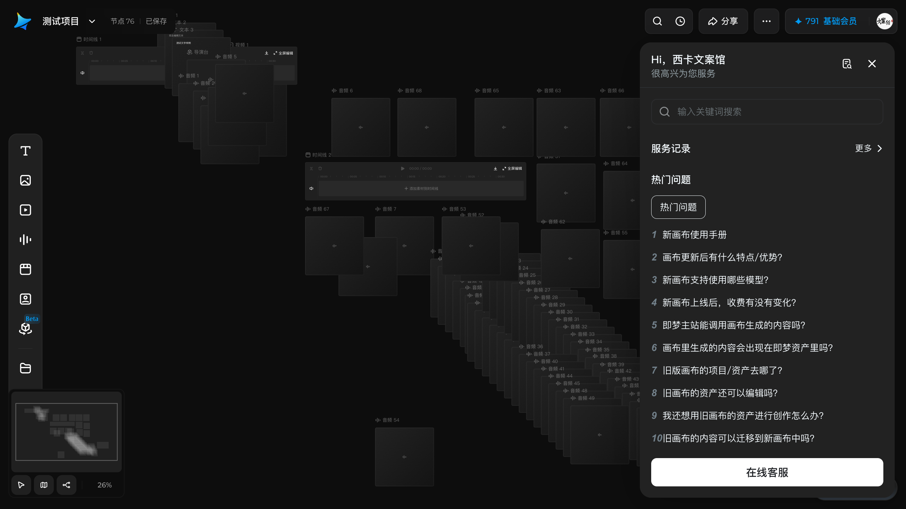
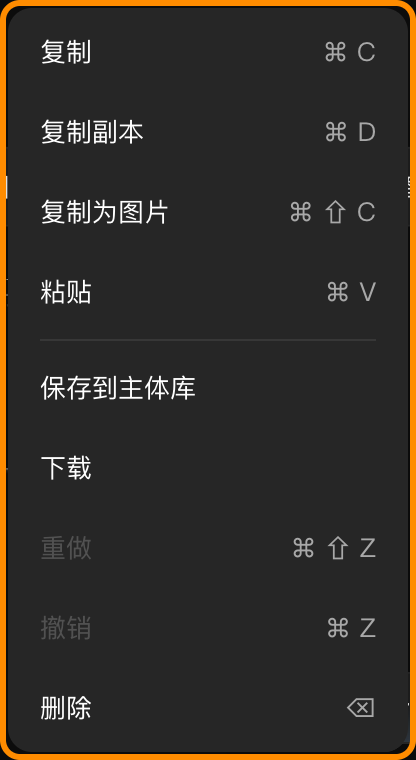
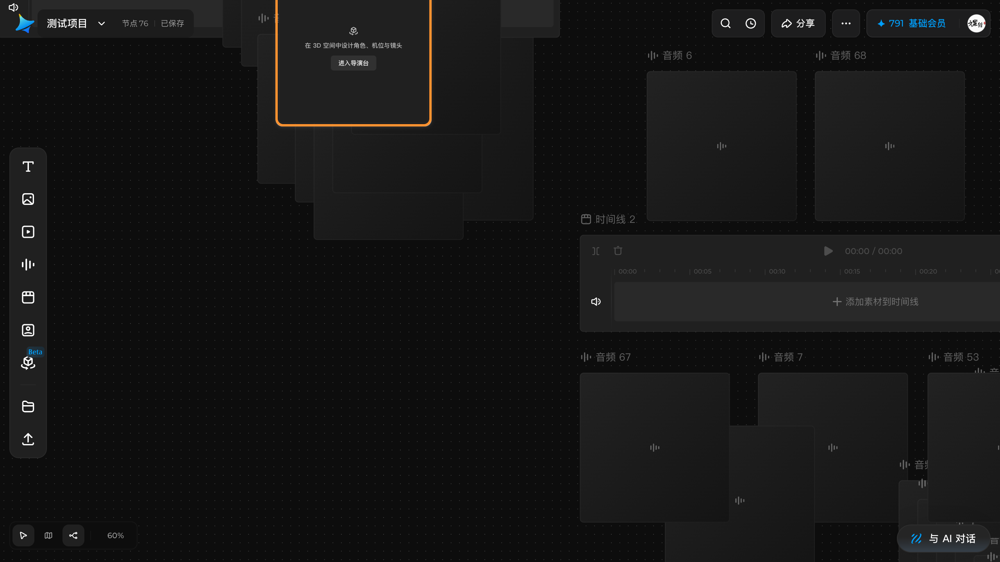

# 打开帮助与使用快捷键

## 适用角色

已登录的即梦画布创作者。

## 目标

找到帮助入口，查看画布快捷键全表，并知道每一项在你当前版本里是否真的可用。

## 前置条件

已打开画布。

## 入口

顶栏 **用户菜单**（右上角头像）→ 菜单（**2026-10-01 实测六项**）：帮助中心 ｜ 使用手册 ｜
**快捷键** ｜ AI生成水印设置 ｜ 即梦CLI ｜ **新功能许愿**。菜单实测 240×312，
顶部还有一块账号信息区（头像 + 昵称，**截图已脱敏**）。

**快捷键** 会在右侧滑出一个抽屉面板，标题「快捷键」，右上角 ✕ 关闭。实测 **240×604**，
内容需**向下滚动**（可滚动高度 1300 > 可见 548）才能看完四组。

### 「帮助中心」面板的尺寸（2026-10-05 批次 168 实测 11 档）

⚠️ **本节的作用是给「余量 32」这条规律划一条边界** —— 批次 165–167 测的三个对话框
两侧与上下都留 32（16+16），**很容易顺手推广成「所有面板都 32」**；
而**帮助中心面板的纵向余量是 76，不是 32**（纯静态读 CSS 就看得见，本轮再去打实）。

| 窗口高 | 800 | 724 | 723 | **720** | 600 | 400 |
|---|---|---|---|---|---|---|
| 面板高 | **648** | **648** | **647** | **644** | 524 | 324 |

| 窗口宽 | 1280 | 900 | 392 | 391 | 360 |
|---|---|---|---|---|---|
| 面板宽 | 360 | 360 | **360** | **359** | 328 |

⇒ **宽 = min(360, 窗口宽 − 32)、高 = min(648, 窗口高 − 76)**；
门槛分别是 **392/391** 与 **724/723**（724 档才第一次完整显示 648）。

🔴 **但这个面板不居中 —— 这一点我第一轮就猜错了**：
它的 class 逐字是 `fixed right-4 top-[60px] z-40` ⇒ **右上角钉住**，
实测**上余量恒 60、右余量恒 16**（1280×720 时下余量也是 16）。
⇒ 那个 **76 = 60（上偏移）+ 16（边距）**，**不是**「38 + 38 的对称余量」。
📌 **规律对、解释错**：min(648,100vh−76) 六档全对，而我第一版断言「余量对称 38/38」被读数否掉；
  🔴 **原写的「所有面板都 32px 余量」已推翻**（立规 41）。

| 入口 | 顶栏头像（`aria` 逐字「用户菜单」）→「帮助中心」 |
|---|---|
| 面板本体 | `.w-workspace-help-center`（**没有** `data-testid`），`fixed right-4 top-[60px] z-40 flex` |
| 源站声明 | `.w-workspace-help-center{width:min(360px,calc(100vw - 32px))}`、`.h-workspace-help-center{height:min(648px,calc(100vh - 76px))}` |

### 🔑 抽屉的 DOM 契约（2026-10-03 批次 128 补全，此前只记了滚动区）

批次 82 记下了滚动区 `[data-testid="shortcut-help-scroll-region"]`（可滚动 **1300**、
可见 **548**）和抽屉本体 **240×604@1028,56**；本批把**其余四层**也读全了：

| 层 | testid / 角色 | 矩形 | 说明 |
|---|---|---|---|
| 抽屉本体 | **`shortcut-panel`**，`<ASIDE role="dialog">` | **`240×604@1028,56`** | `overflow-y: hidden`；**它自己不滚** |
| 滚动区 | `shortcut-help-scroll-region`，`role="region"` | `240×548@1028,112` | **`overflow-y: auto`、`scrollHeight 1300` vs `clientHeight 548` ⇒ 这一层才滚** |
| 内容 | **`shortcut-help-scroll-content`** | **`232×1292@1032,116`** | `overflow-y: visible`、`scrollHeight === clientHeight` ⇒ **也不滚**（内容比面板高 572px） |
| 每个条目 | **`shortcut-help-item`**（`<LI>`） | `232×36`，个别 `232×40` | 逐字如 `打开/关闭 Agent ⌘ /`、`还原 ⌘ ⇧ Z ⌘ Y` |
| 双键位分隔符 | **`shortcut-help-key-separator`**（``） | `8×12` | 出现在 `⌘ ⇧ Z ⌘ Y` 这类一行两个键位的地方 |
| 组标题 | `<H3>`（**无 testid**） | `232×32` | 逐字 `通用操作` / `视图` / `时间线` / `文本编辑` |

📌 **别被 `…scroll-content` 这个名字骗了**：**它不滚**（`overflow-y: visible`、
`scrollHeight === clientHeight`），滚的是它的**父** `…scroll-region`。
⇒ 与搜索面板那次是**同一个坑的第二次现身**（见
[概念与判据](../30-concepts.md) 与 [排障](../90-troubleshooting.md)）。

## 快捷键全表（面板逐字，2026-10-01 复核 / 2026-10-02 重抓）

面板把快捷键分成四组：通用操作 / 视图 / 时间线 / 文本编辑。

> ✅ **2026-10-02 批次 82 把整个面板重抓了一遍**：滚动区
> `[data-testid="shortcut-help-scroll-region"]`（可滚动 **1300**、可见 **548**，
> 抽屉本体 **240×604@1028,56**），逐行导出 **62 行**，
> 扣掉 4 个组标题恰好 **28 项**——与下面四张表**逐字一致，无漏项、无多项**。
> 🔴 **但这个算式不对**（2026-10-05 批次 175 订正，结论对、推导错）：`62 − 4 = 58`，
> 而 `58 ÷ 2 = 29` ≠ 28。
> 这是本手册第二次全量对账（第一次 2026-10-01），结论不变。

### 通用操作

| 功能 | 快捷键 |
|---|---|
| 打开/关闭 Agent | ⌘ / **（2026-10-01 已实测：两按两态）** |
| 撤销 | ⌘ Z |
| 还原 | ⌘ ⇧ Z **（2026-10-01 已实测可用）** 或 ⌘ Y（**同日亦实测可用**） |
| 移动工具 | V |
| 预览视图 | F |
| 宫格视图 | G |
| 创建编组 | ⌘ G |
| 取消编组 | ⌘ ⇧ G |

### 视图

| 功能 | 快捷键 |
|---|---|
| 放大视图 | ⌘ + |
| 缩小视图 | ⌘ − |
| 适配画布 | ⇧ 1 或 ⌘ 0 |
| 缩放至 100% | ⌘ 1 |
| 缩放至选中项 | ⇧ 2 |
| 缩放画布 | `⌘ scroll` |

### 时间线

| 功能 | 快捷键 |
|---|---|
| 分割片段 | ⌘ B |
| 向左裁剪 | Q |
| 向右裁剪 | W |
| 缩放时间线 | `⌘ scroll` |

### 文本编辑

| 功能 | 快捷键 |
|---|---|
| 加粗 | ⌘ B |
| 倾斜 | ⌘ I |
| 下划线 | ⌘ U |
| 删除线 | ⌘ ⇧ X |
| 一级标题 | ⌘ ⌥ 1 |
| 二级标题 | ⌘ ⌥ 2 |
| 三级标题 | ⌘ ⌥ 3 |
| 普通文本 | ⌘ ⌥ 0 |
| 无序列表 | ⌘ ⇧ 8 |
| 有序列表 | ⌘ ⇧ 7 |

> **⌘ B 出现两次**：时间线里是「分割片段」，文本编辑里是「加粗」。同一个键按当前
> 焦点落在哪个对象上生效——在时间线上按是分割，在文本里按是加粗。
>
> 🔴 **2026-10-02 批次 82 补一个更要紧的**：`⌘ scroll` 也**出现两次**——
> 「视图」组的**缩放画布**和「时间线」组的**缩放时间线**用的是**同一个键**，
> 而且面板上**两处写出来的字符串逐字一模一样**。
> 🔧 **下面那句结论已被批次 111 推翻（现象本身仍成立），订正见本块末尾。**
> ⇒ 抓面板数据时按字符串去重会把第二次出现吃掉——本批第一次抓就栽在这儿，
> 「缩放时间线」看起来像没有键。
>
> 🔧 **订正（2026-10-03 批次 111）**：上面这段的**结论部分不成立** ——
> 批次 82 当时据此写下「只能靠『当前焦点在画布还是在时间线』判断」，
> **那半句已被推翻**：**「缩放时间线」连功能都不是独立的**，它**就是「缩放画布」**。
> 批次 82 记对的只有「面板上出现两次、字符串相同」这**现象**。
>
> 🔴🔴 **批次 111 在功能层面把它结清了**：
> **「缩放时间线」不是一个独立功能，它就是「缩放画布」。**
>
> | 动作 | 打在哪儿 | 画布缩放 aria | 自建时间线标尺间距 | 别人的时间线标尺间距 |
> |---|---|---|---|---|
> | `⌘ scroll` ↓×4 | **自建时间线轨道上** | `46% → 22%` | `73.9 → 35.6` | — |
> | `⌘ scroll` ↓×4 | **画布空白处** | `60% → 29%` | `96.3 → 46.45`（比 **2.073**） | `96.3 → 46.43`（比 **2.074**） |
> | **普通滚轮**（不带 Meta） | 自建时间线轨道上 | `46%`（**不变**） | `73.9`（**不变**） | — |
>
> ⇒ 三条硬读数：
> 1. **同一画布缩放下，画布上三个时间线节点的标尺间距逐字相同（都 `96.3`）**
>    ⇒ **时间线节点没有自己的缩放**，间距只是画布缩放的副产物。
> 2. 间距的变化比值（`2.07`）与画布缩放的比值（`60/29 = 2.07`）**一致**
>    ⇒ 间距是**跟着画布一起缩**的，不是「时间线自己缩了」。
> 3. **普通滚轮在时间线上什么也不发生** —— 间距、画布缩放、轨道 `scrollLeft` **全部不动**
>    ⇒ 时间线**也不能用滚轮横向滚动**。
>
> 📌 **所以面板上那两行不是两个功能，是一个动作写了两遍。**
> 这与 `⌘ B` 不同：`⌘ B` 的两个名字**不同**（「分割片段」vs「加粗」），
> 容易发现；而 `⌘ scroll` 的两个名字**字面相同**，功能也相同 ——
> **面板把它列成两行，只是因为它被归在两个不同的分组里。**
> 用户侧只需记一条：**`⌘` + 滚轮 = 缩放画布，打哪儿都一样。**
>
> **两处面板文案与本手册用词不同，照抄即可**：
> - 面板把缩放类写作 **`⌘ scroll`**（英文 scroll），本手册此前译作「⌘ + 滚轮」——
>   2026-10-01 已按面板逐字订正为 `⌘ scroll`。
> - 面板的「缩小视图」是**半角** `⌘ -`，本手册写作 `⌘ −`（U+2212 减号），
>   视觉等价、便于阅读，按键本身相同。
> - 面板的「普通文本 ⌘⌥0」指的是**正文**；而文本编辑器里的 Text style 菜单
>   那一项逐字叫「**正文**」。同一个功能，**两处文案不同**，别以为是两项。

> 🔴 **订正一处算式（2026-10-05 批次 175）**：上文那句
> 「逐行导出 **62 行**，扣掉 4 个组标题恰好 **28 项**」的**结论对、推导不对** ——
> `62 − 4 = 58`，而 `58 ÷ 2 = 29` ≠ 28。
> 正确的拆法是：**62 行 = 4 个组标题 + 28 个功能项（每项 2 行）+ 2 行「多键项」**。
> 那 2 行来自两个**一个功能配两个键**的项：
> 「还原」占 3 行（`⌘ ⇧ Z` 和 `⌘ Y` 各一行）、
> 「适配画布」也占 3 行（`⇧ 1` 和 `⌘ 0` 各一行）。
> ⇒ **28 项这个数字本身没错**，但不能用 `62 − 4` 算出来。

## 🔴 面板里没有、但菜单印着的 5 个快捷键（2026-10-05 批次 175 新增）

上面那张 28 项表**只覆盖了帮助面板这一路**。画布的**右键菜单**是**另一路**，
它在每一项右侧印着快捷键，两路**对不上**。批次 175 把两路对账后，菜单里多出 **5 个键**：

| 菜单项 | 菜单上印的 | 印在哪个节点类型上 | 帮助面板 28 项里 |
|---|---|---|---|
| 复制 | `⌘ C` | 全部 | ❌ **没有** |
| 复制副本 | `⌘ D` | 全部 | ❌ **没有** |
| 复制为图片 | `⌘ ⇧ C` | **只有图片节点** | ❌ **没有** |
| 粘贴 | `⌘ V` | 全部 | ❌ **没有** |
| 删除 | `⌫` | 全部 | ❌ **没有** |
| 撤销 | `⌘ Z` | 全部 | ✅ 有 |
| 还原 / 重做 | `⌘ ⇧ Z`（菜单上只印这一个） | 全部 | ✅ 有 |

### 这 5 个键到底能不能用（批次 175 首测 → 批次 182 **全部重测**）

🔴 **这一节已被批次 182 整表重写。** 批次 175 只能靠「节点数变没变」判断，
而**三个复制类快捷键的效果全都不体现在节点数上** —— 175 的方法对它们**根本不成立**。
182 改成直接读剪贴板（`navigator.clipboard.read()` 枚举条目与类型），
每一种按法**先写哨兵、按后读回**，才得到下面这张能用的表。

| 键 | 菜单上印的 | 实测 | 怎么测的（批次 182） |
|---|---|---|---|
| `⌘ V` 粘贴 | `⌘ V` | ✅ **能用** | 批次 175：节点数 **76 → 77**，随后按 `⌫` 删掉回到 76 |
| `⌫` 删除 | `⌫` | ✅ **能用** | 批次 175：刚粘出的节点 id 消失，77 → 76 |
| `⌘ D` 复制副本 | `⌘ D` | ❌ **死键** | 🔴 批次 183 用事件级方法重测：小写/大写各 1 次，页面**收到了** keydown（`key=d/D, code=KeyD, metaKey=true`），但**既没有 `copy` 事件也没有 `cut` 事件**、节点数 76 → 76、剪贴板一字未动 ⇒ **应用根本没接这个组合**（批次 175 当时只看了节点数） |
| `⌘ C` 复制 | `⌘ C` | ❌ **死键**（🔴 推翻批次 178） | 选中图片节点按 `⌘C` → 页面**收到了** keydown（`key=c, code=KeyC, metaKey=true`）、**`copy` 事件也触发了**，但剪贴板**一字未动**（哨兵原封不动）。**6 次一致否定** |
| `⌘ ⇧ C` 复制为图片 | `⌘ ⇧ C` | ❌ **死键** | 同上按法 → keydown 送达（`metaKey` 与 `shiftKey` 都为 true），但**连 `copy` 事件都不触发** ⇒ 应用**根本没接这个组合**。大小写两种写法各试，共 4 次 |

**⇒ 菜单上印的 5 个键里，只有 `⌘ V` 和 `⌫` 是真的，另外 3 个（`⌘C` / `⌘D` / `⌘⇧C`）按了等于没按。**

👉 **要在画布上复制节点或图片，一律走右键菜单**：
**复制副本**（复制整个节点）、**复制为图片**（只对图片节点有，把那张图放进系统剪贴板）。

#### ✅ 但「复制为图片」这个**功能本身是好的**（批次 182 实测可用）

上面说 `⌘ ⇧ C` 是死键，指的是**按键**；**菜单里点那一项是真的能用**：

| 怎么触发 | 剪贴板变成什么 | 复现 |
|---|---|---|
| 右键 → 点「**复制为图片**」 | **`image/png`，1,141,819 字节**（约 1.09 MB） | ✅ **两轮独立复现，字节数逐字相同** |
| 按 `⌘ ⇧ C` | **没变** | ❌ 4 次 |

📌 **两条路走的是完全不同的机制**（批次 182 用事件监听器量到的）：
点菜单时，页面**既没收到 `keydown`、也没收到 `copy` 事件** ——
它是**程序化**往剪贴板写图片的；而按 `⌘⇧C` 时，页面收到了 keydown 却**没有任何后续动作**。
⇒ 所以「菜单能用、快捷键不能用」不是同一个功能的两种入口坏了，而是**只有菜单那条路被实现了**。

📌 **「复制副本」也一样，而且它更值得记**（批次 183 实测）：
菜单里点「**复制副本**」**真的能用** —— 节点数 **76 → 77**，
副本标题自动变成 **`b22-upload (2)`** 并**自动选中**，同样**零事件**（程序化）。
⚠️ 所以「复制节点」在画布上**只有菜单这一条路**：先选中 → 右键 → **复制副本**。
副本的 id 是**全新的**，位置偏移恒为 **canvas `dx = +400, dy = 0`**（见下文「机械契约」）。

#### 🔴 订正批次 178：「⌘C 复制的是 17 字纯文本」不成立

> **批次 178 的原话（原文保留，供对照）**：
> 选中图片节点 `b22-upload` 按 `⌘C`，剪贴板读到 17 字纯文本「接力 亚运 一百米 男子 2026」，
> 结论写成：⌘C 复制的是文本，不是图片。

批次 178 记的是：选中图片节点按 `⌘C` → 剪贴板读到 **17 字纯文本**「接力 亚运 一百米 男子 2026」，
并据此写成「`⌘C` 复制的是**节点的文字**」。**这个读数是假的**，原因有二：

1. 🔴 **178 没有先读「按之前剪贴板里是什么」**。那 17 个字**按之前就已经躺在剪贴板里**，
   `⌘C` 根本没往里写。⇒ **「按了之后读到 X」在没有按前读数时，
   分不清「这个动作写的」与「本来就有的」。**
2. 🔴 **剪贴板是全机共享资源**：批次 182 期间，同机另一个进程往这个剪贴板里写过
   一份**别的项目**的报告标题（读到了 `报告：dsh-cloud-agent-oss-landscape-review.md …`）。
   ⇒ **剪贴板读数跨轮不可比**，每一轮都必须自带哨兵。

📌 182 的对照实验（同一节点、同一路径，逐格只改一个变量）：

| 格 | 改了什么 | 剪贴板 |
|---|---|---|
| 完全复刻 178 的做法 | 什么都不改 | ❌ 没变 |
| 只加事件监听器 | 加监听 | ❌ 没变 |
| 只加哨兵写入 | 按前写哨兵 | ❌ 没变 |
| 改用 `clipboard.read()` 读 | 换读取方式 | ❌ 没变 |
| 按键后立刻读 + 4 秒后再读 | 排除「读早了」 | ❌ 两次都没变 |
| **正向守卫**：先选中 61 字已知文本再按 `⌘C` | — | ✅ **剪贴板逐字变成了那段文本** |

⇒ 最后一行是关键：它证明**这套环境里按键确实能改剪贴板**，
于是前面五格的「没变」只能解释成「**应用没写**」。

> 📌 **两处菜单与面板对不上的细节**（批次 175 顺带记下）：
> - **「重做」声明了**两个**快捷键**：菜单右侧只印 `⌘ ⇧ Z`，
>   但它的无障碍声明里有 **`Meta+Shift+Z` 与 `Meta+Y` 两个**。这与面板「还原 ⌘ ⇧ Z / ⌘ Y」一致。
> - **「删除」用的是 `Backspace`**，不是 `Delete`——菜单上印的 `⌫` 就是退格键。

### 🔴 「下载」在**每种节点上都有**，能不能用取决于**这个节点有没有资源**（批次 186 全类型普查）

顺带测出一个类型规则。同一份脚本换**画布上现存的 6 种类型**各开一次菜单：

| 节点类型 | 菜单项数 | 「下载」在不在 | 禁用 | 原因逐字 |
|---|---|---|---|---|
| 图片 `b22-upload`（**有资源**） | **9** | ✅ 在 | ❌ 可用 | — |
| 文本 `文本 1` | 7 | ✅ 在 | ❌ 可用 | — |
| **音频 `音频 1`（空）** | 7 | ✅ 在 | 🔴 **禁用** | **「没有可用的就绪资源」** |
| **视频 `视频 1`（空）** | 7 | ✅ 在 | 🔴 **禁用** | **「没有可用的就绪资源」** |
| 时间线 `时间线 1` | 7 | ✅ 在 | 🔴 **禁用** | 「请选择至少一个组、文本、图片或视频项」 |
| 导演台 | 7 | ✅ 在 | 🔴 **禁用** | 「请选择至少一个组、文本、图片或视频项」 |

🔴 **批次 186 订正两处**（本节此前的标题是「它是**类型白名单**」）：

1. **「下载」这一项 6 种类型全都有** —— 变的只是**能不能点**。
   此前表里 `音频 / 视频` 写的是「**本批未取到读数（选不中）**」，
   而它们其实**都有这一项**、只是**禁用**。那句「选不中」的理由**已经过期** ——
   批次 184 起「用搜索面板点结果行选中」这条路径已被逐类验证可靠。
2. **它不是「类型白名单」** ⇒ 门槛是**该节点当前有没有可用的就绪资源**。
   **正向守卫**：上传一个**带资源**的音频节点（本地合成的 1 秒 WAV）后，
   **同一个 `audio` 类型**的「下载」**变成可用**（`aria-disabled` 不为 true），
   而空音频节点是禁用的 —— **同类型、不同资源、不同结果**。

📌 时间线 / 导演台那句「**请选择至少一个组、文本、图片或视频项**」是**另一条门槛**：
它说的是「你得先在时间线里放东西」，不是「你是哪种节点」。

## 逐项实测结果（2026-10-01，1280×720 视口）

面板声明的是产品意图，**下面才是你这一版能不能按出效果**。两栏都可能不一致。

### 确认可用

| 快捷键 | 实测结果 |
|---|---|
| ⌘ 0 / ⇧ 1（适配画布） | 视口缩放从 100% 变为 62%，全部节点回到视野内 |
| ⌘ 1（缩放至 100%） | 缩放从 62% 回到 100% |
| ⌘ + / ⌘ − | 100% → 120% → 100%，逐级生效 |
| ⌘ G（创建编组） | 6 节点 → **7 节点**（组卡片本身计入节点数），组卡片出现 |
| ⌘ ⇧ G（取消编组） | 7 节点 → 6 节点，成员恢复并保持选中 |
| ⌘ Z（撤销） | 可撤销布局重排、编组/解组，**也可撤销删除**（实测：删掉一个节点后按一次 ⌘Z 即恢复；再按继续回退到删除前、建节点前） |
| ⌘ V（粘贴） | 面板未列出，但实测可粘贴出一个副本节点（节点数 +1） |
| ⌘ D（复制副本） | 面板未列出，复制节点实测可用 |
| **⌘ Y（还原）** | **2026-10-01 批次 21 实测可用**：⌘D → ⌘Z 造出可重做历史后按 ⌘Y，`1 node` → `2 nodes`，两轮复现 |
| ⌘ ⌥ 1 / ⌘ ⌥ 2 / ⌘ ⌥ 0 | 文本编辑态实测生效：`<h1>` / `<h2>` / `
` |
| ⌘ ⇧ 8 / ⌘ ⇧ 7 | 文本编辑态实测生效：`<ul><li>` / `<ol><li>` |
| ⌘ B / ⌘ I / ⌘ U / ⌘ ⇧ X | 文本编辑态**有选区时**实测生效：`<strong>` / `<em>` / `<u>` / `<s>`，可叠加 |
| ⌘ B（分割片段） | 时间线内**播放头位于片段内时**实测生效：`2 clips` → `3 clips`，5.0 秒切成 2.2 + 2.8 秒 |
| **⌘ /（打开/关闭 Agent）** | **2026-10-01 逐项实测可用**：按一次右侧 Agent 抽屉出现（`canvas-agent-*` 容器 0 → 7 个有面积的元素，焦点移到 `ASIDE`），再按一次完全收起（7 → 0），画布状态与积分均不变 |
| **⌘ + 滚轮（缩放画布）** | **2026-10-01 逐项实测可用**：`60%` → `72%` → 反向滚回 **`60%`**（transform 与起点逐字相同）。一格 = 12 个百分点 |

> **同一个 ⌘B 在两处都是真的**：焦点在文本里是加粗，焦点在时间线片段里是分割。
>
> **文本编辑组的前置条件（实测对照）**：块级键（⌘⌥0-3、⌘⇧7-8）光标在文内即可生效；
> 行内键（⌘B/I/U/⌘⇧X）**必须先选中文字**——把光标折叠在文末再按 ⌘B，
> 编辑器 `innerHTML` 完全不变；选中 2 个字则只有这 2 个字被加粗。
> 详见 [创建与编辑文本节点](edit-text-node.md)。
>
> **时间线的 ⌘B 前置条件**：播放头必须落在目标片段**内部**。落在两段之间的空隙时
> 按 ⌘B 只会弹提示「将播放头移动到目标片段内进行剪切。」，片段数不变。

### 🔴 面板声明了，但按下去**什么都不会发生**（2026-10-02 批次 100 新增的第三类）

这一类**和上面两类都不同**：不是「能用」，也不是「按了会弹提示」，
而是**按了之后画布上连一个提示都不出现** —— 很容易被当成「没按到」。

| 快捷键 | 实测结果 |
|---|---|
| **V（移动工具）** | **2026-10-02 批次 100 第三次独立确认无效**。连按三次（每次都先确认焦点不在输入框），逐次比对：dock 第一个按钮的 `aria-label` **恒为 `选择工具`**、`selected` 计数不变、节点数不变、**没有任何提示或浮层出现**。批次 82 首测、批次 96 复核、批次 100 三次结论一致 |

⚠️ 这和下面 G 的坑是同一族但更隐蔽：G 在**没满足前置**时至少还会弹一句
「此快捷键当前不可用」，而 **V 连提示都不给**。
📌 所以想用 V 切工具的人，**唯一可靠的办法是点 dock 第一个按钮**。

### 声明了但当前不可用

| 快捷键 | 实测结果 |
|---|---|
| G（宫格视图） | **必须先选中节点**才会给反馈：顶部弹提示「**此快捷键当前不可用**」（**360×44@460,32**，实测 **300ms 内**出现）。**未选中任何节点时按 G，画面完全无变化、连提示都没有** —— 别把「没提示」当成「没按到」 |
| Q（向左裁剪） | 无有效前置时弹同一个提示「**此快捷键当前不可用**」；等价功能改用片段左侧把手 `向左裁剪` 拖动。详见[时间线节点](timeline-node.md) |
| W（向右裁剪） | 同上；改用片段右侧把手 `向右裁剪` 拖动 |

> 那句「此快捷键当前不可用」是**同一个提示复用于 G / Q / W**。
> ⚠️ **判断「这个键有没有被按下」，不能只看有没有提示** ——
> **未选中节点时 G 连提示都不给**，必须先选中再按才看得到。

#### 🔑 「选中」其实有**三层前置**，少一层就什么都看不到（2026-10-02 批次 82 实测）

G 是全册最能踩坑的一个键。同一个 G，三种前置给出**三种完全不同的结果**：

| 做到了哪几层 | 焦点落在哪 | 按 G 的结果（实测） |
|---|---|---|
| 只做到「有节点被选中」 | 节点上（点标题行） | 🔴 **完全静默**：采样 2500ms，无提示、无任何可见元素增减 |
| 「选中」+「**焦点在画布**」 | `.react-flow__pane` | ✅ 300ms 内弹「此快捷键当前不可用」`360×44@460,32`，可见元素 +12 |
| 「选中」但焦点在 **Agent 面板** | Agent 抽屉里的输入框 | 🔴 键盘事件被输入框吃掉，画布毫无反应 |

- 🔑 **怎么同时拿到前两层**：**在空白处按住鼠标拖出一个矩形框选**——
  按下的位置在画布空白上，松开也在画布上，焦点自然留在画布，同时罩住的节点被选中。
  只点节点标题行是**拿不到焦点那层的**（焦点会跑到节点上）。
- ⛔ **别在 Agent 抽屉开着的时候按画布快捷键**：按 **⌘ /** 打开的 Agent 面板
  底部有个输入框，键盘焦点一旦进去，画布快捷键就全部失效。
  先按 **Esc** 或再按一次 **⌘ /** 把它收掉再操作画布。

### 🔑 F（预览视图）名不副实：它按节点类型打开**对应的全屏编辑器**

面板写「**预览视图 F**」，实测它**不是预览，而是「把当前节点类型的编辑器铺满全屏」**：

| 当前选中的节点 | 按 F | 打开的东西 |
|---|---|---|
| **文本** | ✅ | `text-editor-fullscreen-dialog` **1280×720**（详见下） |
| **时间线** | ✅ | `timeline-fullscreen-editor` **1280×720**（即节点上的「全屏编辑」） |
| **视频 / 图片** | ❌ | 顶部提示「**此快捷键当前不可用**」（外层 `DIV` **360×44@460,32**，两者完全同型） |
| **音频** | 🔴 **完全静默** | **既不开编辑器，也不报「不可用」** —— 8 次密集采样（t=0…3000ms）可见元素**恒 513、零新增**。**看起来像 F 没绑定** |
| **主体** | 🟡 | **F 会被当成字母打进节点标题** —— 选中主体节点时标题输入框就已自动聚焦，标题从 `主体 1` 变成 **`f`**。见[使用主体节点](subject-node.md) |
| **什么都没选** | ❌ | **完全静默，连提示都没有**（与**音频**同型） |
| 导演台 | 🔴 **完全静默** | 与「音频」「什么都没选」**同型** —— 不导航、不提示、零变化（2026-10-05 批次 160 实测结清，见下） |

- ⚠️ **它被归在「通用操作」组，但实际是上下文相关的** —— 不同节点类型结果完全不同。
- 🔑 **F 有三种截然不同的结局**：**打开编辑器**（文本、时间线）、
  **报「不可用」**（视频、图片）、**完全静默**（音频、什么都没选），
  外加第四种**变成打字**（主体）。
- 🔴 **批次 60 订正**：本手册此前写「**媒体类（视频、图片）明确报不可用**」——
  那是从**两个样本**归纳的。音频是第 3 个媒体类型，实测**不报「不可用」而是完全静默**。
  ⇒ 这条规律**不成立**，别拿它去预测没试过的类型。

#### 🔑 为什么「音频」这一行**曾经**写着「未验证」，而那个理由已经过期

原文写「**音频节点需素材**」。🔴 **这个理由在本批次之前就已经不成立**：
批次 57 与 59 都已经从左栏**建成过空音频节点**并完整测过（批次 59 还量了它的 7×7 连线矩阵），
**根本不需要素材**。
⇒ 「未验证」是**遗留状态没销账**，不是**当下真的做不了**。

- 2026-10-05 **批次 160 实测**：结清上面那个 ⛔（`scripts/jimeng-b160f.mjs`，5/5 断言通过）。
  素材：画布上已有的导演台节点 `node_pxvkay973v`，`192×192`，
  逐字 `导演台 在 3D 空间中设计角色、机位与镜头 进入导演台 No resources: 0 ready, 0 processing, 0 failed.`

  | 观测量 | 读数 |
  |---|---|
  | 按 F 后 URL | **全程不变**（16 帧逐帧比对，只有画布那一个 URL） |
  | 节点 `innerText` | **16 帧逐字不变** |
  | `[role=dialog]` | **0 个** |
  | 「此快捷键当前不可用」提示 | **0 次** |
  | `[data-state=open]` 浮层 | **恒 0** |
  | `body *` 元素总数 | **恒 2368**（一个都没多、没少） |
  | 结论 | 🔴 **完全静默** —— 与「音频」「什么都没选」**同型** |

  ⇒ 📌 **F 在导演台节点上什么都不做，也不会把你带进 3D 工作台。**
  「进入导演台」**只认那个按钮**，键盘没有任何入口。

#### 🔑 顺带**再证一次**：导演台的浮动工具条是「空壳」，不是「不存在」

| 口径 | 判定 |
|---|---|
| 「选中它**没有**浮动工具条」（**屏上**口径） | ✅ **第三次证实**（批次 68 → 本轮） |
| DOM 里的 `[data-testid="node-toolbar"]` | **存在**，但读出来是 **`0×0 @453,178`、按钮数 `0`、逐字为空串** |

⇒ `director-node.md` 早就记过这件事（「命中 2 个，但**两个都是占位**」，60% 档是
`0×0` ＋ `192×0`），本轮是**独立第三次**测到同一个读数，不是订正。
📌 判「有没有工具条」**不能只问 `querySelector` 返不返回 `null`** ——
还要读它的**盒子和按钮数**：返回非 `null` 不等于有工具条。
批次 160-e 就差点把另一个节点（音频节点）的 `node-toolbar`
认成导演台的（见下）。

#### 🔴 批次 160 的三个前置坑（都已修，记下来省得再犯）

1. **节点在视口外时，点它是点不到的。** 导演台节点起初中心在 **`[-131,-180]`**，
   点击落空 ⇒ 选中数 0 ⇒ 后面测的其实是「什么都没选时按 F」—— 而那一条手册早就写过。
   ⇒ **断言失败先问「这一步的前置状态对不对」**，别急着改判据。
2. **「拖拽」在两种工具下是两件事。** 选择工具拖 = **框选**，抓手工具拖 = **平移**。
   批次 160-b 在选择工具下拖了三轮，节点 x 坐标**一动不动**，反而在共享画布上
   留下 **33 个选中**。⇒ 想平移**必须先切抓手**，用完**切回选择工具**；
   而且 `settle()` 的 Esc **清不掉框选**，选中数要单独清、单独断言。
3. 🔴 **画布上节点密到会互相压住。** 导演台节点 42 个候选落点里 **40 个被别的节点盖住**
   （它正好压在 `音频 5` 之类的大片节点上）⇒ 必须**逐点验 `elementFromPoint` 归属**再点。
   批次 160-e 就是没验这一步，点中了压在上面的**音频节点**，差点把它的
   音频生成面板（`SeedAudio 1.0` / `全能配音` / `音色库` / `生成`）当成导演台的工具条。

📌 **立规 30：「拖拽」在两种工具下是两件事** —— 想平移必须先切抓手，用完切回。
📌 **立规 31：读到 testid 先确认它属于谁** —— 用 `closest()` 验归属，并把内容列出来对一眼。

#### 全屏文本编辑器（F 在文本节点上打开的就是它）

| | 实测 |
|---|---|
| 容器 | `[data-testid="text-editor-fullscreen-dialog"]` **1280×720@0,0**（外层另有 `fixed inset-0` 遮罩，`data-state="open"`） |
| 标题片 | 逐字 **`文本 3.md`**（节点名 + `.md`）**66×22@81,28** |
| 关闭钮 | aria 逐字 `Close full-screen editor` **36×36@1191,28** |
| 工具条 | `[data-testid="text-editor-toolbar"]` **1173×40@53,84** |
| 正文区 | `[data-testid="text-editor-scroll-region"]` **1173×596@53,124**，其中编辑器本体 `800×106@240,125` |
| 退出 | **Esc 一次即关**（实测），关闭后节点工具条原样恢复 |

> 🔴 **2026-10-02 批次 82 订正**：本页此前把容器写作 `div[text-editor-fullscreen-dialog]`，
> 那是**裸属性选择器**，在真实 DOM 里**匹配不到任何元素**（实测 `[text-editor-fullscreen-dialog] → 无`，
> 而 `[data-testid="text-editor-fullscreen-dialog"] → 1280×720@0,0`）。
> 尺寸本身没错，**错的是定位方式**。⚠️ 用错选择器会得出「F 什么也没打开」的假结论——
> 本批就因此连着四轮误判 F 失效。

#### 全屏编辑器的工具条上到底有什么（2026-10-02 新测）

| 位置 | 尺寸 | 逐字名称 |
|---|---|---|
| 509,88 | `48×32` | Text style 菜单钮（`data-state="closed"`，**没有 aria**，只能看位置和图标） |
| 559,88 | `32×32` | 无序列表 |
| 593,88 | `32×32` | 有序列表 |
| 627,96 | `8×16` | 分隔线（`[data-testid="text-editor-toolbar-separator"]`，是个 `SPAN`） |
| 637,88 | `32×32` | 加粗 |
| 671,88 | `32×32` | 删除线 |
| 705,88 | `32×32` | 倾斜 |
| 739,88 | `32×32` | 下划线 |
| 1094,28 | `80×36` | 下载 |

正文区是空的文本节点时，中央有占位符 `[data-testid="text-editor-fullscreen-placeholder"]`
**`80×26@240,145`**，逐字「**输入文本…**」。

详见[创建与编辑文本节点](edit-text-node.md)。

### ⌘ + 滚轮（缩放画布）

**可用。** 实测 `60%` → `⌘ + 滚轮上` → **`72%`** → 反向滚一格 → **精确回到 `60%`**
（`translate(255.967px, 71.8048px) scale(0.6)` 与起点逐字相同）。
滚轮一格 = **12 个百分点**。⚠️ 不带 ⌘ 的普通滚轮是**平移**，两者别混。

### 需要前置条件才生效

| 快捷键 | 前置条件 |
|---|---|
| ⌘ G / ⌘ ⇧ G | 必须框选出 2 个以上节点；只选 1 个或 0 个时无反应 |
| ⌘ B（时间线分割） | 必须先**选中片段**且**播放头在该片段内部**；播放头落在片段之间的空隙时只弹提示 |
| F / G | **必须先选中节点**，且**键盘焦点要在画布上**——详见上面「三层前置」一节。缺任何一层都是**完全静默**（不是弹「不可用」） |
| ⌘ + 滚轮 | 焦点在画布上才生效；不带 ⌘ 的普通滚轮是平移 |
| **所有画布快捷键** | **Agent 面板开着就全部失效**（按 ⌘ / 打开，Esc 或再按 ⌘ / 收起） |

### 按了没反应

| 操作 | 实测结果 |
|---|---|
| ⌘ A（全选） | 面板未列出。实测把焦点放到画布后按 ⌘A，选中数不变（**前置已断言：确实有 2 个处于选中**） |
- **Shift + 点选**（面板未列出）**实测是标准的 toggle 语义**：
     - 点**未选中**的节点 → **加选**（实测 2 → 3）；
     - 点**已选中**的节点 → **取消选中它**（实测 2 → 1）。
   🔧 2026-10-01 批次 56 订正：早前写「**Shift+点选不是加选、反而会取消选中**」是
   **只测了后一支就外推**——那次的场景是「1 选中 + Shift 点那一个」= 0 选中，
   看到的是 toggle 的取消分支。**加选是正常可用的。**
  - 📌 2026-10-03 批次 129 **未能复现成功，如实记录**：本批三次尝试都没能把选中数做到 2，
    而**三次都是探针脚本自己的落点选取有问题**（不是产品行为）：
    ① 落点收集的 `break` 只跳出内层循环，拿到的多个落点**其实是同一个节点**
    （Shift 点已选中的节点 = 取消选中）；② 从节点矩形**上边缘**起扫，落点落在视口顶边
    （`y=0` / `y=1`）；③ 改严成「节点矩形须完整在安全区内」，
    而 60% 缩放下节点**部分出屏本来就是常态**，结果落点集直接为空。
    ⇒ **上方批次 56 的记录既不推翻也不加强**，它仍是唯一有效的多选依据。
| **⇧ 2（缩放至选中项）** | 面板列了，但**直接按键无效** —— 2026-10-01 实测：选中节点后按 ⇧2 缩放读数毫无变化；**必须走底部缩放菜单点该项**才生效。详见[平移缩放与视图](navigate-canvas.md) |
| **V（移动工具）** | **2026-10-01 逐项实测：它不切换工具。** 按 V 前后 dock 工具按钮的 aria 逐字不变（都是 `选择工具`），`aria-pressed` 也不变，画布全页可见 DOM 差分 **0 新增 / 0 消失**。⚠️ 切工具请点 **dock 第一个按钮** **2026-10-02 批次 82 在三种前置下各复测一遍，结论不变**：0 选中 / 1 选中 / 3 选中，dock 的 `aria` 与 `aria-pressed` 全部逐字不变，可见元素数一字不差。**「V 是不是因为没选中才不生效」这个解释被排除了** |
| **⌘ 0（适配画布）** | **2026-10-02 复测可用**：本批进场时画布缩放是 **13%**（因为画布上有个节点摆在很远的 `x≈4168` 处），按 ⌘0 后变成 **24%**，连读两次读数相同（已静止）。⚠️ **「适配」的结果由画布上所有人的节点位置决定**，同一个键在不同的画布上会给出不同的百分比 |
| **⌘ 1（缩放至 100%）** | **2026-10-02 复测可用**：⌘0 之后再按 ⌘1，读数 **24% → 100%**，同样连读两次相同 |
| F（预览视图） | **未选中节点时完全无反应**（选中后才打开全屏文本编辑器，见上）。**2026-10-02 复测**：0 选中 + 焦点确在画布（`.react-flow__pane`）+ 采样 2500ms，无提示、无可见元素增减 |
| G（宫格视图） | **未选中节点时完全无反应**（选中后才弹「此快捷键当前不可用」，见上）。**2026-10-02 复测**：0 选中 + 焦点在画布 + 采样 2500ms，同样一个字节都没变 |

> **多选就用框选**：在空白处按住鼠标拖出一个矩形，罩住的节点会一起选中
> （实测一次罩住 6 个）。⌘A 不存在；Shift+点选可用但要记住它是 **toggle**。

## 重要：撤销 ⏎ 只在「没刷新」的时候有效

面板只说「撤销 ⌘Z」，没说清范围和时限。实测结论：

- ✅ 能撤销：删除节点、布局重排、编组/解组、节点移动、文本编辑等；
  实测删掉一个节点后按一次 ⌘Z 即恢复，继续按还能一路回退到建节点之前。
- ⏎ **但撤销历史不跨刷新**。刷新页面（或关掉标签页）后，⌘Z 就不再回退任何内容——
  这时误删就只能重做了。

所以删除后的第一反应是**立刻按 ⌘Z**，不要先去干别的事再回来找。

## 📊 28 项快捷键三态总账（2026-10-02 批次 100 逐项对账）

面板一共声明 **28 项**（通用操作 8 / 视图 6 / 时间线 4 / 文本编辑 10）。
下表把每一项**归到一档**，并标出**依据**：

| 组 | 功能 | 快捷键 | 归类 | 依据 |
|---|---|---|---|---|
| 通用 | 打开/关闭 Agent | ⌘ / | ✅ 可用 | 逐项实测两按两态 |
| 通用 | 撤销 | ⌘ Z | ✅ 可用 | 可撤销布局、编组、**删除** |
| 通用 | 还原 | ⌘ ⇧ Z / ⌘ Y | ✅ 可用 | 两个键**都**实测过 |
| 通用 | **移动工具** | **V** | 🔴 **无任何反应** | **三次独立确认**（见上一节） |
| 通用 | 预览视图 | F | ⚠️ 有前置 | 见下方专节；**导演台节点上不按**，且旧理由已过期 |
| 通用 | 宫格视图 | G | ⚠️ 需前置 | 必须**先选中**；未选中时**连提示都没有** |
| 通用 | 创建编组 | ⌘ G | ✅ 可用 | 节点数 +1 |
| 通用 | 取消编组 | ⌘ ⇧ G | ✅ 可用 | 节点数 −1 |
| 视图 | 放大视图 | ⌘ + | ✅ 可用 | 逐级生效 |
| 视图 | 缩小视图 | ⌘ − | ✅ 可用 | 逐级生效（面板写 ASCII `-`，本页写 `−`，同一个键） |
| 视图 | 适配画布 | ⇧ 1 / ⌘ 0 | ✅ 可用 | 两个键都可用 |
| 视图 | 缩放至 100% | ⌘ 1 | ✅ 可用 | |
| 视图 | **缩放至选中项** | **⇧ 2** | ⚠️ **直接按键无效** | 必须走缩放菜单点那一项（见 [平移缩放](navigate-canvas.md)） |
| 视图 | 缩放画布 | `⌘ scroll` | ✅ 可用 | **打哪儿都一样**（含时间线轨道上） |
| 时间线 | 分割片段 | ⌘ B | ⚠️ 需前置 | 播放头必须在目标片段**内** |
| 时间线 | 向左裁剪 | Q | ⚠️ 不可用 | 弹「此快捷键当前不可用」；改用片段左侧把手 |
| 时间线 | 向右裁剪 | W | ⚠️ 不可用 | 同上 |
| 时间线 | 缩放时间线 | `⌘ scroll` | 🔴 **不是独立功能**（批次 111 推翻） | **就是「缩放画布」**；时间线没有自己的缩放，标尺间距只是跟着画布缩放 |
| 文本 | 加粗 / 倾斜 / 下划线 / 删除线 | ⌘ B / ⌘ I / ⌘ U / ⌘ ⇧ X | ✅ 可用 | **必须有选区**，光标折叠时按了没反应 |
| 文本 | 一级 / 二级 / 普通文本 | ⌘ ⌥ 1 / 2 / 0 | ✅ 可用 | 光标在文内即可 |
| 文本 | **三级标题** | **⌘ ⌥ 3** | ✅ **可用（2026-10-02 批次 107 补测）** | 同上；它与 ⌘⌥1/2/0 **同族同机制**，逐格读数见下 |
| 文本 | 无序 / 有序列表 | ⌘ ⇧ 8 / ⌘ ⇧ 7 | ✅ 可用 | |

**统计**：✅ 可用 **18** ｜ ⚠️ 有前置或条件受限 **9** ｜ 🔴 无反应 **2**（视频、导演台 F）｜ ❓ 未验证 **0**｜ 🔴 面板列了但**不是独立功能** **1**（缩放时间线）。

### 🔑 `⌘ ⌥ 1 / 2 / 3 / 0` 四格实测读数（2026-10-02 批次 107，本页此前唯一空白格）

素材：上传一份 `.md` 建文本节点，正文四行
`一级标题行 / 二级标题行 / 三级标题行 / 普通正文行。`；
把光标点进**最后一行**（普通文本），逐格按快捷键，读**那一行自己的**渲染结果。

| 按键 | 前 | 后 | 结论 |
|---|---|---|---|
| `⌘ ⌥ 1` | `P` 13px/400/行高 22px/`163×13` | **`H1` 24px/500/40px/`163×24`** | ✅ |
| `⌘ ⌥ 2` | `H1` 24px/500 | **`H2` 18px/500/28px/`163×17`** | ✅ |
| **`⌘ ⌥ 3`** | `H2` 18px/500/28px/`163×17` | **`H3` 16px/500/24px/`163×14`** | ✅ **可用** |
| `⌘ ⌥ 0` | `H3` 16px/500 | **`P` 13px/400/22px/`163×13`** | ✅ |

- HTML 逐字：`
普通正文行。
` → `<h1>普通正文行。</h1>` → `<h2>…</h2>` → `<h3>…</h3>` → `
…
`。
- 四格跑完那一行**回到了原样**（`P`），文档与起始状态逐字相同。
- 📌 **四格是同一条机制**（编辑器是 **TipTap / ProseMirror**），
  所以「⌘⌥3 没验」其实是**一族四格里唯一的一格没验** —— 现在补齐了。
- 📌 判据见[使用文本节点 · 四个标题层级的可测读数](edit-text-node.md#四个标题层级的可测读数不靠肉眼)：
  字号单调递减 **24 / 18 / 16 / 13**，且**只有普通文本字重是 400**。
- ⚠️ **这组键必须在编辑器里按**（光标在文内），在画布上按没有意义。

> 这张表由人维护（**归类是语义活，判据代劳不了**）；
> `scripts/jimeng-shortcut-reconcile.mjs` 负责机械地校验两件事 ——
> ① 面板**现在**有哪 28 项（逐字导出，防止面板更新后手册漏项）；
> ② 这 28 项里有没有**手册全文完全没提到**的。
> **2026-10-02 批次 107 实跑**：`面板 28 项 vs 手册全文 → mentioned 28`、
> **`🔴 手册全文没有提到的面板项：0 项`**。
> ⇒ 本页此前唯一那格空白（「三级标题 ⌘⌥3 面板声明了、本页照抄了，但没有任何实测结论」）
> 已由上表的四格读数补上。

## 原子步骤

1. 点击 **用户菜单** → **快捷键** → 右侧抽屉按四组列出全表。
2. 向下滚动抽屉可看到「时间线」「文本编辑」两组。
3. 点右上角 **✕** 或按 **Esc** 关闭。

## 常见错误与恢复

| 现象 | 处理 |
|---|---|
| 按 G 没反应 | 该快捷键当前不可用（会弹提示），改用布局菜单的「宫格布局」 |
| 按 Q / W 没反应 | 这两个键当前不可用；拖片段左右的窄把手改时长 |
| ⌘B 没反应 | 看焦点：文本里要先选中文字，时间线里播放头要在片段内部 |
| ⌘G 没反应 | 先框选 2 个以上节点，只选 1 个不会成组 |
| ⌘Z 按了回不去 | 多半是页面刷新过——撤销历史不跨刷新，只能重做 |
| 不知道某个键干什么 | 直接开这个面板对照，声明与实际不符以上表为准 |

## 相关任务

[平移缩放与视图](navigate-canvas.md) ｜ [编组、排列与整理](organize-group-layout.md) ｜
[复制、删除与撤销](duplicate-delete-history.md)

## 已验证说明

面板四组全表为 2026-10-01 登录会话逐字抓取（1280×720，zh-CN，Asia/Shanghai）。
「逐项实测结果」全部为同日实测：视图组与编组/解组/撤销/粘贴为可观察结果；
G 的不可用提示、Shift 点选的反向行为、⌘Z 可撤销删除但**不跨刷新**（当日两轮对照
实测：同会话内可恢复，reload 后连按 10 次无反应），均为当场复现。
**文本编辑组 9 个快捷键已于 2026-10-01 全部逐键实测**（进入文本编辑态后），
结论见上方表格；早期「⌘B/I/U/⌘⇧X 被系统拦截」的记录已推翻，真实原因是缺选区。
**时间线组也已逐键实测**：⌘B 在播放头位于片段内时生效；Q / W 确认无效
（与 G 同属「声明了但当前不可用」），但功能本身可通过片段两侧把手实现。
**🔑 2026-10-01 批次 39 把「未确认项」清零**：V / F / ⌘ / / ⌘+滚轮 四项**全部逐键实测**，
结论分别是「**V 不切换工具**」「**F 需先选中节点、打开的是全屏文本编辑器**」
「**⌘/ 可开关 Agent 抽屉**」「**⌘+滚轮 可缩放、一格 12 个百分点**」，
并顺带测出**G 与 F 在未选中节点时完全静默**（G 的「此快捷键当前不可用」提示
只在选中节点后才出现，此前记述漏了这个前置条件）。
本手册的快捷键表**已无未确认项**。

**2026-10-02 批次 82 复盘**（详见 `SOURCE_OBSERVATIONS.md` §4.01）：
- ✅ 面板**全量重抓 62 行 / 28 项**，与本页四张表**逐字一致**；
  另钉下 `⌘ scroll` 在面板上**出现两次**（缩放画布 / 缩放时间线，字符串完全相同）。
- ✅ **V** 在 0 / 1 / 3 选中三种前置下复测，恒不切工具；
  **⌘ 0**、**⌘ 1** 复测可用；**⌘ /** 在 0 选中与 1 选中下都能开关 Agent 面板。
- 🔴 **「选中」是三层前置，不是两层**——「有节点选中」还必须加上「**焦点在画布**」。
  只满足前者时 G 与 F 都是**完全静默**。本批因此连续四轮误判 G/F 失效。
- 🔴 **本页原有的全屏编辑器选择器 `div[text-editor-fullscreen-dialog]` 已被批次 82 推翻**：
  那是裸属性选择器，真实 DOM 里匹配不到（它是 `data-testid`）。
  **用错选择器会把「F 能用」读成「F 什么也没打开」**——本批就栽在这里。
- ⚠️ 本批唯一**没做成**的事：块选到「**恰好 1 个**节点」。
  这块画布上的节点大面积交叠（基线「文本 1/2/3」canvas 坐标彼此盖住），
  框选边缘收到 2px 也仍然选中 2 个；最后靠**框选 + Shift 点选 toggle**（2 → 1）达成。

## 步骤图

