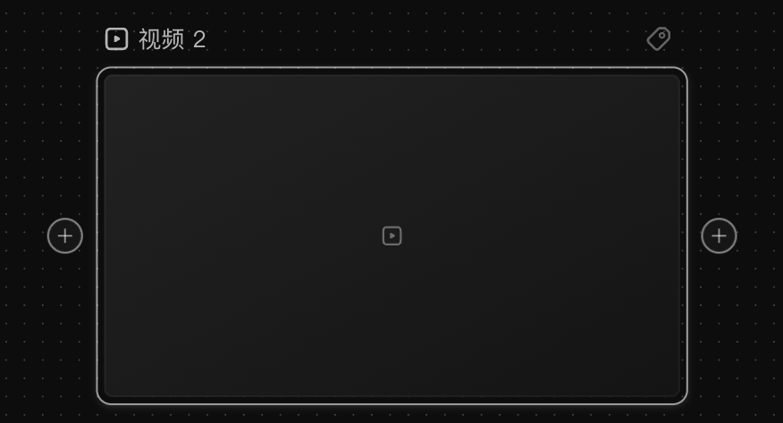
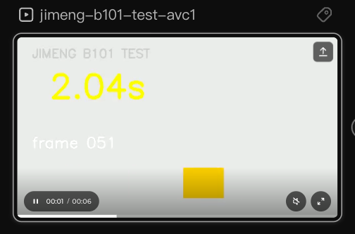
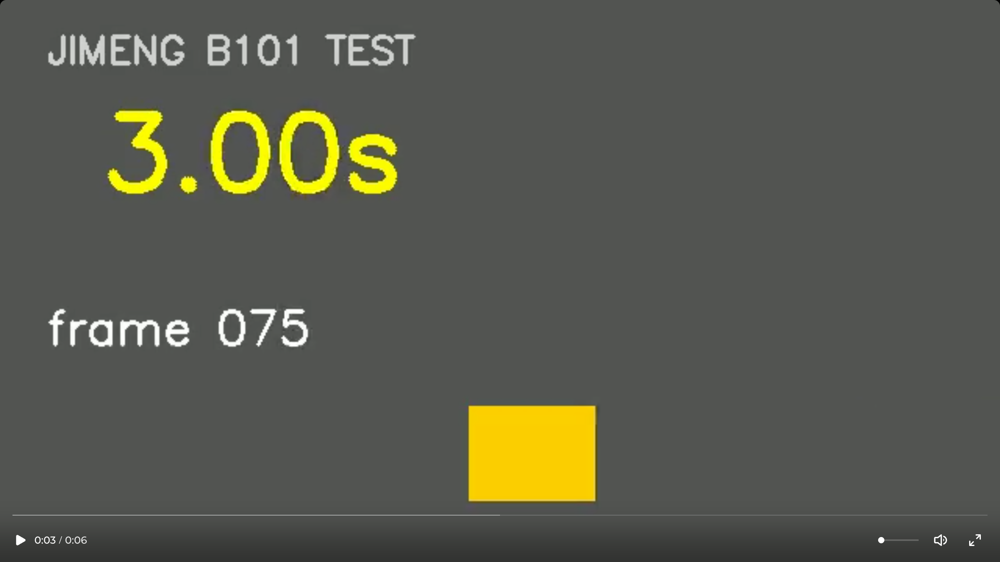

# 预览与播放视频节点

## 适用角色

已登录的即梦画布创作者。

## 目标

在画布内播放/暂停视频、控制声音、跳转进度、进入全屏观看，处理加载失败的媒体。

## 前置条件

画布中有**带媒体**的视频节点。

> ⚠️ **「带媒体」是硬前提**。空视频节点（还没放素材）**一个播放控件都没有**，
> 详见本页[「空视频节点长什么样」](#空视频节点长什么样)。

## 入口

单击视频卡片。**选中即播** —— 视频自动从 0 开始播放（2026-10-02 实测复核）。

## 🔑 播放控件是「条件存在」的，不是一直都在

这是本页最容易被误会的一点：**静止时卡片上其实什么都没有**。

| 阶段 | 卡片上有什么 | 有什么**没有** |
|---|---|---|
| **未选中** | 封面图（`video-passive-preview`，一个 ``） | 播放键、时间读数、进度条、控件行 |
| **已选中，还没播过** | 封面图 + 正中一个 `44×44` 的**大播放键**（`video-simple-player`，aria `Play <节点名>`） | 时间读数、进度条、控件行、**`<video>` 元素** |
| **正在播 / 播完暂停** | 底部整条控件行（见下）+ `<video>` 元素 | 大播放键（它会被控件行里的播放钮取代） |

📌 **「没有 `<video>` 元素」只在静止态成立**。点下播放的那一刻才把
`<video>` 挂进 DOM（aria `<节点名> player`），节点 `innerText` 同时多出
`<节点名>: Playing video`。所以想用脚本判断「在不在播」，**不能靠找 `<video>` 元素**，
要看控件行在不在、或读时间读数。

> 🆕 **2026-10-02（批次 105）补一条**：第三行那一栏还漏了一个控件归属 ——
> **静音钮和全屏钮是「起播后才出现」的**。已选中但还没播过时，节点里只有 **5 个**按钮：
> `Rename <名>`、`Add tags`、`Create connected node after <名>`、
> `Play <名>`（testid `video-simple-player`）、`替换媒体`。
> `video-node-mute-toggle` / `video-node-fullscreen-toggle` **根本不在 DOM 里**，
> 播放起、控件行挂上之后才出现。
> ⇒ 「已选中 = 控件都在」是错的：**未播 = 只有播放键**。

## 🔑 节点自己会报资源账：`X resource(s): Y ready, Z processing, W failed`

这是本页最省事的一条判据（2026-10-02 批次 105 新发现，手册此前从未写过）：
**节点的 `innerText` 里始终带一串资源账**，它比「有没有 `<video>`」更早一步告诉你
资源到底走到哪一步了。

| 节点此刻的状态 | `innerText` 里的资源账（逐字） |
|---|---|
| 还没放素材 | `No resources: 0 ready, 0 processing, 0 failed.` |
| 素材已处理完 | `1 resource: 1 ready, 0 processing, 0 failed.` |
| 素材收下了、还在处理 | `1 resource: 0 ready, 1 processing, 0 failed.` |
| 素材处理失败 | `2 resources: 1 ready, 0 processing, 1 failed.` ← ⚠️ **2026-10-03 批次 112 仍未能造出，见下** |

- 资源账后面还会跟一句状态：`Selected.` 或 `Not selected.`
- 别的节点类型用别的措辞，例如时间线节点写
  `时间线: 1 visual track, 0 audio tracks, 0 clips.`
- 🔴 **资源账在哪个属性里，因节点类型而异**（批次 112 实测）：
  **视频 / 音频节点在 `innerText` 里；图片节点在 `aria-label` 里** ——
  一张「预览不可用」的图片节点，`innerText` 逐字是 `预览不可用 重试 jimeng-b1...truncated`，
  **账不在里面**；账在 aria 上，逐字 `1 resource: 1 ready, 0 processing, 0 failed. Selected.`
  ⇒ 读账要**两个都读**（aria 优先，回落 `innerText`），别只读一个。
- 📌 **这张账是「上传期」的账**。播放期出问题**不会**把它翻成 `failed`
  —— 详见下面的[「媒体异常」](#媒体异常)。

> 💡 **怎么用**：素材传上去以后卡住不动，先读这句账。
> `0 ready, 1 processing` = 后端还在处理；`0 ready, 0 processing, 1 failed` = 素材本身有问题。
> 两者都不是「播不了」，而是**根本还没有可播的东西**。

## 卡片播放控件（2026-10-02 全量实测）

控件行（`video-node-player-bar`）一出现，卡片底部就有一排东西。尺寸是 **canvas 像素**：

| 控件 | testid | 尺寸 | 读法 |
|---|---|---|---|
| 播放 / 暂停 | `video-node-playback-toggle` | **`16×16`** | aria 在 `Play <名>` ↔ `Pause <名>` 之间翻转 |
| 时间读数 | `video-node-player-clock` | `50×12` | `00:03 / 00:06`（**有前导零**） |
| 静音 | `video-node-mute-toggle` | `36×36` | aria `Unmute video` ↔ `Mute video`；**卡片默认静音** |
| 浏览器全屏 | `video-node-fullscreen-toggle` | `36×36` | aria `Enter browser full screen` |
| 进度条 | `slider-track` | `568×5`（屏上仅 `341×3`） | 整条铺满卡片宽度，aria `Seek <节点名>` |

> 🔎 **播放/暂停钮只有 `16×16` canvas（屏上约 10×10 像素）**，是这一排里最难点的。
> 点不中时先确认自己没点到旁边的静音/全屏钮。

## 原子步骤

1. **选中即播**：单击卡片，视频自动从 0 开始播放（时间读数从 `00:00` 往前走）。
   *实测*：取消选中后再点卡片，`currentTime` 归零重播。
2. **暂停 / 继续**：点击播放/暂停钮。
   *成功判据*：`currentTime` 停止走动（两次采样间隔 1.1 秒，读数逐位相同）。
   按钮 aria 会跟着翻回 `Play <节点名>`。
3. **播完再播**：视频播完后**控件行不会消失**，时间停在 `00:06 / 00:06`，
   播放钮显示 `Play`。**再点一次是从 0 重播**，不是接着放。
4. **声音**：点击静音钮切换；aria 在 `Unmute video` / `Mute video` 翻转。
   卡片默认静音，**要先解除静音才有声音**。
5. **跳到任意位置**：点击进度条上的任意一点。
   *实测*：6 秒素材上点 25% / 50% / 80% / 5%，落点误差都在 **0.03 秒**以内
   （点击后它还在继续播，所以停下来读数会比点击位置略大一点点）。
6. **全屏观看**：点击卡片右下角的浏览器全屏钮。
7. **下载**：右键菜单里的 **下载**（本地行为，不耗积分）。

## 全屏播放器（2026-10-02 实测，testid 全新）

进全屏后画面铺满，控制条压在最底下：

- 控件条 `video-fullscreen-player-bar`（`1280×88`）；
- 顶部一条**整宽进度条**（`1248×2`）；
- 底部一行：**播放/暂停**（`20×32`）｜ **时间读数**（`68×18`）｜ **音量滑杆** ｜ **扬声器** ｜ **全屏钮**。

三条容易踩空的细节：

1. 🔴 **时间读数格式和卡片里不一样**：全屏是 `0:06 / 0:06`（**无前导零**），
   卡片里是 `00:06 / 00:06`。同一个视频，两处写法不同。
2. 🔴 **按 `Esc` 退不出全屏**（连按三次，`fullscreenElement` 纹丝不动）。
   **正确做法是再点一次右下角那个全屏钮**（aria 仍读作 `Enter browser full screen`）。
3. 🔴 **全屏播放器里没有「X」关闭钮**。整个全屏容器里**只有 3 个按钮**：
   播放/暂停、静音、全屏。找不到关闭钮不是你的问题。

### 音量滑杆

| 项 | 读数 |
|---|---|
| 轨道 `slider-track` | **`52×2`**（两像素高） |
| 真正能点的热区 | `52×16`（轨道外面套一层） |
| 滑块 thumb | `8×8`，`aria-valuemin=0` / `aria-valuemax=1` |

- **拖动有效，且跟手**：拖到轨道的 80% / 60% / 40% / 20%，音量读数依次是
  **0.81 / 0.60 / 0.40 / 0.19** —— 近似线性。
- 全屏里**有两条一模一样的 `slider-track`**（进度 + 音量）。
  区分办法看 **`aria-valuemax`**：音量是 `1`，进度是**素材总时长**（本例 `6`）。
- 📌 全屏态下静音钮仍然在，可以直接点；不必非去拖音量。

## 取消 / 恢复

- **点击空白取消选中，播放停止**。停止的方式是「暂停」——
  `<video>` 元素**仍留在 DOM 里**，但 `currentTime` 冻住，整条控件行消失。
  再点卡片会重新选中并从 0 播放。

## 右键菜单（带媒体的视频节点，2026-10-02 实测）

`200×332`，**8 项**，每项 `192×36`：
复制 ｜ 复制副本 ｜ 粘贴 ｜ **保存到主体库** ｜ **下载** ｜ 重做（禁用）｜ 撤销 ｜ **删除**。

- 与空节点不同：这里 **「下载」是可用态**（空节点时它是禁用的）。
- ⚠️ **「删除」项的文案是 `删除 ⌫`**，菜单上标了 `⌫` 快捷键 ——
  但批次 95 实测**按 `Delete` 键删不掉**。以右键菜单为准。
- 🆕 **2026-10-02（批次 105）补量**：有资源的视频节点菜单是 **`200×332`、8 项**，
  每一项都是 **`192×36`**，逐字为
  `复制 ⌘ C ｜ 复制副本 ⌘ D ｜ 粘贴 ⌘ V ｜ 保存到主体库 ｜ 下载 ｜ 重做 ⌘ ⇧ Z 无需重做操作 ｜ 撤销 ⌘ Z ｜ 删除 ⌫`。
  与批次 101 独立测得的 `200×332` 8 项逐字吻合。
  按 **`Esc`** 可以关掉它（关完后同款菜单数为 0）。

## 媒体异常

### 一句话现状（2026-10-02 批次 105 订正）

> 🔴 **订正本页此前写的「资源失效态」**：原文那张「空节点 / 资源失效」两栏对照表，
> 以及「重试播放后可恢复 / 空载态」的两分支描述，**都只有一句「异常态行为部分来自
> 历史观察记录」背书，从未被对账过**。本轮造了真素材去试，结论是：
>
> **在当前环境里，「资源失效」自然复现不出来。**
>
> 本轮造了一张**过不了解码但能过上传**的素材：合法 `ftyp` 头（连 `file` 命令都认它是
> ISO Media MP4）+ 1MB 伪随机字节，扩展名在上传白名单里，走完左栏上传通道，
> 资源被收下（`1 resource`），积分纹丝不动（805 → 805）。
> 然后连采 6 次、跨越 11 分钟，账本**逐位不动**：
> `1 resource: 0 ready, 1 processing, 0 failed.`
> ⇒ 它停在 `processing`，**不会**自己翻成 `failed`。
>
> 所以下面这张两栏表**缺了中间一档**，而中间这档恰恰是唯一能自然造出来的那个。

### 三栏，不是两栏（2026-10-02 实测订正）

| | 空视频节点（还没放素材） | **资源处理中（本轮新增）** | 资源失效（有素材但播不了） |
|---|---|---|---|
| 资源账 | `No resources: 0 ready, 0 processing, 0 failed.` | `1 resource: 0 ready, 1 processing, 0 failed.` | ⚠️ **仍是 `1 resource: 1 ready, 0 processing, 0 failed.`**（批次 110 实测，**播放期失败不改这张账**） |
| 播放 / 暂停 / 静音 / 全屏控件 | **一个都没有** | **一个都没有** | **也没有**，换成 `重试播放<类型>` |
| 时间读数 | **完全没有**（不是 `00:00 / 00:00`，是压根不显示） | **完全没有** | **完全没有**（`[data-testid^="audio-duration"]` 读出 **0 个**） |
| 卡片中央 | 一个**占位图标**，看着像播放键 | **进度/处理中提示** | **红色 `音频播放失败`**（`
`） |
| 关键 testid | — | **`video-node-uploading`** | **`audio-playback-error`**（音频节点实测，视频节点未单独测） |
| 卡片中央的 aria | — | `<素材名>.mp4: 正在处理上传内容…` | — |
| `<video>` / `` | 0 / 0 | **0 / 0** | `<audio>` **整个不在 DOM 里** |
| 卡片里的按钮 | 只有改名/标签/连线/替换媒体 | **只有一个 `Rename <名>`** | 改名/标签/连线/替换媒体 + **`重试播放音频`** |

⚠️ **中间那档和最后一档的区别，只在「卡片中央那行字」** ——
`正在处理上传内容…`（素材被收下了、后端还没处理完）
对 `音频播放失败`（素材在、这次取流失败）。
**两者的资源账都不是可靠的判据**：前者是 `processing`，后者**仍然是 `1 ready`**。

⇒ **「看到卡片中央有个播放形的图标、但点不动、也没有时间读数」是空节点**，
不要当成「资源坏了」；
**「节点上写着『正在处理上传内容…`、而且整张卡片只有改名按钮」是处理中**，
它既不是空节点、也不是坏了 —— 它是**素材被收下了但后端还没处理完**。

### 🆕「预览不可用」：图片节点专属的第四档（2026-10-03 批次 112 实测）

此前全册只分「空 / 处理中 / 资源失效（播放侧）」几档。批次 112 用**自造的坏图片**
造出**图片节点专属**的一档：**素材在、也 ready，但预览不出来**。

素材（全部自造、免费，扩展名都在白名单里）：

| 文件 | 做法 | 结果 |
|---|---|---|
| `jimeng-b112-empty.png` | **0 字节** | 🔴 **连节点都没建出来**（客户端就拒了） |
| `jimeng-b112-text.png` | 纯文本改 `.png` 扩展名 | 🔴 **连节点都没建出来** |
| `jimeng-b112-truncated.png` | 合法 PNG 签名 + 完整 `IHDR`，**缺 IDAT/IEND**（33 字节） | ✅ **造出了这一档** |
| `jimeng-b112-badidat.png` | 结构与 CRC 全合法，IDAT 是 64 字节垃圾 | 资源账 `1 ready`、`imgs: 1`，**正常渲染** ⇒ 服务端容忍了 |

**「预览不可用」这一档的逐字读数**：

| 观测量 | 逐字 |
|---|---|
| `innerText` | `预览不可用 重试 jimeng-b1...truncated` |
| 关键 testid | **`image-preview-unavailable`**，`192×192`（**铺满整张卡**） |
| 其内结构 | `
预览不可用
` ＋ `<button aria-label="Retry <名>">` |
| 按钮 | **`Retry <名>`**（**英文** Retry，不是中文「重试」）`48×19 @616,360` |
| `` 数量 | 从 **1 掉到 0** |
| **资源账** | ⚠️ **纹丝不动**：仍在 aria 上逐字 `1 resource: 1 ready, 0 processing, 0 failed. Selected.` |

🔑 **`data-canvas-content-state="media_error"` 是产品自己声明的标志** ——
比「有没有某个 testid」更可靠，因为它写的就是「这是一个媒体错误」这层语义。
⇒ 📌 找这一档最快的方式：**扫 `data-canvas-content-state`**，不是扫 testid。

**点 `Retry <名>` 会怎样**（与「重试播放」同构）：

- **1.2 秒内短暂恢复一帧**（`imgs` 回到 **1**、`预览不可用` 暂时消失）
- 紧接着又回到 `预览不可用`
- 连采 **12 次 / 14.4 秒**，**资源账 `ready=1 failed=0` 逐位不动**
- ⇒ 📌 **`Retry` 只是重新取一次预览**：取到就闪一帧，取不到就**回原样、连文案都不换**

⚠️ **和「资源失效」的区别**：两者**资源账都是 `1 ready`**（这是第三次独立应验
「渲染/播放期失败不改资源账」），只能靠**卡片中央那行字**分：
`音频播放失败 ＋ 重试播放音频` vs `预览不可用 ＋ Retry <名>`。

### ⚠️ 处理中会等多久？本轮没等到底

- 实测：12:57 上传 → 13:08 最后一次采样，**11 分钟内账本逐位不变**。
- ⛔ **本轮没有等到它变成 `failed` 或 `ready`**，所以**不能**说它「永远不会好」。
  能说的只有一句：**它没有在 11 分钟内自己翻面**。
- 用户该做什么：先等。如果卡片长时间停在「正在处理上传内容…」，
  按本页[「取消 / 恢复」](#取消--恢复)重新选一次节点，
  或用卡片上的 **替换媒体** 换一个素材（见[上传素材](assets-and-upload.md)）。
- 🔴 **不要因为「转圈很久」就判定素材坏了**——判据是资源账，不是耐心。

### 重试播放的两个分支

（2026-10-03 批次 110 实测，**两个分支都测到了**）

此前挂着「仍未验证」，批次 105 四轮故障注入全空。批次 110 换了手法，成功复现：

- **换「从没播过」的节点**（批次 105 的建议一）
- **换 `Network.setBlockedURLs`**（建议二：CDP 层面拦，比 `page.route` 更靠底层）
- **并且关掉浏览器缓存** —— 否则媒体早被缓存，拦截打在 cache hit 上（批次 105 f 轮的老坑）

⚠️ **配方缺一环（2026-10-05 批次 158 查出）**：上面三步只写了「用 `Network.setBlockedURLs`」，
**没有记下当时拦的到底是哪一条 pattern** —— 是拦整条 CDN 域名、拦 `tos` 桶、
还是拦某个 key，本文件里查不到。
⇒ **照这三步复现不出失败态**：批次 158 改用「取流 URL 里第一个 32 位 hex」
做精确匹配（该 pattern 记在 `20-reference.md` 的对应小节里），结果
**音频照常把 4 秒播完**，拦截没打中。⇒ 本节的**界面读数**仍然有效
（那是批次 110 亲眼看到的），但**配方不可复现**：
在补齐 pattern 之前，这一节只能当**读数**用，不能当**做法**用。

| 观测量 | 资源失效时（拦截生效）逐字 |
|---|---|
| 节点 `innerText` | `<名> 音频播放失败 重试播放音频 1 resource: 1 ready, 0 processing, 0 failed. Selected.` |
| 卡片中央 | **红色** `音频播放失败` |
| 按钮 | **`重试播放音频`**（`66×19 @607,383`）—— 顶替了 `Play <名>`（`22×22 @701,446`） |
| 关键 testid | **`audio-playback-error`**，`192×192`（**铺满整张卡**） |
| 其内结构 | `
音频播放失败
` ＋ `<button aria-label="重试播放音频">` |
| `<audio>` 元素 | **整个从 DOM 里消失**（不是「`error` 非空」，是元素没了） |
| 消失的 testid | `audio-simple-player` / `audio-playback-waveform` / `audio-duration` / `audio-duration-accessible` |
| **时间读数** | **完全没有**（`[data-testid^="audio-duration"]` 读出 **0 个**） |
| **资源账** | ⚠️ **纹丝不动**，仍是 `1 resource: 1 ready, 0 processing, 0 failed.` |

#### ✅ 分支一：资源可恢复 ⇒ 正常播放

点「重试播放音频」（此时拦截已解除）：

- **1.2 秒内**恢复：`<audio>` 回来，`readyState 4`、`duration 4.032`、`paused: false`、
  `currentTime` 已在走
- 按钮从 `重试播放音频` 直接变成 **`Pause <名>`**
  ⇒ **恢复后是「已经在播」，不是「回到暂停」**
- 确实**重新发了请求**（同一素材 key 换了 CDN 节点；前一个 `net::ERR_ABORTED`
  是切 CDN 时的正常放弃）
- 🆕 播放态与暂停态 testid **不同**：暂停态 `audio-simple-player`、
  播放态 **`audio-simple-player-active`**；
  `<audio>` 元素本身的 testid 是 **`audio-playback-media`**

#### ✅ 分支二：资源不可恢复 ⇒ 原地不动

拦截**一直挂着**时点「重试播放音频」：

- 确实**又发了两次请求**（都撞在同一条 `blockedReason: "inspector"` 上）
- 连采 **12 次 / 14.4 秒**，界面**逐字不动** —— 仍是 `音频播放失败 重试播放音频`
- 解除拦截后再点一次 ⇒ 立刻恢复并开始播放

⇒ 📌 **「重试播放」不是刷新按钮，它只是重新取一次流。**
取到了就播；取不到就**连文案都不换**（没有转圈、没有倒计时、没有「重试中」）。

#### 🔧 订正一处原文

> **原文写**：「资源已彻底失效则进入无时长空载态（**时间显示 00:00 / 00:00**，无法播放）」

**实测不成立**：失效态**根本不渲染时间那一行** ——
`audio-duration` 与 `audio-duration-accessible` **两个元素都不在 DOM 里**（读出 `0 个`），
不是显示成 `00:00 / 00:00`。`00:00 / 00:00` 那个样子是**时间线节点**的播放条，
不是音频节点的失效态。

⇒ 正确的判据是**「卡片中央有没有 `音频播放失败` 那行红字」**，不是「时间是不是 00:00」。

#### 🔑 怎么自己造出这个状态（供复现）

1. 上传一个**有资源的音频/视频节点**（免费，不用生成）
2. 从该节点 `<audio>` / `<video>` 的 `src` 里取 `tos-cn-v-148450/<key>/` 那个 **`key`**
3. `Network.setBlockedURLs` 填 `*<key>*`，同时 `Network.setCacheDisabled {cacheDisabled:true}`
4. 强制重新取流（`a.load()`，或点一次暂停再点播放）⇒ 卡片变成红字
5. **测完务必**：`setBlockedURLs {urls:[]}` ＋ `setCacheDisabled {cacheDisabled:false}`

> 🔴 **拦之前先确认你拦的是「播放取流 key」，不是「上传存储 key」。**
> 实测这两个**不是同一个**（见[参照页 · 播放取流与上传存储不是同一个 key](../20-reference.md#播放取流与上传存储不是同一个-key)）。
> 照上传日志去拦播放，会得到「**拦截报了命中、媒体却完好无损**」的假注入
> —— 本轮 b 轮就是这么白跑了一轮。

## 空视频节点长什么样（2026-10-02 实测）

新建一个视频节点、什么都不放，**选中它**时卡片上只有这些（尺寸为 canvas 像素）：

- 标题行 `视频 2`（`102×56`）+ 改名钮 + 标签钮；
- 卡片本体 `569×320`（正好 16:9），里面**只有一个居中的 `24×24` 占位图标**；
- 左右各一个 ⊕ 连接按钮（`36×36` 屏上，见 [连接节点](connect-nodes.md)）；
- 角落里一句 `0 ready, 0 processing, 0 failed` 的资源状态。

📌 **那个像播放键的图标不是控件**，三条证据：

1. 它带 `aria-hidden="true"` —— 对读屏软件而言根本不存在；
2. 它的 `cursor` 是 **`grab`**（拖动节点用的那个光标），不是 `pointer`；
3. 它的父层就是节点卡片本身，**没有** `aria-label="播放"` 之类的语义。

📌 **「暂无视频」四个字你在画面上找不到，因为它是给读屏软件用的**：
它不是画出来的文字，而是卡片空态容器上的 `aria-label`（该容器的 `innerText` 逐字是 `""`）。
所以「看不到提示」不等于「没有提示」——它只是不画给人看。

## 截图：带媒体的卡片在播放中

播放中，底部控件行一整排都在：左侧是 `⏸ 00:01 / 00:06` 的胶囊，
右侧是静音钮与全屏钮；卡片最底下还有那条极细的进度条。
（截图取自 40% 缩放档，所以控件显得小 —— 真实操作请把画布放大到 100%。）

## 截图：全屏播放器

进全屏后，视频铺满整个画面，控件条压在最底下：
顶部一条整宽进度条；底部从左到右是 **播放/暂停**、**`0:03 / 0:06`**、
**音量滑杆（细线 + 圆点）**、**扬声器**、**全屏钮**。
**右上角没有任何关闭按钮。**

## 相关任务

[使用节点工具条](use-node-toolbar.md) ｜ [准备生成](prepare-generation.md) ｜ [上传素材](assets-and-upload.md)

## 已验证说明

**2026-10-02（批次 101）—— 本页的素材阻塞解除，三项「未验证」全部结清**：

| 原「未验证」项 | 现在的结论 |
|---|---|
| 进度条点击跳转 | ✅ **成立**。6 秒素材点 25/50/80/5%，误差 < 0.03 秒 |
| 拖动音量滑杆 | ✅ **成立**。全屏里拖到 80/60/40/20% ⇒ 音量 0.81/0.60/0.40/0.19 |
| 双击重播 | 🔴 **不存在这个行为**。播放中双击时间继续往前走；暂停态双击读数纹丝不动 |

> **本批推翻的旧结论**（均已就地标注）：
>
> - ❌「播放/暂停按钮的 aria 实测不随播放状态翻转」⇒ **错**。
>   实测 `Play <名>` ↔ `Pause <名>` **确实翻转**（2026-09-23 那次的读数应属误记）。
> - ❌「按 `Esc` 退出全屏」⇒ **不成立**，连按三次无效；要再点一次全屏钮。
> - ❌「全屏播放器右上角另有 `X` 关闭钮」⇒ **不成立**，容器里只有 3 个按钮。
>   （此条原引自源站采样 batch 218，在本站画布上从未复现。）
>
> **素材阻塞是怎么解除的**：本页从批次 62 起就标着「没有带媒体的视频节点」，
> 但**解除阻塞的路径一直没人走过**。本轮用脚本自造了一个 6 秒 H.264 测试视频，
> 走**左栏上传**通道建出带媒体的视频节点（上传**不耗积分**，805 → 805），
> 才开始测这些控件。⇒ **「素材限制」不等于「测不了」**：
> 先问「需要什么素材」，再问「能不能自己造出来」。

~~资源失效后的「重试播放」与空载态（需要一张会失效的素材，本轮未造）~~

✅ **2026-10-03 批次 110 已结清，2026-10-05 批次 158 补齐本段回填**
（本段此前**从未回填**，是陈旧记述 —— 本文件上方的
[「重试播放的两个分支」](#重试播放的两个分支)已经记着批次 110 的完整读数，
`AUDIT.md` 也把它记成 ✅ 正面。）

🔧 **同时订正批次 105 留下的那个因果**：原文写「素材造出来了（不可解码但能过上传），
但后端把它**永远挂在 `processing`**」⇒ **这个因果是错的**：
**卡在 `processing` 的原因是「那个文件不可解码」，不是「上传类素材一律卡住」。**
批次 158 用脚本自造了一个**完全可解码**的 4 秒 440Hz 单声道 WAV
（`scripts/jimeng-b158-mkwav.mjs`，纯字节写 44 字节头 + PCM 数据），
走同一条左栏上传通道，结果：

| 观测量 | 批次 105 的素材（不可解码） | 批次 158 的素材（可解码 WAV） |
|---|---|---|
| 资源账 | 永远 `0 ready, 1 processing` | **`1 resource: 1 ready, 0 processing, 0 failed.`**（**第 1 秒**就位） |
| 卡片时长读数 | 无 | `00:00:04`（与源文件一致） |
| 播钮 | 无 | `Play jimeng-b158-test-440hz-4s` |
| 积分 | — | **不变**（`791 → 791`，三个脚本各自复现一次） |

⇒ 📌 **「素材限制」再次被证成只是「没人造过合适素材」**（第二次；第一次是批次 101 的视频）。
**造素材前先问「需要什么素材」，再问「能不能自己造出来」。**
（顺带：上传是**持久的** —— 重载页面后自建节点仍在画布上，节点数从 76 变 77。）

🔴 **但本轮撞上一个新问题：失败态没复现，是因为「拦截压根没打中」**
—— 这件事必须逐帧说清楚，否则会被写成「触发了但没渲染错态」：

按批次 110 的配方（换从没播过的节点 ＋ `Network.setBlockedURLs` 精确拦 ＋
`Network.setCacheDisabled` ＋ **重载页面**清掉内存缓冲）装好拦截后点播放，
连采 **12 帧 / 8.4 秒**，逐帧读数是：

| 帧 | 卡片逐字（截尾） | 时长读数 |
|---|---|---|
| 0–1 | `<文件名>: Playing audio` | `00:00:00` |
| 2–3 | `<文件名>: Playing audio` | `00:00:01` → `00:00:02` |
| 4–5 | `<文件名>: Playing audio` | `00:00:02` → `00:00:03` |
| 6–11 | `<文件名>: Audio paused` | `00:00:04` |

⇒ **音频把整个 4 秒完整播完了**（时长从 `00:00:00` 真实走到 `00:00:04`），
末态那句 `Audio paused` 是**播完自动停**，不是「起播失败停在那儿」。
全程 `audio-playback-error` **0 次**、`重试播放音频` **0 次**、
`[data-testid^="audio-duration"]` 恒为 **2 个**、`<audio>` 恒在 DOM 里。

⇒ 📌 **所以「没复现失败态」的真正原因是「拦截没打中」，不是「打中了却没渲染错态」。**
拦截的 pattern 是按 `Network.requestWillBeSent` 里 `type: Media` 抓到的真实取流 URL
里**第一个 32 位 hex**（`9b1cc36e…`）精确匹配的 `*9b1cc36e…*`
—— **不是按扩展名猜**（批次 158-c 按 `*.wav` / `*.mp4` 拦，结果**一个媒体请求都没发出去**）。
**为什么这个精确 pattern 没打中，原因未定，不下结论。**

⚠️ 由此暴露一个**新缺口**：上方「重试播放的两个分支」那节列了批次 110 的三步配方，
**却没有记下它当时拦的到底是哪一条 pattern** ⇒ 那一节的**读数仍然有效**
（批次 110 实测到的界面事实），但**配方不可复现**。见该节的补注。

## 步骤图

下图与 [使用节点工具条](use-node-toolbar.md) 为同一次截图：图中高亮的是「工具」
菜单，但请同时注意**左下角视频卡片底部的控件行**——播放/暂停钮、`00:06 / 00:06`
时间读数、静音钮与全屏钮，即本页描述的播放控件。

