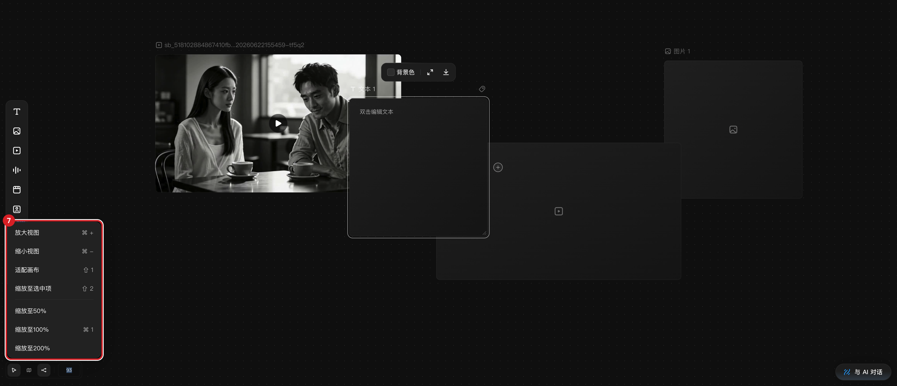
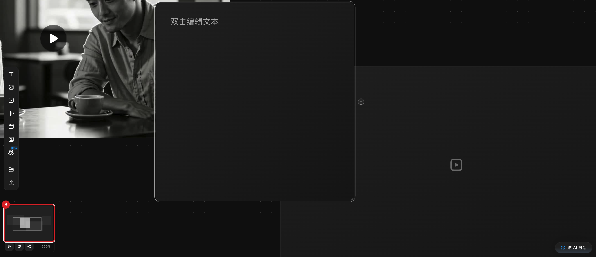

# 平移、缩放与控制画布视图

## 适用角色

已登录的即梦画布创作者。

## 目标

在画布中移动视角、缩放视图、用小地图导航，始终找得到自己的节点。

## 前置条件

已打开一个画布。

## 入口

- 鼠标手势（画布空白处/任意处）。
- 底部 dock：**选择工具** ｜ **小地图** ｜ **显示连线** ｜ 缩放值按钮
  （显示当前百分比，如 100%）。
- 顶栏「回到节点」按钮（仅在特定条件下出现）。

## 原子步骤

### 平移（实测）

1. 把鼠标放在画布上，**向前/向后滚动滚轮**。
2. 结果：画布内容上下平移，缩放比例不变。
   - 成功判据：节点整体上下移动，dock 缩放值不变。
- **注意**：按住左键拖拽空白处**不是平移**，而是框选（见下）。

### 缩放（实测）

1. 按住 **Ctrl** 并滚动滚轮：向上缩小内容放大视图，向下反之；每档约 18%。
2. 或点击底部**缩放值按钮**，弹出菜单：
   **放大视图 ⌘+** ｜ **缩小视图 ⌘−** ｜ **适配画布 ⇧1** ｜ **缩放至选中项 ⇧2** ｜
   **缩放至50%** ｜ **缩放至100% ⌘1** ｜ **缩放至200%**。
3. 点击 **缩放至100%**：视图立即回到 100%（实测 93%→100%）。
   - 成功判据：dock 缩放值变为所选档位。
- **适配画布**：所有节点进入视野；创建/删除节点后系统也会自动适配一次。

### 小地图（实测）

1. 点击 dock **小地图**（按钮呈按下态）。
2. dock 上方出现小地图面板，显示所有节点的缩略位置；再次点击收起。
   - 成功判据：按钮 aria-pressed 翻转，面板出现/消失。

### 显示连线（实测）

1. 点击 dock **显示连线**，默认开启（按下态）。
2. 关闭后连线不再显示（参考连线相关，便于看清单个节点）；再点恢复。

### 框选（实测）

1. 在空白处按住左键拖出一个矩形。
2. 结果：矩形内的节点全部选中，顶部出现「N 节点」多选工具条。
   - 成功判据：状态行 `…, N selected`。

### 回到节点

- 顶栏「回到节点」按钮仅在需要时出现（如视口内无节点时）；点击后视图回到节点区域。
  该按钮的出现条件未完全验证，找不到节点时优先用 **适配画布 ⇧1**。

## 取消 / 恢复

- 框选多了：点击空白处取消全部选中。
- 缩放迷失：底部缩放按钮 → **适配画布 ⇧1** 或 **缩放至100% ⌘1**。

## 相关任务

[创建节点](create-first-node.md) ｜ [编组、排列与整理](organize-group-layout.md)

## 已验证说明

滚轮平移、Ctrl+滚轮缩放、空白拖拽=框选（不平移）、缩放菜单七项逐字与
「缩放至100%」动作、小地图与显示连线开关均为 2026-09-23 实测；「回到节点」
出现条件、「缩放至选中项」禁用态待验证。

## 步骤图

