# 平移、缩放与控制画布视图

## 适用角色

已登录的即梦画布创作者。

## 目标

在画布中移动视角、缩放视图、用小地图导航，始终找得到自己的节点。

## 前置条件

已打开一个画布。

## 入口

- 鼠标手势（画布空白处/任意处）。
- 底部 dock：**工具按钮（选择工具 / 抓手工具）** ｜ **小地图** ｜ **显示连线** ｜
  缩放值按钮（显示当前百分比，如 100%）。
- 顶栏 **搜索** 按钮：按名称找节点，详见下方「搜索节点」。
- 顶栏「回到节点」提示条（**仅在视窗内一个节点都没有时出现**，
  详见下方「回到节点」）。

📋 ~~**底部 dock 一共 5 个控件**~~
🔴 **批次 99 订正：dock 是 4 个，不是 5 个**。本表原先把右下角那颗
**「与 AI 对话」也算进了 dock** —— 那是**取数太粗**（当时用 `y > 640` 筛）造成的，
**本手册的《快速上手》页一直是写对的**。

| 逐字 | testid | 屏上 | 备注 |
|---|---|---|---|
| **选择工具** / **抓手工具** | `canvas-pointer-tool-toggle` | `28×28@16,672` | **两种工具的切换钮**，aria 就是当前模式 |
| **小地图** | `canvas-display-toggle-minimap` | `28×28@48,672` | 按下态开/关 |
| **显示连线** | `canvas-display-toggle-connections` | `28×28@80,672` | 默认**按下**（连线是开的） |
| `Zoom options, 60%` | `canvas-zoom-percent` | `48×28@124,672` | 缩放值 |

**判定 dock 有几个的正解是「查容器的后代按钮」，不是按坐标筛**（批次 99 实测）：
容器 `[data-testid="canvas-navigation-dock"]` 与 `[data-testid="workspace-bottom-dock-frame"]`
**同一矩形 `164×36@12,668`**，两者的按钮后代**都是这 4 个**，且 4 个**全部落在该矩形内**。

⚠️ **「与 AI 对话」不属于 dock**，它在右下角、是**独立的一颗**：
`[data-testid="canvas-sidecar-launcher"]` `118×34@1149,673`，
父链是 `DIV#canvas-sidecar-launchers` → `DIV#workspace-hydrated-canvas-frame`，
**不在 dock、不在 dock frame、也不在顶栏**（三个 `contains` 判定全为 `false`）。

⚠️ **dock 里没有「选择工具」和「抓手工具」两个按钮**，只有**一个**切换钮 ——
它的 `aria-label` 在两个词之间翻。看到 dock 最左边那个钮写着「抓手工具」，
意思就是**你现在正在抓手态**，不是「点这里进入抓手态」。

## 原子步骤

### 选工具：抓手 / 选择（2026-10-01 实测，此前完全未记录）

底部 dock 第一个按钮是**两种工具的切换开关**——它的 aria 就是**当前所处的模式**：

| 当前 aria | 模式 | 空白处按住左键拖拽 = |
|---|---|---|
| **选择工具** | 默认 | **框选**多个节点 |
| **抓手工具** | 切换后 | **平移画布** |

1. 点 dock 第一个按钮 → 在「选择工具」与「抓手工具」之间切换
   （再点一次切回）。
   - 成功判据：按钮 aria 在两个词之间翻转。
2. **抓手工具下平移（实测）**：在空白处按住左键拖拽，画布内容随鼠标同步移动；
   实测拖 (+220, −140) 后节点屏幕坐标变化恰为 `dx=220 dy=−140`，方向与幅度一致。
   - 抓手工具下拖拽**不会**产生选框，状态行的 `selected` 计数保持不变。
3. 想框选节点时**记得切回选择工具** —— 在抓手工具下怎么拖都框不出选框。
4. 🔑 **抓手态下「点不中节点」只对左键成立**（2026-10-02 批次 96 实测）。
   同一独占节点、同一落点，四次动作只有工具态是变量：

   | 动作 | 工具态 | 结果 |
   |---|---|---|
   | **左键**单击 | 选择工具 | **选中** |
   | **左键**单击 | **抓手工具** | **点不中**（选中数不变） |
   | **右键**单击 | **抓手工具** | **正常选中**，**右键菜单照常弹出**，**工具态不变** |

   ⇒ 在抓手态下想选中某个节点又不想改工具态，**用右键**。
   ⚠️ 容易误判的地方：抓手态下左键点不动，很容易以为画布卡了或者节点坏了 ——
   其实只差一个工具态。**判据**：读 dock 第一个按钮的 `aria-label`，
   逐字是 `抓手工具` 就是它。
5. ⚠️ **没有键盘快捷键能切工具**。**V 键实测无效**（批次 82 首测、批次 96 第三次复核：
   连按三次，工具态恒为「选择工具」）。
   ⇒ **退出抓手态的唯一路径就是点那个按钮。** 找不到按钮就在 dock 最左端。

> 💡 抓手工具的价值在于：**节点很密、框选容易误伤时**，用它拖动画布更稳，
> 不会一不小心框中一堆节点。

### 平移（实测）

1. 把鼠标放在画布上，**向前/向后滚动滚轮**。
2. 结果：画布内容上下平移，缩放比例不变。
   - 成功判据：节点整体上下移动，dock 缩放值不变。
   - ⚠️ **滚轮方向与直觉相反**：实测 `wheel(-240)`（向上滚）会让画布内容
     **向下**移动 240px。要让内容上移就得向下滚。
3. 也可切到**抓手工具**后直接拖拽（见上）。
- **注意**：**选择工具**下按住左键拖拽空白处**不是平移**，而是框选（见下）。

### 缩放（实测）

1. 按住 **Ctrl** 并滚动滚轮：向上缩小内容放大视图，向下反之；每档约 18%。
2. 或点击底部**缩放值按钮**，弹出菜单（`role="menu"`，实测 **200×292**），
   七项逐字与实测尺寸（各 192×36）：

   | 逐字 | 快捷键 | 状态 |
   |---|---|---|
   | 放大视图 | ⌘ + | 可用 |
   | 缩小视图 | ⌘ − | 可用 |
   | 适配画布 | ⇧ 1 | 可用 |
   | **缩放至选中项** | ⇧ 2 | **禁用**，并逐字提示「**请先选择至少一个画布元素**」 |
   | 缩放至50% | — | 可用 |
   | 缩放至100% | ⌘ 1 | 可用 |
   | 缩放至200% | — | 可用 |

   - ⚠️ **这个菜单不是右键菜单**：它的 testid 是 `canvas-zoom-menu`，
     而**画布右键菜单**是 `canvas-context-menu` —— 两者**同开时互斥**，
     想找这个菜单请用 `canvas-zoom-menu`，用错会拿到 `null`。
   - 📏 菜单里除了 7 个条目，还有两个**不是条目**的元素：一条 `168×4` 的分隔线，
     以及一个 **`1×1` 的小字**（逐字「请先选择至少一个画布元素」）。
     后者就是下面那条判据说的**原因文案** —— 它藏在第 4 项旁边，不是第 4 项的子元素。

   - 「缩放至选中项」在**没有任何节点/连线被选中时是灰的**，条目下方还会出现一句
     **「请先选择至少一个画布元素」**；**选中任意节点后该项变为可用，且这句原因
     文案会消失**（2026-10-01 实测对照：未选中时 `aria-disabled=true`，
     选中后同一项恢复可点）。
     - 💡 **判据就是那句原因文案在不在**：在 = 不可用，不在 = 可用。
   - ⚠️ **面板声明的 ⇧2 直接按键无效**（2026-10-01 实测）：选中节点后直接按
     **⇧2**，缩放读数**毫无变化**；必须**走菜单点这一项**才生效。
     与时间线的 ⌘B 同类 —— 面板列了不等于按键能用。
3. 点击 **缩放至100%**：视图立即回到 100%（实测 93%→100%）。
   - 成功判据：dock 缩放值变为所选档位。
4. **也可以直接键入百分比**：点缩放值按钮后，会出现一个可以改写的输入框
   （aria 逐字 **`Set zoom percentage`**，48×28，与按钮**同一位置同一尺寸**，焦点自动落上去）。
   改写后按 Enter 生效。
   - 🔴 **订正（2026-10-02 批次 96）**：本页此前写「**缩放按钮本身是一个输入框**」——
     **不成立**。按钮始终是按钮（`data-testid="canvas-zoom-percent"`），
     里面**没有**任何输入框；那个输入框是**菜单打开时另外出现的一个元素**，
     testid `canvas-zoom-percent-input`，只是**叠在按钮的同一个坐标上**，
     所以肉眼看像是「按钮变成了输入框」。
     - 一个副作用值得知道：**菜单打开期间按钮的文字会变空**
       （从 `60%` 变成空串）⇒ **不要用「读按钮文字拿百分比」当判据**，一开菜单就失效。
     - 菜单关闭时，全页**一个输入框都不剩**（只有两个隐藏的文件选择框）。
     - 那个输入框的 `min`/`max`/`step` **都是空的** ⇒ 页面说的 8%–800% 钳制是
       **程序做的**，不是输入框自带的限制。
   - 2026-10-01 批次 24 补测的边界：输入 `150` → `150%` ✅；输入 `65` → `65%` ✅；
     **输入 `5` 被钳到 `8%`** —— 即存在约 **8% 的下限**，不会真的缩到 5%。
   - 📏 **可输入区间约 `8%` – `800%`**（批次 25 补测上限）：
     输入 `1000` → **被钳到 `800%`**。所以这个框**填不出比 800% 更大的画面**。
   - 🔴 **没有「取消」路径：一旦离开输入框，改动一定生效**（批次 26 实测，
     **两轮独立复现**）：
     | 你怎么离开输入框 | 实测结果 |
     |---|---|
     | **按 Enter** | 生效（`50` → `50%`） |
     | **按 Esc** | **也生效**（`77` → `77%`、`44` → `44%`） |
     | **点别处（失焦）** | **也生效**（`33` → `33%`） |
     - 也就是说：**Esc 不是「取消」**，它只是把输入框关掉，改动照样提交。
     - 「不按 Enter 视图不变」只在**手指还停在输入框里**时成立 ——
       一移开就变了。想反悔只能**再键入原来的数值**。
5. **缩放以「视口中心」为锚点，不会替你把内容摆正**（批次 25 实测，全新结论）：
   - 造法：先用抓手把节点拖偏，使节点中心偏离视口中心 `(640,360)`
     约 `(−100, −40)`，再点菜单 **缩放至50%**。
   - 实测：缩到 50% 后节点中心偏移变成 `(−50, −20)` —— **偏移量正好按比例减半**，
     **不是**被拉回正中。
   - 对照：此时按 **适配画布 ⇧1**，节点中心立刻回到 `(640, 360)` **正中**。
   - 💡 结论：**「缩放」只改倍数、保持你当前看的那个点不动**；
     **只有「适配画布」/「回到节点」才会重新居中**。想让内容摆正就按适配画布。
- **适配画布**：**按内容包围盒重新计算缩放与位置**，把所有节点收进视野。
  **2026-10-01 实测**：按 **⌘0** 或 **⇧1**，
  缩放由 100% 变为 62%，原先被推出视野的 6 个节点全部回到画面内
  （内容偏左上，不强制居中）。
  - ⚠️ **不是所有操作都会自动适配**：实测执行「布局 → 宫格布局」后缩放**仍是
    100%**，重排到视野外的节点并不会自动收进来——这时要手动按一次适配画布。
  - 🔧 **2026-10-01 批次 42 订正这条**：「创建/删除节点后系统自动适配」**并非全无观察** ——
    **受控复测（一次只建一个节点、建完立刻读缩放）结果按类型分**：
    | 新建节点类型 | 缩放 |
    |---|---|
    | **视频** | 🔴 `60%` → **`45%`**（`scale(0.6)` → `scale(0.452542)`） |
    | **图片** | 🔴 `45%` → **`43%`**（`scale(0.452542)` → `scale(0.434822)`） |
    | **文本** | ❌ `60%` → `60%`，transform **逐字不变** |
    | **主体** | ❌ `43%` → `43%`，transform **逐字不变** |
    | **空视频**（批次 50） | 🔴 `60%` → `50%`（`scale(0.6)` → `scale(0.503774)`） |
    | **空图片**（批次 66） | 🔴 `60%` → `57%`（`scale(0.6)` → `scale(0.568085)`） |
    | **带内容的图片**（左栏「上传」，批次 51） | ❌ `60%` → `60%`，transform **逐字不变** |
    即 **只有「空的」媒体节点新建时会触发自动适配**；文本、主体、
    以及**经「上传」得到的带内容图片节点**都不会。
    ⚠️ **但上表里那些 ❌ 不能当「类型结论」**（批次 79 订正）：真正的开关是
    **新节点是否需要被纳入视野**，不是节点类型。批次 79 同一批里连续新建
    **音频 → 主体 → 视频**三个节点，缩放 `0.6 → 0.574468 → 0.574468 → 0.549886`
    —— 第一个改了、后两个里只有一个改了，**因为那一个恰好需要被带进视野**。
    ⇒ 「某类型新建时缩放没动」只能说明**那一次它已经在视野里**。
    📌 **量尺寸前先看这里**：缩放值是**真实 scale 四舍五入**的结果
    （`57%` ⇔ `0.568085`），而新建节点会改它 ⇒ **不要把 60% 当成固定的 0.6 除数**。
    🔧 **批次 51 推翻了「包围盒变大」这个机制假设**：带内容图片节点的画布尺寸
    与空视频节点**同为 569×320**，缩放却没动 ⇒ 尺寸不是开关。
    🔧 **批次 53 进一步推翻「内容装不下」**：两轮都把包围盒撑大（+620 / +745）、
    **建完都装不进视口**，却只有空媒体节点那轮改了视口 ⇒ 溢出不是开关。
    ⚠️ 但「节点为空」与「走上传入口」两条路径本批**没分开**，机制仍未完全关闭。
    ✅ **已被批次 54 关闭（2026-10-01 补注）**：用「**右键复制副本**」这条**第三路径**判别 ——
    空视频节点经「复制」出来**照样不触发**（transform 逐字不变）⇒ 与「节点是否为空」无关。
    现有全部读数一致指向：**自动适配是「从左栏新建节点」这个动作的副作用**。详见 [参考 · 视图](../20-reference.md)。
    删除节点后的自动适配本批**未观察到**。
  - 🔴 **别把「自动适配」当成「适配画布」**（批次 53 实测）：建完节点触发的自动适配
    **不会**把全部内容收进画面内 —— 实测触发后内容包围盒（1820）**比视口（2253）还窄**，
    只要重新居中就装得下，可它把视口挪偏了，左侧仍有 **584 画布像素**在视野外。
    想要「全部收进视野」，得**自己按 ⇧1 / ⌘0**。
  - 💡 **「缩放没变」不等于它没干活**（批次 26 实测）：它是**算**出来的。
    - 造法：抓手把节点拖到部分出视口（中心跑到 `(1140,580)`）→ 按 **⇧1**
      → 节点回到 `(356,200)`、中心回正中 `(640,360)`，而**缩放仍是 100%**。
    - 原因：这个单节点在 100% 下**本来就装得下**，所以算出来的倍数还是 100%，
      它只把**位置**摆正了。
    - 对照旧记录：23% → ⌘0 → **50%**（倍数确实变了）。
    → **正确的心智模型：它重算「该用多大倍数 + 摆在哪」，不是「放大到 100%」。**

### 小地图（实测）

1. 点击 dock **小地图**（按钮呈按下态）。
2. dock 上方出现小地图面板，显示所有节点的缩略位置；再次点击收起。
   - 成功判据：按钮 aria-pressed 翻转，面板出现/消失。
   - 面板 DOM：`canvas-minimap-surface` → `canvas-minimap-navigation`
     （`role="application"`，aria 逐字 `小地图`）→ `rf__minimap`，
     实测 **156×114**，显示在 dock 上方。
3. ⚠️ **小地图不能用 Esc 关闭**（2026-10-01 两轮独立复现）：打开后按 Esc，
   面板仍在、`aria-pressed` 仍为 `true`；**必须再点一次 dock 按钮**才收起。
   这与右键菜单、搜索面板、生成历史面板「Esc 可关」的行为不同。
4. **可以在小地图上直接导航**（2026-10-01 批次 24/26 实测，此前全手册 0 处记录）：
   - **单击 = 把被点的那个位置移到视口中心**（批次 26 补测，此前只测过拖拽）：
     点面板**左上角** → 节点中心从 `(640,360)` 跑到 `(1228,761)`；
     再点**右下角** → 回到 `(415,185)`。
     - **缩放不变**（实测始终 100%）、**选中数不变**（0 → 0）——它只挪视口，不改选择。
     - 方向直觉：**点哪边，画面内容就往反方向跑**（点左上 → 内容去右下）。
   - **拖拽 = 平移画布**：在小地图面板内按住左键拖动，视口随之移动
     （实测视口位置 `(415,222)` → `(923,600)`，而 **dock 缩放读数保持 40% 不变**）。
     方向直觉：把地图内容**往左上拖**，画面就**往右下走**（像抓着地图在推）。
   - **滚轮 = 缩放画布**：在小地图上滚滚轮，画布缩放随之变化
     （实测 `40%` → `56%`）。
     ⚠️ 注意它缩放的是**画布本身**、不是小地图的显示比例 —— 这与「在小地图上
     缩放以便看清全局」的直觉相反。**能改变缩放这件事由小地图处理还是事件冒泡到
     画布，本批无法区分**，因此只如实记录可观察结果。

### 显示连线（实测）

1. 点击 dock **显示连线**，默认开启（按下态）。
2. 关闭后连线不再显示（参考连线相关，便于看清单个节点）；再点恢复。

### 框选（实测）

1. 在空白处按住左键拖出一个矩形。
2. 结果：矩形内的节点全部选中，顶部出现「N 节点」多选工具条。
   - 成功判据：状态行 `…, N selected`。

### 搜索节点（2026-10-01 首测 / **2026-10-03 批次 127 全面解剖**）

画布节点多了以后，靠拖和滚轮找节点很慢。用顶栏的放大镜 **搜索**。

> 🔴 **批次 127 订正尺寸**：本节原写「面板 `320×211`」—— **现行构建不是这个数**。
> 实测面板本体 `<ASIDE role="dialog" aria="搜索" data-testid="canvas-feature-panel">`
> 是 **`320×604@765,56`**（`x` 坐标 **765**，生成历史面板是 `797`；宽度都是 `320`）。
> `320×211` 只在**「输入框有词且一个都没匹配上」**这一种状态下出现。
> ⚠️ 并且：**它与顶栏「生成历史」是同一个面板组件**（详见下方方框）。

1. 点击顶栏 **搜索**（放大镜图标，`BUTTON` `28×28@911,16`，
   `data-testid="canvas-panel-launcher"` —— **与「生成历史」共用这个 testid**，按 `aria-label` 区分）。
   判开合看启动器的 **`aria-expanded`**（`false → true`）；它的 `data-state` 恒为 `closed`，别拿它判。
2. 面板的骨架（`320×604`）：

   | 区块 | 矩形 | 内容 |
   |---|---|---|
   | 输入行 | `320×56@765,56` | 放大镜图标 ＋ `<INPUT>` `242×26@822,77`，`aria-label="搜索"`，占位逐字 **`搜索节点...`** |
   | 页签行 | `320×36@765,112` | `role="tablist" aria="Search result categories"`，**九个** `role="tab"`，各 36 高、**宽度各不相同**（带计数） |
   | 结果视口 | `320×460@765,148` | `data-testid="canvas-search-results-viewport"`，**它自己不滚**（见第 6 条） |
   | 分页条 | `320×52@765,608` | `NAV aria="Search result pages"`，逐字 `1 / 6` |

3. **九个分类页签**（逐字）：**全部 ｜ 图片 ｜ 视频 ｜ 音频 ｜ 文本 ｜ 主体 ｜ 时间线 ｜ 组 ｜ 其他**。
   - 当前页签用下划线标记，DOM 判据是 **`aria-selected="true"`**（这五个/九个页签**没有 `data-state`**）。
   - **有内容的分类后面带计数**（本画布实测：`全部 76`、`图片 1`、`视频 1`、`音频 68`、
     `文本 3`、`时间线 2`、`其他 1`；**`主体` 与 `组` 是 0，不带计数**）。
     九个计数相加 `1+1+68+3+2+1 = 76`，与顶栏「节点 76」一致。
   - 🔴 **它们一行放不下**：`tablist` 的 `scrollWidth` 是 **519**、`clientWidth` 只有 **320**
     ⇒ **「时间线 / 组 / 其他」默认在可视区外、点不到**。两种办法看到它们：
     - **横向滑动**（触控板双指横滑 / 滚轮横向）—— 实测 `scrollLeft 0 → 199.5`；
       ⚠️ **纵向滚轮无效、Shift+纵向滚轮无效、拖拽也无效**；
     - **点页签行右端那个圆钮**（`BUTTON` `24×24@1045,118`，**没有文字**、
       `aria="Next search categories"`、父级是 `canvas-search-tab-mask-next`）：
       实测每点一次 `scrollLeft` 在 `0 ↔ 192` 之间翻一屏。
   - ⚠️ **零计数的页签点开也是「未找到匹配节点」**（逐字与「搜了但没匹配」**完全一样**）。
4. **输入节点名做筛选**：输入「视频」→ 只列出名称里含「视频」的节点。
   - 无匹配时逐字提示 **「未找到匹配节点」**。
   - 🔴 **筛选不会重置当前页签**（批次 127 实测）：停在「其他」页签时输入「视频」，
     即使画布上有 2 个视频节点，结果也是 **0 条 ＋「未找到匹配节点」**。
     ⇒ **先点「全部」页签再输关键词**，否则会以为搜索坏了。
     📌 筛选后**页签计数也跟着变**（实测输入「音频」后：只有 `全部 68` 与 `音频 68` 带计数，
     其余七个页签连计数都没有）。
   - 📌 **搜索框会记住你上次输入的词，而且跨「关掉面板 → 再打开」保留**（批次 191 实测）：
     输入 `时间线` → 按 **Esc** 关掉面板（此时 `<INPUT>` **整块从 DOM 卸载**，
     `querySelector` 返回 `null`）→ 再点顶栏 **搜索** 打开 ⇒ 框里**仍然是 `时间线`**。
     ⇒ 面板虽然被卸载，**输入值不是存在那个 DOM 节点里，而是被提到面板外面存着**。
     **实操影响**：下次打开搜索面板看到的**未必是你自己刚输的**，
     也可能是上一轮、甚至上一次会话留在那里的词 —— **先看一眼框里是什么再输**。
5. **点结果行 → 视口跳到该节点并把它选中**（状态行变为 `1 node, 0 edges, 1 selected`）。
   - 🔴 **批次 192 订正本条的落点描述**：原写「实测节点从屏幕右下被移到**视野中央**」——
     **与 26 条逐元素读数对不上**（详见下方「落点」小节）：横向落在 **`474`**（1280 宽视口的中线是 `640`），
     纵向只有**图片 / 时间线 / 导演台**三类落在 `360`（视口中线），视频与音频落在 `258` / `260`。
     ⇒ **「视野中央」这个说法不要再用**，改用下面那张落点表。
   - ⚠️ 点完**搜索面板不会自动关闭**；按 **Esc** 或点画布空白处关掉，
     节点**仍保持选中**。
   - 结果行是 `BUTTON`，**testid 里带节点 id**：
     `canvas-search-result-node_<节点 id 去掉 node_ 前缀>`
     （实测行 `canvas-search-result-node_pxvkay973v` ↔ 画布上 `node_pxvkay973v`「导演台」，
     十条行全部对得上）。
     🔴 **批次 192 订正尺寸**：本条原写 **`304×64`** —— 现行构建是 **`312×64@773,152`**
     （与手册记的 `320` 宽面板左右各留 `4px` 边距：`769+4=773`、`1089−4=1085`，自洽）。
     行的 `aria` 逐字形如 **`音频 68, 音频`**（名称, 类型）。
   - 🆕 **行内右端还有一个 ⌖「定位」小图标，是第二个入口，行为与点整行逐字相同**（批次 192）：
     `canvas-search-locate-icon-node_<同一个 id>`，屏上 **`16×16@1053,176`**
     （`svg` 填充色逐字 `rgba(255, 255, 255, 0.698)`）。
     受控对照：同一个搜索结果，**点整行**与**点 ⌖ 图标**两臂，
     取景缩放逐字相同（都是 `0.5`）、落点中心逐字相同（都是 `[474, 260]`）、
     点完**搜索面板都仍然开着**。
     ⚠️ **它默认是看不见的**：同一个元素，未悬停时 `opacity = 0`、悬停时 `opacity = 1`，
     而**尺寸（`16×16`）、`color`、`visibility`、`display` 三态逐字不变**
     ⇒ 纯 `opacity` 悬停显影，**不是 `display` 切换、也不是尺寸变化**。
     📌 所以**光标不在这一行上时，那个位置看着是空的** —— 要用第二个入口得先把鼠标移过去。

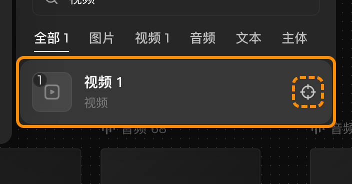

   - 🔑 **它还会顺手把画布缩放「取景」一下 —— 这一点手册此前一直没记**（批次 191 补）。
     下面两张是**同一整屏**、同一块画布，点的是同一行结果：

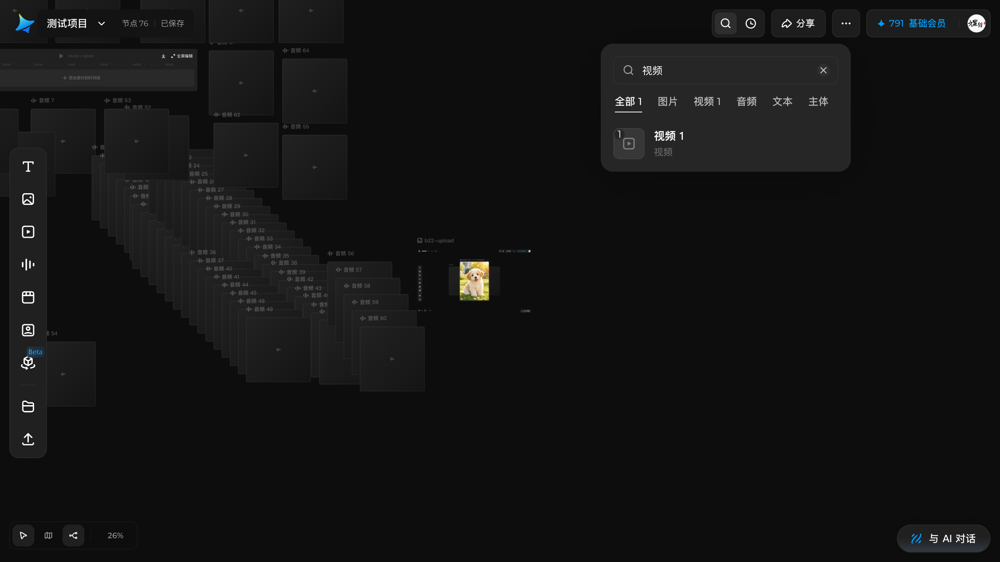

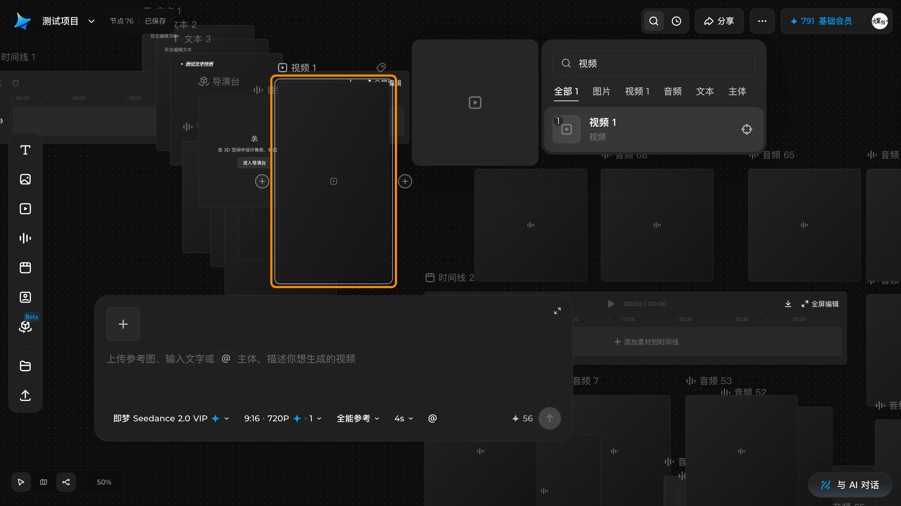

#### 🔑 取景缩放 = `clamp(点之前的缩放, 50%, 该类型的取景预设)`（批次 191，33/33 读数命中）

「取景预设」是**按节点类型**给的，一个类型一个值，**与节点大小无关**：

| 节点类型 | 取景预设（`.react-flow__viewport` 的 transform 逐字） | 该类型测过几个不同节点 |
|---|---|---|
| 时间线 | `scale(0.623333)` | **2**（时间线 1、时间线 2） |
| 视频 | `scale(0.625659)` | 1（本画布只有「视频 1」一个） |
| 音频 | `scale(1.125)` | **7**（音频 1/2/3/65/66/67/68） |
| 图片 | `scale(1.31484)` | 1（`b22-upload`） |
| 文本 | `scale(1.5625)` | **3**（文本 1/2/3） |
| 导演台 | `scale(1.75)` | 1（本画布只有「导演台」一个） |

⇒ **实测跨度 62.3% – 175%**；缩放面板上显示的是四舍五入后的整数（`63%` / `113%` / `131%` / `156%` / `175%`）。

📌 **它不是「一律缩到 50%」，也不是「按节点大小适配」** —— 两种说法都被实测推翻了。
对同一个视频节点，只改「点之前的缩放」这一档：

| 你原来的缩放 | 点结果行之后 | 说明 |
|---|---|---|
| `10%` / `26%` / `40%` | **一律到 `50%`** | 下界是全局常数，**三档独立复现** |
| `50%` / `55%` / `60%` / `62%` | **逐字不变**（只平移） | 落在区间内就不动缩放 |
| `65%` / `70%` / `75%` / `80%` / `100%` / `200%` | **一律到 `62.6%`** | 上界 = 该类型预设 |

⇒ 这条公式在 **11 个不同起点 × 6 种类型 = 33 条读数**上 **33/33 命中**。
🔴 **它与节点尺寸无关**这条是本批最反直觉的一格：同为 canvas `320×320` 的三个节点，
音频落在 `112.5%`、文本落在 `156.3%`、导演台落在 `175%` ——
**所以别再拿「把节点铺满可用区域」去解释它**，那个模型算不出这三个值。
📌 「音频 7 个不同节点、文本 3 个、时间线 2 个，终点逐字相同」是「按类型给预设」的直接证据；
视频与导演台本画布各只有 1 个，**类内一致性对它们不成立**（样本量 1，不要外推）。

⚠️ **取景动画约 400ms，中途有中间值**（实测读到 `0.277` / `0.475` / `0.792` / `0.895` / `1.012`），
终点之后连读四次逐字相同。⇒ **刚点完立刻看缩放读数会读到中间值**，
那不是最终档位；判定要用「终点」而不是「刚点完那一刻」。
📌 每一档终点都满足「**目标节点完整落在视口内**」（实测 11/11 与 6 个不同节点全部 `完整在视口内 = true`）。

⚠️ **只有「从搜索面板点结果行」才会这样**。在画布上**直接点节点标题行**选中同一个节点，
缩放**逐字不动**（`26% → 26%`，5 个时间点全同）⇒ 别把两者混记。
⚠️ **改缩放会把搜索面板关掉**（与批次 134「任何缩放操作都会关掉小地图」同族，实测 `面板在 → 面板不在`）。
⇒ 想「先搜索定位、再调缩放」，顺序必须是**先点结果行、后调缩放**。

#### 🔑 落点也几乎是定死的：**横向中心恒为 `474`**，纵向按类型固定（批次 192，26/26 读数）

| 节点类型 | 取景后节点中心的**纵向**位置 | 测过几个不同节点 |
|---|---|---|
| 视频 | **`258`** | 1（视频 1，但跨 **3 个不同起点缩放**：`10%` / `40%` / `50%` / `100%` / `200%`） |
| 音频 | **`260`** | **8**（音频 1/2/3/5/12/65/66/67/68） |
| 图片 | **`360.5`** | 1（`b22-upload`） |
| 时间线 | **`359.5`** | **2**（时间线 1、时间线 2） |
| 文本 | **`390`** | **3**（文本 1/2/3） |
| 导演台 | **`360`** | 1 |

⇒ **横向中心在全部 26 条读数里只有 `474.0` 这一个取值**（18 个不同节点 × 6 种类型 × 5 个不同起点缩放）。
🔴 **批次 197 订正本句的措辞**：这些读数一个字都没错（本来就是在**固定视口 `1280×720`** 下测的），
但 **`474` 不是常数** —— 六档视口实测下来，横向偏移**逐字恒为 `−166`** ⇒ 真正的公式是
**`落点X = 视口宽/2 − 166`**，而 `474` 只是「**1280 宽视口下**」的那个取值。详见下方小节。
📌 **落点与缩放无关**：视频 1 在 `50%`（不缩放，落点 `160×284`）与 `62.6%`（落点 `200×356`）两档，
中心都是 `(474, 258)`；音频 12 在 `50%` 档落点 `160×160`、音频 1 在 `112.5%` 档落点 `360×360`，
中心都是 `(474, 260)`。

#### 🔴🔴 批次 197 补上：横向 `474` **不是常数**，它跟着视口宽走（销掉「未测」）

上面那句「换视口后 `474` 会不会跟着变，**未测**」，本轮测了 ——
**会变，而且规律极其干净**。

📌 方法：按 `assets-and-upload.md:441` 记的那条路子，**开一个新页签**去改分辨率
（共享页签全程不动），用**同一个搜索词**（`音频`）、**同一个结果行**（第一行），
在 **6 档视口**下各点一次，各等 `3000ms` 让取景动画收敛：

| 视口 | 落点中心 | 视口中线 X | **落点X − 中线X** | **落点Y − 高/2** |
|---|---|---|---|---|
| `800×720` | `(234, 360)` | `400` | **`−166`** | **`0`** |
| `1000×720` | `(334, 360)` | `500` | **`−166`** | **`0`** |
| `1200×720` | `(434, 360)` | `600` | **`−166`** | **`0`** |
| `1280×600` | `(474, 199.81)` | `640` | **`−166`** | **`−100.19`** |
| `1280×720` | `(474, 258.94)` | `640` | **`−166`** | **`−101.06`** |
| `1280×840` | `(474, 319.74)` | `640` | **`−166`** | **`−100.26`** |

🔴 **横向：`−166` 六档逐字相同** ⇒

> ### 📐 横向落点 = 视口宽 ÷ 2 − 166
> 等价写法：**(视口宽 − 332) ÷ 2** —— 即右侧恒定让出 **332px**。

代入验算：`800→234` ✅ ｜ `1000→334` ✅ ｜ `1200→434` ✅ ｜ `1280→474` ✅ **四档全中**。

⇒ 📌 **所以上面那张表里的 `474` 要这么读**：它不是「落点恒为 474」，
而是「**在 1280 宽的视口下**落点是 474」。`474 = 640 − 166`，而 `640` 才是视口中线。
批次 192 记的「横向差 166px」**是对的**，但当时没有意识到那 `166` 本身是**与视口无关的常数**。

🔴 **纵向是另一回事，它跟着「宽」走、几乎不跟「高」走**（这很反直觉）：

| 视口宽 | 三档高度的纵向偏移 |
|---|---|
| `1280` | `−100.19` / `−101.06` / `−100.26`（高 600 / 720 / 840） |
| `800` / `1000` / `1200` | **三档全是 `0`**（高 720） |

#### 🔴🔴 批次 198 找到机制：横向那个 `166` 是**画布平移量里的常数**

同一个节点（`node_tadm1nyykc`「音频 68」）在 7 档视口下的**画布坐标逐字相同**：
**`[1784.13, 649.111]`**（节点画布尺寸 `320×320`），而 `.react-flow__viewport` 的
`transform` 逐档变化。

> ### 📐 屏幕坐标 = 画布坐标 × scale + translate
> ⚠️ **注意变换顺序**：CSS 的 `transform: translate(tx,ty) scale(s)` **从右往左作用**，
> 所以是**先缩放后平移**，**不是** `(画布坐标 − translate) × scale`。
> （我第一版按后者算，**7 档全部对不上**；改对之后 7 档 x 与 y 全部逐字命中。）

代入：

```
落点中心X = 1784.13 × 0.5 + (视口宽/2 − 1138.064) + (320 × 0.5)/2
         = 视口宽/2 − 165.999   ⇒  视口宽/2 − 166
```

⇒ **7 档验算全部命中（误差 `0.00`）**：

| 视口 | `tx` | `tx = 宽/2 − 1138.064` | 预测 X | 实测 X | 预测 Y | 实测 Y |
|---|---|---|---|---|---|---|
| `800×720` | `-738.064` | `-738.064` ✅ | `234.00` | `234.00` | `360.00` | `360.00` |
| `1000×720` | `-638.064` | `-638.064` ✅ | `334.00` | `334.00` | `360.00` | `360.00` |
| `1200×720` | `-538.064` | `-538.064` ✅ | `434.00` | `434.00` | `360.00` | `360.00` |
| `1280×720` | `-498.064` | `-498.064` ✅ | `474.00` | `474.0001` | `259.96` | `259.9595` |
| `1280×600` | `-498.064` | `-498.064` ✅ | `474.00` | `474.0001` | `198.85` | `198.8461` |
| `1280×840` | `-498.064` | `-498.064` ✅ | `474.00` | `474.0001` | `319.09` | `319.0944` |
| `1600×900` | `-338.064` | `-338.064` ✅ | `634.00` | `634.00` | `350.00` | `350.00` |

⇒ 📌 所以那个 `166` **不是经验值、也不是巧合** ——
它是**平移量里的常数 `1138.064` 与节点自身画布坐标相减**的结果。
⚠️ `1138.064` 本身为什么带这种小数，**仍未解出**。

📌 **纵向为什么「跟宽不跟高」？根因找到了** —— `ty` 读数分成**两组**：

| 组 | 视口 | `ty` |
|---|---|---|
| 普通分支 | `800/1000/1200×720` | **三者逐字相同**：`−44.5555` |
| 普通分支 | `1600×900` | `−54.5555` |
| 🔴 **`1280` 特殊分支** | `1280×600 / 720 / 840` | `−205.709` / **`−144.596`** / `−85.4611`（与上面那组**差约 `100`**） |

⇒ **`1280` 宽落进了另一条布局分支** —— 这就是批次 197 那条
「`1280` 宽三档都是 `−100`、其余三档全是 `0`」的根源。
⚠️ **为什么 `1280` 特殊**（宽度断点？右侧栏？Agent 侧栏？）**本轮没有查** ⇒ 只记现象。

> 📌 **这条最影响使用**：**手册的基准视口 `1280×720` 恰好就是那个「特殊档」** ——
> 所以全册的纵向读数（`258` / `260` / `360` / `390`）都取自**另一条分支**，
> **换到 `≤1200` 或 `1600` 宽会得到完全不同的纵向落点**。
> ⇒ **横向现在有跨 7 档视口成立的公式；纵向换视口必须重测。**

📌 **顺带订正批次 197 的一句**：那不是「读数精度差半像素」。
本轮把同一视口连采 **6 帧**，每档落点只有**两个**稳定取值
（如 `1280×720` 的 X 是 `603.1433` 与 `474.0001`、Y 是 `180.1209` 与 `259.9595`）——
**前几帧是取景动画的中间态**（与批次 191 那串 `0.277/0.475/0.792/…` 同一件事）。
⇒ 📌 **判「收敛了没」的实用招：看 6 帧去重后是不是只剩 1 个值**，
别只看最后一帧 —— 最后一帧有可能碰巧落在动画末尾的中间态。

> 📌 **顺带记一条给自动化用**：**新页签的 `setViewportSize` 会污染共享页签** ——
> 本轮 6 档跑完后，共享页签的视口从 `1280×720@2x` 变成了 **`1282×759@2x`**。
> ⇒ 换完视口**必须**用 `pinViewport()` 复位（它写死 `1280×720@2x` 且带污染断言），
> 否则**后面每一个批次**都会带着一个错的视口跑。
> （与 `assets-and-upload.md:442` 记的「不复位会掉到 `800×873`」是同一类现象。）
> 📌 另：只有 `800` 宽那一档扫到右侧 Agent 侧栏
> **`ASIDE[canvas-feature-sidecar]`，aria `Agent`，`200×348@760,…`**；其余五档没扫到
> （⚠️ 未隔离它是「宽度阈值触发」还是「本轮恰好没打开」，只记现象）。

⚠️ **上面那张纵向表（`258` / `260` / `360` / `390`）是 `1280×720` 下的实测值**，
换视口后**必须重测**；但**横向那一条现在有了跨 6 档视口都成立的公式**。


6. **结果区要滚动才看得全，但滚的不是你以为的那一层**：
   每页 10 条、行高 64、行距 **68**（10 条要 680px），而视口只有 460 高
   ⇒ 第 8/9/10 条**落在视口外**（实测它们的中心 `elementFromPoint` 返回别的元素或 `null`）。
   🔑 **但它们够得着**：`canvas-search-results-viewport` 的 `scrollHeight === clientHeight === 460`、
   `overflow-y: visible`（**它不滚**），真正在滚的是它里面的 **`role="list"`**
   （实测在结果区滚滚轮：`列表 scrollTop 0 → 400`）。
   📌 **往上每一层都读过**：viewport → `tabpanel` → `canvas-search-results-slot`
   → `canvas-search-panel` → content(`overflow:hidden`) → surface(`overflow:hidden`) → `ASIDE`，
   **`可滚` 全是 `false`**，只有那个 `role="list"` 会动。
7. **分页条有 4 个按钮**：首页 ⏮ ／ 上一页 ‹ ／ 页码 `1 / 6` ／ 下一页 › ／ 末页 ⏭。
   实测点「前往下一页」：`1 / 6` → `2 / 6`，**结果换成另一批**
   （第 1 页头三条 `…_tadm1nyykc / …_ae08gp8ke3 / …_3cc0k9cfgb`
   → 第 2 页头三条 `…_fd0p2amd3p / …_wdqa2gne4s / …_rs637eg7me`）；点「上一页」能原样回到第 1 页。
   ⚠️ **结果不足一页时分页条整个不出现**（实测「其他」只有 1 条 ⇒ `NAV` 不存在）。
   ⚠️ 首页与末页两个按钮的 `aria` 是**没插值的国际化占位串**
   `{num, plural, other {向前 {num} 页}}` / `{num, plural, other {向后 {num} 页}}` ——
   这是产品侧的缺陷，**读屏软件会念出这串占位符**。

> 📖 **它和「生成历史」是同一个面板组件**（批次 127 实测，2026-10-03）
>
> | 读数 | 顶栏 **搜索** | 顶栏 **生成历史** |
> |---|---|---|
> | 面板本体 | `ASIDE[role=dialog][canvas-feature-panel]` | **同一个** |
> | 两层包装 | `canvas-feature-panel-surface` → `canvas-feature-panel-content` | **同一个** |
> | 最内层 `SECTION` | `canvas-search-panel`，`aria="搜索"` | `generation-history-panel`，`aria="生成历史"` |
> | 父级 | `canvas-workbench-shell` | **同一个** |
> | 矩形 | `320×604@765,56` | `320×211@797,56` |
> | 内部 testid | 8 个 + 每个结果行两个 | 3 个 |
>
> ⇒ **两个按钮共用一个 testid（`canvas-panel-launcher`）、打开的是同一个组件的两种内容。**
> 手册此前一直把它们写成两个独立面板。

> ⚠️ **面板会记住上次选的页签**（批次 127 实测）：在「其他」页签上关掉面板、再打开，
> **仍然停在「其他 1」**，不是回到「全部」。
> ⚠️ **搜索框里的字也不会自动清空**：关闭再打开面板，上次的关键词**还在**
> （实测残留成「视频视频」时，一打开就是「未找到匹配节点」）。
> 想重新浏览全部节点，记得先 **⌘A 全选再 Delete** 清空输入框，
> **并点「全部」页签**（否则筛选范围还锁在旧页签上）。

> 📷 下面这张**拍摄前逐条断言过状态**（面板 `320×604@765,56`、选中「全部 76」、输入框空、
> 分页 `1 / 6`、结果 10 行），拍完又回读一次确认状态没变。

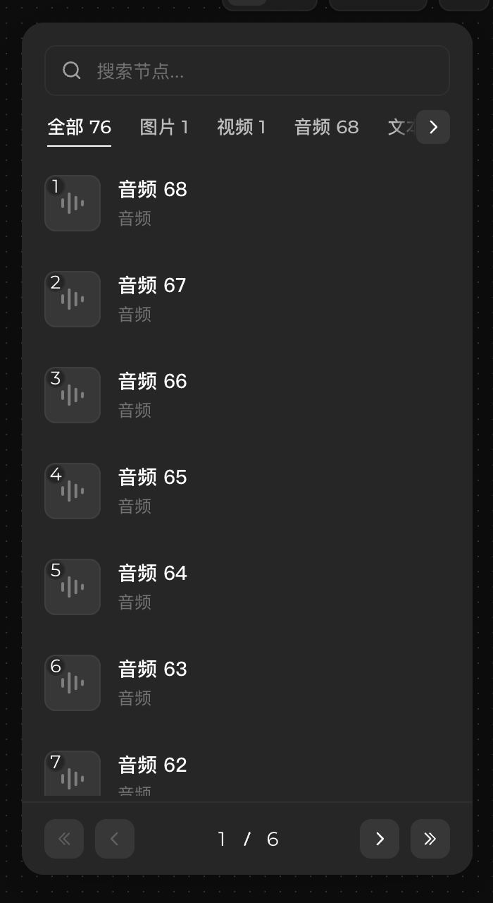

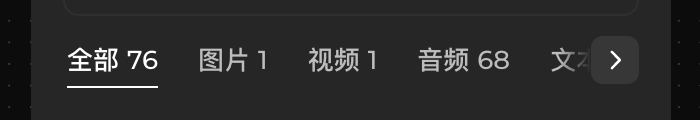

> 下面这张是 **2026-10-01 的旧图**，节点数与计数都与今天不同，仅作对照。

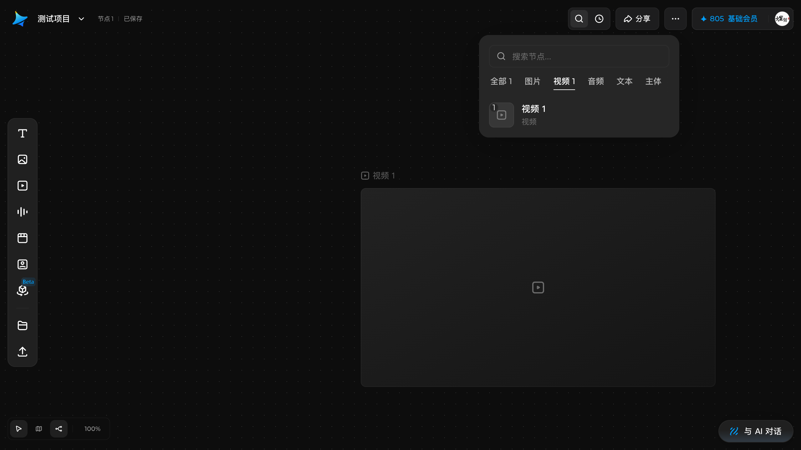


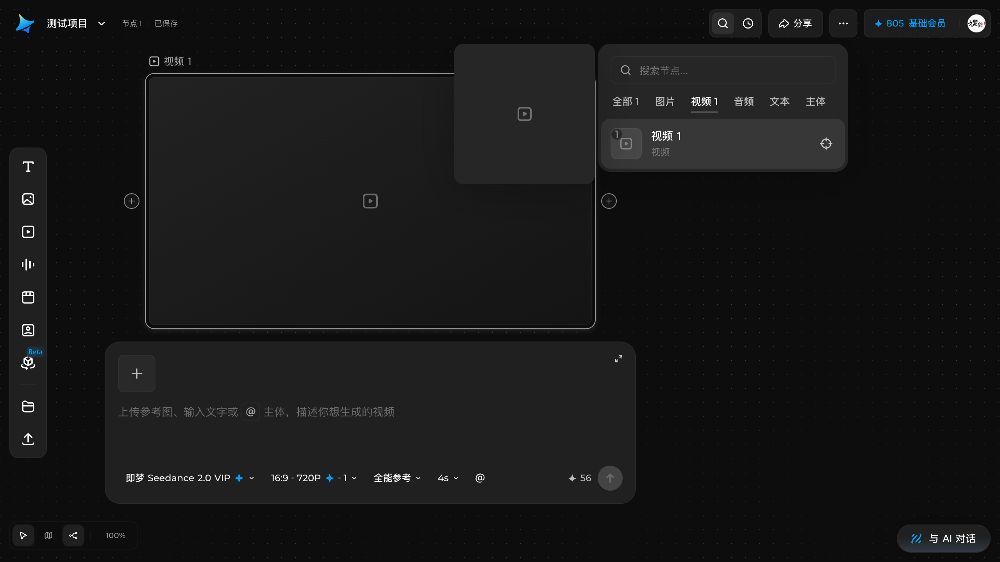

### 回到节点（2026-10-01 批次 25 实测，**推翻此前「不要依赖这个按钮」的结论**）

把画布拖到**一个节点都看不见**时，画面顶部会浮出一条提示，
点它就能一键回到内容。**这条路径此前长期被记为「出现条件未验证」，
批次 25 已用正面实测关闭。**

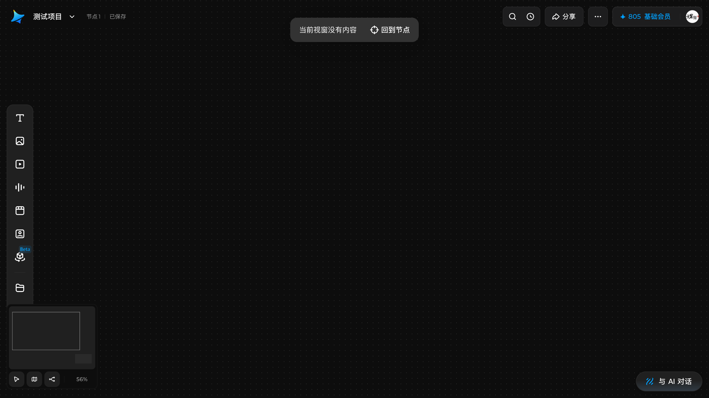

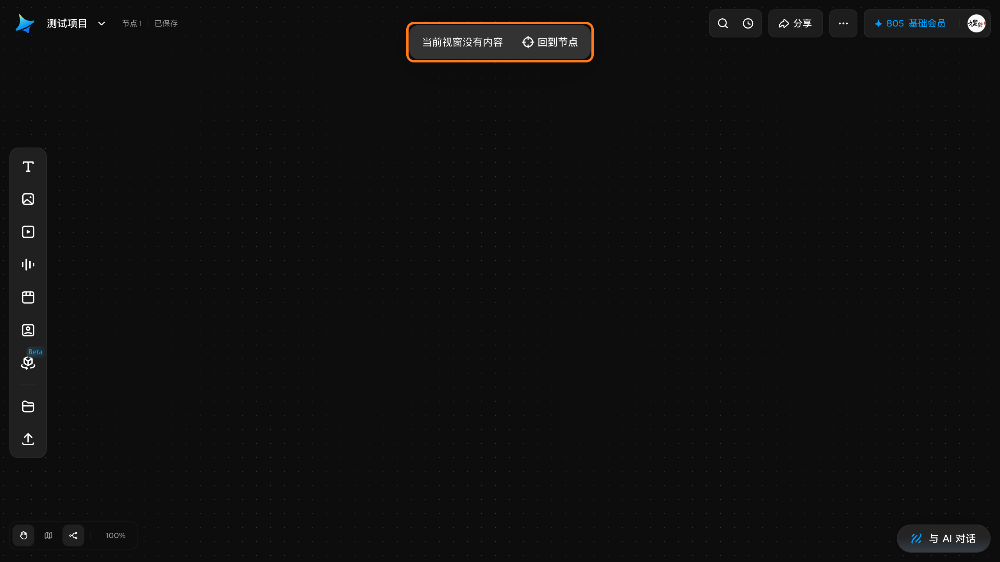

1. **出现条件 = 当前视窗内一个节点都没有。**
   - 最直接的造法：切到 **抓手工具**，在空白处把画布**拖到节点彻底离开视野**。
   - 实测：抓手下拖 (+1080, +570) 后节点中心跑到 `(1720, 930)`（完全在视口外），
     提示条随即出现。
   - ⚠️ **和缩放大小无关** —— 这是此前一直没构造出来的原因：
     缩到 **8%**（下限）时节点虽小但**仍与视口相交**，提示条**不出现**。
     旧的「23% 时不出现」只说明那次节点还在视野里，**推不出出现条件**。
2. **形态**：提示条 DOM 为 `data-testid="back-to-content-overlay"`，
   实测 **232×44 @ (524,32)**，逐字「**当前视窗没有内容**」+ 一个 **72×20**
   的按钮，按钮 **aria 逐字 `回到节点`**。
   - 🔍 **它一直是常驻 DOM，只是平时 0×0**：`getBoundingClientRect()`
     平时返回 `{w:0,h:0,x:0,y:0}`，而 `innerText` **始终**是
     「当前视窗没有内容回到节点」。所以**「按钮在不在 DOM 里」不是判据，
     要看尺寸是不是 0×0**。
3. **点它 = 把节点重新居中**（实测）：点击后节点从 `(1436, 770)` 回到
   `(356, 200)`，中心正好落在**视口正中 `(640, 360)`**，提示条缩回 **0×0**。
   **缩放比例不变**（实测前后都是 100%）—— 它只管「回到内容」，不替你改缩放。
   - 🔴 **批次 120 订正这一步的机制**：那两行**不是「状态行变长了」**。
     「状态行」是 `SPAN#:modern-js-r1:`（`sr-only`、`1×1@(-1,-1)`，屏上不可见，见
     [界面速查](../20-reference.md)）；提示条是**另一个元素**
     `back-to-content-overlay`（平时 `display:none` ＋ `0×0`）。
     两者是**兄弟**（共同祖先是一个无 testid 的 `DIV`，都挂在
     `MAIN[aria-label="Canvas workspace"]` 下），**互不包含**。
     ⇒ 状态行自己的 `textContent` **永远只有那一句**；
       你读到「末尾多出两行」是因为读了**同时包含这两者**的容器的 `innerText`。
4. **怎么把它弄出来（排障用）**：抓手工具拖出视野、或在小地图上拖拽/滚轮
   （见上方小地图第 4 步）；点 **适配画布 ⇧1 / ⌘0** 同样能回到内容。

> 💡 **「回到节点」与「适配画布」的区别**：前者是**迷路时的救急按钮**
> （只在完全看不见内容时出现），后者是**常规整理动作**（随时可用、且会重算缩放）。
> 两者都能让你找回节点，别把前者当成「坏了没显示」。

## 取消 / 恢复

- 框选多了：点击空白处取消全部选中。
- 缩放迷失：底部缩放按钮 → **适配画布 ⇧1** 或 **缩放至100% ⌘1**。
- **整个画面空、一个节点都看不见**：顶部会自己浮出
  **「当前视窗没有内容 ｜ ⊕ 回到节点」**，点「回到节点」即可把内容重新摆回正中
  （缩放不变）。见上方「回到节点」。

## 相关任务

[创建节点](create-first-node.md) ｜ [编组、排列与整理](organize-group-layout.md) ｜
[帮助与快捷键](help-and-shortcuts.md)

## 已验证说明

滚轮平移、Ctrl+滚轮缩放、空白拖拽=框选（不平移）、缩放菜单七项逐字与
「缩放至100%」动作、小地图与显示连线开关均为 2026-09-23 实测。**2026-10-01 补测**：
⌘0/⇧1 适配画布（100%→62%，节点全部回视野）、⌘1 缩放至 100%（62%→100%）、
⌘+/⌘− 逐级缩放（100%→120%→100%）均为当日实测；「布局后不自动适配」为当日对照
实测。⌘0 同样可作为快捷键路径（面板列为 ⇧1 或 ⌘0）。

**2026-10-01 批次 10 补测（关闭两处待验证项 + 补一处全新覆盖）**：

- **「缩放至选中项 ⇧ 2」的禁用态已确认**：未选中任何元素时该项灰显，
  并逐字提示「**请先选择至少一个画布元素**」。此前正文只把它列为菜单项。
- **滚轮方向已实测**：`wheel(-240)` 使内容下移 240px（与直觉相反）。
- **抓手工具是真实存在的第二种工具**（此前正文只写了「选择工具」，
  且未解释它）：dock 第一个按钮在 `选择工具` ⇄ `抓手工具` 间切换，
  抓手下空白拖拽 = 平移（实测 `dx=220 dy=−140`），选择工具下 = 框选。
- **顶栏「搜索」为全新覆盖**（此前全手册 0 处提及）：`role="dialog"` ~~320×211~~
  **🔴 批次 127 订正：实为 `320×604@765,56`**（`320×211` 只出现在「输入框有词且零命中」时；
  且它与「生成历史」是**同一个面板组件**）、
  输入框占位「搜索节点...」、九个分类页签带计数与 `aria-selected`
  （**九个一行放不下，只有横向滚动或点右端圆钮才看得到后三个**）、
  无匹配逐字「未找到匹配节点」（**零计数页签也是这句**）、
  点结果会**定位并选中**节点且面板不自动关闭、
  **输入值在关闭重开后保留**、**选中的页签也保留**（批次 127 实测）。
  批次 127 另补：分页条 4 个按钮（`1 / 6`）、结果行 testid 带节点 id、
  **筛选不重置页签**、结果区真正在滚的是里面的 `role="list"`。

**仍未验证**：~~「回到节点」按钮的出现条件~~ —— **已于批次 25 关闭，见上方
「回到节点」小节**；~~抓手态下 dock 的其它按钮能不能点~~ —— **已于批次 106 关闭，
见上方「抓手态只管画布左键」**；节点拖动已在本批单独实测（见下）。

**2026-10-02 批次 106 补测**（只读为主；唯一的状态改动是切工具态与缩放，**全部当场归位**）：

- ✅ **关闭本页最后一条「未验证」**：抓手态下 **小地图 / 显示连线 / 缩放值** 三颗钮
  **全部照常工作**，缩放菜单里的 **放大视图 / 缩小视图** 也照常
  （`60% → 72% → 60%`），五次操作工具态全程保持 `抓手工具`。
  判据一律取 **`aria-pressed`**（不是面板可见性、不是连线数量 —— 那两个都被骗过）。
- 🔑 **结清一条从没闭环的老账**：缩放**输入框**的「键入 + 回车」两半都验完了
  （键入 `40` 不回车 ⇒ 值变而画面不动；**按 Enter** ⇒ 菜单关闭、缩放变 `40%`）。
  ⇒ **「菜单里没有 40% 档」不等于「到不了 40%」**，此前多批的 40% 档就是这么来的。
- 🔴 **顺带纠正一条测量判据**：缩放要读 `canvas-zoom-percent` 的 `aria-label`，
  **不能**用 `body.innerText` 的 `NN%` 正则（菜单打开时会命中菜单项 `缩放至50%`）。
- 收尾终态：**选择工具 / 小地图关 / 显示连线开 / 缩放 60%（连读 60/60）/ `0 selected`**。


**2026-10-02 批次 96 补测**（只读为主，唯一的状态改动是切换工具态，测完已归位）：

- 🔑 **抓手态的「点不中」只对左键成立**（独占节点、同落点、四次动作只有工具态是变量）：
  抓手态 **左键 → 不选中**；抓手态 **右键 → 正常选中且菜单照常弹出**，工具态不变。
  已同步写进 [排障页 · 节点点不中](../90-troubleshooting.md)。
- ✅ **V 键不切工具**第三次独立确认（连按三次，工具态恒为「选择工具」）。
- 📋 **底部 dock 逐个读数**（见上方「入口」的 5 行表），并写明
  **dock 里没有「选择工具」和「抓手工具」两个按钮，只有一个切换钮**。
- 🔴 **「缩放按钮本身是一个输入框」不成立** —— 按钮始终是按钮（`canvas-zoom-percent`），
  内部无输入框；输入框（`canvas-zoom-percent-input`）是菜单打开时**另外出现**的元素，
  叠在同一坐标上。附带两个后果：**菜单打开期间按钮文字变空**、
  **菜单关闭时全页没有输入框**。
- ⚠️ ~~**未验证：抓手态下 dock 的其它按钮还能不能点**~~
  —— **已于 2026-10-02 批次 106 关闭，见下方「抓手态只管画布左键」**。
  上一轮不作数的原因是**实验设计错了**（格子串扰），不是做不了。

### 🔑 抓手态只管画布上的左键，dock 完全不受影响（2026-10-02 批次 106 实测）

这是本页关闭掉的那条「未验证」。**逐个按钮在抓手态下点一遍**，判据一律取
**控件自己声明的状态**（`aria-pressed` / `aria-label`），不取「它影响到别的东西」：

| dock 按钮 | 抓手态下点它 | 判据读数 | 结论 |
|---|---|---|---|
| **小地图** `canvas-display-toggle-minimap` | ✅ 响应 | `aria-pressed` **`false → true`** | 照常工作 |
| **显示连线** `canvas-display-toggle-connections` | ✅ 响应 | `aria-pressed` **`true → false`** | 照常工作 |
| **缩放值** `canvas-zoom-percent` | ✅ 响应 | 缩放菜单**照常打开** | 照常工作 |
| ↳ 菜单里的 **放大视图** | ✅ 响应 | `Zoom options, 60%` → **`72%`** | 菜单项也照常 |
| ↳ 菜单里的 **缩小视图** | ✅ 响应 | `72%` → **`60%`** | 菜单项也照常 |
| **工具切换钮**（自己） | ✅ 响应 | `aria-label` `抓手工具` → `选择工具`，`aria-pressed` `true → false` | 抓手态里退得出来 |

- 五次操作中**工具态全程保持 `抓手工具`**，没有一次被悄悄切走。
- 🔑 **结论一句话**：**抓手态改变的只是「在画布上按左键会发生什么」**，
  dock 上的按钮和缩放菜单**与工具态无关**。
  （抓手态**左键不选中节点**这条见本页与[排障页](../90-troubleshooting.md)；
  **右键在抓手态下仍正常选中并弹出菜单**。）
- 📌 **每一项点完都当场撤回**（`aria-pressed` 复原、缩放回到 60%），
  收尾终态：选择工具 / 小地图关 / 连线开 / 缩放 60% / `0 selected`。

> 🔴 **这一条为什么上一轮测不出来（教训比结论更值钱）**：
> 上一轮用「小地图面板可不可见」和「`.react-flow__edge` 数量」当判据，
> 两个都被**骗**了 ——
> - 小地图那个容器**关着时也有非零矩形**，可见性恒为 `true`；
> - 这张画布本来**一条连线都没有**（状态行恒为 `0 edges`），数量恒为 `0`。
> 于是三颗钮**全都读成「无变化」**，而它们其实**都响应了**。
> 💡 **判据必须落在控件自己声明的状态上**（这里是 `aria-pressed`），
> 落在「它影响到别的东西上」会被「那个东西本来就没变」骗到。

### 🔑 缩放菜单里没有 40%，但输入框能给你任意百分比（2026-10-02 批次 106 结清）

批次 105 撞出「菜单里只有 `缩放至50%` / `缩放至100%` / `缩放至200%`，**没有 40%**」，
而此前多批的取证都退到过 **40% 档**。本轮把这条路径找回来了：

1. 点缩放值 ⇒ 菜单打开，同时
   **`[data-testid="canvas-zoom-percent-input"]` 出现** ——
   它是 `INPUT type="text"`、**值就是当前百分比**、**`48×28@124,672`（与按钮同一矩形）**，
   并且此时**按钮自己的文字变空**（`innerText` 为 `""`）。
2. 往里**键入 `40` 但不回车** ⇒ 输入框值变成 `40`，
   而按钮的 aria **仍是 `Zoom options, 60%`**、画面**不动**。
   （这正是[步骤图 74](../screenshots/74-zoom-input-typing.png) alt 里那句
   「已键入 65 未按回车，所以画面大小仍是 100%」的机制。）
3. **按 `Enter`** ⇒ 输入框**消失**（菜单关闭）、按钮 aria 变成
   **`Zoom options, 40%`**，**连读两次都是 40/40**（静止）。

⇒ ✅ **结清一条从没闭环的老账**：此前只证了「键入会进输入框」，
**「键入 + 回车」这半步一直没人验**。现在两半都验完了。
⇒ **菜单给的是三个常用档，输入框给的是任意值**；要更小的缩放就往输入框里敲。
⚠️ **量缩放一律读按钮的 `aria-label`（`Zoom options, <N>%`）**，
**不要用 `document.body.innerText.match(/(\d+)%/)`** ——
菜单打开时页面上第一个 `NN%` 命中的是菜单项文案 `缩放至50%`，会把 60% 误读成 50%
（批次 105 实测踩中，害得脚本以为「归位失败」）。

## 步骤图

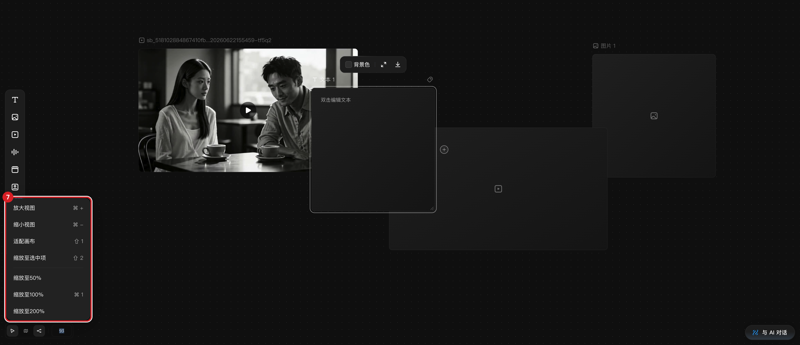

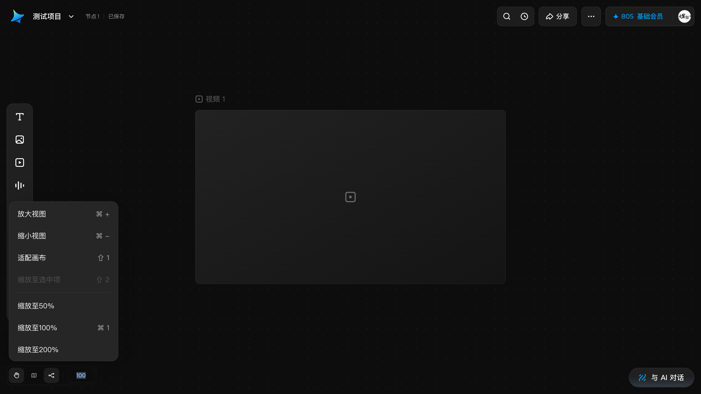

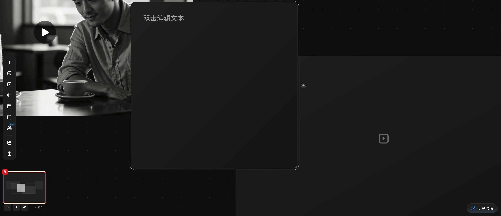

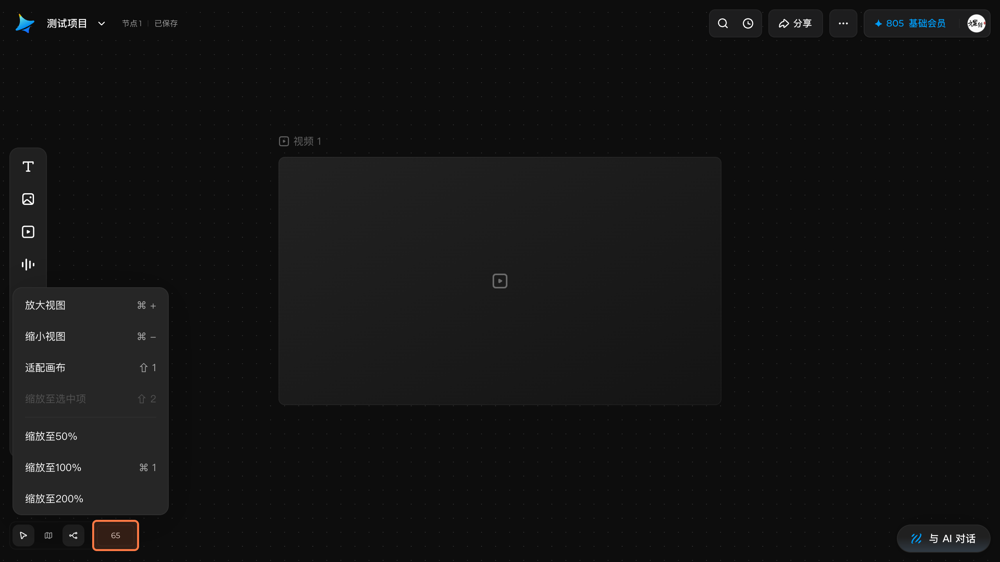

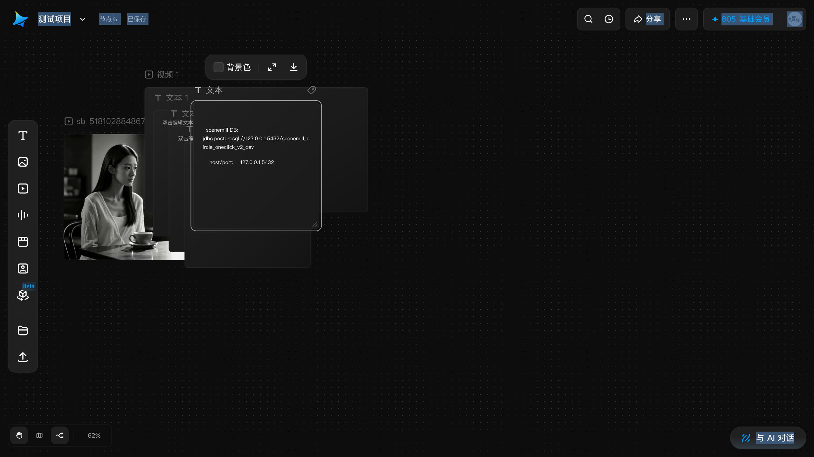
