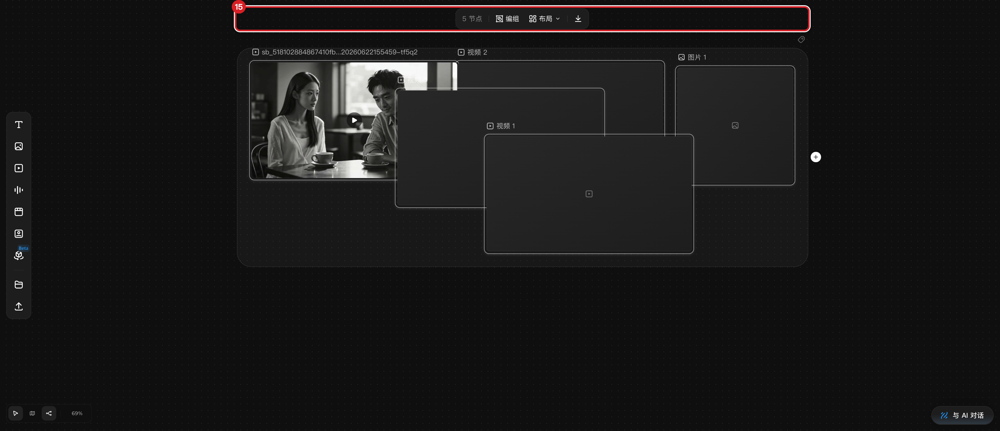
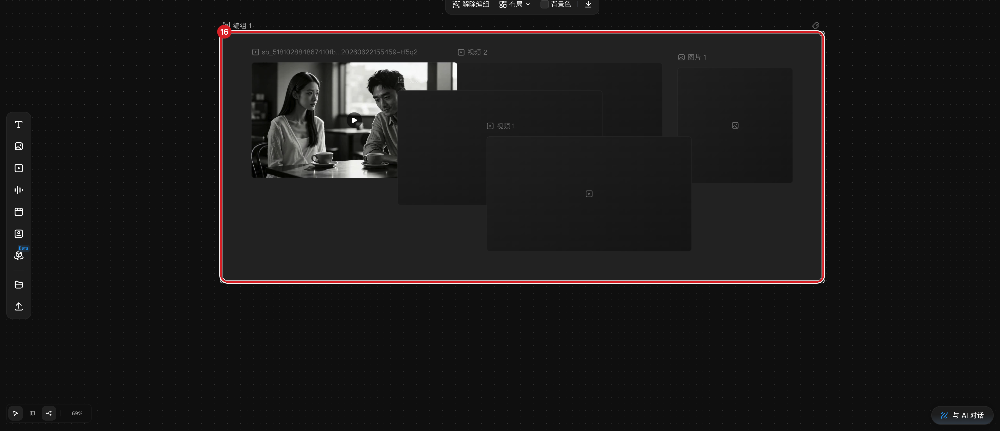

# 编组、排列与整理画布

## 适用角色

已登录的即梦画布创作者。

## 目标

把多个节点框选成组、解组、用布局功能把画布排整齐。

## 前置条件

画布中已有多个节点。

## 入口

- **框选**：空白处按住左键拖拽，框住目标节点。
- 多选后画布顶部出现的**多选工具条**。

## 原子步骤

### 框选多个节点（实测）

1. 在空白处按住左键拖出矩形，罩住要一起管理的节点。
2. 松开 → 全部选中，顶部出现多选工具条：**「N 节点」｜ 编组 ｜ 布局∨ ｜
   下载（图标）｜ Add tags**。
   - 成功判据：状态行 `…, N selected`；工具条计数等于选中数。
   - 注意：Shift+点选、⌘A 全选在本轮实测**未生效**，框选是可靠的多选手势。

### 编组（实测）

1. 框选若干节点 → 点击工具条 **编组**。
2. 结果：出现组卡片「编组 1」（顶部标题），节点计数加一（组本身计入节点数）。
   - 成功判据：状态行节点数 +1；组卡片随成员整体拖动。

### 组工具条（实测）

选中组卡片，工具条变为：**解除编组 ｜ 布局 ｜ 背景色 ｜ 下载**。
- **背景色**：为组选底色（此项只在组工具条上，多选工具条没有）。
- **解除编组**：点击后组卡片消失，成员恢复独立并保持选中。

### 布局整理（菜单实测）

1. 多选（或选中组）→ 点击 **布局∨**。
2. 菜单两项：**宫格布局** ｜ **智能布局**。
3. 选择其一，节点按规则重新排列。
   - 成功判据：节点位置重排，视口自动适配。
   - 恢复：**⌘Z**（布局结果可撤销——撤销对图结构变更有效，重排后建议先试一步 ⌘Z）。

### 其他整理

- **节点颜色标记**：悬停节点标题行 → **Add tags** 钮，给节点打颜色标记分类。
- **显示连线**（dock）：连线太多看不清节点时，可临时关闭连线显示。

## 取消 / 恢复

- 误编组：选中组 → **解除编组**。
- 误移动：**⌘Z**。

## 相关任务

[平移缩放与视图](navigate-canvas.md) ｜ [复制、删除与撤销](duplicate-delete-history.md)

## 已验证说明

框选、多选工具条逐字、编组/解除编组、组工具条（含背景色）、布局菜单逐字均为
2026-09-23 实测；宫格/智能布局的**执行结果**未实际触发（避免改变用户画布布局），
Shift+点选与 ⌘A 未生效记录在案。

## 步骤图

