# 编组、排列与整理画布

## 适用角色

已登录的即梦画布创作者。

## 目标

把多个节点框选成组、解组、用布局功能把画布排整齐。

## 前置条件

画布中已有多个节点。

## 入口

- **框选**：空白处按住左键拖拽，框住目标节点。
- 多选后画布顶部出现的**多选工具条**。

## 三种状态，三套工具条

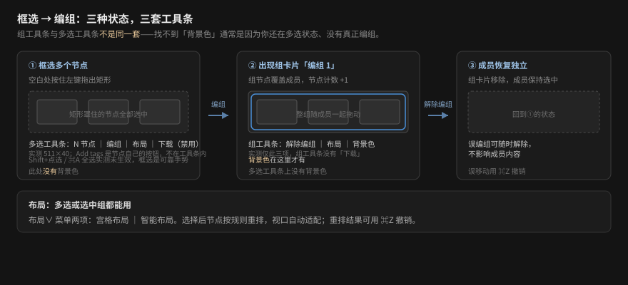

最容易踩的一点：**多选工具条和组工具条不是同一套**。「背景色」只在真正编组
之后才出现——如果你框选了一堆节点却找不到「背景色」，说明你还在①多选状态，
还没有点 **编组**。

另一处容易记反的是「下载」：**①和②都有**，但它是两个不同的按钮
（多选态 `batch-download`、组态 `download`），别当成同一项。

## 原子步骤

### 框选多个节点（实测）

1. 在空白处按住左键拖出矩形，罩住要一起管理的节点。
2. 松开 → 全部选中，顶部出现**多选工具条**。2026-10-01 实测宽 **511×40**，
   四项逐字与尺寸：

   | 逐字 | 尺寸 | 状态 |
   |---|---|---|
   | **N 节点**（实测「2 节点」，DOM `selection-context-toolbar-count`） | 54×32 | 只读计数 |
   | **编组** | 62×32 | 可用 |
   | **布局** | 78×32 | 可用（带 ∨ 下拉） |
   | **下载**（图标） | 32×32 | **可用**（🔴 2026-10-01 批次 55 订正，见下） |

   - 成功判据：状态行 `…, N selected`；工具条计数等于选中数。
   - 🔧 **订正（批次 55）**：早前这里写多选工具条的「下载」**禁用**、条目内附
     「**没有可用的就绪资源**」—— **那其实是右键菜单里那一个下载**，不是工具条上的。
     批次 51/55 两次受控实测：多选工具条的「下载」（含选中集里有带内容的图片节点时）
     **没有** `aria-disabled`、**没有** `data-disabled`、`cursor: pointer`、
     也没有那句文案；而**右键菜单**的「下载」在节点**没有已就绪媒体资源**时
     才是 `aria-disabled="true"` + `cursor: not-allowed` + 那句 `sr-only` 文案。
     详见[右键菜单与画布浮层](canvas-context.md)。
   - 🔴🔴 **2026-10-03 批次 131 订正下一条（原文「多选工具条里没有 Add tags」是错的）**：
     **它就在多选工具条里。** 数 `flow-node-selected-tag` 的实例数：
     静态 0 选中 **76** 个（全在节点内）→ 单选 1 个 **76** 个（工具条内 **0**）→
     **框选 8 个：总数掉到 69，其中节点内 68、工具条内 1**（`aria="Add tags"` `24×24`，
     紧贴工具条右端）→ 收尾回到 **76**、工具条内 **0**。
     🔑 **`76 − 68 = 8`，正好等于选中数** ⇒ **多选时选中节点的标记按钮被搬进工具条**，
     8 个搬上来只留 **1 个**统一入口（即「给这 N 个一起打标签」）。
     ⇒ 所以正确说法是：**基座 `selection-context-toolbar` 里没有它**（3 个直接子按钮：
     编组 / 布局 / 下载），**但外层 `selection-context-toolbar-surface` / `node-toolbar` 里有**
     （4 个后代按钮，第 4 个就是它）。
     - ⚠️ **当年为什么没数到**：`Add tags` 是**图标按钮，`innerText` 逐字为空**（只有 `aria-label`）。
       批次 55/56 用的正是「逐字核对工具条内容」这个方法 ⇒ **它对图标按钮无效**。
       📌 立规：**核对工具条有几项，不能只读 `innerText`**，要并读 `aria-label` / `title` / 子元素 `data-testid`。
     - ⚠️ `Add tags` **仍然不是「每个节点自己的标记按钮」**在多选时的样子 ——
       它此刻是**多选集合的统一入口**，而各节点自己那个仍在节点标题行右侧
       （多选时节点内仍有 68 个实例）。
   - ⚠️ **工具条宽度不是固定值**：同一天两次实测分别为 511×40（缩放 74%）与
     1298×40（缩放 100%），计数项也从 54×32 变成 256×40。**别拿宽度当判据，只数按钮。**
     🔑 **批次 135 受控两臂结清了「跟谁走」**：那两次差 1.88 倍**不是**因为缩放，
     而是因为**那两次的选中集不同**。真实公式是
     **屏上宽 = (选中集包围盒 canvas 宽 + 80) × 当前缩放** —— 宽度**既随选中集变、
     也随缩放变**（正比），两者串联。同理，计数项的宽度只跟**选中数**有关（四档恒 `54.1×32`）。

#### 🔴 批次 87 订正：上面那条「宽度随缩放变」的**归因是错的**

先把数算一遍就知道两条解释差多远（页面那两个读数是**同一天、同一元素**）：

| 若「随缩放、canvas 恒定」 | 511 ÷ 0.74 = **690.5** | 1298 ÷ 1 = **1298** |
|---|---|---|
| 差 | **1.88 倍** ⇒ canvas 口径下**根本不自洽** | |

⇒ 「同一元素随缩放」在 canvas 口径下**立不住**。
页面在同一句里其实已经露出了真正的变量 —— **「计数项也从 54×32 变成 256×40」**：
**计数项的宽度取决于选中集**，工具条被**选中集撑宽**。

**2026-10-02 批次 87 受控对照**（只改缩放，选中集跟着变，但**分别记下**）：

| 缩放 | 选中 | 内层 `selection-context-toolbar` 屏上 | 同上 canvas | 外层 `-surface` 屏上 | 计数项屏上 |
|---|---|---|---|---|---|
| 74% | 7 个 | **`255×40`** | 345×54 | `464×40` | `53×32` |
| 60% | 8 个 | **`256×40`** | 427×67 | `441×40` | `54×32` |

- 🔑 **内层 `selection-context-toolbar` 的屏上宽度跨缩放几乎不变（255 / 256，差 1px）**
  ⇒ 它和批次 85 的生成面板（`680×208` 恒定）**是同一类**：**portal 挂载、不随画布缩放**。
  它的 **canvas** 值才随缩放变（345×54 vs 427×67，差 24% ≈ 缩放比之差）。
- 🔴 **外层 `-surface` 的宽度变化（464 → 441）跟着的是选中数，不是缩放**
  （7 个 → 8 个时计数项 53 → 54，surface 反而**变窄**了 23px，说明它的宽度不是纯累加）。
- ⚠️ **本轮既没复现 `511×40`，也没复现 `1298×40`。**
  **`1298×40` 最可能是「选中集很大时被撑出来的」**，不是缩放造成的
  （这块共享画布上有 14 个他人的音频节点，全选时完全够得着这个量级）。
  **这两条读数的成因本轮未查明，如实标为「待查」，不删原记录。**

#### 🔴 三层 testid：别用 `innerText` 读工具条内容

实测同一次多选命中**三个**元素，而且**外层把节点包在里面**：

| 层 | testid | 74%（7 个） | 60%（8 个） | 父元素 |
|---|---|---|---|---|
| 外 | `selection-context-toolbar-surface` | `464×40@104,288` | `441×40@141,50` | **`node-toolbar`** |
| 中 | `selection-context-toolbar` | `255×40@208,288` | `256×40@233,50` | `relative flex w-max justify-center` |
| 内 | `selection-context-toolbar-count` | `53×32@213,292` | `54×32@238,54` | `selection-context-toolbar` |

🔴 **外层 `surface` 的父元素是 `node-toolbar`**，而 `node-toolbar` 又是
批次 85 说的那个**一个 testid 两类面板**的元素。
⇒ `surface.querySelectorAll('button')` 会把**节点自己的按钮**一起捞进来
（本轮实测就捞到了一个 `Add tags`，`[data-testid="flow-node-selected-tag"] 24×24`，
坐标在工具条**下方**，不在工具条里）。
⇒ 同理 `surface.innerText` 读出来是
`7 节点 ｜ 编组 ｜ 布局 ｜ 没有可用的就绪资源` —— 末尾那句是
**下载按钮的 `sr-only` 禁用原因**，不是工具条的第四项文案。

#### 🔴 再订正批次 55：工具条上的「下载」在**空选中集**下**也是禁用的**

批次 55 的结论是「多选工具条的下载**没有** `aria-disabled`、也没有那句文案，
那是右键菜单里那一个下载」。本轮实测**推翻了它的适用范围**：

| 选中集 | 工具条「下载」读数 |
|---|---|
| 7 个节点（视频/文本/时间线/导演台/音频，**无已就绪媒体资源**） | `32×32`，**`aria-disabled="true"`**，工具条文本末尾附逐字「**没有可用的就绪资源**」 |
| 1 个带内容的图片节点（批次 55/51 的场景） | 无 `aria-disabled`、`cursor: pointer`、无那句文案（批次 55 原结论，仍成立） |

⇒ 🔑 **判据不是「它在工具条上还是右键菜单上」，而是「选中集里有没有已就绪的媒体资源」。**
同一个按钮、同一个 `sr-only` 文案，**两个入口共用同一套判据**。
⚠️ 批次 55 那句「那其实是右键菜单里那一个下载」**把判据归错了层**：
它其实是**同一个判据在两个入口上的表现**。
（⚠️ 本轮**没有**复现「有资源时工具条上可用」那一支 —— 画布上唯一的图片节点
`b22-upload` 摆在 canvas `x≈3562`，不在任何一档的框选范围内。）
   - **框选仍是首选，但 Shift+点选也能用**（2026-10-01 批次 56 受控复测）：
     **⌘A 全选确实不存在**（前置断言「有 2 个已选」后按下，选中数不变）；
     **Shift+点选是标准 toggle** —— 点**未选中**的节点会**加选**（实测 2 → 3），
     点**已选中**的节点会**取消它**（实测 2 → 1）。
     🔧 早前写「Shift+点选反而会取消选中」是**只测了取消那一支就外推**，已订正。
     详见[帮助与快捷键](help-and-shortcuts.md)。

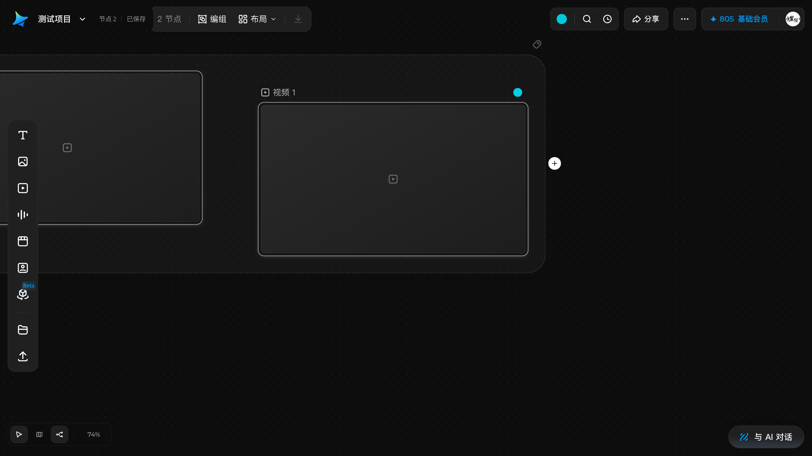

### 编组（实测）

1. 框选若干节点 → 点击工具条 **编组**；或直接按 **⌘G**（实测等价）。
2. 结果：出现组卡片「编组 1」（顶部标题），节点计数加一（组本身计入节点数）。
   - 实测：6 个节点按 ⌘G → 顶栏变 **7 节点**，状态行 `6 nodes, 0 edges, 1 selected`，
     组卡片四角各出现一个圆形控制点。
   - 2026-10-01 复测 2 个视频节点：框选后状态行 `2 nodes, 0 edges, 2 selected`，
     按 ⌘G → `3 nodes, 0 edges, 1 selected`，组卡片 aria 逐字
     **`组 node: 编组 1`**，实测尺寸 **1050×403**（正好罩住两个成员）。
   - 成功判据：状态行节点数 +1；组卡片随成员整体拖动。

> ⚠️ **框选的矩形要真的罩住节点**。实测两次失败都不是产品问题，是手势问题：
> ① 框选的**起点必须落在 `.react-flow__pane`（空白画布）**上，落在节点上会变成拖动节点；
> ② 终点要拖到包围盒的**对角外侧**。若终点算成「包围盒下边 +30」而起点本就在下方，
> 框就没罩到任何节点，松手后选中数为 0。

### 组工具条（实测）

选中组卡片，工具条变为四项：**解除编组 ｜ 布局 ｜ 背景色 ｜ 下载**。
- **背景色**：为组选底色（此项只在组工具条上，多选工具条没有）。
  ✅ **2026-10-04 批次 143 首次验完它的执行结果**（此前只记了色板长什么样）：
  选中的颜色画在组卡片那个 `group-background` 的 **`::before` 伪元素**上，
  `opacity` 恒 `0.16`，**同时底色会从 `rgb(38,38,38)` 换成 `rgb(13,13,13)`**，
  且**只染组卡片、不染成员节点**。六档逐字表见本页下方
  「🔑 背景色取完到底发生什么」小节。
- **解除编组**：点击后组卡片消失，成员恢复独立并保持选中；或按 **⌘⇧G**
  （实测 7 节点 → 6 节点，6 个成员恢复选中）。
  ✅ **2026-10-03 批次 139 首次点这个按钮本身**（此前只验过 ⌘⇧G）：点组工具条上的
  `data-toolbar-value="ungroup"` → **组卡片消失、3 个成员的 id 逐个回来且 canvas 坐标零位移**，
  工具条随即变回**多选工具条**（逐字 `3 节点 编组 布局`，屏上 `288`，四项
  `batch-group` / `batch-organize` / `batch-download` / `Add tags`）——
  成员恢复选中是**自动的**，不用再框选一次。
- 🆕 **一个组在 DOM 里匹配 2 个元素**（批次 139 撞到，写代码时别踩）：
  真身 `data-id="node_xxx"`，外加一个影子 `data-id="__group-resize-chrome__node_xxx"`
  （带四角/四边共 **8 个** `Resize group from …` 把手）。
  两者**都带 `selected`、尺寸与位置逐字相同**，而**顶栏节点数只算 1 个组**。
  ⇒ 用 `document.querySelectorAll('.react-flow__node-group').length === 1` 当判据**永远不成立**；
  正确写法是**先滤掉 `data-id` 以 `__group-resize-chrome__` 开头的**再数。
- 2026-10-01 批次 50 **做了控制变量**：只改「组内有没有媒体节点」这一个变量，
  同一会话两轮独立执行，结论稳定 ——
  **组工具条恒为四项，「下载」与组内成分、与缩放都无关。**

  | 组 | 缩放 | 工具条 | 逐字 |
  |---|---|---|---|
  | 3 个文本节点 | 60% | 336×40 | 解除编组 88×32 ｜ 布局 78×32 ｜ 背景色 75×32 ｜ 下载 32×32 |
  | 2 文本 + 1 空视频节点 | 60% | 367×40 | 同上，逐字相同 |
  | 3 个文本节点 | 47% | 296×40 | 同上，逐字相同 |
  | 2 文本 + 1 空视频节点 | 47% | 312×40 | 同上，逐字相同 |

  - 🔧 **订正两处旧结论**（本手册早前都写错过）：
    1. 「**组工具条只有三项、无「下载」**」—— **错**。这是 2026-10-01 批次 15
       那次 DOM 扫描漏掉了纯图标按钮（`aria-label="下载"`、无 innerText）造成的。
       当场复核两张**旧截图**（`16-organize-group-group-card.png` 2026-09-23、
       `27-group-keyboard.png` 2026-10-01），两张图里都拍到了**四项** ——
       **产品行为从未变过，是读数方法错了**。
    2. 「「下载」的出现条件是组内含媒体节点」—— **也错**。纯文本组同样有「下载」。
    ✅ **2026-10-01 批次 65 第三次独立复核**：用 2 个**纯文本节点**成组，
    工具条读数 `解除编组 ｜ 布局 ｜ 背景色 ｜ 下载`（`632×40`）**仍是四项**，
    第五次出现的「四项」结论依旧成立。
  - ✅ **真正有条件的只有一件事：组里有没有成员。** 0 成员的空组工具条逐字只有
    **解除编组 ｜ 背景色** 两项，**没有「布局」也没有「下载」**
    （没有可布局、也没有可下载的对象）。空组可用 **⌘⇧G** 直接清掉。
  - 四项的 `data-toolbar-value` 逐字：`ungroup` ｜ `batch-organize` ｜
    `group-color` ｜ `download`。⚠️ **多选工具条上的「下载」是另一个按钮**
    （`data-toolbar-value="batch-download"`），两者不要混为一谈。
  - 🔑 **工具条宽度的完整公式（2026-10-03 批次 139 受控实验结清）**：
    **组工具条屏上宽 = max(组卡片 canvas 宽 × 当前缩放, 296)**，高度恒为 40。
    同上表那四行读数**全部由这一个公式解释**，不用再当成四种「不同宽度」。

    | 缩放 | 实测 scale | 组卡片 canvas 宽 | 组卡片屏上宽 | 工具条屏上宽 | 内层 `Selection actions` |
    |---|---|---|---|---|---|
    | 40% | 0.4 | 560 | 224 | **296** | 296 |
    | 45% | 0.45 | 560 | 252 | **296** | 296 |
    | 50% | 0.5 | 560 | 280 | **296** | 296 |
    | 53% | 0.53 | 560 | 296.8 | **296.8** | 296 |
    | 55% | 0.55 | 560 | 308 | **308** | 296 |
    | 60% | 0.6 | 560 | 336 | **336** | 296 |
    | 100% | 1 | 560 | 560 | **560** | 296 |
    | 200% | 2 | 560 | 1120 | **1120** | 296 |

    - 同一个组（3 个文本节点成组）、**只改缩放这一个自变量**，八档逐字复现。
      组卡片 canvas 宽四档恒为 `560`（它是节点的 `style.width`，与缩放无关），
      证明自变量真的只有缩放。
    - **`296` 是下限，不是「另一种宽度」**：内层 `selection-context-toolbar`
      **八档恒为 `296×40`**（它由四个按钮的内容撑出来，与卡片和缩放都无关）。
      缩放低到 `560 × scale < 296` 时，工具条就停在 `296` —— 此时它**比组卡片还宽**
      （40% 时卡片屏上只有 `224`，工具条 `296`）。
    - 🔴 **订正原归因**：原文写「同样 60%/47% 缩放下**卡片宽度不同所致**」——
      **这是未经验证的猜测，而且方向反了**。组卡片宽度是 canvas 口径的固定值，
      换缩放**不会**改变它。真正原因是 **47% 落在了下限区**：
      `560 × 0.47 = 263.2 < 296` ⇒ 读数取下限 `296`。手册表里那个
      「3 文本节点 47% = 296×40」就是这么来的。
    - 📌 **交叉点**：`296 ÷ 560 = 52.86%`。低于它读数被下限接管，高于它严格等于
      `卡片 canvas 宽 × 缩放`（53% 那档读 `296.8` 就是刚跨过去的第一档）。
    - ⚠️ **别拿宽度当判据，只数按钮个数**（这条仍然成立，但理由从「宽度不固定」
      变成了「宽度是缩放的函数，而且有下限」）。
    - 💡 顺带对照：**多选工具条不是同一个公式**。它是
      `屏上宽 = (选中集包围盒 canvas 宽 + 80) × 缩放`（批次 135 结清，**带 `+80`**）；
      组工具条**没有那个 `+80`** —— 同组 60% 时 `(560+80) × 0.6 = 384 ≠ 336`。
      两套工具条同在画布坐标系之外，但各算各的。
  - 内层容器 DOM：`node-toolbar`（surface）→ `selection-context-toolbar`
    （aria 逐字 `Selection actions`，包住这四个动作）→ 各按钮。

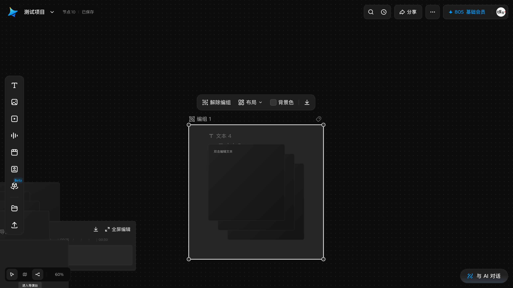

> 💡 **怎么选中组卡片**：点**标题上「编组 1」那几个字本身**。这是组卡片**唯一**
> 可点的位置——2026-10-01 实测，**未选中时整张组卡片都不接收点击**：卡片主体与内部
> 空白都是 `pointer-events-none`，鼠标落点直接穿透到画布背景，怎么点都选不中组；
> 标题文字那**一小块**（实测 36×20）才收得到点击。
> - 选中之后卡片本体才变得可点，并浮出一条标题行（实测宽 1378×24，
>   位于卡片上沿**之外**约 28px，不是画在卡片里面），标题右侧另有一个 24×24 的标签按钮。
> - ⚠️ 早前版本把这里记成「点标题那一行（`group-title-hit-area`，高 18px）」。
>   2026-10-01 复测该 class 在 DOM 中**计数为 0**，实际可点的是标题文字本身（36×20），
>   已订正。
> - ⚠️ 若编组卡片顶边被**顶栏**遮住（卡片顶边 y<58、标题带 y=36–54），
>   标题就点不到；此时先**向下滚动画布**把标题移出顶栏再点。
> - 点组内的**成员节点**选中的是**成员自己**，工具条也是成员自己的（空视频节点会
>   展开生成面板），不会选中组。

**组卡片的四个角把手**（2026-10-01 新记录，aria 逐字，各 24×24）：
`Resize group from top left` ｜ `… top right` ｜ `… bottom right` ｜ `… bottom left`。

**组态「背景色」色板 = 节点级同一套**（2026-10-01 实测关闭此前缺口）：
组工具条点「背景色」展开的面板实测 **214×40**，六枚色块逐字与节点级**完全相同** ——
**无颜色 ｜ 青绿色 ｜ 靛蓝色 ｜ 紫色 ｜ 橙色 ｜ 黄色**。不存在「组专用配色」。

📌 **色板的 DOM 契约（2026-10-01 批次 65 补齐，此前只有截图）**

| 观察项 | 读数 |
|---|---|
| 面板根 | `role="menu"`，**`214×40`**，⚠️ **没有 `data-testid`** |
| 面板类名 | `z-[120] min-w-32 overscroll-contain p-1 …` |
| 色块 | 6 个 **`role="menuitemradio"`**，各 **`28×28`**，行距 34（`x` = 675/709/743/777/811/845） |
| 色块逐字 | 无颜色 ｜ 青绿色 ｜ 靛蓝色 ｜ 紫色 ｜ 橙色 ｜ 黄色 |
| 色块内芯 | `size-canvas-color-choice-swatch`，各 **`18×18`** |
| 「无颜色」选中态 | 白描边 + 深色底 |

⚠️ **色块不是 `<button>`** —— 是 `role="menuitemradio"` 的 `div`。
所以「数按钮个数」和「按 `button` 查」**都会数出 0**（本批两次都栽在这）。
💡 **认浮层要按结构特征认**（`role=menu` + 逐字关键词 + 子项数），
不要按 tag 名或 testid 猜 —— 详见 [概念页 · 尺子坏了但读数很干净](../30-concepts.md)。

#### 🔑 0 成员空组：色板**逐字相同**，变的只有工具条（2026-10-02 批次 108 结清）

本页此前挂着一条「**仍未实测**：0 成员空组（只剩两项时）「背景色」展开的色板
是否与有成员时相同」。本轮用**自己建的两个文本节点**成组，
再逐个把成员删掉，**三态并排读**（不是两态）：

| 组的成员数 | 组工具条逐字 | 色板 6 枚（逐字） |
|---|---|---|
| **2** | `解除编组 ｜ 布局 ｜ 背景色 ｜ 下载` | 无颜色 ｜ 青绿色 ｜ 靛蓝色 ｜ 紫色 ｜ 橙色 ｜ 黄色 |
| **1** | `解除编组 ｜ 布局 ｜ 背景色 ｜ 下载` | **与 2 成员逐字相同** |
| **0** | **`解除编组 ｜ 背景色`** | **与 2 成员逐字相同** |

- ✅ **结论：色板三态逐字相同**（标签、顺序、`18×18`、`border-radius 4px`、
  `border 1px solid rgba(255,255,255,0.1)`、六色 RGB 全部一致）：
  **无颜色 `rgb(61,61,61)` ｜ 青绿色 `rgb(0,202,224)` ｜ 靛蓝色 `rgb(109,124,255)`
  ｜ 紫色 `rgb(190,104,255)` ｜ 橙色 `rgb(255,146,48)` ｜ 黄色 `rgb(255,214,0)`**。
- 🔴 **变的是工具条**：0 成员只剩**两项**（无「布局」无「下载」），
  工具条从 `312×40` 变窄并整体居中，**色板跟着一起左移**（`x` 起点 624 → 604）。
  ⇒ 「色板相同」与「面板位置相同」是**两件事**，别一起说。
- ⚠️ **色板宿主在这个入口下是 `0×0`**：testid
  **`selection-context-toolbar-popup-host`**（class `react-flow__node-toolbar`），
  `getBoundingClientRect()` 读出 **`652,228 0×0`**，
  真正的行在它内部的 `.absolute` 里（也是 `0×0`）。
  ⇒ **任何「按尺寸找浮层」的判据都找不到它**，只能按 testid 定位。
  （与「回到节点」那个常驻 `0×0` 容器是同一类，见本页「回到节点」小节。）

#### 🔑 背景色**取完到底发生什么** —— 六档全测（2026-10-04 批次 143 补上执行结果）

此前本页只记了色板的 **DOM 契约**（面板多大、几枚色块、逐字标签），
**从没验过「取一个颜色之后组卡片底色真的变了」这个执行结果** ——
而**节点**侧早就有这条（见 [引用页 · 节点背景色](../20-reference.md) 与 SOURCE_OBSERVATIONS §3.14）。
本轮用**单自变量六档**补齐（只改选中的颜色，其余全同）。

| 选中的色 | 底色 `[data-testid="group-background"]` | 覆盖层 `::before` 背景 | `::before` 的 `opacity` |
|---|---|---|---|
| **无颜色** | `rgb(38, 38, 38)` | **不存在**（整个伪元素都没有） | — |
| 青绿色 | `rgb(13, 13, 13)` | `rgb(0, 202, 224)` | **`0.16`** |
| 靛蓝色 | `rgb(13, 13, 13)` | `rgb(109, 124, 255)` | **`0.16`** |
| 紫色 | `rgb(13, 13, 13)` | `rgb(190, 104, 255)` | **`0.16`** |
| 橙色 | `rgb(13, 13, 13)` | `rgb(255, 146, 48)` | **`0.16`** |
| 黄色 | `rgb(13, 13, 13)` | `rgb(255, 214, 0)` | **`0.16`** |

**所以「组卡片底色变了」是真的，但它变的不是你以为的那个量。** 三件事同时发生：

1. 🔑 **底色会换一层**：默认是 `rgb(38,38,38)`（类名 `bg-dreamina-bg-menu`，
   即 `--dreamina-color-bg-menu: #262626`）；**一旦选了任何颜色**，它改成
   `rgb(13,13,13)`（`#0d0d0d` = `--dreamina-color-canvas-bg`，画布自己的底色）。
   ⇒ 选色不是「往原底上叠一层」，而是**连底一起换掉**。
2. 🔑 **所选颜色画在一个 `::before` 伪元素上**：
   `<span data-testid="group-background">` 的 `::before`，`inset: 0 0 0 0` 铺满整张卡片，
   背景就是**所选色的原色**，`opacity` **六档逐字恒为 `0.16`**。
   ⇒ 眼睛看到的颜色是**合成值**：
   `round(13×0.84) + round(所选色 × 0.16)`。
   验算紫色：`(13,13,13)` + `rgb(190,104,255)`×0.16 → **`rgb(33,28,51)`**（深紫）。
3. ✅ **只染组卡片，不染成员节点**。截图里组卡片已是深紫，
   罩在里面的两个文本节点仍是原来的深色 —— 成员各自的「背景色」是**另一个入口**，互不影响。

**复原**：再开一次色板点「无颜色」即可，实测 `group-background` 整棵子树读数**与取色前逐字相同**
（不是「看起来差不多」，是把每个元素的背景/背景图/不透明度并排比对，完全一致）。

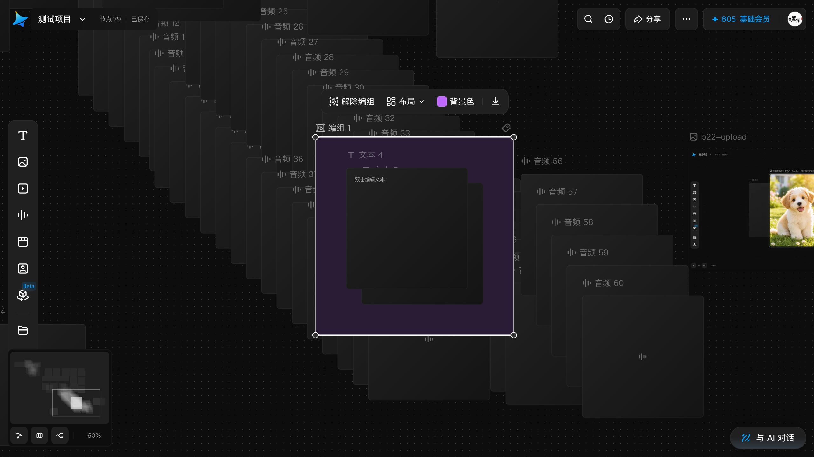

> 📌 **为什么此前一直没查出来**：我第一次 dump 组卡片时**只遍历 `el.children`**，从不读
> `::before` / `::after` —— 而所选颜色那一层**恰恰是伪元素**，于是整棵子树里
> 唯一变了的只有那个**底色**。底色又不含任何色相（`rgb(13,13,13)` 三通道相等），
> 读起来就像「点了个颜色却什么都没发生」。详见 [概念页 · 伪元素是 DOM 扫描的盲区](../30-concepts.md)。

#### 🔑 组自带成员计数，而且**区分单复数**

组卡片的可访问文本逐字形如
**`编组 1 Group 编组 1, N members. Selected.`**（未选中时结尾换成 `Not selected.`）：

| 成员数 | 逐字 |
|---|---|
| 2 | `编组 1 Group 编组 1, 2 members. Selected.` |
| 1 | `编组 1 Group 编组 1, 1 member. Selected.` ← **单数不带 s** |
| 0 | `编组 1 Group 编组 1, 0 members. Selected.` |

⇒ 📌 **这是「组里还剩几个」最省事的判据**。
⚠️ 取值要写成 `/(\d+) members?/` —— **只匹配 `members` 会在 1 成员时返回 `null`**。
⚠️ **成员节点不是组的 DOM 后代**（`组.querySelectorAll('.react-flow__node')` 读出 `[]`），
**不能用「数一数组里有几个节点」代替这个计数**。

#### 🔴 `⌘G` 会多挂一个**不是节点的** `.react-flow__node` 壳

| 读数 | 值 |
|---|---|
| 编组前 `.react-flow__node` 计数 | **78** |
| 编组后 `.react-flow__node` 计数 | **80**（+2） |
| 编组后**状态行**节点数 | **79**（+1） |

多出来的那一个是 **`__group-resize-chrome__node_0ctj8mcr3m`** ——
它带 `data-id`、**并且带 `.react-flow__node` 这个 class**，但它**不是节点**，是组的外框壳。
⇒ 📌 **「`.react-flow__node` 数量」不等于「节点数」**。
批次 97 立的「差集恰好一个」护栏在**编组**这一类操作上会**误判成 +2**；
判节点真伪要看**状态行的节点数**（🔴 批次 120 订正：这串读数是**读屏播报、屏上看不见**；屏幕上只有顶栏「节点 N」报节点数，**没有连线计数**。见 [界面速查](../20-reference.md)。）

**组节点自身的 DOM 契约**（2026-10-01 批次 65 实测，此前手册只记了组工具条）

| 元素 | testid | 读数 |
|---|---|---|
| 根 | `group-flow-node` | 与包围盒同尺寸，`pointer-events-none` 的底座 |
| 背景 | `group-background` | 同尺寸 |
| 边框 | `group-body-frame` / `group-resize-outline` | 同尺寸，均 `pointer-events-none` |
| 内容命中环 | `group-content-operation-hit-ring` | 同尺寸，`pointer-events-none` |
| **标题命中区** | **`group-title-hit-area`** | `552×14`，文字「编组 1」 |
| 标题外观 | `group-title-chrome` | `56×24` |
| 标签钮 | `flow-node-selected-tag` | 🔴 批次 89 订正：原写 `24×24` **不是契约**，aria `Add tags`；屏上边长 = `24px × 视口 scale × 该节点自身的 counter-scale`，同画布 60% 下就有 `24×24`/`28×28`/`29×29` 三种。🔴 **批次 150 再订正**：「**逐节点的**」措辞**从未被验证** —— 同族 3 节点实测该变量逐字相同（4/4），变的是**族**；且新建节点上恒 `24×24`（12/12，跨 3 档缩放）。机制仍待查 |
| 朗读文本 | `sr-only` | 逐字 `Group 编组 1, 2 members. Not selected.` |
| **可点边带** | 无 testid | 上/下 `580×24`、左/右 `24×493`，`pointer-events-auto` |

🔑 **组节点内部点不中**：它的包围盒被**成员**的 DOM 盖住 ——
成员是**兄弟节点**（实测 `group.contains(member) === false`）却绘制在组之上。
所以「按包围盒中心点选组」**必错**：8px 网格扫 372 个点，
只有落在**标题命中区与四条边带**上的那些会命中组。
💡 **选中重叠容器要用网格扫描筛，不能用中心点**（同 [概念页](../30-concepts.md) 那条老纪律）。

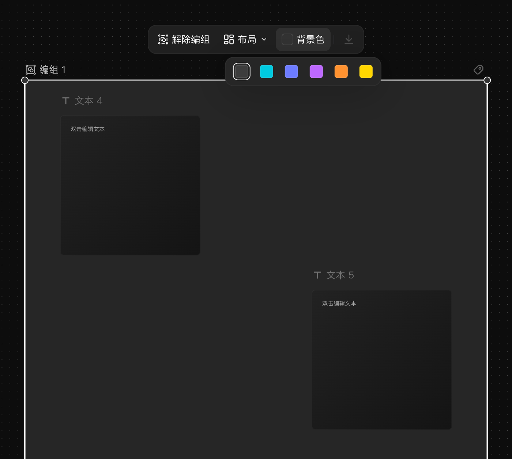

### 布局整理（菜单 + 执行结果均实测）

1. 多选（或选中组）→ 点击 **布局∨**。
2. 弹出菜单两项：**宫格布局** ｜ **智能布局**（菜单浮层实测 180×88，两行各一项）。
3. 选择其一，节点按规则重新排列。
   - **实测「宫格布局」**：5 个节点（3 个 320×320 文本 + 2 个 569×320 媒体）被排成
     两行，行间距 400，同一行内等距留白，媒体节点保持原始尺寸不被拉齐。

> ⚠️ **布局不会自动缩放视口**。实测执行宫格布局后缩放**仍是 100%**，节点被排到
> 视野之外——右侧和下方的节点直接看不见，很容易误以为「节点丢了」。
> **找回方法**：按 **⌘0** 或 **⇧1**（适配画布）把所有节点收进视野；实测缩放从
> 100% 变为 62%，全部节点回到画面内。

- **智能布局**（菜单第二项，2026-10-01 已执行）：同样是「排成若干行」，
  5 个节点同样排成 2 行、行间距同样是 400，节点尺寸同样保持不变。
  与宫格布局的**肉眼差别很小**：两者排出的行都不左对齐到同一列起点
  （实测第二行起点比第一行右移约 120px）。
  想一次排齐就用它，不必纠结两者谁更整齐。

- 恢复：**⌘Z**（实测有效——宫格布局后按一次 ⌘Z，5 个节点的坐标逐一回到布局前的
  位置，与布局前快照完全一致）。

- ⚠️ **快捷键面板里的「宫格视图 G」按了没用**：实测按下会提示
  「此快捷键当前不可用」。要排整齐请用上面的 **布局 → 宫格布局** 菜单，
  不要指望 G 键。详见[帮助与快捷键](help-and-shortcuts.md)。

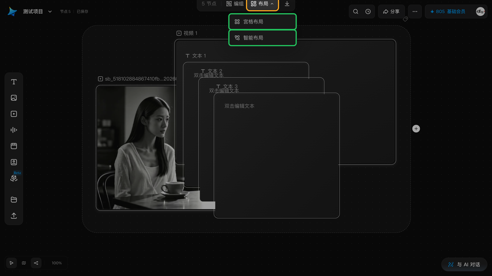

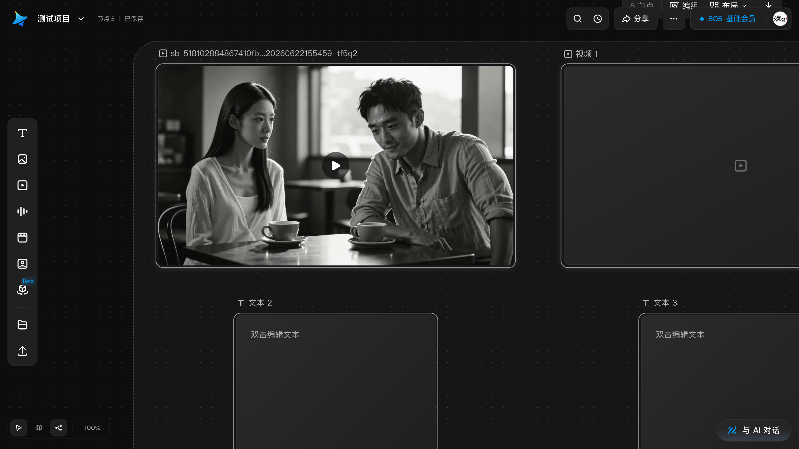


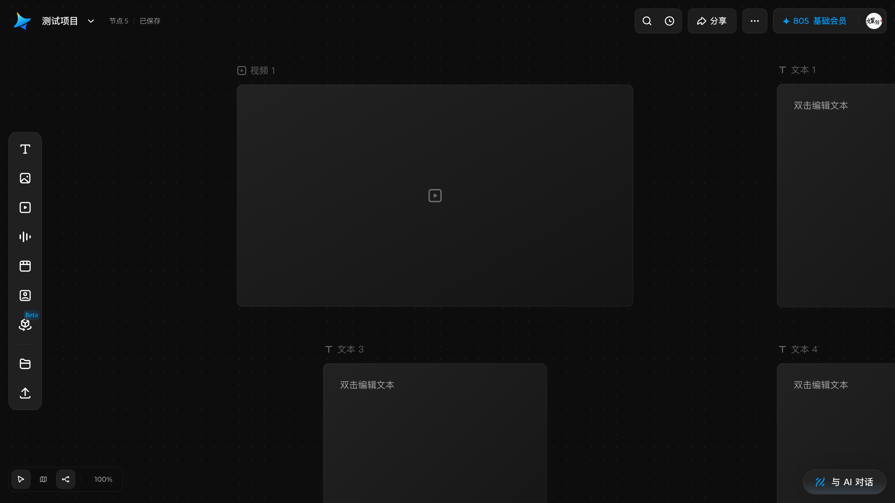

### 其他整理

- **节点颜色标记**：悬停节点标题行 → **Add tags** 钮，给节点打颜色标记分类。
  详见下方「节点颜色标记」。
- **显示连线**（dock）：连线太多看不清节点时，可临时关闭连线显示。

### 节点颜色标记（2026-10-01 实测）

1. 悬停节点，让标题行浮出来 → 点标题行右侧的 **Add tags**（标签图标）。
   - 节点**已选中**时该按钮的 aria 会带上当前色名，逐字形如
     **`Add tags`**（无标记）或 **`Edit tags: 青绿色`**（已有标记）。
2. 弹出一排**圆形色板**，实测 6 枚，每枚 28×28，**aria 逐字**如下
   （注意色名是「青绿」「靛蓝」这种两字全称，不是「青」「蓝」）：

   | 位置 | aria 逐字 | 取色 |
   |---|---|---|
   | 第 1 枚 | **全部清空** | 透明（清除全部标记） |
   | 第 2 枚 | **移除“青绿色”**（已标记时）/ 添加“青绿色” | `rgb(0, 202, 224)` |
   | 第 3 枚 | **添加“靛蓝色”** | `rgb(109, 124, 255)` |
   | 第 4 枚 | **添加“紫色”** | `rgb(190, 104, 255)` |
   | 第 5 枚 | **添加“橙色”** | `rgb(255, 146, 48)` |
   | 第 6 枚 | **添加“黄色”** | `rgb(255, 214, 0)` |

   - 引号是**中文全角引号** `“”`，不是直角引号。
   - 第 1 枚的逐字是**「全部清空」**（一次性清掉该节点的所有标记），
     不是「无标记」。
3. **可以叠加多个标记**（实测）：依次点青绿色和紫色后，节点标题行右侧
   **同时出现青绿、紫两个色点**——不是单选。
4. **已选中的颜色带白色圆环**，aria 从「添加“X”」变成「**移除“X”**」；
   点「全部清空」可一次清掉全部。
5. 色点显示在**节点标题行右侧**（在节点卡片上方，不在卡片里面）。
6. 顶栏的画布图标也会跟着变色——画布里有带标记的节点时，它显示这些颜色；
   该按钮的 aria 逐字形如 **`青绿色, 1 objects`**（颜色名 + 带标记的对象数）。

#### 色板面板的尺寸机制（2026-10-05 批次 171 实测 12 档）

🔴 **本节是增量**：`224×44` 与「6 枚 28×28」这两条**批次 68 就已记着**（见
[导演台节点](director-node.md)），**本批不重复算作发现**。
新的是**它怎么随窗口变**——此前全册只记了 1280×720 下的一个数。

色板面板自己有 testid：**`[data-testid="canvas-node-tag-selector"]`**，
`role="toolbar"`、`aria-label` 逐字 **`Canvas tags`**。
class 逐字含 `fixed … h-canvas-tag-selector-height w-canvas-tag-selector-width
**max-w-canvas-tag-selector** … overflow-x-auto overflow-y-hidden … origin-center`，
内联 style 逐字 `left: …; top: …; visibility: visible; z-index: 200030;`。

```
色板面板 = 宽 min(224, 屏幕宽 − 32) × 高 44（恒定）
```

| 屏幕宽 | 1280 | 400 | 300 | **256** | 250 | 240 | 220 | 200 | 180 | 160 |
|---|---|---|---|---|---|---|---|---|---|---|
| 实测宽 | 224 | 224 | 224 | **224** | **218** | **208** | **188** | **168** | **148** | **128** |
| 屏幕−32 | 1248 | 368 | 268 | 224 | 218 | 208 | 188 | 168 | 148 | 128 |

⇒ **夹取门槛恰好是 `224 + 32 = 256`**：屏幕 256 像素宽时还是 224，**再窄一像素就被压**。
⇒ **高恒 44**：把屏幕高从 720 压到 300、200，量到的都还是 44（这一族里**没有纵向视口项**）。

⚠️ **窗口太窄时，末尾的颜色会点不到。** class 里有 `overflow-x-auto`：
被压窄后内容宽度仍是 **224**（`scrollWidth` 恒为 224），于是**出现横向滚动**，
露在外面的按钮逐档减少：

| 屏幕宽 | 250 | 240 | 220 | **200** | 180 | 160 |
|---|---|---|---|---|---|---|
| 露在外面的按钮 | 6 枚全在 | 缺**黄色** | 缺**黄色** | 缺**橙色**、**黄色** | 缺**橙色**、**黄色** | 缺**紫色**、**橙色**、**黄色** |

👉 **「标签色板里怎么没有黄色」多半不是 bug，是窗口太窄**：**拉宽窗口**，或在色板上**横向滚动**。

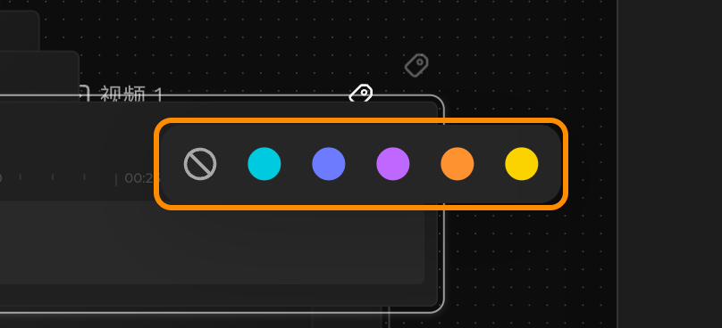

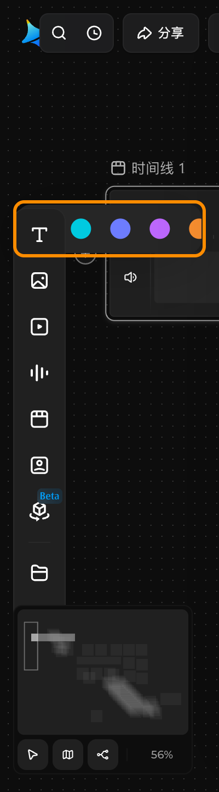

> 标记的用途是**分类**：把同一阶段的素材打同一种色，框选时一眼分辨。
> 标记不影响连线，也不改变节点内容。

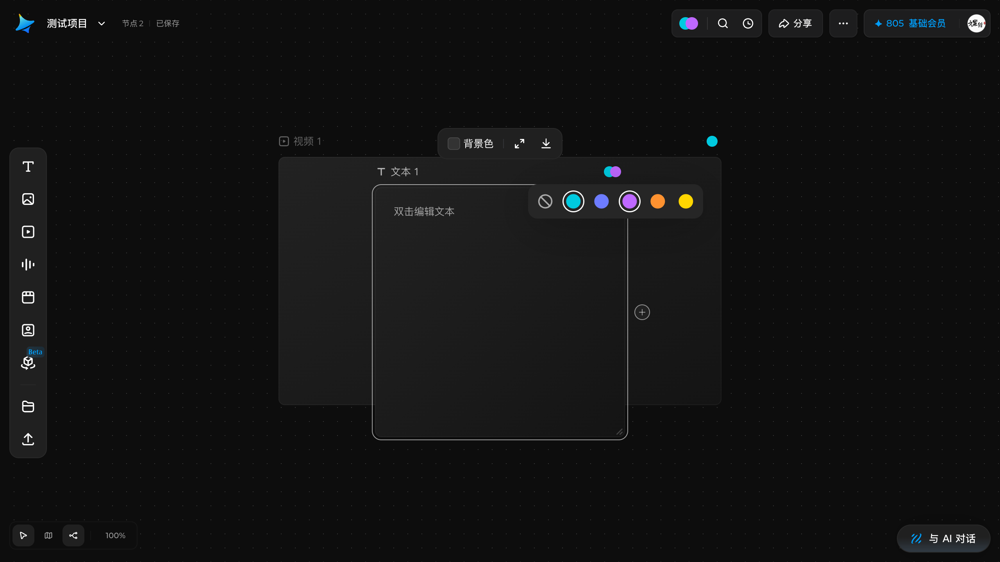

## 取消 / 恢复

| 误操作 | 恢复方式 |
|---|---|
| 误编组 | 选中组 → **解除编组**（或 ⌘⇧G） |
| 误布局 | **⌘Z**（实测可完全还原） |
| 布局后找不到节点 | **⌘0 / ⇧1** 适配画布（布局不会自动缩放视口） |
| 误移动 | **⌘Z** |
| 误删除 | **⌘Z**（可撤销删除，但**必须没刷新过页面**，见[复制、删除与撤销](duplicate-delete-history.md)） |

## 相关任务

[平移缩放与视图](navigate-canvas.md) ｜ [复制、删除与撤销](duplicate-delete-history.md) ｜
[帮助与快捷键](help-and-shortcuts.md)

## 已验证说明

框选、多选工具条逐字、编组/解除编组、组工具条（含背景色）、布局菜单逐字为
2026-09-23 实测。**2026-10-01 补测执行结果**：宫格布局的节点重排坐标、⌘Z 还原坐标、
⌘G/⌘⇧G 节点数变化、布局后视口不自动缩放、⌘0 找回节点、
**（2026-10-01 批次 56 订正：Shift+点选是 toggle，不是「反向取消」；⌘A 仍不存在）**
**智能布局**（5 节点 → 2 行，行间距 400，尺寸不变），以及**节点颜色标记**
（6 枚色板取色逐字、可多选叠加、选中带白环、色点位置、顶栏图标同步变色），
均为当日登录会话实测。快捷键 G 不可用为面板声明与实测的差异，已在正文标注。

**仍未实测**：~~0 成员空组（只剩两项时）「背景色」展开的色板是否与有成员时相同~~
—— **已于 2026-10-02 批次 108 结清，见上方「0 成员空组」小节**：
**三态（2 / 1 / 0 成员）色板逐字相同**，变的只有工具条（0 成员只剩两项）。

**2026-10-01 批次 50 补测（控制变量）**：只改「组内有无媒体节点」一个变量，
两轮独立执行 —— 组工具条**恒为四项**（解除编组 / 布局 / 背景色 / 下载），
与组内成分、与缩放都无关；0 成员空组只有两项（无「布局」无「下载」）；
「布局」下拉 180×88 逐字「宫格布局 / 智能布局」；⌘⇧G 可直接清掉空组。

## 步骤图

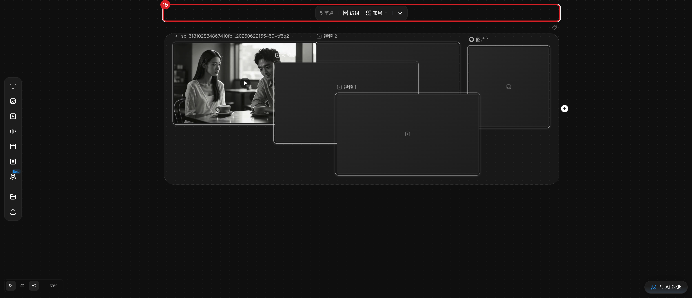

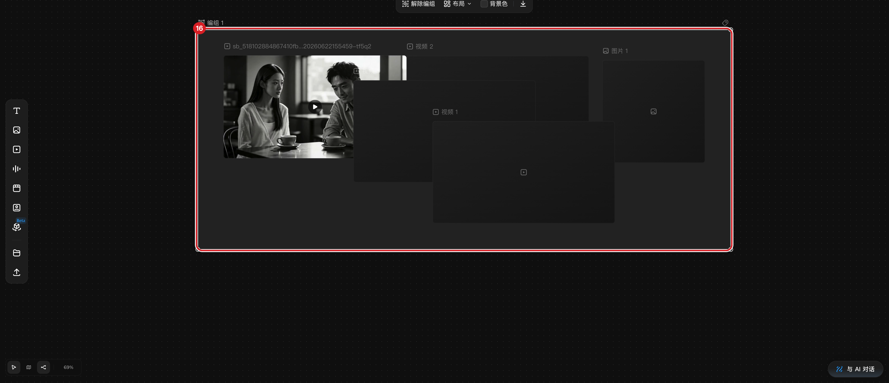
