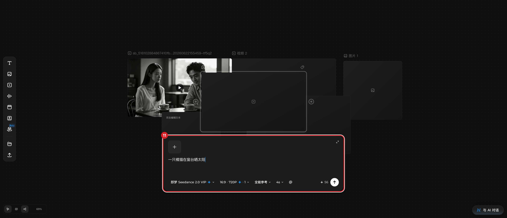
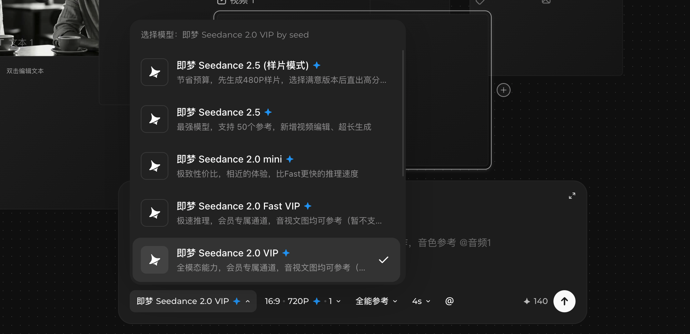

# 准备生成（发送前停止）

## 适用角色

已登录的即梦画布创作者。

## 目标

在生成面板中写好提示词、选好模型与参数、确认积分价格——完成点击 **生成** 前的
全部准备。**本手册不代替你点击生成**：点击即扣积分。

## 前置条件

- 已登录，面板可用。
- 空节点即可开始；也可先接入参考（见 [连接节点](connect-nodes.md)）。

## 入口

选中一个**空节点**（或带参考的节点），节点下方弹出生成面板（680×208；
右上角 **展开** 钮可放大编辑区）。面板随取消选中关闭。

## 面板要素（2026-09-23 实测逐字）

### 视频生成面板（空视频节点）

- 占位提示：上传参考图、输入文字或 @ 主体，描述你想生成的视频
- 参数行：**即梦 Seedance 2.0 VIP ∨** ｜ **16:9 · 720P ✦ · 1 ∨** ｜ **全能参考 ∨** ｜
  **4s ∨** ｜ @ ｜ **✦56** ｜ 圆形发送钮
- 空提示词时 **生成 禁用**。

### 图片生成面板（图片节点）

- 占位提示：上传参考图、输入文字或 @ 主体，描述你想生成的图片
- 参数行：**Seedream 5.0 Lite ∨** ｜ **1:1 · 2K** ｜ **1 ∨** ｜ @ ｜ **✦3 / 张** ｜ 发送钮

### 音频生成面板（音频节点）

- 说明：输入台词并描述声音，可上传参考音频，通过 引用多个音色，使用时间戳编排
  人声、音效与配乐。
- 参数行：创作类型 **音频生成** ｜ 模型 **SeedAudio 1.0**（New）｜ 模式 **全能配音** ｜
  音色 **音色库** ｜ **✦12**（原价 24，积分5折）｜ 生成 禁用

## 原子步骤

1. **写提示词**：点击面板输入区，输入描述文字（支持 @ 引用主体/素材）。
   - 成功判据：空面板的「生成」由禁用变为可用（实测）。
2. **选模型**（视频）：点击模型名 → 菜单五项：
   即梦 Seedance 2.5 (样片模式)✦ ／ 即梦 Seedance 2.5✦ ／ 即梦 Seedance 2.0 mini✦ ／
   即梦 Seedance 2.0 Fast VIP✦ ／ 即梦 Seedance 2.0 VIP✦（当前项带 ✓）。
   每项带一句能力说明（如 2.5「支持 50个参考」）。
3. **选比例/分辨率/数量**（视频）：点击 16:9 · 720P · 1 → 弹层：
   选择比例（21:9/16:9/4:3/1:1/3:4/9:16）｜ 选择分辨率（720P/1080P/4K）｜
   选择生成数量（1/2/3/4）。
4. **选时长**（视频）：点击 4s → 「选择视频生成时长」滑杆（0–15s 刻度）+
   数字输入框。
5. **（可选）接参考**：见 [连接节点](connect-nodes.md)。参考接入后面板顶部出现
   参考 chip，处理完成后即就绪；**有就绪参考时即使不写提示词，「生成」也可用**。
6. **核对价格**：参数行尾部 ✦ 数字即本次预计积分（实测示例：无参考 4s 视频 ✦56；
   带 6s 参考 ✦140；图片 ✦3/张；音频 5 折 ✦12）。价格随参数实时变化，以面板显示为准。
7. **停在发送前**：确认无误后，生成动作由你自行决定。

## 取消 / 恢复

- 放弃本次：点击画布空白处，面板关闭（已输入的提示词不保留在面板中，但节点配置
  会随画布保存）。
- 参考接错：点参考 chip 的移除钮（aria `Remove …`）。

## 常见错误与恢复

| 现象 | 原因 | 处理 |
|---|---|---|
| 「生成」灰色不可点 | 空提示词且无就绪参考 | 写提示词，或等参考处理完成 |
| 价格比预期高 | 参数/时长/数量或参考变化 | 核对参数行；改小参数后价格实时回落 |

## 相关任务

[创建节点](create-first-node.md) ｜ [连接节点](connect-nodes.md) ｜
[使用节点工具条](use-node-toolbar.md)

## 已验证说明

面板结构、占位与参数行逐字、模型菜单、尺寸菜单、时长滑杆、禁用/启用翻转、
价格读数均为 2026-09-23 实测；**从未点击生成/发送**，生成结果与扣费后的行为
不在本手册范围。

## 步骤图

