# 准备生成（发送前停止）

## 适用角色

已登录的即梦画布创作者。

## 目标

在生成面板中写好提示词、选好模型与参数、确认积分价格——完成点击 **生成** 前的
全部准备。**本手册不代替你点击生成**：点击即扣积分。

## 前置条件

- 已登录，面板可用。
- 空节点即可开始；也可先接入参考（见 [连接节点](connect-nodes.md)）。

## 入口

选中一个**空节点**（视频 / 图片 / 音频），节点下方弹出生成面板；面板随取消选中关闭。

- 面板 DOM 一律是 `[data-testid="node-toolbar"]`。
- 视频面板与图片面板实测同为 **680×208**（音频面板见
  [音频节点选音色](audio-node-voice.md)）。
- ⚠️ **面板可能超出视口**：节点在画布偏下时，面板底部会被视口切掉。把缩放拨到
  60% 左右即可完整看到（见 [浏览与缩放画布](navigate-canvas.md)）。

## 视频生成面板（2026-10-01 实测逐字）

- 容器 `[data-testid="node-toolbar"]` **680×208**，内含 12 个 svg。
- 占位提示：上传参考图、输入文字或 @ 主体，描述你想生成的视频
- 面板逐字全文：
  `上传参考图、输入文字或 @ 主体，描述你想生成的视频 ｜ 即梦 Seedance 2.0 VIP ｜ 16:9 · 720P · 1 ｜ 全能参考 ｜ 4s ｜ Current price 56. ｜ 56 ｜ 生成`
- 空提示词时 **生成 禁用**，面板右下角出现逐字提示「**请输入提示词**」。

### 参数行控件（文档序，共 8 个可交互控件）

| 逐字 aria | 类型 | 实测尺寸 | 说明 |
|---|---|---|---|
| `展开视频生成器` | button | 40×40 | 放大编辑区 |
| `添加参考` | button | 48×48 | 上传参考图/视频 |
| `提示词` | `role="combobox"` contenteditable | 646×28 | 输入区 |
| `引用参考` | button | 24×24 | **仅提示词为空时出现**（见下） |
| `选择模型: 即梦 Seedance 2.0 VIP, Standard-only model` | button | 184×32 | 模型下拉 |
| `视频尺寸选项: 16:9 · 720P · 1, Standard-only model` | button | 129×32 | 比例/分辨率/数量 |
| `生成模式: 全能参考` | button | 80×32 | 模式（首尾帧 / 全能参考） |
| `选择视频生成时长: 4s` | button | 46×32 | 时长 |
| `引用参考` | button | 32×32 | **同名第二处**，常驻（见下） |
| `生成` | `type="submit"` | 32×32 | 空提示词时 `aria-disabled="true"` |

- ⚠️ **`引用参考` 在面板里有两处**（24×24 在提示词内、32×32 在底部工具条），
  aria 逐字相同。自动化定位必须加尺寸或位置约束；**并且 24×24 那处不是常驻的**，
  提示词一有内容就消失（详见「接入参考」一节）。
- 参数行四个下拉的按钮 **aria 都带 `, Standard-only model` 后缀**；图片面板的
  对应按钮**没有**这个后缀（见下）。

## 图片生成面板（2026-10-01 实测逐字）

- 容器同为 `[data-testid="node-toolbar"]` **680×208**，但只有 8 个 svg。
- 占位提示：上传参考图、输入文字或 @ 主体，描述你想生成的图片
- 面板逐字全文：
  `上传参考图、输入文字或 @ 主体，描述你想生成的图片 ｜ Seedream 5.0 Lite ｜ 1:1 · 2K · 1 ｜ Current price 3 / 张. ｜ 3 / 张 ｜ 生成`
- 控件 8 个：`展开图片生成器` 40×40 ｜ `添加参考` 48×48 ｜ `提示词` 646×28 ｜
  `引用参考` 24×24 ｜ `选择模型: Seedream 5.0 Lite` 146×32 ｜
  `图片尺寸选项: 1:1 · 2K · 1` 98×32 ｜ `引用参考` 32×32 ｜ `生成` 32×32
  （空提示词时 `aria-disabled="true"`）。

> 🔧 **订正一条旧结论**：本手册早前写「参数行：模型 ∨ ｜ 1:1 · 2K ｜ **1 ∨**」，
> 把「生成数量」当成一个独立下拉。**2026-10-01 实测不存在这个独立控件**——
> 数量是**并入 `图片尺寸选项` 的**（aria 逐字 `图片尺寸选项: 1:1 · 2K · 1`，
> 三个值用 `·` 连在一起）。

## 音频生成面板

- 说明：输入台词并描述声音，可上传参考音频，通过 引用多个音色，使用时间戳编排
  人声、音效与配乐。
- 参数行：创作类型 **音频生成** ｜ 模型 **SeedAudio 1.0**（New）｜ 模式 **全能配音** ｜
  音色 **音色库** ｜ **✦12**（原价 24，积分5折）｜ 生成 禁用
- 逐项 DOM 契约见 [音频节点选音色](audio-node-voice.md)。

## 接入参考：两条入口，一套选择器（2026-10-01 实测逐字）

生成面板有**两个**看起来都叫「加参考」的入口，但它们做的事完全不同：

| 入口 | 逐字 aria | 实测尺寸 | 打开什么 | 定位 |
|---|---|---|---|---|
| 面板左上 ⊕ | `添加参考` | 48×48 | 三选一的**来源**菜单 | 面板内，靠左上 |
| 提示词内 / 底部条 | `引用参考`（**两处同名**） | 24×24 与 32×32 | `@` 提及**选择器**（两级） | 提示词区内 / 参数行 |

### 1. `添加参考` —— 选「素材从哪来」

`aria-expanded` 由 `false` 翻成 `true`，弹出 `[role="menu"][aria-label="添加参考"]`
实测 **240×130**（浮在面板左上外侧）。三个 `role="menuitem"` 各 **232×38**、各 1 个 svg：

| 逐字文案 | 含义 |
|---|---|
| `上传参考内容` | 从本地上传 |
| `从资产库添加` | 复用画布资产库里的素材 |
| `从画布选择` | 复用画布上已有的节点 |

- 三项都是**「选来源」而不是「选具体素材」**，点下去还会再开一层。
  2026-10-01 **只打开、未点选前两项**；第三项 `从画布选择` 已单独测过（见下）。

### 2. `引用参考` —— 选「引用画布里哪一个」

⚠️ **订正一条旧结论**：本手册早前写「`引用参考` 两处，其中 32×32 点了没反应」。
**记反了。** 2026-10-01 实测：

- **32×32**（参数行里的那处）：**常驻**，提示词有无内容都在，**点它正常打开 @ 面板**。
- **24×24**（提示词区内的那处）：**只在提示词为空时才出现**。一旦提示词里有了任何
  字符（哪怕只是刚插入的 `@` 和占位符），它就消失。所以「找它找不到」多半是提示词
  已经不空了，不是控件坏了。
- 两处 `aria` 逐字都是 `引用参考`，自动化定位**必须加尺寸约束**。

### 3. `@` 提及面板：先选类别，再选节点

两条路径打开的是**同一个**面板——点任一「引用参考」，或**在提示词里手打 `@`**。

- 容器 `[data-testid="generation-mention-panel"]` 实测 **240×244**，内含
  `[role="listbox"]`，aria 逐字 **`可能@的内容`**。
- ⚠️ **它渲染在生成表单内部**，不在 body 下：
  `generation-mention-panel < div < div < form{video-generation-form} < div <
  div{node-toolbar-feature-host} < div{node-toolbar}`。
  按「浮层都挂在 body 上」去找会**完全找不到**这个面板。
- 顶部 232×32 一行「添加参考」是**分组标题**，无 `role`、`cursor: auto`、**点不动**——
  别把它当菜单项。
- 4 个 `role="option"` 各 **232×48**、各 2 个 svg（图标 + 向右箭头）：

  | 逐字文案 | 默认选中 |
  |---|---|
  | `主体` | 是（`aria-selected="true"`） |
  | `图片` / `视频` / `音频` | 否 |

- 打开的同时，提示词被写入 `@` 加上一个占位符
  `搜索主体、图片、视频`。
  ⚠️ 占位符文案**会混进 `innerText`**（读出来是 `@搜索主体、图片、视频`）。
  判断「提示词是否为空」不能只看 `innerText`，要看有没有这个 span。

#### ⚠️ 它不是搜索框：打字会直接毁掉这一次引用

面板打开时继续键入「主」，实测结果：

1. 面板**立刻关闭**；
2. 占位符消失，提示词变成**字面量** `@主`；
3. 再键入「体」变成 `@主体`。

**列表既没有收窄，也没有选中任何东西。** 面板顶端那句「搜索主体、图片、视频」是
占位提示，不是输入提示——想「打 @ 再搜名字」的用户只会得到一串普通文字。

#### 二级子菜单

点某个类别，右侧紧贴弹出 `[data-testid="generation-mention-submenu"]`
**240×76**（一级菜单右缘 403、二级左缘 407，间隙 4px）。实测四个类别点出来内容
**逐字都是 `暂无相关节点`**（`role="status"` 232×68）。

- ⚠️ **四类的 aria 并不一致**：`图片` / `视频` / `音频` 的二级 listbox aria 逐字等于
  类别名，各带一个同名 `role="group"`；**`主体` 的二级 listbox 既没有 aria、也没有
  group**。自动化不能假设 `group` 一定存在。
- 2026-10-01 的观测条件下，画布上只有一个**空**的「视频 1」节点
  （`No resources: 0 ready`），四类全空。**未能确认**「空节点是否被排除」与
  「当前节点自身是否被排除」这两个规则中的哪一个（或两个）导致空列表——见文末。

### 三条退出路径（都实测过）

| 操作 | 面板 | 提示词 |
|---|---|---|
| `Esc` | 关 | **保留**（`@` 与占位符仍在） |
| 点画布空白 | 关 | 保留（要重开面板得重新点节点） |
| `⌘A` → `Backspace` | 关 | 清空，回到未引用状态 |

### 🔑 `@` 面板的类别**按节点类型变化**（2026-10-01 实测四类对照）

同一个 `@` 面板，**不同类型的节点列出的类别不一样**，面板高度也跟着变：

| 节点 | `@` 面板 | 类别（逐字） | 提示词占位符 |
|---|---|---|---|
| **视频** | 240×244 | `主体` / `图片` / `视频` / `音频`（**4 项**） | `@搜索主体、图片、视频` |
| **图片** | **240×140** | `主体` / `图片`（**只有 2 项**） | `@搜索主体、图片` |
| **音频** | **240×192** | `主体` / `图片` / `音频`（**3 项，没有「视频」**） | `@` |

🔑 **规律：面板只列「这个节点能消费的参考类型」。** 视频节点什么都能引；
**图片节点引不了视频和音频**；**音频节点引不了视频**。

- 连**占位符文案都跟着变**（`搜索主体、图片、视频` → `搜索主体、图片`），
  所以「提示词框里写了什么」也会因节点类型而不同。
- 但**结构完全一致**：四个面板都有顶部 232×32 不可点的「添加参考」分组标题，
  listbox 的 aria 都是逐字 **`可能@的内容`**，条目都是 `role="option"` 232×48 带向右箭头。
- ⚠️ **文本节点根本没有这套东西** —— 详见下节。

### 🔑 文本节点没有生成面板（2026-10-01 实测）

选中一个文本节点，工具条是 **160×40**、只有 **3 个按钮**：

| 逐字 | 尺寸 | svg | 说明 |
|---|---|---|---|
| `背景色` | 75×32 | **0** | **无 `aria-label`**，只能按文字定位 |
| `全屏` | 32×32 | 1 | |
| `下载` | 32×32 | 1 | |

- **没有 `<form>`、没有 `[contenteditable]`、没有 `添加参考`、没有 `引用参考`。**
- 也就是说：**文本节点不参与生成，也就没有参考输入**。想用文本内容去驱动生成，
  得先把它连到视频/图片/音频节点上（见 [连接节点](connect-nodes.md)）。
- 选中态与编辑态是两套不同工具条，见
  [使用节点工具条](use-node-toolbar.md)。
- ⚠️ 本条是**否定性结论**，由 DOM 断言得出（`hasForm=false`、`hasPrompt=false`），
  工具条本身已由 [使用节点工具条](use-node-toolbar.md) 的 41/42 号截图覆盖。

### 其余部分三种生成面板完全一致

`添加参考` 菜单在三种节点上都是 **240×130**、三个 `role="menuitem"` 各 232×38 / 1 svg，
`引用参考` 两处的存在条件也完全相同（24×24 提示词为空时才在、打 `@` 后消失；32×32 常驻）。
**唯一逐字差异是菜单第一项**：

| 节点 | 第一项逐字 |
|---|---|
| 视频 | `上传参考内容` |
| **图片** | **`上传图片`** |
| 音频 | `上传参考内容` |

⚠️ 自动化按文案找「上传参考内容」**在图片面板上会找不到**。

面板容器与 `form` 的 testid 也各不相同：

| 节点 | 面板 | svg | `form[data-testid]` |
|---|---|---|---|
| 视频 | 680×208 | 12 | `video-generation-form` |
| 图片 | 680×208 | 8 | **`generation-form`**（无类型前缀） |
| 音频 | 680×204 | 11 | `audio-generation-form` |
| 文本 | 160×40 工具条 | 2 | **无 `form`** |

### 3. 🔑 `从画布选择` 不是菜单，是**全屏拾取模式**（2026-10-01 首次打开）

前两项都还是常规浮层，**第三项完全是另一种东西**。点它之后：

| 现象 | 实测 |
|---|---|
| **全屏画布遮罩** | `[data-testid="canvas-source-picker-canvas-mask"]` **1280×720@0,0** |
| **全屏画布框** | `[data-testid="canvas-source-picker-canvas-frame"]` **1280×720@0,0** |
| **顶部状态 chip** | `[data-testid="generation-source-picker-chip"]` **145×44@568,32**，逐字 **`从画布选择`**，左侧一个取景框图标 |
| **取消按钮** | `button[data-testid="generation-source-picker-close"]`，aria 逐字 **`取消选择`**，24×24@677,42 |
| **面板 `form` 的 aria** | 由 `图片` 变成 **`生成`** |
| **隐藏辅助文案** | 逐字 **`Select a supported ready media item on the canvas. Press Escape to cancel.`** |

- ⚠️ **那行英文是 1×1 的屏幕阅读器专用元素**（实测 `1×1@850,630`），
  **画面上根本看不到**。它是给读屏软件和自动化用的，不是可见提示。
  所以这个模式在视觉上**只有那个蓝色 chip 告诉你进入了**。
- 左栏九个入口在这个模式下**不可点**（按钮仍在 DOM 里但被遮罩接管）。
  选中节点上的标签钮和两个连接把手同时消失。
- **提示词框不能输入**（实测 `innerText` 为空）。
- **两条退出路径都实测过**：
  - 点 chip 右侧的 **`取消选择`** → 遮罩、框、chip 全部消失，节点与提示词原样保留；
  - 连按 **`Esc`** → 同样全部关闭。
- ⚠️ **本批只开未选**。点画布上某个素材会真的把它接成参考（改宿主节点状态）。
  2026-10-01 **批次 61 已越过这条边界并实测**（见下）——
  🔴 此前把这里标成「**扣费前置边界**」是**错的**：
  「改宿主节点状态」与「扣费」是两件事（手册里连线/改名/编组都改状态、积分不动）。
  实测八轮，**积分全程 805 → 805，一次都没变**。

#### 🔴 批次 61 实测：哪些节点能被选中、chip 长什么样

| 画布上点它 | 提示词里出现什么 | 结论 |
|---|---|---|
| **文本节点**（哪怕是空的） | chip 逐字 **`空文本节点`** ＋「**添加成功**」 | ✅ **可被选** |
| **图片节点（有内容）** | chip 逐字 **`b22-upload: 素材审核中...`** ＋「正在上传参考图片…」 | ✅ **可被选** |
| 图片 / 视频 / 时间线（**空**） | 提示词**逐字未变** | ⛔ **不可被选** |
| **宿主自己** | 提示词**逐字未变** | ⛔ **不可被选** |

- 🔑 **判据是「有没有可用资源」，不是节点类型。**
  文本节点不是媒体，但它有内容，所以可被选；空媒体节点没有，所以不可被选。
  这条规则屏幕阅读器提示里**早就写了** ——
  `Select a supported **ready media item** on the canvas.`
  只是它是 1×1 的 `sr-only` 元素、**画面上看不见**（见上文批次 36 的记述）。
- ⚠️ **媒体 chip 带 `:` + 状态后缀**（如 `素材审核中...`），文本 chip 没有。
  媒体那条走的是**异步**上传流程，本手册只观察到「正在上传参考图片…」这一帧，
  **不对完成态作断言**。
- ⚠️ **音频 / 主体 / 导演台三种未能测到** —— 新建节点全部级联落在视口中心，
  后建的宿主把它们完全盖住，找不到可点的落点。
  按本手册惯例记「**未能在该条件下触发**」，**不写「不可被选」**。

> 📌 **为什么这一条此前一直挂着「未验证」**：它需要一个**已选中、且已打开生成面板**
> 的节点作为宿主，而批次 29–32 测音色库时并没有先备好这种宿主。
> 批次 36 补上宿主后，第一次打开就成了。

## 尺寸弹层：视频与图片不一样（2026-10-01 实测）

两个弹层结构相同（`role="dialog"` + 内含三个 `role="listbox"`），**但选项数不同**，
而且**渲染位置相反**：

| | 视频 `视频尺寸选项` | 图片 `图片尺寸选项` |
|---|---|---|
| 容器 | 334×292，渲染在 `node-toolbar` **外部**（浮在画布上方） | 432×292，渲染在 `node-toolbar` **内部** |
| 比例 | 6 项 48×56：21:9 / 16:9 / 4:3 / 1:1 / 3:4 / 9:16 | **8 项** 48×56：21:9 / 16:9 / **3:2** / 4:3 / 1:1 / 3:4 / **2:3** / 9:16 |
| 分辨率 | 3 项 98×36：720P / 1080P / 4K | **2 项** 197×36：2K / 4K |
| 数量 | 4 项 73×36：1 / 2 / 3 / 4 | **8 项** 48×36：1 … 8 |

- 三个 listbox 的 aria 逐字分别是 **`选择比例 options`**、**`选择分辨率 options`**、
  **`选择生成数量 options`**；当前值用 `aria-selected="true"` 标记。
- 比例项各带 1 个 svg（比例示意图），数量项无 svg。

## 视频参数行：四个下拉（2026-10-01 实测逐字）

### 1. 选模型 —— 九项，不是五项

容器 `role="listbox"`，aria 逐字 **`选择模型 options`**，实测 **400×384**，
标题行逐字「选择模型：即梦 Seedance 2.0 VIP by seed」。九个 `role="option"`
各 **388×64**，每项一行名称 + 一句能力说明：

| # | 名称 | 能力说明 | 状态 |
|---|---|---|---|
| 1 | 即梦 Seedance 2.5 (样片模式) | 节省预算，先生成480P样片，选择满意版本后直出高分辨率版本 | 可选 |
| 2 | 即梦 Seedance 2.5 | 最强模型，支持 50个参考，新增视频编辑、超长生成 | 可选 |
| 3 | 即梦 Seedance 2.0 mini | 极致性价比，相近的体验，比Fast更快的推理速度 | 可选 |
| 4 | 即梦 Seedance 2.0 Fast VIP | 极速推理，会员专属通道，音视文图均可参考（暂不支持真人人脸） | 可选 |
| 5 | **即梦 Seedance 2.0 VIP** | 全模态能力，会员专属通道，音视文图均可参考（暂不支持真人人脸） | **当前选中**（`aria-selected="true"`，右侧带 ✓） |
| 6 | 即梦 Seedance 1.0 Fast | Pro级表现，加量不加价 | **禁用**（`aria-disabled="true"`） |
| 7 | MiniMax H3 | 开源视频生成模型 | 可选 |
| 8 | HappyHorse 1.1 | 国产视频生成模型 | 可选 |
| 9 | Wan 3.0 | Wan系列最新视频模型 | 可选 |

> 🔧 **订正一条旧结论**：本手册早前写「模型菜单五项（2.5 样片模式 / 2.5 /
> 2.0 mini / 2.0 Fast VIP / 2.0 VIP）」。**2026-10-01 实测是九项**——
> 后面多出 **Seedance 1.0 Fast（禁用）**、**MiniMax H3**、**HappyHorse 1.1**、
> **Wan 3.0** 四项。

- 三种文字颜色区分状态：可选 `rgba(255,255,255,0.698)`、当前选中
  `rgb(255,255,255)`、禁用 `rgba(255,255,255,0.2)`。
- 只有第 6 项的 aria **没有** `, Standard-only model` 后缀——**缺后缀 ⇔ 禁用**，
  这是一条可脚本化的判据。
- 可视区只装得下约 5 项（内部滚动区 392×344），第 7–9 项需要向下滚动。

### 2. 生成模式 —— 两项，手册早前漏了「首尾帧」

容器 `role="listbox"`，aria 逐字 **`Reference mode options`**（**英文 aria**），
实测 200×84，两项各 **192×36**：`首尾帧`（1 个 svg）、`全能参考`
（`aria-selected="true"`，2 个 svg 含 ✓）。

### 3. 选时长

容器 `role="dialog"`，aria 逐字 **`Duration options`**（**英文 aria**），实测
**400×100**：

- 标题逐字「**选择视频生成时长**」。
- 刻度 **0 / 5 / 10 / 15** + 单位 `s`。
- 数字输入框 `type="number"`，**90×36**，`min="4"`、`max="15"`、`step="1"`、
  `value="4"`。
- ⚠️ **刻度从 0 起，但实际下限是 4**（`min="4"`）——拖到最左也是 4s，不是 0s。
- 弹层里另有一个隐藏 `type="text"` 输入框（0×0，值为 4），自动化按 `input` 定位
  会先撞上它。

## 核对价格

- 面板内有一句英文逐字 **`Current price 56.`**（图片面板是 `Current price 3 / 张.`），
  旁边跟着同样的大号数字。
- 2026-09-23 实测示例：无参考 4s 视频 ✦56；带 6s 参考 ✦140；图片 ✦3/张；
  音频 5 折 ✦12。**价格随参数实时变化，以面板显示为准**。
- 2026-10-01 只读复核：无参考 4s 视频仍是 `Current price 56.`，与旧记录一致。

## 原子步骤

1. **写提示词**：点击面板输入区，输入描述文字（支持 @ 引用主体/素材）。
   - 成功判据：空面板的「生成」由 `aria-disabled="true"` 变为可用（实测）。
2. **选模型**（视频）：点 `即梦 Seedance 2.0 VIP ∨` → 九项列表（见上表）。
3. **选比例/分辨率/数量**：点 `16:9 · 720P · 1` → 弹层里三段分别选择。
4. **选生成模式**：点 `全能参考 ∨` → `首尾帧` / `全能参考`。
5. **选时长**（视频）：点 `4s ∨` → 拖滑杆或在数字框输入 4–15 之间的秒数。
6. **（可选）接参考**：见 [连接节点](connect-nodes.md)。参考接入后面板顶部出现
   参考 chip，处理完成后即就绪；**有就绪参考时即使不写提示词，「生成」也可用**。
7. **核对价格**：读参数行尾部的 `Current price …`。
8. **停在发送前**：确认无误后，生成动作由你自行决定。

## 取消 / 恢复

- 放弃本次：点击画布空白处，面板关闭（已输入的提示词不保留在面板中，但节点配置
  会随画布保存）。
- 参考接错：点参考 chip 的移除钮（aria `Remove …`）。
- ⚠️ **在参数行下拉里按 Esc，会把整个生成面板一起关掉**（`node-toolbar` 从 1 变 0），
  不是只收起下拉。关掉后要重新点节点才能再打开。音频面板的音色库筛选器不是这个
  行为（Esc 只关筛选器），别把两处混为一谈。

## 常见错误与恢复

| 现象 | 原因 | 处理 |
|---|---|---|
| 「生成」灰色不可点 | 空提示词且无就绪参考 | 写提示词，或等参考处理完成 |
| 面板底部被切掉看不见 | 节点位置太靠下，面板超出视口 | 把缩放拨到 60% 左右 |
| 刚按 Esc 下拉就没了 | Esc 连整个面板一起关 | 重新点节点选中 |
| 价格比预期高 | 参数/时长/数量或参考变化 | 核对参数行；改小参数后价格实时回落 |
| 找不到第 7–9 个模型 | 列表需要向下滚动 | 在列表内继续滚动 |
| 提示词区找不到 24×24 的 `引用参考` | 提示词已非空，该按钮按设计隐藏 | 用参数行那处 32×32 的，功能完全一样 |
| 「@」面板里打字后列表反而没了 | 它不是搜索框，打字会关掉面板并把字符当普通文字 | 关掉重来，**用鼠标点**类别和节点 |
| 四个类别都显示「暂无相关节点」 | 画布上没有可引用的节点（空节点不算） | 先在画布上做出有内容的节点再引用 |
| 读提示词时总看到「搜索主体、图片、视频」 | 那是 @ 占位符，不是你写的内容 | 判空要看有没有占位符 span，别只看 `innerText` |
| 图片节点里找不到「视频」「音频」类别 | `@` 面板只列该节点**能消费**的参考类型 | 正常；图片只能引主体和图片 |
| 音频节点里找不到「视频」类别 | 同上 | 正常；音频能引主体、图片、音频 |
| 文本节点上没有生成面板 | 文本节点**不参与生成** | 把文本连到视频/图片/音频节点上再用 |
| 按「上传参考内容」在图片面板上找不到 | 图片面板这一项逐字是**「上传图片」** | 按当前面板的实际文案找 |

## 相关任务

[创建节点](create-first-node.md) ｜ [连接节点](connect-nodes.md) ｜
[使用节点工具条](use-node-toolbar.md) ｜ [音频节点选音色](audio-node-voice.md)

## 已验证说明

- 视频面板、模型下拉、生成模式、时长弹层、图片面板与图片尺寸弹层：
  **2026-10-01 实测**，逐字取自 DOM。
- `添加参考` 菜单、`引用参考` 两处的存在条件、`@` 提及面板与二级子菜单、
  三条退出路径：**2026-10-01 实测**（批次 33），逐字取自 DOM；全程积分 805 未变。
- `@` 面板在**视频 / 图片 / 音频**三种节点上的类别差异、**文本节点没有生成面板**、
  三种面板的 `form` testid 与 `添加参考` 首项文案差异：**2026-10-01 实测**（批次 34），
  逐字取自 DOM；全程积分 805 未变。
- 音频面板与音色库：**2026-10-01 实测**（批次 29）。
- 价格示例数值：2026-09-23 实测，2026-10-01 只读复核视频一项仍为 `Current price 56.`。
- **从未点击生成/发送**，生成结果与扣费后的行为不在本手册范围。
- 未验证：切换模型/比例/时长后**价格如何具体变化**（避免误触发扣费前置动作）、
  「首尾帧」模式与「全能参考」的行为差异、样片模式（480P 样片）的实际产出。
- 未验证（批次 33–34 未越过的边界；**其中「从画布选择」已由批次 61 关闭**）：
  `添加参考` 三个 menuitem 点下去各自会开什么 ——
  ✅ **`从画布选择` 已实测**（哪些节点可被选、chip 形态均已写进上文）；
  ⛔ **`从资产库添加`** 在空资产库下的表现仍未测（本画布资产库为空）；
  ⛔ **二级子菜单选中某个节点后提示词里会插入什么形态的 chip** ——
  这一条**已随「从画布选择」一并关闭**（见上文 chip 表）；
  ⛔ 「二级列表为空」是「空节点被排除」还是「当前节点自身被排除」——
  **已关闭：两者都是**（空图片/空视频/空时间线与宿主自己都点不动，
  而空**文本**与带内容图片可以）。

## 步骤图

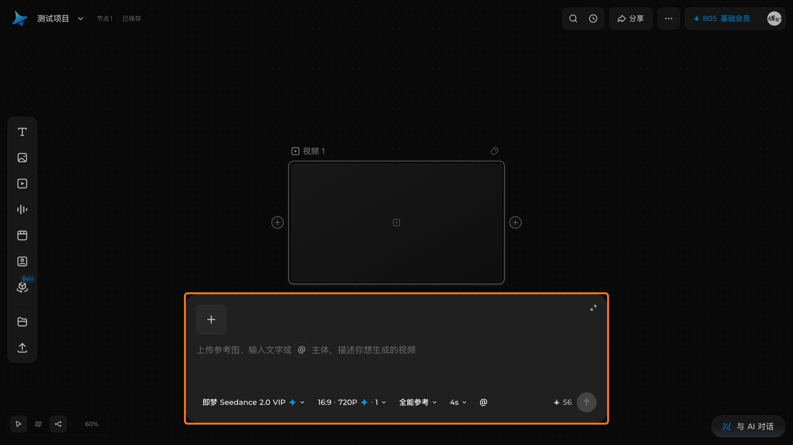

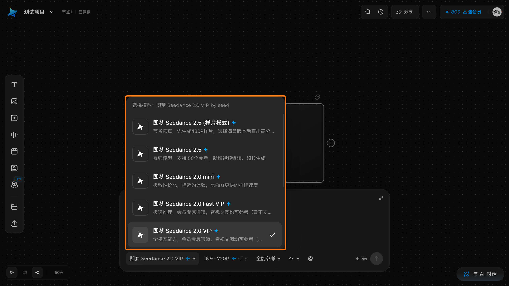

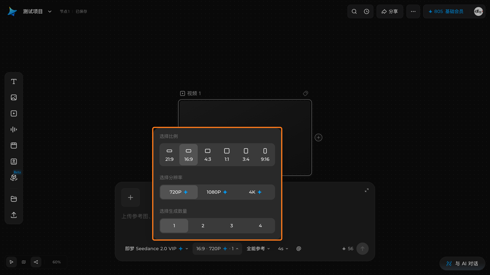

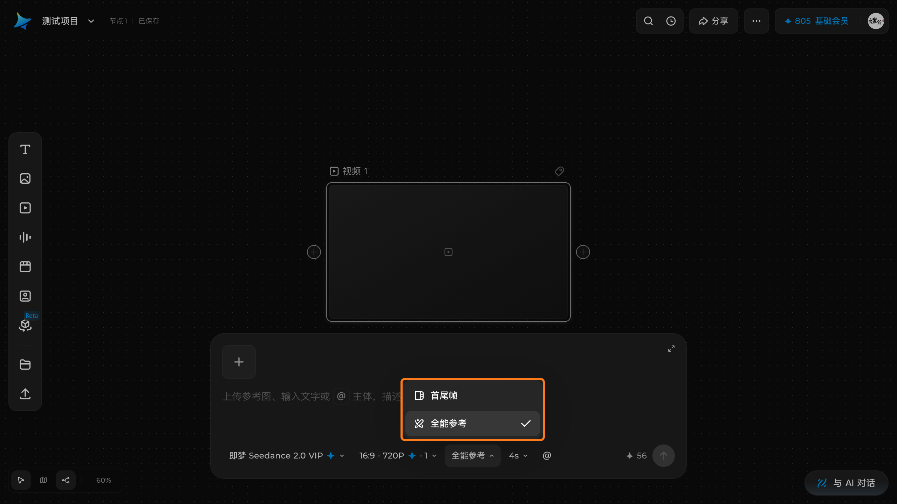

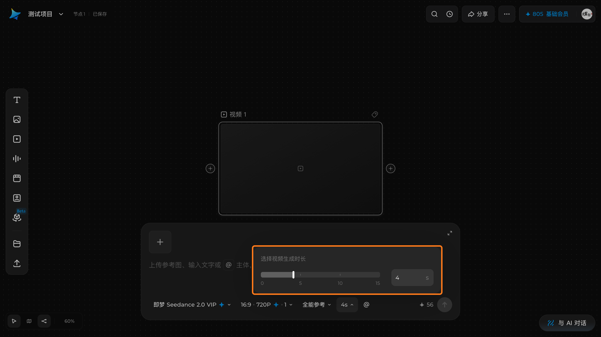

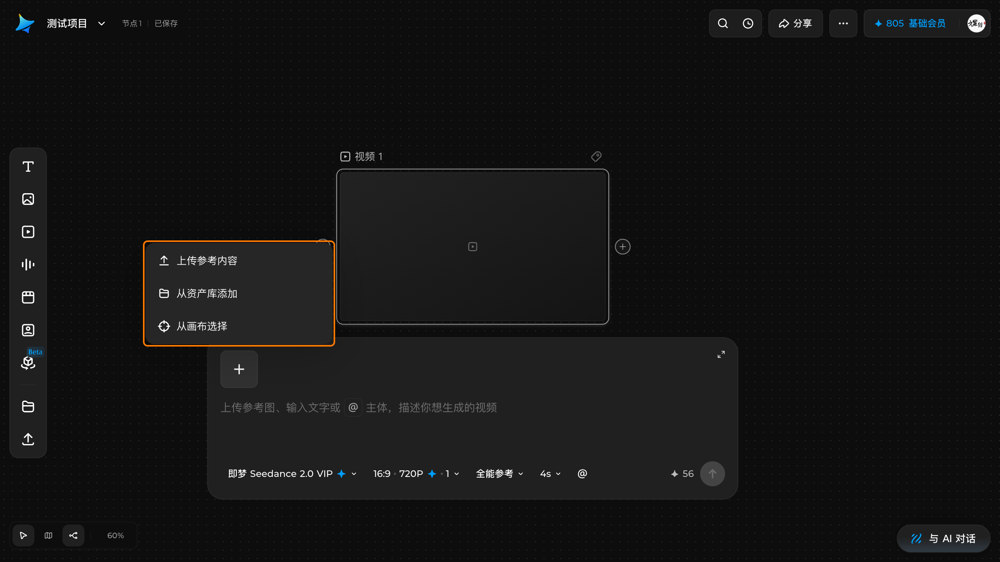

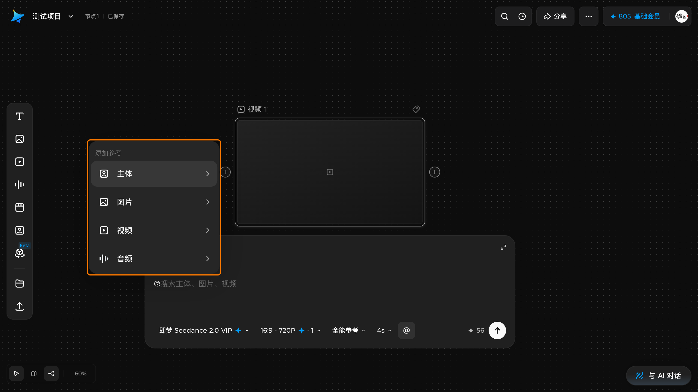

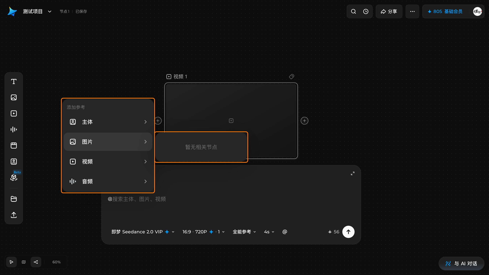

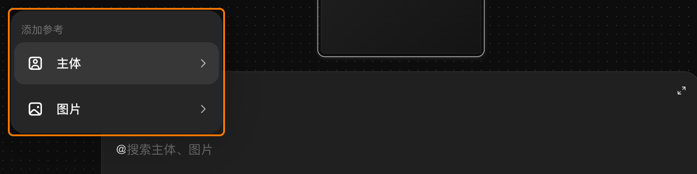

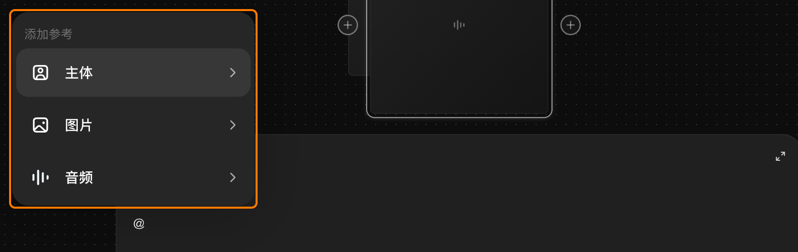

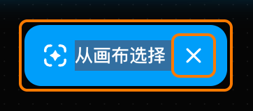
