# 使用主体节点

## 适用角色

已登录的即梦画布创作者。

## 目标

创建一个**主体**节点，给它导入主媒体与描述，然后在生成提示词里用 **@主体**
引用它——让同一个角色/形象/音色在多张图、多个视频之间保持一致。

## 前置条件

已打开一个画布。创建主体节点本身**不消耗积分**；只有后续用它触发的生成才计费。

## 入口

左栏 **主体**（第 6 项）。点击即在画布中央新建「主体 N」并自动选中。

## 主体节点长什么样（2026-10-01 实测）

- 节点类型是独立的 `subject`（DOM class `react-flow__node-subject`），
  节点本体 **`352×352` canvas**（2026-10-02 实测）。
  🔴 **订正（批次 79）**：此处原写「视口内约 **310×310**」。本轮把这个节点的
  **每一层可见后代**都量了一遍，**没有任何一层是 310**：
  节点本体 `352×352`、header `352×84`、内部空态区 `320×252`。
  ⇒ 旧数字**未复现**（可能来自更早构建），**不臆测它当时量的是哪一层**，
  以现测的 `352×352` 为准。
- **选中它不会出现浮动工具条**——这是它与视频、图片、文本节点最大的区别。
  找不到工具条不是故障，主体节点的操作都在节点内部完成。
  🔑 **要按「有没有非零高度的真身」判，不要按 testid 计数**（2026-10-02 批次 98 实测）：

  | 查法 | 主体节点（选中态） | 判定 |
  |---|---|---|
  | `[data-testid="node-toolbar"]` 命中数 | **2** | ❌ **会误判为「有工具条」** |
  | 这 2 个的几何 | `0×0@…` 与 **`80×0@…`**（**高度 0**） | 两者都**不可见** |
  | `.react-flow__node-toolbar` 命中数 | **3** | ❌ 同上，全是 0 高度 |
  | `[data-testid="selection-context-toolbar"]` | **0** | ✅ |
  | **可见的、高度 ≥30 且宽 ≥100 的 toolbar 元素** | **0 个** | ✅ **这才是对的判据** |

  📌 主体节点**也带着那两个「占位」元素**（批次 93 记过文本节点上 testid 命中 2 = 1 真身 + 1 `0×0` 占位）；
  它与文本节点的**真正差别**是：文本节点那个真身是 `192×40`，主体节点这里是 `80×0` —— **高度为 0**。
  ⇒ 写「有没有工具条」这类结论时，**判据里要带上尺寸，不能只数元素。**
- 节点内从上到下：
  1. 标题行 `@ 主体 1`，右侧铅笔图标可改名（aria `Edit 主体 1`）；
  2. 描述占位 **添加描述...**（aria `Edit subject description`）；
  3. **导入区**四个入口：导入主体 ／ 从画布选择 ／ 从资产库选择 ／ 本地添加。
- 左右各有一个连接手柄，可以被其他节点连线引用。
  2026-10-02 批次 98 补上**能不能拖**的判据（与音频节点同族）：

  | 部位 | 读数 |
  |---|---|
  | 手柄元素本体 | `pointer-events: none`、屏上 `14×27` |
  | **`::before`** | **`pointer-events: auto`、`40px×80px`** ← **这才是可拖的热区** |
  | `::after` | `20×20`、`pointer-events: none`（连接字形） |

  ⚠️ 与音频节点有个差别：**主体节点手柄是常显的**（本体 `opacity: 1`），
  而音频/视频等节点的字形 `opacity: 0`，要**鼠标悬停或选中**才显形。
  ⇒ 但两者的**热区都在 `::before`**，判据一致。

> **易踩坑**：这四个入口的**可见文案和 aria-label 不一致**——
> 屏幕上的「**从画布选择**」，在无障碍树里的名字是「**添加主媒体**」。
  用读屏或自动化按「从画布选择」找会找不到，按「添加主媒体」才对得上。

### 🔴🔴 选中主体节点时，标题输入框会**自动获得焦点**

单击选中主体节点的那一刻，节点标题就变成了一个**已经聚焦的输入框**
（aria 逐字 `名称`），**不需要双击、不需要点铅笔**。

**后果：紧接着敲的每一个字母/数字键，都会被当成打字，直接改掉这个节点的标题。**

| 时刻 | 输入框里的值 | 宽度 |
|---|---|---|
| 刚单击选中 | `主体 1` | 37×22 |
| 再按一下 `f` | **`f`** | 14×22 |

**2026-10-01 实测**（受控复现，2.5 秒密集采样，变化在按键后 100ms 内完成）。

⚠️ **在多人共用的画布上这条尤其危险** —— 节点标题是**所有人的共享数据**。
本手册编写过程中就实测到：选中一个主体节点后按 `F`，
那个节点的标题被直接改成了字母 `f`。

**怎么做**：

- 选中主体节点后**不要直接敲键盘**；
- 想按快捷键（比如缩放、适配画布）就先**点一下画布空白处**，把焦点挪走；
- 真要改名就**明确进入改名流程**（点铅笔），改完按 **Esc** 或点别处收尾。

## 右键菜单（2026-10-02 批次 98 补上，本页此前的空白）

在主体节点上点右键，容器是 `canvas-context-menu`，实测 **`200×332`**，
**8 项**各 `192×36`：

| # | 逐字 | 快捷键 | 状态 |
|---|---|---|---|
| 1 | 复制 | ⌘C | 可点 |
| 2 | 复制副本 | ⌘D | 可点 |
| 3 | 粘贴 | ⌘V | 可点 |
| 4 | **保存到主体库** | — | 可点（⚠️ 见下方说明） |
| 5 | 下载 | — | **禁用**，逐字「**请选择至少一个组、文本、图片或视频项**」 |
| 6 | 重做 | ⇧⌘Z | 禁用（「无需重做操作」） |
| 7 | 撤销 | ⌘Z | 可点 |
| 8 | 删除 | ⌫ | 可点 |

🔑 **这是本页与其它节点最大的菜单差别**：主体节点**多出第 4 项「保存到主体库」**，
所以它是 **8 项、容器 `200×332`**，而文本/音频节点是 **7 项、`200×292`** ——
高度正好差一个条目（`40`）。前 3 项与后 3 项**逐字相同**。
⇒ 全画布的右键菜单是「**7 项基础 + 按节点类型插入额外项**」。

### ✅ 批次 187 复测 + 三条新读数（2026-10-05）

**复测结论**：上面那张 8 项 / `200×332` 的表**逐项复现** —— 项数、容器尺寸、
第 4 项 aria 逐字 **`将 主体 1 保存到主体库`** 且**可用**、
第 5 项「下载」禁用且原因逐字 **`请选择至少一个组、文本、图片或视频项`**，全部一致。
（做法：左栏「主体」按钮 `40×40@16,423` 点一下建一个**空**主体节点 → 读 → **按 id 用菜单「删除」删掉**。）

三条**新**读数：

| 项 | 读数 | 为什么值得记 |
|---|---|---|
| 节点屏上尺寸 | **`92×92`** | **全画布最小的节点**（其它类型都是 `240×56`、`148×83`、`341×192` 量级） |
| ⊕ 按钮 | **2 个**，各 **`19×19`**（`font-size: 12px`、`padding: 8px`），aria 逐字 `Create connected node before 主体 1` / `… after 主体 1` | 🔴 其它类型都是 **`36×36`** ⇒ 手册「⊕ 屏上恒为 36×36」**对主体不成立**；两个 ⊕ 紧贴在 `92×92` 的小节点两侧，按 `36×36` 的经验估位置会点空 |
| 描述宿主 | `SPAN.sr-only`，`0×0`，逐字 **`Empty subject: main missing, 0 auxiliaries, voice missing. Selected.`** | 这是**描述文案的第七种** —— 批次 176/180 那张「类型 × 描述文案」交叉表里没有它，因为**那张表普查时画布上一个主体节点都没有**。末尾的 **`Selected.`**（而不是 `Not selected.`）是因为新建节点**自动选中** ⇒ 再次印证批次 178 那条「描述随选中态翻转」 |

📌 节点内可见文案逐字：`主体 1`（标题）｜ `添加描述...` ｜ `导入主体` ｜ `从画布选择` ｜ `从资产库选择` ｜ `本地添加`。

⚠️ **「保存到主体库」不是一步，是两步；本手册只执行到第二步的「保存可用」，不点「保存」**。
🔴 **批次 156 订正本页此前的说法**：~~「点它会往**主体库写入持久数据**，而本画布的主体库当前是空态（逐字「没有可用主体」），写进去之后**没法干净地撤回**」~~ —— **指错了对象，也归错了因**：

- **它写的不是项目资产库那个「主体」页**。那个面板逐字是
  `Import assets Choose assets from Dreamina and import them into this canvas. …`，是**导入源**；
  真正被写的是**账号级 Dreamina Subjects**（第二步对话框的英文副标题逐字就是
  `Review the Subject before saving it to Dreamina Subjects.`）。
- **「没法干净撤回」仍然成立，但原因不是「空态」** —— 是**本画布 UI 里根本没有管理/删除账号主体的入口**：
  全局 chrome 穷举（25 个可点物）里命中「主体/账号/设置」的**只有左栏第 6 个**（`40×40@16,403`，
  aria 逐字「主体」，**它建的是主体节点**）；顶栏唯一像账号口的是
  `canvas-user-menu-trigger`（aria 逐字「用户菜单」），打开后**只有 6 项**：
  帮助中心 ｜ 使用手册 ｜ 快捷键 ｜ AI生成水印设置 ｜ 即梦CLI ｜ 新功能许愿。
  ⇒ 📌 **阻塞理由应改成「目标端是账号级主体库、而画布 UI 无删除入口」**，
  原来那句里的「空态」是**陪跑的条件，不是原因**。

**两步长什么样**（2026-10-04 批次 156 实测，见「保存到主体库」小节）：
右键菜单项 → 弹出「设置主体」对话框 `548×688` → 填**名称**（≤20 字）→ 「保存」转可用 → 才会真写。
**不填名称时「保存」是禁用的**，逐字原因「保存前请输入名称。」；
**填了名字不点保存、按 Esc 关掉 ⇒ 零残留**（对话框字段随 Esc 一起消失）。
需要这个功能时请自行判断风险（它**不消耗积分**、**不增删画布节点**，但会留下本画布取不回来的持久数据）。

## 原子步骤

### 1. 创建主体节点（实测）

1. 点击左栏 **主体** → 画布中央出现「主体 1」，自动选中。
2. 确认节点数加一（状态行 `N nodes` 计数 +1）。
3. 此时节点为空态，英文状态串为
   `Empty subject: main missing, 0 auxiliaries, voice missing.`
   - 这句话说明一个主体由三部分组成：**主媒体**、**辅助素材**、**音色**。

### 2. 给它命名并写描述（2026-10-01 提交动作全部实测闭环）

两处都是**行内编辑**，改完按 **Enter** 提交（点空白失焦同样提交）。

#### 改名

🔴 **主体节点是 7 种类型里唯一「静息态就有标题」的，而且它同时有两个标题元素**（批次 57 全类型对照）：

| 元素 | 何时存在 | 位置（相对卡片顶边） |
|---|---|---|
| **`Edit 主体 1`**（行内标题本体，48.4×19.9） | **始终** —— 静息/悬停/选中**都在** | **卡片内部**（顶边 **+6.6**） |
| **`Edit subject description`**（描述框，176.4×13.2） | **始终** | 卡片内部（+26.5 ~ +39.7） |
| **`Rename 主体 1`**（浮层改名按钮，35.5×32） | **仅选中时** | 卡片**上方**（−32 ~ 0，与卡片顶齐平） |

→ **「点哪里改名」在主体节点上有两个答案**：卡片**里面**那行字，和**选中后**浮在卡片外面的按钮。
这与其他 6 种类型不同 —— 那些节点静息态**完全没有**标题元素。

| 阶段 | 观察到的元素 |
|---|---|
| 未填描述时 | 卡片内已有 `Edit 主体 1`；**选中**后卡片上方**另外**出现 `Rename 主体 1`（两者**并存**） |
| 填过描述后 | 卡片内的 `Edit 主体 1` 继续存在（描述升为副标题） |
| 点击后 | 标题变成 `input`，**占位提示「未命名主体」**，宽高随文字自适应（36×21 → 47×21） |
| 按 Enter 后 | 节点 aria 从 `主体 node: 主体 1` 变为 `主体 node: 主角参考`，顶栏显示「已保存」 |

- **成功判据**：节点 `aria-label` 里的名字跟着变，且**刷新后仍然是新名字**（已 reload 验证）。
- ⚠️ 🔴 **批次 57 订正**：本页原写「未填描述时 hover 标题行出现 `Rename 主体 1`」
  与「填过描述后 `Rename` 消失」—— 实测两点都不对：
  ① 静息态**不是**只有 `Edit`，而是**两个并存**（选中后同时存在）；
  ② `Rename` 不是 **hover** 唤出的，是**选中**才出现的。
  脚本里若只找 `Rename` 前缀会扑空；只找 `Edit` 前缀则会**同时命中标题和描述框**
  （描述框的 aria 是 `Edit subject description`）。

#### 写描述

- 入口 aria `Edit subject description`（185×14），未填写时显示占位 **添加描述...**。
- 点击后变成 `textarea`（185×14，占位同为「添加描述...」），输入后：
  - 按 **Enter** 提交，或
  - 点画布空白**失焦**提交 —— **两条路都实测生效**。
- 提交后的**结构变化**：节点头部从「标题 + 描述占位」两行，变成
  **「@ 主体 1 ✎」一行 + 灰色小字描述**——描述成为标题下方的副标题。
- 描述越具体，后续生成越容易保持一致（例如「戴细框眼镜、穿米色针织衫的年轻女性」）。

### 3. 导入主媒体（四选一，2026-10-01 全部实测）

| 入口 | 用途 | 打开的东西 | 状态 |
|---|---|---|---|
| **导入主体** | 导入一个**已有主体** | 模态「**主体**」+ 搜索框；空态逐字「**没有可用主体**」；底部「已选择 0 个素材」+ 确认（禁用） | 已实测 |
| **从画布选择**（aria `添加主媒体`） | 把画布里已有的媒体节点指定为主媒体 | **画布选取模式**：顶部蓝色横幅「从画布选择 ✕」+ 画布整圈蓝色描边 | 已实测 |
| **从资产库选择** | 从资产库挑一个素材 | `Import assets` 面板，但**页签比画布版少两个**（资产/主体/图片/视频/时间，**没有音频与文档**），并多一行逐字「**至多选择 1 个素材**」 | 已实测 |
| **本地添加** | 从本机上传图片/视频作为主媒体 | 系统文件选择器 → 选完**直接绑定成功** | 已实测 |

> 「至多选择 1 个素材」正好解释了主体的结构：一个主体只有**一个**主媒体，
> 额外的参考图属于「辅助素材」，不在这四步里选。

#### 「本地添加」的完成态（实测）

1. 点 **本地添加** → 系统文件选择器打开 → 选一个图片文件。
2. 节点立刻变成**已绑定**形态：
   - 主媒体槽显示该图片，**右上角有 ✕ 可移除**；
   - 右侧还有一个 **＋** 空槽（用于加辅助素材）；
   - 节点右上角有**音色**图标；
   - 原来那四个导入入口消失。
3. 状态串逐字从
   `Empty subject: main missing, 0 auxiliaries, voice missing.`
   变为
   `Main Bound subject: main present, 0 auxiliaries, voice missing.`
   —— `main missing` → `main present` 就是成功判据。
4. ⚠️ 想换素材就点主媒体上的 **✕** 移除，四个入口会重新出现。

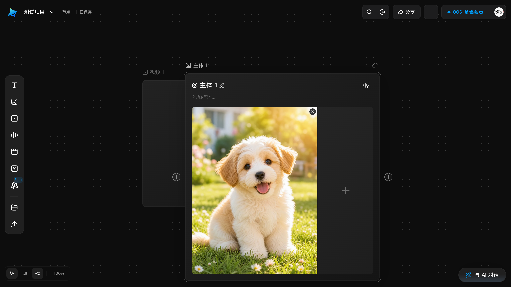

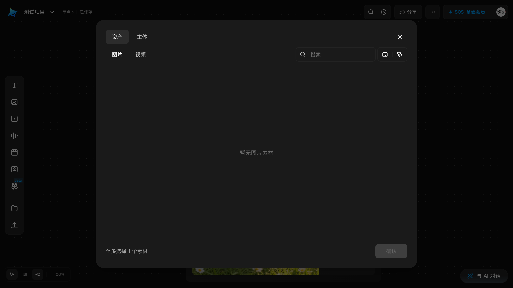

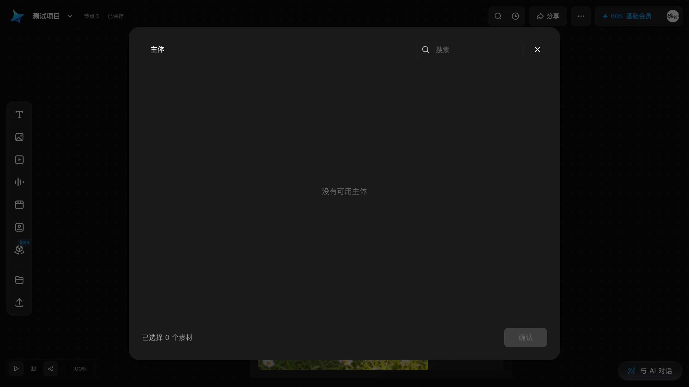

**从画布选择** 的完整流程（实测）：

1. 点击 **从画布选择** → 进入**画布选取模式**：顶部出现蓝色横幅
   **从画布选择**（带关闭 X），整个画布出现蓝色高亮边框。
2. 在画布上点选你要作为主媒体的节点。
3. 两种取消方式都实测有效：点横幅上的 **X**，或直接按 **Esc**。
   取消后画布不产生任何变化。

### 4. 在生成时引用它

- 选中一个**空节点**（图片/视频/音频）→ 下方弹出生成面板；
- 在提示词里输入 **@主体** 引用这个主体。
- 面板占位文案本身就写着「上传参考图、输入文字或 @ 主体，描述你想生成的…」，
  说明 **@主体** 是官方支持的引用方式。
- 引用后主体会作为一致性约束参与生成；**这一步的生成行为属扣费边界**，
  本手册只讲到「面板里 @ 引用已就绪」，不代替你点击生成。

### 5. 把一个媒体节点「保存到主体库」（2026-10-04 批次 156 实测到「保存可用」为止）

🔑 **先纠正一个几乎人人会踩的定位错误**：这个功能**不在**图片节点浮动工具条的
「工具」菜单里。那个菜单（`data-toolbar-value="tools"`，`240×204`）逐字只有
**编辑 / 消除笔 / 裁剪 / 宫格切分 / 标注** 四项，第一行「编辑」是**分组标题**、不是菜单项。
👉 **它只在右键菜单里**，而且**只在「有可用资源」的节点上出现**（本页主体节点恒有；
空图片/视频节点没有；**有媒体的图片节点有**）。

**原子步骤**（本手册止步于第 ④ 步）：

1. **让目标节点在视口里**。若它被别的节点挡住或缩得太小看不见，**先平移画布**：
   点底部 dock 最左的指针工具钮把 aria 从「选择工具」切成「抓手工具」，再拖空白处平移，**做完记得切回来**。
   ⚠️ **用「选择工具」拖空白处是框选、不平移** —— 这一条在
   [导航画布](../10-tasks/navigate-canvas.md) 里已建档，这里不再重复它的坑。
2. **选中**它（选择工具下单击），点 **右键**。
   弹出 `200×372` 的菜单（**有媒体的图片节点是九项**），
   🆕 其中「保存到主体库」一项的 aria 逐字是「**将 &lt;节点名&gt; 保存到主体库**」——
   **aria 会带节点名**，所以别按 aria 找，按可见文字找。
3. 点 **保存到主体库**。⇒ **这一步不保存**，而是弹出「**设置主体**」对话框
   （**1280×720 视口下实测 `548×688`**；🔴 **原写把它当固定尺寸已推翻**：这两个数**不是同一族**，别当固定尺寸记 ——
   548 是定尺、688 是被窗口高度夹出来的，规律见本节末尾「窗口不够大时它会怎么变」；
   标题逐字「设置主体」，副标题逐字
   `Review the Subject before saving it to Dreamina Subjects.`）。
   对话框里已经**预填了主媒体**（就是这张图），你只需要给它起名。

   > 📌 **顺带一条挑节点的判据**（批次 167 实测）：右键菜单里的「保存到主体库」
   > **只在素材已就绪时出现**。空节点右键是七项（复制／复制副本／粘贴／下载／重做／撤销／删除），
   > 没有这一项。**别按「节点类型像媒体节点」去挑** —— 要读它逐字里那句资源账
   > （`No resources: 0 ready…` ⇒ 没有那个菜单项）。
4. 在 **名称** 框输入名字（**最多 20 字**，右侧计数器形如 `0 / 20`）。
   描述可留空（最多 4096 字），辅助媒体与音色也可留空。
   **名称一填上，右下角「保存」立刻从灰变可点** —— 名称是**唯一**的必填项。
   - 空态时「保存」是**禁用**的，对话框底部逐字给出原因「**保存前请输入名称。**」
   - ⛔ **本手册到此为止，不点「保存」**：目标端是**账号级** Dreamina Subjects，
     而**这个画布里没有任何入口能管理或删除账号主体**（排查过程见上方 ⚠️ 块）。
5. **想放弃就按 Esc**：对话框消失，**不留任何痕迹**（填的名字随对话框一起丢掉）。
   这一步是**完全可逆**的，所以放心试。

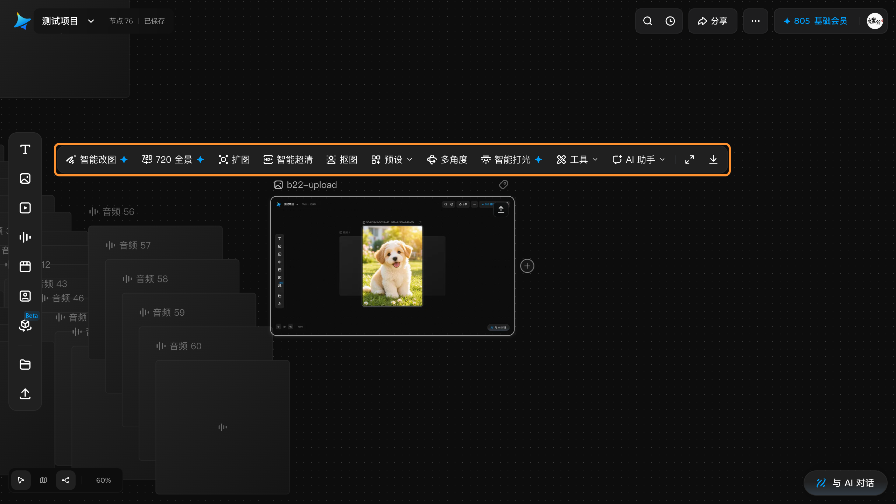

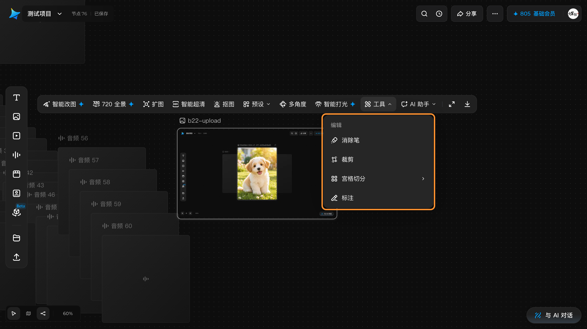

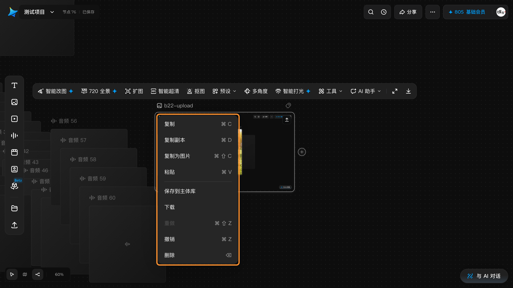

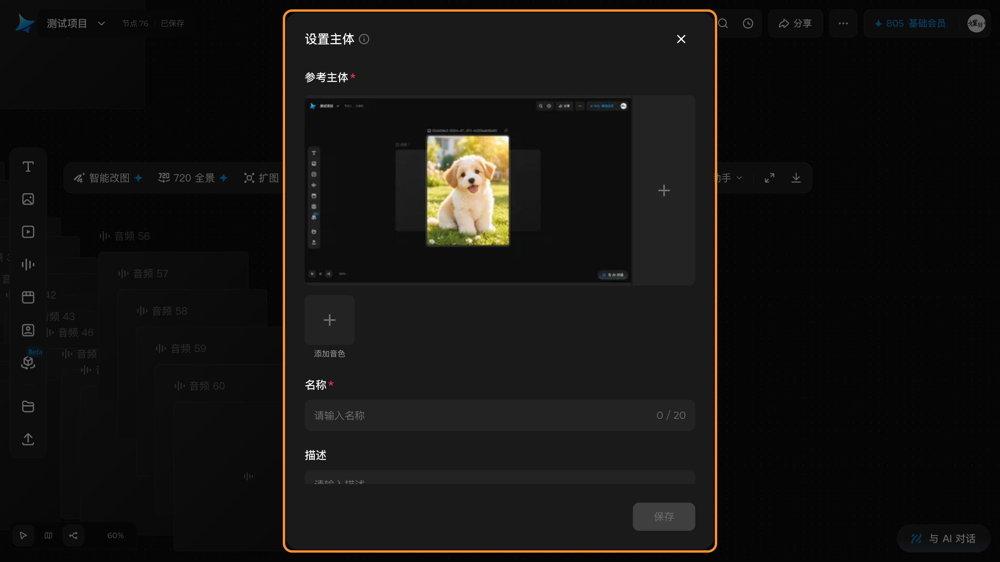

## 与其他节点的关系

- **连线**：主体节点有左右两个手柄，可以像其它节点一样被连接；
  也可以用 hover 时的 **+** 手柄从它出发创建并连接新节点。
- **保存到主体库**：媒体节点的右键菜单里有 **保存到主体库**，
  可把素材沉淀为主体（入口已见于菜单结构）。
- **提示词引用**与**连线**是两种不同的复用方式：前者写 `@主体`，
  后者拖一条参考连线。

## 取消 / 恢复

- 取消画布选取模式：**Esc** 或点横幅 X（不产生变化）。
- 编辑描述/标题后想放弃：提交前按 **Esc**，或提交后 **⌘Z**。
- 主体节点本身也可以删除：选中按 **⌫**（先点空白让焦点离开输入框）。

## 常见错误与恢复

| 现象 | 原因 | 处理 |
|---|---|---|
| 选中主体节点没有工具条 | 主体节点本就没有浮动工具条 | 操作都在节点内部：改名、描述、导入四项 |
| 按「从画布选择」在无障碍树里找不到 | 该按钮的 aria-label 是「添加主媒体」 | 按「添加主媒体」定位 |
| 点了从画布选择，画布全蓝 | 这是**画布选取模式**，不是故障 | 点顶部横幅的 X 或按 **Esc** 退出 |
| 主体一直是 `main missing` | 还没导入主媒体 | 用导入区四项之一补上主媒体 |
| **选中主体节点后一敲键盘，节点名被改了** | **标题输入框在选中时就自动获得了焦点**，你打的字全进了标题 | 先点画布空白处把焦点挪走再按快捷键；要改名就点铅笔明确进入，改完 Esc |
| 想用 `F` 打开全屏编辑器，主体的标题却变成 `f` | 同上 —— `F` 被当成字母打进了标题 | 同上；主体节点上 `F` 本来就**没有**已验证的打开行为 |

## 相关任务

[创建节点](create-first-node.md) ｜ [连接节点](connect-nodes.md) ｜
[准备生成](prepare-generation.md) ｜ [使用资产库并上传素材](assets-and-upload.md)

## 已验证说明

**2026-10-01 源站实测（第一轮，结构）**：主体节点创建、`subject` DOM 契约与
~~310×310~~（**已订正为 352×352 canvas**，旧数未复现）尺寸、**无浮动工具条**、节点内全部可见文案与 aria-label、空态三段式状态串
（main / auxiliaries / voice）、**从画布选择**的画布选取模式与两种取消方式、
hover 时的连接手柄与 Rename / Add tags。

**2026-10-01 源站实测（第二轮，四种导入全部执行）**：
- **本地添加**：filechooser 选图后**绑定成功**，状态串
  `Empty subject: main missing, 0 auxiliaries, voice missing.`
  → `Main Bound subject: main present, 0 auxiliaries, voice missing.`；
  绑定后主媒体槽出现 **✕ 移除**，右侧出现辅助素材 **＋** 空槽，四个入口消失；
- **导入主体**：打开模态「主体」+ 搜索框，空态逐字「**没有可用主体**」；
- **从资产库选择**：打开 `Import assets` 面板，**页签为 资产/主体/图片/视频/时间**
  （比画布版少「音频」「文档」），并多出逐字「**至多选择 1 个素材**」；
- **从画布选择**：选取模式复现（蓝色横幅 + 画布蓝框）。

- **改名**：`Edit 主体 1` → input（占位「未命名主体」）→ 输入 → **Enter** 提交，
  节点 aria 变为 `主体 node: 主角参考`，顶栏「已保存」，**reload 后仍是新名字**；
- **描述**：`Edit subject description` → textarea（占位「添加描述...」）→ 输入 →
  **Enter** 或**点空白失焦**均可提交；提交后头部结构变为
  **「@ 主体 1 ✎」+ 灰色小字描述**，描述成为标题下方的副标题。

**2026-10-02 批次 98 补测**（自建一个主体节点，测完按 id 删净，积分 805→805）：
- 🔑 **「不出现浮动工具条」的判据被补齐**：testid 命中 2 但两个都**高度 0**
  （`0×0` 与 `80×0`）、class 命中 3 全 0 高度、`selection-context-toolbar` 命中 0、
  **可见 toolbar 元素 0 个** ⇒ 结论成立，但**判据必须带尺寸，不能只数元素**
- 🔑 **手柄热区**：`::before` `pe:auto` `40×80`（本体 `pe:none`）⇒ **能拖**；
  且主体节点手柄**常显**（本体 `opacity:1`），与音频/视频节点的 `opacity:0` 不同
- ✅ **右键菜单（本页此前整节缺失）**：`200×332`、**8 项**各 `192×36`，
  多出独有的 **「保存到主体库」**（只读不点）
- ✅ **结构复核**：节点本体 canvas **`352×352`**、header **`352×84`**、内部空态区 **`320×252`**
  （三项与批次 79 逐字一致）；**全部 25 个可见层的 canvas 尺寸取值里没有一个是 310**
  ⇒ 批次 79 订正掉的「310×310」**再次确认未复现**

### ✅ 标题的编辑态：单击**不**进，双击 / 单击+Enter / 单击+Space 都进（2026-10-03 批次 115 结清）

⚠️ **订正（批次 115）**：此处原写「『选中主体节点标题输入框自动获焦』**没测到**，记 VOID
—— 第一次落点落在节点中心（空态导入区，不在标题上），第二次该节点在密集区被别的节点完全盖住」。
**VOID 撤掉**：不是测不到，是**那个说法本身要改** —— **单击不会自动获焦**。

批次 115 在**自建**主体节点上把五种操作各做一遍，每种都连读三次焦点
（+0ms / +1.2s / +3.7s，**三次全一致**），并同时读「节点里有没有新增输入面」：

| # | 操作 | 进编辑态？ | 焦点落在 | 新增的输入面（aria 逐字 / 尺寸 / 初值） | `Rename` 按钮 |
|---|---|---|---|---|---|
| ① | **双击** `Rename 主体 1` | ✅ | **`INPUT aria="Node title"`** | `Node title` / `50×24@280,248` / `主体 1` | **消失**（换成 input） |
| ② | 单击 `Rename` → **Enter** | ✅ | `INPUT[Node title]` | 同上（沿用 ① 已渲染的） | 消失 |
| ③ | 单击 `Rename` → **Space** | ✅ | `INPUT[Node title]` | 同上 | 消失 |
| ④ | 点 **`Edit 主体 1`** | ✅ | **`INPUT aria="名称"`** | `名称` / `37×22@282,287` / `主体 1` | 还在 |
| ⑤ | 点 **`Edit subject description`** | ✅ | **`TEXTAREA aria="描述"`** | `描述` / `192×14@270,309` / **空串** | 还在 |

🔑 **单击 `Rename 主体 1` 到底发生了什么**（批次 115 b 轮单测）：
焦点落在**那个 `BUTTON` 本身**（`inNode: true`），**不是输入面**；
**点后没有新增任何输入面**（输入面清单与点前逐字相同），`Rename` 按钮也**没有消失**。
⇒ **单击只是把焦点放到按钮上，不进编辑态。**

#### 🔑 主体节点上有**三个**输入面，aria 各不相同

| 位置 | 触发元素（aria 逐字） | 进编辑态后出现 | aria 逐字 | 屏上 | 初值 |
|---|---|---|---|---|---|
| **标题行** | `Rename 主体 1`（`36×32@280,248`） | `INPUT` | **`Node title`** | `50×24` | `主体 1` |
| **第二行** | `Edit 主体 1`（`53×22@270,287`） | `INPUT` | **`名称`** | `37×22` | `主体 1` |
| **第三行** | `Edit subject description`（`192×14@270,309`） | `TEXTAREA` | **`描述`** | `192×14` | **空串** |

⚠️ **标题行和第二行显示的文字都是「主体 1」**（`innerText` 逐字
`主体 1 主体 1 添加描述...`）—— 两行长得一样，**只有 aria 和尺寸能区分**。

📌 **这条直接影响自动化**：想改标题要打 **`Node title`**；
想改下面那行要打 **`名称`**；**别把两者当成同一个输入面**。

#### ✅ 但 keyGuard 守卫**没有因此失效**（理由是假的，结论仍然对）

`scripts/jimeng-safe-keys.mjs` 的注释写着「单击选中『主体』节点 ⇒
标题 `input[aria-label="名称"]` **自动获焦**」，守卫**照这条拦人**。批次 115 的读数是：

- 点**之前**，主体节点里**根本没有** `input[aria-label="名称"]` ——
  `querySelectorAll('input')` 只读出**一个** `type="file"` 的 `0×0` 隐藏 input（导入区那个）
- 单击**之后**也没有出现（要 ①-③ 才让它出现，且 aria 是 `Node title` 不是 `名称`）
- `input[aria-label="名称"]` 属于**第二行**（`Edit 主体 1`），**不在标题行上**

⇒ 守卫注释里的「**自动**获焦」和「**标题**」两处都不准。
**但守卫本身仍然安全**：单击后焦点落在一个 `BUTTON` 上，而 `Rename` 只响应
`Enter`/`Space`、**不响应字母** ⇒ 字母键不会被吞成打字。
⇒ 这是「**理由是假的，但结论仍然对**」的一格 —— 两者要分开记。
📌 立规：**推翻了守卫的理由，不等于守卫失效**；
要单独验证「在新读数下守卫还拦不拦得住」。

**仍未验证（2026-10-01 批次 62 补上此前缺失的理由）**：
- ~~「保存到主体库」的**实际保存结果** —— 阻塞原因**不是扣费**，而是它会**往主体库里写入持久数据**。本画布的主体库当前是空态（逐字「没有可用主体」），写进去之后**没法干净地撤回**，在没有单独授权前不执行。**菜单项本身的存在与位置早已实测**（有资源的图片节点 200×372 九项含该项）。~~
  🔴 **批次 156 订正并部分关闭**：**入口位置复现无误**（有媒体的图片节点右键 `200×372` **九项**，
  逐字「复制 ⌘C ｜ 复制副本 ⌘D ｜ 复制为图片 ⌘⇧C ｜ 粘贴 ⌘V ｜ **保存到主体库** ｜ 下载 ｜ 重做 ⌘⇧Z ｜ 撤销 ⌘Z ｜ 删除 ⌫」，
  该项 aria 逐字是「**将 b22-upload 保存到主体库**」——**aria 会带节点名**）。
  **前半程已全部测完**（见「保存到主体库」小节）：点它**不直接保存**，而是弹
  `subject-export-confirm-dialog` **`548×688`**，名称必填（`maxlength=20`）、
  「保存」**空态禁用**并附原因「保存前请输入名称。」，填名后计数器 `0 / 20` → `6 / 20`、「保存」转可用。
  **最后半程（点「保存」）仍未执行** —— 理由**已更换**，不再是「没授权」：
  目标端是**账号级** Dreamina Subjects，而**本画布 UI 无任何管理/删除入口**（已逐路排除，见上方 ⚠️ 块）。
  📌 顺带查清一个此前没人分清的点：**它不在浮动工具条的「工具」菜单里** ——
  那个菜单 `240×204` 只有「编辑 / 消除笔 / 裁剪 / 宫格切分 / 标注」四项。
- **@主体** 在提示词中的引用效果与生成结果 —— 后者属**扣费边界**，
  永久不在本手册范围。前者（引用是否拼进提示词）**未测**，
  同样卡在「要先有一个真实存在的主体」——🔴 **批次 156 把这条的难度抬高了一格**：
  造出一个主体有两条路，**都不产生可供 `@` 引用的主体**：
  ① 点「保存到主体库」写进的是**账号级主体库**，不落在这个画布上（本轮对账：项目资产库主体页逐字**仍等于基线**）；
  ② 主体节点的四种导入入口是**往画布上的主体节点里填素材**，不是往主体库里建条目。

## 步骤图

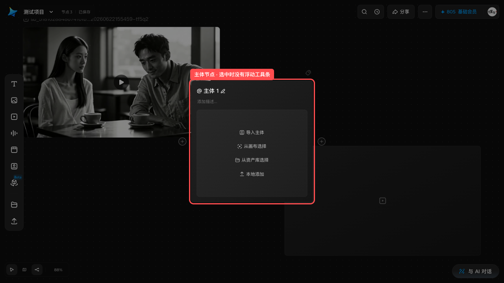

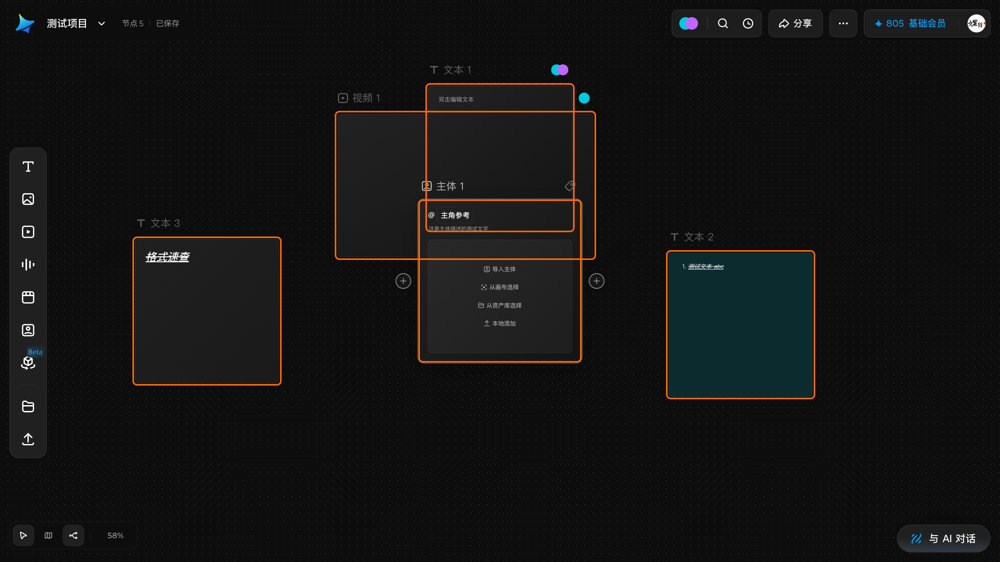

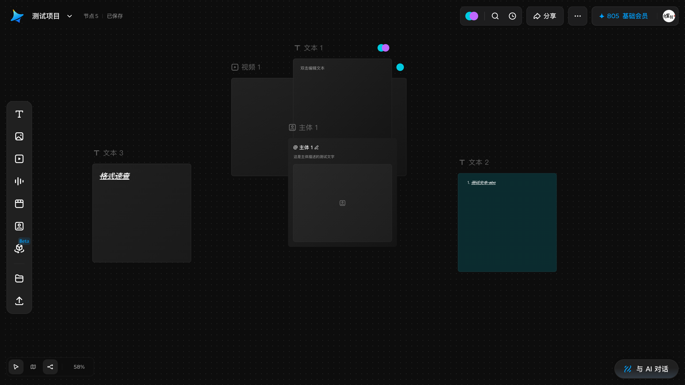

### 窗口不够大时「设置主体」会怎么变（2026-10-05 批次 167 实测 12 档）

🔴 **本页此前把 `548×688` 当成这个对话框的固定尺寸**（与「项目信息」的 `800×546` 同类问题，
批次 166 已订正后者）。本轮把它的**内联样式**读出来后，真相是：

```
style="height: 734px; max-height: calc(-32px + 100vh); border-radius: 16px; width: 548px; …"
```

- **548 是定尺**，写在内联 `style` 里（**不在 CSS 里**，所以在样式表里搜 `548px` 搜不到）；
  也**不是** CSS 变量 —— `--dreamina-geometry-dialog-default-width` 实测是 **480px**，与它无关。
- **688 根本不是定尺**：声明高度是 **734**，在 1280×720 的窗口上被
  `max-height: calc(-32px + 100vh)` **夹成 688**。
  ⇒ 这两个数是**一常量、一夹取结果**，写在一起会让人以为它们同族。

⇒ **规律**：宽 = min(548, 窗口宽 − 32)、高 = min(734, 窗口高 − 32)。

| 窗口高 | 800 | 766 | 765 | **720** | 700 | 600 | 400 |
|---|---|---|---|---|---|---|---|
| 对话框高 | 734 | **734** | **733** | **688** | 668 | 568 | 368 |

| 窗口宽 | 1280 | 900 | 580 | 579 | 500 |
|---|---|---|---|---|---|
| 对话框宽 | 548 | 548 | **548** | **547** | 468 |

- 高度门槛 **766 / 765**：窗口高 **≥ 766** 才第一次完整显示 734；
  在常见的 720 高窗口里它**一直是被夹着的**。
- 宽度门槛 **580 / 579**（548 + 32）。
- 三段结构固定：**头 52 ／ 体 552（可滚动 `overflow-y-auto`）／ 脚 84**，任一档高度都等于三者之和。
  ⇒ 窗口矮时**先被压的是中间那段**，所以「描述」输入框可能只露出一半 —— **往下滚就行**。

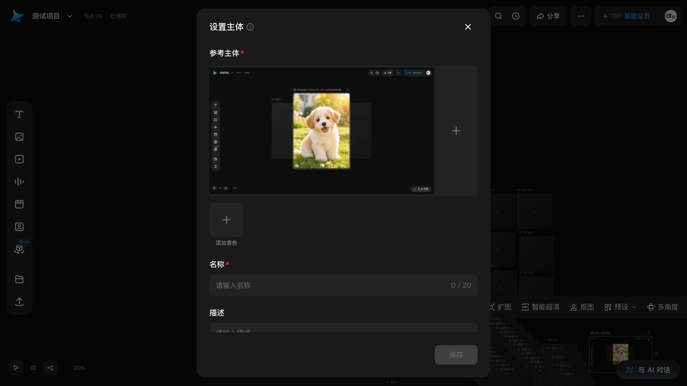
