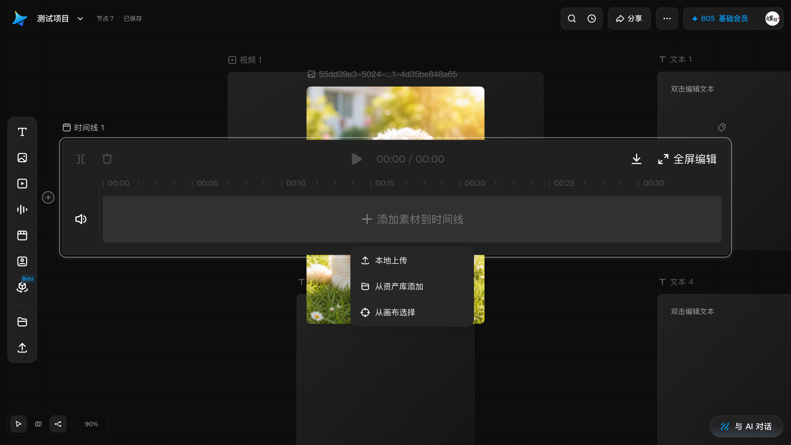
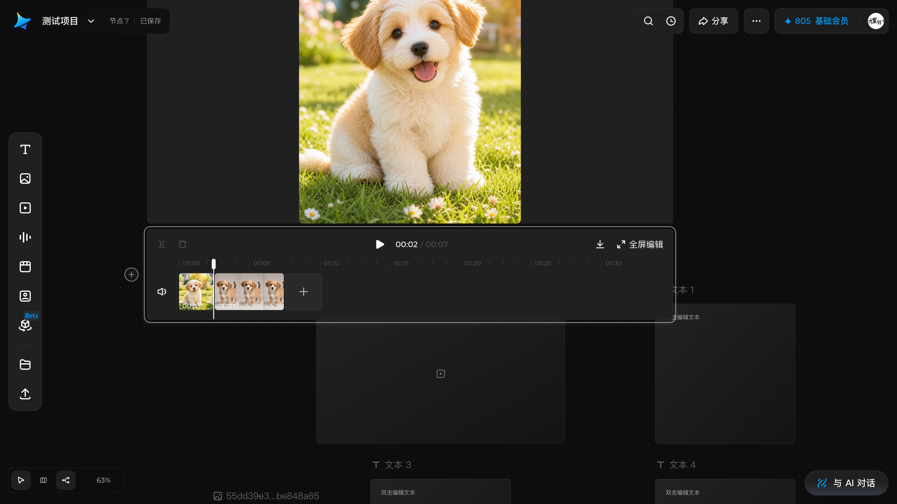
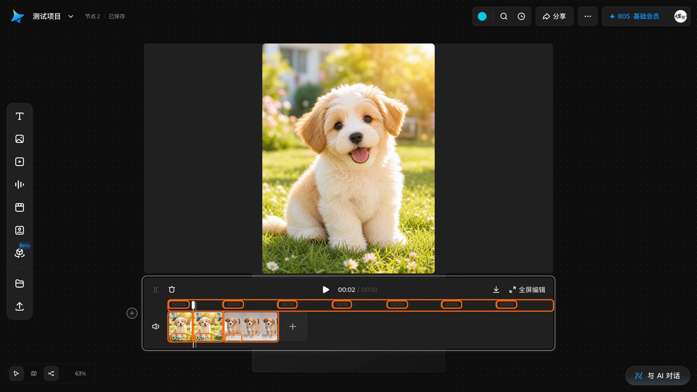
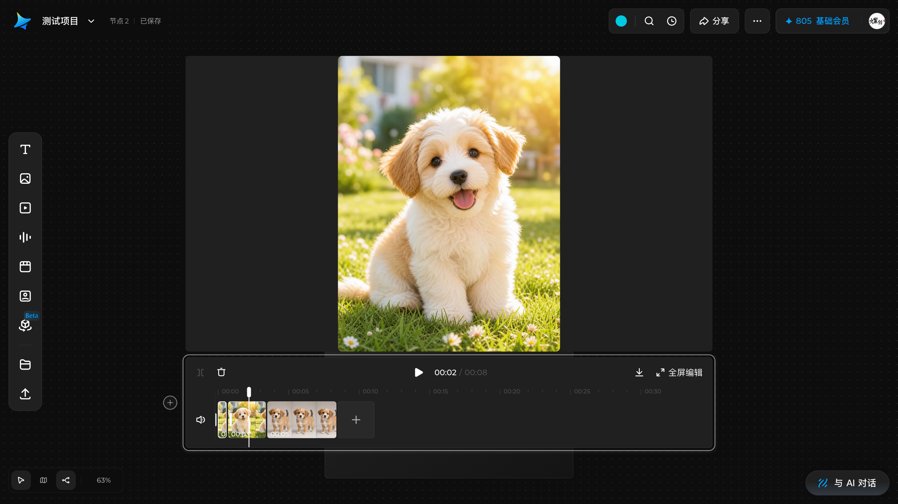
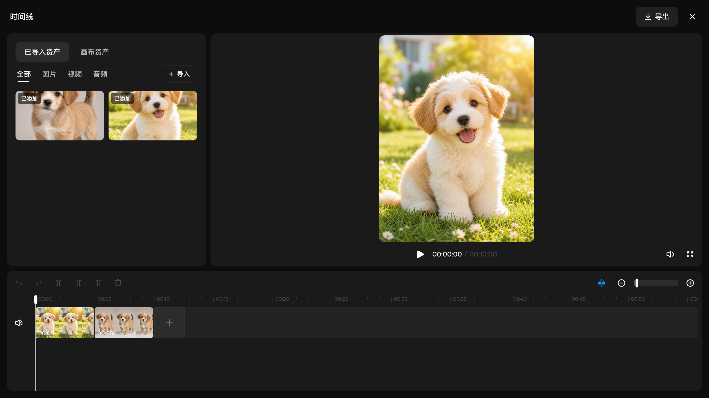
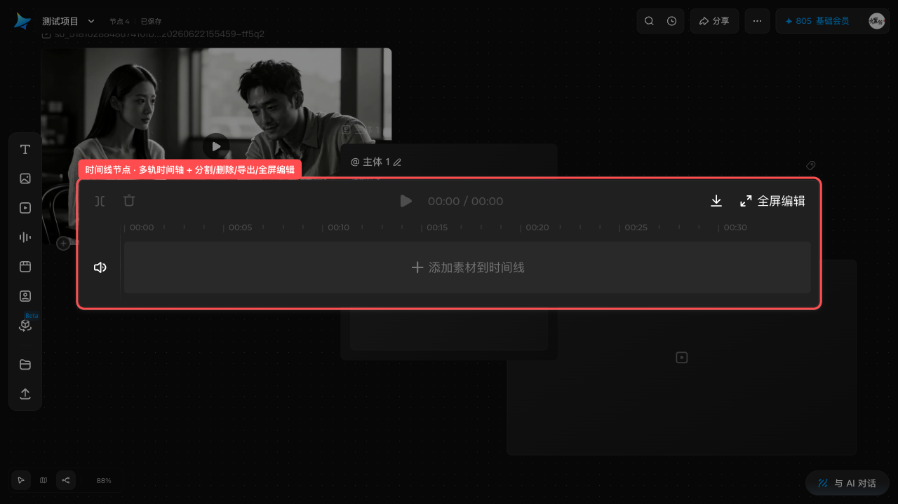

# 使用时间线节点

## 适用角色

已登录的即梦画布创作者。

## 目标

创建一个**时间线**节点，把画布上的素材排成多轨序列，做剪切、排序与整段导出——
即梦画布里的「剪辑台」。它是画布上唯一按**时间**而不是按**节点**组织的节点类型。

## 前置条件

已打开一个画布。创建时间线节点本身**不消耗积分**。

## 入口

左栏 **时间线**（第 5 项）。点击即在画布中央新建「时间线 N」并自动选中。

## 时间线节点长什么样（2026-10-01 实测）

- 节点类型独立（DOM class `react-flow__node-timeline`），**又宽又扁**：
  视口内约 **1055×182**——是画布上最宽的节点，和方形的主体/图片节点完全不同。
- **选中它没有浮动工具条**（与主体节点一样）。它自带一整条内嵌控制栏。
- 结构从左到右：
  - **左上**：**分割** 与 **删除** 两个图标按钮；
  - **左侧轨道头**：**静音** 扬声器图标；
  - **正中**：播放钮 + 时间读数 `00:00 / 00:00`；
  - **右上**：**导出时间线**（下载图标）与 **全屏编辑**（放大图标）；
  - **中间**：时间刻度尺，从 `00:00` 起每 5 秒一格，实测显示到 `00:30`；
  - **下方轨道区**：空态为 **＋ 添加素材到时间线**。
- 英文提示串（空态）：`Drag clips to reorder them. With the keyboard, press
  Shift + Left or Right Arrow.`——拖拽可重排，也可用
  **Shift + ←/→** 键盘移动片段。
- 状态串实测形如：`时间线: 1 visual track, 0 audio tracks, 0 clips.`
  即它按 **视觉轨 / 音频轨 / 片段数** 三项汇报自身状态。
- 连接手柄只有 **1 个**（主体节点是 2 个），方向性更强。

## 原子步骤

### 1. 创建时间线节点（实测）

1. 点击左栏 **时间线** → 画布上出现「时间线 1」，自动选中。
2. 成功判据：节点数 +1；节点呈现一条带刻度尺的宽扁时间轴。

### 2. 添加素材（2026-10-01 实测执行）

1. 点击轨道区的 **＋ 添加素材到时间线**（aria `添加素材到时间线`）。
2. 弹出三个选项（逐字）：
   - **本地上传** —— 直接从电脑选文件，选完**直接进入时间线**；
   - **从资产库添加** —— 打开 `Import assets` 面板选素材；
   - **从画布选择** —— 进入**画布选取模式**（画布整圈蓝色描边 + 顶部蓝色横幅
     「从画布选择 ✕」），此时点画布上的节点来取素材。
3. 成功判据（实测）：
   - 状态串 `…, N clips.` 的 **N 加一**；
   - 走马灯上方出现该片段的**缩略图**；
   - 顶部播放读数从 `00:00 / 00:00` 变为 `00:00 / 00:05`。
4. **实测：一张静态图片加入时间线后默认时长为 5.0 秒**
   （片段 aria 逐字 `Clip 1, 图片, 5.0 seconds`）。

> 选「从画布选择」前，建议先把会被时间线盖住的节点拖开——节点重叠时点击会落到
> 上层节点，「添加素材」按钮可能点不动（实测踩过）。

### 3. 调整顺序（2026-10-01 两条路径均实测）

- **拖拽（实测有效）**：按住片段横向拖到目标位置即可插入。
  - 实测：把 `Clip 1（2.2 秒）` 拖到末尾 → 顺序变为
    `2.8 秒 → 5.0 秒 → 2.2 秒`，片段重新编号为 Clip 1/2/3。
- **键盘（实测有效，推荐）**：选中片段后按 **Shift + →** / **Shift + ←**
  与相邻片段交换位置。
  - 实测：轨道上原本 `Clip 1 = 2.5 秒` 在前、`Clip 2 = 5.0 秒` 在后，
    按一次 **Shift + →** 后两者**位置互换**（`Clip 1` 变成 5.0 秒在前）。
  - 这正是节点内英文提示串所说的
    `Drag clips to reorder them. With the keyboard, press Shift + Left or Right Arrow.`

> 片段是真正的 `button` 元素，点击后**会获得键盘焦点**
> （实测 `document.activeElement` 的 aria 即 `Clip 1, 图片, 2.2 seconds`），
> 所以 `Shift + 方向键` 直接可用，不需要额外 Tab 切换。

### 4. 分割与删除（2026-10-01 实测执行）

**先选中时间线节点或某个片段**，控制栏左侧才会出现 **分割** 和 **删除**
（未选中时这两个按钮不在工具条上，容易以为功能不存在）。

- **分割**（工具条按钮与快捷键 **⌘B** 等价）：
  1. **先点时间刻度尺**把播放头移到要切的位置——播放头读数会跟着变；
  2. 再点 **分割**（或直接按 **⌘B**）。
  3. 成功判据：`clips` 计数 +1，片段的时长串随之改写。
  - ⚠️ **播放头不在片段内时分割无效**：此时点分割或按 ⌘B，时间线会显示提示
    「**将播放头移动到目标片段内进行剪切。**」，片段数不变。
    - 实测反例：10 秒轨道上放两段 5 秒，播放头停在 `00:07`
      （正好落在两段之间的**空隙**）→ 按 ⌘B 只弹提示，`2 clips` 不变。
    - 实测正例：把播放头点进第一段内部（读数 `00:02`）再按 ⌘B →
      `2 clips` 变 `3 clips`，5.0 秒被切成 **2.2 秒 + 2.8 秒**。
  - 片段时长**自动重算**（不是简单对半），所以是 2.2 / 2.8 而不是 2.5 / 2.5。
- **删除**：选中片段后点 **删除** → 该片段从轨道消失，`clips` 计数 −1
  （实测 2 → 1）。

> 这两个操作会真实改动你的时间线内容。想先看看结构，建议复制一个时间线节点再试。

### 5. 手动裁剪片段时长（2026-10-01 实测，拖拽把手）

每个片段**左右各有一个窄把手**，DOM 里逐字为 `向左裁剪` / `向右裁剪`
（各 **8×53**）。按住横向拖动即可改这一段的时长：

| 操作 | 实测结果 |
|---|---|
| 拖 `向左裁剪` 右移约 30px | `Clip 1` 由 **2.2 秒 → 0.7 秒** |
| 拖 `向右裁剪` 左移约 30px | `Clip 1` 由 **0.7 秒 → 0.1 秒** |

> 🔑 **同一个功能，画布上与全屏编辑器里用词不同（2026-10-01 实测）**：
> - 画布上片段两侧的窄把手逐字是 **`向左裁剪` / `向右裁剪`**（**裁**）；
> - **全屏编辑器**底部工具条里的两个按钮逐字是
>   **`向左剪裁` / `向右剪裁`**（**剪**），各 28×28。
>
> **功能是同一个，时长变化也一样**，只是文案用字不同。搜索界面时两种写法都要试。

- 片段时长串与轨道左下角的秒数标注**同步更新**，总时长也随之变化
  （实测 `00:10` → `00:07`）。
- ⚠️ **单击把手没有效果，必须拖动**——只点一下时长不变。

> 这正是 **Q / W 快捷键**本该做的事，但实测按了没反应（见下方）。

### 6. 全屏编辑（2026-10-01 实测）

点击节点上的 **全屏编辑**，会打开一个**铺满整个窗口的全屏编辑器**
（DOM 是 `[role="dialog"]`，实测 1280×720 铺满画布）。它不是把节点放大，
而是一个独立的剪辑工作台，分三块：

| 区域 | 内容 |
|---|---|
| **左栏 · 素材库** | 页签 **已导入资产** / **画布资产**；筛选 **全部 / 图片 / 视频 / 音频**；右上 **＋ 导入**；空态逐字「将文件拖至此处添加」；已上轨的素材缩略图带 **已添加** 角标 |
| **中栏 · 预览** | 当前帧画面 + 播放键 + 读数（`00:00:00 / 00:10:00`）+ 音量 + 全屏按钮；无素材时逐字「**没有媒体可供预览**」 |
| **底部 · 时间线** | 完整工具条 + 刻度尺 + 轨道 |

**全屏工具条（aria 逐字）**：
撤销 ｜ 重做 ｜ 分割 ｜ **向左剪裁** ｜ **向右剪裁** ｜ 删除
—— 右侧还有 **关闭自动吸附**、**缩小视图** / **放大视图**（带滑杆）。

- ⚠️ 注意用词差异：节点内的把手叫「向左**裁剪**」，全屏工具条叫「向左**剪裁**」，
  同一个动作、两种写法。
- 退出：右上角 **✕**（aria `Close timeline editor`）或 **Esc**。

### 7. 导出时间线

- 点击 **导出时间线** 导出整条时间线。
- ⚠️ **本手册未执行导出**：导出属于对外产出动作，按操作规范需单独授权。
  请确认成片无误后自行操作。

### 8. 缩放时间线

- 快捷键面板列出 **⌘ + 滚轮** 缩放时间线；
- 节点还有 `Resize timeline` 控件用于调整时间线长度。
- 时间线上的片段快捷键（面板声明）：**分割片段 ⌘B**、**向左裁剪 Q**、
  **向右裁剪 W**。
- 🔧 **2026-10-01 批次 40 订正**：**F** 虽在快捷键面板里被归到「通用操作 · 预览视图」，
  但**在时间线节点上它打开的正是这个全屏编辑器**
  （`[role="dialog"]` `timeline-fullscreen-editor` 1280×720，
  关闭键 aria 逐字 `Close timeline editor` **36×36@1232,12**）。
  **前提是先选中时间线节点**；未选中时按 F 完全静默。**Esc 一次即关。**

## 与其它节点的关系

- **连接**：从视频节点可以向时间线发起连接（可能提示
  「素材信息仍在加载中，请稍后重试。」——素材尚在处理时的等待态）。
- 时间线节点也可以像其它节点一样被 **+** 手柄创建并连接，
  并支持 **Rename**、**Add tags**。

## 取消 / 恢复

- 误删片段/误分割：按 **⌘Z** 撤销（撤销栈不跨刷新，见
  [复制、删除与撤销](duplicate-delete-history.md)）。
- 误删整个时间线节点：选中按 **⌫**，再 **⌘Z** 恢复。

## 常见错误与恢复

| 现象 | 原因 | 处理 |
|---|---|---|
| 选中时间线没有工具条 | 时间线本就没有浮动工具条 | 用节点内嵌控制栏（分割/删除/导出/全屏编辑） |
| 节点很宽，挡住了别的节点 | 时间线默认就很宽（实测约 1055px） | 用底部缩放按钮 **适配画布 ⇧1** 看全局，或把它拖到空白处 |
| 从视频节点连时间线提示「素材信息仍在加载中」 | 素材仍在处理 | 稍后重试 |
| 想把片段排回去 | 已重排 | **⌘Z**；或用 Shift + ←/→ 移回 |

## 相关任务

[创建节点](create-first-node.md) ｜ [连接节点](connect-nodes.md) ｜
[使用主体节点](subject-node.md) ｜ [帮助与快捷键](help-and-shortcuts.md) ｜
[复制、删除与撤销](duplicate-delete-history.md)

## 已验证说明

**2026-10-01 源站实测（第一轮，结构）**：时间线节点创建、`timeline` DOM 契约与
1055×182 尺寸、**无浮动工具条**、控制栏全部可见控件（分割／删除／静音／播放与
时间读数／导出时间线／全屏编辑）、时间刻度尺 5 秒一格实测到 `00:30`、空态
「＋ 添加素材到时间线」、英文重排提示与 Shift+←/→ 说明、状态串的
视觉轨/音频轨/片段数三段式、**仅 1 个连接手柄**。

**2026-10-01 源站实测（第二轮，操作，已执行）**：
- 添加素材菜单三项逐字：**本地上传 / 从资产库添加 / 从画布选择**；
- 「从画布选择」进入画布选取模式（蓝色横幅 + 画布蓝框）；
- 「本地上传」实选一张 PNG → 状态串 `0 clips` → `1 clips`，播放读数 `00:00 / 00:05`；
- 片段 aria 逐字 `Clip 1, 图片, 5.0 seconds`（**图片默认 5.0 秒**）；
- 选中后控制栏才出现 **分割 / 删除**（未选中时不在工具条上）；
- 点刻度尺移动播放头（读数 `00:00` → `00:02`），再点 **分割** → `1 clips` → `2 clips`，
  5.0 秒片段被切成 2.5 + 2.5；
- 播放头不在片段内时点分割，提示「将播放头移动到目标片段内进行剪切。」，计数不变；
- 点 **删除** → `2 clips` → `1 clips`；
- **Shift + →** 重排实测成功，两段互换位置；
- 时间线节点宽度会随内容变化：空态 1080px，有素材后收窄到 751px。

**2026-10-01 源站实测（第三轮，快捷键与手柄，边界已探清）**：
- **⌘B 分割确认可用**：播放头在片段内时按 ⌘B，`2 clips` → `3 clips`，
  5.0 秒切成 **2.2 + 2.8**（自动重算，不是对半）；
  播放头落在片段之间的空隙时只弹提示、计数不变 —— 与点「分割」按钮的限制完全一致。
- **Q / W 确认无效**：片段已获键盘焦点（`document.activeElement` 的 aria
  即 `Clip 1, 图片, 2.2 seconds`）的情况下，直接按 Q、按 W 均无任何变化。
  → 与 `G`（宫格视图）同属「面板声明了但当前不可用」。
- **等价的手动路径可用**：片段左右有 `向左裁剪` / `向右裁剪` 两个把手
  （各 8×53），拖动改时长实测生效（2.2 → 0.7 → 0.1 秒），总时长同步变化。
  单击把手无效，必须拖。
- **拖拽重排确认可用**：把第一段拖到末尾，顺序变为 2.8 → 5.0 → 2.2 秒。
- **片段是可聚焦的 `button`**：点一下即获得键盘焦点，Shift+←/→ 无需额外切换焦点。

**仍未实测**：导出时间线（属对外产出动作，需单独授权）。

**2026-10-01 源站实测（第四轮，全屏编辑）**：
- **全屏编辑确认为独立全屏 dialog**：DOM `[role="dialog"]`，1280×720 铺满，
  aria 关闭键为 `Close timeline editor`。
- 三区结构与全部文案已抓取（素材库页签/筛选/导入、预览读数、底部工具条），
  详见「6. 全屏编辑」小节。
- **全屏工具条带 `向左剪裁` / `向右剪裁` 两个按钮**（各 28×28）——
  这是节点内「拖把手」的按钮版替代，且节点内**没有**这两个按钮。
  换言之：想在节点小窗里裁剪只能拖把手，想用按钮就得进全屏编辑。
- 全屏视图内素材库与节点内资产库是两套：全屏里已上轨的缩略图带「**已添加**」角标。

## 步骤图

