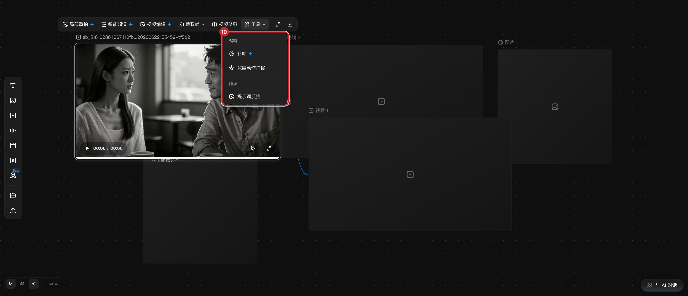

# 使用节点工具条

## 适用角色

已登录的即梦画布创作者。

## 目标

选中节点后使用上方浮动工具条：查看/播放媒体、使用截取帧、视频修剪等加工能力，
并清楚哪些是付费（✦/VIP）功能。

## 前置条件

- 画布中有可选中节点。
- 工具条内容按节点状态变化：
  - **带媒体的节点**（如本地上传视频）→ 加工工具条；
  - **空节点** → 生成面板（见 [准备生成](prepare-generation.md)）；
  - **文本节点** → 背景色/全屏/下载 小工具条；
  - **多选** → N 节点/编组/布局 工具条（见 [编组与整理](organize-group-layout.md)）。

## 入口

单击选中任意节点，工具条自动出现在节点上方（鼠标移开后保持）。

## 带媒体视频节点的工具条（2026-09-23 实测逐字）

**局部重拍✦ ｜ 智能超清✦ ｜ 视频编辑✦ ｜ 截取帧∨ ｜ 视频修剪 ｜ 工具∨ ｜（分隔）｜
全屏 ｜ 下载**

- ✦ 为 VIP/付费标记。**这些按钮会提交按积分计费的任务**：本手册只说明入口与
  位置，是否执行由你决定；执行前请确认积分余额。
- **截取帧∨**：下拉含 首帧/尾帧/自定义，用于从视频截取静态帧生成图片节点。
- **视频修剪**：打开修剪条（帧条 + 两端拖拽把手 + 确认），用于裁剪片段。
- **工具∨**：分两组——「编辑」：补帧（VIP 标）、深度动作捕捉；「预设」：提示词反推。

## 原子步骤（不产生费用的部分）

1. 选中带媒体的视频节点 → 核对工具条逐字标签（上方列表）。
2. 点击 **截取帧∨** → 确认下拉出现（首帧/尾帧/自定义）后按 **Esc** 关闭，不执行。
3. 点击 **工具∨** → 确认菜单出现（编辑：补帧/深度动作捕捉；预设：提示词反推），
   按 **Esc** 关闭。
4. 播放预览：卡片底部有 播放/暂停、时间（00:00 / 00:06）、静音、全屏控件；
   点击 **Unmute video / Mute video** 可切换静音（实测翻转）。
5. 点击尾部 **下载** → 保存媒体文件（本地行为，不耗积分）。

## 取消 / 恢复

- 工具条是选中态的附属 UI：点击空白取消选中即消失。
- 误触付费按钮时，立即 **Esc**；若已弹出任务面板，**不要点确认/生成**，关闭面板即可。

## 相关任务

[准备生成](prepare-generation.md) ｜ [预览与播放](media-playback.md) ｜
[创建节点](create-first-node.md)

## 已验证说明

工具条条目、「工具」菜单结构、截取帧下拉存在性、播放控件与静音翻转均为
2026-09-23 实测；截取帧/视频修剪/局部重拍/智能超清/补帧/深度动作捕捉/提示词反推
的**执行结果**因产生积分消耗未验证，本手册不描述其执行后行为。

## 步骤图

