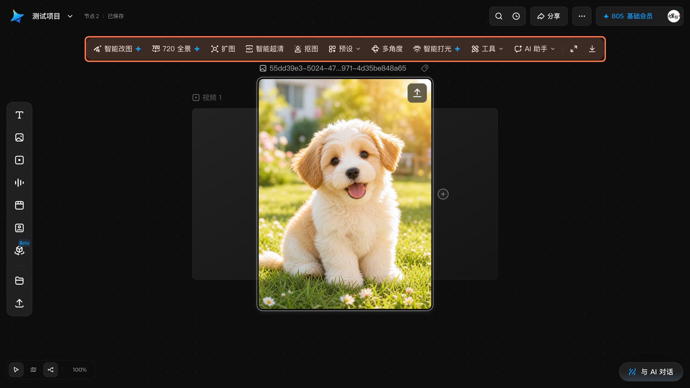
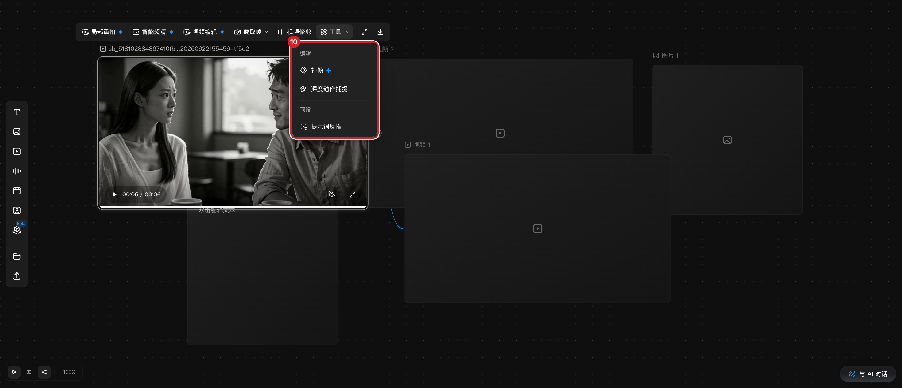
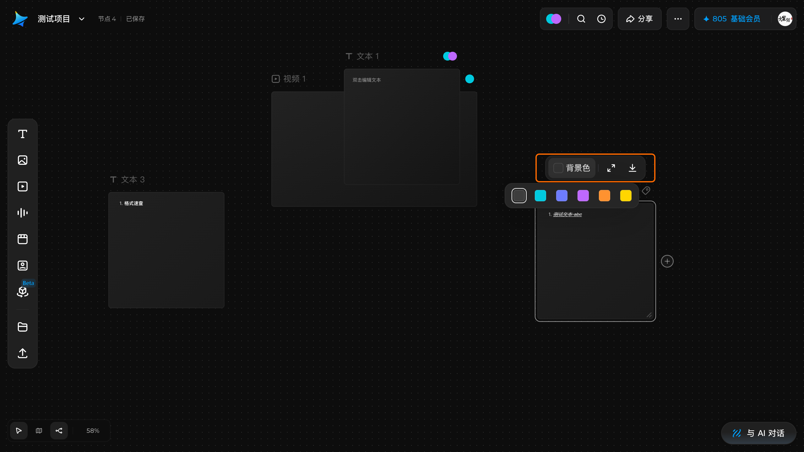
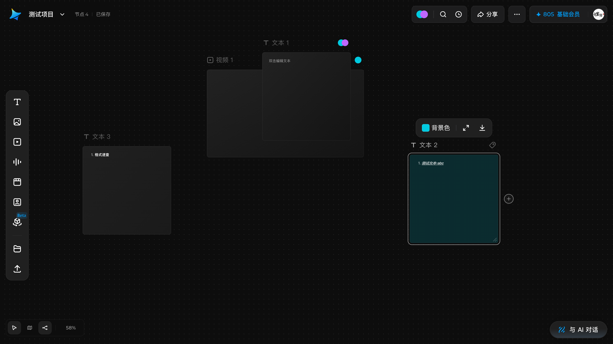

# 使用节点工具条

## 适用角色

已登录的即梦画布创作者。

## 目标

选中节点后使用上方浮动工具条：查看/播放媒体、使用截取帧、视频修剪等加工能力，
并清楚哪些是付费（✦/VIP）功能。

## 前置条件

- 画布中有可选中节点。
- 工具条内容按**节点状态与媒体类型**共同变化：
  - **带媒体的视频节点** → 视频加工工具条（局部重拍/智能超清/视频编辑/截取帧/
    视频修剪/工具）；
  - **带内容的图片节点** → 图片加工工具条（**实测 12 项**：智能改图✦/720 全景✦/扩图/
    智能超清/抠图/预设∨/多角度/智能打光✦/工具∨/AI 助手∨/全屏/下载）——
    **与视频不是同一套**，见下方两节；
  - **空节点** → 工具条位置改放**生成面板**（2026-10-01 实测：容器仍是
    `node-toolbar`，但内容换成生成面板，**680×208**，逐字含「展开视频生成器／
    添加参考／引用参考／选择模型: 即梦 Seedance 2.0 VIP／视频尺寸选项: 16:9 · 720P · 1／
    生成模式: 全能参考／选择视频生成时长: 4s／生成」。见 [准备生成](prepare-generation.md)）；
  - **文本节点** → 背景色/全屏/下载 小工具条（**选中态与编辑态是两套不同工具条**，
    见下方「文本节点的两套工具条」）；
  - **多选** → N 节点/编组/布局/下载 工具条（实测 511×40，**无 Add tags**；见
    [编组与整理](organize-group-layout.md)）；
  - **编组** → 解除编组/布局/背景色 工具条（实测**仅此三项**）。

## 入口

单击选中任意节点，工具条自动出现在节点上方。

> **重要区分**：文本节点有**两套**工具条，容易混淆：
> - **选中态**（单击选中、未进入编辑）：185×40，三项 —— `背景色` ｜ `全屏` ｜ `下载`
> - **编辑态**（双击进入）：316×40，八项 —— `Text style` ｜ `无序列表` ｜ `有序列表` ｜
>   `加粗` ｜ `删除线` ｜ `倾斜` ｜ `下划线` ｜ `全屏`
>
> 两者都用 `.react-flow__node-toolbar` 作为外层类名，**只能靠按钮 aria 区分**。
> 详见 [创建与编辑文本节点](edit-text-node.md)。

## 文本节点的「背景色」色板（2026-10-01 实测逐字）

选中态工具条点 **背景色** → 下方展开 **214×40** 色板浮层（容器背景 `rgb(38,38,38)`，
圆角 12px），内含 **6 枚** 28×28 色块：

| 色板逐字文案 | 色块 computed backgroundColor |
|---|---|
| 无颜色（默认，带白环表示已选） | `rgb(61, 61, 61)` |
| 青绿色 | `rgb(0, 202, 224)` |
| 靛蓝色 | `rgb(109, 124, 255)` |
| 紫色 | `rgb(190, 104, 255)` |
| 橙色 | `rgb(255, 146, 48)` |
| 黄色 | `rgb(255, 214, 0)` |

- 点击色块 → 卡片底色**即时变更**，工具条「背景色」按钮图标同步变为该色。
- 选 **无颜色** 恢复默认。
- **与节点颜色标记是同一套色值**，但**文案不同**：节点标记的 aria 用「青绿色 / 蓝 /
  紫色 / 橙色 / 黄色」，背景色色板把蓝色正式命名为 **「靛蓝色」**。
  两种叫法指向同一个 `rgb(109,124,255)`。

## 带媒体视频节点的工具条（2026-09-23 实测逐字）

**局部重拍✦ ｜ 智能超清✦ ｜ 视频编辑✦ ｜ 截取帧∨ ｜ 视频修剪 ｜ 工具∨ ｜（分隔）｜
全屏 ｜ 下载**

- ✦ 为 VIP/付费标记。**这些按钮会提交按积分计费的任务**：本手册只说明入口与
  位置，是否执行由你决定；执行前请确认积分余额。
- **截取帧∨**：下拉含 首帧/尾帧/自定义，用于从视频截取静态帧生成图片节点。
- **视频修剪**：打开修剪条（帧条 + 两端拖拽把手 + 确认），用于裁剪片段。
- **工具∨**：分两组——「编辑」：补帧（VIP 标）、深度动作捕捉；「预设」：提示词反推。

> **注意「工具」下拉里两类条目的差别**：「编辑」组的 补帧 带 VIP 菱标，属计费任务；
> 而「预设」组的 **提示词反推 不带菱标**，点击后**不会**直接提交付费任务——它会在
> 右侧打开「与 AI 对话」抽屉并**预填**一条指令（例如「用 视频反解 反推出 {视频标题}
> 的提示词，并创建文本节点，方便我拉片复刻」），节点同时放大并暂停。
> 抽屉里的消息**发不发由你决定**，关掉抽屉即无消耗。

## 带媒体图片节点的工具条

图片节点（无论来自本地上传还是由视频截帧生成）选中后，工具条与视频节点**不同**，
只保留图片加工能力。**2026-10-01 批次 22 上传真实图片后实测，共 12 项**：

| # | 逐字 | 尺寸 | ✦ |
|---|---|---|---|
| 1 | 智能改图 | 106×32 | ✦ |
| 2 | **720 全景** | 107×32 | ✦ |
| 3 | 扩图 | 62×32 | |
| 4 | 智能超清 | 88×32 | |
| 5 | 抠图 | 62×32 | |
| 6 | **预设∨** | 78×32 | |
| 7 | 多角度 | 75×32 | |
| 8 | **智能打光** | 106×32 | ✦ |
| 9 | 工具∨ | 78×32 | |
| 10 | **AI 助手∨** | 94×32 | |
| 11 | 全屏 | 32×32 | |
| 12 | 下载 | 32×32 | |

- 外层 `node-toolbar` 实测 **959×40**（**比图片节点本身 320×427 还宽**）。
- 🔴 **订正**：本手册此前只写了前 8 项，**`720 全景`、`预设`、`智能打光`、`AI 助手`
  四项从未记录**。旧记录来自更早批次、其证据节点已丢失，属未复核的历史转写。
- 带 ✦ 的是**智能改图 / 720 全景 / 智能打光** 三项（旧记录只标了智能改图一个）。
- 视频专属项（局部重拍、视频编辑、截取帧、视频修剪）在图片节点上**不出现**——
  它们只作用于视频素材。
- 找不到「视频修剪」时先确认选中的是不是图片节点。
- 图片节点的 **下载是可用态**（无「没有可用的就绪资源」副文案），
  与空视频节点形成对照。

## 原子步骤（不产生费用的部分）

1. 选中带媒体的视频节点 → 核对工具条逐字标签（上方列表）。
2. 点击 **截取帧∨** → 确认下拉出现（首帧/尾帧/自定义）后按 **Esc** 关闭，不执行。
3. 点击 **工具∨** → 确认菜单出现（编辑：补帧/深度动作捕捉；预设：提示词反推），
   按 **Esc** 关闭。
4. 播放预览：卡片底部有 播放/暂停、时间（00:00 / 00:06）、静音、全屏控件；
   点击 **Unmute video / Mute video** 可切换静音（实测翻转）。
5. 点击尾部 **下载** → 保存媒体文件（本地行为，不耗积分）。

### 视频修剪（不产生费用）

裁剪只改本地片段，不提交生成任务，因此可以放心操作：

1. 选中带媒体的视频节点 → 点击 **视频修剪**。
2. 节点下方出现**修剪条**（内联展开，不是弹窗）：一条胶片帧条，两端各有一个
   白色拖拽把手；把手之间是当前选中的片段。
3. 拖动任一把手调整入点/出点：
   - 拖**起点**把手向右 → 左侧时间读数前进，选中段变短；
   - 条内右侧有**选区时长**标签（如 `6.1s`），随拖动实时变化。
4. 条下方是播放走表（`▶ 00:00 / 00:06`，current/total 走表），播放可试听选区。
5. 点击右端白色 **确认** 胶囊钮 → 修剪生效，节点回到常规工具条。
   - 成功判据：确认后修剪条收起，播放区间已缩短。
6. **Esc** 或再次点击 **视频修剪** 可退出修剪态而不保存。
   - 确认后想反悔：**⌘Z** 撤销（见
     [复制、删除与撤销](duplicate-delete-history.md)）。
- 修剪态下工具条暂时隐藏，标题行保持可见——这是正常的中间态，不是卡死。

### 截取帧：把视频变成图片节点（不产生费用）

1. 选中带媒体的视频节点 → 点击 **截取帧∨** → 下拉三项：
   **首帧** ｜ **尾帧** ｜ **自定义**。
2. 选 **首帧 / 尾帧**：**不打开选择条**，直接异步产出一个图片节点
   （新节点标题形如 `…_首帧`），落到画布上。
   - 成功判据：画布新增图片节点。
3. 选 **自定义**：节点下方出现**帧选择条**——胶片帧条（左侧有一根播放头竖线），
   底部一行 `▶ 00:00 / 00:06 ｜ 📷 截取帧 ｜ 确认`。
   - 先在帧条上点选目标帧 → **📷 截取帧** 截取 → **确认** 变为可用 → 点击
     **确认** 生成图片节点。
   - 注意：**未截取时「确认」是置灰的**，必须先截一帧才能确认。
4. 截取帧得到的是普通图片节点，可继续用图片工具条加工或接到生成节点上。

### 两种会「进入编辑模式」的付费功能（局部重拍✦ / 视频编辑✦）

这两个 ✦ 按钮与上面的修剪/截帧不同：点下去不是弹一个面板，而是**把节点切换成
独立的编辑模式**——画布自动放大聚焦该节点，工具条收起，节点下方换成该模式专属的
工具条与提示条。**进入模式本身不会提交生成**；生成发生在最后的发送钮，而发送
按积分计费（见下方各模式的发送钮说明）。

> 本节两段均来自**复刻研究源站采样**（batch 5/6/214/215/373/374），非当日实测。
> 采样之间存在差异（放大比例、标题行是否可见、图标命名），因此下面只写**稳定可复现
> 的结构**，不把某次采样的具体数值当作恒定事实。

**局部重拍✦**（重拍视频中的某一段）

1. 选中带媒体的视频节点 → 点击 **局部重拍**。
2. 画布自动放大聚焦该节点，节点下方出现两样东西：
   - **修剪条**（与「视频修剪」同族）：胶片条 + 两端拖拽把手，选区右端有
     `4.0s` 这样的时长徽章。先在这里圈定要重拍的片段。
   - **重拍提示面板**：参考缩略图（带时长角标）+ **+** 添加参考 + 蓝色描边芯片
     标出当前选中的片段（形如 `00:00–00:04 重拍片段`）+ 输入框占位
     「描述你如何调整这一片段」。
3. 底部参数行：模型（即梦 Seedance 2.5 ✦）、时长（6s）、@ 引用、发送钮。
4. **发送是扣费边界**：发送钮在提示词为空时禁用（面板会提示
   `Prompt is required`），写好描述后才可用。**本手册不代替你点击发送。**
5. 按 **Esc** 退出重拍模式回到画布。

**视频编辑✦**（对整段视频做局部编辑）

1. 选中带媒体的视频节点 → 点击 **视频编辑**。
2. 画布自动放大聚焦该节点，视频开始播放，工具条收起。
3. 节点下方出现 8 个图标按钮的编辑工具药丸，用两条分隔线分成三组：
   区域选择类（矩形 / 画笔 / 箭头）｜ 文字与擦除类（文字 / 橡皮擦 / 标记）｜
   撤销类（撤销 / 重做）。先选区，再描述要怎么改。
4. 下方是编辑提示条：上传参考内容、输入框占位「描述你如何调整视频」、
   引用参考、@ 引用，以及一枚**价格签**（形如 `✦ 144 分/次`，随配置变化）。
5. **发送是扣费边界**：提示词为空时发送钮禁用。价格签上的数字就是本次预计
   消耗的积分，确认后再决定是否发送。
6. 按 **Esc** 退出编辑模式（退出不产生历史，**⌘Z 无法撤销进入/退出编辑模式**）。

**两种模式的共同点**（这几点最容易误判）：

- 进入后**工具条消失、画布被放大**是正常的中间态，不是卡死；
- 放大比例每次可能不同（采样中出现过 122%、145%、176% 等），**不要依赖具体数值**；
- 退出用 **Esc**，不要用 ⌘Z——编辑模式的进入/退出不入撤销栈；
- 两者的**发送**都按积分计费；只想看看界面的话，进入模式后按 **Esc** 即可退出，
  不产生费用。

## 取消 / 恢复

- 工具条是选中态的附属 UI：点击空白取消选中即消失。
- 误触付费按钮时，立即 **Esc**；若已弹出任务面板，**不要点确认/生成**，关闭面板即可。

## 相关任务

[准备生成](prepare-generation.md) ｜ [预览与播放](media-playback.md) ｜
[创建节点](create-first-node.md)

## 已验证说明

本页证据分三层，请按层理解：

- **2026-09-23 源站当日实测**：视频工具条逐字、「工具」菜单结构、截取帧下拉
  （首帧/尾帧/自定义）存在性、播放控件与静音翻转。
- **复刻研究源站采样（SOURCE_FACT，2026-09-12 起）**：图片节点工具条六项、
  视频修剪条结构与把手语义、截取帧自定义帧选择条与「未截取时确认置灰」、
  首帧/尾帧直出图片节点、局部重拍与视频编辑两种编辑模式的结构（batch
  5/6/214/215/373/374）、提示词反推改为打开并预填 AI 抽屉（batch 216，
  推翻了 batch 8「点击即提交付费推理」的旧判定）、全屏预览的音量滑杆
  （batch 218）。这些是源站逐帧采样记录，非当日重提；采样之间存在
  差异（放大比例、标题行可见性、图标命名、价格签格式），故只写稳定结构。
- **2026-10-01 源站当日实测**：文本节点**选中态工具条三项**（背景色/全屏/下载，
  185×40）、**编辑态工具条八项**（316×40，两套工具条并存）、**背景色色板 6 色逐字
  与 RGB 取值**、选色后卡片底色与按钮图标同步变色、文本节点右键菜单。
- **未验证（扣费边界）**：局部重拍/视频编辑的**发送结果**、以及
  截取帧/局部重拍/智能超清/补帧/深度动作捕捉/提示词反推/视频编辑/智能改图
  的**执行结果**因产生积分消耗未执行，本手册不描述其执行后行为。

## 步骤图

