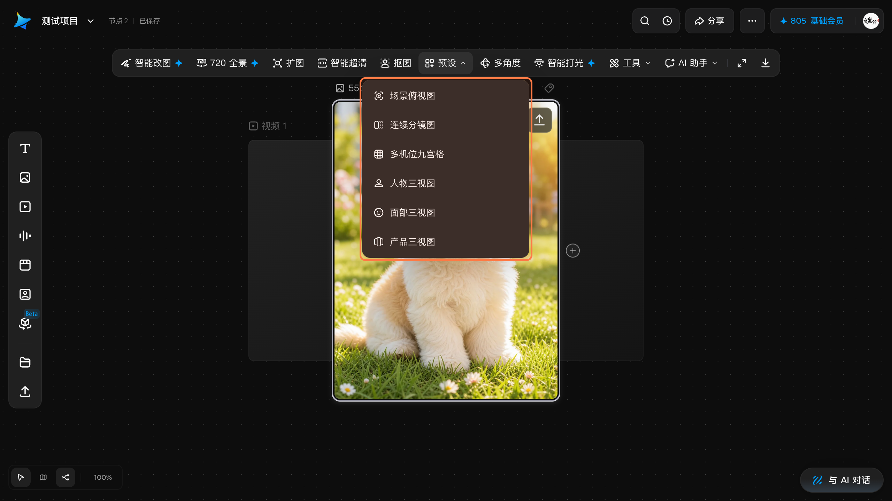
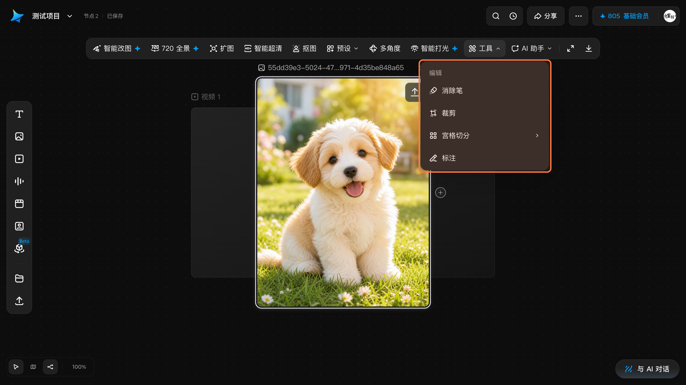
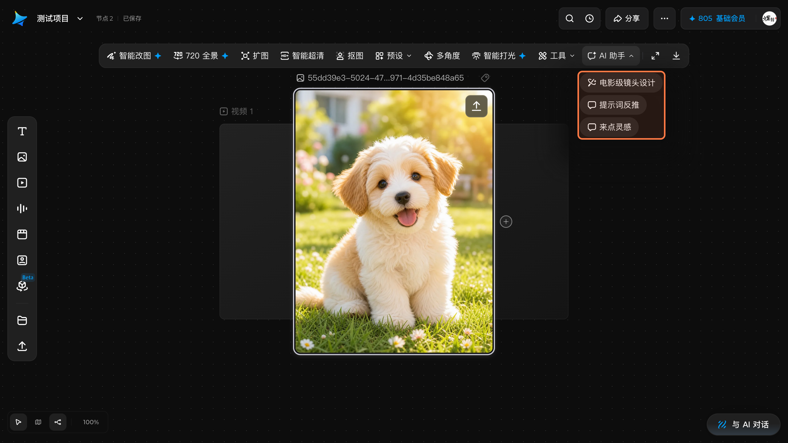
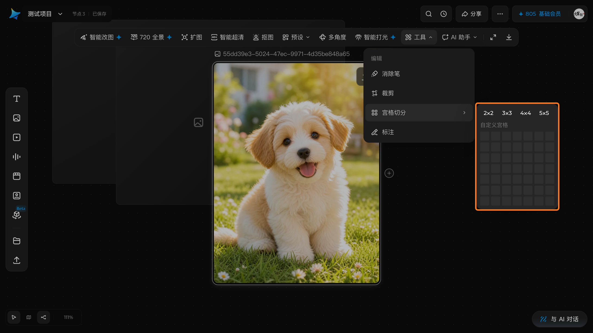
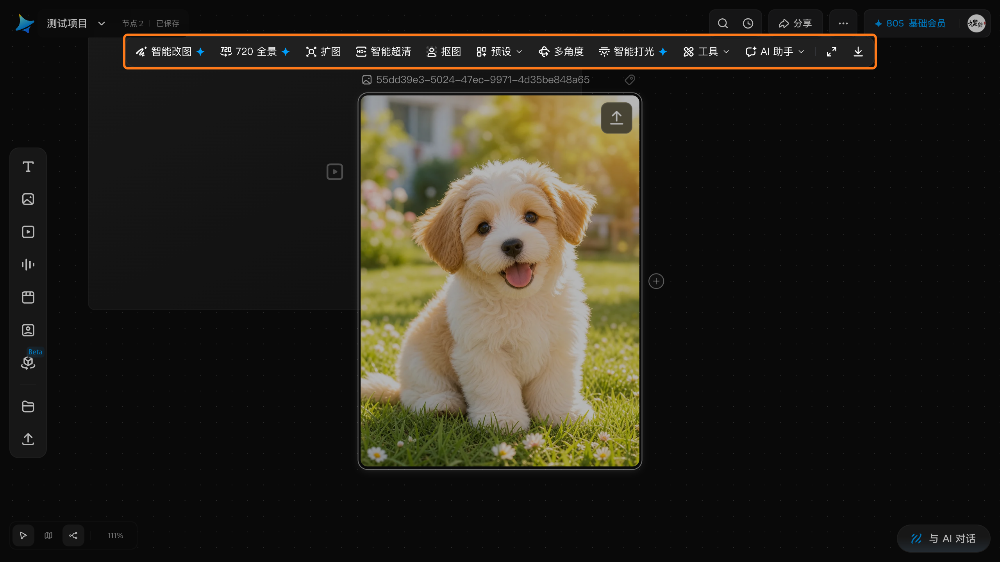

# 使用节点工具条

## 适用角色

已登录的即梦画布创作者。

## 目标

选中节点后使用上方浮动工具条：查看/播放媒体、使用截取帧、视频修剪等加工能力，
并清楚哪些是付费（✦/VIP）功能。

## 前置条件

- 画布中有可选中节点。
- 工具条内容按**节点状态与媒体类型**共同变化：
  - **带媒体的视频节点** → 视频加工工具条（局部重拍/智能超清/视频编辑/截取帧/
    视频修剪/工具）；
  - **带内容的图片节点** → 图片加工工具条（**实测 12 项**：智能改图✦/720 全景✦/扩图/
    智能超清/抠图/预设∨/多角度/智能打光✦/工具∨/AI 助手∨/全屏/下载）——
    **与视频不是同一套**，见下方两节；
  - **空节点** → 工具条位置改放**生成面板**（2026-10-01 实测：容器仍是
    `node-toolbar`，但内容换成生成面板，**680×208**，逐字含「展开视频生成器／
    添加参考／引用参考／选择模型: 即梦 Seedance 2.0 VIP／视频尺寸选项: 16:9 · 720P · 1／
    生成模式: 全能参考／选择视频生成时长: 4s／生成」。见 [准备生成](prepare-generation.md)）；
  - **文本节点** → 背景色/全屏/下载 小工具条（**选中态与编辑态是两套不同工具条**，
    见下方「文本节点的两套工具条」）；
  - **多选** → N 节点/编组/布局/下载 工具条（实测 511×40，**无 Add tags**；见
    [编组与整理](organize-group-layout.md)）；
  - **编组** → 解除编组/布局/背景色/**下载** 工具条，**固定四项**。
    2026-10-01 批次 50 做了控制变量：纯文本组与含空视频节点的组逐字相同，
    与缩放也无关；**只有 0 成员空组**才只剩「解除编组/背景色」两项。
    详见[编组与整理](organize-group-layout.md)。

## 入口

单击选中任意节点，工具条自动出现在节点上方。

> **重要区分**：文本节点有**两套**工具条，容易混淆：
> - **选中态**（单击选中、未进入编辑）：三项 —— `背景色` ｜ `全屏` ｜ `下载`
>   🔴 **批次 93 订正**：`185×40` **三档都没复现**。2026-10-02 实测屏上 **40%→`160×40`、60%→`192×40`、100%→`320×40`**，
>   **高度屏上恒 `40`、宽度三档不同**；按钮本身**屏上恒定**（`背景色 75×32`／`全屏 32×32`／`下载 32×32`）。
>   🔑 **批次 144 补上公式**（三档不够，七档密布实测 30/40/45/50/55/60/100%，
>   锁 `data-id`、每档等实测 `scale()` 追平）：
>   **屏上宽 = `max(320 × 当前缩放, 160)`，高度恒 `40`，交叉点 `160÷320 = 50%`**。
>   ≤50% 的四档（`30/40/45/50%`）读数**逐字恒 `160`**，
>   ≥50% 读 `176 / 192 / 320`（= `320 × scale`）。`320` 就是**文本节点的 canvas 宽** ——
>   高缩放时工具条与节点等宽，低缩放时停在 `160` 的下限（不然三个按钮挤不下）。
>   📌 与组工具条是**同模板、不同内层**：组是 `max(卡片canvas宽×scale, 296)` +
>   **整块** `selection-context-toolbar` 恒定；节点这个是**三个按钮各自**屏上恒定、
>   外层只当容器。详见 [编组与布局](organize-group-layout.md) 与 SOURCE_OBSERVATIONS §4.67。
> - **编辑态**（双击进入）：316×40，八项 —— `Text style` ｜ `无序列表` ｜ `有序列表` ｜
>   `加粗` ｜ `删除线` ｜ `倾斜` ｜ `下划线` ｜ `全屏`
>
> 两者都用 `.react-flow__node-toolbar` 作为外层类名，**只能靠按钮 aria 区分**。
> 详见 [创建与编辑文本节点](edit-text-node.md)。

## 文本节点的「背景色」色板（2026-10-01 实测逐字）

选中态工具条点 **背景色** → 下方展开 **214×40** 色板浮层（容器背景 `rgb(38,38,38)`，
圆角 12px），内含 **6 枚** 28×28 色块：

| 色板逐字文案 | 色块 computed backgroundColor |
|---|---|
| 无颜色（默认，带白环表示已选） | `rgb(61, 61, 61)` |
| 青绿色 | `rgb(0, 202, 224)` |
| 靛蓝色 | `rgb(109, 124, 255)` |
| 紫色 | `rgb(190, 104, 255)` |
| 橙色 | `rgb(255, 146, 48)` |
| 黄色 | `rgb(255, 214, 0)` |

- 点击色块 → 卡片底色**即时变更**，工具条「背景色」按钮图标同步变为该色。
- 选 **无颜色** 恢复默认。
- **与节点颜色标记是同一套色值**，但**文案不同**：节点标记的 aria 用「青绿色 / 蓝 /
  紫色 / 橙色 / 黄色」，背景色色板把蓝色正式命名为 **「靛蓝色」**。
  两种叫法指向同一个 `rgb(109,124,255)`。

## 带媒体视频节点的工具条（2026-09-23 实测逐字）

**局部重拍✦ ｜ 智能超清✦ ｜ 视频编辑✦ ｜ 截取帧∨ ｜ 视频修剪 ｜ 工具∨ ｜（分隔）｜
全屏 ｜ 下载**

- ✦ 为 VIP/付费标记。**这些按钮会提交按积分计费的任务**：本手册只说明入口与
  位置，是否执行由你决定；执行前请确认积分余额。
- **截取帧∨**：下拉含 首帧/尾帧/自定义，用于从视频截取静态帧生成图片节点。
- **视频修剪**：打开修剪条（帧条 + 两端拖拽把手 + 确认），用于裁剪片段。
- **工具∨**：分两组——「编辑」：补帧（VIP 标）、深度动作捕捉；「预设」：提示词反推。

> **注意「工具」下拉里两类条目的差别**：「编辑」组的 补帧 带 VIP 菱标，属计费任务；
> 而「预设」组的 **提示词反推 不带菱标**，点击后**不会**直接提交付费任务——它会在
> 右侧打开「与 AI 对话」抽屉并**预填**一条指令（例如「用 视频反解 反推出 {视频标题}
> 的提示词，并创建文本节点，方便我拉片复刻」），节点同时放大并暂停。
> 抽屉里的消息**发不发由你决定**，关掉抽屉即无消耗。

## 带媒体图片节点的工具条

图片节点（无论来自本地上传还是由视频截帧生成）选中后，工具条与视频节点**不同**，
只保留图片加工能力。**2026-10-01 批次 22 上传真实图片后实测，共 12 项**：

| # | 逐字 | 尺寸 | ✦ |
|---|---|---|---|
| 1 | 智能改图 | 106×32 | ✦ |
| 2 | **720 全景** | 107×32 | ✦ |
| 3 | 扩图 | 62×32 | |
| 4 | 智能超清 | 88×32 | |
| 5 | 抠图 | 62×32 | |
| 6 | **预设∨** | 78×32 | |
| 7 | 多角度 | 75×32 | |
| 8 | **智能打光** | 106×32 | ✦ |
| 9 | 工具∨ | 78×32 | |
| 10 | **AI 助手∨** | 94×32 | |
| 11 | 全屏 | 32×32 | |
| 12 | 下载 | 32×32 | |

- 外层 `node-toolbar` 实测 **959×40**（**比图片节点本身还宽**）。
  🔴 **订正（批次 79）**：此处原写「比图片节点本身 `320×427` 还宽」。
  2026-10-02 只读复核画布上那个带内容的图片节点（他人建的 `b22-upload`）：
  屏上 `341.33×192` @ scale `0.6` ⇒ canvas **`568.88×320`**（16:9），
  **不是 `320×427`**。⇒ 工具条比图片节点宽约 `390` canvas 像素。
- 🔴 **订正**：本手册此前只写了前 8 项，**`720 全景`、`预设`、`智能打光`、`AI 助手`
  四项从未记录**。旧记录来自更早批次、其证据节点已丢失，属未复核的历史转写。
- 带 ✦ 的是**智能改图 / 720 全景 / 智能打光** 三项（旧记录只标了智能改图一个）。
- 视频专属项（局部重拍、视频编辑、截取帧、视频修剪）在图片节点上**不出现**——
  它们只作用于视频素材。
- 找不到「视频修剪」时先确认选中的是不是图片节点。
- 图片节点的 **下载是可用态**（无「没有可用的就绪资源」副文案），
  与空视频节点形成对照。

## 图片节点工具条的三个下拉（2026-10-01 批次 23 实测，此前全手册 0 处记录）

图片工具条上有**三个带 ∨ 的按钮**，点开是三个不同的菜单。逐字如下（**全部只读，
未点击任何一项**）：

### 工具∨（240×204）

分组标题 **编辑**，四项各 232×38：

| 逐字 | 图标 | 备注 |
|---|---|---|
| 消除笔 | ✓ | |
| 裁剪 | ✓ | |
| 宫格切分 | ✓ | **自带下拉箭头**（DOM 内 2 个 svg），**子菜单已于 2026-10-01 批次 31 打开并枚举（见下）** |
| 标注 | ✓ | |

⚠️ **与视频节点的「工具」不是同一套**：视频节点的是「补帧 / 深度动作捕捉」，
图片节点的是「消除笔 / 裁剪 / 宫格切分 / 标注」。**同名不同内容。**

### 宫格切分 ∨ 子菜单（2026-10-01 批次 31 首次打开，此前全手册记为「未点开」）

把鼠标移到「宫格切分」上（或直接点它）会展开**第二层菜单**：

- 容器 `role="menu"`，**aria 逐字 `宫格切分`**，实测 **176×228**
  （2026-10-01 批次 47 复测，位置 `1029,352`，与批次 31 的尺寸一致）。
- 前四项各 **36×24**，逐字 **`2×2` ｜ `3×3` ｜ `4×4` ｜ `5×5`**。
- 第五行是标题逐字 **`自定义宫格`**，下面跟着一片方格选择器：
  容器 `role="group"` aria 逐字 **`自定义宫格`** **160×160**，
  里面 **49 个** `role="menuitem"` 小方格，各 **19×19**。
- 🔑 **能选到几行几列已实测（批次 47 关闭）**：**行 1–7、列 1–7，完整 49 格**
  （`1×1` 一直到 `7×7`，中间不缺格）。
  - 每一格都带机器可读的 `aria-label`，逐字形如 **`自定义宫格 3 × 4`**
    （行列之间是带空格的 `×`）—— 想找某一格**直接按这个名字搜**，
    比用眼睛数方格可靠得多。
- ⚠️ **本节仍然只打开菜单、没有点过任何一格** —— 切分本身会产出新图片，
  属**扣费/生成边界**。「点下去会得到什么」**未验证**。
- 🔑 **这套工具只在图片节点「有素材」之后才出现**（2026-10-01 批次 48 实测）：
  **空图片节点**（无素材）选中后弹的是**图片生成面板**，
  工具条是 7 项 `展开图片生成器` ｜ `添加参考` ｜ `引用参考` ｜ `选择模型` ｜
  `图片尺寸选项` ｜ `引用参考` ｜ `生成`，
  **根本没有「工具」这个按钮** → 也就**没有宫格切分 / 消除笔 / 裁剪 / 标注**。
  空节点的 DOM 特征：`data-testid="image-node-empty"`、**`img` 数量 0**、
  节点内逐字只有 `图片 1`。

### 上一级：「工具」菜单

点工具条上的 **`工具`**（`<button>` 78×32，**`aria-haspopup="menu"`**、
`aria-expanded` 由 `false` 变 `true`）打开的是
`div[role="menu"]` aria 逐字 **`menu`**，实测 **182×154**，
内含 `div[role="group"]` aria 逐字 **`编辑`** 176×148，
**4 个 `menuitem` 各 176×29**，逐字：

**`消除笔` ｜ `裁剪` ｜ `宫格切分` ｜ `标注`**

> ⚠️ 批次 31 曾把这个父菜单记为 **240×204**。两个数字**都保留、不互相覆盖** ——
> 可能是不同入口或不同视口下的同一菜单，**未做对照**。

### 预设∨（240×256）

六项各 232×38，逐字：
**场景俯视图 ｜ 连续分镜图 ｜ 多机位九宫格 ｜ 人物三视图 ｜ 面部三视图 ｜ 产品三视图**

⚠️ **六项都没有 ✦ 菱标**（DOM 内无任何 svg 元素），**但它们显然是生成类操作**。
→ 这推翻了「没有 ✦ 就通常可以放心执行」的朴素判断：
**✦ 缺席不等于免费，菜单类操作尤其要当心。本手册对这六项一律不执行。**

### AI 助手∨（135×104）

三项：电影级镜头设计（135×32）｜ 提示词反推（109×32）｜ 来点灵感（96×32）。
其中 **提示词反推** 会打开右侧 Agent 抽屉并预填指令（不发即无消耗，见
[概念页](../30-concepts.md)）。

> 💡 **怎么判断一个按钮带不带 ✦（DOM 级判据，批次 23 新增）**：
> 带 ✦ 的按钮内部有**两个** `svg`，第二个 `path` 以 `M11.324 3.488c.216` 开头——
> 这是全局共用的 VIP 菱标图标（实测命中 智能改图 / 720 全景 / 智能打光）。
> 带 ∨ 的按钮第二个 `path` 以 `M2.86716 3.43256C3.023` 开头（实测命中 预设 / 工具 /
> AI 助手）。**只靠肉眼数图标容易漏，按 path 前缀判定是确定性的。**

> 🔒 **「svg 数量」就是「能不能安全点开」的判据（2026-10-01 批次 31 新增）**：
> 图片工具条十二项实测的 svg 数是 **1 或 2**：
>
> | svg 数 | 按钮 | 性质 | 取证时可以点吗 |
> |---|---|---|---|
> | **2** | 预设 / 工具 / AI 助手 | **带下拉箭头** → 点开是菜单，**可以只读打开** | ✅ 可以（本手册一贯做法） |
> | **2** | 智能改图 / 720 全景 / 智能打光 | 带 **✦ 菱标** → **直接生成** | ❌ 不可 |
> | **1** | 扩图 / 智能超清 / 抠图 / **多角度** | **无箭头的直接动作** | ❌ 不可 |
>
> - 「多角度」只有 **1 个 svg**（没有下拉箭头），**点下去不会弹菜单**——
>   它是个**直接动作**，属于生成类操作。
> - ⚠️ **本批已误点过一次「多角度」**：脚本按「遍历工具条下拉」的写法把它也点了一次。
>   事后核查：**积分读数仍为 805 未变**、节点数与边数未变、无「处理中/生成中」状态、
>   无新弹窗 —— **没有发生扣费、也没有产出任何生成任务**。但**这属于误操作，
>   已如实记入台账**，并因此写下上面这条判据：**没有 ∨ 的按钮一律不要点**。
> - 推论：**✦ 缺席不等于免费**（预设六项已证），**∨ 存在才是「可以安全打开」的信号**。

## 主体节点：**没有**浮动工具条（2026-10-03 批次 118 补上，全册此前缺这一档）

本页此前覆盖了**六种**工具条（文本选中态/编辑态、图片、视频、空节点=生成面板、
多选、编组），**唯独没有「主体节点」这一档**。批次 118 补上，结论是**没有**。

| 宿主（扫了 7 种） | 主体节点 | **文本节点（阳性对照）** |
|---|---|---|
| **`[data-testid="node-toolbar"]`** | **0 个可见** | **1 个可见** |
| **`.react-flow__node-toolbar`**（class） | **0 个可见** | **1 个可见** |
| `[data-testid*="toolbar"]` | 4 个可见 | 7 个可见 |
| `[role="toolbar"]` | 1 个可见 | 2 个可见 |
| `[class*="node-toolbar"]` | 18 个可见 | 19 个可见 |
| `[class*="floating"]` | 147 | 148 |

⚠️ **只有前两行是决定性的**。后四行在主体节点上「命中」的**全是别人的东西**：
两个**时间线**节点各带一套**节点内部**工具条（`00:00 / 00:00 全屏编辑` ＋ 按钮
`导出时间线` / `全屏编辑`），加上左栏那个 `role="toolbar"`（文本/图片/视频/音频/时间线/主体/导演台/资产库/上传）。
⇒ 它们**随画布上别的节点而变，与「谁被选中」无关**。

🔴 **订正（批次 119）**：上面把时间线节点那套说成「**浮动**工具条」**是错的** ——
它是**节点内部**的工具条（testid **`timeline-toolbar`**）。
它之所以被 `[class*="node-toolbar"]` 这种**宽泛**扫命中，
是因为它的 class 里含 `node-toolbar` 子串，**不是**因为它是浮动工具条。
**本页的结论不受影响**（用的是**精确 class `.react-flow__node-toolbar`**），
但**判据必须写清**：

| 要判的东西 | 该用哪个宿主 |
|---|---|
| **浮动**工具条 | **精确** class `.react-flow__node-toolbar` ＋ 高度 > 1 ＋ 在节点**外** |
| **节点内部**工具条 | `n.contains(元素)` 为真（如 `timeline-toolbar`） |

📌 **宽泛 class 扫会把两者混在一起** ⇒ 它的命中数**不能**用来判「有没有浮动工具条」。
（批次 119 已实测：**时间线节点也没有浮动工具条**，见
[时间线节点](timeline-node.md)。）

🔑 **判据有效性的证明**：同一套判据在**文本节点**上命中 1 个
（`320×40@368,204`，`class` 与 testid **两个宿主都指向它**）
⇒ 「主体节点 0 个」是**读数**，不是判据坏了。

### 🔴 主体节点只留下**两个零高度占位元素**

`[data-testid="node-toolbar"]` 在主体节点上有 **2 个**元素，**高度都是 0**：

| 缩放 | 占位元素宽度 |
|---|---|
| 40% | **141** |
| 60% | **211** |
| 100% | **352** |

⇒ **宽度 = 节点的 canvas 宽度**（主体节点 canvas `352×352`：
`352×0.4 = 140.8 ≈ 141`、`×0.6 = 211.2 ≈ 211`、`×1 = 352`），
**高度恒 0** —— 与批次 85 在**视频节点**上记的「宽度等于节点屏上宽、高度恒 0」**同构**。
⚠️ 这两个占位元素是 `querySelector('[data-testid="node-toolbar"]')` 会**先命中**的
（批次 85 已警告过「单数 `querySelector` 会命中它」），自动化必须按高度筛。

### 主体节点的操作入口全在**节点内部**

它没有浮动工具条，功能都在卡片里（批次 115 读全的 10 个按钮）：
`Rename` / `Edit` / `Edit subject description` / `导入主体` / `添加主媒体` /
`从资产库选择` / `本地添加` ＋ 2 个连接把手 ＋ `Add tags`。

### 🔴 顺带订正：文本节点工具条的「三项」里，`背景色` **不是按钮**

本页多处写文本节点工具条是「**`背景色` ｜ `全屏` ｜ `下载`** 三项」。
实测（60%，自建文本节点，阳性对照同一轮）：

| 项 | 实测形态 |
|---|---|
| 容器 | `320×40@368,204`，`class="react-flow__node-toolbar"`、`data-testid="node-toolbar"`、`z-index: 200025`、**2 个 svg** |
| `背景色` | **不是 `<button>`** —— 它是容器里的一个 **div/色块**，`innerText` 逐字只有 **`背景色`** |
| `全屏` | `<button aria="全屏">` |
| `下载` | `<button aria="下载">` |

⇒ `querySelectorAll('button')` 在这条工具条上**只数得到 2 个**。
「三项」指的是**视觉上的三块**，不是三个按钮。

## 原子步骤（不产生费用的部分）

1. 选中带媒体的视频节点 → 核对工具条逐字标签（上方列表）。
2. 点击 **截取帧∨** → 确认下拉出现（首帧/尾帧/自定义）后按 **Esc** 关闭，不执行。
3. 点击 **工具∨** → 确认菜单出现（编辑：补帧/深度动作捕捉；预设：提示词反推），
   按 **Esc** 关闭。
4. 播放预览：卡片底部有 播放/暂停、时间（00:00 / 00:06）、静音、全屏控件；
   点击 **Unmute video / Mute video** 可切换静音（实测翻转）。
5. 点击尾部 **下载** → 保存媒体文件（本地行为，不耗积分）。

### 视频修剪（不产生费用）

裁剪只改本地片段，不提交生成任务，因此可以放心操作：

1. 选中带媒体的视频节点 → 点击 **视频修剪**。
2. 节点下方出现**修剪条**（内联展开，不是弹窗）：一条胶片帧条，两端各有一个
   白色拖拽把手；把手之间是当前选中的片段。
3. 拖动任一把手调整入点/出点：
   - 拖**起点**把手向右 → 左侧时间读数前进，选中段变短；
   - 条内右侧有**选区时长**标签（如 `6.1s`），随拖动实时变化。
4. 条下方是播放走表（`▶ 00:00 / 00:06`，current/total 走表），播放可试听选区。
5. 点击右端白色 **确认** 胶囊钮 → 修剪生效，节点回到常规工具条。
   - 成功判据：确认后修剪条收起，播放区间已缩短。
6. **Esc** 或再次点击 **视频修剪** 可退出修剪态而不保存。
   - 确认后想反悔：**⌘Z** 撤销（见
     [复制、删除与撤销](duplicate-delete-history.md)）。
- 修剪态下工具条暂时隐藏，标题行保持可见——这是正常的中间态，不是卡死。

### 截取帧：把视频变成图片节点（不产生费用）

1. 选中带媒体的视频节点 → 点击 **截取帧∨** → 下拉三项：
   **首帧** ｜ **尾帧** ｜ **自定义**。
2. 选 **首帧 / 尾帧**：**不打开选择条**，直接异步产出一个图片节点
   （新节点标题形如 `…_首帧`），落到画布上。
   - 成功判据：画布新增图片节点。
3. 选 **自定义**：节点下方出现**帧选择条**——胶片帧条（左侧有一根播放头竖线），
   底部一行 `▶ 00:00 / 00:06 ｜ 📷 截取帧 ｜ 确认`。
   - 先在帧条上点选目标帧 → **📷 截取帧** 截取 → **确认** 变为可用 → 点击
     **确认** 生成图片节点。
   - 注意：**未截取时「确认」是置灰的**，必须先截一帧才能确认。
4. 截取帧得到的是普通图片节点，可继续用图片工具条加工或接到生成节点上。

### 两种会「进入编辑模式」的付费功能（局部重拍✦ / 视频编辑✦）

这两个 ✦ 按钮与上面的修剪/截帧不同：点下去不是弹一个面板，而是**把节点切换成
独立的编辑模式**——画布自动放大聚焦该节点，工具条收起，节点下方换成该模式专属的
工具条与提示条。**进入模式本身不会提交生成**；生成发生在最后的发送钮，而发送
按积分计费（见下方各模式的发送钮说明）。

> 本节两段均来自**复刻研究源站采样**（batch 5/6/214/215/373/374），非当日实测。
> 采样之间存在差异（放大比例、标题行是否可见、图标命名），因此下面只写**稳定可复现
> 的结构**，不把某次采样的具体数值当作恒定事实。

**局部重拍✦**（重拍视频中的某一段）

1. 选中带媒体的视频节点 → 点击 **局部重拍**。
2. 画布自动放大聚焦该节点，节点下方出现两样东西：
   - **修剪条**（与「视频修剪」同族）：胶片条 + 两端拖拽把手，选区右端有
     `4.0s` 这样的时长徽章。先在这里圈定要重拍的片段。
   - **重拍提示面板**：参考缩略图（带时长角标）+ **+** 添加参考 + 蓝色描边芯片
     标出当前选中的片段（形如 `00:00–00:04 重拍片段`）+ 输入框占位
     「描述你如何调整这一片段」。
3. 底部参数行：模型（即梦 Seedance 2.5 ✦）、时长（6s）、@ 引用、发送钮。
4. **发送是扣费边界**：发送钮在提示词为空时禁用（面板会提示
   `Prompt is required`），写好描述后才可用。**本手册不代替你点击发送。**
5. 按 **Esc** 退出重拍模式回到画布。

**视频编辑✦**（对整段视频做局部编辑）

1. 选中带媒体的视频节点 → 点击 **视频编辑**。
2. 画布自动放大聚焦该节点，视频开始播放，工具条收起。
3. 节点下方出现 8 个图标按钮的编辑工具药丸，用两条分隔线分成三组：
   区域选择类（矩形 / 画笔 / 箭头）｜ 文字与擦除类（文字 / 橡皮擦 / 标记）｜
   撤销类（撤销 / 重做）。先选区，再描述要怎么改。
4. 下方是编辑提示条：上传参考内容、输入框占位「描述你如何调整视频」、
   引用参考、@ 引用，以及一枚**价格签**（形如 `✦ 144 分/次`，随配置变化）。
5. **发送是扣费边界**：提示词为空时发送钮禁用。价格签上的数字就是本次预计
   消耗的积分，确认后再决定是否发送。
6. 按 **Esc** 退出编辑模式（退出不产生历史，**⌘Z 无法撤销进入/退出编辑模式**）。

**两种模式的共同点**（这几点最容易误判）：

- 进入后**工具条消失、画布被放大**是正常的中间态，不是卡死；
- 放大比例每次可能不同（采样中出现过 122%、145%、176% 等），**不要依赖具体数值**；
- 退出用 **Esc**，不要用 ⌘Z——编辑模式的进入/退出不入撤销栈；
- 两者的**发送**都按积分计费；只想看看界面的话，进入模式后按 **Esc** 即可退出，
  不产生费用。

## 取消 / 恢复

- 工具条是选中态的附属 UI：点击空白取消选中即消失。
- 误触付费按钮时，立即 **Esc**；若已弹出任务面板，**不要点确认/生成**，关闭面板即可。

## 相关任务

[准备生成](prepare-generation.md) ｜ [预览与播放](media-playback.md) ｜
[创建节点](create-first-node.md)

## 已验证说明

本页证据分三层，请按层理解：

- **2026-09-23 源站当日实测**：视频工具条逐字、「工具」菜单结构、截取帧下拉
  （首帧/尾帧/自定义）存在性、播放控件与静音翻转。
- **复刻研究源站采样（SOURCE_FACT，2026-09-12 起）**：图片节点工具条六项、
  视频修剪条结构与把手语义、截取帧自定义帧选择条与「未截取时确认置灰」、
  首帧/尾帧直出图片节点、局部重拍与视频编辑两种编辑模式的结构（batch
  5/6/214/215/373/374）、提示词反推改为打开并预填 AI 抽屉（batch 216，
  推翻了 batch 8「点击即提交付费推理」的旧判定）、全屏预览的音量滑杆
  （batch 218）。这些是源站逐帧采样记录，非当日重提；采样之间存在
  差异（放大比例、标题行可见性、图标命名、价格签格式），故只写稳定结构。
- **2026-10-01 源站当日实测**：文本节点**选中态工具条三项**（背景色/全屏/下载，
  ~~185×40~~（🔴 已被批次 93 推翻，见「入口」一节）、**编辑态工具条八项**（316×40，两套工具条并存，
   ⚠️ ~~批次 93 实测**空文本节点双击不产生 contenteditable**，这八项在空节点上**不适用**~~
   🔴 **批次 95 推翻该前提**：双击**确实**进编辑态（`contenteditable` 与 `.ProseMirror` 各 1），
   且**编辑态下整副节点外框（工具条、缩放把手、选中描边）全部消失** ——
   本轮**未能**量到「编辑态 `316×40` 八项」，**不下新结论**）、**背景色色板 6 色逐字
  与 RGB 取值**、选色后卡片底色与按钮图标同步变色、文本节点右键菜单。
- **未验证（扣费边界）**：局部重拍/视频编辑的**发送结果**、以及
  截取帧/局部重拍/智能超清/补帧/深度动作捕捉/提示词反推/视频编辑/智能改图
  的**执行结果**因产生积分消耗未执行，本手册不描述其执行后行为。

## 步骤图

## 🔑 文本节点工具条的机械契约（2026-10-02 批次 93 三档实测）

本页第 38 行原写「选中态 **185×40**」，批次 85 原写「canvas 恒 `320×67`」——
🔴 **这两个数本轮都被推翻**，三档实测见下。
本轮在**自建文本节点**上逐档实测（**每档都断言 `sel === 1` 且节点完全在视口内**），
两个数都对不上。

### 三档读数

| 缩放 | scale | 工具条（屏上） | 反推 canvas | 视口内 | `sel` |
|---|---|---|---|---|---|
| 40% | 0.4 | **`160×40`** | 400×100 | ✅ | 1 |
| 60% | 0.6 | **`192×40`** | 320×67 | ✅ | 1 |
| 100% | 1.0 | **`320×40`** | 320×40 | ✅ | 1 |

🔴 **两条订正**：
1. **`185×40` 三档都没复现** ⇒ 旧读数未复现，作废。
2. **「canvas 恒 `320×67`」不成立** ——
   **高度是屏上恒 `40`**（canvas 100/67/40 随缩放走），
   那个 `67` 正是**把屏上恒值除以 scale** 得来的；
   容器宽度 canvas 是 400/320/320，**也不恒**。

### 真正稳定的是**按钮**，而且它们**屏上恒定**

| 按钮 | 40% | 60% | 100% | 备注 |
|---|---|---|---|---|
| `背景色` | `75×32` | `75×32` | `75×32` | ⚠️ **`aria` 为 `null`**，只能按文字认 |
| `全屏` | `32×32` | `32×32` | `32×32` | aria 逐字 `全屏` |
| `下载` | `32×32` | `32×32` | `32×32` | aria 逐字 `下载` |

🔑 **三个按钮的屏上 x 坐标三档完全相同**（`565` / `649` / `683`），
而容器左边缘在动（`560` / `544` / `480`）——
**内容是屏上锚定的，变宽的是外层容器**。
这和 ⊕ 按钮「屏上恒 `36×36`」、手柄热区「canvas 恒 `60×120`」是同一族机制：
**有的元素跟随画布缩放，有的刻意抵消缩放**。**给一个元素写契约前，
必须先测三档，看它跟的是哪一个。**

### ⚠️ 一个 testid 陷阱：按 class 找会多数一个

| 选择器 | 命中 | 逐字 |
|---|---|---|
| `.react-flow__node-toolbar` | **3** | `selection-context-toolbar-popup-host`（`0×0`、0 按钮、**在节点外**）／`node-toolbar` ×2（1 真身 + 1 `0×0` 占位） |
| `[data-testid="node-toolbar"]` | **2** | 1 真身（3 按钮）+ 1 `0×0` 占位 |

⇒ 🔴 **class 比 testid 宽**：多出来的那个是**多选工具条的弹层宿主**，
它只是**借用了同一个 class**。本页第 44 行称「两者都用 `.react-flow__node-toolbar`
作为外层类名」——**字面没错，但用 class 计数会多数一个**。
⇒ **稳定定位器是 `[data-testid="node-toolbar"]`；且必须再按「有没有子按钮」筛出真身。**

#### 🆕 2026-10-05 批次 162 补一个**同时在场**的组合（前面两张表都没记这一种）

上面两张表各记了一种情形：**主体节点 → 两个 0 高占位**、**多选态 → 1 真身 + 1 `0×0` 占位**。
本轮实测到第三种：**选中一个普通节点（如图片节点）时，两个「不同用途」的盒子会在同一次渲染里同时在场**：

| 实例 | 屏上盒 | 按钮数 | 它到底是什么 | 在节点外？ |
|---|---|---|---|---|
| A | `680×208 @241,456` | **7** | **底部生成面板的外壳**（内含同盒的 `node-toolbar-feature-host` ＋ `generation-form`） | ✅ 是 |
| B | **`171×0 @495,229`** | **0** | 多选工具条占位（与 `selection-context-toolbar-surface` 同盒），**高 0** | ✅ 是 |

🔴 **而 `querySelector` 命中哪一个，会随上下文变**：
本项目同一条查询，批次 162（有生成面板时）取到 **A `680×208`**，
批次 160-e（只选导演台）取到 **`0×0` 的占位**。
⇒ 📌 **取点四步，一步都不能省**：
① `querySelectorAll` 数实例个数 → ② 按面积/高度挑 → ③ 读按钮数 →
④ 用 `closest('.react-flow__node')` 确认它**挂在目标节点上**。
**四步缺任何一步，都可能读到别人的东西** —— 本项目已经因此读错两次
（批次 160-e、批次 162-a，两次都是把**底部生成面板**当成了目标节点的浮动工具条）。

### 🔴 订正（2026-10-02 批次 95）：这条提醒的前提测错了，双击**确实**进编辑态

**原结论已作废**。批次 93 当时的测法是「**先单击选中** → **再双击**」，
而这两次点击加起来是**三次**点击，中间那一次**本身就足以改变状态**。
批次 95 用受控复测把序列拆开量，得到的读数与当时完全不同：

| 序列 | `contenteditable` / `.ProseMirror` | 工具条 |
|---|---|---|
| 未选中 + **单击** | `0` / `0` | 选中态工具条（`node-toolbar` **2** 个） |
| 未选中 + **纯双击**（无任何前置单击） | **`1` / `1`** | **一个都没有** |
| **已选中** + 单击 | **`1` / `1`** | **一个都没有** |
| 未选中 + 单击后 120ms 再双击（即批次 93 的序列） | **`1` / `1`** | **一个都没有** |

⇒ **双击文本节点进编辑态，成立。** 批次 93 读到的 0 **不是三击造成的** ——
同一个三击序列这次也读到 1，所以当时的 0 另有原因（那次量的落点很可能不在文本节点上）。
**这说明「测法错了」与「结论错了」是两件事：把测法改对之后，结论照样得推翻。**

### 🔴 真正的机制：编辑态**根本没有**节点工具条

批次 93 留下一个悬案「编辑态工具条的真实 testid 是什么」——
**这个问题问错了**。受控复测的读数是：**编辑态下整副节点外框全部消失**。

| 状态 | `selected` | `contenteditable` | `text-node-resize-controls` | `text-node-selection-outline` | `node-feature-chrome-host` | `node-toolbar` | `selection-context-toolbar` | 右键菜单 |
|---|---|---|---|---|---|---|---|---|
| **未选中** | `false` | `0` | 0 | 0 | 0 | **0** | 0 | 弹得出 |
| **选中** | `true` | `0` | **1** | **1** | **1** | **2** | **1** | 弹得出 |
| **编辑** | `true` | **`1`** | **0** | **0** | **0** | **0** | **0** | **弹不出来** |

两条推论：

1. 🔴 **编辑态里画布上只剩一个裸文本框** —— 没有工具条、没有缩放把手、没有选中描边。
   此刻**右键菜单也弹不出来**（菜单在文本编辑器的右键语境下不触发）。
   ⇒ 想知道「选中态工具条有哪些」时，**必须先确认 `contenteditable` 为 0**，否则量到的是 0 个元素。
2. ⚠️ 顺带解掉一个「看起来像编辑态工具条」的误认：
   `[data-testid="canvas-editor-menu"]` **恒为 1 个、`36×36@1061,12`**，
   位置在**顶栏右侧**而非节点附近，**三种状态下逐字相同** ⇒ 它属于**顶栏**、**与节点无关**。
   🔧 **批次 122 订正后半句**：它**不是那个按钮本身**，而是「更多」按钮的 **36×36 外壳**
   （`display:flex`、只有一个孩子 = `<BUTTON aria="更多" data-testid="null"> 28×28@1065,16`）。
   ⇒ 「位置在顶栏、状态不变」这两条读数仍然成立；
     但**「所以它是顶栏按钮」这一步推错了** —— 它是**顶栏那个按钮的壳**。
   顺带一个读数陷阱：菜单打开时这个 testid **仍然是 1 个**（不会变成 2 个），
   但按钮的 **`data-state` 恒为 `closed`**、只有 `aria-expanded` 会 `false`→`true`。

### 📌 Esc 是**逐级**回退，不是一次回到头

- **编辑态 → Esc 一次 → 选中态**（`editable` 0，但 `resize`/`node-toolbar` 回到 1/2）
- **选中态 → Esc 一次 → 未选中态**（全 0）
⇒ 要回到「完全没碰过」的状态需要**连按两次** Esc。
收尾脚本（删自己建的节点）若只按一次就右键，会打在编辑态上、菜单弹不出来。

