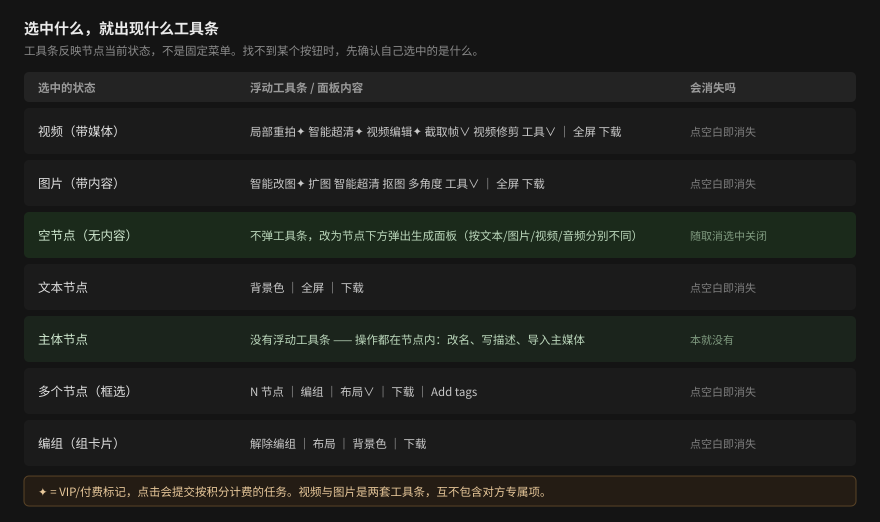

# 概念：即梦画布的创作模型

本页解释画布背后的核心概念，帮助你理解「为什么这样操作」。不包含操作步骤。

> 本页是对已实测行为的归纳，不引入新的产品断言。工具条条目、生成面板与快捷键
> 的逐字记录见 [参考速查](20-reference.md)；带 ✦ 的功能一律只讲到「点击前一步」。

## 节点即素材与生成位

画布上的一切都是**节点**：已存在的素材（上传的视频/图片/音频）和等待生成的
空位（空节点）是同一件事的两态。空节点选中时弹出生成面板——它本质上是一个
「待填充的生成任务」；一旦有了内容，同一个位置就变成可播放、可加工的媒体卡片。

## 连线 = 参考

节点间的连线在即梦中有明确方向：从**参考内容**指向**生成目标**（aria 中称为
Reference connection）。把参考视频连到空视频节点，等于告诉生成器「以这段视频为
参照生成新内容」。因此：

- 有就绪参考时，即使不写提示词，「生成」也会变为可用——参考本身就是一种输入；
- 参考接入后需要短暂处理（chip 从「正在处理上传内容…」到就绪），
  这段时间生成不可用；
- 并非任意两类节点都能互连，+ 菜单会对不可连组合直接标注并禁用。

## 工具条随状态而变

选中一个节点时上方的浮动工具条，反映的是节点当前状态而非固定菜单：

- **视频**（带媒体）→ 视频加工工具条（局部重拍✦、智能超清✦、视频编辑✦、截取帧∨、
  视频修剪、工具∨、全屏、下载）；
- **图片**（带内容）→ 图片加工工具条（智能改图✦、扩图、智能超清、抠图、多角度、
  工具∨、全屏、下载）——**与视频不是同一套**；
- 空节点 → 生成面板（按文本/图片/视频/音频分别给出对应面板）；
- 文本 → 背景色/全屏/下载；
- 主体 → **没有浮动工具条**（操作都在节点内：改名、写描述、导入主媒体）；
- 多选 → 计数/编组/布局/下载（四项，**无「Add tags」**）；
  编组 → 解除编组/布局/背景色/**下载**（**四项**，与组内成分无关；
  **0 成员空组**才只剩「解除编组/背景色」两项）。

> 🔧 **本手册在组工具条上连错两次，都是读数方法的问题**（详见
> [SOURCE_OBSERVATIONS §3.68](SOURCE_OBSERVATIONS.md)）：
> ① 2026-10-01 一次「全元素扫描」漏掉了纯图标按钮（`aria-label="下载"`、无 innerText），
> 把四项读成三项 —— 当场复核那两天的**旧截图**，图里明明是四项；
> ② 纠正后又被带成「有条件的，组内含媒体节点才有」——
> 批次 50 做控制变量（纯文本组 vs 含空视频节点的组）才发现**两者逐字相同**。
>
> **教训**：图片证据与 DOM 读数冲突时，先怀疑读数方法；
> 「A 场景有、B 场景没有」不等于「B 缺了这个能力」，也可能只是**两次用的不是同一套读法**。

**工具条的宽度不是固定值**：多选工具条实测过 511×40 与 1298×40 两种，
~~组工具条跟随组卡片宽度（实测 296×40 / 312×40 / 336×40 / 367×40 四种）~~
🔴 **这句话已被批次 139 推翻**（详见下一段）：宽度**确实**跟卡片走，但那是
`max(卡片 canvas 宽 × 缩放, 296)`，**带一个下限**，并不是四种自由变化的宽度。
「所以拿宽度当判据一定会误判——只数按钮」这个**结论仍然成立**。

📌 **组工具条的宽度跟谁走？**（批次 139 单自变量八档实测，与上面多选那个**不是同一套公式**）
**屏上宽 = max(组卡片 canvas 宽 × 当前缩放, 296)**，高度恒 40。
`296` 是内层 `Selection actions` 的固有宽度（四个按钮把它撑出来的，**八档恒定**）；
当 `卡片 canvas 宽 × 缩放 < 296` 时读数就停在 296，**此时工具条比组卡片还宽**
（40% 时卡片屏上 `224`、工具条 `296`）。交叉点 `296 ÷ 560 = 52.86%`。
⚠️ **对比**：多选工具条那个公式带一个 `+80`，组这个**不带** —— 同组 60% 时
`(560+80) × 0.6 = 384 ≠ 336`。两套工具条都在画布坐标系之外，但各算各的。

📌 **为什么多选工具条的宽度会变？**（批次 135 受控两臂实测）
**屏上宽 = (选中集包围盒 canvas 宽 + 80) × 当前缩放**。
所以它**同时**跟两个变量走：选中了哪些节点（包围盒多宽）、当前画布缩放多少，
而且是**串联**的 —— 只改一个都会让宽度变。锁定同一批 6 个节点只改缩放，
外层是 `40%→400 / 60%→600 / 100%→1000 / 200%→2000`。
**注意这条不等于「工具条在画布坐标系里」**：它的祖先链是
`react-flow__node-toolbar → react-flow__renderer`，**不含 `.react-flow__viewport`**，
所以是组件**自己**按 canvas 尺寸算完再**手工乘 scale**。
🔑 由此得到一条通用判据：**判「某元素跟不跟缩放」要分两问** ——
① 它在不在 `.react-flow__viewport` 里（决定**谁**给它乘）；
② 它屏上尺寸随不随 scale 变（决定**结果**）。
**「`css` 尺寸 = 屏上尺寸」只回答了第一问的否定面，不等于第二问的否定答案。**

理解这一点后，找不到某个按钮时先确认两件事：**我选中的是什么状态**，以及
**它是哪一类媒体节点**。视频与图片的工具条互不包含对方的专属项——在图片节点上
找不到「视频修剪」是正常的。



## 加工操作分两类：本地的不扣积分，生成的才扣

工具条上的动作不是同一种性质，混用会导致误判成本：

- **本地加工**（不提交生成任务、不消耗积分）：视频修剪、截取帧、扩图、抠图、
  静音切换、下载、编组与布局整理。这些可以放心执行，错了用 **⌘Z** 撤销。
- **准备型动作**（本身不扣费，但把你送到会扣费的地方）：**提示词反推**——点击后
  右侧打开「与 AI 对话」抽屉并**预填**一条指令（如「用 视频反解 反推出 … 的提示词，
  并创建文本节点」）。抽屉里的消息**由你决定发不发**；关掉抽屉即无消耗。
- **生成类**（按积分计费，标 ✦/VIP）：生成发送、局部重拍、智能超清、视频编辑、
  补帧、深度动作捕捉、智能改图等。

判断方法：**看有没有 ✦ 菱标**。带 ✦ 的先看面板上的积分读数再决定；没有 ✦ 的通常
可安全执行——但注意「安全」不等于「无后果」：进入编辑模式会改变画布状态，
提示词反推会替你打开并预填 Agent 抽屉。

> ⚠️ **2026-10-01 批次 23 补一条反例：✦ 缺席 ≠ 免费。**
> 图片节点工具条「预设∨」里的六项（场景俯视图 / 连续分镜图 / 多机位九宫格 /
> 人物三视图 / 面部三视图 / 产品三视图）**一个 ✦ 都没有**（DOM 内无任何 svg），
> 但它们显然是生成类操作。**下拉菜单里的项目尤其不能按「没有 ✦ 就安全」来判断**。
>
> **确定性地判断 ✦（DOM 级）**：带 ✦ 的按钮内部有**两个** `svg`，第二个 `path`
> 以 `M11.324 3.488c.216` 开头 —— 全局共用的 VIP 菱标（实测命中 智能改图 /
> 720 全景 / 智能打光）。带下拉箭头 ∨ 的按钮第二个 `path` 以
> `M2.86716 3.43256C3.023` 开头（实测命中 预设 / 工具 / AI 助手）。
> 肉眼数图标容易漏，按 path 前缀判定是确定性的。

## 积分（✦）与安全边界

带 ✦/VIP 标记的按钮（生成、局部重拍、智能超清、视频编辑、补帧等）会提交
按积分计费的任务。价格在面板参数行实时显示（✦数字），随模型、时长、数量、
参考而变化。本手册所有生成类任务都写到「点击前一步」——最后一下由你决定。

## 保存与历史

画布内容自动保存（顶栏「已保存」），**跨刷新持久**；但撤销历史（⌘Z 栈）
**不跨刷新**——关闭页面前没撤销的误操作，刷新后就固定了。因此「删错了马上
⌘Z」是画布里的第一自救动作。

> 📌 **批次 174 补了三条以前没写的边界**（细节见
> [画布上下文 · 确认保存状态](10-tasks/canvas-context.md#确认保存状态)）：
>
> 1. **「内容跨刷新持久」只覆盖内容**：节点、连线、**每个节点的坐标**、节点标题、
>    画布名都保住；但**缩放与平移、选中态、已打开的浮层会丢**。
> 2. **刷新会把你摆好的视角重置成「装得下全部节点」**（本次 76 节点稳定在 **26%**），
>    连续 3 次逐字相同 —— 是确定行为，不是抖动。
> 3. **「已保存」是唯一的态**（6 秒 197 次采样没撞到「保存中」），
>    所以「它显示已保存 ⇒ **证明你那次改动存上了**」这条推断**不成立** ——
>    断网时改画布名，界面会**直接回弹**，而这三个字**一字不变**。
>    核对的唯一办法是**刷新看结果**。

## 框选与拖拽：先看你处在哪个工具

与许多画布不同，即梦**默认**处于 **选择工具**：此时空白处左键拖拽是**框选**，
不平移画布。从其他画布工具迁移过来的用户最需要重建的就是这个肌肉记忆。

但画布底 dock 第一个按钮可以切到 **抓手工具**（aria 就是当前模式），
此时空白处左键拖拽**就是平移画布**。

| 工具（dock 按钮 aria） | 空白处拖拽 = | 想框选节点时 |
|---|---|---|
| **选择工具**（默认） | 框选多个节点 | 直接拖 |
| **抓手工具** | 平移画布 | 先切回选择工具 |

所以准确的说法是「**选择工具下框选而非拖拽**」，而不是「这个画布不能拖拽」。
实测抓手工具下拖 (+220, −140)，画布内容同量同向移动。见
[平移、缩放与控制画布视图](10-tasks/navigate-canvas.md)。

## 节点有两种「选中」，⌫ 失效也有两个不同的原因

- **单击节点** → 节点进入**选中态**，顶部出现它的工具条（空视频节点会展开生成面板）。
- **框选一片节点** → 进入**多选工具条**（计数 / 编组 / 布局 / 下载）。
  多选工具条**没有「背景色」**；只有真正**编组**之后，组工具条才出现「背景色」——
  找不到「背景色」通常说明你还在多选状态、没编组。
- **再点一次节点主体**（文本节点例外，见下）→ 进入**编辑态**。

同一个节点在「选中态」和「编辑态」下，顶部工具条**是两套不同的东西**：文本节点
选中态三项（背景色/全屏/下载）、编辑态八项（加粗/删除线/倾斜/下划线/…）。

**这一点直接决定了 ⌫ 的行为，而两个原因的症状完全不同**：

| 你在哪个态 | ⌫ 会发生什么 | 怎么确认 |
|---|---|---|
| **编辑态**（如点了文本卡片正文，光标在里面） | **只删文字，节点还在** | 焦点在文本编辑区里 |
| **选中态**（如点的是节点标题行） | **删掉整个节点** | 焦点在画布上 |

所以「⌫ 没删掉节点」有两种可能：**删错键**（按了 Delete，反应是零）、**在编辑态**
（反应是文字变少、节点还在）。三者的处置完全不同，别混为一谈。逐条处置见
[排障](90-troubleshooting.md)。

> 📌 **2026-10-01 补第三种**：「⌫ 没删掉节点」还有第三种原因——
> **节点被选中了，但焦点不在画布上**。典型场景是用顶栏 **搜索** 面板点结果行选节点：
> 状态行明明显示 `1 selected`、浮动工具条也弹出来了，按 ⌫ 却毫无反应。
> 原因是键盘焦点仍停在搜索面板上，画布容器收不到按键。
> **怎么确认**：节点已选中（工具条在）但 ⌫ 无效，且按 `Escape` 能关掉面板
> （说明按键能到达页面，不是被拦截）。
> **怎么解**：点一下节点本体把焦点交回画布，或直接用**右键 → 删除 ⌫**。
>
> 三种原因的**症状对照**：

| 原因 | 节点被选中？ | 按 Delete | 按 ⌫ | 按 Escape |
|---|---|---|---|---|
| 按错键 | 是 | 无反应 | **删掉** | 关面板 |
| 文本编辑态 | 是 | 无反应 | 只删文字 | 退出编辑态 |
| 焦点不在画布 | 是 | 无反应 | **无反应** | 关面板（但仍无焦点） |

## 按钮灰着的时候，先找那行解释

即梦的禁用项有**三种表达**，它们的价值不一样——**「有没有解释」本身就是最好的
可用状态判据**：

1. **附原因副文案**：条目下方挂一句原因，例如多选工具条的「下载」禁用时写
   「**没有可用的就绪资源**」；菜单的「重做 ⌘⇧Z」在没有可重做历史时挂
   「**无需重做操作**」。
2. **逐字提示**：在面板上直接写出来，例如空视频节点生成面板里，置灰的「生成」
   按钮旁写「**请输入提示词**」。
3. **仅置灰无文案**：什么都不说，纯粹是灰的。

排查「为什么这个按钮点不动」时，**先看它属于哪一种**：有文案的（形态 1/2）直接照做；
没有文案的（形态 3）才需要自己回忆前置条件——这通常意味着前置条件是隐式的，
值得记一笔。

顺带一条同样好用的反向判据：**原因文案消失 = 前置条件已满足**。例如「缩放至选中项
⇧2」在没有任何选中时是灰的、菜单里写「请先选择至少一个画布元素」；选中一个节点后
再打开菜单，**这句解释消失、条目恢复可点**。比盯着灰按钮猜要可靠得多。

## 「没看到效果」不等于「没有这个功能」

这条是本手册**反复踩到**的一类判断错误，值得单独记住。

画布里有些功能只在**特定前置条件下**才可见/可点。如果你恰好在**不满足条件**的
状态下试它，看到的就是「没反应」——而这**不能**推出「这个功能不存在」。

本手册真实踩过的三次（全部已改正）：

| 曾写下的话 | 真相 | 当时错在哪 |
|---|---|---|
| 「**⌘Y** 单独按无效」 | ✅ **可用** | 试按时**已无可重做内容**（条件不成立，不是功能不可用） |
| 「**回到节点**按钮始终不显示，不要依赖」 | ✅ **可用**，只是**视窗内一个节点都没有时才出现** | 试了 100% 和 23%，**两种情况节点都还在视野里**；缩到 8% 下限时也仍相交 |
| 「不按 Enter，缩放值不会生效」 | 🔴 **错得最离谱**：Enter / **Esc** / **点别处** 都会提交 | 只试了「手指停在输入框里」这一个状态，没试**离开输入框**会怎样 |

**怎么避免**：

- 写「没有这个功能」之前，先问一句「**我的前置条件成立吗？**」
- 试不出效果时，**主动去造条件**（造出可重做历史、把节点拖出视野、
  换一种「离开输入框」的方式），而不是只重复同一种试法。
- 措辞上区分「**没观察到**」和「**不存在**」——
  本手册台账统一写「未能在该条件下触发」，**不写「从不出现」**。

**反过来也成立**：看到东西出现，**不一定**代表它一直在那儿。
判断依据要选**行为或文案**这类可靠信号，别只盯「元素在不在 DOM 里」——
例如「回到节点」提示条**元素常驻**、平时只是 0×0 宽高，
真正的判据是**尺寸是不是 0×0**。

## 输入框类控件：先问「离开时会发生什么」

画布里有几个「点开就变成输入框」的地方（缩放百分比是其中一个）。对这类控件，
**「离开输入框」本身就是一次提交动作**，而它的提交路径往往**不止一条**。

实测缩放输入框（`Set zoom percentage`）：

- **按 Enter** → 生效
- **按 Esc** → **也生效**（容易以为 Esc 是取消，其实不是）
- **点别处失焦** → **也生效**

→ **它没有「取消」路径。** 改错了只能**再键回原来的数值**。
你只观察了「停在里面时读数不变」，就会得出「不按 Enter 不生效」这个
**只对了一半**的结论。

💡 通用做法：**每发现一个输入框控件，除了测 Enter，还要测 Esc 和失焦** ——
三者行为可能不同，而且很可能和你以为的不同。

## 「数值范围」要同时看刻度和取值域

同一个滑杆上，**肉眼看到的刻度和实际能选的取值不是一回事**。

实测视频时长弹层（`Duration options`）：

- 刻度标注 **0 / 5 / 10 / 15**；
- 数字输入框的 HTML 属性是 **`min="4"` `max="15"`` `step="1"`**。

→ **刻度从 0 起，但实际下限是 4 秒**，拖到最左也是 4s。

同类提醒：面板上「**✦ 56**」这类数字是**本次预计积分**，不是上限也不是余额；
**「当前选中」也不等于「唯一可用」**——模型列表里九个选项有八个可选。

💡 通用做法：**记录一个数值控件时，把「刻度标签」「min/max/step」「默认值」
三者分别记下来**。只看其中任何一个都可能写出错误的范围说明。

## 同一类功能在不同节点上可能长得完全不一样

不要假设「视频节点的尺寸弹层」能代表「图片节点的尺寸弹层」。实测两者
**结构相同、选项不同、渲染位置还相反**：

| | 视频 | 图片 |
|---|---|---|
| 弹层尺寸 | 334×292 | 432×292 |
| 比例选项 | 6 项 | **8 项**（多 3:2 / 2:3） |
| 分辨率选项 | 3 项（720P/1080P/4K） | **2 项**（2K/4K） |
| 数量选项 | 4 项 | **8 项** |
| 渲染位置 | `node-toolbar` **外部** | `node-toolbar` **内部** |

右键菜单也一样：七个共有项之外，**图片节点多一项「复制为图片 ⌘⇧C」**、
**主体节点多一项「保存到主体库」**。

💡 通用做法：**凡是写「X 的 Y」，至少在两种节点类型上各验一次**，
并且**把差异写进正文**——只写共同部分会让人在另一种节点上扑空。

🔴 **批次 105 补一条反例**：本节上面写「**主体节点多一项「保存到主体库」**」，
读起来像是「主体」这个**类型**的专利。**不是。**
实测**有资源的视频节点**也有这一项 —— 菜单 `200×332`、8 项，逐字
`复制 ⌘ C ｜ 复制副本 ⌘ D ｜ 粘贴 ⌘ V ｜ 保存到主体库 ｜ 下载 ｜ 重做 ⌘ ⇧ Z 无需重做操作 ｜ 撤销 ⌘ Z ｜ 删除 ⌫`。
（同一个字面量在三个地方测出同一串，交叉对上了。）

⇒ 归一后的规则是：**「保存到主体库」属于「有可用资源」这个条件，不属于「节点类型」**。
空态一律没有；视频/图片一旦有资源就有；主体节点空态就有（它是例外，不是通例）。

🔴 **批次 156 再补一条「在哪」**：这一项**只在右键菜单**里，**不在**图片节点浮动工具条的
「工具」菜单（`data-toolbar-value="tools"`，`240×204`）—— 那个菜单逐字只有
`编辑 消除笔 裁剪 宫格切分 标注`，**第一行「编辑」是分组标题、不是菜单项**
（数 `role=menuitem` 得 4、数 `innerText` 得 5，两个都不是「菜单项数」）。
📌 **规则要分「什么条件下出现」和「从哪进」两问**；只回答前一问，会让人在一个**确实存在**的
菜单里反复找。本批连写三个脚本都按错误前提排期，**三个都没报错**。

💡 **这一条本身就是「同一类功能要多处交叉验证」的教科书案例**：
第 22 批在图片上看到它、第 30 批在主体上看到它，于是顺手把它归给了「节点类型」；
**没人去问「视频有资源的时候有没有」** —— 而这一格恰恰是手册里
挂了很久的「仍未验证」。**一个规律在两个实例上成立，不等于它在第三个实例上也成立。**

## 「播不出来」至少是三个状态，而手册长期只写了两个

批次 105 在[预览与播放视频节点](10-tasks/media-playback.md)上撞出来的：

| | 空节点 | **处理中** | 失效 |
|---|---|---|---|
| 时间读数 | 没有 | **没有** | `00:00 / 00:00` |
| 播放控件 | 一个都没有 | **一个都没有** | 有 |
| 中央提示 | 占位图标 | **「正在处理上传内容…」** | 失败提示 |

**中间那档是唯一能自然造出来的**：造一张「合法容器头 + 不可解码内容」的素材，
它能过上传白名单、走上传通道、资源被收下、积分不变 ——
然后就**永远停在处理中**（实测 11 分钟内账本逐位不动）。

两条方法论：

1. 🔴 **节点的 `innerText` 自带资源账**：
   `1 resource: 0 ready, 1 processing, 0 failed.`
   它比「有没有 `<video>` 元素」更早一步 —— 后者还取决于选中态与播放态，
   **根本不是资源的健康度**。
2. 🔴 **这张账是「上传期」的账**。批次 105 注入播放期加载失败之后，
   账本纹丝不动仍是 `1 ready, 0 processing, 0 failed`。
   ⇒ **不要拿它当「资源是否还能播」的判据**。

💡 更一般的一条：**「某个功能坏了」往往是复数**。写手册时把「坏了」
压成一个状态，读者就会拿着一个状态的解法去套另一个状态 ——
而两个状态的解法**恰好相反**（这个要等，那个要立刻换掉）。

## 故障注入：命中不等于生效

批次 105 想造一次「资源失效」，四轮全空，而**四轮失败的理由各不相同**：

| 轮 | 手法 | 结果 |
|---|---|---|
| 1 | 对已缓冲的 `<video>` 调 `load()` | 不发请求 |
| 2 | 摘掉 `src` 再原样挂回 | 仍不发请求 |
| 3 | 谓词函数路由 + `abort()` | **命中 1 次**，但打在 cache hit 上，`<video>.error` 仍 `null` |
| 4 | CDP 关缓存 + 清缓存 | **连 `request` 事件都不发了** |

三条能带走的：

- 🔴 **「我装了拦截」不等于「拦截生效了」**。前两轮命中数是 0 却毫无报警。
  ⇒ **注入类断言必须带命中计数。**
- 🔴 **命中了也不等于生效**。第 3 轮命中 1 次、请求真发出去了、`abort()` 也执行了，
  媒体却照样加载成功 —— 因为它早就在浏览器缓存里。
  ⇒ **命中之后还要看被注入对象的状态有没有真的变。**
- 🔴 **`page.route('去掉 query 的字符串')` 匹配不到任何东西**。
  Playwright 对**不含通配符**的字符串按**整条 URL 精确匹配**，
  砍掉 `?a=…&ch=…` 当 glob 用必然落空。改用**谓词函数**。

💡 通用做法：**注入型实验要同时准备「我做了什么」和「它有没有发生」两套读数。**

## 按钮上有没有「∨」，决定你能不能放心点它

画布工具条上的按钮分三类，**从 DOM 上可以直接分出来，不用猜**：

| 类型 | DOM 指纹 | 点了会发生什么 | 能不能为了「看一眼」而点 |
|---|---|---|---|
| **下拉按钮** | 内部 **2 个 `svg`**，第二个 `path` 以 `M2.86716 3.43256C3.023` 开头 | 展开一个菜单 | ✅ **可以**（只看不选） |
| **带 ✦ 的生成按钮** | 内部 **2 个 `svg`**，第二个 `path` 以 `M11.324 3.488c.216` 开头 | **直接提交生成、扣积分** | ❌ 不行 |
| **无箭头的直接动作** | 内部只有 **1 个 `svg`** | **直接执行**（扩图 / 智能超清 / 抠图 / 多角度…） | ❌ 不行 |

实测依据：图片工具条十项的 svg 数与图标完全对应
（`预设`/`工具`/`AI 助手` = 2 个 svg 带 ∨；`智能改图`/`720 全景`/`智能打光` =
2 个 svg 带 ✦；`扩图`/`智能超清`/`抠图`/`多角度` = 1 个 svg 无箭头）。

💡 两条推论：

1. **✦ 缺席不等于免费** ——「预设」下拉六项一个 svg 都没有，却显然都是生成类操作。
2. **∨ 存在才是「可以安全打开」的信号** —— 判断能不能点，看**有没有 ∨**，
   不要看「有没有 ✦」。

⚠️ 本手册曾因此误点过一次「多角度」（无 ∨ 的直接动作）。事后核查确认
**积分未变、无生成任务、无新资源**，但流程上属于误操作。
**教训：打开任何工具条之前，先数一遍每个按钮里的 svg 个数。**

## 同名控件先分「存在条件」，再分「位置」

画布上 `引用参考` 这个 `aria` **出现两次**：提示词区内 24×24、参数行 32×32。
早前的记录把它们记成「一个能用、一个点了没反应」，并据此下了个结论。

**2026-10-01 复测推翻了它**：两个都能用。真正的原因是那处 24×24 的
**不是常驻按钮 —— 只在提示词为空时存在**；提示词一有字符（哪怕只是刚插入的
`@` 和占位符）它就消失。记录它「没反应」的那一次，是提示词已经不空了。

💡 **推论：控件「不见了」有三种可能，必须分开判**：

| 可能 | 怎么区分 |
|---|---|
| 控件坏了 / 被删了 | 刷新、换节点类型都找不到 |
| **被条件隐藏**（本例） | **在另一个状态下能稳定找到** —— 去把条件变量改回去再找一次 |
| 根本没渲染（懒加载） | 触发对应操作后才会挂载 |

🔑 **判据是「能不能把它的存在条件复现出来」，不是「这一次没找到」**。
这和 [「没看到效果」不等于「没有这个功能」](#没看到效果不等于没有这个功能) 是同一条
方法论的两种应用：前者管功能，后者管控件。

💡 附带一条 DOM 判据：数一数同名控件的**出现个数**本身就是存在条件的最快探针。
本例里 `aria=引用参考` 的按钮数在「提示词空」时是 2，「插入 `@` 后」是 1 ——
一眼就看出哪个是条件性的。

## 界面上写着「搜索…」，不代表它是搜索框

`@` 提及面板打开后，提示词框里出现占位文字逐字 **`搜索主体、图片、视频`**，
面板顶端也有一行分组标题 **`添加参考`**。用户（和作者）很容易据此以为
「打 @ 然后输名字就能搜到」。

**2026-10-01 实测是错的**。面板打开状态下键入「主」：

1. 面板**立刻关闭**；
2. 占位符消失，提示词变成**字面量** `@主`；
3. 再键入「体」变成 `@主体`。

**列表既没有收窄，也没有选中任何东西。** 它是一个**两级定步选择器**——
先点类别（主体 / 图片 / 视频 / 音频），再从二级菜单点具体节点，仅此一种用法。

💡 **通用判据：分清「占位提示」和「输入提示」**。

| | 占位提示（placeholder） | 输入提示 |
|---|---|---|
| 出现时机 | 值为空时显示在**内容位**上 | 聚焦后才出现，通常在输入框之外 |
| 消失时机 | 有内容就消失 | 常驻 |
| 对应的能力 | **不承诺任何能力** | 承诺了对应的搜索/过滤行为 |

🔑 **一个控件上出现了「搜索」二字，只能证明文案这么写了，不能证明它实现了搜索。**
要证明，必须真的敲几个字看列表变不变 —— 敲了没变，就要如实写「它不是搜索框」。

## 浮层不一定挂在 body 下

`@` 提及面板的 DOM 链实测是：

```
div{generation-mention-panel} < div < div < form{generation-form}
  < div < div{node-toolbar-feature-host} < div{node-toolbar}
```

它**渲染在生成表单内部**，不是 body 级 portal。

本批因此报废了一版探针：筛选浮层时用了三条排除条件
（`不在 node-toolbar 里` / `不在 .react-flow__node 里` / `不在左栏轨道里`），
结果把整个 `generation-mention-panel` 一起滤掉了，脚本一路打印 `floats: []`
却毫无察觉。

🔑 **两条推论**：

1. **排除条件本身要先验证** —— 用一条已知一定成立的浮层去试你的筛选器，
   确认它**能被选出来**，再相信 `floats: []` 是真的空。
2. **宁可放弃筛选、改用差分** —— 「点击前后全页 DOM 签名对比」
   （`[role] / [data-testid] / [aria-label]` 三元组 + 尺寸 + 文本）**不需要任何
   先验假设**，直接看多出来/少掉了什么。本批靠它一次就定位到二级子菜单
   `[data-testid="generation-mention-submenu"]`，而差分之前连它的名字都不知道。

💡 差分的输出要**去重 + 排序**再比，否则同一条签名会因为 `innerText` 变了一个字
就被算成「删了一条 + 加了一条」，噪声淹没信号。

### 🔴 加强版：portal 出来的东西，**连「属于哪个逻辑容器」都不体现在 DOM 树上**

批次 107 为了验一个快捷键而撞出来的，比上面那条更狠一层。

**文本节点的编辑态**，直觉上应该是「在那个节点里」——
于是判据写成「`.react-flow__node[data-id=…]` 里面有没有 `[contenteditable]`」。
结果**连着两轮都读成「编辑器没开」**，而编辑器明明开着、工具条也明明白白挂在页面上：

- 可编辑面 = **`DIV.tiptap.ProseMirror`**，`contenteditable="true"` +
  `role="textbox"` + `aria-label="Text"`，**不在节点里**；
- 工具条 = `[data-testid="text-editor-toolbar"]` `316×40`，
  父元素是 `DIV[text-editor-toolbar-boundary]`，**同样不在节点里**。

⇒ 📌 **「浮层不在 body 下」的反面更实用：它在，但你按「逻辑归属」去找就找不到。**
判「在不在编辑态」只能扫全局（`.tiptap.ProseMirror`）或看
`document.activeElement` 是否 contenteditable。

🔑 **一个更普适的推论**：**判「某个状态有没有发生」时，扫描范围本身就是一个假设。**
「它在节点里」「它在 body 下」「它在这个浮层里」——每一条都要单独验，
不能因为「上一次是这样」就沿用。

## 同类控件之间的 aria 未必一致

`@` 面板的四个类别，点开后得到的二级菜单**结构一样**（都是 240×76、都只有
`暂无相关节点`），但 **aria 不一样**：

| 类别 | 二级 listbox aria | `role="group"` |
|---|---|---|
| `主体` | **（无）** | **无** |
| `图片` / `视频` / `音频` | 逐字等于类别名 | 有，且 aria 同名 |

🔑 **不能因为「三个是这样」就断言「第四个也是这样」**。
做自动化定位时，**`role="group"` 这类可选层级要当作可能不存在来写**
（`querySelector` 而不是 `querySelector` + 强制断言）。
反过来，**发现了不一致就该如实记进手册** —— 它是使用者判断「我是不是漏看了什么」
的真实线索。

💡 同批次里还有两个「不一致」值得一并记住：

- 一级面板里 `[role="listbox"]` 的 aria 是 **`可能@的内容`**，
  但二级菜单的 listbox 要么**没有 aria**、要么是**类别名** —— 同一套组件，
  两种命名法。
- 音视频生成面板的参数行按钮 aria 都带 `, Standard-only model` 后缀，
  **图片面板的不带**。

## 测「一套 UI」要横向铺开，别只测一个实例

批次 33 把 `添加参考` / `引用参考` / `@` 面板在**视频节点**上测得很细，
差点就当成「参考输入这套 UI 的全貌」写进手册。批次 34 铺到另外三种节点，
立刻翻出两件手册原本写错的事：

| 测的范围 | 漏掉的真相 |
|---|---|
| 只有视频节点 | `@` 面板有 **4 类**、240×244、占位符写「搜索主体、图片、视频」 |
| 加上图片节点 | 只有 **2 类**、240×140、占位符缩成「搜索主体、图片」、`添加参考` 首项变成**「上传图片」** |
| 加上音频节点 | **3 类**、240×192、**没有「视频」** |
| 加上文本节点 | **整套东西都不存在** —— 没有生成面板、没有参考输入 |

🔑 **方法论：一个「组件」在手册里往往对应多个实例，测一个 ≠ 测完。**
判断「测完了」的标准不是「这个控件我点开了」，而是
**「所有会渲染这个控件的宿主，我都测过了吗」**。

💡 找齐宿主的办法很朴素：**把这个控件的 aria/结构在页面上做一次全量匹配**，
看它出现在几种上下文里。本批 `引用参考` 在三个面板里各出现 2 次（合计 6 个），
一开始只当它是「视频面板里的重复项」，实际是「所有生成面板里的重复项」。

💡 铺开之后要找的正是**逐字段的差异**，不要只找「有没有」。
本批的差异落在**四个不同维度**上，任一维度单独看都不显眼：

| 维度 | 差异 |
|---|---|
| **集合** | `@` 类别：4 / 2 / 3 项；`文本`：0 项 |
| **文案** | `上传参考内容` vs **`上传图片`** |
| **尺寸** | 244 / 140 / 192；面板 208 / 204 |
| **testid** | `video-generation-form` / **`generation-form`** / `audio-generation-form` / 无 |

🔑 **集合、文案、尺寸、标识 —— 这四个维度要分别对，漏一个就写不准。**

## 否定性结论要有断言，不能靠「我没看到」

批次 34 写「文本节点没有生成面板」时，光看截图是不够的 ——
局部特写图**证明不了「没有」**，只能证明「有这个」。

**当时的断言是三条可复算的 DOM 事实**：
`form` 不存在（`hasForm = false`）、`[contenteditable]` 不存在（`hasPrompt = false`）、
工具条内只有 3 个 `button`。**并且在三个不同的文本节点上结果一致**
（两个空壳 + 一个有内容的），排除了「这一个节点特殊」。

🔑 **写否定结论时，把断言本身写进手册**，让读者能自己复核；
**并且尽量在 ≥2 个实例上取同一结果**。做不到就降级成
「未能确认」（见 [「没看到效果」不等于「没有这个功能」](#没看到效果不等于没有这个功能)）。

💡 本批还因此**主动放弃了一张截图**：想拍文本节点工具条，但新建的空文本节点
选中后根本不渲染工具条，工具条本身又早已被 41/42 号截图覆盖 ——
**一张拍不出来的图，不如一句带断言的结论**。污染图已删除。

## 共享画布上：先分清「谁的东西」，再动手

取证用的画布是**团队共享**的。本批开工时画布上有 4 个不是我建的节点，
其中一个还带着内容逐字 `测试文字样例`。

🔑 **三条判据，逐条走完再决定动不动它**：

| 判据 | 本批结果 |
|---|---|
| CDP 端口上**只有我自己的 page target** 吗？ | 是（9444 仅 1 个） |
| 有没有**第二个进程**连着这个画布？ | **有** —— 9222 上是别人的 Chrome |
| 这些节点**有没有内容**？ | 有一个有（`测试文字样例`） |

→ 结论：**一个都不动**。并且由此推出两条纪律：

1. 🛑 **禁止「除保留项外全删」式的清理脚本**在共享画布上跑 ——
   `jimeng-baseline-restore.mjs` 正是这个语义，在共享画布上**会删掉别人的成果**。
   必须换成**按 `data-id` 精确删除**（`jimeng-node-cleanup.mjs`），
   且**删前打印全量清单**当审计证据。
2. 📷 **截图不能拍到别人的内容** —— 否则手册一旦公开就泄露了。
   本批第一版 `clip` 之外的整屏截图就拍进了 `测试文字样例`；
   改成**只框目标区域的局部截图**才合格。

💡 附带一条：**取证的临时节点必须按 id 记账**。本批有一次因为采集函数漏了 `type` 字段，两个新建节点没被记进待清理列表，只能事后靠「已知 id 集合」反查才找回来。
**先记账再操作**，比事后考古可靠得多。

## ⚠️ 框选会框进所有人的节点 —— 共享画布上的头号陷阱

批次 35 想测「多选态 / 编组态的工具条长什么样」。脚本新建了两个节点，
然后按它们的坐标**算出一个矩形框**拖过去框选。

**框里的范围比我以为的大得多**：画布上还有 4 个**不是我建的**节点，
它们的坐标恰好也落在那个矩形里。松手后状态行显示 **`8 selected`** ——
**8 个节点全被选中，其中 5 个是别人的**。脚本紧接着点右键菜单里的
**「编组」**，于是**把别人的成果一起编组了**。

🔴 **这是一次真实事故**，已用「撤销」精确恢复（见下）。

💡 **为什么框选的杀伤面这么大**：

1. **框选是区域操作，不是「选中我列出的那几个」**。
   你算的矩形只是「我想要的那几个」的**外接框**，而**外接框里的一切**都会被选中。
2. 节点**越堆越密**，外接框覆盖到的无关节点就越多。
   共享画布上尤其危险 —— 别人的节点就在旁边。
3. 脚本里 `pre` 集合只用于**记录**自己新建的节点，**完全没有约束框选范围**。

🔑 **三条纪律**：

| # | 纪律 | 理由 |
|---|---|---|
| 1 | **框选前先断言选中数**等于预期数 | 8 ≠ 2 就是信号，**在点编组之前**就该停 |
| 2 | 共享画布上做框选，**先把别人的节点推出视口**，或改用逐个 Shift+点选 | 外接框里不该有别人的东西 |
| 3 | 需要「多选」做取证时，**优先用 Shift/Cmd 点选已知 id** | 点选精确可控，框选不可控 |

💡 **更根本的一条：取证脚本要先想清楚「这一步会改什么、怎么回退」。**
`编组` / `删除` 这类操作**会改别人的数据**，不是「只读观察」。

## 「撤销」是共享画布上最精确的回退手段

事故后我试了三条恢复路径：

| 手段 | 结果 |
|---|---|
| 点组本身解除编组 | ❌ 组元素是 `pointer-events: none`，**点不中** |
| 点组内成员 → 找「解除编组」 | ❌ 成员弹出的是**自己的**工具条，右键菜单里也没有「解除编组」 |
| **右键菜单 → 「撤销 ⌘ Z」** | ✅ **一次点准，组数 1 → 0，8 个节点全部完好** |

🔑 **为什么「撤销」最准**：它**精确反向我刚才那一个操作**，
不依赖「现在选中了谁」「组元素能不能点」这些当前状态。
删除、编组、粘贴这类**可逆的本地编辑**，撤销栈里都有对应条目。

💡 两条配套的通用结论：

- **改别人的数据之前，先看一眼「撤销」在不在。** 它在，才敢动手。
  事故当时右键菜单里 `撤销 ⌘ Z` 是**可用**的（旁边的「重做」显示
  「无需重做操作」），这就是判断依据。
- **不要用「逐个反向操作」去补救一次批量误操作。** 解除编组失败两次就是例子；
  一次撤销干净利落。

## 否定性结论要穷举宿主，不要只测「有」的那一个

批次 34 测出「视频 / 图片 / 音频有参考输入，文本没有」之后，一个自然的
（也是错误的）收尾是「所以只有这几种」。批次 35 去问「**还有没有别的宿主**」，
把剩下五类全过了一遍：

| 宿主 | 有参考输入吗 |
|---|---|
| 视频 / 图片 / 音频 | ✅ |
| 文本 / 时间线 / 主体 / 多选 / 编组 | ❌ |

- **时间线与主体**：工具条实测高度是 **0**（`662x0` / `194x0`），
  也就是那个「常驻的 0×0 折叠容器」，**没有可见工具条**。
  这一点批次 30 已记过，但当时**没有和「参考输入」这个问题挂上**。
- **多选态 728×48** 四项、`编组态 772×40` 四项，**都没有 `添加参考` / `引用参考`**。

🔑 **「三种节点有、文本没有」和「只有生成节点有」是两个强度不同的结论。**
前者是观察，后者需要**穷举宿主**才能下。

💡 宿主清单的取法很朴素：**凡是渲染了同一个 DOM 容器的东西，都算宿主。**
本批的宿主就是「所有会渲染 `[data-testid="node-toolbar"]` 的上下文」，
把「节点类型」列全（视频/图片/音频/文本/时间线/主体/导演台/组），
再补上「多选态 / 编组态」这两个**非节点类型的容器状态**——
**最容易漏的就是后两个**，因为它们不是「一种节点」。

## 门只扫文件，扫不到提交信息

收尾质量门第 6 道扫的是 **Markdown 里的替换字符（U+FFFD）**，
而**提交信息不在任何一道门的覆盖范围内**。

批次 55 的提交（`1b0f7d63`）信息里就混进了 **3 个 U+FFFD**，
而那一批的收尾门是 **8/8 通过、退出码 0** —— 门完全没问题，
**是门管不到的地方漏了**。

共享分支上**不能**用 `commit --amend` + `force-push` 去改已推送的历史
（会把别人刚推上去的提交一起冲掉）。所以只能在提交**之前**挡住：

```bash
# 1) 先把提交信息写进文件
# 2) 过守卫
node scripts/jimeng-msg-guard.mjs /tmp/msg.txt     # 含 U+FFFD 则退 1
# 3) 过得了才提交
git commit -F /tmp/msg.txt -- <精确 paths>
```

💡 **又一次印证同一条纪律：核对清单的漏洞就是事故的盲区。**
第 6 道门是我自己在批次 48 加的，它防住了**文件**里的乱码，
却让**提交信息**这条路径一直没人管 —— 加一道门容易，
**记得给门补上新出现的路径**才难。

## 自建节点的三重护栏还不够：落点也必须验明正身

批次 97 立的护栏是「建前存 id 集合 → 建后差集恰好一个且同时 `.selected` →
事后核对消失的 id 恰好只有 SELF」。批次 105 又撞出**第四道**，它管的是**删除动作本身**。

本轮两个自建节点**部分重叠**（垃圾素材节点 `469,288 341×192`，
视频靶子 `736,360 341×192`，重叠区 `x 736–810` / `y 360–480`）。
清理脚本的去程是「点节点中心 → 右键 → 点菜单里的『删除』」——
**而第一步那个「中心」从来没有校验过命中的是谁**。
结果 `selected` 读出来是 `false`，脚本**仍然继续往下走**，
最后删掉的是 `node_kk93zz7qzx`（我自己的另一个），垃圾节点纹丝不动。

💥 **如果那两枚不是同一个人建的，这一下就是在删别人的节点。**
（万幸它们都是本轮自建的，删完核对「消失的 id」才没出事。）

⇒ 补第四道：**点之前先用 `elementFromPoint` 证明最上层元素确实在目标内部**
（`el === t || t.contains(el)`）；
**点之后必须读到 `selected === true` 才继续**，读不到就**中止，不猜、不硬删**。

> 🔴 **订正（2026-10-02 批次 108）：这第四道被我自己的条件改了两次** ——
> 两次都是我写进去的判据在添乱。
>
> **① 「不在任何他人节点矩形内」是假阴性，必须删掉。**
> 甲节点（`544,312 192×192`）的 2209 个采样点里，命中甲自身或后代的共 **1615** 个，
> 其中被矩形条件杀掉的 **594** 个（`时间线 2` 占 216、`音频 6` 占 378）。
> 可那两个节点**在甲下面** —— 矩形相交，**但 `elementFromPoint` 在那 594 个点上传回的
> 确实是甲自己的后代，那些点本来完全可点**。删掉矩形条件后，可用落点 **0 → 594**。
> 📌 **`elementFromPoint` 本身就返回最上层元素，已经把层叠算进去了。**
> 再叠一条矩形条件，只会把「别人在下面」误判成「被挡住」。
>
> **② 落点必须按「这一步动作即将发生」的那一刻现算。**
> 给乙选的落点是在「甲还没被选中」时算的，而那个坐标落在**甲的矩形内**；
> 甲一被选中，它上方的 `selection-context-toolbar` 浮层就盖住了那个点
> ⇒ **Shift+点击被浮层吃掉，甲被取消**。
> 📌 **前一步会改变层叠**（选中浮出工具条、编辑态盖住整张卡），
> 所以落点不是一个可以提前算好的常量。
>
> ⇒ **第四道护栏的最终形态**：
> ① `elementFromPoint` 命中目标内部（**含层叠，别再叠矩形条件**）；
> ② **动作时刻现算**落点；③ 点完读到预期状态才继续。
>
> 💡 附带一条正面证据：这条护栏在批次 107 收尾时**真的中止过一次** ——
> 右键菜单没弹出来，脚本读到「菜单里没有删除项」就停手，**没有猜、没有硬删**。
> 护栏的价值不在于「每次都通过」，而在于**不通过时它会停**。

紧接着又撞出两个配套的坑：

1. 🔴 **画布变挤会让「安全落点」归零**。60% 缩放下画布上已有 **66 个他人节点**，
   逐点扫描 `fx 0.08–0.92 × fy 0.10–0.90` 共 1000+ 个候选点，
   通过两道关卡（命中测试 + 不在他人矩形内）的落点是 **0 个**。
   ⇒ 老办法仍然有效：**先缩小画布让节点散开，每档重扫落点**，删完再回读归位。

   > 🔧 **订正（2026-10-02 批次 108）**：这里的 **0 个是假阴性，不是真的没有落点** ——
   > 「不在他人矩形内」这条本身就是多余的（见上方第四道护栏的修正 ①）。
   > 同类地形下删掉它，可用落点从 **0 变成 594**。
   > ⇒ **画布挤是真的，但「挤到 0 个落点」通常是我自己的判据造出来的。**
   > 本条其余部分（先缩小、每档重扫、删完回读归位）仍然成立。
2. ⚠️ **缩小画布这个办法本身会失败**。z3 轮想退到 40% 档，
   菜单里**根本没有 `40%` 这一项**（只有 50 / 100 / 200 三个固定档），
   点完停在 50% —— 而脚本当时还以为自己在 40%。
   ⇒ 退让档位**要用「菜单里实际有哪些」来定，不要凭印象**。

💡 顺带纠正一条**测量判据**（同轮撞出，代价是缩放一度被误判为没归位）：

> 🔴 `document.body.innerText.match(/(\d+)%/)` **不能用来读缩放**。
> 缩放菜单打开时，页面上第一个 `NN%` 命中的是菜单项文案 **`缩放至50%`** ——
> 于是 60% 被读成 50%。
> 正确判据是 `[data-testid="canvas-zoom-percent"]` 的 `aria-label`，
> 逐字形如 **`Zoom options, 60%`**。

💡 归一后的说法：**护栏要护的是「动作指向谁」，不只是「东西是不是我的」。**
前三道护栏全部在核对**身份**，第四道核对的是**命中**——
而共享画布上真正会出事的那一步，恰恰是「我以为我点到了 A」。

🔴 **第 4 条（矩形条件）删掉之后，护栏反而更依赖「我那条判据本身对不对」** ——
这就把下一节顶上来的问题摊开了。

## 「过滤条件把目标滤掉了」与「目标不存在」，在读数上**长得一模一样**

批次 108 想读组的背景色色板，判据写成「圆点 = 等宽等高 + 圆角 ≥ 一半 + 有背景色」，
连扫两次都是 **`新增 0 / 减少 0`**。差分也说 0。
看起来像「点这个按钮没反应」。

**截图一看，面板好好地开在「背景色」按钮正下方** —— 一排 6 枚色块，肉眼清清楚楚。
真因：色块是 **`18×18` 但 `border-radius` 只有 `4px`**，
被「圆角 ≥ 一半」这条**滤掉了**。

（前面几轮更离谱：按「同一容器里有 ≥4 个等宽等高小方块」找，读数是 `221` ——
把 `body`、`.relative.h-screen`、顶栏全选中进来了；
按「点击前后全页 DOM 签名差分」找，**新增 0 / 减少 0**。
**四种判据四种理由，全是判据自己的问题。**）

🔑 **两条可带走的**：

1. **差分读数为 0，不等于「什么都没发生」** ——
   它同样可能是「你的快照条件把新元素排除在快照之外」了。
   快照条件（最小尺寸、是否在视口内、`visibility`、签名取哪几个字段）
   **每一条都是假设**，都要单独验。
2. **「读数为 0」这种结论要配一个独立通道交叉验证。** 本轮救回这一轮的是**截图** ——
   它不带任何我写的假设。批次 63 起手册就有「图像证据与 DOM 读数冲突时，
   **图像往往是对的**」这条老规矩，本轮又应验了一次。

💡 一般化：**一个判据只能证明「它符合我的条件」，
不能证明「它不符合事实」。** 凡是要下「没有 / 不存在 / 没变化」这类结论，
都要配一条**不共享同一套假设**的旁证。

### 🔴 给读数加截断，等于给判据加了一个**我自己都不知道的假设**

批次 109 a 轮的正向对照失败了：我要找页面上**已知一定存在**的两条
`Upload complete` 播报，结果一条命中、一条没命中。
差点就写成「视频那条不在页面上」。

真因不是产品 —— 读数存盘时我把每行 `textContent` 截成了 **120 字**，
而那条 mp4 播报排在**第 24 份 png 之后**，落在截断线之外。
**它一直都在。**

⇒ 📌 **给读数加截断（`slice(0, 120)`、`innerText.slice(...)`、日志只打前 N 条）不是「省点地方」，
是给判据加了一个**你不会去验、也不会写进注释**的假设。**
和批次 108「扫描范围本身就是一个假设」是同一类，只是这次藏得更深 ——
它藏在**输出**这一侧，不在**输入**那一侧。

**正确做法**：要么**别截断**（结构化读数通常不很大），
要么截断时**明确报出「已截断」这个事实**，让读数带着「我可能漏了」一起进台账。

### 🔴 `querySelector` 取第一个 = 判据在猜宿主（`role` / `testid` 同款第三次）

批次 109 f 轮的阳性对照**自己判负了**：传完 wav，全局播报条目从 26 变成 **1**。
脚本据此写下了「判据本轮失灵，结论不成立」—— 这个自检是对的，它救了这个结论。

真因：`document.querySelector('[role=status]')` 取的是**文档顺序第一个**。
而音频上传期间，**节点内部**会冒出一个 `role="status"`
（`data-testid="audio-node-uploading"`、文字 `正在上传音频 0%`），
它排在全局那条**前面**。于是我读的一直是节点里那个只有 1 个子元素的区域。

🔑 **同一个 `role`（乃至同一个 `testid`）在这张画布上可以有多个宿主。
「用选择器取第一个」等于把「我要哪个」这件事交给文档顺序决定。**
这是同一个坑的第三次现身：批次 105（`testid` 找到顶栏那个 `canvas-editor-menu` 家族）、
批次 107（`canvas-editor-menu` 找到 `owner=elsewhere`）、本批（`role=status` 找到节点内那个）。

**正确口径**（本批定稿）：**逐个读**候选，给每个候选标上**归属**
（在本轮目标里吗 / 在某个节点里吗 / 有几个子元素），再**用归属挑**，不用顺序挑。
两个条件都不够时要**显式判「不唯一」并中止**，不要随手挑一个。

🆕 **第四次现身，而且这次是「壳冒充本体」（批次 122，2026-10-03）**：
按 `data-testid="canvas-editor-menu"` 找到的**不是「更多」按钮，是它的 36×36 外壳**
（`display:flex`、只有一个孩子）。于是手册里同时出现了两句互相打架的话 ——
`canvas-context.md` 说「更多是顶栏唯一没有 testid 的按钮」（**对**），
`use-node-toolbar.md` 说「`canvas-editor-menu` ⇒ **顶栏按钮**」（**壳不是按钮**）。
⇒ 补一条判据，比「按归属挑」再往前一步：
**拿到一个 testid，先数它的孩子和 `tagName`** ——
`tag=BUTTON` 才谈得上「这是个按钮」；`tag=DIV` 且只有一个孩子时，
那个孩子才是你要点的东西。
（顺带：本例的壳的父级是 `display:contents`，所以它在 `children.length` 里**只算一个**，
会让人以为「顶栏右段只有 4 个东西」。）

⚠️ **顺带同批发现的另一条同源读数纪律（批次 125 第二次印证）**：这套弹层（Radix）
**不要读 `data-state`** —— 「更多」按钮上它**恒为 `closed`**（批次 122），
「项目信息」的两个页签上它**根本是 `null`**。可靠的是 **`aria-expanded` / `aria-selected`**。
⇒ **「组件库约定的那个属性」不等于「这个产品真的写了它」**，和 testid 同理：
**先用 `getAttribute` 回读确认它存在，再拿它当判据。**

### 🔴 拦截「报了命中」和「注入生效」是两件事（本页第二次为它翻案）

批次 105 立过一条：故障注入必须带命中计数，因为 d/e 轮命中数是 0 却毫无报警。
批次 110 撞上它的**升级版**：

| 轮 | 拦的是什么 | 拦截本身 | 媒体状态 | 结论 |
|---|---|---|---|---|
| b | **上传存储 key** | ✅ **报了命中**（`blockedReason: "inspector"`） | `readyState 4`、`error null`、`duration 4.032` | 🔴 **假注入** |
| c | **播放取流 key** ＋ 关缓存 | ✅ 命中 2 次 | `<audio>` 整个消失、卡片变红字 | ✅ **真注入** |

⇒ 📌 b 轮**比批次 105 那四轮更危险**：它们至少**报了 0 命中**，
而 b 轮**报了命中、媒体却完好无损** ——
「命中」这个信号**只说明 URL 匹配上了**，不说明**被注入对象的状态因此变了**。
判据必须是**两段**：① 拦对了东西吗（比对目标对象的 `src`/标识符）
② 目标对象的状态变了吗。

🔑 **顺带一条真结论**：**上传时的存储 key 与播放时的取流 key 不是同一个。**
照着上传日志去拦播放，永远拦不到。
⇒ 这也解释了批次 105 f 轮「命中 1 次却毫无效果」的另一种可能：
它拦的未必只是 cache hit，**也可能压根不是同一个 key**。
**两种原因会产生一模一样的读数**，而当时我把原因归到了前者。

### 📌 造出来之前，先问「这个状态是**产品造的**还是**我造的**」

批次 110 的失效态是**我用 CDP 拦出来的**，不是产品自己产生的。
手册里写它的时候必须标清楚，否则读者会以为「素材坏了就会长这样」——
而真实世界里**素材失效长什么样，本手册至今没有自然复现过**。

⇒ **注入出来的状态要单独标注**：写清「这是拦出来的」，
并给出**复现手法**（取哪个 key、开哪个开关、测完怎么解除）。
共享画布上尤其重要：**拦的开关是全局的，忘了解除会连累别人正在用的节点**
—— 本批每个装拦截的脚本末尾都强制 `setBlockedURLs {urls:[]}`，
z 轮开头的第一件事也是再解除一次。

### 📌 面板把**同一个动作**列成两行，不等于有**两个功能**

批次 82 就记下过一条：快捷键面板里 `⌘ scroll` **出现两次**，
「视图」组写「缩放画布」、「时间线」组写「缩放时间线」，**字符串逐字相同**。
当时只当是「两个功能共用一个键」，还据此告诉读者「只能靠焦点落在哪儿来判断」。

批次 111 用**自建时间线节点**测完，发现**功能上也只有一个**：

- 同一画布缩放下，画布上**三个**时间线节点的标尺间距**逐字相同**（`96.3`）
- `⌘ scroll` 让**三者按同一比值**变化（`2.073 / 2.074 / 2.073`），
  而画布缩放比值是 `60/29 = 2.069` ⇒ 间距只是画布缩放的**副产物**
- `⌘ scroll` 打在**时间线轨道上**与打在**画布空白处**，读数完全一致

⇒ 📌 **面板按「分组」列条目，而分组是文档结构，不是功能边界。**
同一条命令在两个组里各写一遍，**不代表它有两件事要做**。
判别办法只有一个：**看两个名字下面是不是各有一件独立的事** ——
这里它们指向**同一个可观测状态**（画布缩放），所以是一个功能。

💡 推广：**凡是面板里「同一串按键出现两次」的地方，都要单独查一次它们是不是两件事。**
`⌘ B` 查出来**是**两件事（「分割片段」vs「加粗」，名字不同、状态不同）；
`⌘ scroll` 查出来**不是**。**光看「出现两次」这个信号本身，得不出结论。**

### 📌 「点不到目标」时，先把目标**找回来**，再决定要不要中止

批次 111 c/d 轮把视图用 `⌘ scroll` 推走了，自建节点跑到 `y = -558`，落在视口外 ⇒
落点扫描读到 `none` ⇒ 第四道护栏**正确中止**。

但中止之后还有一步：**不能就这么走**。
共享画布上，自建节点留在那儿就是**留给别人的垃圾**。
z 轮的做法是：先用缩放输入框填 `20`（菜单只有 50/100/200，**输入框给任意值**）
把它带回视口（`543,54 240×41`，可用落点 **531** 个），
再按第四道护栏正常删除（**消失的 id 恰好只有 SELF**），最后把缩放归回 `60%` 并**连读两次**。

⇒ 📌 **护栏中止的是「这一步动作」，不是「清理义务」。**
分清这两者：动作中止要果断，清理不能拖。

### 📌 同一个字段名，在不同节点类型上落在**不同的属性**里

批次 112 想读图片节点的资源账，判据写成「取 `node.innerText` 再匹配
`(\d+) resources?: …`」⇒ 连采 **14 次全部读到 `null`**，
差集也确实是 1 个、节点确实建出来了，差一点就写成「图片节点没有资源账」。

真因：**视频 / 音频节点的账在 `innerText` 里，图片节点的账在 `aria-label` 里。**
那张图片节点的 `innerText` 逐字是 `预览不可用 重试 jimeng-b1...truncated`
—— 账一个字都不在里面。

⇒ 📌 **判据里写着一个字段名，不代表这个字段在所有宿主上都同名同地。**
批次 108 立过「读数对象里没取的字段，判据里不许出现」；
这条是它的镜像：**读的对象取到了，字段名对了，属性位置错了。**

**正确口径**：一个可能有多个宿主的读数，**把所有可能的来源都读一遍**，
并把「读到的是哪一个来源」**一起记进证据**——
批次 112 的 b 轮把 `ledgerSource: 'aria' | 'innerText'` 写进了每一次采样，
一眼就能看出「不是没有，是读错地方了」。

### 📌 `p.off('filechooser')` 摘早了 ⇒ 后面全读成「什么都没发生」

批次 112 b 轮第一版：点完上传入口就立刻 `p.off('filechooser', handler)`，
然后连采 14 次 —— **差集恒空**，读成「截断 png 建不出节点」。
而 a 轮用**同一个文件**是建出节点的。

差别只有一行：`filechooser` 事件是**异步**触发的，摘早了监听器就永远收不到，
`setFiles` 不会执行 ⇒ 上传根本没发生。

⇒ 📌 **注册了监听就要让它活到「我确认收到为止」，不是活到「我点完按钮为止」。**
自查方式：**先问「我要等的那个信号 arrived 了没有」**，而不是「点完了没有」。
判据：`setFiles` 有没有被调用（打一行日志），比「有没有建出节点」更早一步定位。

## 判「某个按钮响应了没有」：读它自己声明的状态

批次 106 要回答「抓手态下 dock 的其它按钮还能不能点」。
第一版把三颗钮全读成「**无变化**」—— 而它们**全都响应了**。
两个判据各被骗一次，而且**都报得很整齐**：

| 按钮 | 我用的判据 | 读数 | 真相 |
|---|---|---|---|
| 小地图 | 「面板可不可见」 | 恒 `true` ⇒ 无变化 | 那个容器**关着时也有非零矩形**；真信号是 `aria-pressed` `false → true` |
| 显示连线 | 「`.react-flow__edge` 数量」 | 恒 `0` ⇒ 无变化 | 这张画布**本来一条连线都没有**；真信号是 `aria-pressed` `true → false`。🔴 **批次 138 补完这半句**：就算**有**连线，这个判据**照样是错的** —— 该开关**不删边、不改 DOM**，只把 `path.react-flow__edge-path` 的 **`stroke-opacity` 在 `0.16 ↔ 0` 之间切**（三态实测：边 DOM 数恒 **1**、边 id 逐个相同） |
| 缩放值 | 读数对象里**根本没这个字段** | `undefined ≠ 字符串` ⇒ **假阳性「响应 ✅」** | 连菜单都没开就判了响应 |

🔑 **一条规则**：**判据要落在控件自己声明的状态上** —— `aria-pressed`、
`aria-label`、`aria-expanded`、`aria-valuenow`。
**不要**落在「它影响到别的东西上」，因为**那个东西本来就没变**时会稳定地给你
一个整齐的假读数。

📌 配套两条：

- **读数对象里没取的字段，判据里不许出现。** `String(undefined) !== String(x)`
  恒为 `true`，这是最隐蔽的一种假阳性 —— 它**永远**判「有响应」。
- **同一批读数里，三颗按钮全读成「无变化」是个信号。** 真实界面里
  「点哪儿都没反应」很少见；**三连「无变化」先怀疑判据，再怀疑产品。**
  （本轮正是如此：换成 `aria-pressed` 之后，三颗钮**全都有响应**，
  抓手态下菜单项也能点，`60% → 72% → 60%`。）

💡 顺带一条**否定性结论的取法**：`aria-pressed` 只能证明「这个按钮翻转了」，
**不能**证明「它影响了正确的那个东西」。批次 106 只能据此说
「抓手态下按钮有响应、工具态没被切走」，
**不能**说「小地图面板一定正确地开关了」—— 那要另外取面板读数。

## 阴性结果先问「我找的是不是同一个东西」

批次 50–55 连续五次，同一个「下载」按钮，我先后判错三次：

| 批次 | 我说的 | 真相 |
|---|---|---|
| 早前 | 组工具条只有三项，无「下载」 | 扫描漏了纯图标按钮，**图里明明是四项** |
| 50/51 | 工具条「下载」从不禁用，也没那句文案 | 读数**对**，但量的是**工具条**那个 |
| 55 | —— | 找的是**右键菜单**项，`sr-only` 文案就在那儿 |

🔑 阴性结果（"我没找到 X"）在拿去推翻一条记录之前，**必须先问两句**：

1. **我找的是不是同一个东西？**（同一个「下载」在界面上有 4 个不同的按钮）
2. **我查的路径全吗？**（工具条 ✗ / 右键菜单 ✗ / 菜单子项 ✗ / 标题行按钮 ✗）

这两句都过了，再考虑「记录是错的」。
⚠️ 反过来也成立：批次 50 我把「三项」当成产品行为写进手册，
而**图像证据与 DOM 读数冲突时，图像往往是对的**。

## 隐藏文案不能拿来定位可见 UI

「从画布选择」这个全屏模式里，有一行提示逐字是
`Select a supported ready media item on the canvas. Press Escape to cancel.`
—— 一看就是给用户看的操作指引，**很自然会想「按它去面板里找这行字」**。

**但它实测是 1×1 像素的元素**（`1×1@850,630`），是**读屏软件专用的
screen-reader-only 文案，视觉上不存在**。这个模式在画面上唯一的提示
是顶部那条蓝色 chip。

💥 代价很实在：第一版截图脚本把这行文字当成正文，
用它的坐标去撑裁剪框 —— 结果裁出了一个 600px 高的区域，
把共享画布上**别人的导演台节点**（文案含「镜头」二字）一起裁了进来。

🔑 **两条推论**：

1. **文案「像给用户看的」不等于它「给用户看」**。判据只能靠实测尺寸：
   1×1 的元素是辅助技术文案，**不能用来框选、不能写进可见 UI 的描述**。
2. **裁剪框的每个角都要有出处**。本批的教训是：
   裁剪框里混进了一个「我只是假定它在那儿」的坐标。
   **宁可先拍整屏看构图，也不要凭对文案的想象去推算位置。**

💡 附带一条通用判据：**找「这个界面在告诉我什么」时，
先确认那句话在不在画面上**。本例里「画布被罩住了、不能点」
这个真实存在的视觉状态，恰恰是**唯一没有文字说明**的部分 ——
提示只做成了 1×1 的隐藏文案。这是可访问性上的反模式，值得记一笔。

## 「未验证」的条目要定期回看：条件可能早就成熟了

手册里「参考来源三选一」的后两项，从批次 29 起就挂着「未验证」。
原因当时写得很清楚：**该画布资产库为空**（`从资产库添加` 测不了），
以及需要先有一个宿主节点（`从画布选择` 要从生成面板里进）。

到批次 36，这些条件其实**早就变了**：画布上节点够多，宿主也容易建。
**「未验证」的原因一旦消失，这条就该被重新捡起来。**

🔑 **「未验证」不是永久状态，它是一个带条件的待办。** 复盘时至少问一次：
**「当初不能测的原因，现在还在吗？」**

💡 还有一个配套问题：**多条「未验证」会互相掩盖**。
一个总条目「`添加参考` 三项未验证」下面其实藏着两个**不同的阻塞** ——
资产库为空（环境限制）和需要宿主（可以解决）。
**把阻塞原因逐条列出来，才能看出哪条其实能测。**
本批正文与参考页因此把三个来源**拆成三行、各自标注状态**。

## 即梦的画布面板：标题和指引大量是 1×1 的隐藏英文

批次 36 在「从画布选择」里撞到一次，批次 37 在资产库里又撞到一次：

| 位置 | 逐字内容 | 实测尺寸 |
|---|---|---|
| 从画布选择 | `Select a supported ready media item on the canvas. Press Escape to cancel.` | **1×1@850,630** |
| 资产库 `h2` | `Import assets` | **1×1@263,92** |
| 资产库 `p` | `Choose assets from Dreamina and import them into this canvas.` | **1×1@263,92** |

**三处全都看不见。** 视觉上你只能看到中文页签、中文空态文案，
以及一条蓝色状态 chip。

🔑 **这解释了即梦面板一个反复出现的观感**：
「这个面板怎么什么都没有 / 怎么没有说明？」——
**说明是有的，只是它只对读屏软件说话。**

💡 三条实用推论：

1. **自动化绝不能靠「界面提示文案」定位元素。** 本批两次都扑空：
   批次 36 把 1×1 元素当成可见正文去撑截图裁剪框；
   批次 37 一开始把 `Import assets` 当成了面板的可见标题区。
2. **写手册时，1×1 的文案只能进「隐藏辅助文案」这类说明，不能进 alt 或可见描述。**
3. **判据只有一条：量尺寸。** 1×1（或极小且与其他可见元素同坐标）= 读屏专用。

💡 顺带一条正面结论：即梦的**禁用态做得很好** ——
资产库的 `确认` 禁用时旁边逐字写着 `请先选择素材`，
与本手册首节「灰着的按钮自己会解释」的规律一致。
**隐藏的是标题，不是解释** —— 这个组合值得记住。

## 「未验证」清单要定期整体重审，而不是逐条追

批次 29 起，手册里陆续攒下一批「未验证」。每条都记了原因，但**原因会变**。
批次 37 第一次把它们**摊在一张表上逐条判**：

| 类别 | 条数 | 结论 |
|---|---|---|
| 真·需授权（扣费 / 对外产出） | 4 | 再努力也测不了 |
| 环境限制（本账号资产库为空） | 2 | 条件可能变，**需定期复查** |
| 其实早已能测 | 0 | — |

🔑 **「未验证」不是一个状态，是一组带条件的待办。**
每条应该写成「**因为 X 所以没测**」，
这样 X 一变，就能立刻知道该回去试了。

💡 **整体重审比逐条追问便宜得多**。
把整张清单列出来扫一遍，几分钟就知道哪条值得投入；
而「上次记着没测」很容易变成**永久搁置**。

💡 本轮还有两个副产品，说明整体重审的价值不止于「找到能测的」：

- **零条能关闭，但把「环境限制」从推测变成了当天复测过的事实** ——
  省掉下一轮重复试探。
- 🔑 **发现两处台账自相矛盾**：汇总行说「主体四种导入的完成态未确认」，
  下方明细行却写着「已于 2026-10-01 全部关闭」。
  **逐条追永远看不到这种矛盾，整体摊开才会。**

### 第二次整体重审（批次 61–62）：「需授权」这一栏里混进了错账

批次 37 那张表把条目分成「需授权」与「环境限制」两类。
批次 61 和 62 把这张表**推翻重做**了 —— 因为**「需授权」那一栏本身就不干净**：

| 条目 | 当时归类 | 实际 | 判错的机制 |
|---|---|---|---|
| 「从画布选择」里选中节点 | 需授权（扣费） | **零消耗**，805→805 | 把「改宿主状态」当成「扣费」 |
| 导演台节点按 F | 需授权（可能跳 3D） | 🔴 **批次 160 订正：不是「真·需授权」** —— 按 F **完全静默**（URL 16 帧不变、节点逐字 16 帧不变、无对话框、无「此快捷键当前不可用」提示、浮层恒 0），**根本不跳 3D 工作台**，是「**按键没绑定**」；零风险零消耗 | 归因错了：把「**未测会不会跳**」当成了「会跳」，再拿它去支撑「真·需授权」 |
| 点 AI 抽屉的技能 chip | 需授权（扣费） | **零消耗** | 同第一行 |
| 在 AI 抽屉输入框打字 | 需授权（扣费） | **零消耗** | 同第一行 |
| 「保存到主体库」的结果 | 未写理由 | ~~**不是扣费**，是会写持久数据且撤不回~~ → 🔴 **批次 156 订正**：不是扣费没错，但**归因指错了对象也指错了因** —— 它写的是**账号级** Dreamina Subjects（不是项目资产库那个「主体」页，那个是导入源）；「撤不回」仍成立，但原因是**画布 UI 无删除入口**、不是「空态」。前半程（弹「设置主体」`548×688` → 名称必填 → 保存转可用）已全部测完 | 理由压根没写 **且理由本身也是错的** |
| 双击重播 / 进度条跳转 / 音量滑杆 | 未写理由 | **素材限制**（没有可播的视频节点） | 理由压根没写 |

🔑 **「未验证」不只需要理由，理由还需要被重新审。**
批次 37 的分类在当时是对的，但**分类本身也是会过期的观察**——
和「测试条件会过期」是同一种病，只是发生在台账上而不是产品上。

💡 两次重审的方法完全一样，**都值得做**：
- 批次 37：**零条能关闭**，但抓出两处台账自相矛盾 ⇒ 整体重审不是白干。
- 批次 61–62：**关掉 4 条、抓出 4 条错理由** ⇒ 收益比预期大得多。

**「因为 X 所以没测」里的 X，本身也要定期重审。**

## 断言要同时包含「操作前」和「操作后」

批次 37 记下「点开资产库会把缩放从 60% 改成 57%」。
批次 38 去复测，做了**受控实验**：每个面板都先把缩放显式设回 60%、再开面板、
比对 transform —— **七个面板零变化**。

真实情况是：**进入批次 37 时，缩放就已经是 57% 了。**

🔴 我犯的错很典型：脚本**确实打印了起点缩放**
（`"zoom": "Zoom options, 57%"` 就在输出的开头），**但我只看了操作之后那一行**，
把「进入时已经是 X」读成了「这一步导致了 X」。

🔑 **因果结论必须由「同一条件下的一组对照」支撑，
而对照组最容易出现在你已经打印了、但没看的那几行里。**

| 只看操作后 | 同时看操作前后 |
|---|---|
| 得出「资产库改了缩放」 | 得出「我进来时就是 57%」 |
| 写进手册当成产品缺陷 | 记成「原因未查明」 |
| 浪费一整批去复现一个不存在的行为 | 一条对照就结案 |

💡 落地做法：**凡是打算写「X 导致了 Y」的结论，
先在脚本里把 before / after 一起存下来、一起打印，再看。**
只印 after 的脚本，跑完也无法自证因果。

🔗 **与批次 35 的框选事故互为镜像**：
那次是**该做的断言没做**（没断言选中数 == 预期数），
这次是**断言做了但没看**（起点值就摆在输出里）。
**两头都指向同一件事：证据链上少一环就会编出因果。**

## 「点一个看起来无害的按钮」也可能改数据

批次 38 要测「打开各面板会不会改缩放」，用例里列了
「左栏 · 主体 / 时间线 / 导演台」三项 —— 我以为那只是打开面板。

**但左栏那七个按钮本身就是新建节点的入口。** 每点一次建一个节点，
收尾时画布从 6 个变成 **9 个**。

这与批次 35 的框选事故是同一族：

| | 批次 35 | 批次 38 |
|---|---|---|
| 我以为在做 | 框选我建的两个节点 | 打开三个面板 |
| 实际做了 | 框中了**别人的 5 个节点** | **新建了 3 个节点** |
| 共同点 | **「区域操作 / 入口按钮」的作用面比我以为的大** | |

🔑 **在共享画布上动手前，先问一句「这个操作会改动什么」。**
尤其警惕两类：

- **区域型操作**：框选、拖拽、移动、批量。
- **看起来像「导航」实则「创建」的入口**：左栏七个按钮、连接把手、`＋`。

💡 而且这两类的隐蔽性是同源的：**它们的名字/图标说的是一件事，做的是另一件。**
这与本手册已有的另一条结论完全一致 ——
[「界面上写着『搜索…』不代表它是搜索框](#界面上写着搜索不代表它是搜索框)：
**文案说的是意图，行为才是事实。**

⚠️ 附带一条操作纪律（我自己当天就踩了两次）：
**清理命令里绝不能夹带任何会操作页面的动作。**
我一度把「清理误建节点」和「重跑取证脚本」写进同一条 bash 命令，
结果取证脚本又建了 3 个节点，只好再清一次。
**清理就是清理，一行只做一件事。**

## 排除条件本身要先自证：做否定性测量前先跑一个阳性对照

批次 39 要测「哪些快捷键按了没反应」。
第一次我用「找 toast 元素」当检测器，结果**连已知的阳性对照都没测出来** ——
选择器 `[class*="toast"]` 命中了一个**常驻元素**（左栏 flyout），
检测器被焊死，**任何输入都读成同一个值**。

🔴 **如果当时就此下结论，就会写成「G / F / V 全部静默无反应」—— 而这是错的。**
改用**全页可见 DOM 签名差分**后，Q / W 的提示立刻被抓到。

| 步骤 | 阴性测量该怎么做 |
|---|---|
| 1 | 先找一个**已知会触发**的对照项 |
| 2 | 跑一遍，**确认检测器抓到了它** |
| 3 | 抓不到 → **先怀疑检测器**，别急着写「无反应」 |
| 4 | 抓到了，再对真正的目标跑，**没抓到才算数** |

💡 这与批次 38 的「before/after 都要看」是同一条纪律的两面：
**一次是"要看的值别漏看"，一次是"要排除的条件先证明它站得住"。**

## 重叠的节点上，「矩形中心」不是「点这个节点」

批次 39 我用 `document.querySelector('.react-flow__node')`
取第一个节点的 `getBoundingClientRect()` 中心点去点击，**自以为点的是它**。

🔴 但节点**互相重叠**：视频节点 `node_236ctpehgg`（469,192 341×192）的中心
(639,288) **落在文本节点 `node_5gftn3dnt1`（592,263 192×192）的矩形内**，
实际选中的是**文本节点**。

| 我以为 | 实际 |
|---|---|
| 点中视频节点 1 | 点中的是文本 3 |
| 按 V 切工具 | V 打开了**全屏文本编辑器**并取走焦点 |
| 后续按键是快捷键 | 后续按键变成了**往别人的文本框里打字**（`测试文字样例` → `vvGV`） |

🔑 **命中判定要断言，不要靠 `querySelector` 的顺序。** 两种可靠写法：

- 用**顶层命中测试**：`document.elementFromPoint(x, y)` 向上找最近的 `.react-flow__node`，
  再断言它等于你想要的 `data-id`；
- 或者干脆**避开重叠区**，选一个四周都有空白的目标点。

⚠️ 共享画布上这条是**数据安全红线**：点错对象 + 后面跟着输入型按键 = 改别人的数据。

## 浮层打开后会接管焦点：之后的按键会变成输入

上一节的连锁反应是：**F 打开了全屏文本编辑器（`contenteditable` 数量 0 → 1）**，
焦点进入文本框，于是 `V` / `⇧G` / `⇧V` 全部变成了打字。

🔑 **在共享画布上按任何字母/数字键之前，必须先断言：**
`[contenteditable]` 可见元素数为 **0**，且没有打开任何输入型浮层。

| 断言 | 含义 |
|---|---|
| `[contenteditable]`（有面积）计数 == 0 | 没有文本编辑器在接管输入 |
| 没有 `text-editor-fullscreen-dialog` | 没有全屏编辑器 |
| `document.activeElement` 不是 `ASIDE` / 输入框 | 焦点不在输入面上 |

💡 更根本的一条：**把「按一个键」当成会打开未知的浮层。**
同一个键在「空白画布」和「编辑器已开」两种状态下语义完全不同 ——
**先看当前状态，再决定这个键会做什么。**

## 修复脚本的终止条件要逐字相等，不要「大概是那个意思」

事故已造成（文本被打成 `vvGV`），我写脚本按 ⌘Z 回退，条件是
`after.text === '测试文字样例'`。

🔴 但实际读数是 **`测试文字样例 文本 3`**（后面还带节点标题），
条件**永远不成立** → 循环跑满 8 次，**多按了 6 次 ⌘Z**，
把别人的建节点操作**撤销/重做了 5 轮**（节点数 `6→7→8→9→8→7→6`）。

| 写法 | 结果 |
|---|---|
| `text === '测试文字样例'` | ❌ 永假，循环跑满 |
| `text.startsWith('测试文字样例')` | ✅ 命中 |
| 更稳：`text.replace(/\s+/g,'').startsWith('测试文字样例')` | ✅ 不受空白影响 |

🔑 **回退循环必须能停。** 写循环前先回答：
**「期望值是哪个字符串？读数里会不会还有我没算进去的后缀？」**
拿不到确切期望值，就**先打印读数、人工确认一次，再开循环**。

💡 收尾仍然核对了最终状态：6 个节点的 id 与坐标**逐个比对与事故前完全一致**，
文本逐字恢复，积分 805 —— 但**这不能抵消中途那 5 轮误撤销**。
**能回到原样 ≠ 没有造成影响**：撤销/重做过程对协作者是可见的。

## 守卫要拦「焦点被接管」，不是「页面上有输入框」

批次 39 出事故后，我给取证脚本加了守卫：按任何键之前，
断言 `[contenteditable]` 的可见元素数为 **0**。

批次 40 第一版守卫就这样写，结果**误拦了视频节点的用例** ——
选中一个视频节点，画布上就会出现一个 `contenteditable` 的提示词框
（`role="combobox"`，646×28），可它**根本没有获得焦点**
（`document.activeElement` 是 `rf__wrapper`）。守卫一慌，直接中止，
**本来能测的用例测不成了**。

🔑 事故的成因是「按键被输入框吃掉了」，不是「页面上有输入框」。

| 断言写法 | 结果 |
|---|---|
| `[contenteditable]` 计数 == 0 | ❌ 误报，画布上本来就常驻输入面 |
| **`[contenteditable]` 中 `document.activeElement === e` 的数量 == 0** | ✅ 精确命中风险 |

💡 更一般的原则：**守卫要断言「危险状态」，不要断言「危险元素」。**
元素在页面上是常态，**状态**才会造成事故。

⚠️ 误报的代价和漏报一样大：它会让取证**无故停摆**，
最后往往变成「这条没测到」写进手册 —— 和漏报殊途同归。

## 守卫的判据要落在「焦点在哪」，不是「页面有什么元素」

批次 39 事故后立的守卫是：**按键前断言没有 `contenteditable` 获得焦点。**
批次 40 把它改成「有没有 `contenteditable` **获得焦点**」，放行了视频节点。

🔴 **批次 43 这道守卫又漏了**：选中一个**主体**节点后按 `F`，
守卫显示「安全」—— 因为**主体标题是 `<input>`，不是 `contenteditable`**。
结果是 `F` 被当成字母打进了节点标题（`主体 1` → `f`）。

🔑 **三种「元素存在」判据全都不可靠**：

| 判据 | 为什么不行 |
|---|---|
| 页面有 `contenteditable` | 画布上本来就常驻输入面 → 误报 |
| 没有 `contenteditable` **获得焦点** | 漏掉 `<input>` / `<textarea>` |
| 枚举 `input`/`textarea`/`contenteditable` | 越补越长，下一种控件出现又漏 |

**正确做法只有一个 —— 直接问「焦点在哪」**：

```
读 document.activeElement
  · tagName 是 INPUT / TEXTAREA  → 不许按字母键
  · 落在 [contenteditable] 里   → 不许按字母键
  · 是 ASIDE / 面板容器           → 不许按字母键
  · 是普通 DIV（画布本体）        → 才安全
```

💡 **一条读数胜过一张枚举清单**：焦点是**单一状态**，
`activeElement` 一次就能回答「我现在打的字会去哪」；
而枚举是在回答「页面上有什么」，那永远答不完整。

## 「未观察到」不等于「已排除」

批次 43 想确认「删除节点会不会改缩放」，读数前后都是 `60%`，
transform 逐字相同。

🔴 **但那次删除其实失败了**（右键菜单没弹出，节点数仍是 7，没删掉）。
**节点都没被删，「删除不改缩放」这个读数什么也不证明。**

| 说法 | 含义 | 强度 |
|---|---|---|
| 「未观察到 X」 | 我看了，没看到 | ❌ 可能根本没触发 |
| 「已排除 X」 | 确认 X 发生了，且 X 没产生该影响 | ✅ 才是结论 |

💡 **判定一个阴性结论前，先确认「被测的那件事真的发生了」** ——
和批次 39 立的「阴性测量先跑阳性对照」是同一条纪律，
只是这次要自证的不是**检测器**，而是**被测事件**。

本批据此把「删除节点不改缩放」**继续标记为「未确认」，没有写进结论**。

## 核对清单的漏洞，就是事故的盲区

批次 30–47 的每一批收尾，我都核对同一组东西：
**节点数、状态行、内容、标题、积分、缩放、编组数**。

🔴 **批次 48 发现：6 个节点的画布位置全被移动了，而我的清单一项都没报。**

- 因为清单里**根本没有「位置」这一项**。
- 发现它纯属侥幸：归位时顺手对了一下 `transform`，发现和基线对不上才往下挖。
- 一挖就发现六个节点**各自被挪了不同距离**（视频节点偏了 618px，文本 3 偏了 473px），
  而**内容与标题全部完好** —— 这恰恰是清单覆盖的部分，所以完全静默。

🔑 **你检查什么，就只能发现什么。**
核对清单不是「走个过场」，它**就是你的传感器**；
清单里没有的维度，事故在上面就是隐形的。

| 维度 | 覆盖了吗 | 后果 |
|---|---|---|
| 节点数 / 状态行 | ✅ | — |
| 内容 / 标题 | ✅ | 批次 39 的打字事故**抓到了** |
| **位置** | ❌ | 批次 48 的位移事故**完全隐形** |
| 缩放 / 积分 / 编组 / 浮层 | ✅ | — |

💡 **每发生一次事故，就回头给清单加一项。**
清单应该随事故增长，而不是随经验增长。

## 位置核对必须用 canvas 坐标，不能用屏幕坐标

React Flow 的换算是：

```
屏幕坐标 = canvas 坐标 × scale + translate
```

🔑 **视口一平移，屏幕坐标就全变** —— 用它核对，会把
「我只是把画布拖了」误判成「节点被移动了」，或者**反过来把真位移当成视口平移**。

批次 48 的基线值就是反算出来的：

```
canvas = (屏幕坐标 − translate) / scale
```

canvas 坐标直接写在节点自身的 `style.transform` 里，**与视口状态无关**：

```js
const m = /translate\(([-\d.]+)px,\s*([-\d.]+)px\)/.exec(node.style.transform);
// m[1], m[2] 就是 canvas 坐标
```

⚠️ 批次 48 的归位一开始就是被这个差别坑到的：
`transform` 对不上，我一度以为是缩放没归位，**其实节点已经不在原来的位置了**。

💡 已据此增强长期脚本 `scripts/jimeng-safe-keys.mjs`：
`canvasBaseline()` 现在同时返回每个节点的 **`canvas`（画布坐标）与 `title`**，
并新增 **`diffNodePositions(page, base, tol)`** 直接给出偏离的 id 列表。
**收尾跑一次它，位置位移就不会再隐形。**

## 「收起」不等于「关闭」——读数没变，可能是尺子量错了量程

批次 62 在「与 AI 对话」抽屉上撞了这件事的正面。

脚本判断「抽屉开着没有」用的是几何启发式：
`width ≥ 340 && width ≤ 460 && right ≥ innerWidth − 12`。
这个量程是从**展开态**（实测 `400×696`）取的。

批次 61 结束时我点了「收起」，脚本读回「抽屉 = null，判定已关闭」。
直到批次 62 查 DOM 才发现：**侧栏还在**，
只是变成了 `200×348 @ (1068,360)` —— **宽度掉出了量程**。

点开看内部结构，更确定：

| | 展开 | 折叠 |
|---|---|---|
| 尺寸 | `400×696@(868,12)` | `200×348@(1068,360)` |
| `pointer-events` | `auto` | **`none`** |
| 内部可见元素 | 49 | **0** |

**产品只有两态：展开、折叠。没有「关闭」。**
手册此前写「点收起 = 关闭抽屉」，连用户感知都是错的
（画面上确实什么都看不见，所以「视觉上关掉了」这个印象非常自然）。

🔑 **折叠后不遮挡画布，机制不是「它消失了」，而是 `pointer-events: none`。**
零成本对照：取侧栏内 5 个坐标，`elementFromPoint` 在展开态 **5/5** 命中侧栏内，
折叠态 **0/5**。这比「拖个节点去和它重叠」更好 ——
**对照不必靠制造副作用来做，命中测试本身就是对照。**

💡 这和批次 58 给质量门做阳性对照是**同一个错**，只是那次尺子写在脚本里、
这次写在我脑子里：

> **「读数没变」既可能是产品没反应，也可能是我的尺子量错了量程。**
> 「没变化」这个结论，必须先证明**尺子在这个量程里会响**。

⚠️ 附带一条：`jimeng-safe-keys.mjs` 里早就写了注释
「屏幕坐标随视口平移变化，不能用来判断节点有没有被移动」。
批次 62 我用 `scrollIntoView` 聚焦输入框，**把画布视口一起滚走了**，
6 个节点的屏幕坐标全部跑到负数、遮挡探针四个点全打空。
canvas 坐标与缩放都没变（Δ=0 / 60%），没有实质损坏 ——
但这条纪律又一次被验证：**位置核对只用 canvas 坐标。**

## 判据选错 ⇒ 结论反向，而且读数看起来很干净

批次 62 差点把「`/` 不唤起任何东西」写进手册。

实测是：`/` **确实**唤起了技能菜单。
但前四轮我拿 `canvas-agent-skill-picker` 当判据，
而 `/` 唤起的是 `agent-skill-menu` —— **两个不同的元素**。
读数是 `no / no / no`，干净、整齐、看不出任何异常。

🔑 **假阴性比假阳性危险**：假阳性读数里通常有杂音，
会让人去查「是不是环境没准备好」；假阴性读数**自洽得像个结论**。

**防线**：判据不要写成「某个特定元素出现了吗」，
要写成「**出现了任何一个**符合条件的浮层吗」。
批次 62 第四轮把判据改成「列出全部可见 `dialog` / `listbox` / `menu`」，
问题当场暴露。

💡 同源的一条：**恒真元素不能当判据**。
第一轮我以为 `canvas-agent-skill-menu` 那个空弹层是「`@` 唤起了 mention 弹层」，
其实 `canvas-agent-composer-mention` 是**输入卡底部那个 aria 逐字「引用参考」的
`@` 按钮**（`32×32`，恒存在），根本不是弹层。
拿一个恒存在的元素当判据 ⇒ **任何时刻都判「已出现」**。
这正是批次 58 在质量门上抓到的那条，此处差点在取证上重演。

## 断言要落在「属于哪个容器」，不是「属于哪个标签」

批次 62 在输入框上连栽两次，都是断言写错、不是产品有问题。

**第一次**：聚焦输入框时我断言
`elementFromPoint(x,y)` 命中的元素必须 `[contenteditable]` 的**后代**。
实测永远 false。查开 DOM 才发现输入框里有**两层同尺寸的 DIV**：

```
prompt-composer 357×84
└ DIV.contents 0×0
  ├ DIV.tiptap.ProseMirror              357×84   ← contenteditable=true
  └ DIV.relative.col-start-1.row-start-1 357×84  ← 占位符层，叠在它**上面**
```

输入框内**任意**坐标，`elementFromPoint` 命中的都是**占位符层**。
它俩是**兄弟**，不是父子 —— 我拿父子关系去断言，永远不成立。

**第二次**：用 `[data-testid="canvas-feature-sidecar"]` 找侧栏，
读到的是那个 `200×348` 的折叠空壳。我以为「选择器不唯一」，
又去数了一遍，结果**全文档只有一个** —— 不是不唯一，是**它变了**。

🔑 **两条都归到一句：断言要落在「属于哪个容器」，而不是「属于哪个标签 / 看起来像什么」。**
- 输入框的正确判据：**落点在 `canvas-agent-session-composer` 之内**。
- 侧栏的正确判据：**内部有没有 `canvas-agent-panel`**，
  而不是「宽度像不像 400」。

💡 这条纪律在批次 50–55（读数对象认错）、61（落点归属没断言）、
62（兄弟层当祖先、testid 变了）各应验一次 ——
**四次都不是产品变了，是「我测的不是那个东西」。**

## 一条「未验证」下面可能藏着两个不同的阻塞

批次 61 之后，`ai-agent-drawer.md` 上还挂着两条「未验证」，
理由统一写的是「本轮为守住扣费边界，全程未输入、未发送」。

这个理由把**三件性质完全不同的事**捆在了一起：

| 条目 | 手册当时以为 | 实测 |
|---|---|---|
| 点技能 chip | 属扣费边界，不测 | **零消耗**，技能被插成输入框里的 chip |
| 在输入框打字 | 属扣费边界，不测 | **零消耗**，积分 805→805 |
| 点发送 | 属扣费边界，不测 | ✅ **确实是**扣费边界 |

⇒ **前两条的理由是错的，第三条是对的。**
这与批次 61 在「从画布选择」上遇到的是同一个问题：
**「属扣费前置动作」被当成万能挡箭牌用了好几批。**

🔑 **「未验证」必须写成「因为 X 所以没测」，而且 X 要具体到这一条。**
写「守住扣费边界」这种笼统理由，等于把判断的责任推给未来那个重审的人 ——
而他只能选择「信」或「不信」。

💡 本批顺手把另两条只有状态、没有理由的补上了：
- `media-playback.md`「双击重播 / 进度条跳转 / 音量滑杆」→
  **因为没有带媒体的视频节点**（素材限制，**不是**需授权）。
- `subject-node.md`「保存到主体库的实际结果」→
  ~~**因为它会往主体库写持久数据、而主体库是空态、没法干净撤回**（未获单独授权）。~~
  🔴 **批次 156 订正**：这条理由**现在整条不成立**（授权已给、且「空态」从来不是原因）。
  新理由是**「目标端是账号级主体库，而这个画布里没有任何入口能删它」** ——
  已逐路排除：全局 chrome 25 个可点物里唯一命中「主体」的是左栏第 6 个（**它建的是主体节点**）；
  头像菜单打开后**只有 6 项**（帮助中心/使用手册/快捷键/AI生成水印设置/即梦CLI/新功能许愿）。
  注意这条的理由**仍然不是扣费**。

## 异步的读法：等够时间，或者密集采样

批次 62 第一轮连点 5 个技能 chip，读数「卡住了」：
第 4、5 次点击后输入框内容没变，我一度以为「这两个 chip 无效」。

第二轮改成**单点 + 密集采样**（t=0…5000ms，共 9 个采样点），
发现单点是**同步**的 —— t=0 即生效，全程 `Adding skill` 计数为 0。

⇒ **「滞后」是连点把状态堆脏造成的，不是产品行为。**

🔑 两条都记下来：
- **要区分同步还是异步，就密集采样**，不要只看一个时刻。
- **连点多次会把中间态叠起来**，读数会张冠李戴：
  第一轮我以为「使用技能」按钮会填入技能名，
  其实是**上一个 chip 的尾巴**在那一刻落地了。
  ⇒ **一个变量一轮。**

真异步的例子同一批也有：`/` 唤起的技能菜单在
**t=0 是「加载中 加载中」，约 300ms 后**才换成 8 条技能。
截图太早会拍到加载态。

## 假阴性的第三种成因：选择器只匹配到**内层**

批次 63 在生成面板的「尺寸弹层」上，把本手册一段**正确的**描述读成了错的。

**经过**（四步，每一步都以为自己做对了）：

1. 用 `role ∈ {dialog, listbox, menu}` 找弹层 ⇒ 读到 **`302×40`、四项 `1 2 3 4`**；
2. 发现手册旧截图 `83-video-size-dialog.png` 是 `334×292` **三段**，
   于是判断「旧截图是旧版本构建」；
3. **自己截的图** `63-size-dialog-2vip.png` 也清清楚楚是三段 —— 和第 1 步矛盾；
4. 顺着图去爬 DOM，用「叶子 `innerText` 精确等于 `21:9`」**找不到那个元素**。

⇒ 真相：`[role="listbox"]` 匹配到的是**「选择生成数量」那一段自己**，
`last()` 又恰好取中了它 —— **外层整块被跳过了**。
**我读到的是弹层的一个内层，不是弹层。**

🔑 假阴性到此已收集到**三种成因**：

| # | 成因 | 判据 | 批次 |
|---|---|---|---|
| ① | **找的不是同一个东西** | 断言「读数对象属于谁」 | 50–55 |
| ② | **拿恒真元素当判据** | 给判据配阳性对照 | 58 / 62 |
| ③ | **选择器只匹配到内层** | 断言「**外层**也在」 | 63 |

💡 通用防线一句话：
**核对弹层/面板的结构时，别只信 role 选择器 —— 截一张图看一眼，
比再写十行 `querySelectorAll` 可靠。**

⚠️ 本批还排除了三个自己的可疑因素（**都排除了，不是它们的锅**）：
不是动画（密集采样 11 点、3 秒恒定）、不是模型不同（三个模型读数相同）、
不是张数不同（4 改回 1 确认生效后再开，仍相同）。
**先查自己这边，查不动才动结论。**

## 配图也会说谎：图与结论**不符**

批次 64 写完上传章节后回看配图，发现 `64-upload-node-selected.png`
只截到工具条的**中间 8 项**，而正文写的是「工具条 12 项」。

DOM 读数是**对的**（12 项一字不差），但**图是错的** ——
读手册的人看图只会数出 8 项，于是图文互相打架，
而**图文打架比单纯少一个数字更难查**：数字还有机会被复制粘贴核对，
图只能靠肉眼看。

🔑 成因不在产品，在**我的裁切公式**：clip 是按
「节点 rect + padding」算的（节点 `341×192`），
可工具条是 `959×40` —— **工具条比节点宽得多**，
按节点算出来的 clip 必然把工具条两端切掉。

💡 规则：**clip 要按「所有与该结论相关的元素」的并集算，不是按主角算。**
改法是取 `[节点 rect, 工具条 rect…]` 的并集再 padding，
并在截图前**逐个按钮断言中心点落在 clip 内**
（本批断言结果 `可见按钮 12 项，落在 clip 外 0`）。

💡 更一般的说法：**「结论对」不等于「交付对」。**
取证结论是一层，交付物（图/表/文案）是另一层，
两层之间**需要独立的核对动作**，不能靠「结论已经验过了」蒙混过关。

⚠️ 这次能发现，靠的是**重截时顺带加了那条断言**，
而不是靠「再看一遍图」。**给每个交付动作配一个可失败的断言，
比「我会注意」可靠。**

## 「一次反常读数」是线索，不是结论

批次 63 第 2 步踩的坑值得单独记：
看到旧截图与新读数冲突，我**直接判了「旧截图过时」**，
还把这个判断写进了手册（写的是「冲突未解决」）。

但**真正的冲突对象不是新旧两份证据，是我自己的读数** ——
因为我自己那张图就站在我这边反对我。

🔑 **两份证据冲突时，先问「第三份证据站在哪边」，再问「谁更旧」。**
更一般的说法：

> **一次反常读数不是结论，是一条「我的尺子或条件有问题」的线索。**
> 先去查自己这边。查不动、也解释不了，才轮到质疑被比较的那一方。

💡 这与批次 58「历史记录不改写、就地加『已被推翻』标记」是配套的：
**推翻别人之前，先把自己的读数验三遍** ——
否则你留下的就不是订正，是第二次错误。

## 「新建节点」不等于「默认状态」

批次 63 计划测「九个模型各自的价格」，
结果第二轮的基线**不是默认值**：前一轮结束时参数停在
「样片模式 / 4 张」，下一轮新建的节点**原样继承了它**。

🔑 于是同一批数据里出现了两种「基线」：
批次 63 第一轮的基线是 `2.0 VIP / 1 张 / 56 积分`，
第三轮的基线是 `样片模式 / 4 张 / 144 积分`。

**如果不记录基线，两轮数据会被当成「产品变了」或者「我算错了」**，
实际上只是起点不同。

💡 规则：**每轮实验都把基线写进输出**（模型、张数、时长、比例、价格），
并且**做线性关系时用同一组参数**。
本批正是靠这条才能发现「价格 = 每张单价 × 张数」——
`4 张总价 ÷ 4` 全是整数（24 / 36 / 48 / 56），这就是线性关系的直接证据。

✅ **顺带捡到一个强阳性对照**：把 `2.0 VIP` 的张数从 4 改回 1，
价格从 `224` 变回 **`Current price 56.`** ——
与手册**另一个批次、另一种采集方式**记下的 `56.` 逐字一致。
两组来源无关的读数撞上同一个数，比任何自洽性检查都有说服力。

## 审计工具自己的盲口：它没看的那一层，恰恰是读者最常看的那一层

批次 65 把「配图裁切」那条教训用到了审计脚本自己身上。

`jimeng-crosscheck.mjs` 开头是：

```js
const files = fs.readdirSync(DIR).filter((f) => f.endsWith('.md'));
```

`readdirSync(DIR)` **不带 `recursive`** ⇒ 它只扫**顶层** `.md`
（`30-concepts.md`、`20-reference.md`、`90-troubleshooting.md`、四份台账…），
**`10-tasks/` 下的 17 个任务页一篇都不扫**。

🔑 关键的不对称：**任务页正是读者真正会读的那一层** ——
台账是给我自己看的，任务页是给用户看的。
所以扫描器覆盖最薄的地方，恰好是**最该被核对**的地方。

**v1 覆盖 11 个文件 → v2 覆盖 164 个文件；命中 65 → 77。**

⇒ 但**这 12 处新命中全是带内联「订正/推翻」标记的历史记录**，
任务页里**没有藏着真矛盾**。
💡 这是一条**阴性结果**，但仍然值得修：
**「盲口底下有没有东西」在修好之前是个未知数，而未知数不能当好消息。**

### 修审计工具必须配阳性对照

改完之后，我没有直接宣布「修好了」，而是加了个 `--selftest`：
往一个**任务页**里临时植入一条**已知会命中**的句子，然后断言

| | 命中数变化 | 结论 |
|---|---|---|
| v1（只扫顶层） | 65 → 65 | **扫不到** —— 盲口是实的，不是我的记忆 |
| v2（递归） | 77 → 78 | 扫到了 —— 盲口已补 |

⇒ 写完夹具立刻删文件（`finally`），不动手册内容。
💡 **「我修了 X」这句话的强度，等于「X 修好之前是坏的」这句话的证据强度。**
批次 58 给收尾门做阳性对照是同一个道理。

## 尺子坏了，但读数**看起来很干净**

本批在同一个脚本里连撞三次「读数很干净但其实是尺子坏了」：

1. **`page.evaluate` 返回 `Map` ⇒ 静默变成 `{}`。**
   结构差分拿到空数组，报「新出现的可见元素 **0** 个」——
   读数是个**干净的 0**，而真相是「面板压根没打开」。
2. **合成 `btn.click()` 打不开面板。**
   改用**真实鼠标点击 + 先断言 `elementFromPoint` 落点属于该按钮**之后，
   差分才吐出 32 个新元素。
3. **色块不是 `<button>`，是 `role="menuitemradio"` 的 `div`。**
   「数按钮个数」数出 **0**，「按 `button` 查」也查不到。
   于是**面板明明开着，我却判定「认不出面板根」**。

🔑 三次的共同形状：**我的判据在问一个产品没被问的问题**
（"有几个 button" ≠ "有几个可选色"）。

💡 修法是**按结构特征认浮层**，不按 tag 名也不按 testid：
`role="menu"` + 逐字关键词（无颜色 / 靛蓝色）+ 子项数 ≥ 3 ⇒ 加权打分选根。
这比「猜一个类名」稳，因为它描述的是**这个面板是什么**，不是**它碰巧叫什么**。

⚠️ 注意第 3 次的读数形态最危险：
「0 个按钮」既可能是**面板没开**，也可能是**我的尺子量错了量程**。
批次 58/62 撞过同一族（恒真元素当判据），
但那两次是「读到 0」；这次是「读到一个**过于整齐**的 0」。
**越整齐的读数越要怀疑。**

## 收尾脚本里那条「已知能用的路径」

删自建节点时我先试了 `Delete` 键 —— **两次都没删掉**，节点还在、状态行也不变。
而 `jimeng-node-cleanup.mjs` 一直用的是**右键菜单 →「删除」**，从来没失手。

> 🔧 **批次 67 订正这段（我自己的记录写错了方向）**：
> 上面那句读起来像「产品对 Delete 键有坑」。**不是。**
> 手册**早就写过**这条（`90-troubleshooting.md`「按 Delete 删不掉节点」逐字写着
> 「这不是故障，是你按错键了…按 **Backspace** 立刻删除」）。
> 批次 67 受控复测（同一图片节点、焦点同样在画布，**只换键**）：
> `Delete` ⇒ 节点数不变；`Backspace` ⇒ 立刻删除。
> ⇒ **是我按错了键，产品行为一直是对的。**
> 💡 这是本任务里又一次「先查自己这边」奏效：
> 读数异常的第一嫌疑不是产品，是**我的尺子或我的按键**。

💡 规则：**同一个动作有多条实现路径时，优先抄那条「已经跑过很多次」的**，
别在临时脚本里重写一个「看起来等价」的。
本批 ⌘⇧G 解散组也踩了同样的坑（按了两次，组还在），
换成工具条的**「解除编组」**按钮一次就成。

## 「列出可疑项」的门不是门；把判读固化成**双向**不变式

批次 65 修好了扫描器盲口，批次 66 才问出那个更要紧的问题：
**修好的东西，凭什么不会退化回去？**

`jimeng-final-gate.mjs` 的第 2 道当时是这样写的：

```js
const r = run('crosscheck', process.execPath, ['scripts/jimeng-crosscheck.mjs']);
record('2/8 交叉一致性（扫读器：✅ 只代表脚本跑通…）', r.ok, …);
```

`r.ok` 只回答「脚本崩没崩」——
**命中 59 处还是 600 处，都是 ✅**，可它被列为「一道门」。
批次 58 早就在记录行里写明了这点，但**写明不等于挡住**。

🔑 两步才对：

**第一步：把它焊进会被执行的地方。**
没人会记得在收尾时「顺手再跑一个新脚本」。
**不进门的修复等于没修** —— 它只是躺在磁盘上的好消息。

**第二步：让它真的会红。**
`jimeng-crosscheck-gate.mjs` 的三条规则里，**第三条才是关键**：

| 方向 | 规则 | 防的是 |
|---|---|---|
| ① | 台账里的可疑措辞只计数 | 误伤（勘误记录本来就长这样） |
| ② | 正文里的命中必须在白名单且逐字对得上 | 漏判（新写的矛盾没人看） |
| ③ | 白名单里对不上任何命中的条目 → 红 | **橡皮图章** |

💡 **只做 ②，白名单就是一把万能钥匙**：
把条目删掉，门就绿了。**加上 ③，白名单的大小本身变成一个可见的量**
（当前 16 条）—— 想让它变小，必须说明是哪一条消失了、为什么。
**这正是「门」与「清单」的分界：门必须对两个方向都敏感。**

⚠️ 白名单存**逐字文本**而不是行号，这是刻意选的：
行号会随任何一次编辑漂移，改一个字就得重判 ⇒ 「顺手改个措辞」变成有声的动作。
（代价是：真要重排段落就得重判。这是**有意的摩擦**，不是缺陷。）

## 门也要有阳性对照

批次 66 给这道门写了 4 个用例的 `--selftest`，其中②③最关键：

- ① 往正文塞一条**未判读**的坏句 ⇒ 必须红
- ② 从白名单**删掉**一条真实存在的条目 ⇒ 必须红
- ③ 塞一条**对不上任何命中的幽灵条目** ⇒ 必须红
- ④ 原样不动 ⇒ 必须绿
- 自测结束后在 `finally` 里还原白名单与夹具，**复跑确认仍为绿**（自测本身不能污染现场）

🔑 理由和批次 58、批次 65 是同一条：
**「我加了一道会红的门」的强度，等于「我证明过它会红」的强度。**
自测也必须自测 —— 一个会在自测后留下痕迹的测试，本身就是个新污染源。

## 🔑 判「我在哪个态」：读 `document.activeElement`，别用眼睛

批次 67 受控测出来的**机器可读判据** —— 手册原先只给了肉眼判据
（「点标题行 = 选中态，点卡片正文 = 编辑态」）。两者都对，但只有这个能自动化：

| 焦点落点（`document.activeElement`） | 出现时机 | 按 `Backspace` 会发生什么 |
|---|---|---|
| `DIV[aria="Text"]`，**`contenteditable = true`** | 点进**文本节点**卡片正文 | **只删文字**，节点数不变 |
| `DIV[aria="Canvas"]`，`testid="rf__wrapper"`，**`contenteditable = false`** | 选中**图片 / 视频等媒体节点** | **删节点** |
| `BODY` | 刚用过右键菜单等画布级操作 | 画布快捷键正常 |

🔑 为什么值得写进手册：**两种症状一模一样**（「按了 ⌫，节点还在」），
而**处置完全相反**（一个要 `Esc` 退出编辑态，另一个什么都不用做）。
肉眼判据依赖「我点的是标题还是正文」，焦点判据只依赖一个可读的值。

⚠️ 但它**解释不了第三种情况**：「从顶栏搜索面板选中的节点，按 ⌫ 删不掉」——
那时节点**确实选中**、工具条也在，但**焦点根本不在画布上**。
所以焦点判据要分三层读：

1. 焦点 = `rf__wrapper`（画布）⇒ 按键到得了画布，**⌫ 删节点**；
2. 焦点 = 编辑框（`contenteditable`）⇒ **⌫ 删文字**，先按 `Esc` 退出；
3. 焦点 = **别处**（搜索面板 / 对话框…）⇒ ⌫ 到不了画布，**先点节点本体**。

💡 一条通用的自检句式：**「按键没反应」先问三个问题** ——
我按的键对吗？焦点在哪一层？节点真的在选中态吗？
三问都过了，才轮到怀疑产品。
## 「元素不存在」这个结论，要先排掉**三种条件错**

批次 69 我要把结论写进手册时，连着**三轮**把「导演台节点没有 ⊕ 按钮」写成了结论，
而每一轮错的都不是产品，是**我的查找条件**：

| # | 我查的 | 实际应该是 |
|---|---|---|
| ① | 只在**节点内部**找 | ⊕ 可能渲染在节点**之外**（兄弟层）⇒ 该扫**全文档** |
| ② | 在**未选中态**找 | ⊕ **只在选中时出现**（选中时手柄 `pointer-events: none`，位置让给 ⊕） |
| ③ | 只找 `button,[role=button]` | ⊕ 未必是 `<button>` ⇒ **只按 `aria-label` 前缀扫，不限 tag** |

🔑 三次读数都是**干干净净的 0** —— 没有报错、没有部分结果。
**越整齐的读数越要怀疑**（批次 65 已立此条），这条在这里又中一次。

💡 **对照组是这条纪律的执行方式**：同一轮里跑一个**已知存在**的对象。
批次 69 第二轮，文本节点也返回 `[]` ——
那一刻就该得出「错的不是产品，是我的尺子」，
而不是继续把「导演台也没有」写进结论。第四轮对照返回 **1**、实验组返回 **0**，
才拿到可用结论。

> **「不存在」是最贵的结论**：它让人不再去找。
> 所以在下这个结论之前，先回答三个问题：
> **我搜的范围对吗？我等的时机对吗？我用的判据对吗？**

## 「元素不存在」要排掉的条件错：**还有两种藏在判据自己身上**

批次 69 那一节列了三种（搜的范围 / 等的时机 / 用的标签）。
批次 82 与 88 又各撞出**两种**，它们更隐蔽：不是查得不够，
是**判据自己写错了，却报出干干净净的 0**。

| # | 症状 | 判据错在哪 | 判别动作 |
|---|---|---|---|
| ④ | 元素明明在，查询返回 **0** | 判据表达式**自己短路了**：`innerText \|\| aria-label` | 打印**两个**值，别让 `\|\|` 替你选 |
| ⑤ | 选择器逐字没错，就是**匹配不到** | 那是**裸属性**，真实 DOM 里它是 `data-testid` | 把选择器本身当被测对象：`[x]` 与 `[data-testid="x"]` 各打一次 |

**④ `a || b` 只在「两者都为假才轮到 b」时等价于「或」**（批次 88）

`Rename 导演台` 的 `innerText` 逐字是「导演台」—— 真值 ⇒ 短路 ⇒ `aria-label` 永远读不到。
本批把它量化了：当前画布上 **`innerText` 与 `aria-label` 都非空且不相等**的元素有 **31 个**，
而这 31 个的 `innerText` **全部是真值**
⇒ 任何 `innerText || aria-label` 写法都会在这 31 个元素上短路。
样本逐字：`节点 20` vs `Canvas node summary: 节点 20`、
`测试项目` vs `Canvas title: 测试项目`、`805 基础会员` vs `Credits: 805 · 基础会员`。

**⑤ 裸属性 vs `data-testid`**（批次 82）

`[text-editor-fullscreen-dialog]` → **无**；`[data-testid="text-editor-fullscreen-dialog"]` → `1280×720@0,0`。
**尺寸对、定位方式错** —— 它让那一批**连续四轮**把「F 能用」读成「F 完全失效」。
判别动作不是「换个选择器再找找」，而是**按前后算可见元素差集**：
按了键，屏上确实多出来东西 ⇒ 东西在，是尺子没量到。

💡 五种合起来是一句话：**五种里有四种都会产出「0」这个看起来很干净的数。**
本页批次 65 早就写了「越整齐的读数越要怀疑」；
批次 89 给它补上了具体形状 —— **先问这个 0 是怎么来的**。

## 公式要跨**两个**自变量取值才算数；而且**先说预期值，再测量**

批次 83 立下一条节点汇总面板的公式：

```text
高 = 4 + 40 × 类型行数 + 12 + 36
```

当时只有 **n=6 一个点**（实测 `200×292`，公式算 292 ✅）。
**一个点的公式不叫公式，叫巧合。**

🔑 本批把它变成真的：画布上原本 **0 个主体节点**，造 1 个 ⇒ n 从 6 变 7。

| | 类型行数 n | 面板 | 公式预测 |
|---|---|---|---|
| 造之前 | 6 | `200×292` | 292 ✅ |
| 造之后 | 7 | **`200×332`** | **332** ✅ |

**Δ 恰好 40** —— 与「每多一行 +40」完全一致，且宽度两档都是 `200`。

⚠️ 顺带一个反直觉点，值得单独记：**n 是「类型数」，不是「节点数」。**
别的会话在这块共享画布上已经加了 **13 个音频节点**，
面板高度**一点没变**（仍是 292）—— 因为加的还是同一类。
⇒ 「按类型逐行展开的面板，高度必然随**类型数**增长」，
**节点数再多也不动**。

💡 顺序也重要：**先说出预期值，再去测**。
「至少有一个面板的尺寸一定错了」这句话在**测量之前**就成立 ——
「20 个节点、六种类型」已经足够说明「按类型逐行展开」的面板不止 2 行。
这比「打开看看对不对」强，因为它先给了预期值。

## 面板里那个看不懂的分类名，往往是**上游 aria 的命名**，不是面板的 bug

批次 83 记下一个当时判为悬案的现象：节点汇总面板里多出一类逐字 **`外部 1`**，
与图片/视频/文本/音频/时间线**完全并列**，机制未查明。

🔑 本批解开了。**面板按节点的 aria 前缀分组**，而**导演台节点的 aria 逐字是**：

```text
外部 node: 导演台
```

（class 那一半批次 88 已经钉过：`react-flow__node-external`。）
于是导演台被归进「外部」这一类，数量 1 —— 因为画布上只有一个导演台。

本批逐字读到的面板文字（造完主体节点那一刻，画布 21 个节点）：

```text
图片 1 ｜ 视频 1 ｜ 文本 3 ｜ 音频 13 ｜ 主体 1 ｜ 时间线 1 ｜ 外部 1 ｜ 查看项目信息
```

把各组数量与「按 aria 前缀分组」的计数逐一对上
（`1 / 1 / 3 / 13 / 1 / 1 / 1`，合计 **21** = 当时的节点数）✅
⇒ 机制成立：**不是面板多算了一类，是导演台这一类在可访问性树里就叫「外部」。**

⚠️ 这个坑的一般形状：**产品里的「类型名」不一定等于用户看到的名字。**
`导演台` 是给用户看的，`外部` 是给分组用的。
⇒ 要按类型统计节点，**用 aria 前缀分组，再用 class 里的 `react-flow__node-<type>` 交叉核对**；
只用其中任何一个都会数错。

## 拿**尺寸**当身份会认错人：真契约常常是一条乘法式

`Add tags`（`[data-testid="flow-node-selected-tag"]`，aria 逐字 `Add tags`）
在手册里被记成 **`24×24`**（批次 28、批次 88 都这么写）。

🔴 本批全量普查发现：**同一 testid、同一 class、同一 aria 的 20 个元素，屏上有三种尺寸**：

| 屏上 | 个数 | 该节点上的 `--octo-canvas-node-chrome-counter-scale` |
|---|---|---|
| `24×24` | 9 | `1.66666` |
| `28×28` | 4 | `1.93435` |
| `29×29` | 7 | `2` |

⇒ 真契约是一条乘法式，本批 **20/20 预测命中**：

```text
屏上边长 = CSS 宽 24px × 视口 scale × 该节点各自的 --octo-canvas-node-chrome-counter-scale
```

反推：批次 88 记的导演台 `24×24` 对应的缩放是 **50%**（`24 = 24 × 0.5 × 2`）；
本批 60% 下**同一个导演台是 `29×29`**。
**数字对不上不是记错，是它从来就不是契约。**

🔴 **已被批次 151 推翻**：批次 78 记的「counter-scale 逐字等于 `1/scale`」
**只对三组里的一组成立**（9/20）。
本批在这 20 个节点上实测到 `1.66666`（= 1/0.6）、`1.93435`、`2` 三个取值，**节点间不同**
——`audio` 类型**同时出现在三组里**，所以它也不是「按类型」分的。
🔴 **批次 151 解开了这一条、并给出完整公式**（见 `SOURCE_OBSERVATIONS.md` §4.74）：
批次 78 那句「counter-scale 逐字等于 `1/scale`」**已被推翻** —— 它**不是恒等式，是一条带上限的公式**——

```text
k = min(1 / 实测缩放, 2)
```

- 上限 **2** 在 `45% / 40% / 30% / 25%` **四档上独立坐实**
  （那几档 `1/s` 是 `2.22 / 2.5 / 3.33 / 4`，而读数**全是 `2`**）；
- 且 `--octo-canvas-node-chrome-counter-scale` **变量本身**就等于 `k`
  ⇒ 截断发生在**变量赋值处**，不是 CSS 里再乘一次。
- 📌 批次 88 那三个取值**在这条公式下全部成立**：`1.66666`（`1/0.6`）、`1.93435`（`1/0.5169`，仍在第一段）、`2`（截断值）。
  ⇒ 🔑 **「同一画布 60% 下三种尺寸」不是矛盾，是三种节点各自冻着各自的 k。**
- ⚠️ **但要问一句「这节点是什么时候建的」**：实测画布上**原有**的 3 个文本节点，
  k 在 `60% → 25%` **六档逐字恒为 `2`**；而**新建**的 3 个在 60% 是 `1.6667`。🔴 **批次 152 全量普查订正（以偏概全）**：那 3 个全是 `text` 族，`audio` 族 68 个里 7 个不是 2。
  ⚠️ **为什么原有节点不跟缩放走，本轮只测到行为、没查到成因，不下机制断言。**

- 📌 **批次 152 全量普查（76 个节点，同一缩放 60%）**：`k` **不是同一个值**——
  `text`3 + `timeline`2 + `video`1 + `external`1 = 7 个恒为 `2`；`image` 1 个是 `1.9861983471642175`；
  🔴 **`audio` 68 个里有 7 个不是 2**（`2`×61 / `1.9861983471642175`×5 / `1.7520170466807368`×1 /
  `1.670036226473877`×1）。
  ⇒ 🔑 **「同一族的不同节点必然不同」在 `audio` 族上确实成立**，
  而批次 150 在**新建**节点上没看到，是因为新建节点的 k 都取**当前缩放**那一档。
  📌 8 个非 2 的 k **全部**能还原成一个历史缩放（`1/k` 落在 `0.5035`–`0.5988`）。
- 🔑 **三类全局事件都不触发既有节点重算**（批次 152 实测）：在 76 个节点在场时
  **建节点**（缩放被自动适配推到 57%）→ **改缩放** → **删节点**，
  四个时点全量普查下来 **74/76 个节点的 k 逐字不变**。
  唯一会变的是 `音频 60`（`node_fyy39951ae`），而它重算后的值也不等于 `1/当前缩放`。
  ⚠️ **成因仍未查明**，只测到「这三类事件不触发」，**不下机制断言**。
- 🔑 **批次 88 记的 `24×24` / `28×28` / `29×29` 三档在 76 节点全量上逐字复现**
  （分别对应 `24.05×24.05`×1 / `28.6×28.6`×6 / `28.8×28.8`×68），另补上一档
  `25.23×25.23`。**那不是历史噪音，是真契约。**

🔑 **配套的第二条判据：`k ≡ 1` 的元素是 canvas 定值，不受它影响。**
判据写法 —— `k = 屏上 ÷ (css × 实测缩放)`，`css` 取 `getComputedStyle(e).width`
（transform **之前**的尺寸）。实测文本族：`text-flow-node-full` `320px`、
`text-node-empty-placeholder` `272px`、两个连线手柄 `60px`，**k 恒为 1**；
而 `flow-node-title` 与 `flow-node-selected-tag` 的 k 记作 `1.6667 / 2 / 1.25`
（🔴 **批次 189 订正：那是「恰好合公式」的三个，不是取值全集** —— 全页实测见过 **14 个** k 值，且**同一档缩放下 76 个节点就并存 6 种**；机制是「k 为渲染时的快照、只有重渲染过的元素才跟得上」）。
🔴 **所以「手柄 `36×72`」是 canvas `60×120` 在 60% 下的读数，缩到 40% 就是 `24×48`** ——
批次 150 当时写「无法区分屏上定值还是补偿后值」，本批用三档缩放分清了。

🔴 **批次 150 的两点订正**（见 `SOURCE_OBSERVATIONS.md` §4.73）：

1. 🔴 上面「**逐节点不同**」改说「**节点间不同**」——
   **「同一族的不同节点必然不同」这件事从未被验证过**。
   批次 150 建了**音频 / 图片 / 视频 / 文本各 3 个**同族节点实测，
   `--octo-canvas-node-chrome-counter-scale` 在**同族三节点上逐字相同**（4/4）；
   变的是**族**（音频 `1.843…`、图片 `1.892…`、视频 `1.892…`、文本 `1.667…`）。
   ⚠️ 两批**不同源**（本批同一时刻新建；批次 88 是历史混合样本），**不能合并成一个结论**。
2. 🔴 **批次 150 订正：「counter-scale = 1/scale」不是恒等式** ——
   它在**新建节点上四族全中**，在**历史节点上至少两组不中**，只是常常成立。
   🔑 这带来一条反直觉的实测结果：**新建节点上 `Add tags` 恒为 `24` 见方**（12/12，
   跨 4 族、跨 `53%`/`54%`/`60%` 三档缩放）——
   **不是因为它不受缩放影响**，而是因为那枚变量**机制**上正好等于 `1/scale`，把乘法抵消了。
   📌 所以看到「`24×24` 恒成立」和「三档尺寸并存」两句话时，
   **先问被测节点的来历**，它们很可能不是同一批。

✅ 顺带排掉一个假设：`Add tags` **不随选中态变化**。
本批在 `⌘0`（24%）下实测该节点静息 / 选中 / 取消三态**都是 `11×11`、counter 恒 `2`**。

## 重叠的节点：「矩形中心」不是「点这个节点」—— 把它变成一个百分数

本页 792 那条只给了判据，没给量。本批把它量化了。

在 `⌘0`（24%）下对导演台的矩形做 **10×10 网格采样**，
用 `document.elementFromPoint` 问「最上层是谁」：

| | |
|---|---|
| 采样点总数 | **100** |
| **被别的节点盖住** | **91** |
| 真正属于导演台 | **9** |

而导演台的**矩形中心正好落在这 91 个里**。后果是实打实的：
点它 ⇒ 选中的是 **`node_gp499g9p3m`（音频 5）**，不是导演台。

🔴 本批因此**连续两轮**把「选中态读数」读成了另一个节点的读数，
还顺手输出了「两态相同」这种**根本不存在的结论**。

⇒ 修法（已内建进探针）：**点之前先证明落点属于谁**。
扫到一个 `elementFromPoint` 返回自己的点再点；找不到就**记 VOID 并说明为什么**，
不硬点、不解释、不拿中心点凑合。

💡 这一条与本页 1276 那条是同一件事的两面：
**尺子坏了的时候，读数往往不是「乱」，而是「非常干净」** ——
`sel: 1` 与 `nodeSelected: false` 同时出现，两条都是整数，谁也不会怀疑。

## 两个派生量与一条直接读数打架时，**先怀疑派生量**

本批差点把一个**对的**结论发成**错的**。

节点汇总面板那一轮同时拿到两个量：

| 来源 | 量 | 值 |
|---|---|---|
| **直接读数**（面板矩形） | 高度 | 292 → **332** |
| **派生量**（`[aria-label="Canvas node summary"]` 的元素个数） | 类型行数 n | 1 → 1 |

脚本据此判「🔴 公式不符」——**而 Δ=40 恰恰是公式成立的表现。**

根因：面板的**类型行根本没有 `aria-label` 属性**。
带这个 aria 的只有容器那一个 `DL`（`192×236@77,51`），
每一行的可访问名是由 `DL / DT / DD` 结构**算**出来的。
⇒ 「数带这个 aria 的元素个数」**永远得 1**。

🔑 纪律：**当一个派生量与两个直接读数冲突时，先去读派生量的原料**，
而不是相信两个直接读数「不可能同时错」。
这与「两条读数打架就去读原始值」是同一动作的两面 ——
**冲突本身是线索，它指向某一个判据的原料，而不是指向「数据不稳定」。**

> ⚠️ 本节五个例子里有四个来自**同一类操作**：
> 按下去、看一个数、记结论。
> 批次 89 的三次自伤（900ms 不够、行选择器数错、落点落在别人身上）
> **全部是这一步出的错**，而没有一次是产品变了。

## 「元素在不在」要问 observer，别问采样

批次 113 要结清一条老账：未选中的空音频节点，**a 轮 31/31 读到状态描述元素**
**（`… Not selected.`）**，**b 轮却读到那个元素不在 DOM 里**（`null`）。

三轮采样（选中 → 取消 → 再选中 → 再取消）**完全一致**：三态里那个元素都在。
但**光靠这一点还不能结案** —— 采样只证明「**这一次**它在」，
证明不了「它**从来没有被摘掉过**」。

真正的证据是 `MutationObserver`：整轮 152 条记录里，与该元素相关的**只有 3 条**，
全是 `type:"attributes"` / `attr:"aria-label"` / `target:"DIV#audio-node-empty"`。
**一条 `childList` 摘除记录都没有。**

| 问法 | 能证明什么 | 不能证明什么 |
|---|---|---|
| 「这一采它在了吗」（N 轮采样） | 某几个时刻它在 | 它**中途没被摘掉又插回** |
| 「observer 记到几条摘除」 | **它自始至终没被摘掉** | —— |

⇒ 所以那条 b 轮的读数**是判据的问题**：它把「`aria-label` 里读不到」当成了
「元素不在」，而这两件事在**属性原地改写**的实现下**读数一样**。

🔑 推论：**「翻转」类结论优先用 observer 的 `childList` 记录**，
采样只用来确认「读到的是什么值」。

## observer 要同时开三条通道，缺一条就有盲区

批次 97 判断「`Play`→`Pause` 翻没翻」时，observer **只 `observe(attributes:'aria-label')`**，
结果**记到 0 条**，于是「30 秒一直是 `Play`」被记 VOID。

批次 113 用同判据重测，**同一次播放记到 16 条**，其中 `aria-label` **只有 2** 条，
另外 **14** 条是 `aria-pressed` / `aria-busy` / `class` / `disabled`。

关键差别是**时间**：**准备态的信号比 `aria-label` 早 1.66 秒**
（点下后 **0.02s** 就 `aria-busy` + `disabled`，`aria-label` 到 **1.68s** 才翻）。

⇒ 只盯一个属性，等于**主动把翻转的前半段剪掉**。

| observer 配置 | 覆盖的翻转方式 | 漏掉什么 |
|---|---|---|
| 只 `attributes: aria-label` | 同一个元素改文案 | 换整棵子树、纯文本变化、准备态 |
| `+ childList` | 元素被换掉 | —— |
| `+ characterData` | 纯文本节点变化 | —— |

⚠️ **但别因此写「批次 97 错了」**：本轮**查不出**它当时为什么记到 0 条。
只能说它的读数**在本轮无法复现**、且与本轮矛盾 ⇒ **不能作为产品行为的证据**。
**复现不出来，只否掉那条读数，不等于它当时测错了。**

## `querySelector` 找的元素，可能根本不在最上层

批次 113 想点音频节点的提示词框，在 `.tiptap.ProseMirror`（`646×28@117,529`）
内部按 **1×3** 网格打了 **6048** 个 `elementFromPoint` 点，**自命中 0 个**。

按「命中元素是否落在目标内部」这条正路判，结论会是「点不到」——
**但那是错的**：这个点明明能点。追祖先链才发现
**有两棵几何完全重合、逐级同名的子树**：

```
SPAN                                    322×20@429,532   ← 占位符层
DIV.relative.col-start-1.row-start-1    646×28@117,529
…  ↑ 与下面这条**逐级同名**
DIV.tiptap.ProseMirror                   646×28@117,529   ← contenteditable 编辑器
DIV.col-start-1.row-start-1.min-w-canvas-zer…
```

`querySelector('.tiptap.ProseMirror')` 取到的**不是覆盖层**，
所以「命中元素在它内部」这个条件**恒不成立**。

🔑 这是批次 108 那条纪律的**正反面**：
批次 108 说的是「**只问命中元素是否落在目标内部**，不要叠加矩形条件」；
本轮补的是 —— **前提是那个「目标元素」确实是覆盖层**。
`querySelector` 按选择器取第一个，**取到的和实际命中层可能不是同一个**。

两条修法：

1. **把「找元素 → 算中心 → `elementFromPoint` → 校验」放进同一次 `page.evaluate`**
   —— 元素引用不跨调用，跨了就只能靠属性反查（见下条）。
2. **把判据落在两者共同的祖先容器上** —— 本轮落
   `[data-testid="generation-prompt-editor"]`，一次找到 **3715** 个可点位置。

## 属性反查 = 换了一个目标

同一批次里，b 轮的落点校验写成「先读目标元素的 testid，再
`querySelector` 反查回来，看 `elementFromPoint` 命中的是不是它」。
而那个播放按钮的 testid 是 **`null`** ⇒
`querySelector('[data-testid="null"]')` 恒为 `null` ⇒ **校验恒 `false`**，
脚本据此「放弃」，差点记成「点不动播放钮」。

🔑 **判据里出现「按属性重新找到目标」这一步，就已经不是原来那个目标了。**
要留引用就留在**同一次 `evaluate` 里**；要跨调用就传**唯一且必然存在**的标识。

顺带：`RegExp` **传不进 `page.evaluate`** —— 结构化克隆会把它变成 `{}`，
`/^Play\b/.test(x)` 变成 `[object Object].test` ⇒ 抛错。
判据一律传**字符串**，页面侧 `new RegExp()` 构造。

## 「示例里的名字」未必是真实存在的名字

手册在讲「用 `@` 调用音色」时，给了一段面板自带用法示例，
里面的名字是 `@父亲` / `@女儿`。批次 113 把音色库首屏 **18 个**音色逐个核对：
**这两个都不在库里**。

⇒ 照抄示例的人会得到一个**指向不存在对象的引用**。

🔑 凡是手册里**逐字引用了产品文案中的专有名词**（音色名、模型名、比例名…），
都要单独核一遍「这个值在当前产品里存不存在」。
**文案里的举例是为了说明语法，不是数据字典。**

## 判「有没有被识别」，不能落在 `innerText` 上

手打 `@生动解说` 之后，`innerText` 逐字是 `灯塔熄灭了@生动解说`。
**如果**它被识别成了 chip，**同一个 `innerText` 会逐字相同** ——
`innerText` 根本不区分「一段文本」和「一个 chip 的文字」。

真正的区分力在**结构**：

| 读数 | 纯文本 | 已识别的 chip |
|---|---|---|
| `innerText` | `@生动解说` | `@生动解说`（**一样**） |
| `innerHTML` | `<p>…@生动解说</p>` | 多出非文本节点 |
| mention 类元素数 | 0 | ≥1 |
| ProseMirror 原子节点数 | 0 | ≥1 |

⇒ 立规：**凡是要判「有没有被解析成结构」，判据必须落在结构上**
（`innerHTML` 的节点构成、专有 testid、`role`），
**不能落在扁平化之后的 `innerText` / `innerHTML` 文本上**。

## 复制脚本时，**证据文件名**也是判据的一部分

批次 114 的 z 轮脚本是从批次 113 复制的。改文件名、改靶子、改流程都改了，
**唯独漏了落盘那一行**：

```js
const save = () => writeFileSync(new URL('./_tmp-b113z.json', import.meta.url), …);
//                                                      ^^^^^^^^^^^^^ 应该是 b114z
```

后果不是「这次证据丢了」，而是**它把批次 113 的证据文件覆盖成了批次 114 的内容** ——
**上一批的证据被销毁了**。

处置（严格守住共享工作区的纪律）：

```bash
git show HEAD:scripts/_tmp-b113z.json > scripts/_tmp-b113z.json
```

- ✅ **不用** `stash`、**不用** `reset --hard`、**不用** `checkout --`、**不用** `clean`
- ✅ **不碰索引**（`git show` 只读对象库，重定向只改工作区那一个文件）
- ✅ 改完立刻 `git status --porcelain -- <path>` 回读，**确认无输出 = 与 HEAD 一致**

🔑 纪律：
1. **复制探针脚本时，落盘文件名要和批次号一起改** —— 它是证据的**地址**，
   改错了不是「找不到文件」，是**覆盖别人的证据**。
2. 证据文件被误覆盖后，**原始读数如果还在终端日志里，就补录回去并注明缘由**，
   不要拿一份「全是 skipped」的空记录充当证据（批次 114 补录脚本就是这么做的）。
3. 补录时要写清「**为什么会有两份运行**」，否则读者会以为读数被手工改过。

## 「两条读数矛盾」先问：**观测条件能不能区分它们**

批次 61 对 `@` 二级子菜单的判定失败，常见复盘会写成「判据不够硬」。
真正的诊断是另一件事 —— 当时画布上**只有一个空的视频节点**，
于是四个类别的 `(节点数, 有资源数)` **完全相同**：

| 假设 | 预测读数 |
|---|---|
| 空节点被排除 | `暂无相关节点` |
| 宿主自身被排除 | `暂无相关节点` |
| 两者叠加 | `暂无相关节点` |

**四种假设预测逐字相同** ⇒ 这不是判据问题，是**观测条件没有区分力**。

⇒ 立规：**遇到「几条读数矛盾、判不了」，第一步不是换判据，是问
「我需要什么条件才能把这几种预测区分开」。**
批次 114 的做法就是照着这个问句去改条件：先把画布读全，
让四个类别的条件各不相同（主体 0 个 / 图片 1 个**有资源** / 视频 2 个全空 / 音频 **69 个**全空），
四个约束叠起来**只剩一个解**。

🔑 配套的一条：**设计判据时要特意找「样本量大到中间态不可能出现」的那一类**。
本批 69 个音频节点就是这种 —— 若抽样漏了几个，就会出现「部分被列、部分没被列」的中间态；
实测**整整 0 条**，一次就把「漏采样」这个替代解释排除掉。

## 「点一个按钮到底开了什么」：先数**浮层计数变了几个**

批次 126 点「生成历史」面板标题行里的**「积分明细」**按钮，读到一组很反直觉的数：

| 观测项 | 读数 |
|---|---|
| URL | **没变** |
| 原面板（`canvas-feature-panel`）逐字 | **一个字都没变** |
| 原面板矩形 | **没变** |
| `[role=dialog/menu/listbox]` 计数 | **1 → 2** |

如果只按「URL 变没变 / 原面板内容变没变」两条去判，结论会是「**这个按钮没反应**」。
真相是它**另开了一个对话框**（`workspace-project-info-dialog` `800×546@240,87`），
而且那个对话框**和原面板并列存在**（不是替换关系）。

⇒ 立规：**判「点 A 之后开了什么」，把「浮层清单的前后差集」当主判据**。
清单项要带**身份指纹**（`data-testid`/`aria-label`/tag ＋ 矩形坐标），
否则「同一个面板还在」与「新面板来了」分不开。

📌 配套：**数浮层要用「有面积」过滤**（`getBoundingClientRect().width > 1`）——
关掉但没卸载的弹层节点仍留在 DOM 里，不过滤就会把「已关」算成「还开」。

> 🔧 2026-10-03 批次 130 **回溯审计这条规，结论是「没有被推翻，但表述要收紧」**：
>
> **① 它管的范围只有浮层。** 「有面积」**不等于「可见」** ——
> 全文档 **2547** 个元素里，旧判据命中 **2278**、沿祖先链判可见只有 **1642**，
> 差集 **646** 个（**25%**）。但差集里**带 `role=dialog/menu/listbox` 的恰好 `0` 个**。
> ⇒ 用它**数浮层**没问题；拿它**数「页面上看得见的东西」**会多算四分之一。
>
> **② 在这个产品上，这条规的前提比当初写的时候更成立。** 6 个面板各做「关 → 开 → 再关」三态读数，
> 两种判据**逐个完全一致**（`0/0 → 1/1 → 0/0` 之类），**一次都没出现差异**；
> 而且**关态时 DOM 里带浮层 role 的节点本来就是 `0` 个** ——
> 即这些面板是**真的卸载**了，不是「关掉但留在 DOM 里」。连过滤都用不上。
>
> **③ 真要判「可不可见」，必须沿祖先链算，不能只看元素自身。**
> `opacity` **不继承**（`visibility` 继承）—— 父级 `opacity:0` 时，
> 子元素 `getComputedStyle().opacity` 仍是 `1`，视觉上却一样看不见。
> 本批实测有 **89** 个元素是**只靠祖先链**才判出不可见的。
> 正确写法：`opacity` 沿 `parentElement` **连乘**、`visibility` 取交集、`display:none` 直接出局，
> 再叠上 `rect.width/height >= 1`。
>
> **④ 差集不是「坏了的元素」，多半是「设计上就条件性存在」的元素。**
> 按宿主归类：**609/646 在节点子树里**，主体是连接手柄与选中标记
> （见 [20-reference](20-reference.md) 的 `flow-node-*` 家族契约表）。

## 同一个组件被放进两个宿主：**`data-testid` 相同 ≠ 只有一个地方

「更多 → 项目信息」和「生成历史 → 积分明细」打开的是**同一个** `workspace-project-info-dialog`、
内部**同一个** `project-consumption-summary`（批次 125 / 126 各测一次，两次读数逐字相同），
差别只在**落在哪个页签**。

⇒ 反过来说：**看到一个 testid，不要假设它只有一个宿主**。
判「这是不是同一个东西」要比对 **`testid` ＋ 内部逐字**，不是比对面板标题。
本例面板标题都是「项目信息」，但入口一个在「更多」菜单里、一个在生成历史面板标题行里 ——
**入口位置才是它们对用户来说的区别**。

## 判「面板尺寸」之前，先数**同矩形元素有几个**

批次 126 的 `canvas-feature-panel` `320×211@797,56` 之外，还有 3 个元素**同矩形**：
`canvas-feature-panel-surface` → `canvas-feature-panel-content` → `generation-history-panel`。
**四个元素坐标尺寸逐字相同。**

⇒ 按「找一个有面积的元素」或「按矩形去数」都会数多。
📌 这与批次 122「更多菜单由两个同矩形元素组成」是**同一个坑的第二次现身**
⇒ **一条通用判据**：拿到一个 testid 之后，
**先 `[x,y,w,h]` 去全文档搜同矩形元素**，搜到几个就先记下来；
写文档时报「面板尺寸」要指明**用的是哪一个**。

## 「层」的措辞要能被 DOM 判据支持

批次 11/31 写「生成历史面板**分两层**：一级页签 ｜ 二级页签」，
读起来像「面板有两层 tab 结构」。批次 126 拆开后发现**只有一层**：
`role="tablist"` 全面板**恰好 1 个**，`role="tab"` 恰好 5 个；
标题行那两样是 `H2` ＋ 一个**没有 `role`** 的 `BUTTON`。

⇒ 立规：**「一层/两级/嵌套」这类措辞，必须能用一个计数判据支持**
（本例就是「`role="tablist"` 的个数」）。
📌 写不写得出这个判据，本身就是「这句话有没有被验证过」的试金石 ——
批次 31 写下那句话时就没有这个判据，所以它错了三年也没人发现。

## 两个入口 testid 相同 ⇒ **先假设它们共用一个面板**

批次 127 的起点是一条刺眼的不一致：顶栏「搜索」与「生成历史」**共用
`data-testid="canvas-panel-launcher"`**（批次 126 发现的），而手册里**搜索面板**那一栏
只有一个尺寸 `320×211`，**坐标从来没记过**。

用**同一套 walker** 把两个面板各读一遍，结论是它们**是同一个组件**：

| 读数 | 搜索 | 生成历史 |
|---|---|---|
| `ASIDE[role=dialog][canvas-feature-panel]` | ✔ | ✔ 同一个 |
| `canvas-feature-panel-surface` → `canvas-feature-panel-content` | ✔ | ✔ 同样两层 |
| 父级 `canvas-workbench-shell` | ✔ | ✔ |
| 最内层 `SECTION` | `canvas-search-panel` | `generation-history-panel` |

⇒ **尺寸相同不是巧合，是同一个壳**。
📌 立规：**看到两个入口 testid 相同，不要先假设「两个功能、两个面板」**；
**用同一套仪表把两边各读一遍**（同一个 walker 落进 JSON，才能逐层 diff）。
（**原写**是「搜索 320×211 / 生成历史 320×211@797,56」两条各记各的；**批次 127 订正**：它们其实是同一个组件。）
本批若不是刻意用同一套仪表，就只会得到「搜索 320×211 / 生成历史 320×211@797,56」两条互不相干的记录。

🔑 这条与批次 126 立的那条正好互为镜像：
**「同一个 testid 出现在不同宿主」**（`project-consumption-summary` 同时在对话框与浮层里）
↔ **「同一个宿主组件被不同入口复用」**（`canvas-feature-panel` 被两个按钮复用）。
两者的共同教训是：**testid 是组件身份，不是「用户眼里的一个东西」的身份证。**

## 判「面板多大」必须连**状态**一起报

批次 127 量搜索面板得到两个值：`320×604` 与 ~~`320×211`~~（原写值，实为状态相关的两个高度）。
自己第一反应是「跟结果条数有关」（0 条就该更矮），但那是错的：

| 输入框 | 命中数 | 高度 |
|---|---|---|
| 空 | 76 | **604** |
| 空 | 0（主体页签） | **604** |
| 「音频」 | 68 | **604** |
| 「zzz不存在」 | 0 | **211** |

⇒ 相关量是**「输入框有没有词」＋「有没有命中」**；**同为 0 条的两行高度不同**，
单看「条数」根本区分不开。
📌 立规：**报尺寸时必须写成「在什么状态下量的」**；
拿到两个尺寸先别急着解释，**先问「我需要哪两种条件才能把两种预测分开」**——
这正是 §「两条读数矛盾」那条判据的用法（批次 114 立、批次 127 再用一次）。

## 判「哪一层在滚」要**逐层读**，别只看最外层

搜索结果区实测：每页 10 条、行距 68（要 680px），而视口只有 460 高，
第 8/9/10 行的中心 `elementFromPoint` 返回**别的元素或 `null`** ⇒ 看上去「有 3 条点不到」。
但它们**够得着** —— 真正在滚的是视口**里面**那个 `role="list"`
（滚轮 `scrollTop 0 → 400`），而视口本身 `scrollHeight === clientHeight` 且 `overflow-y: visible`。

📌 立规：**判滚动容器要把每一层祖先的 `scrollHeight` / `clientHeight` / `overflow` 全读出来**
（本批读了 7 层，只有第 2 层会动）。
只看最外层（或只看那个「看起来像滚动区」的元素）会得出「这里滚不动」的错误结论。

## 匹配页签文字要**去掉计数**，不能逐字相等

批次 127 的 e 轮因此丢了三格读数：带计数时页签文字是「全部 **76**」，
我按**逐字相等**找「全部」⇒ `no-tab:全部`。
修成「去掉尾部数字后前缀匹配」才拿到读数。

📌 立规：**计数是随筛选变的东西**（批次 124 已证「只列非零类型」这类过滤规则存在），
**拿它当身份的一部分，必然在另一种筛选下失配**。
⇒ 与批次 122「拿到 testid 先数孩子」同源：**先分清「这个东西的固有属性」和「它当前的值」。**

## 截图前把「这张图声称的状态」逐条断言一遍

批次 127 的 b 轮在点完「主体」页签后立刻截图，**画面上带下划线的却是「全部 76」**——
图与它声称的状态对不上。i 轮改成「拍前逐条回读断言 + 拍完再回读一次」才拿到能入库的图。

📌 立规：**断言要断言「可见后果」，不是断言「我刚点了什么」。**
（顺带：i 轮第一次断言自己就红了 —— 我把分页逐字预期成 `1 / 6`，
实际 `innerText` 是 `1 6`，**斜杠不是文本节点**。断言抓的是我自己的错，这正是它的用途。）

## refuted-claims 的 pattern 要能**区分归属**，不能只匹配字面

批次 127 推翻「搜索面板 `320×211`」时，若直接拿 `320×211` 当 pattern，
会命中手册里 **20 处「生成历史」面板的正确读数**（批次 126/127 复测三次未变）⇒ 门直接红。
改用「同一行内 搜索 与 320×211 相邻」（两个方向）后，**命中恰好 7 处、零误伤**。

📌 立规：**pattern 的职责是「找出这条主张的残留」，不是「找出这串字符」**。
当同一串数字在手册里属于**另一个仍然成立的结论**时，必须把归属一起写进 pattern
（这里靠 `[^|\n]` 限制不跨表格单元格 + 限定同一行内相邻）。

## 下「没有 / 不存在」结论前，先**证明扫描器抓得到**（阳性对照）

批次 128 要回答「未插值的国际化占位串是不是只有那两处」。扫完 15 个面全是 0，
但这个结论有个致命前提：**扫描器本身能不能抓到这种串？**
如果规则写坏了，0 命中就是**仪器故障**，不是事实。

做法：**注入已知样本 → 重跑 → 逐个 case 核对 → 移除 → 重跑确认回到 0**。

| case | 注入的串 | 期望规则 | 实际 |
|---|---|---|---|
| `aria-plural` | `{num, plural, other {向前 {num} 页}}` | `ICU_plural` | ✅ 抓到 |
| `aria-select` | `{kind, select, a {A} other {B}}` | `ICU_select` | ✅ |
| `数据属性` | `data-tip="{label}"` | `ICU_单花括号标识符` | ✅ |
| `handlebars` | `{{count}} 个结果` | `handlebars残留` | ✅ |
| `printf` | `共 %s 个` | `printf_s_d` | ✅ |
| `undefined` | `undefined` | `undefined` | ✅ |
| `fffd` | 一个 U+FFFD 替换字符（不写进手册正文，避免乱码扫描门误判） | `替换字符U+FFFD` | ✅ |

⇒ **7/7 命中、0 漏抓**；移除夹具后重扫回到 **0**。
📌 这比「换一个不共享假设的旁证」更强一档：它验证的是**测量本身**，
而不只是换一条路再看一遍。

⚠️ **夹具用完必须立刻移除**：它挂在**共享画布**上，留着就是污染别人的工作区
（批次 128 的 b 轮脚本崩在清理之前，**8 个夹具节点留在页面里**，
是下一轮用 `document.querySelectorAll('[data-b128-fixture]').forEach(e => e.remove())`
当场清掉的 —— 这个插曲本身也说明：**清理义务不随脚本崩溃而消失**）。
⇒ 做法上：**先注入 → 立刻扫 → 立刻删 → 再扫一次确认 0**，别把删除留到最后。

## 复测「已建档的东西」也是产出：写「复测一致」而不是「首次发现」

批次 128 顺手把快捷键抽屉的 DOM 读了一遍，发现其中
`shortcut-help-scroll-region`（可滚动 1300 / 可见 548）、抽屉本体 `240×604@1028,56`
**批次 82 就已经记过**。那本轮的贡献不是「发现」，而是：
① **确认它今天仍然成立**（这类读数最容易悄悄变）；
② **补上此前没记的另外四层** testid（`shortcut-panel` / `shortcut-help-scroll-content` /
   `shortcut-help-item` / `shortcut-help-key-separator`）。

📌 立规：**复测已有记录时，把「复测一致」和「新增层」分开写**。
把复测说成首测，会让台账虚增覆盖；只写复测，又会漏掉新读数。

## 伪元素是 DOM 扫描的盲区：`el.children` 扫不到「真正变了的那个元素」

2026-10-04 批次 143 要验「组工具条的『背景色』取完，组卡片底色变了没有」。
我 dump 了组卡片整棵子树的背景样式，只遍历 `el.children`：

```js
Array.from(el.children).forEach((c) => 走(c, ...));   // ← 只看真元素
```

结果读到的是：底色 `rgb(38,38,38)` → **`rgb(13,13,13)`**，而点的是**青绿色**。
`rgb(13,13,13)` 三通道相等、一点青绿都没有 ⇒ 看起来就是「点了颜色却什么都没发生」。

**真凶在 `::before` 伪元素上**（`getComputedStyle(el, '::before')` 才看得到）：

| 读法 | 拿到什么 |
|---|---|
| `el.children` 递归 | 底色 `rgb(38,38,38)` → `rgb(13,13,13)`（**不含任何色相**） |
| `getComputedStyle(el,'::before')` | 所选色的**原色** + `opacity: 0.16`（`inset:0` 铺满） |

⇒ 六档全部验完才看清全貌：选色时**底色从 `#262626`（菜单灰）换成 `#0d0d0d`（画布黑）**，
**同时**多出那一层 16% 的所选色。眼睛看到的 `rgb(33,28,51)`（深紫）是**合成值**，
`= round(13×0.84) + round(190×0.16)`。

📌 **立规：任何「这个操作让哪块 UI 变了」的排查，dump 必须包含伪元素**。
最小改法是把递归改成「真元素 + 它自己的 `::before`/`::after`」两条都记，
并且**对没有伪元素的元素也记一条**（这样「从无到有」和「从有到无」都能看出来 ——
本例「无颜色」档就正是靠「伪元素不存在」才与五档区分开的）。

🔴 配套的判据陷阱：**只读真元素时，「两层结构」会退化成「一层」**，
于是「底色变了」这个**真实现象**看起来像「颜色没生效」——
**两个都对的现象被拼成了一个错的结论**。与
「两条读数矛盾」先问观测条件能不能区分它们」那条同族：
**先确认读数手段覆盖了全部承载者，再解释现象。**

## 单击文本节点会展开一个 `text-editor-node-overlay`，它**不在 `.react-flow__node` 里**

批次 143 撞上的第二个地雷：在一个文本节点上 `elementFromPoint(x,y).closest('.react-flow__node')`
**返回 `null`**。看起来像「点不到」，其实**点到了**——

| 时刻 | 落点处命中什么 | 祖先链 |
|---|---|---|
| **单击前** | `DIV[data-testid="text-flow-node-full"]` | … → **`.react-flow__node`** → `.react-flow__nodes` → `.react-flow__viewport` |
| **单击后** | `DIV.nodrag.min-h-full[…caret-dreamina-brand-default]` | → `DIV[data-testid="text-editor-scroll-region"]` → `DIV.contents` → … → **`DIV[data-testid="text-editor-node-overlay"].nodrag`** → **`.react-flow__renderer`**（**没有 `.react-flow__node`**） |

单击文本节点会同时**选中**它并**展开一个编辑覆盖层**，覆盖层里是真的
`contenteditable`（tiptap `ProseMirror`）。而这个覆盖层是**挂在 `.react-flow__renderer` 下的兄弟节点**，
不是节点自己的后代 ⇒ 展开之后，节点上**每一个像素**的 `closest('.react-flow__node')` 都是 `null`。

🔑 由此连出两个实测结论：

- **叠放的两个新节点，后建那个反而点不到**（上层那个一 click 就展开 overlay，
  后续所有落点校验全读到 `null`）；先建那个反而能点，因为它的 L 形边带
  （24px 宽）不在 overlay 覆盖范围里。
- **overlay 是 `nodrag`** ⇒ 展开状态下**拖不动节点**。实测一次拖动位移**逐字 `0`**。

📌 **立规：「落点归属」判据要问「单击之后」而不是「单击之前」**。
`closest('.react-flow__node')` 这类判据**对会展开覆盖层的组件（文本节点至少如此）不封闭** ——
点完必须**重新**读一次归属，再决定下一步。
与「 找的元素，可能根本不在最上层」那条互补：
那条讲「选谁」，这条讲「同一枚像素在不同时刻归属不同」。

## 否定读数必须配一个**正向守卫**（2026-10-05 立规 52）

「按了 `X` 没反应」这类结论，默认还藏着另外两种解释：
**「事件根本没送到页面」** 与 **「这个环境里根本不允许这件事发生」**。
不先排除它们就写进手册，等于把环境问题记成产品问题。

做法：先在同一环境里做一件**同类、但已知能成**的事，证明这条路是通的。
批次 182 的实例：判「`⌘C` 没把内容写进剪贴板」之前，
先在页面上选中 **61 字已知文本**按 `⌘C`，剪贴板**逐字变成了那段文本**
—— 于是「`⌘C` 之后剪贴板没变」只能解释成「应用没写」。

📌 **守卫自己也要有非空断言**，否则守卫会变成假阳性。
182 返工两次才立住：① 选的文本节点**内容是空的**，空选区按 `⌘C` 什么都不写，
剪贴板里留下的是**同机另一个进程**写进去的东西，差点被当成「`⌘C` 有用」；
② 遍历时先撞进 `<style>`，选区文字恒为 `""`。
⇒ **先断言「守卫动作确实产生了预期效果」，再拿它去支撑否定结论。**

## 工具给的**绿灯不是证据**：先确认它测的正是你要问的那件事（2026-10-05 立规 53）

`keyGuard()` 返回 `safe: true` 的含义是「焦点**不在可编辑输入面**里」
（防止字母键被页面吃掉），**它不回答「焦点在不在画布上」**。
批次 183 两格的 `safe` **都是 `true`**，但一格 `⌫` 删掉了节点、另一格没删掉 ——
真正的分水岭是 `document.activeElement` 落在
`DIV[data-testid="rf__node-node_<id>"]`（画布内）还是
`BUTTON[data-testid="canvas-panel-launcher"]`（顶栏，画布外）。

🔴 这次差一步就写出**反向订正**：因为「5 次失败时 `safe` 都是 true」，
我一度准备把手册里「根因是焦点不在画布上」订正成「根因是选中方式」——
**那个结论是错的**，原句是对的，只是缺元素级证据。
⇒ **守卫工具的判据要逐字读一遍**；它量的是 A，就不能拿它回答关于 B 的问题。

## 剪贴板类结论必须**先写哨兵**；剪贴板是**全机共享资源**（2026-10-05 立规 50 / 51）

「按了之后读到 X」在没有**按前读数**时，
**分不清「这个动作写的」与「本来就有的」**。批次 178 就这样把一句
按之前就躺在剪贴板里的 17 个字，记成了「`⌘C` 复制的结果」。
⇒ 每一次读剪贴板都要：**先写一个可辨认的哨兵 → 读回确认 → 执行动作 → 再读**，
且「没变」这一格的判据是**哨兵逐字还在**。

📌 更根本的一条：**剪贴板是全机共享的**。同机别的进程随时会往里写
（182 期间就读到过一份**别的项目**的报告标题）。
⇒ **跨轮次的剪贴板读数不可比**，两轮之间不能直接对比「变了 / 没变」。

## 判「复制类快捷键有没有用」，**不能靠节点数变没变**（2026-10-05）

三个复制类快捷键（`⌘C` / `⌘D` / `⌘⇧C`）的效果**全都不体现在节点数上** ——
批次 175 用「节点数仍 76、无新 id」判 `⌘D` 无效，**测法对这三个键根本不成立**。
必须直接读**剪贴板**（用 `clipboard.read()` 枚举 `items → types`，
**不能用 `readText()`**：它遇到二进制条目会**抛错**，把「复制成功」读成「读取失败」）。

🔴 **批次 190 把这条推得更远**：节点数**不只**判不了「有没有用」，
它连「**粘出来的是什么**」都判不了。`duplicate-delete-history.md` 里那句
「⌘V 粘出的是选中节点的副本（内容与被复制节点一致）」就是这么来的 ——
那一轮只看到 `5→6`，就顺手把「多出来的那个」当成了「复制品」。
⇒ 见立规 64。

## 判「某个点击有没有生效」，不能只看 URL / 标签页 / 路由（2026-10-05 立规 55）

批次 185 的教训：点「进入导演台」之后，**URL 不变、标签页数不变、节点数不变** ——
按这三个量看，「什么都没发生」。实际上界面上多了一整层全屏浮层
（`role="dialog"` `0→1`、全屏固定遮罩 `0→2`、`data-testid` 种类数 **`177→227`**）。

**粗粒度的量（路由、标签页、列表长度）在「同页浮层」面前全部不动。**
能反映「页面形状变了」的量是：**`role="dialog"` 数、固定定位且接近全屏的遮罩数、
`data-testid` 的种类数、`body` 直接子节点数、可点控件总数**。

⇒ 判「点 A 有没有换成界面 B」时：**先量形状、并且逐秒轮询**（本批第 1 秒就有变化），
不要只做一次「点完等 6 秒再读 URL」。

## 截图前先读回**自己画上去的东西**（2026-10-05）

给目标元素加高亮框是常规做法，但**框本身也可能没画上**（选择器写错、
元素在 iframe 里、`z-index` 被压住、注入的节点被框架清掉）。
⇒ 拍之前先**把框读回来**：它的几何、`border` 的宽度/样式/颜色、`pointer-events`、
以及**是否真的罩住了目标元素**，全部对上再 shutter。
批次 185 的另一条同源教训：上一轮探针把一个异常写在截图语句**之前**，
异常一抛整轮中断，**图没拍到、读数也白跑** ⇒ **截图要放在「所有可能抛异常的读数之后、
清理之前」的位置**，或者干脆先拍再分析。

## 改变页面状态的那个动作，**本身可能就会改变你要测的量**（2026-10-05 立规 57）

批次 188 f 轮第一版的教训。设计是「每个缩放档都重新选中目标节点」，
因为 ⊕ 只在选中态出现、而缩放一改节点位置也变了 —— 看起来是稳妥的自动化。
结果十档读数全废：

| 目标档 | 按钮 aria 读回 | 同一次读里量到的 `.react-flow__viewport` scale |
|---|---|---|
| 22% | `Zoom options, 22%` | **0.5**（上一档的残留） |
| 26% | `Zoom options, 26%` | **0.5** |
| 40% | `Zoom options, 40%` | **0.5** |
| 150% | `Zoom options, 150%` | **1.31484**（补间动画的中间值） |

原因是**「点搜索结果行」会触发一次缩放/居中动画**：
`setZoom` 自己的轮询在那一刻确实看到了目标值（它报 `scale已追平: true`），
但紧接着的选中动作又把画布拽走了。**两次都「成功」，合起来却互相污染。**

⇒ **变量分离**：被测变量是缩放时，**只准改缩放**。
选中、居中、滚动这些会连带改变画布状态的动作**只做一次**，
之后每档只做「改缩放 → 等 → 读」。若某档读数缺失（元素不见了），
**记成缺失并停止推断**，不要在那一档上顺手补一次选中。

📌 加一条独立见证：每档同时读**节点自身的屏上尺寸**（canvas `570×320` × 缩放）。
它不依赖 `.react-flow__viewport` 的 transform 字符串，
能在 `scale` 读数与按钮 aria 互相矛盾时**当场指出谁是错的**（批次 135 b 轮也被同一个 transform 格式坑过一次）。

🔴🔴 **这条立规自己被违反过一次，而且是「照着重犯」的**（批次 190 → 191 才发现）：
批次 190 去查「⌘V 会不会改缩放」，实验顺序是 **「在搜索面板点结果行 → ⌘C → ⌘V」**，
**读数写在 ⌘V 之后** —— 于是 188 立规这里写明的那个动画，被当成了 ⌘V 的效果，
一路记成「按 ⌘V 之后画布缩放会自己变（26%→50%/42%/43%）」，
还诚实地注了「机制未验证」。**191 查出来：⌘V 两次独立测量都不改缩放，
三个数全是这条动画的终点与中间值。**

⇒ 因此这条立规要按两条来用：
1. **归因时**：被测动作前面还有别的动作时，先确认**前面那些动作各自的单独效果**，
   别把它们的账记到最后一步头上。
2. 🔑 **开工前先回查立规**：「这个动作我以前踩过吗」不是靠记忆，是靠 `grep`。
   **一条立规如果只躺在 `30-concepts` 里、没有被引用到你要动的那一页上，它迟早会被重犯** ——
   190 就是因为做那一步时**没有回查这一节**，把 188 已经写明的结论又当成新发现记了一遍。
   ⇒ 写立规时顺手在**相关任务页**留一句指向它的引用（本批已在
   `duplicate-delete-history.md` 的粘贴一节与 `navigate-canvas.md` 的搜索一节就地留了指向）。


## `every()` 作用在**空集合**上恒为真：正向守卫要管到「集合本身非空」（2026-10-05 立规 58）

188 f 轮第一版同时犯了两个错，第二个更隐蔽：
读数对象的键名里有一个叫 `节点` 的字段（节点自身的层信息），
而我为了「只留图片节点的档」写的过滤条件恰好是 `r.节点 === 图片节点id`
⇒ **十档全被过滤掉**，判定对象里的 `公式全档符合` 却在空数组上算出 **`true`**。

这与批次 178 那次（守卫扫进 `<style>`、空选区）同源：
**守卫的绿灯只证明「在它检查的那批输入上没有反例」，
不证明「它检查的输入非空」。**

⇒ 凡是 `every` / `forAll` / `min` / `max` 形式的断言，
**必须同时报告被检查集合的大小**，且**大小为 0 时结论一律作废**。
本轮的 `非空守卫` 就是这么写的：

```js
非空守卫: {
  档数: 图档.length,                                  // ← 0 就是作废信号
  读到加号的档数: …,
  全部档都选中: …,
  scale见证与aria一致: …,        // 用「第二个独立量」交叉验
  节点反推scale与scale一致: …,
}
```

## 逐层找缩放：**`transform` / `scale` / `zoom` 三个属性都要读**（2026-10-05 立规 59）

批次 188 f 轮撞上的死胡同：同一个 ⊕ 按钮，`offsetWidth = 36`、
`.react-flow__viewport` 的 scale 是 `0.22`，而它的屏上宽是 `15.8`
（= `36 × 2 × 0.22`）—— **同一个盒子里凭空多出一个 2 倍，而整条祖先链都「看不出」它**。

逐层读 `getComputedStyle(el).transform` 的结果：按钮自身是
`matrix(1, 0, 0, 1, 18, -18)`（缩放分量 `1`），往上直到 `.react-flow__viewport`
才第一次出现非 1 的缩放。⇒ **看起来几何上不可能。**

真相在 g 轮：按钮带一个**独立的 CSS `scale` 属性**，值是 `min(2, 1/缩放)`
（22% / 26% / 50% 读 `2`，100% 读 `1`）。
**这个 `scale` 不会出现在 `computedStyle.transform` 里** ——
它是级联里的**另一个属性**，`transform` 照样读出单位阵。

⇒ 判「这个元素被缩放了没有」，**三个属性缺一不可**：

```js
const cs = getComputedStyle(el);
const m  = /matrix\(([-\d.e]+),\s*[-\d.e]+,\s*[-\d.e]+,\s*([-\d.e]+)/.exec(cs.transform || '');
const 来自transform = m ? parseFloat(m[2]) : 1;
const 来自scale     = cs.scale && cs.scale !== 'none' ? parseFloat(cs.scale) : 1;
const 来自zoom      = parseFloat(cs.zoom || '1');
const 总缩放 = 来自transform * 来自scale * 来自zoom;
```

📌 这与批次 173 那条「描述藏在三套宿主里」同源：
**页面上存在好几套机制做同一件事，只查其中一套就会得出「不存在」的结论。**
`30-concepts` 里已有「伪元素是 DOM 扫描的盲区」，这里是**属性层的盲区**。

## 写「屏上恒定」之前，先问：**测的区间跨过拐点了吗**（2026-10-05 立规 60）

批次 78 写下的「⊕ 屏上恒为 `36×36`」，在 **50% / 60% / 100%** 三档上**逐字复现**。
读数一个都没错，错的是这三档**全部落在同一个平台上**：
⊕ 的屏上是 `min(72×缩放, 36)`，**缩放 ≥ 50% 时恒等于 `36`**，
所以 50/60/100 三档**必然**读出同一个数。
⇒ 补上 22% / 26% / 40% 三档，立刻读到 `15.8 / 18.7 / 28.8`。

**平台会把任何变量都藏起来。** 判断一个量「恒定」时：

1. 先看**候选机制的表达式**在测区间内是不是常量；
2. 主动去**平台外面**再取样（这里就是取 50% 以下）；
3. 若机制里有 `min` / `max` / 钳位，**把拐点本身也作为一档**（50% 正好是本例的拐点）。

⚠️ 这与批次 135 那次「两个假设都被证伪」的教训是一对：
那次是**假设不够**（漏了分段），这次是**区间太窄**（没跨过拐点）。
两者都会产出「恒定 / 非常不恒定」这种看着最结实的假结论。

## 公式只在「一部分元素」上成立时，**先找分界线，再谈适用范围**（2026-10-05 立规 61）

批次 189 的实测把同一个公式劈成了两半：

| 缩放 | 公式期望 k | **选中节点**的 ⊕ / 标题 / 标签 | **未选中对照节点**的标题 / 标签 |
|---|---|---|---|
| 80% | `1.25` | `1.25` ✅✅✅ | **`1.757`** ❌ |
| 100% | `1` | `1` ✅✅✅ | **`1.723`** ❌ |
| 60% / 50% / 26% | 各自合式 | ✅✅✅ | ✅ |

**分界线不是类型、不是缩放档、不是时间，是「这个元素有没有跟着重渲染」。**
在分界线两边，同一个 `k = min(2, 1/缩放)` 一边 7/7 命中、一边几乎全不命中。

⇒ 拿到「公式只对一部分成立」的读数时，**不要退回去说公式错了，也不要笼统说「不稳定」** ——
去找那个**能预测分组结果的变量**。本例的变量是「是否选中」，
找到它之后，公式本身完好无损，只是**适用域被划出来了**。

📌 检验分组变量是否真的是分界线，要用**受控对照**：
本例把「选中节点」与「同屏、同类型、未选中」的节点并排读 7 档，
**选中侧 7/7 命中、对照侧在 2 个档位不命中**，才算坐实。

## 读到「说不通的中间值」：做**时间序列**，把「会收敛的」和「不收敛的」分开（2026-10-05 立规 62）

189 c 轮在 80% 档读到同一个 testid 上并存 **6 个 k**（`2 / 1.771 / 1.479 / 1.339 / 1.285 / 1.25`），
而公式只该给 `1.25`。两个候选解释都能自圆其说：
**过渡动画的中间值**，或者**元素各自记住的旧值**。

判别只需要**等**：

| 等待 | 标题 k 分布 |
|---|---|
| `0.85s` | `2×41 / 1.771×15 / 1.479×5 / 1.339×1 / 1.285×1 / 1.25×13` |
| `2s` | **逐字相同** |
| `4s` | **逐字相同** |
| `7s` | **逐字相同** |

**不收敛 ⇒ 是稳定的错值，不是动画。** 这一步把「机制未定」直接变成「机制已定」，
比再猜三轮都快，而且**零副作用**（只读、不点、只等）。

⚠️ 顺带一条：判定「读数是动画中间值」时，**要同时给出至少两个时间点**。
只读一次就宣布「在补间途中」是本册反复出现过的错误推断方向
（批次 188 f 轮就因为「点搜索结果行」触发缩放补间，把 10 档读数全废掉，见立规 57）。

## 「未复核」也是**待办清单**的一项 —— 证据可能早就有了，只是没回填（2026-10-05 立规 63）

`10-tasks/duplicate-delete-history.md` 底部挂着一段：

> ~~**观测到一次「键盘 ⌘D 无反应、菜单项正常」**；未复核。~~

它是批次 178 写下的「只发生了一次、不敢下结论」的诚实标注。问题不在标注本身，
而在**它在那里躺了很久**：批次 183 早就用**事件级证据**（`keydown` 送达、但**没有** `copy`/`cut`
事件、节点数 `76→76`、走菜单则 `76→77`）把这件事测清楚了，
**只是没有回头关掉这一页的账**。

⇒ 读者看到「未复核」，会合理地以为**那里还有坑**；
而实际上**坑早就填完了**，只是账没销。

📌 **销账要按「证据从哪来」分两种做法**：

| 情况 | 做法 |
|---|---|
| 后来的批次已经把这件事测了 | **直接引用那一批的事件级证据**，就地改标题（`❗ 未复核` → `✅ 已销账`），并写清「结论来自批次 N」 |
| 后来没人测过 | **当场补测**，测不出就降级成「现象记录」，**不要一直挂「未复核」** |

⚠️ 顺带一条：改标题时**要连带把同页的旁证一起收紧**。
批次 190 在关掉 ⌘D 这条账时，发现同一段里还写着「⌘C 会写剪贴板」，
而批次 182/183 已经测出「⌘C 触发 `copy` 事件却**什么都不写**」⇒ 一并改掉。
**销账不是删一句话，是把这一小节重新对齐到当前证据。**

## 结论说的是**产物**，验证就得回读**产物**（2026-10-05 立规 64）

被推翻的那句是：「⌘V 粘出的是**选中节点的副本**（内容与被复制节点一致）」。
它的证据只有一行：节点数 `5→6`。

🔴 **这两件事都不在同一个量纲上**：
「数量 +1」是**动作有没有生效**的读数，
而「+1 出来的东西是原节点的复制品」是**产物内容**的断言 ——
前者**根本不蕴含**后者。

⇒ **写断言时把「量的是什么」和「说的是什么」对齐**：
结论里出现了**内容、身份、归属、来源**里的任何一个词，
验证就必须回读那个词指的那个字段。

| 结论在说 | 必须读的 | 不够（只能证明「动作生效」） |
|---|---|---|
| 产物**是什么内容** | 产物自身的文本 / `aria` / 尺寸 / 类型 | 数量变了、列表长度变了 |
| 产物**是哪一类** | 产物的 `data-testid` / `role` / 类型标记 | 容器里多了一个子节点 |
| 产物**从哪来** | 产物里**指向来源的字段**（id、路径、原名） | 产物「看起来像」来源 |

📌 批次 190 的正例：用**哨兵**写进剪贴板，再回读新节点自己的 `aria`，
读到逐字的 `文本 node: JIMENG-B190-SENTINEL` —— 这才是「粘的是什么」的读数。
（顺带印证立规 50：哨兵是**内容级**的，比「读剪贴板」更硬，因为它是从**应用自己的数据模型**里读回来的。）

## 一条臂的动作**没生效**时，它的「无变化」读数是**无效臂**，不是阴性证据（2026-10-05 立规 65）

批次 191 a 轮的四条臂，只有两条真的跑了动作：

| 臂 | 实际发生了什么 | 脚本记下的 |
|---|---|---|
| 臂 1 ⌘V | **粘出了节点（76→77）** | `scale变化: false` ✅ 有效阴性 |
| 臂 2 右键菜单「粘贴」 | 「复制品 = null」⇒ 选节点那步就失败了，**整条臂空跑** | `scale变化: false` ❌ **无效臂** |
| 臂 3 什么都不按 | 本来就该不变 | 有效（设计如此） |
| 臂 4 ⌘C | 跑了 | 有效 |

🔴 臂 2 的「`scale` 没变」和臂 3 的「`scale` 没变」**长得一模一样，读数上完全分不开** ——
但一个是**「粘贴没有效果」**，一个是**「粘贴根本没发生」**。
把它们一起平均成「粘贴不影响缩放」，就是在拿一条空跑的臂当证据。

⇒ **每条臂都要有一条「阳性守卫」证明它的动作真的发生了**，守卫不过就把该臂标成
`无效臂 = true` 并**从统计里剔掉**。本批的守卫分别是：
「选中数 `== 1`」（点结果行臂）、「节点数变化」（粘贴臂）。

📌 守卫本身也要**带自己的理由**（本批照抄了 `keyGuard` 的坏习惯，见立规 53：
它给过 `safe: true` + 一句**错的**理由），所以本批的守卫是**脚本自己判的**，
不引用任何工具的绿灯。

## 传进 `page.evaluate` 的回调**只能用形参**：`node --check` 查不出跨边界的作用域错误（2026-10-05 立规 66）

批次 191 b6 轮第一版：

```js
const 节点 = await p.evaluate((nid) => {
  const r = n.querySelector('.react-flow__node').getBoundingClientRect();
  return { 屏上: [r.x, r.y], canvas尺寸: [r.width / 末scale] };   // ⛔ `末scale` 是 Node 侧的变量
}, 目标.id);
```

`node --check` **放行**（它只解析语法，页面里根本不存在 `末scale` 这个绑定），
一跑到浏览器里就 `ReferenceError: 末scale is not defined`，**整轮六条臂全废**。

⇒ **回调函数体里出现的每一个名字，都必须来自它的形参或页面自身的全局**。
需要 Node 侧的值就**显式放进参数数组**（本批改成 `evaluate(([nid, z]) => …, [目标.id, 末.实测scale])`）。

📌 这条与立规 58 同源但不是同一件事：58 管的是**断言的集合**，
66 管的是**代码跨执行边界时的取值**。两者都会让脚本「看起来对、实际是空转」。

## 写选择器之前，**先把真实的属性值打印出来**（2026-10-05 立规 67）

批次 191–192 连着踩了**三次同一类**的错误：选择器是**照着自己印象写的**，
而产品里的真实属性值多了/少了一个字符。三次都是**整轮探针作废**：

| 我写的 | 真实的 | 后果 |
|---|---|---|
| `input[aria="搜索"]` | `input[aria-label="搜索"]` | 恒不命中 ⇒ b 轮直接抛「搜索框不在 DOM 里」，三轮探针全废 |
| `canvas-search-result-node-<id>` | `canvas-search-result-node_<id>` | 命中 0 条 |
| `canvas-search-locate-icon-node-<id>` | `canvas-search-locate-icon-node_<id>` | 命中 0 条 ⇒ **误判成「手册记错了」**，差点去改一条本来正确的记录 |

🔴 第三次最危险：**读数 0 条时，我第一反应是「手册写错了」**。
**读数 0 条不能证明文档错，只能证明我的取数方式可能不对** ——
在改任何一条已建档的结论之前，先**把真实的 testid 集合打出来**：

```js
// 先打印，再写选择器
Array.from(new Set(Array.from(document.querySelectorAll('[data-testid]'))
  .map((e) => e.getAttribute('data-testid')).filter((t) => t && /locate|icon|target/i.test(t)))
// ⇒ ["canvas-search-locate-icon-node_236ctpehgg", "canvas-minimap-portal-target", …]
```

⇒ 顺手还白捡了一条：b 轮打印出行内**有 2 个 `svg`**（左侧 `20×20` 类型图标、右侧 `16×16` 定位图标），
而手册原先只说「行内另有一个 …」，**没给尺寸、也没说它默认不可见**。

📌 这条与立规 65（无效臂）、66（跨边界作用域）是同一个家族：
**它们都会让脚本「安静地什么都没查到」**。区别是 65/66 会抛异常或留下空读数，
而这一条**连异常都没有** —— 查询合法、只是恒不命中，最容易被当成事实。

## 图里那个框**是空的**：先读元素的 `opacity` / `background` / `border`，**再**决定要不要靠悬停重拍（2026-10-05 立规 68）

批次 193 拍导演台节点的两个连线热区时，第一次拍出来是**两个空框**。
我当时的推断是「它们靠悬停显影，去悬停着重拍」——
**c 轮把三种状态的 `opacity` 都读出来，发现悬停时仍然是 `0`，推断被自己的读数否掉**。

⇒ 「框里看不见东西」有**四种**成因，处理方式完全不同：

| 成因 | 判据 | 该怎么办 |
|---|---|---|
| 元素自身透明 | `opacity: 0`（悬停/选中后也不变） | **不要靠悬停重拍**；要么换一个能看见的替身，要么就把「它看不见」写进图注 |
| 靠悬停显影 | `opacity` 随 `:hover` 在 `0 ↔ 1` 之间翻 | 先把光标移过去再 shutter（批次 192 e 轮的 ⌖ 定位图标就是这样补拍的） |
| 被兄弟元素盖住 | `elementFromPoint` 返回的不是它 | 画框没问题，是**画面内容**不在那儿 |
| 压根没画上 | 框自己 `borderStyle` / `pointer-events` 不对 | 守卫会拦下来（立规 56） |

📌 **代价是不对称的**：走错第一步要**多跑一整轮浏览器探针**才能知道。
（批次 192 的 d→e 两轮、批次 193 的 b→c→d 三轮，都是为了回答「空框里到底有什么」。）

⇒ **顺序固定成**：① 画框 → ② 读回框（立规 56）→ ③ **读那个元素的 `opacity` / `background` / `border`**
→ ④ 才决定要不要摆前置状态（悬停 / 选中）再 shutter。
**别把「摆前置状态」当成默认解法** —— 本批它连续两次都不是解法。

## 断言「X 没有属性 P」之前，先在**同一批读数里**找一个「有 P」的对照（2026-10-05 立规 69）

批次 190 记下「文本节点上『复制 ⌘C』**禁用**，原因逐字『画布编辑尚未准备就绪』」，
并诚实标了「机制未隔离，只记现象」。批次 194 用**六个受控臂**去复现，
读到的全是 `aria-disabled = null` / `cursor: pointer` / 纯白 —— 一条都没复现出来。

⇒ 光有「读到 6 次 null」还是**不够硬**。真正的硬证据是**同一个菜单里第 5 项**：

| 菜单项 | `aria-disabled` | `cursor` | 颜色 |
|---|---|---|---|
| 复制 ⌘C | `null` | `pointer` | `rgb(255, 255, 255)` |
| **重做 ⌘⇧Z** | **`"true"`** | **`not-allowed`** | **`rgba(255, 255, 255, 0.2)`** |

⇒ **禁用项长什么样，就在同一个读数对象数组里被钉住了。**
所以「复制不是禁用」这句话**不需要另跑一轮阳性对照臂**——
**先在手里已有的那批读数里扫一遍，找一个带该属性的兄弟项。**

📌 这是立规 30（「下『没有』结论前先证明扫描器抓得到」）的**廉价版本**：
立规 30 要你**另跑一轮**去造对照；立规 69 是**先回头翻自己刚读的那一屏**。
⚠️ 反例（本轮就踩了）：如果菜单里**恰好没有别的禁用项**，
那 6 条 `null` 仍然是弱证据 —— 这时候才必须回去补跑阳性对照臂。

📌 另一半纪律：**一次阴性复现要诚实记账**。190 那两条读数在 6 + 3 个臂里全部复现不出来，
正确处理是**把原句划掉并写明「这是坐标/时序事故」**，
而不是含糊改写成一句「有时需要落在标题行」——后者会把一次事故固化成一条伪契约。
**`0` 读到一次，就只配得上一次 `0` 的可信度。**

## 臂的名字不等于那一拍的实测状态：报读数时**把状态一起贴出来**（2026-10-05 立规 70）

批次 194 的臂 4 命名为「文本节点 · **停在编辑态** · 直接右键」，读数是菜单项数 **`0`**
——本轮唯一的负读数。📌 把它那一拍的**实测状态**贴出来看：

| 读数面 | 脚本报的 | 实测 |
|---|---|---|
| 前置动作 | `前置: true`（双击过） | — |
| 当前焦点 | — | **`INPUT[aria=Node title]`** |
| 编辑面数 | — | **`0`** |
| 菜单项数 | — | **`0`** |

⇒ 它根本**不在正文编辑态**，而是**标题改名态**（焦点在改名输入框里）。
`前置: true` 只说明「**双击过**」，不说明「**此刻在编辑态**」。

⇒ **规则**：报告任何一条**阴性/异常读数**时，
必须把**那一拍的焦点元素与关键状态计数**与结论**并列贴出**，不能只写臂名。
臂名是**你的意图**，焦点与状态是**事实**；两者不一致时，**以事实为准、并改掉臂名**。

📌 为什么这条值得单列：一个**名字听起来对、实际状态不对**的负读数，
会被下一个读者当成「这个状态下确实会弹不出菜单」——
而实际上**这个状态本轮根本没被测到**（⚠️ 机制未隔离，本轮**没有**单独构造
「焦点在 `Node title` 而菜单仍能弹」的对照臂 ⇒ 只记现象、不下机制断言）。

## 一次「动作没生效」的臂，会读出**很像结论**的数（2026-10-05 立规 71）

批次 195 e 轮要测「取消选中停不停播」，于是先点播放钮想让视频再动起来 ——
可**进臂前它已经播完了**（`currentTime` 恒 `6`、`paused: true`），
而那个播放钮在 100% 档屏上只有 `16×16` 像素，**这一击没点中**。
于是 12 帧读数全是 `t: 6→6`。

⇒ 那个数**长得极像结论**：「取消选中之后视频还在走，停不掉」——
**可它测的是「一个本来就停着的视频，停完还是停着」。**
⚠️ 这比「读数是空」危险得多：空读数你会去查，**错误的正读数你会直接写进手册**。

📌 与立规 65 的区别：立规 65 说「动作没生效 ⇒ 这条臂无效」，
本条补的是**为什么无效臂比无效读数更危险**。

⇒ **判一条臂有没有效，要看「它声称要造出的那个状态」有没有真的出现**，而不是看它返回了数。
本轮的做法是**把阳性守卫放在进臂之前**：

| 步 | 做什么 |
|---|---|
| 1 | 换一条**已被独立验证过 100% 有效**的动作去造状态（本轮：e 轮测出「点正文」必起播，于是后面全用点正文，不用点播放钮） |
| 2 | 造完立刻连采几帧当**阳性守卫**（本轮判据：`currentTime>0 且 paused=false`） |
| 3 | **守卫不过就不往下走**，不要一边知道状态不对一边继续采 |

📌 对照：「静止不变」的读数在**设计上**与**动作没生效**的读数长得一模一样 ——
两者都表现为「前后没变化」，**只有阳性守卫能把它们分开**。

## 「素材限制」这个说法，每用一次就该先问一句：能不能自己造（2026-10-05 立规 72）

批次 195 a 轮普查发现：**画布 76 个节点里没有一个带媒体的视频节点**
（`视频 1` 资源账 `null`、`<video>` 数 0）⇒ `media-playback.md` 的三档表本轮无法复测。

📌 这是同一个坑的**第二次**（第一次是批次 101：全册最陈旧的一页卡在「没有带媒体的视频节点」上，
批次 101 用自造 6 秒 H.264 解开；批次 158 用自造 WAV 又解一次）。

⇒ **正确顺序固定成**：
① 写「我需要什么素材」 → ② 问「能不能自己造出来」 → ③ 才轮到「环境允不允许」。
**「没有素材」通常是第 ③ 步的结论，而多数人把它当成了起点。**

📌 造素材的配方（本轮实测可行、成本极低）：

```bash
ffmpeg -y -f lavfi -i "testsrc2=size=640x360:rate=30:duration=8" \
  -pix_fmt yuv420p -c:v libx264 -profile:v baseline -level 3.0 \
  -movflags +faststart out.mp4          # 8 秒、约 70KB
```

- `baseline` profile + `yuv420p` ⇒ 浏览器能解；
- `testsrc2` 画面**自带帧号与时间码** ⇒ 肉眼就能判「正在播」，
  **截图里能直接看到帧在走**（本批 191 那张图左上角的 `00:00:00.667` 就是它）；
- 走**左栏上传**通道，**不耗积分**（本轮两次上传都是 `791 → 791`）。

📌 造完**必须收尾删掉**（护栏同批次 97/101：只删自己那一个），
且**素材放 `/tmp`、不入 git**。
⚠️ 但**左栏资产库里的条目与画布节点是两回事** —— 删了节点不等于删了素材，
**没删就要在收尾里如实写出来**，不要假装清干净了。

## 在页面上抓到某串字，**不等于**它在你以为的那个容器里（2026-10-05 立规 73）

批次 196 a 轮扫全页抓到两个 `SPAN`，逐字是 `jimeng-b195-test.mp4: Upload complete` ——
按这个读数就该写下「上传件进资产库了」，并据此**推翻** `assets-and-upload.md` 里
一条**已经复核过两次的正确记录**（「这些上传件从来没有进过资产库」）。

b 轮把扫描范围收进 `[data-testid="canvas-asset-library-dialog"]` —— **一条都没有**。

📌 a 轮那行代码的问题只有一个字：**没限定范围**。
`document.querySelectorAll('*')` 会把整页都算进来，而这一页上
**大量「看起来像状态的东西」是无障碍播报**：

```
SPAN  「jimeng-b196-probe.mp4: Upload complete」   @[617.19, -0.5, 318.93, 22.5]
 └─ DIV[role=status]                               @[-1, -1, 1, 1]     ← 屏上 1×1、视口外
```

⇒ **它从上传完成那一刻起就挂在页面上，与「素材还存不存在」毫无关系。**
（与批次 86 那条「`.sr-only` 到处都是、尺寸 `1×1`、大多在视口外」是同一个家族。）

⇒ **规则**：凡是「X 还在不在」「X 有没有进 Y」这类判断，
**扫描必须限定在 Y 自己的选择器之内**；全页扫描只能用来回答
「页面上**任何地方**有没有出现过这串字」——**那是另一个问题**。

📌 为什么这条特别值钱：立规 67（写选择器前先打印真实属性值）防的是**查不到**，
立规 30（先证明扫描器抓得到）防的是**假阴性**；
**本条防的是「查得到，但查到的是别的东西」** ——
它给出的是一个**看起来完全正常的正读数**，比空读数危险得多
（同立规 71：空读数你会去查，错误的正读数你会直接写进手册）。

📌 附带的自省顺序：**先问「我扫的范围是我以为的那个吗」**，再问「我扫的范围够吗」。
本轮若先问第二问，就会一路加范围，越查越像坐实。

## 「实测值是常数」和「实测值是公式在某个取值上的结果」要分开（2026-10-05 立规 74）

批次 192 在**固定视口 `1280×720`** 下测了 26 条落点，得到
「横向中心只有 `474.0` 这一个取值」，并诚实地挂了一条：
「换视口后 `474` 会不会跟着变，**未测**」。

批次 197 用 **6 档视口**把那一条销掉：

| 视口 | 落点 X | 中线 X | 差 |
|---|---|---|---|
| `800` | `234` | `400` | `−166` |
| `1000` | `334` | `500` | `−166` |
| `1200` | `434` | `600` | `−166` |
| `1280` | `474` | `640` | `−166` |

⇒ **偏移 `−166` 六档逐字相同** ⇒ 公式是 `视口宽/2 − 166`，
而 **`474` 只是「`1280` 宽视口下」才取到的那个值**。

📌 **最容易犯的错在这里**：看到「26 条读数全都等于 474」时，
很容易把 `474` 当成**这条规则本身**。它其实是**一条规则在某个取值上的结果**。
两者的区别在换了一个自变量之后才显形。

⇒ **写「实测值恒为 X」之前，先问一句：这个 X 里有没有藏着一个自变量？**
判据很简单：**换掉那个自变量，再测一遍。**
- 换掉之后 X 还在 ⇒ 它真的是常数，可以这么写；
- 换掉之后 X 变了 ⇒ **原来的 26 条读数一个字都不用改**（它们本来就是在固定条件下测的），
  但**结论要从「恒为 X」升级成「X = 规则」**。

📌 本轮之所以能一次销掉，是因为**那条「未测」早就写在手册上了** ——
批次 192 没有把它藏进「机制未隔离」里蒙混过关，而是单独列成一条待办。
⇒ **「未测」要单独成行，不要混在「机制未隔离」里**（立规 63 的同类），
否则它会被当成「反正机制也没隔离，等机制一起解决吧」，然后挂上几十个批次。

📌 另一半：⚠️ **同一个自变量在两个方向上表现不同**。
本轮横向六档全中，**纵向却是「跟宽走、不跟高走」**（`1280` 宽三档都是 `−100` 上下，
`≤1200` 宽三档全是 `0`）⇒ **横向能写公式，不等于纵向也能**。
纵向还叠着一个障碍：**同一视口两次测量差半像素**（`258.47` vs `258.94`）⇒
**连读数的精度都还没定下来，就不要谈公式。**

## 验算口径错了，会让**正确**的公式看起来「7 档全错」（2026-10-05 立规 75）

批次 198 要验「落点差异是不是全来自画布平移」，于是照着 CSS 的直觉写下：

```js
屏幕x = (画布x − tx) × s          // ❌
```

⇒ **7 档视口全部 `x对=false` `y对=false`**。那一刻最容易下的结论是
「假设错了，平移不是唯一自变量」—— **但假设是对的，错的是验算式**。

CSS 的 `transform: translate(tx,ty) scale(s)` **从右往左作用**：

```
屏幕坐标 = 画布坐标 × scale + translate      // ✅
```

改对之后，**7 档的 x 与 y 全部逐字命中，误差 0.00**，
而且顺带把批次 197 那个「实测公式 `宽/2 − 166`」**推成了机制**
（`166` = 平移常数 `1138.064` 与节点画布坐标相减的结果）。

⇒ 📌 **「N 档全错」和「假设错了」长得很像，但结论完全相反。**
区分办法只有一个：**回去核对公式本身，而不是立刻否定假设。**
本轮若草率否定，就会把「机制已解出」写成「机制未隔离」。

📌 顺带一条通用做法：**用同一份读数既验公式、又验口径** ——
本轮 7 档读数在同一段代码里既取 `translate` 又取落点，
所以「口径错了」这件事一改就能立刻对上是，不用来回重跑浏览器。

## 判「动画收敛了没」：看**多帧去重后剩几个值**，别只看最后一帧（2026-10-05 立规 76）

批次 197 记下「同一视口两次测量差半像素 ⇒ 读数精度未定」。
批次 198 把同一视口**连采 6 帧**才发现：那不是抖动，而是**两个稳定值**。

| 视口 | 6 帧去重后的中心 X | 6 帧去重后的中心 Y |
|---|---|---|
| `1280×720` | `603.1433`、**`474.0001`** | `180.1209`、**`259.9595`** |
| `1280×600` | `609.3235`、**`474.0001`** | `150.2835`、**`198.8461`** |

⇒ **前几帧是取景动画的中间态、后几帧才是终态**（与批次 191 那串
`0.277 / 0.475 / 0.792 / 0.895 / 1.012` 同一件事）。

📌 **所以「最后一帧」不是可靠判据** —— 它有可能**碰巧**落在动画末尾的中间态上。
⇒ 判收敛要**连采多帧、去重、确认只剩一个值**；只看最后一帧等于在赌运气。

📌 而且这条会**反向污染结论**：批次 197 因为拿到两个不同值，
把原因写成了「读数精度未定」（其实是不同时刻的两个真值），
从而**没敢往下推公式**。⇒ **一个「读数不稳定」的观察，要先分清是「抖动」还是「多相」**：
抖动会给出**无数**个值，多相只给出**少数几个**稳定值。

## 否证一个假设之前，先确认**两次量的不是同一个量**（2026-10-05 立规 77）

批次 198 发现「只有 `1280` 宽那三档的 `ty` 与其他档差约 `100`」，
我顺手提了个解释：**`1280` 附近有响应式断点**。
批次 199 去验它 —— 扫 12 档宽度，读画布初始平移：

`1000 / 1200 / 1240 / 1272 / 1279 / 1280 / 1281 / 1288 / 1300 / 1366 / 1400 / 1600`
→ **12 档逐字相同**：`translate(97.1509px, -30.4641px) scale(0.260267)`

⇒ 断点假设**被否**。但这里有个必须说清的分寸：

| 轮次 | 读的是哪个时点的量 |
|---|---|
| 批次 198 | **点搜索结果行之后**（取景结果）的 `ty` |
| 批次 199 | **刚打开页面**（初始）的 `translate` |

⇒ 🔴 **两个不同的量。** 批次 199 否掉的是「**初始平移**随宽度变」，
**没有**（也不能）否掉「**取景结果**随宽度变」。

📌 **所以否证的正确说法是**：「已排除 A 路径」，
**不是**「现象不存在了」。后者会让下一个人以为这条线索已经销账。

⇒ **规则**：跨批次比较两个读数之前，先问 **「这两个数是在同一个时点、同一个状态下量的吗」**。
差一个时点，否证就名不副实 —— 而**名不副实的否证比没有否证更坏**，
因为它会让真正的机制一直挂着，又不再有人去查。

📌 顺带：本轮同时暴露了**一个还没排查的变量** ——
批次 197 记过 `1600×900` 那档**结果行数是 13 条、其余档是 10 条**，
而两轮都点的是「**第一条**」⇒ **不同视口下「第一条」未必是同一个节点**。
📌 凡是「固定点第 N 条」这类操作，都要**先把点的对象的 id 读出来**，别假定它不变。

## 「判无效」本身也要写进脚本，不能只在心里判（2026-10-05 立规 78）

批次 200 a 轮：想在 6 档视口下对前 3 条结果各取景一次，做法是
「点完一条就按 `Esc` 回到起点」—— 而 **`Esc` 是关掉整个搜索面板**。
⇒ 下一轮自然找不到那些行，**6 档 × 3 条 = 18 次取景全部无效**。

📌 但真正的问题不是「按错了键」，而是**脚本在点不到行时只是 `continue`**：
它**没有把这一臂标成无效臂**，也**没有让它的读数不进入统计**。
于是跑完的 JSON 里躺着 18 条 `跳过: …`，而汇总时很容易把它们当「这一档没数据」而不是
「这一臂是无效的」。

⇒ 立规 65 说的是「动作没生效 ⇒ 那条臂无效，剔出统计」，
**本条补的是执行层面的要求**：

| 步 | 要求 |
|---|---|
| 1 | 每个臂的**前置条件先断言**（本轮：点之前必须能 `querySelector` 到那一行） |
| 2 | 断言不过 ⇒ 写成 `{ 无效: 原因 }` **这个显式字段**，不是 `continue` |
| 3 | 收尾汇总时**只统计有读数的臂**，并把无效臂的条数**一并报出来** |

📌 为什么值得单列：本轮 18 条无效臂**没有产生任何错误结论**（因为我最后去查了 JSON），
但**只要汇总时少看一眼，它们就会变成「6 档里有些档没读到落点」**——
而那恰恰是本轮要回答的问题。⇒ **无效臂最危险的地方不是它骗你，是它让你以为「测过了」。**

## 否证之前先问：**我测的那个量，就是现象本身吗**（2026-10-05 立规 79）

批次 199 要找「`1280` 宽为什么特殊」，扫了 12 档宽度读
`.react-flow__viewport` 的**初始平移** ⇒ **12 档逐字相同** ⇒ 写下「**不是响应式断点**」。

> 🔴 **批次 200 订正这一段的否证范围**：这句话在**它自己测的那个量上完全正确**，
> 但**否证的对象不是那个现象** —— 现象是**取景之后**的 `ty`。
> 批次 200 测了取景后的量，**断点找到了，而且不在 `1280`**（落在 `1200~1280` 之间）。

批次 200 才发现：那个现象是**取景之后**的 `ty`，而批次 199 读的是**刚打开页面**的 `translate`。

| 轮次 | 读的量 |
|---|---|
| 批次 199 | **初始** `translate`（页面刚打开） |
| 批次 200 | **取景后**的 `ty`（点了搜索结果行之后） |

⇒ **否证的对象和现象压根不是一回事。** 批次 199 那句「不是响应式断点」
在它自己测的那个量上**完全正确**，却被读成了「这条线索排除了」。

⇒ 📌 **规则**：要否证一个现象，**必须去测现象本身所处的那个时刻/状态**。
写否证结论时，把「我测的量」和「现象的量」**并列写出来** ——
两行字就能让下一个人立刻看出「否的不是它」。

📌 批次 200 正是在同一个位置把断点找出来的：测**取景后的** `ty`，
拟合出 `ty ≈ 0.504×视口高 + C`，发现 **`C` 分两支**（`1000/1200` 宽是 `−407.4`，
`1280/1600` 宽是 `−508.0`）⇒ **断点在 `1200` 与 `1280` 之间**，
而**不是**前两批以为的「`1280` 特殊」。

## 「我明明关掉了怎么还在」：先查**是谁在拉它**，再决定杀进程还是改源头（2026-10-05 立规 80）

用户要求「此后请使用无头浏览器」。我 kill 掉那个**有头**浏览器进程之后，
**6 秒内它又回来了** —— 因为 `scripts/jimeng-browser-keepalive.mjs` 这个常驻守护
每 6 秒探一次 `9444`，不通就用 `jimeng-browser.mjs` **重拉一个**，而那个脚本里写的是
**`headless: false`**。

📌 **如果只做到「kill 进程」，这件事就变成了和守护进程赛跑**：
用户看到的现象是「关掉了又蹦出来」，而我这边会以为是偶发。

⇒ 真正的修法是**改被拉起的那一头**：

| 做法 | 性质 | 结果 |
|---|---|---|
| kill 掉守护 | **症状**处理 | 守护是常驻的，重启机器/换个终端又会回来，问题复现 |
| **把 `jimeng-browser.mjs` 的 `headless` 改成 `true`** | **根因**处理 | 守护再拉起也是无头的 ⇒ **不可能再弹窗** |

⇒ 📌 **通用规则**：当你「关掉某个自动拉起的东西」却发现它又回来时，
**先查是谁在拉它**，然后**改源头而不是杀进程**。
判据很简单：**这个自动重启是设计出来的（守护脚本），还是偶发的？**
设计出来的东西一定还会再发生 ⇒ 改它。

📌 顺带三条配套的纪律：

1. 🔴 **「探针用 `ctx.newPage()` 逐档开新页」是有头浏览器下的放大器** ——
   批次 197~200 为了扫视口档位，每档都开一个新页签；在无头里这毫无成本，
   在有头里就是**每档往用户屏幕上蹦一个标签页**。⇒ **用无头不只是不弹窗，还消掉了这层放大。**
2. 📌 **登录态不需要「等待用户手动登录」那一步** ——
   profile 目录里的 Cookies 会持久化；实测无头重启后标题仍是「测试项目 - 即梦AI」。
3. 📌 **不读取凭证内容**：只复用浏览器自己持久化的状态（连 profile 都不去读文件），
   既够用又不碰敏感信息。

## 换了执行环境（无头/有头、换机器、换浏览器版本）之后，**先逐字复验**再继续（2026-10-05 立规 81）

批次 201 把取证环境从**有头**换成**无头**。批次 197~200 的**全部**读数都取自有头实例。
理论上布局与 `headless` 无关（同一个 Chromium、同一份页面），
但**「理论上」不能替代实测** —— 否则前面 4 个批次的数据都悬在一句假设上。

📌 关键在于**比什么**：不是「看起来差不多」，而是**手册里写着的逐字契约**：

| 观测量 | 有头 | 无头 | 判定 |
|---|---|---|---|
| 画布**初始平移** | `translate(97.1509px, -30.4641px) scale(0.260267)` | **完全相同** | ✅ 逐字 |
| 资产库 dialog | `801×620@240,50` + 空态文案 | **完全相同** | ✅ 逐字 |
| 选中态 `node-toolbar` | **2 个实例** | **2 个实例** | ✅ 逐字 |
| 取景终态 `tx` | `−498.064` | **`−498.064`** | ✅ 逐字 |
| 取景终态 `ty` | `−145.169` / `−144.596` | `−145.372` | ✅ 同一支 |

⇒ 唯一差异是 `ty` 的第三位小数，而那**正是「取景动画未完全收敛」**（立规 76）
⇒ **差异有归属，不是环境差异**。📌 判据：**先给差异找归属，找不到归属再怀疑环境。**

⚠️ 本轮还差点栽在**无效臂**上：a 轮读到 `nodeToolbar: 0`，若不查一层，
就会写成「**无头下 `node-toolbar` 不存在**」—— 那会与批次 194 直接冲突。
真相是**选中数本身就是 0**（点击没选中）⇒ 无效臂。
⇒ **复验尤其要防这个**：环境一换，最容易出现的不是「读数变了」，
而是「**有一格读成了 0，而它其实是无效臂**」。

📌 顺带一条流程要求：复验要**挑那些已经写进手册的逐字量**当锚点，
而不是随手挑几个数看看差不多 —— 前者能给出「✅ 逐字」这种可判定的结论，
后者只能给出「看起来没事」。

## 「点 X 的中心」不是一个稳定的操作：**先证明那个点在 X 里**（2026-10-05 立规 82）

批次 203 a 轮：想双击文本节点 `node_5gftn3dnt1` 进编辑态，读到「编辑面数 = 0」。
若就此收手，那条臂就是「compact 变体不能编辑」的假结论。
往下一层才发现：**节点包围盒的中心点上 `elementFromPoint` 命中的元素，
`closest('.react-flow__node[data-id=…]')` 是 `null`** —— 它**根本不在这个节点里**。

📌 f 轮把它量化：**画布上的节点是允许几何重叠的**，
对全部 76 个节点逐个问「你中心点命中谁」：

| 缩放 | 视口内节点数 | 中心被别的节点盖住 |
|---|---|---|
| `26%` | 42 | **18**（约 43%） |
| `50%` | 15 | **9**（60%） |

盖住者是**导演台 `node_pxvkay973v`**（盖住 5 个，祖先链含 `director-stage-flow-node-shell`）、
**视频 1 `node_236ctpehgg`**、`audio` 节点各若干 —— 三类都有。

📌 在目标节点内部扫 6×4 网格，**36 个候选点里只有 8 个**真的落在节点内，
而且这 8 个的相对位置在 26%/50% 两档**逐字相同** ⇒ 遮挡形状与缩放无关。

⇒ 📕 **立规 82：任何「点/双击某个节点」的操作，点之前先跑一遍归属判据：**

```js
const h = document.elementFromPoint(x, y);
const 归属 = h && h.closest(目标选择器);   // 必须非 null 才算有效落点
```

不成立就**换点**，而不是记一条「无效臂」就完事 ——
换法是按固定网格（相对 15%~90%、步长 15%）扫，取第一个 `归属` 非空的点。
⚠️ 网格扫描要**记下用的是哪个相对位置**，否则下一轮换个缩放就不知道当时点的是哪儿。

📌 为什么值得单独立：批次 197~202 里有**四轮**臂作废（批次 197 的 a 轮、200 的 18 条臂、
202 的 a 轮、203 的 a 轮），**其中至少两轮的根因就是落点**。
「无效臂」这个标签会把「我没点对」和「产品没反应」混成一类，而后者才值得写进手册。

## 两条读数**打架**时，先找**没控住的自变量**，别急着判哪条对（2026-10-05 立规 83）

批次 203 里 e 轮与 g 轮在**同一个 `26%` 档**给出互斥的读数：

| 轮次 | 读的是什么 | 结果 |
|---|---|---|
| e | 全局 `text-flow-node-compact` / `-full` 计数 | compact **3** / full **0** |
| g | 某个文本节点的 `aria-describedby` 宿主 testid | **`text-flow-node-full`** |

⇒ **不可能同时成立**。看上去 g 轮要推翻 e 轮、甚至要推翻手册里一条已建档的结论。
📌 真正的差别不在「读法」，在**两轮跑的时候画布状态不一样**：
g 轮跑的时候画布上**残留着 1 个选中节点**，e 轮跑的时候没有。

📌 h 轮跑一张 `{缩放} × {是否点过}` 的 **2×2 矩阵**才把机制定下来：
变体是「**缩放档 × 是否已点过**」的函数 —— `26%` 档有 compact，点一下换成 full；
`≥50%` 档一开始就是 full。
⇒ **差的自变量不是读法，是状态。**

📕 **立规 83：同一批次内两条读数互斥时，**
1. **先别动手册**，也别急着给任何一条加「推翻」标记；
2. 列出两轮之间**所有可能不同**的东西 —— 缩放档、选中态、输入框内容、浮层开合、页面是否重新挂载；
3. 跑一张**矩阵**把可疑自变量两两交叉，每格读**同一组量**；
4. 只有当矩阵跑完、差异仍无法归属到任何自变量时，才允许写「其中一条读错了」。

📌 与**立规 79** 的分工：79 管的是**跨批次**比较（两个读数是不是同一个时点、同一个状态量的量）；
83 管的是**同批次内**两条读数互斥。两条合起来是同一件事的两面 ——
**先证明「我比的是同一个量」，再比。**

## 表格的行序会被读成**操作顺序** —— 几行独立实验就别排成一条流程（2026-10-05 立规 84）

批次 203 把自己量到的六步读数原样写进了用户手册，表是这样排的：

| 你点了几下 | 节点的样子 | 选中了没 | 工具条 |
|---|---|---|---|
| ① 第 1 下 | 从缩略形态展开成完整卡片 | 没有选中 | 无 |
| ② 第 2 下 | 完整卡片 | 选中 | 出现浮动工具条 |
| ③ 双击 | 完整卡片 | 选中 | 换成编辑态工具条 |

**每一行都是真的**（逐字实测，无一处编造）。但 204 补测了缺的那一格之后发现问题：
**「缩略形态上直接双击一次」就能进编辑态**，根本不需要「先点开 → 再点一下 → 再双击」。
⇒ 于是那张表的①②③行序，就成了「**要按这个顺序点四下**」的错误指引。

🔴 病根不是数据错，是**表格把互相独立的实验排成了一条流程**：
① 的前置是「没点过」、② 的前置是「① 之后」、③ 的前置是「② 之后」——
但**③ 并不需要 ① 和 ②**。行首那一列「你点了几下」把这个区别抹掉了。

📕 **立规 84：一张表如果每行的前置不同，表头那一列就必须写「前置」，不能写「做了第几步」。**

判据（三选一，缺一不可）：
1. 表头出现「**从什么状态开始**」而不是「**第 N 步 / 点了几下**」；
2. 表里**显式覆盖最省事的那条路径**，让读者不必靠猜「能不能跳步」；
3. 表下写一句「**这几行是独立起点，不是流程**」。

📌 这条规则的通用形态：**读者会把排版当语义**。凡是「行序」可能被读成「时序」的表，
就要么换表头，要么在表下把这句话说出来 —— **不能指望读者自己意识到那是实验矩阵**。
📌 它与立规 82/83 同源：**都是「别让一个标签承担它没承担的语义」**：
82 是「无效臂」标签不该盖住「我没点对」，83 是「推翻」标签不该盖住「我还没对齐状态量」，
84 是「①②③」标签不该盖住「这几行互相独立」。

## 共享仓库里多会话并行写同一份手册时，**先确认这个文件不是别人的**（2026-10-05 立规 85）

批次 210 起因：我用 write 工具写 `scripts/jimeng-yjf-b210a.mjs` 时，打错了前缀，
实际覆盖到的是**别的会话已经提交过的 `scripts/jimeng-b202a.mjs`**
（提交 `ec1d2a15`「Batch 202 — 换无头后先逐字复验」）。

📌 本仓库同时有 **3 个会话**在写 `docs/user-manual/jimeng-canvas/`，
批次号**各走各的**（165~204 / 288 / 1005）⇒ **「批次 N 这个名字」根本不能标识作者**。
🔴 而 `write` 工具对已存在的文件是**静默覆盖**的：它的返回里只写 `overwrote existing file`，
不告诉你被覆盖的是谁的东西。

📕 **立规 85：写任何一个文件之前，先确认它不属于别人 —— 文件名带本会话唯一的标识。**

判据（三条，缺一不可）：
1. 落笔前跑 `git log --oneline -- <目标路径>`：有任何历史 ⇒ **换一个名字**，不要覆盖；
2. 文件名带**本会话独有的 token**（本轮用的是 `jimeng-yjf-` 前缀，`yjf` 全库此前 0 命中）；
3. 批次号**不要接着别人的号往下排** —— 先 `grep` 全册确认那个号空着，留出余量。

📌 一旦已经覆盖了，**唯一安全的还原是从 git 取回那一份**，而且**不要用 `checkout --`**：
用 `git show HEAD:<path> > <path>`，它只覆盖那一个文件、不会顺手带走别的暂存或改动。
还原后必须 `git status --porcelain <path>` 看到**空输出**才算还原干净。
📌 这与立规 80（「我明明关掉了怎么还在」：先查是谁在拉它，再决定杀进程还是改源头）**同源** ——
80 处理的是「进程」，85 处理的是「文件」，病根都是**共享资源上没人负责命名空间**。

## 「去重后只剩 1 个值」不等于「收敛了」—— 空的也只剩 1 个值（2026-10-05 立规 86）

批次 210 a 轮 11 臂全部作废：我把 testid 的前缀写成了 `canvas-search-result-node-node_`
（真实前缀是 `canvas-search-result-node_`）⇒ 每帧的 `vp` 读数都是 `null` ⇒
`[...new Set(帧.map(f => f.vp && f.vp[1]))]` 得到 **`[undefined]`**，长度 **1** ⇒
我的断言 `ty取值.length === 1` **判它「已收敛」**，日志里还打出了 `ty收敛 true`。

🔴 危险不在于这一次判断错了，而在于**它看起来完全正常**：11 臂整齐地打印出
`| ty [null] | … | ty收敛 true`，**汇总层读起来就是「测过了」**。
这正是立规 78 说的「无效臂最危险的不是它骗你，是它让你以为『测过了』」——
只不过这次的无效不是「点不到行」，而是**「读数根本没取到」**。

📕 **立规 86：任何「去重/收敛」断言，必须先断言「读到数了」，再断言「收敛了」。**

判据（顺序不能颠倒）：
1. 先算 `有效帧 = 帧.filter(f => 数值有限)`；**`有效帧.length === 0` ⇒ 该臂直接标无效臂**；
2. 只有 `有效帧.length > 0` 才允许去重、才允许讨论「几个稳定值」；
3. 打印时**把有效帧数一起打出来**（`有效帧数: n`），让汇总层能看见它。

📌 通用形态：**`X.length === 1` 这类判据，必须区分「恰好一个真值」与「恰好一个空值」。**
`[null]`、`[undefined]`、`[NaN]` 的长度都是 1。

## 「我知道这个坑」和「我这次没踩」之间没有中间态 —— 纪律要贴在取点那一行（2026-10-05 立规 87）

批次 210 的 b 轮把 4 臂全做废了：`Esc` 按在**开完搜索面板之后**，Esc 把面板关掉，
于是「目标行不在」。而**批次 200 的 a 轮正是因为同一个错，18 臂全废** ——
那个教训我**在 a 轮的注释里逐字写下来了**（还带着出处），b 轮仍然原样犯。

🔴 病根是**纪律放错了位置**：我把它写成文件头的一段说明，
于是它在「读注释」时是知识、在「敲键盘」时不存在。
📌 同一个批次里，a 轮的注释写着「点完结果行之后一个键都不按」，b 轮照样按了。

📕 **立规 87：凡是「在某一步之前/之后绝对不能做 X」的纪律，
必须写在**执行那一步的那一行**（代码注释或紧邻的操作行），不能只写在文件头或方法论页。**

判据：
1. 每条操作纪律旁边**就地**写「这一步的前置是什么 / 这一步之后禁止什么」；
2. 文件头的总述只做索引，**不承载任何一条单独的禁令**；
3. 复查时按**纪律条目**逐条定位到代码行，而不是「我通读了一遍注释」。

📌 与立规 87 配套的一条经验：**发现自己刚犯的错，先查它在本批次里被写在哪。**
如果它已经写在某个文件里而我还是犯了，那就不是「忘了」，而是**放的位置不对**。

## 读「绝对常数」时每一档都要换一个干净状态 —— 复用页签只适合读相对关系（2026-10-05 立规 88）

批次 210 a 轮用**一个页签复用 + `setViewportSize`** 扫了 11 档宽度，
测得纵向常数 `C = −519.435` —— 🔴 **这个数已被推翻**，它是复用页 carryover 的产物。
b 轮只把「复用页 / 新开页」这一个变量打开，
就发现它**比真值偏 11.7**：

| 宽度 | 复用页 | 新开页 | 差 |
|---|---|---|---|
| `1200` | `−44.5555` | `−44.5555` | **`0`**（逐字相同） |
| `1280` | `−156.555` | `−144.773` | **`11.782`** |

机制：**复用页 resize 之后，取景落点不会立刻按新宽度重算，会带着上一档的残值** ——
b 轮复用页@`1280` 的 6 帧里**同时出现** `−44.5556` 与 `−156.555` 两个值。
📌 同一个机制还解释了批次 199：「12 档初始平移逐字相同」不是因为宽度不影响平移，
而是因为**只 resize 根本不会触发重算**（新开页加载时 `tx = 视口宽/2 − 542.8491`，9/9 命中）。

📕 **立规 88：读某个量的绝对常数时，每一档都必须换一个干净状态；
一页/一臂复用只适合读「相对关系」「变化落在哪两档之间」。**

判据：
1. 要报「恒为 X / 常数 C」⇒ **每档独立加载**（新开页 + 载入 + 用完关掉）；
2. 同一批实验里**只改一个自变量**，其余条件逐档重建；
3. 怀疑被污染时，先跑**两个对照臂**：一个在污染源之**下**、一个在**之上** ——
   若两条件读数**逐字相同**说明该处不受影响；只在某一侧不同 ⇒ 污染就在那一段。

📌 通用形态：**「复用」本身就是一个自变量，而且方向会骗人。**
批次 197「新页签会污染共享页签」是**复用得太少**（逐档新开），
批次 199「12 档逐字相同」是**复用得太多**（只 resize）——
两个结论都是被**同一个方法选择**从两头塑造出来的。

## 「同一臂内多帧稳定」不等于「这个值可复现」（2026-10-05 立规 89）

批次 210 d 轮在 `1215~1230` 那段带上，每一档连采 **20 帧 / 16 秒**，
去重后**每档都只剩「初始值 + 一个值」两个**，且那个值**各自稳定约 15 秒** ——
按立规 76/79 的「看多帧去重后剩几个值」，**每一档都算收敛**。
但把**同一宽度跑第二遍**，读数就变了：

| 宽度 | 臂 1 | 臂 2 | 臂 3 | 臂间极差 |
|---|---|---|---|---|
| `1200` | `−44.5555` | `−44.5555` | — | **`0`** |
| `1220` | `−20.2609` | `−21.0394` | `−20.4191` | **`0.779`** |
| `1230` | `−137.045` | `−142.142` | — | **`5.097`** |
| `1280` | `−144.773` | `−144.836` | `−144.734` | **`0.103`** |

🔴 「臂内稳定」和「可复现」是两个量：稳定 15 秒的读数，**每次停的位置不同**。
本轮若只看臂内 20 帧，就会把这条带里的随机值**当成定值写进手册**。

📕 **立规 89：一个读数能不能写进手册，要看臂间差值，不只看臂内多帧是否一致。
凡是打算写成「恒为 / 常数 / 断点在某处」的读数，必须至少重复跑一遍。**

判据：
1. 凡是**要外推成公式或常数**的读数 ⇒ 至少 **2 个独立臂**（换新状态跑第二遍）；
2. 先算**两个稳定分支的臂间极差**当基线（本轮是 `0` 与 `0.103`），
   再看目标档的臂间极差**是不是同一个量级**（本轮 `1230` 是 `5.097`，大一到两个数量级）；
3. 臂间极差显著 ⇒ **不要给那个数**，只写「这一段不可复现」。

📌 通用形态：**「收敛」回答的是「停下来了吗」，「可复现」回答的是「每次停一样吗」。**
只有第二个才能支撑手册里的数字。📌 这也修正了立规 76 的一半 ——
立规 76 说「看多帧去重后剩几个值」，那是**判动画停没停**的正确做法，
**不能**拿来当「这个值是定值」的证据。

## 「不可复现」和「有结构」**不互斥** —— 判批内极差，再判跨档单调性（2026-10-05 立规 90）

批次 210 在 `1215~1230` 那一段反复测，`1220` 三次极差 `0.779`、`1230` 两次极差 `5.097`
⇒ 结论写成「**那一段不可复现**」。
批次 211 把同一段**扫了一遍**（`1212→1230` 步长 2），却读出一条**单调有序**的缩放阶梯：

| 宽 | `1212` | `1214` | `1216` | `1218` | `1220` | `1222` | `1224` | `1226` | `1228` | `1230` |
|---|---|---|---|---|---|---|---|---|---|---|
| 终态 `scale` | `0.260267` | `0.279274` | `0.299607` | `0.321354` | `0.34461` | `0.369474` | `0.396052` | `0.424456` | `0.454807` | `0.487232` |

⇒ 「**同一个档位重复测**」不可复现，「**从头扫一遍**」却是有序的。
两件事都对，因为它们问的不是同一个问题。

📕 **立规 90：拿到「不可复现」这个结论时，必须同时交出另一个量 —— 跨档的单调性。**

| 要判什么 | 用什么方法 | 得到什么 |
|---|---|---|
| **这个值能不能当契约** | **同一档重复测**，看极差 | 极差大 ⇒ **绝对值不可写进手册** |
| **这个现象有没有结构** | **从头扫一遍**，看是否单调有序 | 有序 ⇒ **形态可当线索**，仍不可当契约 |

⚠️ 关键在于：**「这一段不可复现」不能推成「这一段没有东西」**。
零结构（噪声）和有结构但**起点会漂**（比如阶梯的起始档随环境漂移），
在「重复同一档」这个测法下**读起来一模一样**。

📌 配套一条取样纪律（本轮踩了）：**判「动画停了没」不能只看最后几帧**。
若**动画还没开始**时连采的几帧本来就相同，那段「相同」会被误读成「已收敛」。
⇒ 要判终态，必须看**整条轨迹**（批次 211：30 秒 × 30 帧，全程只有 **1** 个去重值）。
📌 与立规 89 的分工：89 说「臂内多帧稳定 ≠ 可复现」；
**90 说「不可复现也不等于无结构」** —— 两条合起来才是完整的判读流程：
**先判臂内（停没停）→ 再判臂间（每次一样吗）→ 再判跨档（有结构吗）。**

## 共享仓库里**别人的 `git commit` 会把你已暂存的文件一起带走**（2026-10-05 立规 91）

本仓库同时有 **3 个会话**在写（另两个在写 `libtv-canvas` / `liblib-canvas`，
立规 85 已经记过同一件事的另一半）。本轮撞上了它的**另一半**，而且是**我这边完全没做错**：

| 时刻 | 我这边 | 另一边 | 结果 |
|---|---|---|---|
| T1 | `git add -- docs/user-manual/jimeng-canvas scripts/jimeng-b205*.mjs` | — | 暂存区正确 |
| T2 | `git diff --cached --name-only` 核对 | **并发 `git add` 了他自己的 10 个 `libtv-canvas` 文件** | 🔴 暂存区里**混进了别人的文件** |
| T3 | 还没提交 | **执行了不带路径限制的 `git commit`** | 🔴🔴 **我的 10 个文件被卷进了他的提交 `c0e308ef`**（提交信息写的是「Batch FX — 小地图实拍」） |

⇒ ✅ **内容一条没丢**（`git show c0e308ef` 里 `jimeng-b205a~f.mjs` 与四份手册文件逐字在位，
`批次 211` / `§4.128` / `立规 90` 都能 grep 到），工作区也已干净。
但**批次与提交不再一一对应**：批次 211 落在了一个写着「Batch FX」的提交里。

📕 **立规 91：在共享仓库里，`git diff --cached` 与 `git commit` 之间必须当成一段「会被别人插队」的窗口。**

三条可执行的做法：
1. **核对与提交尽量连着跑**（一条命令里 `add` → `name-only` → `numstat` → `commit`），
   缩短窗口，别把核对和提交拆成两次交互；
2. 提交前**再看一眼文件名前缀**：`libtv-canvas` / `liblib-canvas` / `beeftv-canvas` /
   `tdcanvas-canvas` / `docs/research` / `.github/` **一个字都不该出现在 `jimeng` 那次提交里**；
3. 万一已被卷走：**不要试图改历史**（共享仓库里改写历史会影响别人正在做的事）。
   正确做法是 —— 先 `git show --stat <commit>` **核实自己的内容逐字在位**，
   然后在 PROGRESS 里**把「批次 211 落在 c0e308ef 里」这件事写下来**，
   让后来者知道去哪找。

📌 通用形态：**共享索引（shared index）意味着 `add` 与 `commit` 不是原子的**。
单会话里它们是；多会话里它们之间隔着一次网络往返、一次思考、一次工具调用 ——
**每一个都是别人插队的窗口**。

## 定「某个过渡有没有动画」之前，先把采样器搬进页面逐帧采（2026-10-05 立规 92）

批次 212 b 轮采取景轨迹，间隔 `700ms`，读到「帧1 = 点击前、帧2 = 终态」。
我据此写下「**取景是瞬移，没有动画**」。

🔴 下一轮用 `requestAnimationFrame` 逐帧重采，**直接推翻了它**：

| 格 | 固定间隔 `700ms` 看到的 | 逐帧（`1800ms`，约 100 帧）看到的 |
|---|---|---|
| `1232` 档正常取景 | 帧1 前态 → 帧2 终态 | **`scale` 有 12 个值**：`0.260267 → 0.260278 → 0.263634 → … → 0.5` |
| `1212` 档对照节点 | 帧1 前态 → 帧2 终态 | **`scale` 有 15 个值**，一路平滑升到 `0.5` |

📌 病根不在读数，在**仪器**：采样间隔 `700ms` **大于**动画时长
（实测约 `200ms` 起动、`1.5~1.7s` 才稳）⇒ **中间态整段被跳过**。

📕 **立规 92：任何「这段过程有没有中间态 / 有没有动画 / 收敛了没」的判读，
必须先用 `requestAnimationFrame` 逐帧采一次，再决定后面所有轮次的采样间隔。**

可执行三条：
1. **先装采样器、再点击**。反过来会丢掉动画前半段（点击引发的第一次 `rAF` 就已经在跑了）；
2. 逐帧记的是 **`transform` 原文**，不是解析后的 `scale` ——
   记解析结果会在「值没变但表达式变了」时漏掉中间态；
3. 结论要写成「**采到了 N 个不同取值**」，不是「看起来是瞬移」。
   ⚠️ **「读起来像瞬移」与「真的是瞬移」在粗采样下不可区分** ——
   这个区分不是靠更小心，是靠**换一台更细的仪器**。

📌 与立规 76（多帧去重）的关系：76 讲的是「采样够不够密才能判动画停没停」；
**92 讲的是「采样器本身要不要搬进页面」** —— 76 默认你能拿到帧，92 提醒你
**Playwright 的轮询默认拿不到**（一次 `evaluate` 一个来回就是十几毫秒到几百毫秒）。

## 兜底分支会把「目标不存在」变成一份**对象是错的**读数（2026-10-05 立规 90）

批次 211 b 轮做「在搜索结果里找指定节点，点它，量它身上的按钮」。我这样写：

```js
const e = document.querySelector(`[data-testid="canvas-search-result-${nid}"]`) || all[0] || null;
```

🔴 `nid` 那一条**没命中**（搜索词筛掉了目标节点），于是 `|| all[0]` 接管 ——
**点了面板里的第一条**，而我在**目标节点自己的子树**里读按钮。
结果：两臂都读到 `before=0 / after=0`，`selected===1` 断言**照样通过**，
日志整整齐齐看不出任何异常。
真相是：那两条臂**测的都是「音频 68」**（`node_tadm1nyykc`），
而「音频 68」明明有 `before ⊕ = 1` —— 只是那两个 ⊕ 长在**它自己**身上，不在目标节点上。

📌 为什么这条特别危险：它不是「读不到数」，而是**读到了一个格式完好、
断言全过、但对象完全错的数**。汇总层若只看「两臂都是 0/0」，会得出一个
**看起来像规律**的结论（「图片节点都没有 before ⊕」）—— 而真相是「我点错了行」。

📕 **立规 90：「找不到目标」只能变成无效臂，绝不能退回「随便找一个」。**

判据（三条，缺一不可）：
1. **目标定位失败 ⇒ 立即写成 `{ 无效: 原因 }` 并停止这一臂**，不允许任何 `||` 兜底；
2. 兜底**只允许用于「与结论无关」的场合**（例如兜底一个纯样式查询），
   一旦那个值会**进入结论或断言**，兜底就是 bug；
3. 兜底之后**必须补一条断言**：读到的那个东西**就是**我要的那个
   （本轮若补上「选中集 id === 目标 id」，当场就会红）。

📌 配套：这条与立规 86（「`[null]` 去重后长度也是 1」）**是同一个病** ——
**都是「让断言在一个假的输入上通过」**。立规 86 的输入是空数组，本条的输入是错对象。
⇒ 通用形态：**断言要检查的必须是「值」，而拿到值的那一步必须是「值对不对」也检查过。**
📌 另一条同源教训：**记录无效臂时要记「为什么无效」，不能只 `continue`。**
本轮 b 轮之所以能立刻定位到问题，正是因为我在无效分支里顺手记了
面板里到底有哪些行 —— 否则只能猜。

## 一次干预可能同时改变多个可观测量 ⇒ 结论只能写「**必要条件**」（2026-10-05 立规 93）

批次 213 想验「判据是节点类型还是『有没有媒体』」，做法是**给一个 video 节点上传媒体**。
干预只有一个（上传），可它的**后果有两个**：

| 可观测量 | 干预前 | 干预后 |
|---|---|---|
| 渲染变体 | `video-node-empty` | `video-node-result` |
| 画布尺寸 | **`320×320`** | **`568×320`** |

结果（`w=1212` 终态 `scale`）：`视频 1`（`-empty`）= `0.260267`，
媒体视频（`-result`）= `0.371397`，而 `图片`（`-result`、`568×320`）= `0.5`。

⇒ ✅ 能说的是：「**`-empty` 是中招的必要条件**」——
18 个节点里凡 `-empty` 必取 `0.260267`，凡非 `-empty` 都不取。
⇒ ⛔ 不能说的是：「**判据就是 `-empty`**」——
因为同族、同为 `568×320` 的 `图片` 拿到的是 `0.5`，不是 `0.371397`。

📕 **立规 93：设计实验时，先把「干预前后的全部可观测量」列成表；
只要有 ≥2 个可观测量变了，而实验只做了一个干预，这个实验就**只能证否、不能证成**。**

可执行三条：
1. **干预前列快照**（不是干预后回忆）；
2. 结论句式自查：出现「判据是 X」之前，先问「X 是不是**充分**的」——
   手上有没有「同属 X 却得到不同结果」的样本？有一个就只能写「必要条件」；
3. 找**第二个**独立实例做复现（本例里 `图片` 就是它）——
   🔴 而「在同一个样本上换一次看法」**不算**复现。

📌 通用形态：**「必要条件」被当成「判据」用，是最常见的一种过度外推** ——
它在所有已知样本上都成立，读起来也完全自洽，只有当新样本落进「满足条件却不发生」时才暴露。

## 关掉页签 ≠ 撤销：收尾清单要列「**服务端留下了什么**」（2026-10-05 立规 94）

批次 213 c 轮在一个**新页签**上点了「视频」新建节点，脚本结束就 `page.close()`，
当时以为「页签关了就没了」。🔴 下一轮盘点发现画布是 **79 个节点**（76 + 3 个自建）——
**节点是在服务端创建的，与那个页签的生命周期无关**。

📕 **立规 94：任何在页面上做的有副作用操作，收尾清单里要写的是「**服务端会留下什么**」，
不是「这个页签关掉了就没事」。**

判据（三问，收尾时逐条答）：
1. 这一步在**服务端**创建/修改了什么？（页签关掉它还在）
2. 我有没有一条**可复现的删除路径**，并且**当场验证**过删除后的读数？
3. 万一中途失败，**下一轮怎么知道画布被脏了**？
   ⇒ 必须留一个**快照**（本例：把当时的全部节点 id 存成基线），
   否则下一轮只能靠肉眼数。

📌 配套一条**时机**纪律：账号级读数（本例是**积分**）要在**每轮开头**就记，
不能靠事后回溯 —— 批次 213 的「积分前」读成了 `undefined`，
于是**无法确定 `+22` 发生在哪一步**，只能写成「本批上传所致」而给不出更细的归属。

### 立规 91 的强制动作（2026-10-05 补）：清单里出现**不属于本批**的路径 ⇒ **先摘出去再提交**

📌 立规 91 只写了「为什么会发生」，**漏了「发生了要做什么」**。
本仓库里这条已经**连续发生 3 次**（批次 211、212、213 各一次），
而我**三次都是「看到了、记了一笔、然后照样提交」** ——
**规则写了但没有变成动作，等于没写。**

| # | 被卷走的路径 | 它其实是谁的 |
|---|---|---|
| 1（批次 211） | `docs/user-manual/libtv-canvas/**`（10 个文件） | 另一会话的「Batch FX」 |
| 2（批次 212） | `10-tasks/connect-nodes.md` | 同上会话的在途编辑 |
| 3（批次 213） | `20-reference.md`（订正批次 212 的音频描述文案） | 同上会话的另一条线 |

📕 **强制动作（只有这一条要做）：**

```
git diff --cached --name-only        # 这一行不能省
# ↓ 逐个核对：这份清单里有没有**不属于本批**的路径？
git restore --staged -- <那个路径>   # 有 ⇒ 摘出去，然后再看一眼清单，再提交
git commit                          # 清单干净才允许走到这里
```

⚠️ **「只是把提交信息写得不搭」不算处理** ——
内容虽然没丢，但它会跟着**别人的批次号**进历史，
后来者按批次号找内容就会找错地方。
⇒ **正确处置是「在 PROGRESS 里写下「批次 N 落在 commit X 里」**（这条我做了），
**但更正确的是一开始就别让它进来**。

📌 为什么 `git restore --staged` 是安全的：它**只改索引**，
**不碰工作区** —— 别人的文件在磁盘上原封不动。
🔴 反例：`git checkout -- <path>` / `git reset --hard` 会**从磁盘上抹掉别人正在写的内容**，
**绝对不能用来「清理」暂存区**。

## 「别的脚本里写过这条路径」≠「这一版有这条路径」（2026-10-05 立规 95）

批次 213 的清理脚本写了**两条**选中路径（先画布直点、失败再搜索）⇒ **成功**。
批次 214 的清理脚本**只写了搜索那一条** ⇒ **两个节点都没删掉，画布停在 78**。
两次失败的**根因一模一样**：搜 `jimeng-b196-probe` / `jimeng-b214-probe` 这种
**带连字符的文件名**命中不到结果行。

📕 **立规 95：每个探针的「收尾」能力必须是**这一份文件自带**的，不许靠「上一份脚本写过」。**

判据（三问，落笔时答）：
1. 这一版**自己**有没有实现全部必需路径？（⇒ 不要写「见 `jimeng-b213f.mjs`」）
2. 每条路径**能不能单独失败而不致命**？（本例：搜索失败应自动降级到画布直点，
   而 a 轮是「搜索失败 ⇒ 直接放弃」）
3. 收尾**能不能自证**？（⇒ 逐 id 对照**前置快照**核验，而不是「看起来少了两个」）

📌 通用形态：**「复用」在函数层面是省事，在「能力」层面是欠债。**
你复用了一段代码，就继承了它的**全部假设**；
你没复制的那一段，就继承了它的**全部缺陷**。
⇒ 📌 凡「上一版跑通过」不构成这一版的证据 —— **每一版都要自己带齐证据**。

## 中文标识符不能以数字开头 —— 而且 `node --check` **拦不住**（2026-10-05 立规 96）

连续三个批次（212 / 213 / 214）因为 `对象.26档` / `{ 50变体: x }` 这类写法
让脚本**在运行期**才抛 `SyntaxError`，而 `node --check` **其中两次没拦住**。
📌 根因：`node --check` 只做**语法**检查，而「`.` 后面必须是标识符」这条**词法**约束
在不同入口下报告不一致 —— 所以它**不能**当成这类问题的闸门。

📕 **立规 96：探针脚本落笔后、**开跑之前**，先过一道专门的机械闸门。**

本仓库的实现：`scripts/jimeng-probe-lint.mjs`，查三类
① `对象.数字开头` 的属性访问 ② **未加引号**且以数字开头的对象键
③ 以数字开头的声明名（`const 26x = 1`）。
**0 处**才允许开跑。

📌 顺带一条通用写法规范：**这类键一律加引号**
（`out['26档']` / `out['变体26']`），从此不必记「哪些数字能当键」。
📌 与立规「写选择器前先打印真实属性值」同源 ——
**都是把「我记得语法是这样」换成「让机器判我一遍」。**

### 立规 95 的补记（2026-10-06 批次 215）：「自带」指的是**抄手册的判据**，不是**自己重推一遍**

立规 95 容易被读成「什么都自己写」，批次 215 就这么栽了：
本批的焦点守卫是**从零重推**的，而 `10-tasks/duplicate-delete-history.md`
早在**批次 183** 就把两格元素级对照写好了（判据逐字是 `closest('.react-flow')` 非 `null`），
**批次 190** 又补了「结果行 `BUTTON`」那一格。
⇒ 重推不但没得到新知识，还**推错**（推出一个否定式守卫）⇒ 代价是一次失败的收尾。

📌 两条规矩的分工，现在划清：

| | 指向 | 为什么 |
|---|---|---|
| **立规 34**（写前搜手册） | **判据 / 前置条件** | 手册里的判据是**跨批次有效的知识**，直接抄 |
| **立规 95**（能力必须这一版自带） | **代码 / 路径** | 兄弟脚本是**上一版的遗留物**，不能当本版的证据 |

⇒ 一句话：**「抄手册的判据」＋「自己带齐代码」**。
⚠️ 立规 95 管的是**代码**能不能自证，立规 34 管的是**知识**要不要重推 ——
把立规 95 误当成「凡事自己重推」就会同时违反这两条。

## 「焦点不在输入框里」**不等于**「焦点在画布上」—— 而且主动 `blur()` 会让它更糟（2026-10-06 立规 97）

批次 215 的收尾在**两个自建节点**上连续失败：路径 A（搜索面板点结果行）、
路径 B（画布直点）都报「选中集 = 目标、焦点守卫 = 安全」，都老老实实按了 `Backspace`，
**两个节点纹丝不动**，画布停在 78。

🔴 **根因是守卫问错了问题**。老守卫是**否定式**的
（`!inCE && !isInput`，即「焦点不在可编辑面里就算安全」），
而实测按下 `⌫` 那一刻的 `document.activeElement` 是：

| 焦点落在哪 | 逐元素读数 | 在 `.react-flow` 内 | 按 `⌫` |
|---|---|---|---|
| 搜索结果行 | `BUTTON[data-testid="canvas-search-result-node_…"]` | ❌ | ❌ **删不掉** |
| **主动 `blur()` 之后** | **`BODY`** | ❌ | ❌ **删不掉**（6 臂：3 路径 × 2 节点） |
| 画布容器 | `DIV[data-testid="rf__wrapper"][aria-label="Canvas"]` | ✅ | ✅ **删掉**（2/2） |

⇒ 📌 **`BODY` 也是一个失败宿主**，而老守卫恰恰把 `BODY` 判成「安全」。
更反直觉的是：**为了「清掉」焦点而调用 `blur()`，反而把一个可能能用的状态改成了必败的状态** ——
`blur()` 只会把焦点送到 `BODY`，而 `⌫` 要的是**画布容器**。

📕 **立规 97：快捷键的前置条件要写成**肯定式**判据，不是「不是什么」的否定式。**

正确写法（本仓库用过的）：**`document.activeElement.closest('.react-flow')` 非 `null`**。
这条不枚举宿主，所以**新增任何一种宿主都不会漏**；
而 `!inCE && !isInput` 这种否定式，每出现**一种新的可聚焦宿主**就会漏一次
（本批实测漏了 `BUTTON` 与 `BODY` 两种，**共 8 个臂全部假绿灯**）。
📌 手册 `10-tasks/duplicate-delete-history.md` 早在**批次 183** 就把这条记成两格对照
（`DIV[rf__node-…]` ✅ / `BUTTON[canvas-panel-launcher]` ❌），并明确警告
「`keyGuard()` 的 `safe` 是「焦点在不在**可编辑面**」，**它不回答**「焦点在不在画布上」」 ——
**本批是这条的第三次独立复现**（详见该页批次 215 小节）。
📌 顺带一条硬规矩：**在按画布快捷键之前，不要调 `blur()`。**
要清焦点就**点一次画布空白**或**点一次节点本体**，让焦点落到 `.react-flow` 里。

## 兜底路径链要按**结果**推进，不能按**前置条件**推进（2026-10-06 立规 98）

同一批的第二个失效模式。批次 215 收尾原本写成这样（结构上完全正常）：

```
路径 A：搜索面板点结果行 → 拿到选中 ⇒ 认定 A 成功 ⇒ 不再走路径 B
```

🔴 但路径 A 的「成功」只是**前置条件**成立（找到了那一行、节点确实被选中了），
**删除是在下一步才失败的** ⇒ **路径 B 永远不会被触发**，
收尾带着两个没删掉的节点就结束了（画布 78 / 1 选中 / 缩放被留在 50%）。

📕 **立规 98：每条兜底路径之后都要问一次「**目标还在吗**」，还在才换下一条。**

```
for (路径 of [A, B, C]) {
  if (目标还在) break;          // ← 推进看【结果】
  试(路径);
}
```

📌 判据一句话：**「前置条件通过」≠「这一步成功」。**
凡是把「成功」写成「某个中间读数符合预期」的兜底链，都会在最后一步失效时**整条卡死**。
📌 收尾清单因此必须**自证**（立规 95 第 3 问：逐 id 对照**前置快照**）——
本批正是靠那条前置快照才发现多了 2 个节点，而不是靠「看起来好像删了」。

## 「不连续」不等于「无序」—— 粗网格会把「被封顶盖住的斜坡」读成「孤立凹陷点」（2026-10-06 立规 99）

> 🔴⚠️ **这个标题里的「封顶」已被批次 221 收窄（2026-10-06）：**
> 那条 `0.5` **只在斜坡带的右侧是封顶**；带子**左侧**那个 `0.5` 中心 Y **恰好 `360` = `H/2`**，
> 是**「居中 50%」的另一套机制** ⇒ 标题里的「被封顶盖住」应读作
> **「被 `0.5` 挡住」**（两边都挡住，但只有右边是「到顶了」）。见 **立规 104**。

批次 215 用**步长 2** 的网格扫了 13 档，据此写下
「目标列 12/13 恰好 `0.5`，唯一例外是 `1216`，**不是有序斜坡，是单点凹陷**」
⇒ 并据此**证伪**了批次 214 留下的「阶梯在宽度轴上平移」假设。

🔴 **批次 216 推翻了这个推论**（读数没错，**推论错了**）。
同条件重建（同一文件、同一基线、**画布坐标逐字相同**）后换**步长 1** ＋ 更宽的扫描窗，
在 `1202`–`1219` 之间找到 **6 个低于 `0.5` 的读数**，**按宽度严格单调递增**：

`1202: 0.260267` < `1210: 0.346048` < `1213: 0.384729` < `1214: 0.398519`
< `1216: 0.427534` < `1219: 0.474882`

⇒ **那是一条斜坡**，只是**它只有 `8/26` 档露出来**，其余宽度都读 `0.5`（封顶）——
在步长 2 的网格上，它只剩下**一两个孤点**，看起来就像「结构性单点凹陷」。

📕 **立规 99：判「有没有序」必须在最细网格上做；判「某个读数可不可复现」必须同一宽度重复开页。**

📌 **通用形态**：当被测函数**大部分时间停在某个封顶值**（这里是 `scale = 0.5`）上时，
**粗网格会把「少数几次偏离」采样成「随机散点」** ⇒
「有序」被读成「无序」、「斜坡」被读成「凹陷」、「稀疏」被读成「不存在」。
⇒ 判据两条：
① 要说「**无序**」，必须先在**步长 1** 上把那一段扫完 ——
   否则「没看到相邻点」只是**没采到**，不是**不存在**；
② 要说「**某个宽度不属于某条带**」，必须**同一宽度重复开页 ≥2 次** ——
   📌 本批实测：`1214` 在一次运行之内，开两次页就得到 `0.398519` 与 `0.5` 两个值
   （每臂内部连采 3 次都是一致的 ⇒ **页内稳定、页间不稳**）。

⚠️ **立规 99 不是「不许证伪」**。本批里 `1216 → 0.427534` **真的**被推翻了
（与批次 215 **逐字相同**，连落点中心 Y `390.627` 都一样）
⇒ **可复现的点站得住**；站不住的是那些**只出现过一次**的读数。
📌 与立规 90（「不可复现 ≠ 无结构」）是同一族但**不同向**的一条：
立规 90 说「复现不出来不能推出不存在」；**立规 99 说「复现不出来也不能推出无序/无结构，
而要下『无序』这种结构断言，你得先把网格加密、并且重复开页」**。

## 「重复 N 次」可能在**落盘那一刻**退化成「1 次」（2026-10-06 立规 100）

批次 217 有一组专门测「同一宽度、独立开页 5 次」的实验。采集器用
`记前缀 + 宽度 + '|' + 节点名` 当 JSON 键 ——
而**5 次重复的宽度是同一个** ⇒ **5 次写进同一个键，后写覆盖先写**
⇒ 落盘结果里那一组**只剩第 5 次**的读数。

📌 **实验本身没受影响**（每臂读数都实时打了日志），但**落盘的那份证据是错的**，
而它恰恰是**事后唯一会被引用**的那份。

📕 **立规 100：重复实验的落盘键必须包含「重复序号」，或一律按臂 `push` 进数组。**

📌 通用形态：**「重复 N 次」这个设计，可以在落盘那一刻退化成「1 次」，
而你只有在需要看分布的时候才会发现** ——
而「需要看分布」恰恰就是当初设计重复的理由。
⇒ 判据：**凡是「同一条件下跑 N 次」的采集，落盘结构必须是数组**（`out[k].push(v)`），
**或者键里带 `#序号`**；用「条件」本身当键的写法，**在有重复时一定是错的**。

📌 顺带一条**更便宜的自查**：「**去重后剩几个**」这个数**本身就是一个断言** ——
批次 217 正是它把差异摆出来的（`-empty` 节点 `10/10` 去重剩 **1** 个值、
媒体视频 `2/5` 去重剩 **2** 个值）⇒ 所以它应当在**每一组旁边实时打出来**，
而不是事后手算；实时打出来还能当场发现「5 次怎么只有 1 个数」这种键撞车。
⚠️ 同源：这条与立规 96（**用机器判我一遍**）同族 ——
**「我的采集器有没有把我要的东西采下来」也是该让机器判的事，不该靠人记得。**

## 一条兜底路径常常只完成「两件事里的一件」—— 把「让目标可操作」与「把焦点交给画布」拆开（2026-10-06 立规 101）

批次 218 的收尾**又栽了一次**：被拖到画布左侧的那个节点，在 `50%` 缩放下**不在视口内**。
两条路径各失败一半：

| 路径 | 它能干成的那件事 | 它干不成的那件事 |
|---|---|---|
| **画布直点** | 焦点直接落在 `.react-flow`（按 `⌫` 有效） | 节点**不在视口内时连点都点不到** |
| **搜索面板点结果行** | 节点**被框进视口**了 | 焦点落在**结果行 `BUTTON`** 上 ⇒ 按 `⌫` 无效（批次 190/215/217 三次复现） |

🔴 根因不是某条路径写错了，而是**两条路径各自都想干两件事**
（「让目标可操作」＋「把焦点交给画布」），
**而每条只能干成其中一件** —— 于是「A 失败就换 B」这个写法必然两边都落空。

📕 **立规 101：把「让目标可操作」与「把焦点交给画布」拆成两步，各用一个工具。**

| 需求 | 用什么 | 为什么不能用另一个 |
|---|---|---|
| 把节点**弄进视口**（被拖远 / 被盖住） | **搜索面板 → 点结果行** | 画布直点在它不在视口内时**连点都点不到** |
| 把**焦点交回 `.react-flow`** | **在画布上直点它** | 搜索点完焦点在结果行 `BUTTON` 上 ⇒ `⌫` 无效 |

📌 **正确顺序**：`搜索框进视口 → 画布直点 → 按 ⌫`。
本批照此**一次删掉**，日志逐字
`框进来后焦点inRF=false → 直点后焦点inRF=true → 删后仍在 false`。

📌 与**立规 98**（兜底链要按**结果**推进）配套，而且补了它没覆盖的一半：
立规 98 说「别拿『前置条件通过』当『这一步成功』」；
**立规 101 说「先问『这一步到底想完成哪几件事』」** ——
一条路径常常**只完成其中一件**，而失败的往往不是你没检查的那一件。
⇒ 判据：**写路径链时，每一步后面写「这一步之后，**那件事**成立了吗」，
并且每一步要覆盖的「那件事」要逐条列出来。**

## 把两个读数放在一起比之前，先确认它们**同一个原点**（2026-10-06 立规 102）

批次 219 用 rAF 逐帧记 `scale`，同时给取景动作打了时间标记。
逐帧记录用的是 `performance.now() - t0`（**相对**），标记用的是裸 `performance.now()`（**绝对**）。

🔴 我把两组数放在一起看，写下了一条**完全相反**的结论：

> 「动画在 `t≈8900ms` 就结束，而点结果行在 `t≈10300ms`；点完之后 `scale` 一字未改
> ⇒ 那段动画**不是**取景动画，而是页面加载自带的视口恢复。」

**这个结论是错的。** 为查它补了一个对照：**完全不点搜索**、等满 `12s`，
三档宽度的 `scale` **恒为 `0.260267`（`26%`）** ⇒ 动画只能来自取景动作，
而真实顺序是「点结果行 → 动画 → 稳定」。

📕 **立规 102：把两个读数放在一起比之前，先确认它们同一个原点。**

📌 通用形态：**两个各自正确的读数，配上一个错误的原点假设，就能合成一条看起来很有说服力的
错误结论** —— 而且它通常**只错在时序**上，所以读起来完全合理。
⇒ 判据（三问，落到纸上）：
① 这两个时间/位置/尺寸是**同一个参考点**量的吗？（页面 `performance.now()`、
   录制起点 `t0`、节点 canvas 坐标、视口左上角，四者都不是同一个原点）
② 能不能补一个**不依赖被质疑那条链路**的对照？
   （本例：**不点搜索**、只等落定 —— 一个 30 秒就能做完、却直接判生死的对照）
③ 结论里凡是出现「**先于 / 之后 / 因为**」，就检查这三个字背后的两个数是不是同源。

📌 与立规 92、96 同族：**都是把「我记得时序是这样」换成「让机器把两个数一起打出来」** ——
而机器能把两个数一起打出来的前提是**先让它们同源**。
📌 顺带一条：**判据的形状要随观测变**（立规 99 的同源提醒）：
批次 219 里「序列里有几个非封顶值」这个判据，在加了逐帧记录之后**必然全中、完全失效**
—— 判据失效不是因为数错了，是因为**能看到的东西变多了**。

## 同一个文件，节点名**可能带扩展名、也可能不带** ⇒ 搜索词要走**候选词表**（2026-10-06 立规 103）

批次 220 第一次跑时全部臂都拿到「**目标行不在**」的无效臂。根因：

| 批次 | 上传同一个文件后，新节点的 `aria` 逐字 |
|---|---|
| 215 / 216 / 217 / 218 / 219 | `视频 node: jimeng-b196-probe` |
| **220 第一次** | 🔴 `视频 node: jimeng-b196-probe.mp4` |
| **220 重跑** | `视频 node: jimeng-b196-probe` |

⇒ **同一个文件、同一个基线，节点名带不带扩展名是不稳定的**；
而**搜索只命中不带扩展名的那种** ⇒ 只用 `aria` 里的原名去搜，会得到
「目标行不在」的无效臂，而且**看起来像是「节点没加载出来」**。

📕 **立规 103：凡是用节点名去搜索，搜索词必须走**候选词表**，不能只用一个。**

```
候选 = [aria 里的原名, 去掉扩展名, 取名字前两段]
依次试 → 回读 === 词 且 结果行 testid 对得上 → 才算命中
```

📌 通用形态：**「同一个输入 ⇒ 同一个输出」这个假设，在系统侧命名不稳定时会静默失效** ——
而失效的表现是「**找不到**」，很容易被误读成「**东西不存在**」。
⇒ 判据：**凡是用「名字」当检索键，就默认它有变体**；
把「去掉扩展名 / 去掉大小写 / 取前缀」当**默认要试的候选**，而不是等踩到才补。
📌 与立规 95（能力必须这一版自带）同族：**取景与清理两条路径都要带这张候选表** ——
只在一处补，等于把同一个坑留在另一条路径上。

## 同一个数在曲线**两侧**出现同一个值，不等于**同一个机制**（2026-10-06 立规 104）

批次 211–220 一直把取景落点的 `0.5` 当成同一个「封顶值」。批次 221 用步长 1 的密集曲线
把 `音频 68` 的 `1209`–`1233` 二十五档全打出来，发现**两端那个 `0.5` 连落点位置都不一样**：

| 位置 | `scale` | 中心 Y | 机制 |
|---|---|---|---|
| 带子**左侧**（`1209`–`1211`） | `0.5` | **恰好 `360` = `H/2`** | 节点**居中**落在 `50%` |
| 带子**内部**（`1212`–`1230`） | `0.260267`–`0.487232` | `256.08`–`259.79` | 斜坡分支，**不在**屏幕正中 |
| 带子**右侧**（`1231`–`1233`） | `0.5` | `257.8` / `259.7` / `259.4` | 🔴 **仍是斜坡那一支**，只是缩放顶到上限 |

⇒ **「`0.5` = 封顶」只对右侧成立**。左侧那个 `0.5` 是**另一套机制**的落点。

📕 **立规 104：同一个数在曲线两侧出现同一个值，不等于同一个机制。**

📌 通用形态：被测函数**在两端饱和到同一个值**时，「两端同值」会被读成「同一个上限」，
而**中间那段才是真正携带信息的部分** ⇒ 你会把一条「换机制」的边界，误记成一条「上限」。

判据三问：

1. 两端的**其他读数**（位置、尺寸、时序）也相同吗？—— 不同就说明不是同一个机制。
2. 哪一端才是「封顶」、哪一端是「换机制」？—— 说不出，就说明还没分开。
3. **先找一个能把两端分开的读量**（本批是**中心 Y**：恰好 `H/2` 的那一支才是「居中」）。

📌 附带的便宜判据：**同宽两次落点不同时，看中心 Y 是不是 `360`** ——
是就是「居中 50%」那一支，不是就是斜坡那一支。
（媒体视频本批 `17` 个 `0.5` 臂里 `15` 个 `Y=360`、`2` 个 `Y≈390` ⇒ `1222` 整档换了一支。）

## 任何「看起来整齐」的判据，**先问它是否恒真**（2026-10-06 立规 105）

批次 221 自己差点栽在一个陷阱上。音频族那 19 个斜坡读数，
`scale × 320` 与**最近整数**的距离**全部 `≤0.5`**：

```
1212 83.285  1213 86.275  1214 89.368  1215 92.566  1216 95.874 …
```

看起来像「落点被量化到了整数像素」。但 —— **任何实数到最近整数的距离都 `≤0.5`** ⇒
这条判据**恒真**，信息量为零。

📕 **立规 105：任何「看起来整齐」的判据，先问它是否恒真。**

📌 正确写法是看**分布**，不是看**是否全部落在界内**：
`±0.05` 以内实测 `6/25` 个，而均匀分布的期望是 `2.5` 个
（`Binomial(25, 0.1)` 的 `P(X ≥ 6) ≈ 0.033`）⇒ **勉强可疑、但不成立** ⇒ 不敢据此下结论。

📌 通用形态：**「全部落在某个界内」这种判据，必须先确认那个界是「恒真界」还是「被测量的界」。**
恒真界的典型：`距最近整数 ≤ 0.5`、`比值 ∈ (0,1)`、`scale ∈ (0,1]`。
⇒ 做法：**动手前把判据白名单写下来**，并让脚本**显式打印这些判据的最大偏差**，
这样「恒真」和「真的集中」在读数里长得不一样，一眼能分开。
📌 与立规 104 同族：**判据的形状必须随「你看到了什么」而变**——
本批的判据不是失效，是**从来没生效过**。

## 「我改了设置」**不等于**「读数是在那个设置下测的」⇒ 改完要在**每个臂**当场验（2026-10-06 立规 106）

批次 222 想验「取景带的地板值是不是当前画布缩放」。做法是：把画布缩放从 `26%` 改成 `40%`，
然后每档**新开一个页面**去取景。

| 时机 | 状态栏标签 | `.react-flow__viewport` 的 `scale` |
|---|---|---|
| 改之前 | `Zoom options, 26%` | `0.260267` |
| **刚改完（同一个页面内）** | `Zoom options, 40%` | **`0.4`** ✅ |
| **随后每一个新开的页面** | `Zoom options, 26%` | **`0.260267`** ❌ |

⇒ `31/31` 臂测的都是**旧变量**。

📕 **立规 106：改设置之前，先证明这个设置在读数那一刻生效，并证明它扛过了中途发生的一切。**

⚠️ 这个坑最危险的地方不是「测错」，是**它不报错**：读数看上去完全正常，
甚至「逐字复现」了历史结论（`24/24` 档与批次 221 逐字相同），
于是你会以为实验成功了 —— 其实从头到尾没测到那个变量。

判据三问：

1. **被改的量在读数那一刻真的生效吗？**（不是 ⇒ 整批都测的是旧值）
2. **它扛过了中途发生的一切吗？** 中途事件清单：**开新页 / 重载 / resize / 跨会话 / 跨标签页**。
3. **能不能在每个臂里当场验一次，而不是只在开头验一次？**

📌 通用形态：**「设置生效」和「设置持久」是两件事，而读数发生在持久化之后。**
⇒ 只要实验里出现上面那份中途事件清单里的任何一项，
就必须**逐臂**记录被改量的实测值，并把「**生效臂数 / 总臂数**」写进结论里。

📌 批次 222 的修正版做法（可直接照抄）：
```
同一个页面，每一档：
  设缩放(目标值) → resize 到目标宽度 → 读当前缩放并断言 == 目标值 → 取景 → 三采落点
（全程绝不重载、绝不开新页）
```
`31/31` 臂当场验过，才让这批读数算数。

📌 与立规 102（两个读数先确认同原点）同族：**两个读数各自看起来都对，
但其中一个量的来源没被验证，就会得到一条「稳定复现」的假结论。**

## 长得一样 ≠ 同一族：判族只能靠实测，不能靠 CSS 尺寸（2026-10-06 立规 107）

批次 223 要判「取景带的起点 `w*` 是不是节点 CSS 宽度的函数」。手上只有两个宽度
（`320` ⇒ `w* = 1212`、`569` ⇒ `w* ≈ 1202`），于是先做只读侦察找第三档，
再拿 `1200×207` 的 `时间线 2` 去测。结果扫了 `68` 档：

| 族 | CSS | 有取景带吗 | `w*` |
|---|---|---|---|
| 空音频 `音频 68` | `320×320` | ✅ | `1212` |
| 空视频 `视频 1` | `320×569` | ✅ | `1212` |
| 上传结果（媒体视频） | `569×320` | ✅ | `1202` |
| 文本 `文本 3` | **`320×320`** | ❌ | — |
| 时间线 `时间线 2` | `1200×207` | ❌ | — |

🔴 **同样 `320×320`，一个 `w* = 1212`、另一个根本没有带子。**

📕 **立规 107：长得一样 ≠ 同一族；判族只能靠实测，不能靠 CSS 尺寸。**

📌 通用形态：**当你用「几何相似」给一批对象分组时，同类里会混进不同族，
而不同族之间的差别恰恰不在你盯着的那几个量上。**

判据三问：

1. **我用来分组的那个量，族内真的恒定吗？**（本批**不恒定** —— `320×320` 就跨了两个族）
2. **分组依据是不是我「以为重要」的那个几何量？**（本批：是 `CSS 宽/高`，而它们**都不是**族标识）
3. **能不能找一个二值行为量直接当族的探针？**
   本批：**「落点是否恒为 `0.5`」**就能一次分开「有带子／没带子」两族 —— **比量几何便宜得多**。

📌 附带一条省钱的做法：**先用最便宜的读数把对象分成两堆，再去研究每一堆。**
本批 `68` 臂全是「`scale` 恒为 `0.5` 且中心 Y 恰好 `360`」这一种读数，
**一遍就把「时间线族没有带子」这件事钉死** —— 依据是立规 104
（「同一个数在两侧出现同一个值」不等于同一个机制 ⇒ 用**中心 Y** 分支）。
📌 与立规 141（「公式只在它被实测的那一族里成立」）同族：
**先测出「哪些量真的在分族」，再去找公式；不要拿几何当族的名字。**
