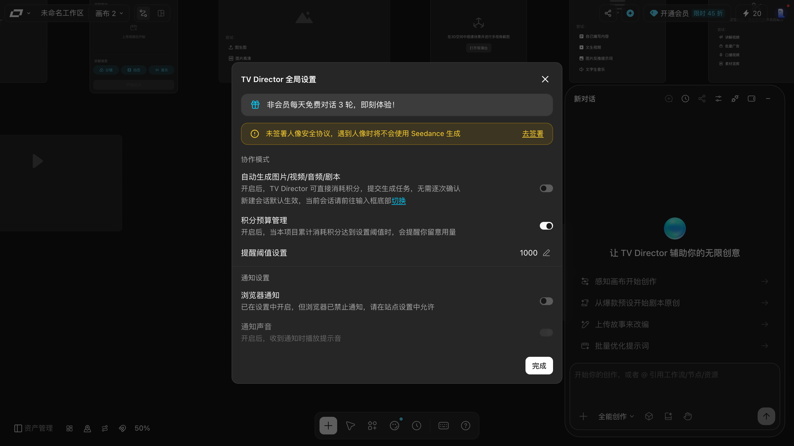
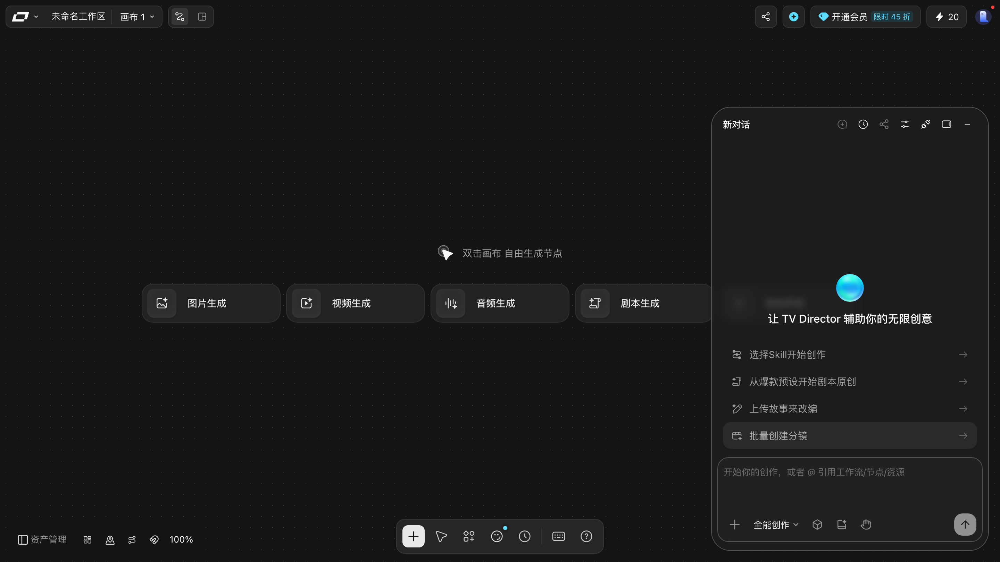
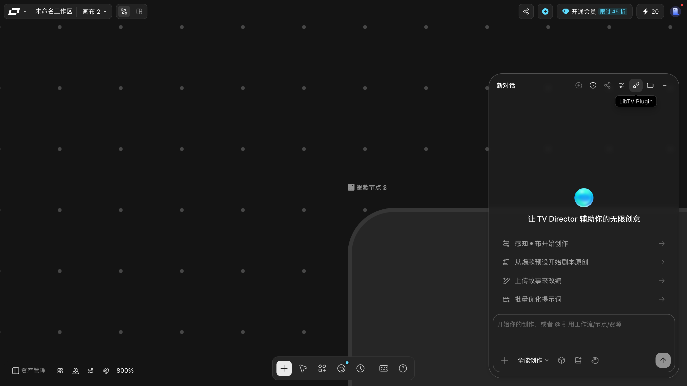
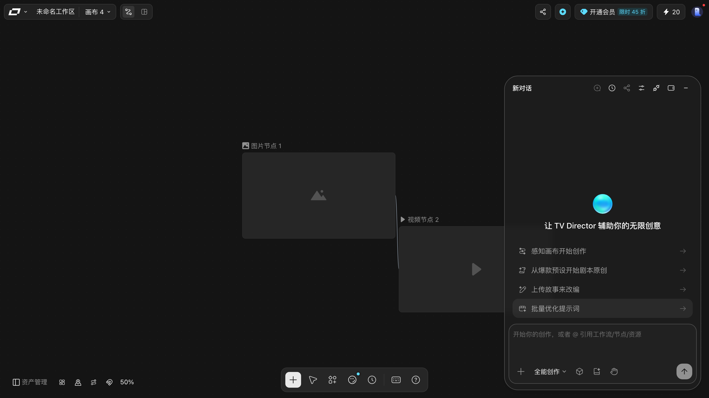

# TV Director：让 Agent 替你操作画布

> 目标：知道 TV Director 这个抽屉能做什么、怎么用，以及哪些部分本手册没有替你试。
> 适用角色：普通创作者 · 验证状态：✅ 抽屉结构实跑；⚠️ **一次任务都没提交过**

## ⚠️ 先说清楚

TV Director 会**真的动你的画布**（建节点、改配置），并且可能触发生成 —— 也就是可能扣积分。

> 本手册只把抽屉打开、把每个控件读出来，**没有向它发过任何一条指令**，
> **也没有改过全局设置里的任何一个开关**。

---

## ⚠️ 先看这个：有个开关会让它「不再逐次确认」

打开 **TV Director 全局设置**（抽屉头部的齿轮图标）能看到一个叫「**协作模式**」的分区，
里面第一项是：

> **自动生成图片/视频/音频/剧本**
> 开启后，TV Director 可直接消耗积分，提交生成任务，无需逐次确认

**这一行是本手册最该让你看见的东西。** 开着它，Agent 想生成就直接生成了，**不会再问你要不要**。

本手册测这个账户时它是**关**的。如果你经常用 TV Director，建议：

- 怕扣积分 → 保持**关**，每单都自己确认；
- 嫌麻烦、信任自己的提示词 → 可以开，但**先把下面那个提醒阈值调小**。

### 设置面板里有什么

| 区域 | 项 | 实测状态 | 说明 |
|---|---|---|---|
| 顶部提示 1 | `非会员每天免费对话 3 轮，即刻体验！` | — | 带一个礼盒图标 |
| 顶部提示 2 | `未签署人像安全协议，遇到人像时将不会使用 Seedance 生成` `去签署` | **未签署** | 黄色警示条，右侧「去签署」 |
| **协作模式** | `自动生成图片/视频/音频/剧本` | **关** | 见上 |
| | `积分预算管理` | **开** | — |
| | `提醒阈值设置` | `1000` | 带一支铅笔图标，可点开改 |
| **通知设置** | `浏览器通知` | 关 | 下方写「已在设置中开启，但浏览器已禁止通知，请在站点设置中允许」 |
| | `通知声音` | 关 | 「开启后，收到通知时播放提示音」 |
| 右下 | `完成` | — | 白色按钮 |

> ⚠️ **「浏览器通知」那一行的说明和开关对不上。**
> 开关显示**关**，说明文字却写「**已在设置中开启**」。两句话至少有一句不准 ——
> 本手册**没有点它去验证**（改了是账号级设置），但你按说明那句话去判断「通知开着」可能会被骗。
> 真要用通知，按 `已完成` 之前先切一次开关看状态变不变。

> 面板是**居中模态框**（`mantine-Modal-inner`，铺满视口），不是浮层 —— 打开时画布被压住。
> 右下角「完成」和右上角 `×` 都能关。**本手册一个开关都没动过**，所以没测过「改完要不要点完成」。

## 打开它

首次进入画布时，右侧会自动弹出 TV Director 抽屉：

之后可以用底栏最右那枚圆形按钮重新打开（无障碍名就叫「**TV Director**」）；抽屉头部的「关闭」可以收起。

> ### `LibTV Plugin` 那枚按钮点了等于没反应
>
> 抽屉头部第二排倒数第二枚（插件图标，无障碍名「**LibTV Plugin**」）
> 本手册**点过三次**（AS3 一次、AS 一次、AS4 一次）。每一次：
>
> - 按钮进入**高亮态**、弹出写着「LibTV Plugin」的**悬停提示**；
> - **没有打开任何面板**（新浮层差集为空、没有模态框、没有新页签、没有弹窗、地址栏不变、节点数不变）。
>
> 
>
> 跟资产管理里那枚「管理」是同一类（见 [asset-library.md](asset-library.md)）。
> 如果你指望从这里装插件，本手册没能验证这条路走得通。

## 抽屉结构 ✅

### 头部

| 控件 | 说明 |
|---|---|
| 标题 | `新对话` |
| `+`（当前已是新对话） | 新建对话。**已经是新对话时是灰的** |
| 时钟（历史对话） | 翻以前的对话 |
| 分享（当前是灰的） | 新对话无法分享 |
| 设置 | TV Director 全局设置 |
| 插件 | LibTV Plugin |
| 面板图标 | 停靠到右侧 |
| `—` | 关闭抽屉 |

> 那几个灰掉的按钮**不是坏了**，是新对话状态的正常表现。

### 四张技能卡 ✅

进入时的四张卡是：

- `选择Skill开始创作`
- `从爆款预设开始剧本原创`
- `上传故事来改编`
- `批量创建分镜`

> ### ⚠️ 文案会轮换
> 同一账户在不同时刻，这四张卡分别出现过：
>
> | 第一次 | 第二次 |
> |---|---|
> | 选择Skill开始创作 | **感知画布开始创作** |
> | 从爆款预设开始剧本原创 | 从爆款预设开始剧本原创 |
> | 上传故事来改编 | 上传故事来改编 |
> | 批量创建分镜 | **批量优化提示词** |
>
> 所以**不要把卡片文案当成固定清单记下来**。它们是轮换的引导入口，卡片下面那句话才是稳定的（`让 TV Director 辅助你的无限创意`）。

### 输入区（composer）

| 控件 | `aria-label` | 说明 |
|---|---|---|
| `+` | `添加附件` | 挂附件 |
| `全能创作` | `选择创作模式` | 下拉选模式，**不是固定的** —— 点开是 Skill 面板，见下 |
| 立方体图标 | `选择模型` | 选模型 |
| 文件夹图标 | `Skill` | 挂载技能 |
| 手掌图标 | `手动生成` | |
| 上箭头 | `Send` | 发送 |

提示文案：`开始你的创作，或者 @ 引用工作流/节点/资源`

> **发送按钮的两种状态实测过：**
> - 输入框**完全空**（没字也没附件）→ `Send` 是**灰的**，点不动。
> - **只挂了附件、没打字** → `Send` **已经是可点态**（`disabled=false`）。
>
> 也就是说挂上节点之后手就能发出去，别在「我已经挂好了」的当下顺手点一下。

### 「全能创作」是 Skill 选择器，不是固定模式

`全能创作` 这个按钮的 `title` 是「选择创作模式」，点开后弹出 450×400 的面板：

- 顶栏：`+ 创建 ▾`、`全部`
- 标签页：`通用`（默认） / `收藏` / `我的`
- 右上角：`搜索 Skill`
- 卡片列表，每张卡是「标题 + `/命令名` + 一行说明」：

| Skill | `/` 命令 | 说明 |
|---|---|---|
| 皮克斯动画广告 | `/pixar-animated-ad-creator` | 从角色立绘、分镜草图到最终合成带广告歌的完整成片 |
| 爆款拉片复刻 | `/viral-video-replicator` | AI 拆解爆款视频，一键复刻同款 |
| 新中式美学TVC | `/neo-chinese-aesthetic-tvc` | 新中式美学全案：从妆造、布景到广告成片，一站式惊艳视觉 |
| 古典武侠电影全流程导演 | `/huijinquanwuxia` | 把模糊的武侠主题和灵感转化为视频生产方案 |
| 游戏实机PV | `/gameplay-pv-builder` | 自制多类游戏 PV，UI 像素锚定不形变，打造 3A 级游戏效果 |

> **只打开过、只读过列表，一条都没选、没建。**
> 「创建」和选 Skill 都会改这个对话的默认行为或写账户数据。

### 也可以从资产管理把节点直接送进来

资产管理抽屉每行的 `⋯` 菜单里有 `添加到Agent` —— 点它等于「开一张新对话 +
把节点挂成附件」，**不会自动发送**。实测细节见
[organize-canvas.md](organize-canvas.md#更多操作菜单里的四项)。

---

## 怎么用（📖 流程按界面推断）

1. 点一张技能卡，或者直接在输入框里用自然语言描述你要什么；
2. 用 `+` 挂素材，用 `@` 引用已有的工作流 / 节点 / 资源；
3. 需要的话切创作模式、选模型、挂 Skill；
4. 点发送。

> 从这一步开始会真的改画布、并可能产生费用。**本手册没有跑过这条路径**，所以不写「它会先问你什么」「它做完会告诉你什么」这类没有证据的话。

---

## 浏览器通知

抽屉里有一条「开启浏览器通知，及时获取最新消息」的提示条，右边 `开启`，旁边有 `×` 关掉。

Agent 任务跑完可以推送通知。不想被打扰就直接关掉，不影响功能。

---

## 📖 没有验证的部分

- 发一条指令后，Agent 具体做了什么、改了哪些节点；
- 它会不会先请求确认再动手；
- 任务跑完给不给撤回入口；
- 「手动生成」和直接发送的区别；
- **全局设置里任何一个开关打开后会怎样**（本手册一个都没动过）——
  包括「协作模式 → 自动生成」到底能不能免掉确认；
- 「浏览器通知」那一行的说明文字和开关为什么对不上；
- `LibTV Plugin` 是不是要在别的入口才有意义（本轮三次点击都只出悬停提示）。

---

## 相关

- [generate-media.md](generate-media.md) —— 自己手动生成长什么样
- [create-nodes.md](create-nodes.md) —— Agent 建出来的节点长什么样
- [share-canvas.md](share-canvas.md) —— 对话分享按钮在灰态的原因
