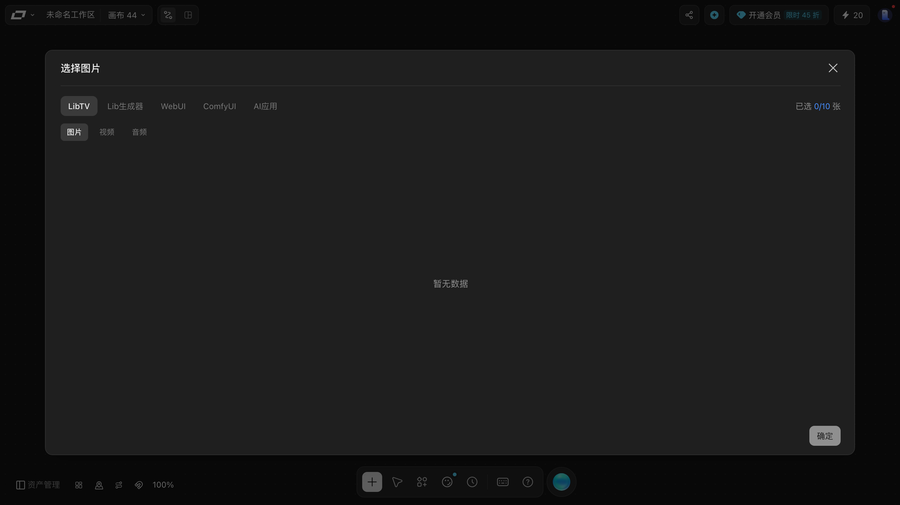

# 素材库：风格、特效与上传

> 目标：把统一的风格/特效沉淀成可复用的素材，并在节点里引用。
> 适用角色：普通创作者 · 验证状态：✅ 面板实跑（上传未执行）

---

## 两个入口，同一个面板

「素材库」在两处能打开，文案一致：

| 入口 | 位置 |
|---|---|
| 底部工具条 | 底部中央那枚图标 |
| 添加节点面板 | `素材库 ›` 子菜单 |

## 两个库 ✅

| 库 | 作用 | 面板上的按钮 |
|---|---|---|
| **风格库** | 复用的画面风格 | `新增风格节点 NEW` |
| **特效库** | 复用的特效 | `新增特效节点 NEW` |
| **打开工具箱** | 进入更完整的素材管理 | |

「新增风格节点」和「新增特效节点」会在**当前画布上建一个节点**，把这份风格/特效固化下来，然后就能像普通节点一样连线复用。

## 工具箱：20 多个镜头运动预设

素材库面板第三行「**打开工具箱**」进去，是一个叫「**我的工具箱**」的弹层。

里面装的是**镜头运动预设**，每张卡片右上角有一个 `使用` 按钮。本轮读到的 20 个：

| | | |
|---|---|---|
| 【预设】左弧滑行 | 【预设】右弧滑行 | 【预设】360旋转展示 |
| 【预设】瞳孔拉近 | 【预设】飞鸟解体 | 【预设】破盒而出 |
| 【预设】商品震撼登场 | 【预设】颠倒空间 | 【预设】反重力漂浮 |
| 【预设】粒子融解 | 【预设】机械臂视角 | 【预设】英雄视角 |
| 【预设】咖啡杯出场 | 【预设】电商手机弹出效果 | 【预设】Live 2D |
| 【预设】旅拍转场 zoom in | 【预设】旅拍转场 zoom out | 【预设】旅拍转场 向右旋转 |
| 【预设】旅拍转场 向左旋转 | 【预设】旅拍转场 生长 | |

从名字能直接看出分三类：**镜头轨迹**（左弧滑行 / 右弧滑行 / 360旋转展示 / 瞳孔拉近）、
**物体出场**（咖啡杯出场 / 破盒而出 / 商品震撼登场 / 电商手机弹出效果）、
**转场与视角**（旅拍转场系列 / 英雄视角 / 机械臂视角 / Live 2D）。

弹层右上角有 `?` 帮助和 `×` 关闭。

> ⚠️ 本轮只**读了列表**，没有点任何一张卡片的 `使用` —— 它会把预设写进画布。
> 「用完之后落在哪、能不能改」本手册没验证 📖。

## 把组存进工具箱

组操作条上还有一个「**添加到工具箱**」入口，方向和「打开工具箱」相反：
「打开工具箱」是**取用**平台预置的镜头运动预设，「添加到工具箱」是**存放**你自己做的组/节点，以后复用。

点它弹出的是一个**双标签**弹窗：

| 标签页 | 内容 |
|---|---|
| **创建新工具箱** | 封面（大图占位 + `更换封面` 按钮）、名称、标签（`0/5` + `添加标签`）、备注、右下角 `创建` |
| **更新工具箱** | 列出已建工具箱的卡片（封面缩略图 + 名称），右下角 `确认` |

各字段的实测细节：

- **名称**输入框的占位符是 `输入工具箱名称`，**默认值就是「工具箱」** —— 不改直接点创建会得到一个叫「工具箱」的箱子。
- **标签**上限 5 个，计数显示为 `0/5`。点 `添加标签` 本手册**没有观察到任何输入界面出现**，只多了两处 `标签` 文字 📖。
- **备注**是多行文本框，占位符「请描述您的工具箱，例如应用场景、使用步骤及使用技巧」。

填好名称、点 `创建` 之前的现场：

### ⚠️ 创建成功没有任何提示

填好名称点 `创建` 之后，**弹窗直接关闭，不弹 toast，页面上也看不到刚建的工具箱**。
第一反应一定是「没保存成功」。实际上**它是存上了** —— 验收方法：再点一次「添加到工具箱」，
切到「更新工具箱」页，已建的工具箱会列在那里。

下图是本手册连续两轮各建一个同名工具箱之后的样子，「更新工具箱」页里赫然是**两个一模一样的「手册取证测试箱」**：

在还没有任何工具箱时，这一页是空状态：

> 建议：建完工具箱**顺手切到「更新工具箱」页看一眼**，这是目前唯一能确认「真的存上了」的办法。

### 按钮文案会从「添加」变成「更新」

这是最容易错过的一个信号：**同一个组存进工具箱之后，操作条上那一项的文案就从
「添加到工具箱」变成了「更新工具箱」**。

它同时也解释了为什么创建之后「什么都没发生」—— 不是没发生，是**画面上没有给你任何地方去看见它**，
唯一的变化就是这个按钮换了名字。

> ⚠️ **这轮真的建了工具箱**（在一次性测试账号里建了两个）。工具箱是账号级数据、不随画布删除，
> 你自己的正式账号上不会有本手册的测试残留。

---

## 添加资源

添加节点面板底部还有一个独立的「**添加资源**」分区：

| 入口 | 用途 |
|---|---|
| `上传` | 从本地传文件进画布 |
| `从生成历史选择` | 复用以前生成过的东西 |

「从生成历史选择」点开是一整块**选择弹窗**（不是一个小列表）：

| 位置 | 实测内容 |
|---|---|
| 标题 | `选择图片`（选视频/音频时会跟着变） |
| **来源标签** | `LibTV` · `Lib生成器` · `WebUI` · `ComfyUI` · `AI应用` |
| 计数 | `已选 0/10 张` —— **一次最多选 10 个** |
| 分类 | `图片` / `视频` / `音频` |
| 主体 | 没生成过东西时是 `暂无数据` |
| 底部 | `确定` |

> ⚠️ 这里有个**手册之前没说、但很重要**的点：来源不止 LibTV 自己，
> **`WebUI` / `ComfyUI` / `AI应用` 说明你可以从外部工具把素材接进来**。
> 本手册只读了标签文案，**没点过任何一个来源** —— 各自怎么接、需不需要配 API Key，都不知道 📖。
>
> 另一个实用推论：计数上限是 **10 张/次**，所以「一次把几十个素材搬进画布」这条路走不通，得分批。

> 📖 历史记录里到底有哪些东西、怎么筛选，本轮仍未展开验证（测试账号从没真正跑过生成），
> 见 [../20-reference.md](../20-reference.md) 的「资产页」。

---

## 在节点里怎么用

素材进入画布之后，用两种方式喂给节点：

1. **连线** —— 把素材节点的出口连到目标节点的入口，见 [connect-nodes.md](connect-nodes.md)；
2. **参考** —— 点节点顶部的 `参考` 按钮手动挑。

风格还有第三条路：图片和视频节点顶部各有一个 `风格` 按钮。

---

## 📖 没有验证的部分

- `上传` 支持的文件格式与体积上限；
- `打开工具箱` 里有什么；
- 风格节点 / 特效节点具体长什么样（没有真的建过）。

> ⚠️ 关于格式限制：本手册**不编**。请以 `上传` 打开后的界面提示为准。

---

## 相关

- [character-studio.md](character-studio.md) —— 角色是另一套独立的库
- [connect-nodes.md](connect-nodes.md) —— 怎么把素材接到节点上
