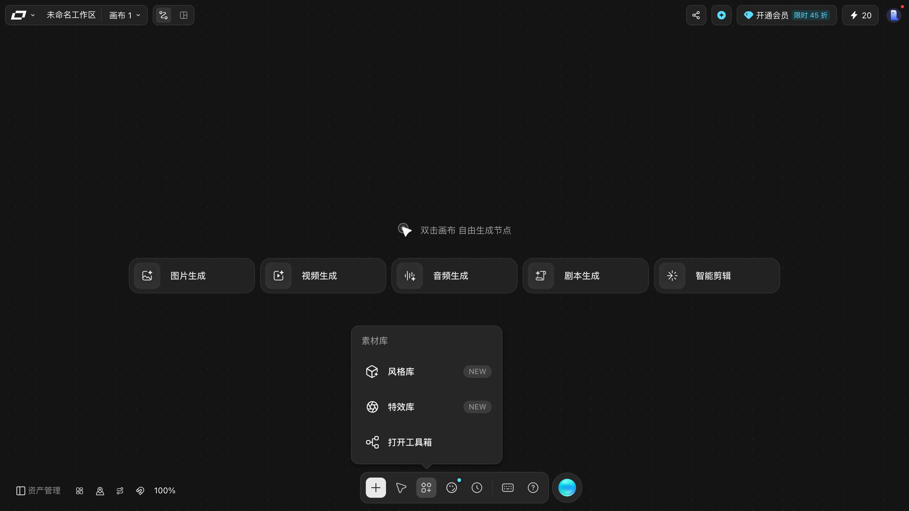

# 素材库：风格、特效与上传

> 目标：把统一的风格/特效沉淀成可复用的素材，并在节点里引用。
> 适用角色：普通创作者 · 验证状态：✅ 面板实跑（上传未执行）

---

## 两个入口，同一个面板

「素材库」在两处能打开，文案一致：

| 入口 | 位置 |
|---|---|
| 底部工具条 | 底部中央那枚图标 |
| 添加节点面板 | `素材库 ›` 子菜单 |

## 两个库 ✅

| 库 | 作用 | 面板上的按钮 |
|---|---|---|
| **风格库** | 复用的画面风格 | `新增风格节点 NEW` |
| **特效库** | 复用的特效 | `新增特效节点 NEW` |
| **打开工具箱** | 进入更完整的素材管理 | |

「新增风格节点」和「新增特效节点」会在**当前画布上建一个节点**，把这份风格/特效固化下来，然后就能像普通节点一样连线复用。

## 添加资源

添加节点面板底部还有一个独立的「**添加资源**」分区：

| 入口 | 用途 |
|---|---|
| `上传` | 从本地传文件进画布 |
| `从生成历史选择` | 复用以前生成过的东西 |

> 「从生成历史选择」意味着**生成过的东西会留在历史里可以复用**，不必重新生成。这一点对控制积分花费很有用。
>
> 📖 历史记录的实际位置与筛选方式本轮未展开验证，见 [../20-reference.md](../20-reference.md) 的「资产页」。

---

## 在节点里怎么用

素材进入画布之后，用两种方式喂给节点：

1. **连线** —— 把素材节点的出口连到目标节点的入口，见 [connect-nodes.md](connect-nodes.md)；
2. **参考** —— 点节点顶部的 `参考` 按钮手动挑。

风格还有第三条路：图片和视频节点顶部各有一个 `风格` 按钮。

---

## 📖 没有验证的部分

- `上传` 支持的文件格式与体积上限；
- `打开工具箱` 里有什么；
- 风格节点 / 特效节点具体长什么样（没有真的建过）。

> ⚠️ 关于格式限制：本手册**不编**。请以 `上传` 打开后的界面提示为准。

---

## 相关

- [character-studio.md](character-studio.md) —— 角色是另一套独立的库
- [connect-nodes.md](connect-nodes.md) —— 怎么把素材接到节点上
