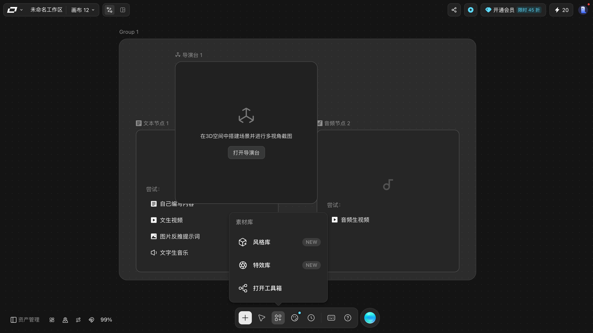
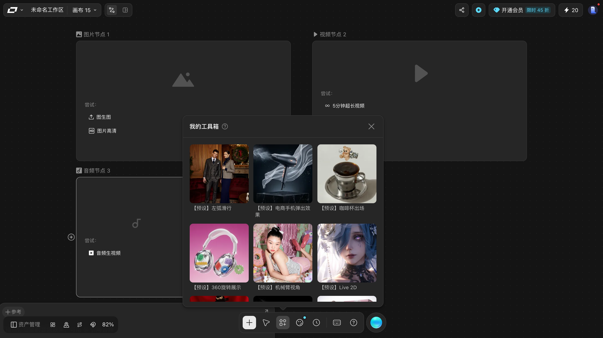

# 素材库：风格、特效与上传

> 目标：把统一的风格/特效沉淀成可复用的素材，并在节点里引用。
> 适用角色：普通创作者 · 验证状态：✅ 面板实跑（上传未执行）

---

## 两个入口，同一个面板

「素材库」在两处能打开，文案一致：

| 入口 | 位置 |
|---|---|
| 底部工具条 | 底部中央那枚图标 |
| 添加节点面板 | `素材库 ›` 子菜单 |

## 两个库 ✅

| 库 | 作用 | 面板上的按钮 |
|---|---|---|
| **风格库** | 复用的画面风格 | `新增风格节点 NEW` |
| **特效库** | 复用的特效 | `新增特效节点 NEW` |
| **打开工具箱** | 进入更完整的素材管理 | |

「新增风格节点」和「新增特效节点」会在**当前画布上建一个节点**，把这份风格/特效固化下来，然后就能像普通节点一样连线复用。

## 工具箱：20 多个镜头运动预设

素材库面板第三行「**打开工具箱**」进去，是一个叫「**我的工具箱**」的弹层。

里面装的是**镜头运动预设**，每张卡片右上角有一个 `使用` 按钮。本轮读到的 20 个：

| | | |
|---|---|---|
| 【预设】左弧滑行 | 【预设】右弧滑行 | 【预设】360旋转展示 |
| 【预设】瞳孔拉近 | 【预设】飞鸟解体 | 【预设】破盒而出 |
| 【预设】商品震撼登场 | 【预设】颠倒空间 | 【预设】反重力漂浮 |
| 【预设】粒子融解 | 【预设】机械臂视角 | 【预设】英雄视角 |
| 【预设】咖啡杯出场 | 【预设】电商手机弹出效果 | 【预设】Live 2D |
| 【预设】旅拍转场 zoom in | 【预设】旅拍转场 zoom out | 【预设】旅拍转场 向右旋转 |
| 【预设】旅拍转场 向左旋转 | 【预设】旅拍转场 生长 | |

从名字能直接看出分三类：**镜头轨迹**（左弧滑行 / 右弧滑行 / 360旋转展示 / 瞳孔拉近）、
**物体出场**（咖啡杯出场 / 破盒而出 / 商品震撼登场 / 电商手机弹出效果）、
**转场与视角**（旅拍转场系列 / 英雄视角 / 机械臂视角 / Live 2D）。

弹层右上角有 `?` 帮助和 `×` 关闭。

> ⚠️ 本轮只**读了列表**，没有点任何一张卡片的 `使用` —— 它会把预设写进画布。
> 「用完之后落在哪、能不能改」本手册没验证 📖。

> 组操作条上还有一个「**添加到工具箱**」入口，方向相反：把**你自己**的组/节点存进工具箱复用。
> 本轮点它**没有任何弹出内容**，也没观察到工具箱条目变化 ⚠️。

---

## 添加资源

添加节点面板底部还有一个独立的「**添加资源**」分区：

| 入口 | 用途 |
|---|---|
| `上传` | 从本地传文件进画布 |
| `从生成历史选择` | 复用以前生成过的东西 |

> 「从生成历史选择」意味着**生成过的东西会留在历史里可以复用**，不必重新生成。这一点对控制积分花费很有用。
>
> 📖 历史记录的实际位置与筛选方式本轮未展开验证，见 [../20-reference.md](../20-reference.md) 的「资产页」。

---

## 在节点里怎么用

素材进入画布之后，用两种方式喂给节点：

1. **连线** —— 把素材节点的出口连到目标节点的入口，见 [connect-nodes.md](connect-nodes.md)；
2. **参考** —— 点节点顶部的 `参考` 按钮手动挑。

风格还有第三条路：图片和视频节点顶部各有一个 `风格` 按钮。

---

## 📖 没有验证的部分

- `上传` 支持的文件格式与体积上限；
- `打开工具箱` 里有什么；
- 风格节点 / 特效节点具体长什么样（没有真的建过）。

> ⚠️ 关于格式限制：本手册**不编**。请以 `上传` 打开后的界面提示为准。

---

## 相关

- [character-studio.md](character-studio.md) —— 角色是另一套独立的库
- [connect-nodes.md](connect-nodes.md) —— 怎么把素材接到节点上
