# 素材库：风格、特效与上传

> 目标：把统一的风格/特效沉淀成可复用的素材，并在节点里引用。
> 适用角色：普通创作者 · 验证状态：✅ 面板实跑（上传未执行）

---

## 两个入口，同一个面板

「素材库」在两处能打开，面板内容一致：

| 入口 | 位置 | 无障碍名 |
|---|---|---|
| **底部工具条** | 底栏中央的一枚独立按钮 | `素材库` |
| 添加节点面板 | `素材库 ›` 那一行 | — |

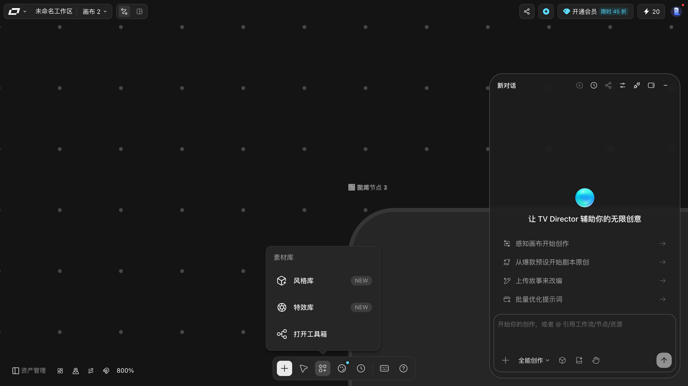

> 💡 **走底栏那枚按钮更近** —— 它不是「+」里的子菜单，是独立的一枚。
> 添加节点面板里那一行右边也有 `›`，展开是同样三项。

面板里是三项，**其中两个是「广场」，不是普通列表**：

| 项 | 点进去是什么 |
|---|---|
| **风格库** `新增风格节点 NEW` | 风格广场 —— 一个**分类浏览的市场** |
| **特效库** `新增特效节点 NEW` | 特效广场 —— 同样结构 |
| **打开工具箱** | 镜头运动预设（见下） |

---

## 风格广场：十个分类 + 商用筛选

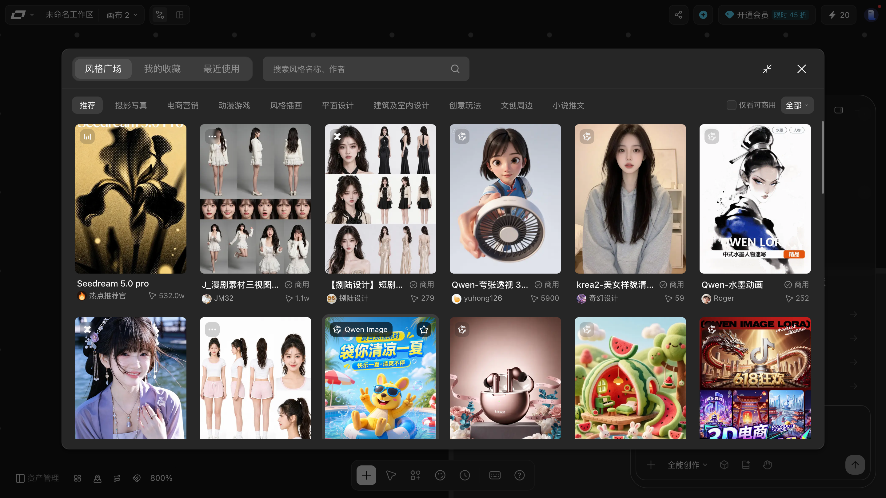

| 区域 | 内容 |
|---|---|
| 顶部三个标签 | `风格广场`（当前） · `我的收藏` · `最近使用` |
| 搜索 | 占位符 `搜索风格名称、作者` |
| **分类标签（10 个）** | `推荐` · `摄影写真` · `电商营销` · `动漫游戏` · `风格插画` · `平面设计` · `建筑及室内设计` · `创意玩法` · `文创周边` · `小说推文` |
| 筛选 | `仅看可商用` 勾选框 |
| 排序 | `全部 ▾` |

### 顶部三个页签，和那个「仅看可商用」勾选框

**三个页签的结构不一样**，这点很容易踩空：

| 页签 | 分类标签行 | `仅看可商用` | 排序下拉 | 空的时候写 |
|---|---|---|---|---|
| `风格广场` | ✅ 十个都在 | ✅ 在 | ✅ `全部 ▾` | — |
| `我的收藏` | ⛔ **整排消失** | ⛔ **消失** | ✅ 还在 | **`暂无素材`** |
| `最近使用` | ⛔ **整排消失** | ⛔ **消失** | ✅ 还在 | **`暂无素材`** |

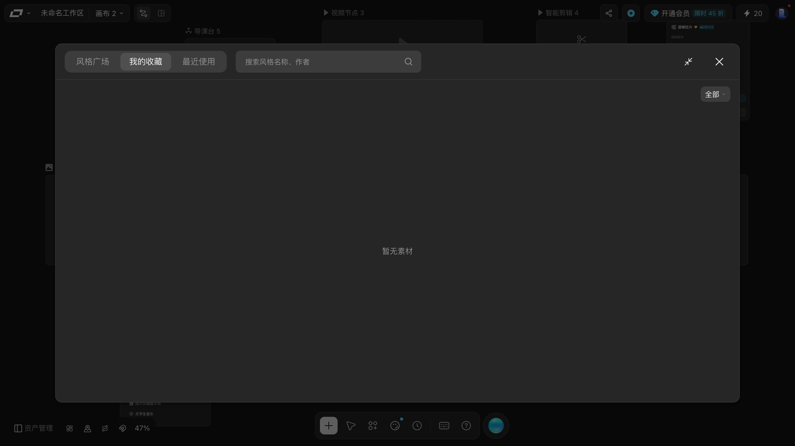

> 💡 **怎么用这个区别**：在「我的收藏」里**没法按分类或授权筛**，
> 收藏的量不多时直接翻就行；多的时候还是回 `风格广场` 找。
>
> ⚠️ 注意那行字是「**暂无素材**，不是**暂无收藏**」 —— 收藏页和素材页共用这一句空态。
> （本手册的测试账户**没在广场里收藏过任何东西**，所以两页都是空的 📖。
> 收藏会写账户数据，本手册一直没去做。）

**关于「仅看可商用」勾选框：**

> ✅ **它确实会筛**：勾上之后广场会重新按「只保留可商用的卡」拉数据
> （请求参数从无到多出一个许可筛选项，关闭时该参数**不出现**、打开时出现，两轮独立测过）。
>
> ⭐⭐ **它到底筛掉多少张，本手册现在有准确数字了**（以 `风格插画` 分类为例）：
>
> | | 张数 | 页数 |
> |---|---|---|
> | 不勾 | **738** | 19 页（每页 40，末页 18） |
> | 勾上 | **681** | 18 页（每页 40，末页 1） |
> | ⇒ 被筛掉 | **96** | 保留率 **92.3%** |
>
> ⭐ 这两个数都过了**双重自检**：738 与另一个批次独立测出的数字完全吻合；
> 681 的「逐页求和」和「按卡片 ID 去重」也是同一个数（都是 681）。
>
> 💡 **所以：字体、书法、知名 IP 风格那类确实会被筛掉，
> 摄影 / 电商 / 建筑 / 创意这类素材基本不受影响。**
> 📖 但**保留率是这一类风格的数**，别的分类没逐个测过，别照搬。
>
> ⚠️ 想知道**你这个分类**会少看到多少张，最省事的办法是：
> 勾上之后**滚到底看那句 `没有更多了`**，那是准的。


⭐ **各分类首屏的「商用」徽标比例**（每类看首屏 30 张）：

| 全都带「商用」徽标 | 首屏带「商用」的张数 |
|---|---|
| `摄影写真` `电商营销` `建筑及室内设计` `创意玩法` | **30 / 30** |
| `平面设计` `文创周边` `小说推文` | 29 / 30 |
| `动漫游戏` `风格插画` | 28 / 30 |
| `推荐` | **25 / 30**（最低） |

> 💡 **实用结论**：素材类（摄影/电商/建筑/创意）**基本可以不管这个勾选框**，
> 首屏清一色都是可商用的。要筛的是**字体、书法、以及知名 IP 风格**那类
> （实测被筛掉的卡里密集出现「草书字体设计」「清新文艺手写体」「宫崎骏漫画风」这类）📖 ——
> ⚠️ 这是**从被筛掉的卡的题材归纳出来的**，**不是规则**；平台没有公开判定标准。

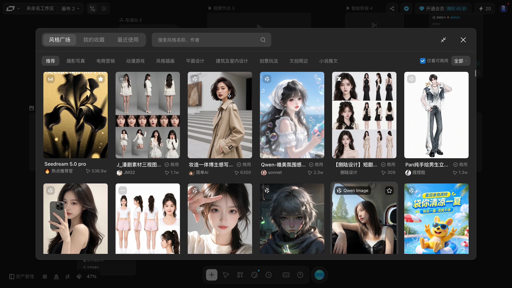

> ⭐ **顺手记一个新卡型**：左起第一张那种**金色标题压在图上、作者位写着
> `🔥 热点推荐官`**（不是人名）的卡，是**另一种排版**。
> 本手册的截图图注里早就有它，但正文一直没写 —— 这轮补上。
> ⚠️ 它**没有「商用」徽标**，所以在勾选了「仅看可商用」的列表里**也会出现** ——
> ⇒ **卡面上没有「商用」徽标，不等于这张卡不能用商用** 📖。

### ⭐ 一张风格卡由什么组成


| 位置 | 是什么 | 实测 |
|---|---|---|
| 预览图**左上角** | **两种东西**，取决于这张卡能用几个模型 ⭐ **徽标**：一枚 `24×24` 的 `<button>`，里面是 `📊` 柱状图图标 + 模型名。⭐ **它不是风格名**，实测悬停读出的模型名有 `Seedream 5.0` / `Seedream 4.5`（往下滚才出现）/ `Qwen Image` / `Z Image` / `Lib Image` **五种**，**气泡逐字就是徽标里的模型名**。⛔ **不是每张卡都有徽标** —— 首屏 30 张里 **25 张是徽标、5 张是 `✧` 入口** | 徽标常驻（`opacity: 1`）。⭐ **模型徽标点了什么也不发生**：落点已用 `elementFromPoint` 验过**确实落在徽标自己身上**（`cursor: pointer`），点完 6 次采样 —— 节点数不变、积分 `20 → 20`、广场还开着、详情浮层没开。⭐ `✧` 入口则是**悬停就出面板、点它什么也不发生**，见下 |
| 预览图**右上角** | ☆ **收藏**（`24×24`） | ⭐⭐ **`aria-label` 有两态**：没收藏时写 `收藏`，收藏后写 **`取消收藏`**。⭐ **悬停才显形**：`opacity` 从 `0` 变 `1`，位置不动 |
| 预览图**右下角** | ⤢ **详情**（`<button aria-label="详情">`，`24×24`，图标是两支对角箭头） | ⭐ **同样悬停才显形**（`0 → 1`）。⚠️ **只有风格广场有这一枚，特效广场一枚都没有**。⭐⭐⭐ **每张卡都有一枚** —— 滚动过程中三次采样，详情按钮数和收藏星数**始终相等**（`30/30` → `54/54` → `54/54`） |
| 预览图**下方** | 风格**名称** + `商用` 徽标 | `商用` 徽标**不是每张都有** |
| 名称下一行 | 作者头像 + 作者名 + **漏斗图标** + 数字 | 见下 |


⭐ **悬停显形是精确读到的**：同一张卡，悬停前后各读一次那两枚按钮的 `opacity`，
两次都是 `0 → 1`，而**矩形位置完全没动**（`[271,210,24,24]` / `[271,413,24,24]`）。

#### ⭐ 那枚 `✧`（本手册早期写作 `•••`）：点它不弹任何菜单

> ⚠️ **Batch DD 更正归属**：本节此前判成「**风格广场没有、只有特效广场有**」—— **错**。
> 它在**风格广场也有**（首屏 5 枚），而且 ⭐ **两个广场是同一枚按钮**：
> SVG `d` 属性**完整 96 字符逐字相同**。`✧` 和 `•••` 是同一个图标的两种叫法。
> 「悬停没有 tooltip」这个观察**没错**（面板确实不是 tooltip），
> 但「什么都没发生」这句话**是错的** —— 面板是有的，只是当时按 `role="tooltip"` 找不到它。
> 详见「两个广场左上角那一枚是同一枚按钮」一节。
>
> 根因在下面这张判据表里的第三条 —— 它顺带把风格广场那 5 枚也匹配进来了，
> 但当时只报了特效广场那 12 枚。

这个按钮**抓了三次**才抓到 —— 值得记一下过程，因为它是个典型的「判据错了」：

| 判据 | 结果 |
|---|---|
| 按**文字**找（`⋯` / `...` / `…`） | 0 命中（它**根本没有文字**） |
| 按 `circle` **元素**数 ≥ 2 找 | 0 命中（⭐ 三个点**不是三个 `<circle>` 元素**，是同一个 `<path>` 里的三段圆弧） |
| 按 `d` 里的**圆弧段**数 ≥ 3 找 | ✅ 命中 —— ⚠️⚠️ **但这个判据同时命中了风格广场那 5 枚 `✧`**，此前只报了特效广场那 12 枚 |

**点它的结果：什么也没发生。** 判据两条 ——
面板内可见文字块数**点前 174 → 点后 174**（风格那边 124 → 123，反而少一个），
而且点击后的画面上**没有任何新出现的浮层**：


> ⚠️ 本轮有一处**差点被骗**：点前点后同一块像素的体积从 `147KB` 涨到 `579KB`，
> 看着像弹出了一张大图。**其实不是** —— 那是**图片懒加载完成**（点前截到还没加载的点阵图，
> 点后截到加载好的真图），前后**构图一模一样**。
> ⭐ **体积变化不等于出现了新东西**。

> 💡 **已收藏的卡上不出现 ☆。** 在「我的收藏」页里，卡片**没有收藏按钮** ——
> 没地方可再收藏了。所以「我的收藏」页看起来和「风格广场」页不一样，是正常的。

### ⭐ 点 ⤢「详情」会打开什么


点卡上那枚 ⤢ **不会**建节点，它开的是**一个详情浮层**，逐字读出来是：

```
风格详情 │ <风格名> │ <作者> │ 首选推荐模型 │ <模型名> │ [★ 取消收藏] [使用]
```

| 元素 | 说明 | 实测 |
|---|---|---|
| **首选推荐模型** | ⭐ 每张风格都有一个**推荐模型**字段（`General image V2` / `Seedream 5.0` …），它就是卡面左上角那枚徽标的来源 | ✅ 读到 |
| **`★ 取消收藏`** | 收藏态下按钮写的是「**取消收藏**」而不是「**收藏**」—— 说明打开那一刻这张已经是收藏态 | ✅ 读到；点它弹「**取消收藏成功**」，本轮据此把收藏清回 0 张并**独立复核**过 |
| **`使用`** | ⭐ 「把风格用进画布」的入口 | ⭐ **点它 = 画布上加一个节点**，和「点卡片本体」**同一个后果**（见下）。**不扣积分**（实测 `20 → 20`） |
| 右上角 `⤡` | ⭐⭐ **不是「缩到最小化」，是「关掉这一层、回到下面那层」** | 按钮无文字，但**有 `aria-label="缩小"`**（`24×24`）。⭐ 实点过：点完**详情浮层连同它的压暗层一起消失**，**下面那层风格广场原样留在屏幕上**。⭐ **没有任何「还原」入口** —— 想再看那张卡，重新点一次卡上的 ⤢ 就行。⚠️ 这个「缩小」是从图标猜的名字，**猜错了**，已更正 |

#### ⭐⭐ 详情浮层有两种卡型，**内容不一样**

上面那张图（`M-237`）是**普通卡**。本轮（Batch DR）又点开了一张
**热点推荐官卡**（`Seedream 5.0 pro`），两次逐字读出来的东西**对不上**：

| 浮层里的一行 | 普通卡 | ⭐ 热点推荐官卡 |
|---|---|---|
| 标题 | `风格详情` | `风格详情` |
| 大图 | ✅ | ✅ |
| 风格名 | ✅ | ✅ `Seedream 5.0 pro` |
| **作者** | ✅ 有（`JM32`） | ⛔ **没有这一行** —— 位置被 `🔥 热点推荐官` 占了 |
| 首选推荐模型 | ✅ | ✅ `Seedream 5.0` |
| `★ 取消收藏` + `使用` | ✅ | ✅ 两个都在 |

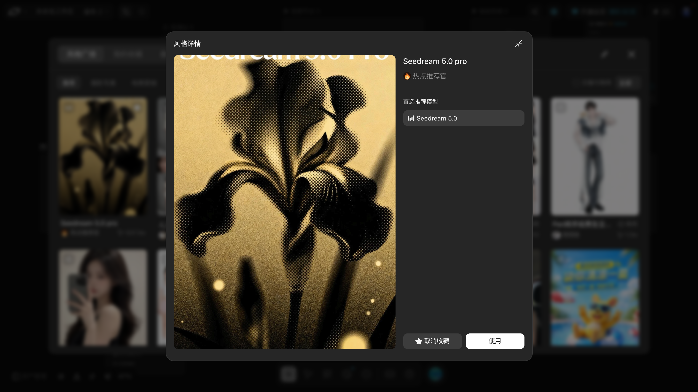

> 💡 **认浮层内容最快的办法**：先看卡面**有没有作者名**。
> 有 ⇒ 详情浮层里也有作者行；卡面写着 `🔥 热点推荐官` ⇒ **详情浮层里那一行是它，不是人名**。
>
> 📖 **「其余适配模型」这一栏本轮没见到**。源码里它的显示条件是
> `u.length > 0`（**这张卡适配的模型数大于 1 才出现**），
> 而本轮这张 `Seedream 5.0 pro` 是**单模型卡** ⇒ 那一栏不会出现。
> ⛔ **多模型卡的详情浮层长什么样，本手册还没实测** 📖 ——
> `M-237` 那张图里也没出现这一栏，不能拿它当证据。
>
> ⭐⭐ 「首选推荐模型」这一栏则是**源码与界面双向确认**的：源码里
> `preferredRecommendedModel` 确实带调用点，且两种卡型都渲染出来了。

> ⭐⭐ **它的图标和大编辑器右上角那枚「收拢箭头」是同一个**
> （path `M9.76 10.59c.28 0 .5.22.5.5v8a.4.4…`），
> 但**两处行为不一样**：大编辑器那枚点了直接回画布，详情浮层这枚点了回广场。

#### ⭐⭐⭐ 浮层不是一种样子，它跟着**这张卡适配几个模型**变

本轮又拍了一张 `赛璐璐光影`（`M-353`）。它和上面那张差别很大 ——
**因为它是「多模型卡」**。三张卡放一起看，规律一下就清楚了：

| 浮层里的一行 | `Seedream 5.0 pro`<br>（热点推荐官 · 单模型） | `赛璐璐光影`<br>（普通卡 · 6 模型） |
|---|---|---|
| 标题 | `风格详情` | `风格详情` |
| 卡名 | ✅ `Seedream 5.0 pro` | ✅ `赛璐璐光影` |
| **作者位** | ⛔ 没有 —— 写着 `🔥 热点推荐官` | ✅ `星空岁月` |
| ⭐ **`生成内容可商用`** | ⛔ **没有** | ✅ **有**（跟在卡名右边同一行） |
| `首选推荐模型` | ✅ `Seedream 5.0` | ✅ `General image V2` |
| ⭐ **`其余适配模型`** | ⛔ **没有这一栏** | ✅ **有 4 项**：`Seedream 5.0` / `Seedream 4.5` / `General image Pro` / `Lib Image` |
| 底部左按钮 | `★ 取消收藏` | `☆ 收藏` |
| 底部右按钮 | `使用` | `使用` |

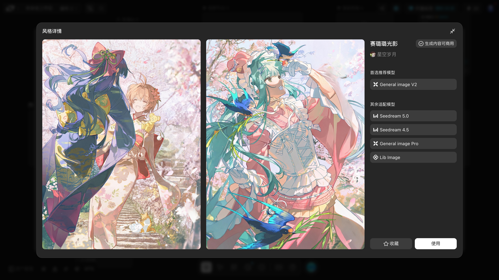

> ⭐⭐ **所以「有没有『其余适配模型』那一栏」不是设计随意，是跟着卡走的**：
> ⭐ **判据在这张卡的接口数据里** —— `baseType` 字段的**长度**就是它适配几个模型。
>
> | `baseType` 长度 | 浮层里长什么样 |
> |---|---|
> | 1 | 只有「首选推荐模型」，**没有**「其余适配模型」 |
> | ≥ 2 | 多一个「其余适配模型」分区 |
>
> 📖 实测 `风格插画` 首屏 121 张卡的分布：长度 1 的 **80 张**、长度 2 的 22 张、
> 长度 3 的 5 张、长度 4 的 1 张、长度 5 的 7 张、长度 6 的 6 张
> ⇒ **约三分之一的卡是多模型卡**，点开前猜不出来，**得点开才知道**。
>
> ⚠️ 一个小出入值得记下来：`赛璐璐光影` 的 `baseType` 有 **6** 个值，
> 浮层里却只列了 **5** 个模型（首选 1 + 其余 4）。
> ⇒ 有一个 `baseType` 在当前模型表里**没匹配上**，那一项就不显示。
> **所以「其余适配模型」里的条数可能比 `baseType` 少。**

> ⭐⭐ **`生成内容可商用` 这一行很值得记** —— 它是**这张风格能不能商用**的标记，
> 出现在卡名的右边。⭐ 本轮两张卡的对比正好验证了它：
> `赛璐璐光影` 有这行 ⇒ 可商用；`Seedream 5.0 pro` **没有**这行。
> ⚠️ 所以**卡面上没有「商用」徽标 ≠ 不能商用**，**浮层里那行才是准的**。
>
> ⭐ **底部左按钮会跟着收藏状态变**：
> 这张 `赛璐璐光影` 没收藏 ⇒ 写 `☆ 收藏`；上一张已收藏 ⇒ 写 `★ 取消收藏`。
> （本轮只读，**没有真的点过任何一个**，📖 点了之后会不会立刻变图标未实测。）

> ⭐ 浮层右栏的行距是固定的：两个分区标题之间差 **92px**，
> 每个模型项之间差 **40px**，底部两个按钮都是 `121×32`、底边对齐在同一条线上。
> ⛔ **这轮仍然没见到** `当前使用` 徽标和 `全部适配模型` 下拉 ——
> 后者**不是浮层里的东西**，它长在**卡面上**（悬停卡面才显形），别找错地方。

### ⭐⭐ 别把「仅看可商用」当成纯过滤 —— 它会换一批卡

前面那组数字（738 → 681、筛掉 96）容易让人以为
**「打开后的列表 = 关闭时的列表去掉 96 张」**。**不是。**

本轮把两边按卡片 ID 逐张对了一遍：

| 关系 | 张数 | 含义 |
|---|---|---|
| 只在**不勾**的列表里 | 96 | 确实被筛掉了 |
| **两边都有** | 642 | 保留 |
| ⭐ 只在**勾上后**的列表里 | **39** | ⚠️ **关到底都不在，勾上后才冒出来** |

> 642 + 39 = 681 ✅ 算式对得上，数据本身没坏。
>
> ⭐ **这 39 张不是数错了**：本手册用**两个完全独立的浏览器会话**各跑一遍，
> 两次的差值**一模一样**（同样 96 被筛掉、同样 39 张独有）。
>
> ⭐⭐ **所以后端在勾选之后不只是「过滤」，而是换了一套召回结果**
> ⇒ 📖 至于**为什么**会冒出 39 张 —— 是排序权重变了、还是给可商用的卡补了位置 ——
> **本手册没查到，不猜。**
>
> 💡 **对使用者的实际影响**：
> 「仅看可商用」**不是「在原列表里划掉一批」**，
> 所以**别用它来数「我一共收藏/关注了多少风格」** —— 勾上之后底下的数字会变。
>
> ⚠️ **风格广场 / 特效广场自己**的右上角也有两枚 `40×40` 按钮：
> 一枚 `aria-label="minimize"`、一枚 `aria-label="close"`。
> ⭐ **全站的 `aria-label` 都是中文，只有广场这一层是英文** ——
> 靠「aria 是什么语言」就能认出这是广场，不是详情浮层。

### ⭐ 广场右上角那枚 `minimize` 是**真·可还原的最小化**

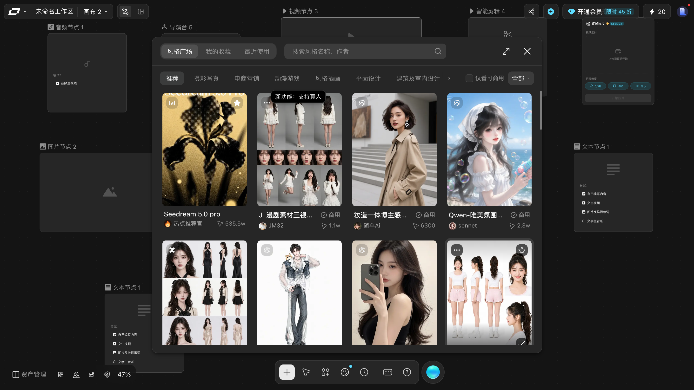

⭐⭐⭐ **它和详情浮层那枚 `⤡` 的行为完全不同** —— 同名的两枚，一个是真最小化，一个是关掉：

| | 广场的 `minimize` | 详情浮层的 `⤡`（`aria-label="缩小"`） |
|---|---|---|
| 尺寸 | `40×40` | `24×24` |
| 点下去 | ⭐ **缩成窗口**，内容还在 | ⭐ **关掉这一层**，回落到广场 |
| 能还原吗 | ✅ **能** —— 标题栏里出现 `aria-label="maximize"`，点了就铺满 | ⛔ **不能** |
| 容器 | 最小化后是 `fixed z-20 rounded-xl` 的 `[315,77,810×657]` | 一直是 `mantine-Modal-inner` `1440×810` |

实测往返一轮：点 `minimize`（`[1227,92,40,40]`）⇒ 窗口变成 `810×657`、
标题栏 `[316,90,808,34]` 里两枚 `28×28` 按钮（`maximize` / `close`）；
点 `maximize`（`[1036,93,28,28]`）⇒ `z=701` 恢复成 `1440×810` 铺满视口，
`minimize` 回来、`maximize` 消失。✅ **可往返。**

⭐⭐ 顺带两件小事：
- ⭐ **窗口变窄时卡片会重排** —— 从 6 列变成 4 列，分类标签末尾还多出一个 `›` 溢出箭头；
- ⭐⭐ **更正**：本手册此前把图里那枚 `114×27` 的标记读成了**写着「新功能：支持真人」的一行字**。
  **错。** 那是「全部适配模型」浮层**里面的文字**，而 `114×27` 是**浮层里一个条目**的尺寸，
  **不是卡面上的引导标记**。下面一节把真相写全。

### ⭐ 广场右上角那枚 `close` 点下去会怎样

**本轮结掉这个遗留**（和 `minimize` 同一排、`40×40`、`[1283,92,40,40]`）。

⭐ 实点读数，**点之前 → 点之后**逐项对照：

| 读数 | 点之前 | 点之后 |
|---|---|---|
| 广场容器（`.mantine-Modal-inner`） | 1 个 `[0,0,1440,810]` | ⭐ **0 个** |
| 可见 `详情` 按钮 | 1 | ⭐ **0** |
| 可见收藏星 | 2 | ⭐ **0** |
| `minimize` / `close` 按钮 | 各 1 | ⭐ **各 0** |
| 可见英文 `aria-label` | `search` / `minimize` / `close` | ⭐ **空** |
| **画布节点数** | `11` | ✅ **`11`（没变）** |
| **资产抽屉** | 不在 | ✅ 不在 |

⭐⭐ **结论：`close` 是「把整个广场关掉」，不是折叠、不是收进抽屉。**
而且它**不会把资产抽屉带出来** —— 点完直接落回画布本身。

> ✅ **不丢东西**：画布节点数 `11 → 11` 没动，广场本来也只是只读面板。
> ⛔ **没有还原入口**，但也不需要 —— 从侧栏的「资产」再进一次风格库就回来了。
> ⭐ 和详情浮层的 `⤡` 一比：**两枚都叫「缩小 / 关」，都是关掉一层，
> 区别只在于底下那一层留不留** —— 广场的 `close` 底下是画布，详情浮层的 `⤡` 底下是广场。

### ⭐⭐⭐ 卡面左上角那枚小按钮，是「这张卡能用几个模型」的开关

**本轮结掉两个遗留**（`全部适配模型` 面板此前记着「8 次采样未复现」，其实是判据错了）。

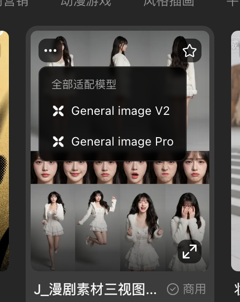

同一张卡预览图的**左上角**这一格，**放的不是同一种东西** ——
扫完首屏 30 张卡的读数：

| 位置上是 | 几张 | 长什么样 |
|---|---|---|
| ⭐ **模型徽标** | **25** | `24×24` 的 `<button>`，**带文字**（`Qwen Image` 最多）、内含 ``。**鼠标移上去会出气泡**，气泡文字就是徽标上的模型名 |
| ⭐ **`✧` 入口**（悬停才显形） | **5** | `24×24` 的 `<button>`，**无文字、无 `aria`、无 `title`、无任何 `data-*`**，只有一枚 `✧` 闪烁图标（SVG path 以 `M2 0a2 2 0 1 1 0 4…` 开头） |

⭐⭐⭐ **这一格放什么，取决于这张风格能用几个模型 —— 实测坐实：**

| 这张风格 | 左上角显示 | 悬停后 |
|---|---|---|
| 只能用**一个**模型 | **直接显示那个模型的徽标** | ⛔ **不出面板** |
| 能用**多个**模型 | **显示 `✧` 入口** | ✅ **浮出一块面板，逐行列出全部可用模型** |

实测读数（同一手法，同一批卡）：

- `✧` 入口的第一张卡 → 面板列 **2 个**：`General image V2` / `General image Pro`；
- `✧` 入口的另一张卡 → 面板列 **5 个**：`Lib Image` / `General image Pro` / `General image V2` / `Seedream 4.5` / `Seedream 5.0`；
- ⭐ **两枚单模型徽标卡（`Seedream 5.0` / `Qwen Image`）悬停后一个面板都不出** ——
  这是**反向对照**，证明「出不出面板」确实跟着模型数量走，**不是「所有卡都这样」**。

⭐ **滚动后扩大采样**（Batch DE）：三轮滚动、共 6 次悬停采样，
模型数分布 **`[2, 5, 5, 2, 5]`**，**最多 5 个**。
出现过的模型名共 **7 个**：`General image V2`、`General image Pro`、`Lib Image`、
`Seedream 4.5`、`Seedream 5.0`、`Z Image`、`Qwen Image`。
⚠️ 另有 **1 次采样读到「无面板」**（同一批里其余都有）⇒ **偶发漏读**，
所以「这枚按钮永远会出面板」这句话**留有余地**。

⭐⭐ **Batch DI 做了大样本复核**（5 个分类、每类把视口内 2 张入口卡都读一遍）：

| 分类 | 视口内入口 / 徽标 | 两张入口卡各列几个模型 |
|---|---|---|
| `推荐` | 2 / 10 | **2** 个、**5** 个 |
| `摄影写真` | 2 / 10 | **5** 个、**3** 个 |
| `电商营销` | 2 / 10 | **3** 个、**3** 个 |
| `动漫游戏` | 2 / 10 | **2** 个、**5** 个 |
| `建筑及室内设计` | 2 / 10 | **5** 个、**5** 个 |

**汇总**：采样 **10 张**入口卡，**10 张全部出面板、零次需要重试**；
模型数分布 **`[2, 2, 3, 3, 3, 5, 5, 5, 5, 5]`** ⇒ **上限仍是 5**（未见过 6 及以上）。
⭐ 5 个分类的**入口比例完全一致**（都是 `2 / 12`），与 DF 的结论相互印证。
📖 早先那句「是本手册观测到的上限，不是产品保证」**不够准，本批更正** ——
下面是查清的结论：

> ⭐⭐ 面板的渲染代码是 **`e.map(...)` 全量渲染**，**没有任何 `slice` / `take` / 截断**。
> ⇒ **界面上不存在「只显示 5 个」这种限制**。你看到的模型数就是它全部的模型数。
> ⇒ 所以「最多 5 个」是**这张卡本身最多适配 5 个模型**（数据侧的事实），
> **不是面板把第 6 个藏起来了**。
> 📖 仍保留的一点：一张卡**最多能适配几个**，由平台数据决定，
> 本手册**没有找到写明这个上限的文档或常量** —— 所以「5 是不是绝对上限」仍标未验。

> 💡 所以：**看到徽标** = 这张卡只列了它一个模型；
> **看到 `✧`** = 这张卡**还有别的模型可选**。
> 想知道某个风格到底能用哪些模型，就**把鼠标停在那一格上** ——
> 徽标会报出模型名，`✧` 会把全部列给你。
>
> ⭐ 顺带更正一条**假规律**：这枚 `✧` 一度看着像**固定出现在每行第 2 个位置**
> （首屏 5 枚里有 4 枚在 `x=324`）。⭐ **滚到底 54 张卡后这个规律就破了** ——
> `x=324` 那列 9 张里第 1 张是徽标，而 `x=1136` 那列也冒出一枚 `✧`。
> **位置只是巧合，规律是「模型数量」。**

⭐⭐⭐ **为什么特效广场「每张都是入口」？答案：那边的卡就没有单模型的。**（Batch DF）

把特效广场**视口内 12 张卡逐张悬停**读一遍，结果**零例外**：

| 读数 | 结果 |
|---|---|
| 12 张卡左上角 | **12/12 都是 `✧` 入口**，没有一枚徽标 |
| 悬停后面板列几个模型 | **`[3,3,3,3,3,3,3,3,3,3,3,3]`** —— 全部是 3 |
| 12 张列的是哪三个模型 | ⭐ **逐字相同**：`Seedance 2.0` / `Kling 3.0` / `Kling O3`（**去重后只有 1 种组合**） |
| 有没有列 1 个模型的卡 | ⛔ **一张都没有** |

⇒ **不是「特效广场特殊地不显示徽标」，而是那边每张卡都能用 3 个模型**，
所以每张都走到「多模型」那一支。**规律在两个广场是同一条。**

⭐ **同一套手法在风格广场能读出「有单模型」**（阳性对照）：
下面这张跨分类采样表里，`Qwen Image` / `Lib Image` 徽标卡**全部无面板**。

### ⭐ 跨分类采样：入口卡占 **17%**，各分类比例稳定

换了 4 个分类各采一轮（Batch DF）：

| 分类 | 视口内卡数 | 徽标 | 入口 | 悬停采样读数 |
|---|---|---|---|---|
| `摄影写真` | 11 | 9 | 2 | 徽标卡全无面板；入口卡 **5** 个 / **3** 个模型 |
| `电商营销` | 12 | 10 | 2 | 徽标卡全无面板；入口卡 **3** 个模型 |
| `动漫游戏` | 11 | 9 | 2 | 徽标卡全无面板；入口卡 **2** 个 / **5** 个模型 |
| `风格插画` | 12 | 10 | 2 | 徽标卡全无面板；入口卡 **5** 个模型 |
| **合计** | 46 | **38** | **8** | ⭐ **入口占 17%**，每类都是 2 张 |

⭐ **`动漫游戏` 那一类的读数和其他三类不一样**（出现了 `Z Image` 徽标、
以及一个列 `Z Image` / `Qwen Image` 的入口）—— 这证明**分类确实切了、内容确实变了**。

> ⚠️ 四个分类的滚动高度 `scrollH` **都是 2265**，但这**不代表内容相同**：
> 无限滚动容器的高度只反映**已渲染的部分**。真正的判别证据是
> ① 视口卡数不同（`11 / 12 / 11 / 12`）、② 各分类的模型组合不同。

**「全部适配模型」浮层的实测结构**（悬停后 `257ms` 面板就在了）：

- 面板容器 `150×96`，class 尾段是 `absolute left-0 top-full z-20 mt-1 w-max rounded-lg bg-black/85 p-1 backdrop-blur…`；
- 标题「全部适配模型」`140×25`，class `px-2 py-1 text-[11px] text-white/60`；
- ⭐ 下面逐行列出模型名，**每行前带同一枚 `✧` 图标**。

> ⚠️ **两个坑，都实测过：**
> ① ⛔ **它没有提示气泡。** 悬停**不会**出 tooltip —— 你必须**已经看到浮层**才知道它是什么。
> ② ⛔ **点它什么都不会发生**：悬停它之后真点一次，**画布节点数 `11 → 11`、广场还在、
> 没有详情浮层、没有任何提示**。它**纯粹是个悬停展示**。
> ⇒ **想看某个风格能用哪些模型，把鼠标停在那枚 `✧` 上别点。**

> ⭐⭐ **这一节更正了本手册此前两处读数**：
> ① 「8 次采样未复现这个面板」—— ⛔ **作废**。面板**每次都在**，`257ms` 就出现。
>    采样之所以读到「没有」，是因为**按 `role="tooltip"` 去找它** ——
>    而它**不是 tooltip**，是一个没有任何 `role` 的绝对定位 `div`。
>    ⭐ **`role="tooltip"` 只能找到「纯提示」，找不到「可点的浮层」** —— 本会话第三次栽在
>    「用一类元素的判据去找另一类元素」上。
> ② 「卡面有一枚写着『新功能：支持真人』的 `114×27` 标记」—— ⛔ **作废**。
>    全页搜「新功能」和「真人」**一个字都没有**（唯一命中的 `<script>` 是 Next.js 的数据流，
>    不是界面）。`114×27` 实际是**这个浮层里某一行**的尺寸，**不是卡面上的东西**。
>
> ⭐ 教训复盘：这三条错账叠在一起，是因为**我一直在用「卡片左上角 = 模型徽标」这个
> 旧结论去解释那一格**。看到和旧结论不一样的东西时，正确反应是**把那一格的元素读出来**，
> 而不是猜它属于谁。

### ⭐⭐⭐ 两个广场左上角那一枚，是**同一枚按钮**

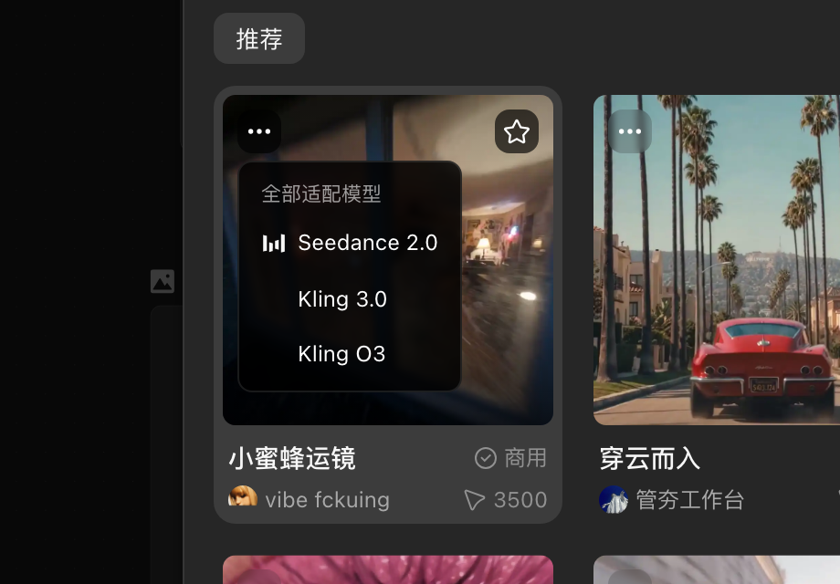

本手册此前把风格广场那枚叫 `✧`、特效广场那枚叫 `•••`，**当成两个东西**。
⭐ **Batch DD 实测：是同一枚。**

| 判据 | 风格广场 | 特效广场 |
|---|---|---|
| SVG `d` 属性**完整 96 字符** | `M2 0a2 2 0 1 1 0 4 2 2 0 0 1 0-4m7 0a2 2 0 1 1 0 4 2 2 0 0 1 0-4m7 0a2 2 0 1 1 0 4 2 2 0 0 1 0-4` | **逐字相同** |
| 悬停后出不出「全部适配模型」面板 | ✅ 出 | ✅ 出 |
| 面板里列几个模型 | 2 个（`General image V2` / `General image Pro`） | 3 个（`Seedance 2.0` / `Kling 3.0` / `Kling O3`） |

⭐ **顺带回收一笔旧账**：早先有一轮截图里出现过
`Seedance 2.0` / `Kling 3.0` / `Kling O3` 这组模型名，当时判成「读不出来源、已作废」。
**那组就是特效广场这张卡的 3 个模型** —— 作废判早了。

> ⭐⭐ **所以「`•••` 是特效广场特有」是错的**（这个说法本手册此前写过）。
> 它在**两个广场都有**，功能也一样：悬停列出这张卡能用的全部模型。
> ⭐ **判据上值得记一笔**：此前两边都只读了 path 的**前 30 个字符**，
> 靠「前缀一样」就说「两个广场用的是同一枚」—— **前缀相同推不出同一个图标，更推不出行为相同**。
> 本轮改成**比完整 96 字符 + 实测行为**，两条都过才敢说同一枚。
>
> ⚠️ **两个广场的差别不在这一枚按钮上，而在卡片的模型数量**（下表）：
> 风格广场的卡有 `⤢ 详情`、**有单模型卡**（显徽标，首屏 25/30、跨 4 分类 38/46）；
> 特效广场的卡**没有** `⤢ 详情`，而且 ⭐ **12/12 张全是多模型卡**
> （每张都列同样那 3 个：`Seedance 2.0` / `Kling 3.0` / `Kling O3`），
> 所以**每张都走入口**。
> ⇒ **不是「特效广场不显示徽标」，是那边压根没有单模型卡。** 规律两边是同一条。


> ⭐ **`使用` 按钮点下去 = 和「点卡片本体」一模一样的后果**（本轮结掉这个 📖）：
> 画布 `12 → 13`，新增 `m-0J5UTXY01T`，**积分 `20 → 20` 不扣**，
> 点完每 400ms 采一次共 8 次，`广场` 与 `详情浮层` 都**在第一次采样前就关了**。
> ⭐ 顺带把详情浮层的结构钉死了（祖先链逐层量出来的）：
> `使用` 按钮 `121×32`、class `bg-btn-invert-bg text-btn-invert-text`（白底深字的主按钮），
> 它在 `div.mantine-Modal-body` → `section.mantine-Modal-content` → `div.mantine-Modal-inner`
> 里，而 **`mantine-Modal-inner` 是 `1440×810`，铺满整个视口**；真正有内容的容器
> （含「风格详情」全文）是 `757×681` 那一层。
> ⇒ **详情浮层是全屏的**，但内容只占中间一块。
>
> ⚠️ **别把「点详情」「点卡片」「点收藏星」「点使用」当成同一件事**：
>
> | 动作 | 后果 |
> |---|---|
> | 点 `⤢ 详情` | 开一个**只读**详情浮层，**不动画布**（本轮又复核了一次：连点两次详情，节点数没变） |
> | 点 `收藏` | 切收藏态（弹「取消收藏成功」），不动画布 |
> | ⭐ **点卡片本身** | **往画布里加一个节点** —— ⭐ **两个广场都已实测**，见下两节 |
> | ⭐ **详情浮层里的 `使用`** | **同样是加一个节点**，与「点卡片本体」等价 |

### ⭐⭐⭐ 点一下风格卡片 = 画布上多一个「素材-风格」节点


**没有第二次确认，点一下就生效。** 实测的完整读数：

| 读数 | 点之前 | 点之后 | 删掉那个节点之后 |
|---|---|---|---|
| 画布节点（按 `data-id` 集合数） | **11** | **12** | **11** |
| 新增的 id | — | **`m-N9X90V3Ttl`** | 已消失 |
| 剩下的 11 个 | — | — | ⭐ **与基线逐项相同** |
| 抽屉「共 N 节点」 | `11` | **`12`** | — |

| 现象 | 实测 |
|---|---|
| 节点名字 | 画面和抽屉里**都**写 `素材-风格-Seedream 5.0 pro`（中点是连字符 `-`） |
| 节点标题栏 | ⭐ **会被截断**成 `素材-风格-See…` —— 想看全名得点开抽屉那一行（`aria-label="定位到节点 素材-风格-Seedream 5.0 pro"`） |
| 卡片形态 | 画布上是 `113×113` 的一张小卡：**一个立方体图标** + 这张风格的预览图 |
| 类型 | class `react-flow__node react-flow__node-material-style nopan selectable drag` |
| 广场 | ⭐ **点完 300ms 内就关**（点完每 400ms 采一次、共 8 次，**全部**读到「广场不在」） |
| 抽屉首行 | `素材-风格-Seedream 5.0 pro` |
| toast | ⛔ **8 次采样一个都没读到** —— 特效广场那次读到了 `素材·特效·小蜜…`，**同一套脚本在那边能读到**，所以「这边没有」是有对照的阴性 |

> ⭐⭐ **和特效广场逐项对照**（两边同一套手法实测）：
>
> | | 风格广场 | 特效广场 |
> |---|---|---|
> | 点卡片后 | 画布 `11 → 12` | 画布 `11 → 12` |
> | 节点 id 前缀 | `m-` | `m-` |
> | 节点名 | `素材-风格-Seedream 5.0 pro` | 画面 `素材·特效·小蜜蜂运镜` / 无障碍名 `素材-特效-小蜜蜂运镜`（**两边写法不同**） |
> | 广场自动关闭 | ✅ 300ms 内 | ✅ 300ms 内 |
> | toast | ⛔ 没读到 | ✅ 读到了 |
> | 卡上有 `⤢ 详情` | ✅ 有 | ⛔ **没有** |
>
> ⇒ **两个广场的「点卡片」是同一套机制**，差别在卡的按钮构成和 toast。
> ⚠️ 但**风格广场的卡上多一枚 `⤢ 详情`** ⇒ 风格广场**至少有一条不动手的路**
> （先看详情、确认「首选推荐模型」再决定要不要点卡片），特效广场**没有**这条路。

> ✅ **本手册把点出来的节点原样删回去了**：按**本轮 diff 出来的新 `data-id`** 认人
> （不按名字、不按位置），从抽屉那一行 `更多操作` → `删除`；
> 删完 11 个 id 与基线**逐项相同**，并用**另一个全新浏览器会话**复核一致。
>
> 💡 顺带复读确认：节点行 `更多操作` 的四项仍是 `重命名` / `复制` / `添加到Agent` / `删除`，
> 与 [organize-canvas.md](organize-canvas.md) 记的一致。

### ⭐ 十个分类确实各自筛出自己的内容

**实测成立。** 十个分类逐个点过去，每个分类的第一张卡都不一样：

| 分类 | 排第一的卡片 |
|---|---|
| `推荐` | `J_漫剧素材三视图+大头表情+姿势图` |
| `摄影写真` | `一键生成人物多视图` |
| `电商营销` | `一键全套版电商主图直通车图卖点图小详情页` |
| `动漫游戏` | `1912.5D写实人像` |
| `风格插画` | `赛璐璐光影` |
| `平面设计` | `Lib Image` |
| `建筑及室内设计` | `天宫东方传统美学超现实神话元素奇幻概念艺` |
| `创意玩法` | `中秋节主题场景月饼建筑海报` |
| `文创周边` | `一键输出IP文创周边设计样机` |
| `小说推文` | `破界.玄光极速版 Z-image +qwen` |

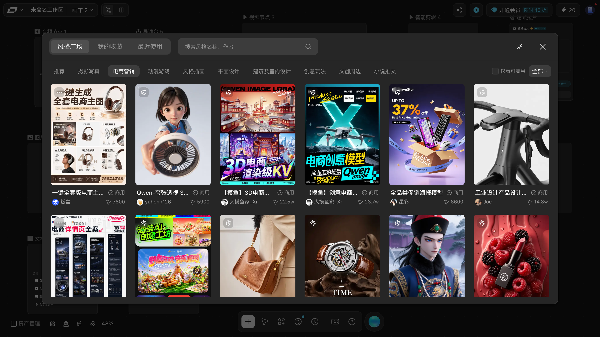

> 💡 **一眼能认出的规律：名字以「一键…」开头的，是成套模板。**
> `一键生成人物多视图`（摄影写真）、`一键全套版电商主图…`（电商营销）、
> `一键输出IP文创周边设计样机`（文创周边）都是这一类 ——
> 它们预览图左上角那枚徽标是**一整块文字**，而不是模型图标。
> 要成套的效果优先找它们，要单张的风格就找名字正常的那些。

> ⚠️ **「一共有多少张卡」别拿屏幕上数出来的当答案。** 广场是**无限滚动 + 虚拟渲染** ——
> 滚过去的卡片会被回收复用，屏幕上**同时只存在 30～54 张**、视口内 12～18 张，
> **这个数是「复用池」有多大，不是「内容有多少」**。
> 本手册早期记过一句「不同轮次分别读到 30 枚收藏星和 6 枚详情按钮，两个数对不上、
> 原因没查清」，**现在结案**：两者数的是卡上**不同层**的元素（见上面「两层盒子」那一节），
> 而层数会随滚动复用而变。⇒ 要确认某张卡在不在，**用搜索框搜它的名字**；
> 要知道一个分类里到底有多少张，**滚到底看收尾提示** —— 见下一节。

### ⭐⭐ 广场到底有多少张卡 —— 十个分类全部数出来了

广场往下滚会一直加载，但**不是无穷的**：每个分类都能滚到底，底下出现一行居中的
**`没有更多了`**。**十个分类的真实数量**（Batch DM 结案，方法见本节末尾）：

| 分类 | 卡片数 | 页数 | 分类 | 卡片数 | 页数 |
|---|---:|---:|---|---:|---:|
| `推荐` | **1086** | 28 | `建筑及室内设计` | **645** | 17 |
| `动漫游戏` | **823** | 21 | `电商营销` | **621** | 16 |
| `创意玩法` | **826** | 21 | `摄影写真` | **723** | 19 |
| `平面设计` | **850** | 22 | `小说推文` | **771** | 20 |
| `风格插画` | **738** | 19 | `文创周边` | **738** | 19 |

> 💡 **十个分类都在 600～1100 张之间**，差别不算大 ——
> 所以「**哪个分类东西多**」没有意义，按题材挑就行。
> （`风格插画` 和 `文创周边` 恰好都是 738 张，是巧合：两者标签不同、互不包含，已逐项核对过。）
>
> ⭐ **`推荐` 最多，而且它跟别的不一样**：它是**唯一不按标签筛**的分类，
> 请求里**不带标签参数**、改用一组「类型」参数，所以它捞到的是横跨所有题材的卡。
> 其它九个分类各自只出自己那几号标签下的东西。

⭐ **每个数字都过了自检**：`前 N−1 页 × 40 + 末页实际条数` 必须等于按卡片唯一编号
去重后的总数。九个分类 + `推荐` 全部吻合，无一例外。

### 「认得出尽头的样子」

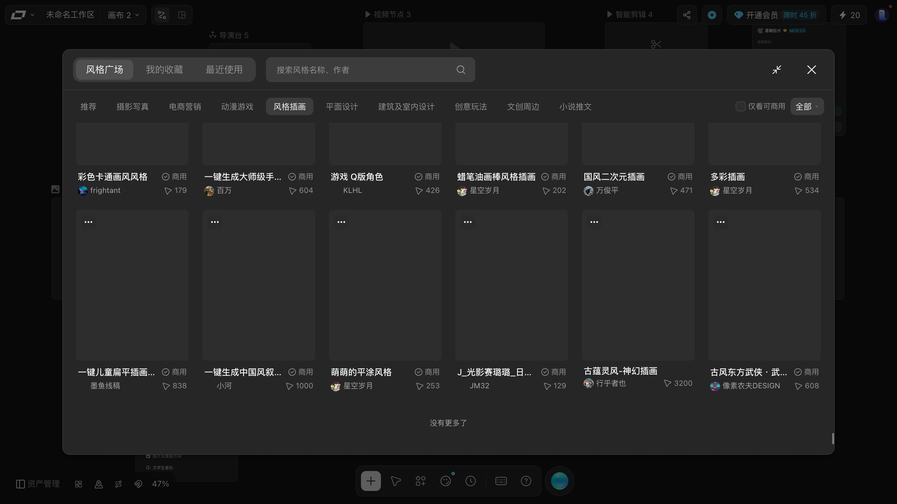

> 💡 **认得出尽头的样子**：最后一行卡**不满**（6 张而不是 12 张），
> 底下跟一句**居中的 `没有更多了`**。看到这个就可以停了 —— 再怎么滚也不会多出一张。
>
> ⚠️ 但「**到底了**」只对当前这个分类成立。切到别的分类，会**从头重新加载**。
>
> ⭐ **这屏的卡片预览图是灰的，不是图挂了**：无限滚动会把滚过去的卡释放掉，
> 只保留一小段可复用的区域。**这正好说明「屏幕上看到的张数」和「实际有多少张」是两回事** ——
> 屏幕上最多同时 54 张，这个分类实际有 738 张。

<details>
<summary>这些数字是怎么数出来的（不想知道可以跳过）</summary>

屏幕上数不出来，只能等**每一页都加载完**再数。做法是：一直往下滚，
直到**同时满足三件事**才收手 ——

1. 列表**滚不动了**（已经到底）；
2. 最后一页的「还有下一页吗」变成**否**；
3. 再滚两轮**一张新卡都没有出现**。

然后把加载到的每一页的卡片唯一编号**去重计数**。⚠️ **不能直接拿「屏上有几张」当答案** ——
无限滚动会把滚过去的卡回收复用，屏幕上永远只有几十张（实测 25～54 张之间浮动），
而 `风格插画` 实际有 738 张。

⭐ 收工之后还有一道**自检**：`前 N−1 页 × 40 + 最后一页的实际条数`，
必须等于去重后的总数。**十个分类全部吻合**。
（`推荐` 分类的首屏特殊，会多给 1 条 ⇒ 它是 `41 + 26×40 + 5 = 1086`。）

</details>

### 那个数字和那两个没验的东西

> ⚠️ **卡片上那个数字的，单位本手册没有验证。**
> 风格广场这边读到的是 `532.0w` / `1.1w` / `279` / `5900` / `59` / `252` ——
> `w` 是「万」，所以**这一列更像使用量/热度，不是价格**。
> 而特效广场那边读到的是 `3500` / `1500` / `549` / `3100` / `138`，量级完全不同。
> **两个广场的数字不是同一个东西** 📖，具体含义请以界面上你看到的那一项为准。
>
> ⭐ **数字左侧那枚漏斗图标，两个广场都有**（本手册早期写成「特效广场特有」，是错的）。
> 风格广场这边是 `11×11` 的漏斗形图标（`path d="M.09 1.94A1.45 1.45 0 0 1 1.94.09…"`），
> 特写截图里也看得清清楚楚。
> **悬停这个数字不弹任何提示** —— 这条做过阳性对照（先往页面里塞一个假的
> `role="tooltip"`，确认读得到；拿掉，确认读不到），所以「没有浮层」是有效读数。
>
> ⭐ 卡面左上角那枚**模型徽标**现在知道是什么了 —— **下面那个「全部」下拉就是按模型筛的**。

### ⭐⭐ 那个写着「全部 ▾」的下拉，**不是排序，是按模型筛**

它长得很像排序下拉（右边一个小箭头、默认值写「全部」），点开之后露出的七项
**全是模型名**：

`全部` · `Lib Image` · `Style Image V7` · `Qwen Image` · `Z Image` · `Seedream 4.5` · `Seedream 5.0`

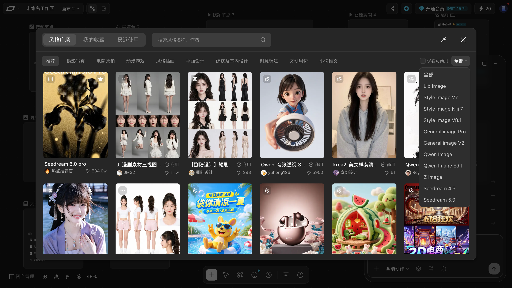

> 💡 这跟卡片左上角那枚**模型徽标**是同一套东西 —— 徽标写的就是你当前筛到的那个模型。
> 想知道某张卡是哪个模型生成的，**看徽标最快**。
>
> ⭐ 顺带说明为什么这一条以前读不出来：本手册前几轮用的是
> **「先猜选项名、再按名字找」**（正则 `^(全部|最新|最热|价格…)`）——
> 猜错了就永远读不到，于是记成了 📖。
> 本轮换成**点开前后各存一份元素指纹、只报新出现的**，一个名字都不用猜，读数是：
> 7 个 `mantine-Menu-itemLabel`，`全部 / Lib Image / Style Image V7 / Qwen Image / Z Image / Seedream 4.5 / Seedream 5.0`。
>
> ⭐ **广场真正的排序入口：界面上没有。** 本轮把**整个广场**（不是只扫工具条那一行）
> 的可交互元素**全部枚举了一遍**，并把**最上面那几行**逐个点名：
>
> | 读数 | 风格广场 | 特效广场 |
> |---|---|---|
> | 可交互元素总数 | 833 | 1113 |
> | 其中**非卡片**（真正的控件） | **743** | **987** |
> | 含「排序 / 最新 / 最热 / 热门 / 时间 / 价格 / 热度 / 人气」等词的控件 | ⭐ **0** | ⭐ **0** |
>
> **最上面两行的完整结构**（两个广场**逐字相同**，只有搜索框占位符差一个「风格/特效」）：
>
> | 位置 | 控件 |
> |---|---|
> | 第 1 行 `y=92` | `minimize`、`close` 两枚 `40×40` |
> | 第 1 行 `y=96` | 三个页签 `风格广场` / `我的收藏` / `最近使用`（各 `92×32`） |
> | 第 1 行 `y=98` | `aria="search"` 的 `28×28` 放大镜 + `输入框`（占位符「搜索**风格**名称、作者」，`278×20`） |
> | 第 2 行 `y=157` | 分类按钮 **10 个**（特效广场只有 `推荐` 一个）+ **`全部` 下拉** `54×28` |
> | 第 2 行 `y=163` | `仅看可商用` 勾选框（`16×16` 的 `input`） |
>
> ⇒ **两行工具条里能点的就这些，没有一处写着「最新 / 最热 / 价格 / 排序」。**
>
> ⭐ **这个阴性结论为什么可信**（两条支撑）：
> ① **阳性对照通过** —— 同一套枚举脚本**抓到了**已知的 `全部` 下拉（两个广场各命中 2 个），
>    说明枚举范围**没有漏掉**工具条；
> ② **枚举范围是全广场**（743 / 987 个非卡片控件），不是「我猜的那几个位置」。
>
> ⚠️ **一处已知误报要记下来**：在特效广场按关键词搜，会命中 **3 个**写着
> 「**子弹时间**」的卡片 —— 那是**特效名里带「时间」二字**，不是排序入口。
> ⇒ **纯文字包含匹配会撞上卡名 / 人名 / 作品名**，不能直接当证据。
> ⭐ 这是**阴性结论 + 完整枚举**，比「我找了一圈没找到」有分量：
> **排过队的**是整个面板工具条，不是某几个我猜的位置。
>
> ⭐⭐ **单位查出来了：是「万」。** 风格广场同一屏上**两种写法并存** ——
> 带 `w` 的 `534.9w` `23.7w` `22.5w` `1.1w` `2.3w` `13.1w`，和**不带 `w`** 的 `6300` `300` `191` `87`。
> ⇒ `w` 就是「万」，而低于一万的值**直接写原值、不加 `w`**。
> 这也解释了特效广场为什么「一个 `w` 都没有」—— 那一屏的数字本来都不到一万。
>
> ⭐⭐⭐ **这个数字的字段名查出来了：是 `runCount`（运行次数）。**（Batch DJ 结案）
>
> **取证方法**（值得记，因为 DOM 那条路走死了）：
> 先在界面上读出**确切数值**，再去**接口响应体**里找**同值**，报告它挂在哪个键上 ——
> **不猜键名**。广场的卡片数据来自 `api2.liblib.art/api/www/model/feed/stream`，
> 读数对照（**同值匹配**，一一对上）：
>
> | 界面上写的 | 接口里的字段 |
> |---|---|
> | `6300` | `data.data.1.runCount = 6300` |
> | `218` | `runCount = 218`（两条同时命中） |
> | `62` | `runCount = 62` |
> | `8800` | `runCount = 8800` |
> | `3700` | `runCount = 3700` |
> | `1.1w` | ⭐ **`runCount = 1100`** —— **万字口径坐实** |
> | `4.2w` | ⭐ **`runCount = 4200`** |
>
> ⭐ **同一条记录里还有一堆「长得像计数、但数值对不上」的字段** ——
> `downloadCount: 12`、`likeCount: 2`、`commentCount: 0`、`heat: 31875`、`imageCount: 32`。
> **界面上显示的是 `runCount` 一个**，其余都不显示。
>
> ⚠️ **一处必须记的踩坑**：把匹配口径放宽（`1.1w` 也去试 `11`）之后，
> 命中从 **7 处涨到 48 处**，多出来的全是**误报** —— `11` 恰好等于一堆别的字段
> （`tagOrder`、`downloadCount`、`likeCount`…）。⇒ **一对多的宽匹配必然产生假阳性**，
> 只有**严格口径下的逐一对应**才算证据。
>
> ✅ **所以现在能确定的是**：这个数字 = **`runCount`**（接口字段名），带 `w` 时是「万」。
>
> ⭐⭐ **而且它远不止这一个数字**（Batch DL 结案）。把一条卡片记录的字段全导出来：
> **顶层 58 个字段、连嵌套展开一共 126 个**。跟「计数」沾边的就有一串：
> `runCount` / `downloadCount` / `likeCount` / `commentCount` / `subscribeCount` /
> `imageCount` / `heat` / `score` / `delay7dDownCount`。
> **界面上只显示 `runCount` 一个**，其余八个一个都不露。
>
> > 顺带记一下 `score` 和 `delay7dDownCount` 这两个名字 ——
> > `score` 是打分，`delay7dDownCount` 看着像「近 7 天下架数」。
> > ⚠️ **这两个只是从字段名猜的，界面上没有任何东西能证实它们的意思** 📖。
>
> 其余字段大致分四类：身份（`id` / `uuid` / `versionId` / `versionUuid`）、
> 图与视频（`imageUrl` / `webpUrl` / `posterUrl` / `videoUrl` / `images` / `width` / `height`）、
> 作者与时间（`nickname` / `avatar` / `createTime` / `auditTime`）、
> 开关（`isLike` / `isOriginal` / `isRunnable` / `isPackaged` / `openRun` / `vipUsed`）。
> ⭐ **九个分类的字段清单逐字相同**（各 58 个，一个不多一个不少）⇒ 分类之间**不换结构，只换内容**。
>
> ⭐⭐ **「点一下会不会 +1」—— 实测：不会。**（Batch DK 结案）
>
> 受控实验：记死某张卡的数字 → **点它** → **刷新页面重进广场** → 再读同一张卡。
>
> | 读数 | 值 |
> |---|---|
> | 点之前那张卡 | **`6300`** |
> | 点之后（刷新重进）同一张卡 | **`6300`** |
> | ⭐ **差值** | **`0`** |
> | ⭐ 同一屏**其它 10 张卡**跟着变了吗 | **0 个** |
>
> ⇒ **点开一张风格卡不会让这个数字加 1。**
> ⭐ **归因坐实**：点完新建出的节点叫
> **`素材-风格-妆造一体博主感写真 LoRA`** —— 正是上一节抓到
> `runCount = 6300` 的那条记录的名字，**点的确实是那张卡**。
>
> ⛔ **「什么时候会加」仍未验**。剩下的可能性本手册**没排除**：
> 在画布里**真正用它生成**（会扣积分、**需你授权**，本手册不试）、收藏、或别的动作。
> ⇒ **所以这里只写「点一下不会变」，不写它到底怎么变。**
>
> 👉 判定方法：只认**带不带 `w`** 这件事（两个广场同屏可比），
> 别拿「数值像不像钱」当证据。

### ⭐ 卡面其实有**两层**盒子，别只盯着预览图那一块

本手册早期一直把「卡片」当成预览图那一块（`183×245`），
于是**卡名、作者、数字全在「那块之外」**，一度差点写成「卡面上没有这些」。
⭐ Batch DG 逐层量了真实结构：

| 层 | 尺寸 | 里面有什么 |
|---|---|---|
| 第 2 层 | `[933,515,183,245]` | **只有预览图** + 左上角徽标 + 右上角收藏星（class `…overflow-hidden rounded-lg…`） |
| ⭐ **第 3 层** | `[929,511,191,302]` | ⭐ **真正的整张卡** —— 预览图 + **卡名**（`krea2-光滑，水润质感 解封版`）+ **作者**（`奇幻设计`）+ **数字**（`62`） |

> 💡 **差别只有 57px 高**（`245` → `302`），肉眼几乎看不出两块是分开的。
> ⇒ **凡是要读「卡面上的文字」，必须用第 3 层那个容器**（判据：高度 > 245、
> 且里面能同时读到卡名和数字）。用预览图那一块去读，读到的就是「什么都没有」。

> ⚠️ 顺带一条**枚举数据层的坑**：搜 `viewCount` / `hotCount` 这种键名会**命中**，
> 但要**看它前后的上下文**才知真假 —— 这次命中的位置是 i18n 文案表，
> 和卡面数字**毫无关系**。⇒ **命中一个键名不等于命中了那个值**；
> 要证明同源，键名和**具体数值**必须出现在同一段 JSON 里。

卡面左上角那枚**模型徽标点下去**会发生什么，仍然 📖 没验。

「仅看可商用」勾选框**能切**，实测 `checked` 在 `false ↔ true` 之间来回变（本轮已改回）。
⭐ 它**确实会改变拉取的数据**（见上文「顶部三个页签」一节）——
但**筛掉多少张本手册没测准**，那里如实标了 📖。

---

## 特效广场：同一套结构，数字不带「万」

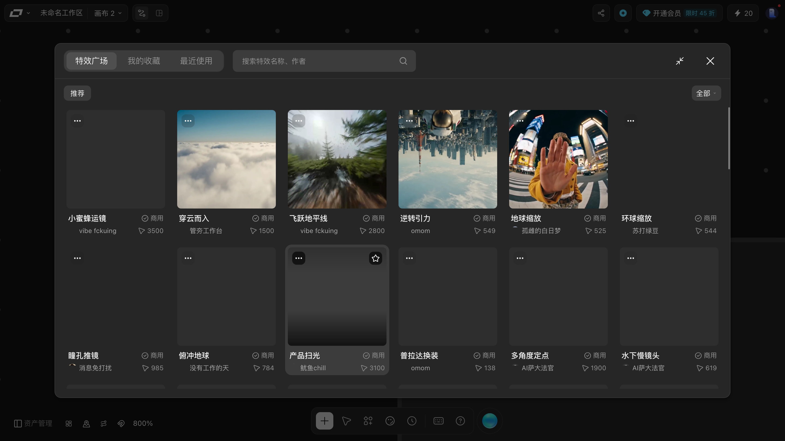

结构跟风格广场几乎一样，差别在：

| | 风格广场 | 特效广场 |
|---|---|---|
| 分类标签 | **10 个** | 只有 `推荐` 一个 |
| 数字量级 | `532.0w` / `1.1w` / `59`（**带 `w` = 万**） | `3500` / `1500` / `549` / `3100`（**纯整数**） |
| ⭐ 卡片上的 `⤢ 详情` 按钮 | ✅ **有**（悬停显形，点开是只读详情浮层） | ⛔ **一枚都没有** —— 面板内 32 个按钮逐个点名：12 枚 `收藏`、**0 枚 `详情`** |
| 卡面左上角 | ⭐ **同一枚按钮**（模型徽标 **或** `✧`，每张卡不一样） | ⭐ **同一枚按钮** `✧`（`•••` 是同一个图标的另一种叫法），**12/12 张卡都是**。⭐ **原因不是「那边不显示徽标」，而是那边没有单模型卡** —— 12 张每张都列 3 个模型 |

特效广场的卡片上那个数字是**能直接看见的整数**，
本手册读到的几十个在 `41`（AI搬砖侠）到 `3500`（小蜜蜂运镜）之间。

### ⭐⭐⭐ 点一下卡片 = **这个特效立刻变成画布上的一个节点**

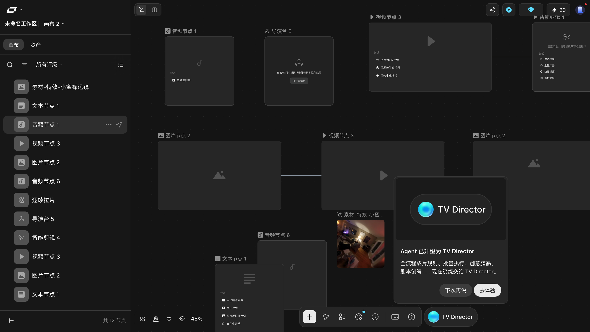

**没有第二次确认，点一下就生效。** 实测的完整读数：

| 读数 | 点之前 | 点之后 | 删掉那个节点之后 |
|---|---|---|---|
| 抽屉「共 N 节点」 | **11** | **12** | **11** |
| 抽屉第一行 | `文本节点 1` | **`素材·特效·小蜜蜂运镜`** | `文本节点 1` |
| 剩下的 11 行 | 与基线逐项相同 | — | **与基线逐项相同** |

| 现象 | 实测 |
|---|---|
| 节点名字 | 画面上写 **`素材·特效·小蜜蜂运镜`**（中间是**中点 `·`**）；无障碍名里写的是 **`素材-特效-小蜜蜂运镜`**（**连字符 `-`**）—— 同一件事，两处写法不一样 |
| 这个节点的 id | `m-EAvw5wpOcF` —— **`m-` 前缀**，是本手册见到的第六种节点前缀 |
| 广场 | **点完立刻关闭**（时间序列采样：点后 300ms 内就已关；另有一次采样读数说还开着，见下面的「读数打架」） |
| 提示 | 右下角弹一条 toast，文字是 `素材·特效·小蜜…` |
| 落在哪 | 新节点出现在**视口中央偏下**，不是拖出来的，**位置固定** |

> ⭐ **所以「点卡片」和「点详情」是两种完全不同的后果**：
> `⤢ 详情` 是只读浮层，`点卡片` 是**往画布里加东西**。
> 特效广场的卡上**只有两枚按钮** —— `•••`（无 `aria`，实测点它不弹任何菜单）和
> `收藏`（`aria="收藏"`）；**没有 `⤢ 详情`**。
> 也就是说，**在特效广场里，「点之前先看清一张卡是什么」这条路界面上没给**。

> ⛔ **本手册把点出来的节点原样删回去了**：按名字 `素材-特效-…` 认人
> （用户原有的 11 个节点里**一个都不带这个前缀**），悬停到那一行、点**同一行**的
> `更多操作` → `删除`，删完 11 个名字与基线**逐项相同**。
> 删节点**没有二次确认** —— 这也是为什么前面那套「先读名字再动手」的习惯值得留着。

#### ⭐ 卡面上那个数字，单位仍然没验出来 —— 但能确定它是**同一个指标**

| 已验 | 内容 |
|---|---|
| 它前面有一枚图标 | **纸飞机**形状，`viewBox="0 0 16 16"`，路径 `M.09 1.94A1.45 1.45 0 0 1 1.94.09l12.3 4.4…` |
| ⭐ **两个广场用的是同一枚** | 风格广场首卡和特效广场首卡取到的路径**逐字相同** |
| 悬停它 | **不弹任何提示**（做过阳性对照：先塞一个假的 `role="tooltip"` 确认读得到，拿掉确认读不到） |
| 详情浮层里 | **没有**这个数字，也没有任何关于它的说明 |
| 界面上 | **没有任何一处文字解释它是什么** |

所以能确定的只是：**风格广场的 `532.0w` 和特效广场的 `3500` 是同一个指标**，
只是量级写法不同（`w` = 万）。它的**单位至今 📖 没验出来** ——
本手册**不写**它是价格、点赞还是使用量。

### ⭐ 广场的卡片是**无限滚动**的

往下滚会**一直加载出新的卡片**，不是翻到头。实测三个时刻：

| 时刻 | 列表总高 `scrollHeight` | 容器可视高 | 详情按钮总数 | ⭐ **视口内**的详情按钮 |
|---|---|---|---|---|
| 刚进广场 | **2265** | 517 | 30 | **12** |
| 滚到中段 | **4462** | 517 | 54 | **12** |
| 滚到底 | **6659** | 517 | 54 | **12** |

⭐⭐ 两个可用的判据：

1. ⭐⭐ **每张卡都有一枚详情按钮** —— 三个时刻里「详情按钮总数」和「收藏星总数」
   **始终相等**（`30/30` → `54/54` → `54/54`）。
   ⚠️ 早先有「6 枚」和「1 枚」两个读数，**两个都不对**（一个是脚本只扫了
   `x > 700` 的三列，另一个是广场还没加载完就采了）。
2. ⭐ **DOM 里始终只保留视口附近的卡** —— 三个时刻**视口内的详情按钮都是 12 枚**
   （6 列 × 2 行），而总数一路涨到 54。

滚动容器是 `div.m_c0783ff9 mantine-ScrollArea-viewport`，
`[101,197,1238,517]`，`overflow-y: scroll`。

> ⭐ **「全部适配模型」面板已复现并结案**（Batch DC）。它不是特效广场的东西 ——
> **在风格广场**，是**卡面左上角那枚 `✧` 按钮**悬停出来的，
> **列出这张风格能用的全部模型**。实测样本：一张列 2 个
> （`General image V2` / `General image Pro`），另一张列 5 个
> （`Lib Image` / `General image Pro` / `General image V2` / `Seedream 4.5` / `Seedream 5.0`）。
> ⭐⭐ **Batch DD 收回上一批的作废**：那组 `Seedance 2.0` / `Kling 3.0` / `Kling O3`
> **来源查明了** —— 它是**特效广场**里一张卡悬停「全部适配模型」时列出的 **3 个模型**
> （Batch DB 当时在本轮里没见过，就判了「来源不明、已作废」，**判早了**）。
> 两个广场的入口是**同一枚按钮**：SVG `d` 属性 **96 字符逐字相同**，
> 悬停出的面板结构也一样，只有列出来的模型不同。
> 详见下面「两个广场左上角是同一枚按钮」一节。


> ⚠️ 有一处**读数打架**，如实记在这儿而不是挑一个信：
> 同一批实验里，一次采样说「点完广场还开着、适配模型面板浮出来了」，
> 另一次说「点完广场关了」。后来用**时间序列采样**（点完每 400ms 采一次、共 8 次）
> 定死为「**300ms 内广场就关**」。⭐ **单点采样不足以定性，要看时间线。**

> ⚠️ 有一处**差点被骗**，如实记在这儿：
> 早一轮想靠「点前点后同一块像素的 sha256」判断点 `•••` 有没有弹出菜单，
> 体积确实从 `147KB` 变成 `579KB` —— 但那**是图片懒加载完成**（前后构图一模一样），
> 不是弹层。⭐ **体积变化不等于出现了新东西。**

其他两处细节：

- 两个广场的卡片**悬停时右上角都会浮出一枚 ☆**（收藏）；
- 两个广场的列表最底下都有一行 `没有更多了`；
- `我的收藏` 页**空的时候写的是「暂无素材」**（不是「暂无收藏」）—— 收藏和素材共用这一页。

---

## 「新增风格节点 / 新增特效节点」

面板上写的是这个副标题，所以**在广场里选中一张**，就会在**当前画布上建一个节点**，
把这份风格/特效固化下来，之后就能像普通节点一样连线复用。

> 📖 本手册**没有在广场里点过任何一张**（那会在画布上建节点），
> 「建出来的节点长什么样、能不能改」在 [create-nodes.md](create-nodes.md) 里也没有实测过。

---

## 工具箱：镜头运动预设（实测 28 张）

素材库面板第三行「**打开工具箱**」进去，是一个叫「**我的工具箱**」的浮层。

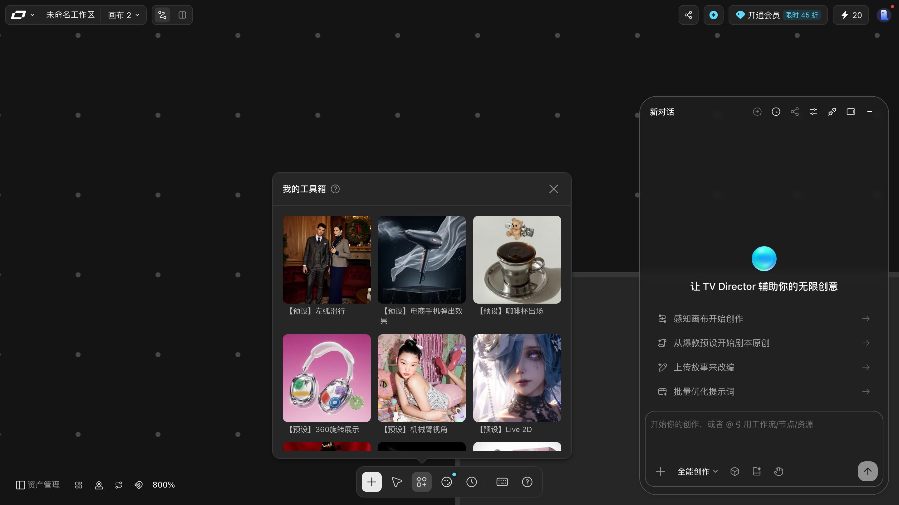

装的是**镜头运动预设**。本轮读到 **28 张**：

| | | |
|---|---|---|
| 【预设】左弧滑行 | 【预设】右弧滑行 | 【预设】360旋转展示 |
| 【预设】瞳孔拉近 | 【预设】飞鸟解体 | 【预设】破盒而出 |
| 【预设】商品震撼登场 | 【预设】颠倒空间 | 【预设】反重力漂浮 |
| 【预设】粒子融解 | 【预设】机械臂视角 | 【预设】英雄视角 |
| 【预设】咖啡杯出场 | 【预设】电商手机弹出效果 | 【预设】Live 2D |
| 【预设】旅拍转场 zoom in | 【预设】旅拍转场 zoom out | 【预设】旅拍转场 向右旋转 |
| 【预设】旅拍转场 向左旋转 | 【预设】旅拍转场 生长 | 【预设】大师分镜九宫格-经典暗调 |
| 【预设】AI模特服饰动态展示 | 【预设】AI室内装修效果预览 | （本账户自建：手册取证测试箱） |

从名字能直接看出分四类：**镜头轨迹**（左弧滑行 / 右弧滑行 / 360旋转展示 / 瞳孔拉近）、
**物体出场**（咖啡杯出场 / 破盒而出 / 商品震撼登场 / 电商手机弹出效果）、
**转场与视角**（旅拍转场系列 / 英雄视角 / 机械臂视角）、
**成片与空间**（大师分镜九宫格 / AI室内装修效果预览 / Live 2D）。

> 💡 **怎么一眼分平台预设和自己建的**：平台自带的一张**都**带 `【预设】` 前缀，
> **没有前缀的就是自己建的**。比看名字像不像可靠。

### 「使用」按钮在右下角，而且平时看不见

每张卡片**右下角**都有一枚 `使用` 按钮（`50×24`），但**默认看不到** ——
要**把鼠标移到那张卡片上**它才浮到预览图上面：

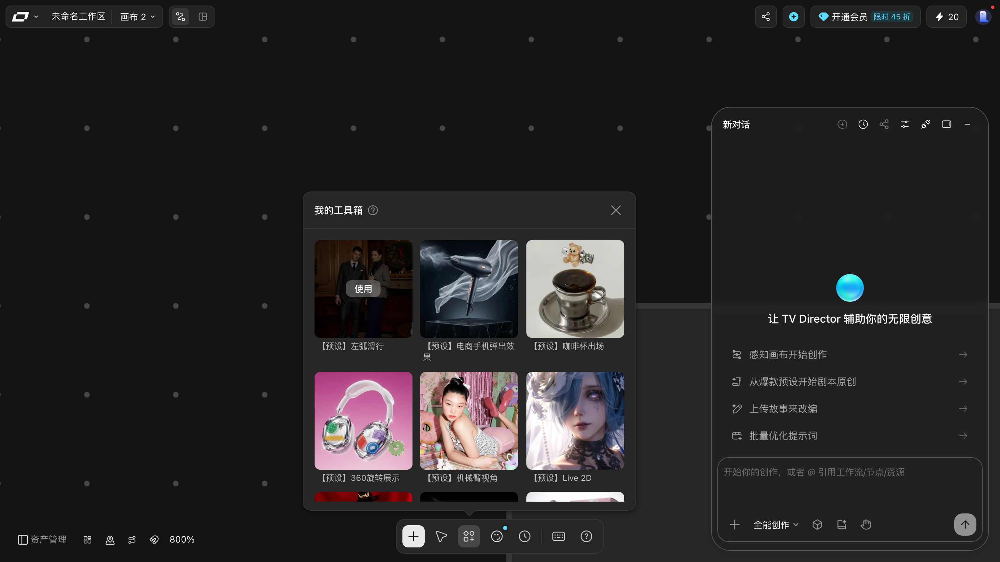

> ⚠️ 它**不是**「透明度为 0、悬停变 1」那种按钮。本手册量过：
> **不悬停时它就在 DOM 里、`opacity` 已经是 1、也真的可见** ——
> 只是**被预览图压在下面**。所以如果你用「查一下这个按钮在不在」的办法去判断有没有这枚按钮，
> **一定会判错**。

> ⚠️ 本手册**没有点过任何一枚「使用」** —— 它会把预设写进画布。
> 「用完之后落在哪、能不能改」没验证 📖。

浮层的 `?` 说明图标在**标题旁边**（不在右上角），右上角是 `×` 关闭。


## 把组存进工具箱

组操作条上还有一个「**添加到工具箱**」入口，方向和「打开工具箱」相反：
「打开工具箱」是**取用**平台预置的镜头运动预设，「添加到工具箱」是**存放**你自己做的组/节点，以后复用。

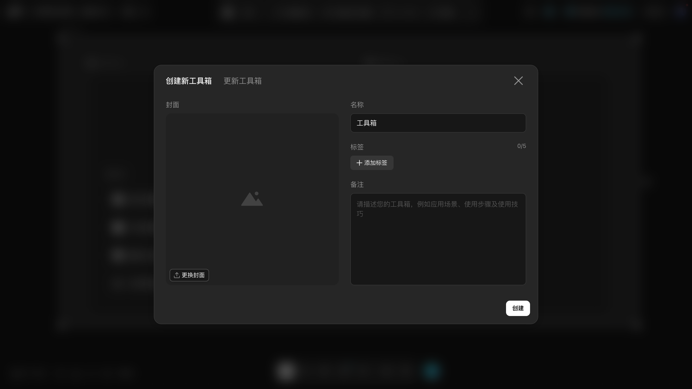

点它弹出的是一个**双标签**弹窗：

| 标签页 | 内容 |
|---|---|
| **创建新工具箱** | 封面（大图占位 + `更换封面` 按钮）、名称、标签（`0/5` + `添加标签`）、备注、右下角 `创建` |
| **更新工具箱** | 列出已建工具箱的卡片（封面缩略图 + 名称），右下角 `确认` |

各字段的实测细节：

- **名称**输入框的占位符是 `输入工具箱名称`，**默认值就是「工具箱」** —— 不改直接点创建会得到一个叫「工具箱」的箱子。
- **标签**上限 5 个，计数显示为 `0/5`。点 `添加标签` 本手册**没有观察到任何输入界面出现**，只多了两处 `标签` 文字 📖。
- **备注**是多行文本框，占位符「请描述您的工具箱，例如应用场景、使用步骤及使用技巧」。

填好名称、点 `创建` 之前的现场：

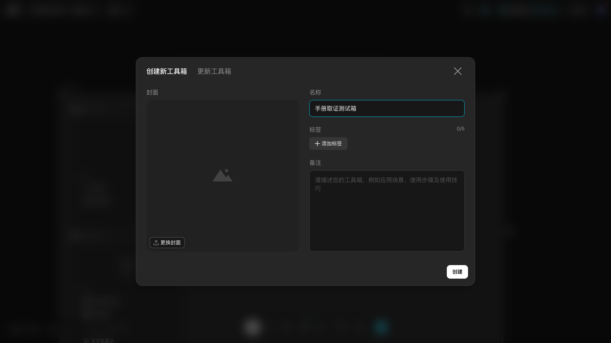

### ⚠️ 创建成功没有任何提示

填好名称点 `创建` 之后，**弹窗直接关闭，不弹 toast，页面上也看不到刚建的工具箱**。
第一反应一定是「没保存成功」。实际上**它是存上了** —— 验收方法：再点一次「添加到工具箱」，
切到「更新工具箱」页，已建的工具箱会列在那里。

下图是本手册连续两轮各建一个同名工具箱之后的样子，「更新工具箱」页里赫然是**两个一模一样的「手册取证测试箱」**：

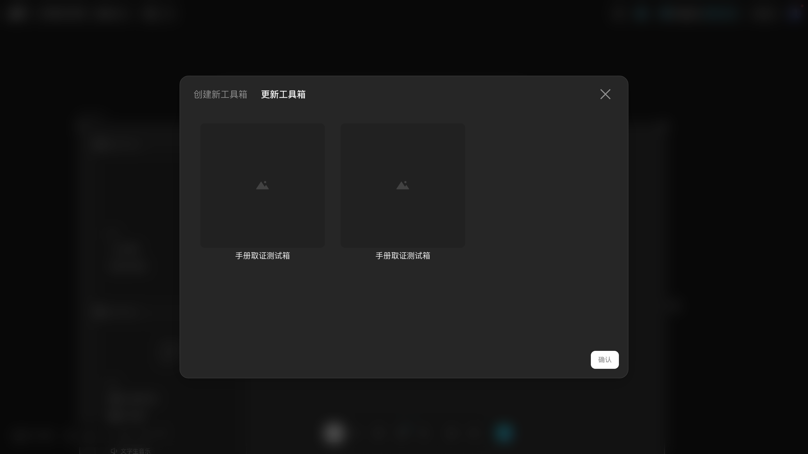

在还没有任何工具箱时，这一页是空状态：

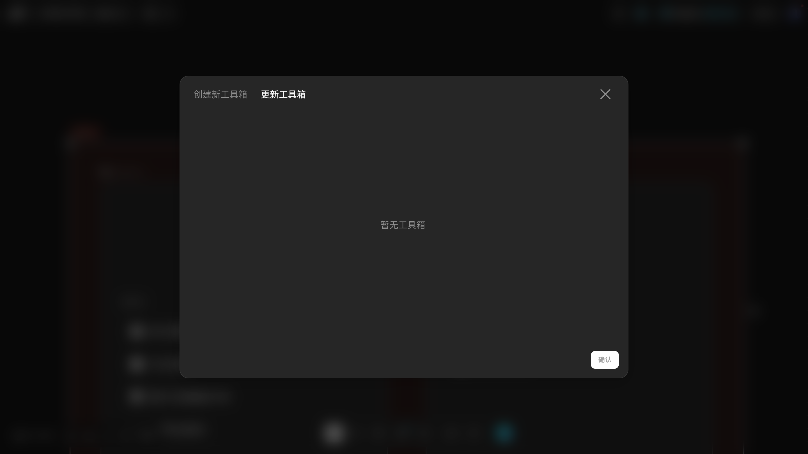

> 建议：建完工具箱**顺手切到「更新工具箱」页看一眼**，这是目前唯一能确认「真的存上了」的办法。

### 按钮文案会从「添加」变成「更新」

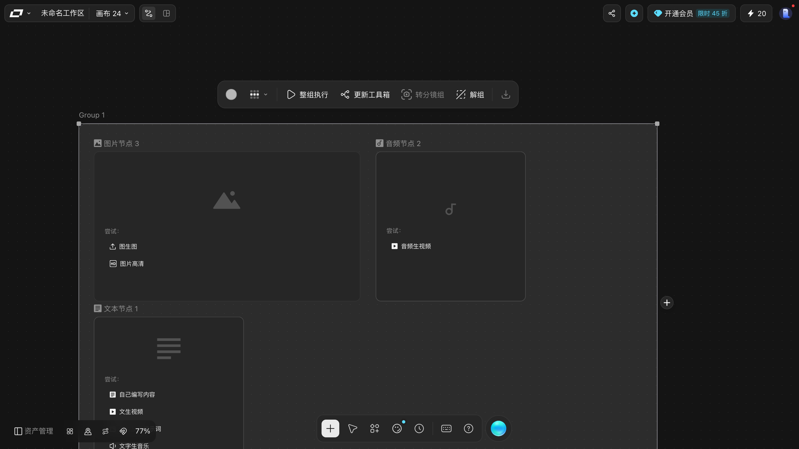

这是最容易错过的一个信号：**同一个组存进工具箱之后，操作条上那一项的文案就从
「添加到工具箱」变成了「更新工具箱」**。

它同时也解释了为什么创建之后「什么都没发生」—— 不是没发生，是**画面上没有给你任何地方去看见它**，
唯一的变化就是这个按钮换了名字。

> ⚠️ **这轮真的建了工具箱**（在一次性测试账号里建了两个）。工具箱是账号级数据、不随画布删除，
> 你自己的正式账号上不会有本手册的测试残留。

---

## 添加资源

添加节点面板底部还有一个独立的「**添加资源**」分区：

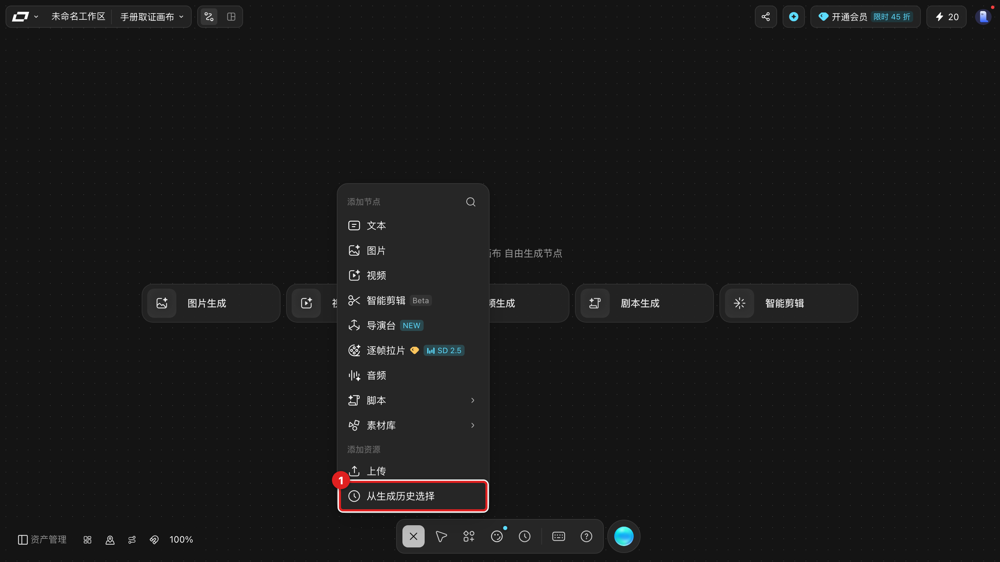

| 入口 | 用途 |
|---|---|
| `上传` | 从本地传文件进画布 |
| `从生成历史选择` | 复用以前生成过的东西 |

「从生成历史选择」点开是一整块**选择弹窗**（不是一个小列表）：

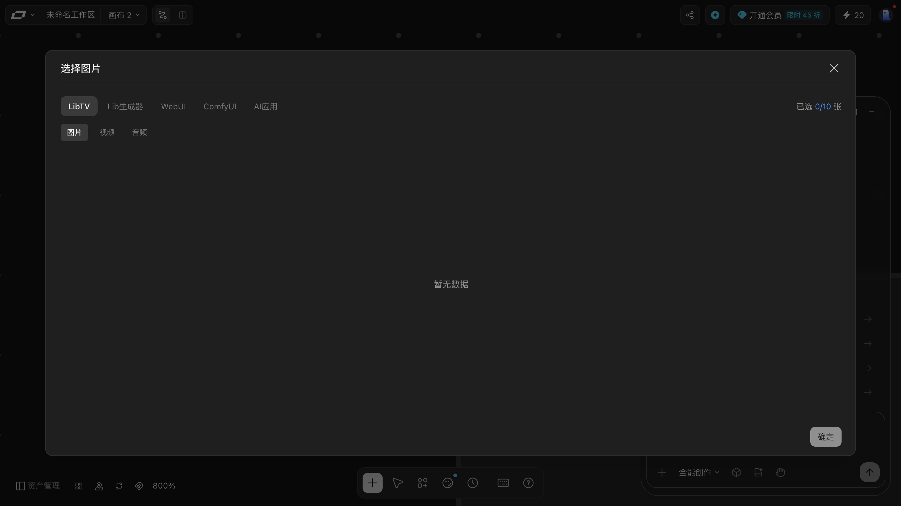

| 位置 | 实测内容 |
|---|---|
| 标题 | `选择图片`（选视频/音频时会跟着变） |
| **来源标签** | `LibTV` · `Lib生成器` · `WebUI` · `ComfyUI` · `AI应用` |
| 计数 | `已选 0/10 张` —— **一次最多选 10 个** |
| 主体 | 没生成过东西时是 `暂无数据` |
| 底部 | `确定` |

> 💡 **五个来源的分类标签并不一样**，点哪个决定你看到哪几类素材：

| 来源 | 分类标签 |
|---|---|
| `LibTV` | `图片` · `视频` · **`音频`** |
| `Lib生成器` | `图片` · `视频` |
| `WebUI` | `图片` · `视频` |
| `ComfyUI` | `图片` · **`音视频`** |
| `AI应用` | `图片` · **`音视频`** |

注意 `LibTV` 那档写的是 `音频`、`ComfyUI` 和 `AI应用` 那两档写的是 `音视频` ——
不是同一个东西。后两者把音频和视频合在一类里。

> ⚠️ 这里有个**手册之前没说、但很重要**的点：来源不止 LibTV 自己，
> **`WebUI` / `ComfyUI` / `AI应用` 说明你可以从外部工具把素材接进来**。
> 本手册只读了标签文案，**没点过任何一个来源** —— 各自怎么接、需不需要配 API Key，都不知道 📖。
> 五个来源本轮**全部显示「暂无数据」**（测试账号从没真正跑过生成）。
>
> 另一个实用推论：计数上限是 **10 张/次**，所以「一次把几十个素材搬进画布」这条路走不通，得分批。

> 📖 历史记录里到底有哪些东西、怎么筛选，本轮仍未展开验证（测试账号从没真正跑过生成），
> 见 [../20-reference.md](../20-reference.md) 的「资产页」。

---

## 在节点里怎么用

素材进入画布之后，用两种方式喂给节点：

1. **连线** —— 把素材节点的出口连到目标节点的入口，见 [connect-nodes.md](connect-nodes.md)；
2. **参考** —— 点节点顶部的 `参考` 按钮手动挑。

风格还有第三条路：图片和视频节点顶部各有一个 `风格` 按钮。

---

## ⚠️ 页面上有两个「上传」，它们不是同一个东西

LibTV 画布里有**两个都叫「上传」的入口**，去的地方完全不同：

| | 「上传」（本页 `添加资源` 分区） | 「上传资产」（资产管理抽屉） |
|---|---|---|
| 位置 | `添加节点` 面板底部 `添加资源` 分区 | 左下角 `资产管理` → `资产` 标签 → `+` → `上传资产` |
| 进去的东西 | **进画布**（变成可用的节点素材） | **进资产库**（变成可分类的资产文件） |
| 点下去立刻弹什么 | 📖 本手册没点 | **不是系统选文件框**，而是「上传资产」表单：先选**保存到哪个文件夹**，再在虚线框里放文件 |
| 格式限制写在哪 | 📖 没打开过 | ✅ **面板底部白纸黑字**：`支持的文件格式 🖼 jpg/jpeg/png ▶ mp4 🔊 mp3`、`单个文件大小不超过 20MB` |
| 必填项 | — | `保存位置 *`（带红星）—— 不填右下角 `保存` 是**禁用**的 |

> ⭐ **想知道上传支持哪些格式，去资产抽屉那个「上传资产」面板看底部那两行字。**
> 那是界面正文，不是推测。
>
> ⚠️ 反过来，**别拿资产库那套格式去推断画布节点的上传** ——
> 两个入口的约束不保证一致（📖 本手册没打开过节点那个）。

完整读数见 [整理画布 · 资产管理：左抽屉](organize-canvas.md#「资产」标签)。

---

## 📖 没有验证的部分

- **节点那个 `上传`**（本页 `添加资源` 分区）的文件格式与体积上限 —— ⛔ 本手册没点；
- **直接点一张「风格」卡片**会发生什么，建出来的风格节点长什么样 ——
  ✅ **特效广场那一侧已结**（点一下就多一个 `素材-特效-<卡名>` 节点，本手册已原样删回）；
  ⛔ 风格广场**本手册没点过**，不猜；
  详情面板里那枚 **`使用`** 按钮点下去会发生什么 ⛔ 本手册**没点**（可能建节点或消耗）——
  ⛔ **特效广场连 `详情` 都没有**，所以那边连「先看清再决定」这条路都没有；
- ~~广场卡片上那个数字的**确切单位**~~ —— ✅ **已结案（Batch DJ）：是 `runCount`，带 `w` 即「万」。**
  证据是**同值匹配**（界面数值逐个对到接口 `feed/stream` 里的 `runCount`），
  见上文「这个数字的字段名查出来了」一节。⭐ **点卡不会让它加 1**（DK 实测，差值 `0`）；
  ⛔ 「什么时候会加」仍未验（真正生成需授权）；
- ~~卡面上曾浮出过的「**全部适配模型**」面板~~ —— ✅ **已结案（Batch DC）**：
  在**风格广场**里，它是**卡面左上角 `✧` 按钮**悬停出来的**可用模型清单**，
  **每次都在**（`257ms` 出现），**不点也会出**。⭐ **DD 查明那组 `Seedance 2.0` /
  `Kling 3.0` / `Kling O3` 是特效广场一张卡的 3 个模型**（DB 轮的「来源不明、已作废」判早了，
  已收回）。见「卡面左上角那枚小按钮」一节；
- ~~那个 `•••` 三点按钮~~ —— ✅ **已结案（Batch DC/DD）**：它就是 `✧`「全部适配模型」入口，
  **两个广场是同一枚**（SVG `d` 完整 96 字符逐字相同）。悬停出模型清单，**点它什么也不发生**；
- ~~特效广场是不是每张都是这一枚~~ —— ✅ **已结案（Batch DF）**：是（`12/12`），
  因为**那边没有单模型卡** —— 12 张每张都列同样那 3 个模型。规律两边同一条；
- ~~分类标签各有多少条内容~~ —— ✅ **已结案（Batch DM）：十个分类全部拿到真数**，
  `推荐` 1086 / `平面设计` 850 / `创意玩法` 826 / `动漫游戏` 823 / `小说推文` 771 /
  `摄影写真` 723 / `风格插画` 738 / `文创周边` 738 / `建筑及室内设计` 645 / `电商营销` 621
  —— 见上文「广场到底有多少张卡」。每个数都过了算式自检。
  ⛔ **下面这张 DI 轮的表整张作废，不要再引用**：
  它数的是**屏幕上 DOM 里有几张卡**，而广场是虚拟滚动（卡会被回收复用），
  所以「8 / 23 / 24 / 25 / 27 / 47 / 52 / 56」量的是**复用池**，
  与内容量完全无关 —— DI 当时把 `风格插画` 的 8 记成了「真数」，是错的：

  | 分类 | DI 轮记的「8 轮内见到」 | 实际 |
  |---|---:|---:|
  | `风格插画` | ~~8（记成真数）~~ | **738** |
  | `动漫游戏` | ~~23~~ | **823** |
  | `推荐` | ~~24~~ | **1086** |
  | `平面设计` | ~~25~~ | **850** |
  | `创意玩法` | ~~27~~ | **826** |
  | `摄影写真` | ~~47~~ | **723** |
  | `电商营销` | ~~52~~ | **621** |
  | `建筑及室内设计` | ~~56~~ | **645** |
- 📖 「全部适配模型」的**上限**是不是 5（只见过 2 / 3 / 5；6 次采样里有 1 次偶发漏读）；
- ~~`全部 ▾` 排序下拉里有哪些选项~~ —— ✅ **已结案：它不是排序，是按模型筛**（见上文）；
- ~~广场**真正的排序入口**（按时间 / 热度 / 价格）~~ —— ✅ **已结案（Batch DE）：界面上没有。**
  全广场可交互元素枚举（风格 743 / 特效 987 个非卡片控件），
  排序类关键词命中 **0**，且**阳性对照通过**（同一枚举抓到了已知的 `全部` 下拉）。
  `全部 ▾` 是**按模型筛**、不是排序。见上文「广场真正的排序入口」一节；
- 工具箱预设「使用」之后落在哪、能不能改。

> ⚠️ 关于格式限制：**资产库那个 `上传资产`** 的限制已经写在界面上（见上文对照表）；
> **节点那个 `上传`** 本手册没打开过，**不编** —— 请以点开后的界面提示为准。

---

## 相关

- [character-studio.md](character-studio.md) —— 角色是另一套独立的库
- [connect-nodes.md](connect-nodes.md) —— 怎么把素材接到节点上
