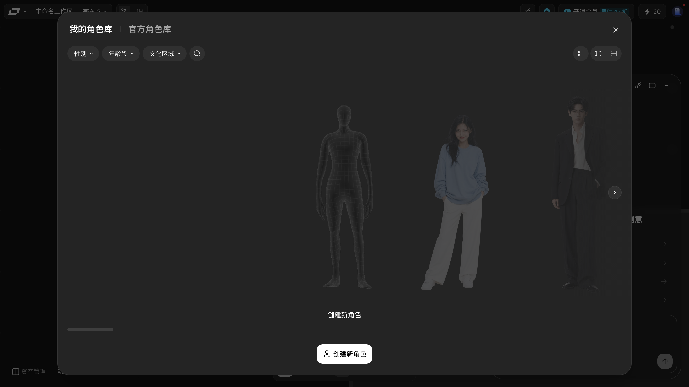

# 角色造型室：建角色、在生成里用角色

> 目标：知道角色库在哪、怎么筛、怎么建自己的角色，以及在哪里用到角色。
> 适用角色：普通创作者 · 验证状态：✅ 面板实跑（创建角色与实际引用未提交验证）

---

> ⚠️ **Batch FM（2026-10-05）补记：这个面板是**横向排布**的，宽度远超屏幕**
>
> 实测读数：面板容器的 class 是
> `absolute left-1/2 top-0 flex h-[434px] w-max will-change-transform`，
> 框 **`[597, 186, 5904, 434]`** —— ⭐ **宽 5904 像素**（`w-max` 让它按内容撑开），
> 而视口只有 1440 宽。
> ⇒ ⭐ **你要找的角色多半在屏幕外**，得**横向拖动或滚轮**才看得到。
>
> ⭐ 那一屏里能看到的 16 个角色分类名是：
> `甜妹/清新少女` · `霸总/精英大佬` · `温柔熟男/理想男友` · `清冷千金/白切黑女主` ·
> `古风男主` · `古风女主` · `恶毒女配/白莲花` · `正派长辈/父` · `正派长辈/母` ·
> `反派长辈/势利亲戚` · `生活方式普通人` · `时尚感亚洲男生` · `时尚感亚洲女生` ·
> `时尚感欧美男生` · `时尚感欧美女生` · `小男孩` · `小女孩`
>
> ⭐⭐ 顺带一个有意思的读数：这 16 个分类名**在产品自带的文案表里一条都没有**
> （见 [参考表](../20-reference.md) 里那张 8189 条的清单）。
> ⇒ 它们多半是**接口返回的数据**，不是写在前端代码里的文案。
> ⛔ **本手册没查过接口**，不知道它们从哪来、能不能变。

## 打开

点底部工具条的「**角色造型室**」（四个小人的图标，无障碍名就是「角色造型室」）。

> ⚠️ 这个面板**带一层全屏遮罩**（`bg-black/60`，铺满视口），会把画布整个压住。
> **关它只能点它自己右上角那枚 `×`**（无障碍名「关闭」）——
> 本轮按 `Esc` **两次都没关掉**。这个坑在早期批次就踩过，这里再强调一次。

## 面板结构 ✅

### 两个库（顶部标签）

| 库 | 内容 |
|---|---|
| **我的角色库** | 你自己建的角色 |
| **官方角色库** | 平台提供的角色 |

### 三个筛选 + 搜索

| 控件 | 无障碍名 |
|---|---|
| `性别 ▾` | — |
| `年龄段 ▾` | — |
| `文化区域 ▾` | — |
| 🔍 搜索 | **`搜索角色名称或描述`**（注意：这是 aria，不是 placeholder） |

三组筛选可以叠加使用，用来快速缩小角色列表。

### 右上角是**三枚**图标，不是三视图

| 图标 | 无障碍名 | 说明 |
|---|---|---|
| 勾选列表 | `多选` | 进入多选 |
| 列表 | `列表模式` | **默认**，高亮态 |
| 宫格 | `宫格模式` | 另一种排布 |

> ⚠️ 早期版本的这一节写的是「**列表 / 大卡片 / 网格三种视图**」——
> **这是错的**。面板里只有**两种**模式（`列表模式` / `宫格模式`），
> 加上左边那枚 `多选` 一共三枚图标。已按实测更正。

### 内容区

角色**横向排成一条**，可横向滚动（底部有一条滚动条），右侧浮着一枚 `›` 翻页按钮。

**这个库不是空的。** 本轮在「我的角色库」里读到 **23 张角色大图**
（每张 `244×434` 的预览图，`alt` 全是空字符串——**角色卡没有文字描述**）。
最左边那一张是**线框人偶占位卡**，下面写着「创建新角色」；
右边跟着真人形象，角色一路往右铺开（DOM 里一共 **23 张**，前面的多半在你视口外），
右侧浮着一枚 `›`，底部有一条**横向滚动条**。

### 创建

底部中央的白色「**创建新角色**」按钮（`116×40`）。面板上实测出现**两处**同名文案：

- 一处在**线框人偶占位卡下面**（那本身就是入口卡）；
- 一处是**底部中央那枚按钮**。

> 早期版本推测这是「一个用于新建、一个用于从外部导入」——
> 实测看下来更像是**同一件事的两个入口**（占位卡 + 底部按钮），但本手册
> **两个都没点**（会写入账户数据），所以不下定论 📖。

> 本轮**没有真正建过角色**，因为创建会写入账户数据。表单字段与流程属于 📖 推断。

---

## 角色在哪里用

在**视频节点**的顶部工具条里有一个 `角色库` 按钮：

点它把角色接进这个节点。

> 📖 角色库是否也能在图片节点里用，本轮没有验证 —— 图片节点的顶部工具实测是 `参考` `标记` `风格`，**没有** `角色库`。

---

## 取消与恢复

- 筛选条件没清掉：把三个筛选都重置即可回到全量。
- 建了不想要的角色：📖 本轮未验证角色删除入口。

---

## 相关

- [asset-library.md](asset-library.md) —— 风格与特效也在素材库里
- [create-nodes.md](create-nodes.md) —— 节点类型总览
