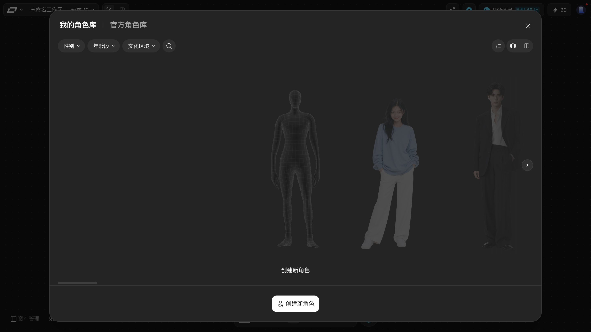

# 角色造型室：建角色、在生成里用角色

> 目标：知道角色库在哪、怎么筛、怎么建自己的角色，以及在哪里用到角色。
> 适用角色：普通创作者 · 验证状态：✅ 面板实跑（创建角色与实际引用未提交验证）

---

## 打开

点底部工具条的「**角色造型室**」（四个小人的图标，`data-sidebar-btn="character-library"`）。

> 这个面板会**铺满整个画布**（`h-screen w-screen`），关掉时要用它右上角自己的 `×`，
> 按 `Esc` 不一定管用 —— 本轮实测按 `Esc` 没关掉。

## 面板结构 ✅

### 两个库（顶部标签）

| 库 | 内容 |
|---|---|
| **我的角色库** | 你自己建的角色 |
| **官方角色库** | 平台提供的角色 |

### 三个筛选 + 搜索

| 控件 | 说明 |
|---|---|
| `性别 ▾` | 下拉筛选 |
| `年龄段 ▾` | 下拉筛选 |
| `文化区域 ▾` | 下拉筛选 |
| 🔍 | 搜索框 |

三组筛选可以叠加使用，用来快速缩小角色列表。

### 右上角的视图切换

筛选行右端有三个小图标，是**列表 / 大卡片 / 网格**三种浏览方式的切换。

### 内容区

角色以大图形式横排展示，右侧有 `›` **翻页**按钮。

本轮实测「我的角色库」是**空的**，空状态文案是「**创建新角色**」。

### 创建

底部中央的「**创建新角色**」按钮。面板上实测出现**两张**同名卡片 —— 也就是两个创建入口，一个用于新建、一个可能用于从外部导入（📖 具体分工未验证）。

> 本轮**没有真正建过角色**，因为创建会写入账户数据。表单字段与流程属于 📖 推断。

---

## 角色在哪里用

在**视频节点**的顶部工具条里有一个 `角色库` 按钮：

点它把角色接进这个节点。

> 📖 角色库是否也能在图片节点里用，本轮没有验证 —— 图片节点的顶部工具实测是 `参考` `标记` `风格`，**没有** `角色库`。

---

## 取消与恢复

- 筛选条件没清掉：把三个筛选都重置即可回到全量。
- 建了不想要的角色：📖 本轮未验证角色删除入口。

---

## 相关

- [asset-library.md](asset-library.md) —— 风格与特效也在素材库里
- [create-nodes.md](create-nodes.md) —— 节点类型总览
