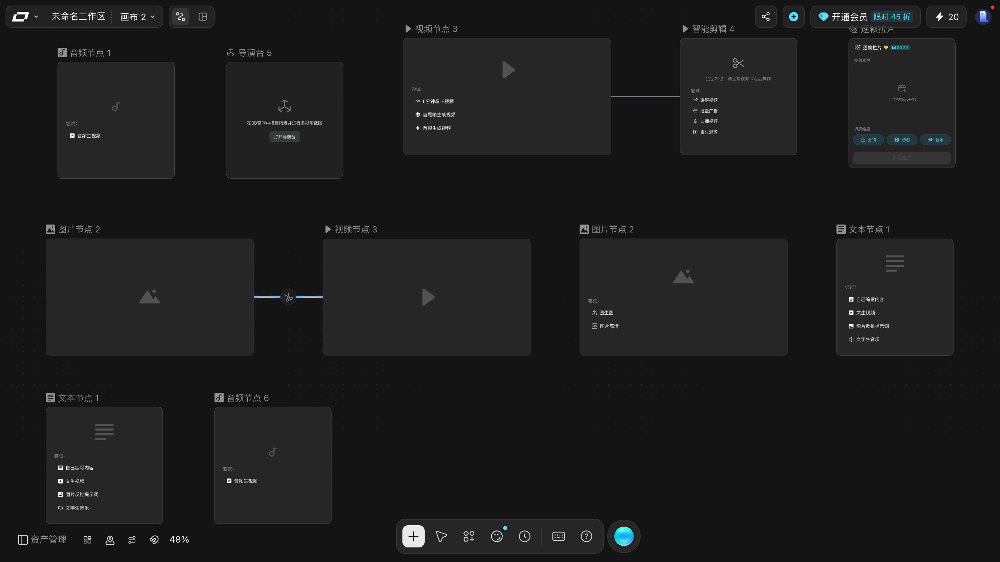
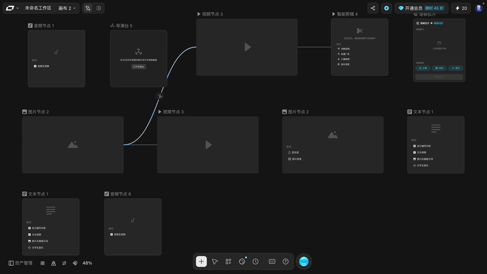
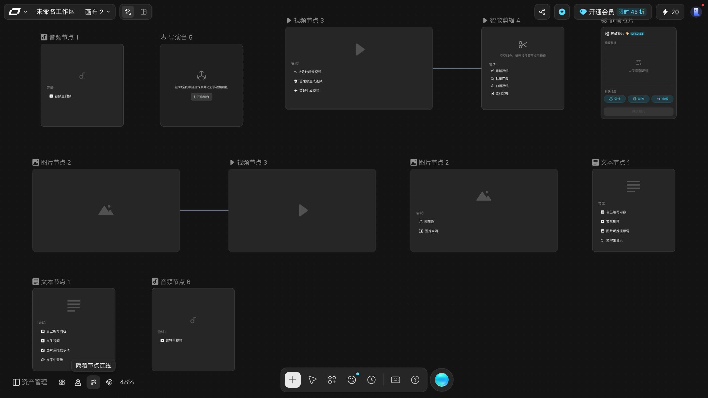

# 连接节点：把上游的产物喂给下游

> 目标：会用连线把两个节点串起来，并理解连线到底传的是什么。
> 适用角色：普通创作者 · 验证状态：✅ 实跑（2026-10-01 连线成立、2026-10-02 断线成立，两者都经 DOM 与连线数双重确认）

## 前置条件

- 画布上至少有**两个**节点。

---

## 第 1 步：认识两个端口

每个节点卡片左右各有一个圆形端口：

| 位置 | 含义 | DOM |
|---|---|---|
| 左侧圆环 | **入口**：接收上游产物 | `.react-flow__handle-left` · `data-handleid="target"` · `data-handlepos="left"` |
| 右侧圆环 | **出口**：送出本节点产物 | `.react-flow__handle-right` · `data-handleid="source"` · `data-handlepos="right"` |

规则就一条：**右出左进**。

### ⭐ 本轮把 11 个节点的端口全量盘了一遍

之前只知道「左右各一个」。本轮逐个节点读 DOM，结论更硬：

| 观察项 | 实测 |
|---|---|
| 端口数量 | **每个节点恰好 2 个**（11/11 个节点都是） |
| 入口 | `data-handleid="target"`，class 含 `react-flow__handle-left` · **`connectable`** |
| 出口 | `data-handleid="source"`，class 含 `react-flow__handle-right` · **`connectable`** |
| 出口光标 | `crosshair`（十字）—— **只有一个例外**：`逐帧拉片` 的出口是 **`grab`（抓手）** |
| 入口光标 | 全部 `crosshair` |
| 位置 | 入口贴节点**左边界**，出口贴**右边界**（坐标完全对得上，不是猜的） |

> 💡 **光标就是最好的确认方式**：鼠标移到口上变成十字，就说明落对了。
> 唯一要留神的是**逐帧拉片**的出口 —— 它是抓手光标，
> 第一次拖可能以为是平移画布。

#### ⭐ 端口平时是**看不见**的，鼠标移上去或选中节点才现形

端口外面挂着三层：

| 层 | 尺寸 | 作用 |
|---|---|---|
| 端口元素本身 | **`0×0`** | 定位用，`display:block` 但没有尺寸 |
| 里第一层 | **`80×80` 圆形** | ⭐ **这就是可点区**（`pointer-events: auto`） |
| 里第二层 | **`20×20` 图标** | 一个圆圈里一个加号，**但默认 `opacity: 0`** |

也就是说**平时那个加号是隐形的**。**把鼠标移到节点边缘，或者点选节点**，它才会出现：

> ⭐ **是「谁被指着，谁亮」，不是「一开全亮」。**
> 上面这张图里，同一瞬间里有的节点亮、有的不亮 —— 所以「这个节点没有出口」通常是错觉，
> 你只是**还没指到它**。

> 💡 所以找不到端口不用慌 —— **鼠标划过去它就冒出来了**，不必先点选。
> 而且因为可点区是 **80×80**，**不需要精确对准那个小圆点**：
> **节点左右边缘往外一带的 80 像素范围，随便点都能起线。**
>
> 📖 `80×80` 与 `opacity: 0` 都是**从 DOM 量出来的**，不是估的。
> ⭐ 显形规则是**四个状态各读一次**坐实的，同一个口从外到内读数：
>
> | 状态 | 选中数 | 那枚 ⊕ 的 `opacity` |
> |---|---|---|
> | 鼠标停在画布角落 | 0 | `0` |
> | 悬停在**别的**节点的口上 | 0 | `0` |
> | **悬停本节点的口**（没点） | 0 | **`1`** |
> | 已点选本节点 | 1 | **`1`** |
>
> 注意第二行：**光标在别的节点上时，这个节点仍然是灭的** —— 逐节点点亮，不是全局开关。

## 第 2 步：拖出连线

1. 把鼠标移到上游节点**右侧**的圆环上（光标变成十字）；
2. 按住左键拖动，会拉出一条**发光的蓝色曲线**跟随光标；
3. 拖到下游节点**左侧**的圆环上 —— 这时会高亮；
4. 松手。

把视野缩到 50%，两张卡和整条线可以同时看全：

> ⚠️ **拖动过程中会多出一条临时的「幽灵连线」**，
> 松手成功它变成正式连线；**松手失败它会自己消失，不会留下垃圾**。
> 本轮有一次拖动在 DOM 里数到了 2 条，**刷新后仍是 1 条** ——
> 那条临时的没有落盘。

### ⭐ 拖不动的时候，先看有没有「幽灵连线」

连线断了不一定是你操作错了，也可能是**这一对根本连不上**。区分办法只有一个：
**拖到一半看有没有那条跟着光标的蓝色曲线**。

| 拖到一半的现象 | 说明 |
|---|---|
| 有蓝色曲线跟手 | 拖拽**已经启动**了，成不成立看**松手那一下** |
| 完全没有曲线 | 手势**根本没被识别** —— 多数是没对准端口（可点区 80×80，一般不会），少数是这一对节点不能连 |

> 💡 实例：**同一对节点之间连不出第二根线。**
>
> 这一条做过**阳性 + 阴性配成一对**的对照 —— 两次拖的是**完全相同的动作**，
> 连手势、坐标、时长都一样，唯一变化的是「这一对已经连过了」：
>
> | | 拖到一半 | 松手之后 |
> |---|---|---|
> | 第 1 遍（还没连过） | 预览线出现 | 连线数 **+1**，新边出现 |
> | 第 2 遍（已经连过） | **预览线照样出现** | 连线数 **不变**，没有新边 |
>
> ⭐ 两次预览线都出现，说明**手势两次都被识别了**，差别只发生在「松手」那一刻。
>
> ⚠️ 而**界面不会告诉你为什么**：
> 松手时**没有弹窗、落点也不变色**（落点处的 `valid` / `connectable` 类名两次都是空的）。
> 表现就是「拖了半天，松手，什么也没发生」——
> **先确认是不是这一对已经连过了**，这是最常见的原因。
>
> 连线传的东西、断开的方法，分别见上面的
> [连线传的是什么](#连线传的是什么) 和[断开连线](#断开连线)。

## 第 3 步：确认连上了

**成功判据**（三条，任一即可）：

1. 两个节点之间出现一条连线；
2. 下游节点入口旁多出一个**蓝色小加号**；
3. 下游节点的状态文案变了 —— 比如智能剪辑节点从「空空如也，请连接视频节点后操作」变成可用。

> **连线不会自动执行任何东西**。它表达的是「我做完的结果你可以拿去用」，真正跑起来仍要各自点提交。

### 怎么确认「连的是我以为的那两个」

连线本身**不显示两端的名字**，光看画面容易连错。本手册这张画布上的那条连线是
**图片节点 → 视频节点**，方向是**从左边的图片节点指向右边的视频节点**。

> 💡 **判断方向**：连线的曲线从**出口**（右）出去，绕进**入口**（左）。
> 出线的一端在源节点的**右边**，进线的一端在目标节点的**左边**。
> 搞不清时顺着曲线看哪一头贴着节点的左边，那头就是入口。

## 不想拖端口？用 `⌘L`

框选**两个及以上**节点后按 `⌘L`，实测**连线数从 0 变成 1** —— 一步连好，不用去对端口。

前置条件是**多选**，所以顺序是：

1. `Shift` + 空白处拖，把两个节点框进去（见 [create-nodes.md](create-nodes.md) 的「框选」）；
2. 按 `⌘L`。

> ⚠️ 只选中一个节点时按 `⌘L` 没有任何反应（实测连线数 0 → 0）。
> `⌘L` 会按**连线方向**把选中节点依次串起来，所以框选的顺序可能影响谁在上游；本轮没逐一验证方向的判定规则 📖。
>
> 💡 **`⌘L` 是「加线」，不是「断线」。** 它在快捷键面板上就写着「连线」两个字。
> 本手册早先有一轮把「找不到断线入口」的责任算到 `⌘L` 头上、试了八种按法，
> 真正的原因是**一直在按连接快捷键找断开功能**。
> 断线在哪，见下面的[断开连线](#断开连线)。

---

## 连线传的是什么

这是新手最容易含糊的一点。界面上只有一根线，**没有文字说明**，但实际上有两条并行的通道：

| 通道 | 怎么用 | 作用 |
|---|---|---|
| **连线** | 拖端口 | 传递上游节点的产物（图片给视频、音频给剪辑…） |
| **参考 / 上传** | 节点顶部的 `参考` 按钮 | 把外部素材喂进这个节点 |

一个节点可以同时用这两条通道：连一个上游自动拿产物，再点 `参考` 补几张自己的素材。

### 提示词里的 `@`

视频节点的提示词框占位文案写的是「描述你想要生成的画面内容，**@引用素材**」，音频节点写的是「**@ 引用音频**」。也就是说提示词里可以直接 `@` 引用节点上的素材，不必手动搬运。

---

## 排线技巧

节点堆在一起时连线会很难看，用这两个：

- **整理画布** `⌥⇧F` —— 按依赖关系把节点铺开。⚠️ 整理完会弹「是否保留此次整理结果？」，**要点「保留」**。
- **隐藏节点连线** —— 底部工具条那个按钮，连线太密时先关掉，专心摆节点。

## 断开连线

把鼠标**移到**连线上（**不用先选中**），那根线会亮成浅蓝，中点浮出一枚**圆形剪刀**。**点它一下就断。**

### 断了会怎样

| 观察项 | 实测 |
|---|---|
| 要不要确认 | **不要**。点完直接少一条线，没有弹窗、没有提示条 |
| 能不能反悔 | ⭐ **能**。断了之后按 `⌘Z`，**那根线原样接回来**（实测 `3 → 2` 条，按撤销回到 `3` 条，接回来的还是原来那一条） |
| 是真断了还是只是没画出来 | ⭐ **真断了**。断完刷新页面，断掉的线不会自己回来 |

下面这两张是同一条线的**断开前 / 断开后**。断的那条是斜着穿过画布的那根，
断完之后它消失了，而另外两条原有连线纹丝不动：

> 💡 **断线有两条路，随便挑一条。**
>
> | 做法 | 实测 |
> |---|---|
> | 悬停 → 点中点那枚**剪刀** | 连线数 −1 |
> | **点一下选中**连线 → 按 `Delete` 或 `Backspace` | 连线数 **−1**（两个键都试过，都断） |
>
> ⚠️ 两种都**没有确认框、也没有提示条**。
> 好在 `⌘Z` 能接回来，所以不用怕，但**断之前先看一眼是哪一根**。
>
> ⭐ 选中这条路要先点中线才能用 ——
> 读数是**点一下之后线上确实进了选中态**（不是「点了没反应」）才按的键。
> `Delete` 和 `Backspace` 是分别试的，两个都断；
> 而快捷键面板上**没有**为它们写「删除连线」，只写了一个笼统的「删除 ⌫」。

### ⭐⭐ 这枚剪刀为什么「像是找不到」

这不是你的问题，是它真的很难被「找」到。四条实测：

| 它是什么样 | 后果 |
|---|---|
| 标签是 `div`，**不是** `<button>` | **没有** `aria-label`、没有 `title`、没有 `role`，不会出现在任何按钮列表里 —— 拿「数按钮」的办法去查，命中数永远是 **0** |
| **只在指针悬停时挂载** | 指针一移开，DOM 里就查不到它了（实测：悬停时 1 个 / 移开后 0 个） |
| 藏在 `foreignObject` 里 | 按标签名或按可见区域去找都容易漏 |
| 样式是 48×48 的圆 | 48% 缩放下屏幕上只有 23×23，小但不难点 |

> 📖 这四条解释了本手册**早先为什么把它记成「读不准的元素、无法确认」**：
> 当时有一次读到了这个元素，换一轮就再也读不到。
> 真相不是它一闪而过，而是**读数的时机不对** —— 指针已经移开了，它也就卸载了。
>
> ⭐ 所以这里的方法值得记下来：**找不到某个东西时，先问「我是按什么在找的」**。
> 本例中「按按钮找」和「在不悬停时找」这两条路都不可能命中。

### 连错了怎么办

1. **先按 `⌘Z`** —— 实测能把线原样接回来，这是最省事的；
2. 撤销过头了（比如刚接上的又想断掉），再按 `⌘Z` 继续往回走；
3. 实在撤不回来，再考虑删掉下游节点重建 —— 这条路是通的（见 [create-nodes.md](create-nodes.md)），代价是节点上的设置会一起没。

> ⚠️ 别用 `⌘A`+`⌫` 去「只删一根线」—— 那是**删光全部节点**。

## 取消与恢复

- 连错了：按上面的「断开连线」断掉重连；断错了按 `⌘Z` 接回来。
- 节点建多了：见 [create-nodes.md](create-nodes.md) 的取消与恢复。

## 相关

- [create-nodes.md](create-nodes.md) —— 先把节点建出来
- [generate-media.md](generate-media.md) —— 连上之后怎么跑
- [organize-canvas.md](organize-canvas.md) —— 把线理顺
