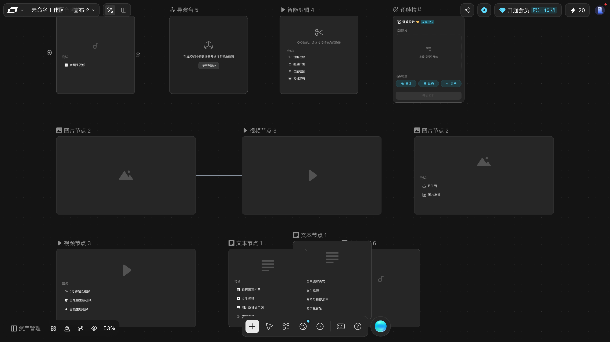
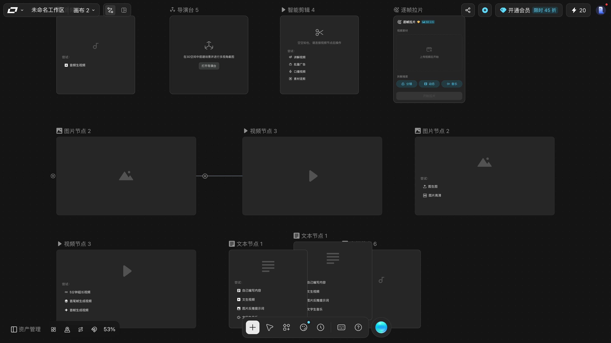
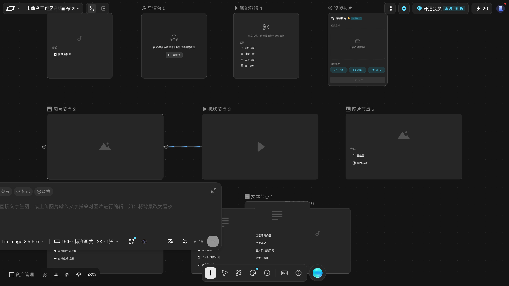
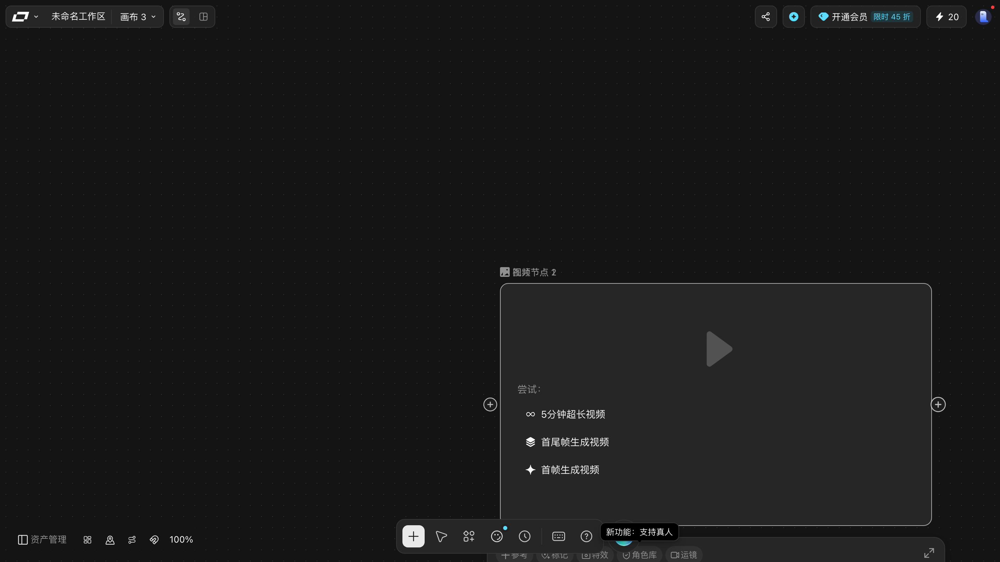
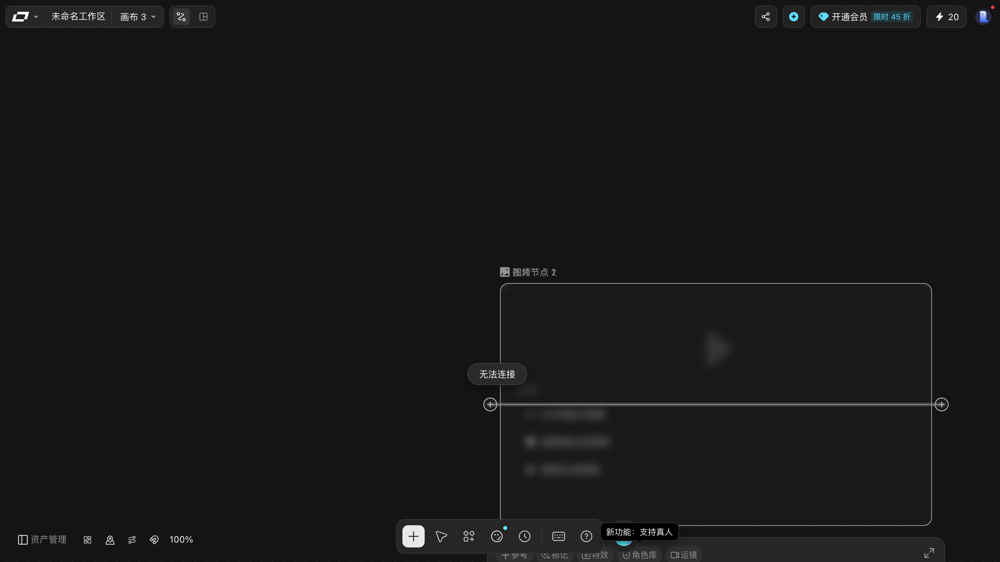
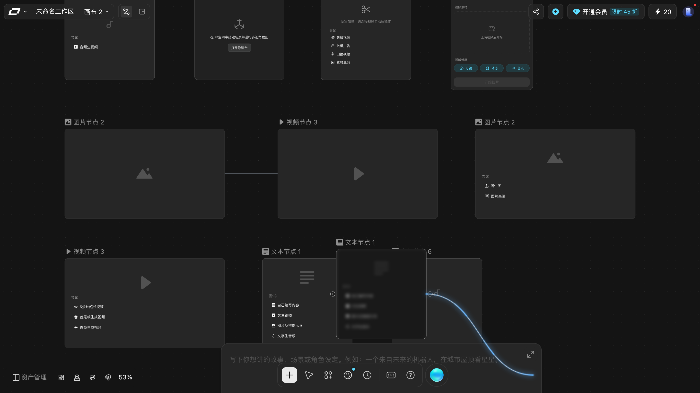
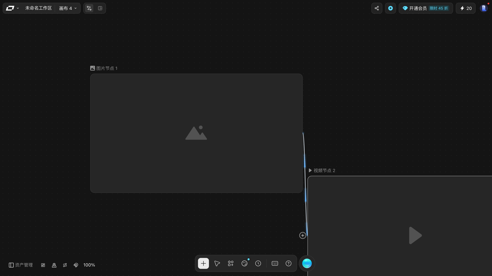
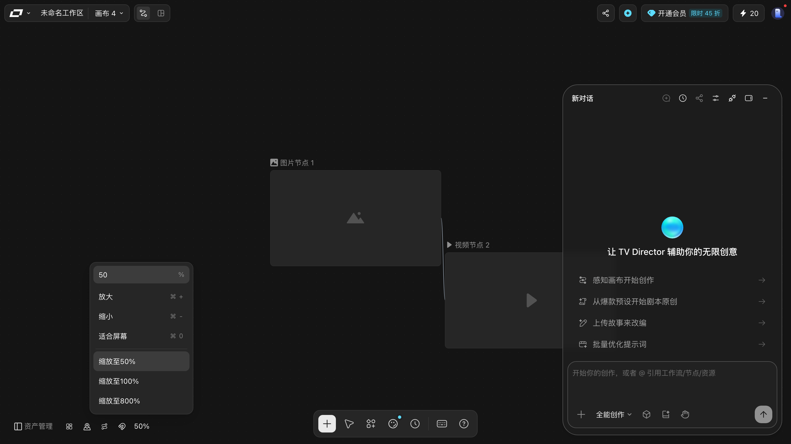
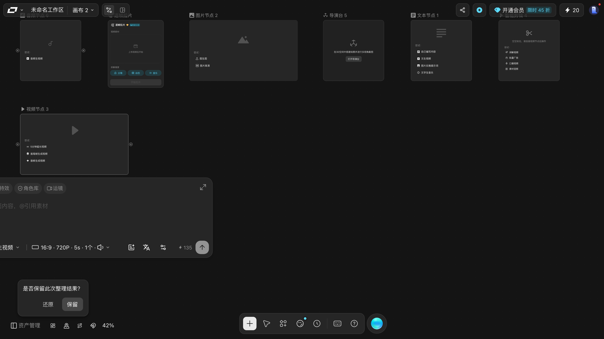

# 连接节点：把上游的产物喂给下游

> 目标：会用连线把两个节点串起来，并理解连线到底传的是什么。
> 适用角色：普通创作者 · 验证状态：✅ 实跑（2026-10-01，连线成立经 DOM 与边数双重确认）

## 前置条件

- 画布上至少有**两个**节点。

---

## 第 1 步：认识两个端口

每个节点卡片左右各有一个圆形端口：

| 位置 | 含义 | DOM |
|---|---|---|
| 左侧圆环 | **入口**：接收上游产物 | `.react-flow__handle-left` · `data-handleid="target"` · `data-handlepos="left"` |
| 右侧圆环 | **出口**：送出本节点产物 | `.react-flow__handle-right` · `data-handleid="source"` · `data-handlepos="right"` |

规则就一条：**右出左进**。

### ⭐ 本轮把 11 个节点的端口全量盘了一遍

之前只知道「左右各一个」。本轮逐个节点读 DOM，结论更硬：

| 观察项 | 实测 |
|---|---|
| 端口数量 | **每个节点恰好 2 个**（11/11 个节点都是） |
| 入口 | `data-handleid="target"`，class 含 `react-flow__handle-left` · **`connectable`** |
| 出口 | `data-handleid="source"`，class 含 `react-flow__handle-right` · **`connectable`** |
| 出口光标 | `crosshair`（十字）—— **只有一个例外**：`逐帧拉片` 的出口是 **`grab`（抓手）** |
| 入口光标 | 全部 `crosshair` |
| 位置 | 入口贴节点**左边界**，出口贴**右边界**（坐标完全对得上，不是猜的） |

> 💡 **光标就是最好的确认方式**：鼠标移到口上变成十字，就说明落对了。
> 唯一要留神的是**逐帧拉片**的出口 —— 它是抓手光标，
> 第一次拖可能以为是平移画布。

#### ⭐ 端口平时是**看不见**的，鼠标移上去或选中节点才现形

端口外面挂着三层：

| 层 | 尺寸 | 作用 |
|---|---|---|
| 端口元素本身 | **`0×0`** | 定位用，`display:block` 但没有尺寸 |
| 里第一层 | **`80×80` 圆形** | ⭐ **这就是可点区**（`pointer-events: auto`） |
| 里第二层 | **`20×20` 图标** | 一个圆圈里一个加号，**但默认 `opacity: 0`** |

也就是说**平时那个加号是隐形的**。**把鼠标移到节点边缘，或者点选节点**，它才会出现：

> ⭐ **是「谁被指着，谁亮」，不是「一开全亮」。**
> 上面这张图里，同一瞬间里有的节点亮、有的不亮 —— 所以「这个节点没有出口」通常是错觉，
> 你只是**还没指到它**。

> 💡 所以找不到端口不用慌 —— **鼠标划过去它就冒出来了**，不必先点选。
> 而且因为可点区是 **80×80**，**不需要精确对准那个小圆点**：
> **节点左右边缘往外一带的 80 像素范围，随便点都能起线。**
>
> 📖 `80×80` 与 `opacity: 0` 都是**从 DOM 量出来的**，不是估的。
> ⭐ 显形规则是**四个状态各读一次**坐实的，同一个口从外到内读数：
>
> | 状态 | 选中数 | 那枚 ⊕ 的 `opacity` |
> |---|---|---|
> | 鼠标停在画布角落 | 0 | `0` |
> | 悬停在**别的**节点的口上 | 0 | `0` |
> | **悬停本节点的口**（没点） | 0 | **`1`** |
> | 已点选本节点 | 1 | **`1`** |
>
> 注意第二行：**光标在别的节点上时，这个节点仍然是灭的** —— 逐节点点亮，不是全局开关。

## 第 2 步：拖出连线

1. 把鼠标移到上游节点**右侧**的圆环上（光标变成十字）；
2. 按住左键拖动，会拉出一条**发光的蓝色曲线**跟随光标；
3. 拖到下游节点**左侧**的圆环上 —— 这时会高亮；
4. 松手。

把视野缩到 50%，两张卡和整条线可以同时看全：

> ⚠️ **拖动过程中会多出一条临时的「幽灵连线」**，
> 松手成功它变成正式连线；**松手失败它会自己消失，不会留下垃圾**。
> 本轮有一次拖动在 DOM 里数到了 2 条，**刷新后仍是 1 条** ——
> 那条临时的没有落盘。

## 第 3 步：确认连上了

**成功判据**（三条，任一即可）：

1. 两个节点之间出现一条连线；
2. 下游节点入口旁多出一个**蓝色小加号**；
3. 下游节点的状态文案变了 —— 比如智能剪辑节点从「空空如也，请连接视频节点后操作」变成可用。

> **连线不会自动执行任何东西**。它表达的是「我做完的结果你可以拿去用」，真正跑起来仍要各自点提交。

### 怎么确认「连的是我以为的那两个」

连线本身**不显示两端的名字**，光看画面容易连错。本手册这张画布上的那条连线是
**图片节点 → 视频节点**，方向是**从左边的图片节点指向右边的视频节点**。

> 💡 **判断方向**：连线的曲线从**出口**（右）出去，绕进**入口**（左）。
> 出线的一端在源节点的**右边**，进线的一端在目标节点的**左边**。
> 搞不清时顺着曲线看哪一头贴着节点的左边，那头就是入口。

## 不想拖端口？用 `⌘L`

框选**两个及以上**节点后按 `⌘L`，实测**连线数从 0 变成 1** —— 一步连好，不用去对端口。

前置条件是**多选**，所以顺序是：

1. `Shift` + 空白处拖，把两个节点框进去（见 [create-nodes.md](create-nodes.md) 的「框选」）；
2. 按 `⌘L`。

> ⚠️ 只选中一个节点时按 `⌘L` 没有任何反应（实测连线数 0 → 0）。
> `⌘L` 会按**连线方向**把选中节点依次串起来，所以框选的顺序可能影响谁在上游；本轮没逐一验证方向的判定规则 📖。

---

## 连线传的是什么

这是新手最容易含糊的一点。界面上只有一根线，**没有文字说明**，但实际上有两条并行的通道：

| 通道 | 怎么用 | 作用 |
|---|---|---|
| **连线** | 拖端口 | 传递上游节点的产物（图片给视频、音频给剪辑…） |
| **参考 / 上传** | 节点顶部的 `参考` 按钮 | 把外部素材喂进这个节点 |

一个节点可以同时用这两条通道：连一个上游自动拿产物，再点 `参考` 补几张自己的素材。

### 提示词里的 `@`

视频节点的提示词框占位文案写的是「描述你想要生成的画面内容，**@引用素材**」，音频节点写的是「**@ 引用音频**」。也就是说提示词里可以直接 `@` 引用节点上的素材，不必手动搬运。

---

## 排线技巧

节点堆在一起时连线会很难看，用这两个：

- **整理画布** `⌥⇧F` —— 按依赖关系把节点铺开。⚠️ 整理完会弹「是否保留此次整理结果？」，**要点「保留」**。
- **隐藏节点连线** —— 底部工具条那个按钮，连线太密时先关掉，专心摆节点。

## 断开连线

⚠️ **这一节要老实说：断线入口本手册没找到** 📖。
不要照着「选中线按删除」去试 —— **试了也没用**，下面有实测。

### ⭐ `⌘L` 只证实了「能加线」，**没证实能断线**

`⌘L` 确实能**连**上线（实测 `0 → 1` 条）。但反过来**断不了** ——
本手册一共试了下面这些条件，**每一项的连线数都纹丝不动**：

| 试过的条件 | 结果 |
|---|---|
| 选中**上游**节点按 `⌘L` | 连线数不变 |
| 选中**下游**节点按 `⌘L` | 连线数不变 |
| **`Shift` 选中两个端点**再按 `⌘L`（读数自证：确实选中了 2 个） | 连线数不变 |
| **点中连线本身**再按 `⌘L`（读数自证：连线确实进了选中态） | 连线数不变 |
| 连按**两次** `⌘L` | 两次都没断 |
| `⌘⇧L` / `⌘⌥L` / `⌥L` 三个变体 | 全部无效 |

> ⚠️ 顺便更正一句容易想当然的话：**能加不等于能断**。
> 一个键帽写在快捷键面板上，只说明产品**想**让你这么用。
>
> ### 那线上的删除按钮呢？
>
> 有一次取证读到过悬停连线时落点上是一个 class 名带 `scissors`（剪刀）的元素，
> 看起来正是断线入口。**但换一轮就再也读不到了** ——
> 同一坐标下，有时是连线的 `path`，有时是一个 class 为空的 `DIV`，
> 而直接去查 `[class*="scissors"]` 时**一个都查不到**（0 个）。
>
> 所以它是**一闪而过、读不准的元素**，本手册**无法确认**它是不是断线按钮，
> 也就**不能拿它当办法教给你** 📖。
>
> ### 那连错了怎么办
>
> **本手册没找到可靠的断线办法**。可行的替代是**先删掉下游节点、重新建一个再连** ——
> 这条路是通的（`⌘A`+`⌫` 可删节点，见
> [create-nodes.md](create-nodes.md)），代价是节点上的设置会一起没。
>
> ⚠️ 别用 `⌘A`+`⌫` 去「只删一根线」—— 那是**删光全部节点**。

## 取消与恢复

- 连错了：选中线删掉，重连。
- 节点建多了：见 [create-nodes.md](create-nodes.md) 的取消与恢复。

## 相关

- [create-nodes.md](create-nodes.md) —— 先把节点建出来
- [generate-media.md](generate-media.md) —— 连上之后怎么跑
- [organize-canvas.md](organize-canvas.md) —— 把线理顺
