# 创建节点：九类节点与它们各自能调什么

> 目标：知道该建哪种节点，建完之后每个旋钮是干什么的。
> 适用角色：普通创作者 · 验证状态：✅ 九类节点全部实跑建出；⚠️ **一次都没有提交过生成**

## 两种建节点的入口

| 入口 | 操作 | 节点落点 |
|---|---|---|
| 添加节点面板 | 点底部工具条最左的「+」 | 固定落在同一个位置 |
| 双击画布 | 在空白处**双击**，再选类型 | **锚在双击点** |

两种入口弹出的是**同一个面板**（下方那张图就是双击弹出的），只是锚点不同。想把节点摆到画布某个特定位置，用双击。

---

## 面板结构

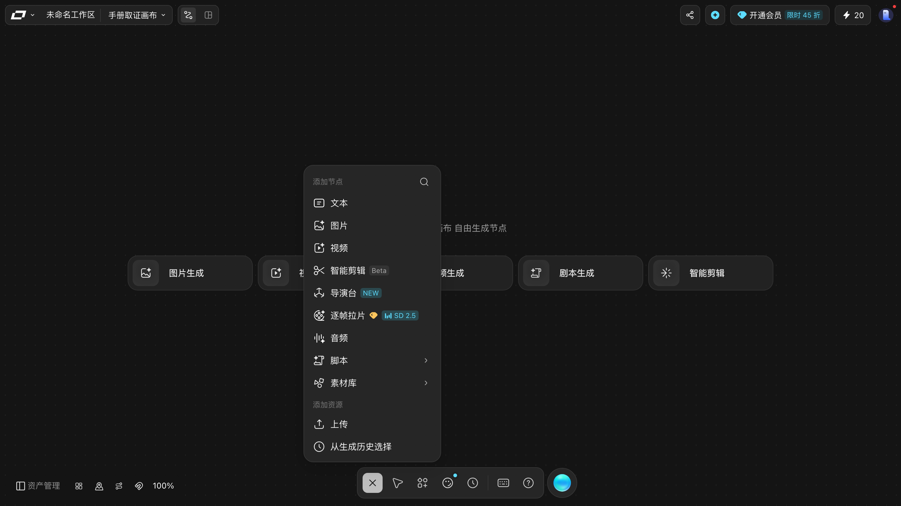

- 顶部有搜索框（无障碍名「搜索画布节点」）；
- 九类节点；
- 底部「**添加资源**」分区：`上传` · `从生成历史选择`。

每一类长这样（下图依次高亮）：

| 文本 | 图片 |
|---|---|
| 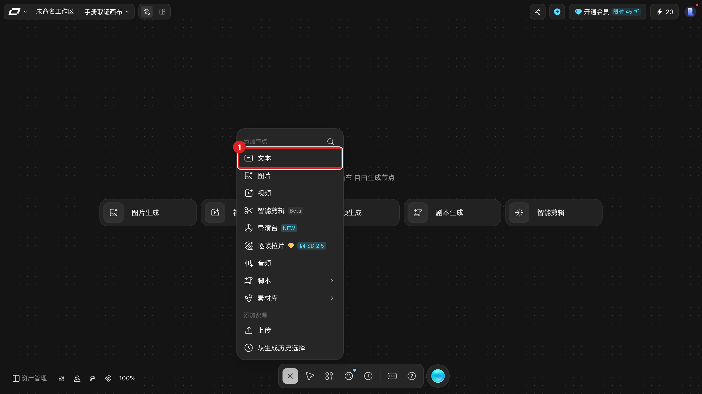 | 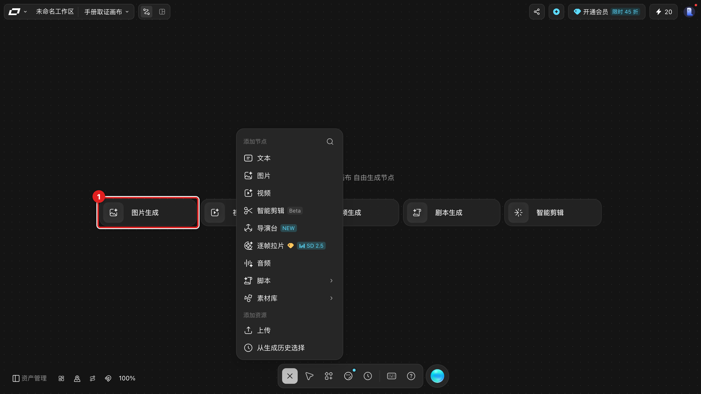 |

| 视频 | 音频 |
|---|---|
| 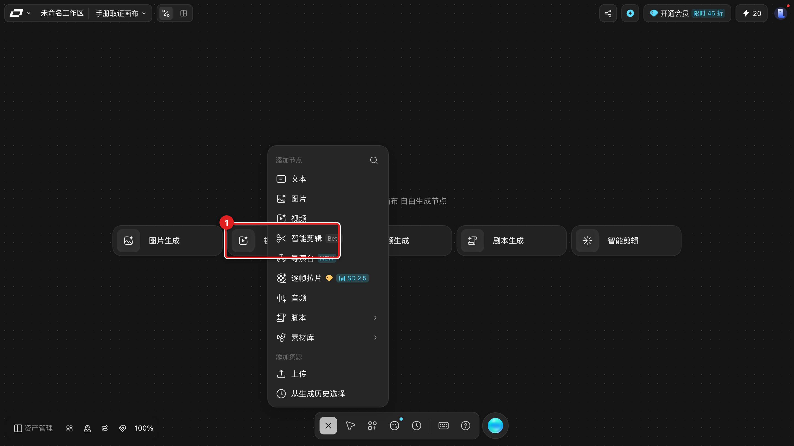 | 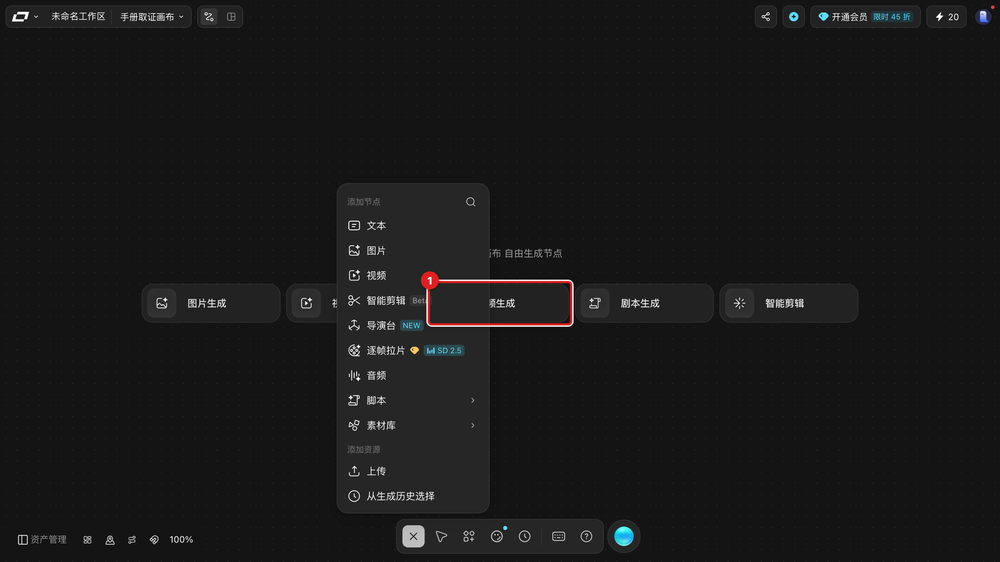 |

| 脚本（右侧有 ›） | 素材库（右侧有 ›） |
|---|---|
| 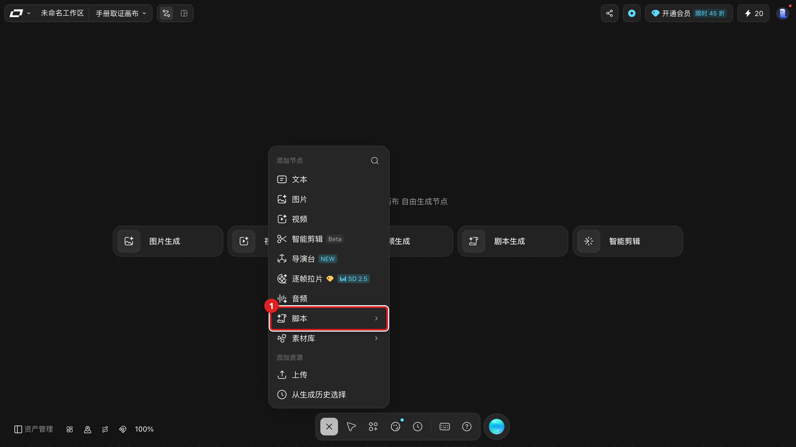 | 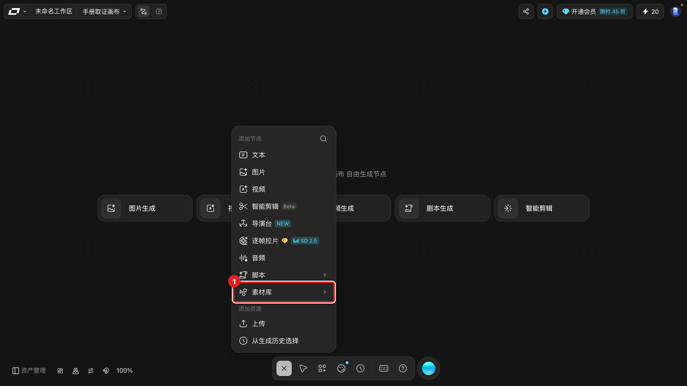 |

### 面板里那枚「+」会变成「×」

这是判断「面板到底开没开」最快的办法 —— **打开时底栏那枚 `+` 会变成 `×`**，
关掉之后又变回 `+`：

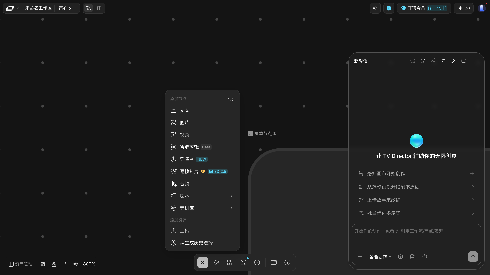

> 这张图还比上面那张旧图多两处细节：`逐帧拉片` 后面跟着一个 🏷 标签和一枚蓝色的 `SD 2.5` 徽标；
> `素材库` 是**带 `›` 的子菜单项**，不是直接建节点。

### 「素材库」下面还有一层

`素材库` 展开后是三项，不是正文里早先记的两项：

| 项 | 副标题 | 角标 |
|---|---|---|
| 风格库 | `新增风格节点` | `NEW` |
| 特效库 | `新增特效节点` | `NEW` |
| **打开工具箱** | — | — |

> ⚠️ 这个面板**不是**从「+」里点出来的 —— 底栏有一枚**独立的** `素材库` 按钮
> （无障碍名就叫「素材库」），点它直接弹这个面板，比走「+」→`素材库` 少一步。

### 「打开工具箱」里有什么

弹出的浮层标题是「**我的工具箱**」，内容是**三列网格的预设卡片**（每张 = 一张预览图 + 名称）：

| 观察 | 实测 |
|---|---|
| 卡片数 | 本次读到 **28** 张 |
| 平台预设的命名 | 一律带前缀 **`【预设】`** —— `【预设】左弧滑行`、`【预设】咖啡杯出场`、`【预设】Live 2D`、`【预设】旅拍转场 zoom in`… |
| 自己建的 | **不带**前缀，本账户的是 `手册取证测试箱` |
| 标题旁 | 一枚 `?` 圆形图标（无障碍名「工具箱模板说明」） |
| 关闭 | 右上角 `×`（`24×24`，无文字无无障碍名 —— 第几次了） |

#### 「使用」按钮要悬停才看得见

每张卡片右下角都有一枚 `使用` 按钮（`50×24`），但**平时看不见**：

这里有个**容易判错的地方**，本手册专门量过两次：

| 读数 | 未悬停 | 悬停后 |
|---|---|---|
| 按钮 `opacity` | `1` | `1` |
| `display` / `visibility` | `flex` / `visible` | `flex` / `visible` |
| 看得见吗 | **否** | 是 |

也就是说 —— 它**不是**故事板那种「`opacity: 0` 悬停变 1」，
而是**一直实实在在、只是被预览图压在下面**，悬停时才浮到图上面。
所以拿「按钮在不在 DOM 里 / opacity 多少」判断它，**一定会判错**。

> 本手册**没有点过任何一枚「使用」** —— 点了会把工具箱套到画布上，属于写操作。

### 九类节点一览

| 节点 | 面板角标 | 点下去会发生什么 |
|---|---|---|
| 文本 | — | 直接建出文本节点 |
| 图片 | — | 直接建出图片节点 |
| 视频 | — | 直接建出视频节点 |
| 智能剪辑 | `Beta` | 直接建出智能剪辑节点 |
| 导演台 | `NEW` | 先在画布建一张卡片，卡片上只有「打开导演台」按钮 |
| 逐帧拉片 | `SD 2.5` | 直接建出逐帧拉片节点 |
| 音频 | — | 直接建出音频节点 |
| 脚本 | 右侧有 `›` | ⚠️ **只展开子菜单**，不建节点 |
| 素材库 | 右侧有 `›` | ⚠️ **只展开子菜单**，不建节点 |

### 两个带子菜单的入口

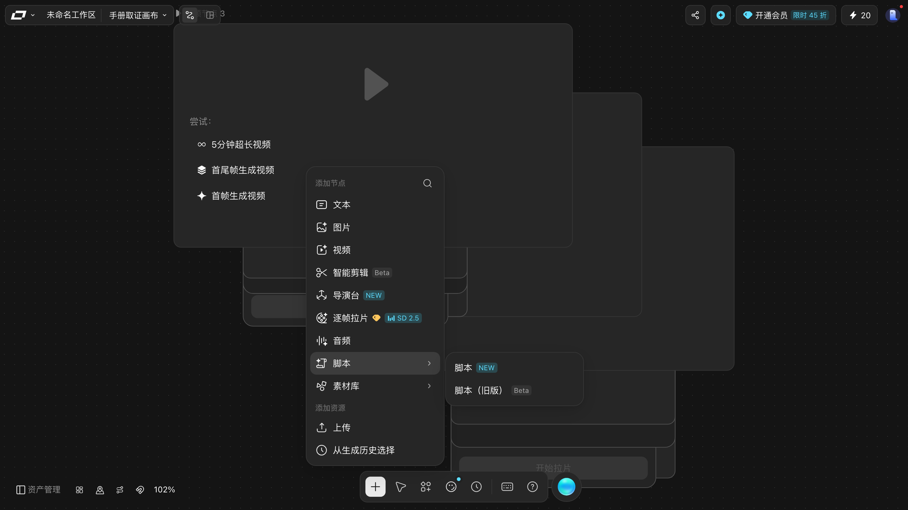

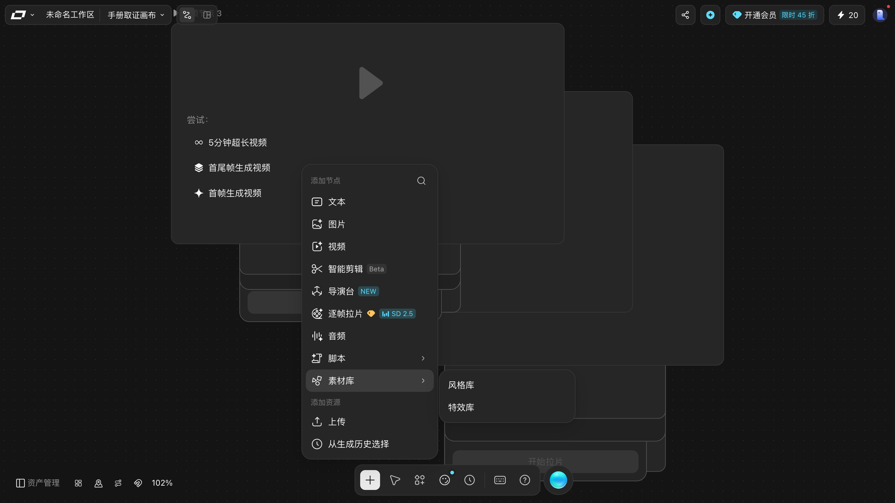

`脚本` 展开后是 `脚本 NEW` 和 `脚本（旧版）Beta`；`素材库` 展开后是 `风格库` 和 `特效库`。

> 角标含义：`Beta` = 测试期功能，可能变；`NEW` = 新上线；`SD 2.5` = 该节点绑定的模型版本。

---

## 逐类看节点

> 下面每一类都在**一张干净的空画布**上单独建出，保证卡片完整入镜：

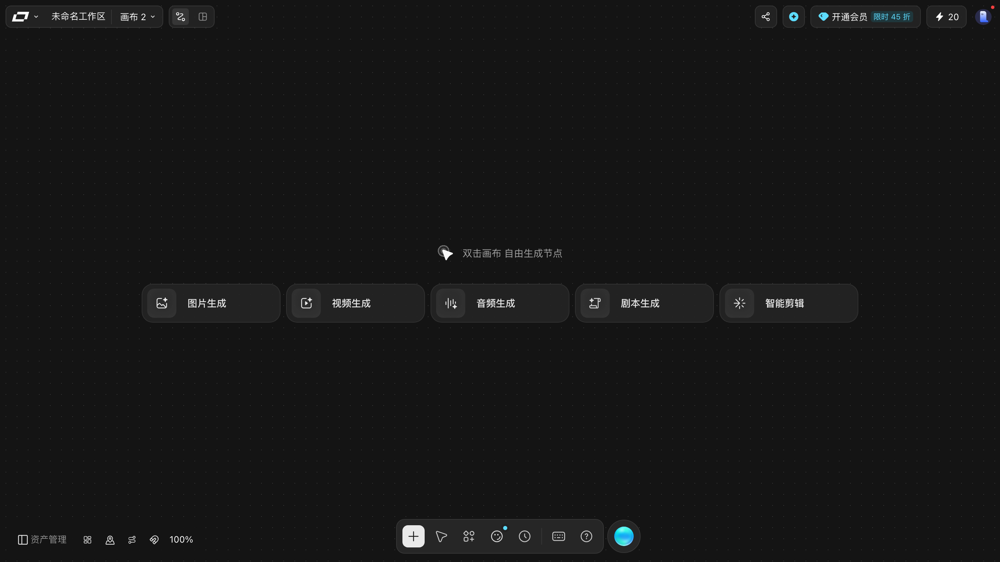

### 文本节点

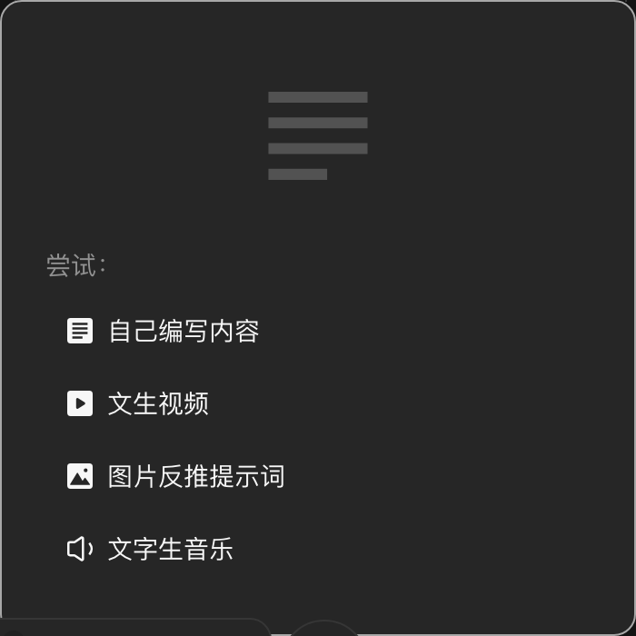

**「尝试：」** 四个模式：`自己编写内容` · `文生视频` · `图片反推提示词` · `文字生音乐`

同一个文本节点能当四种活干，选哪个模式决定下方提示词框的提示语和模型。

提示词框占位文案：`写下你想讲的故事、场景或角色设定。例如：一个来自未来的机器人，在城市屋顶看星星。`

底部显示模型 `GVLM 3.1` 和花费 `6`（积分）。

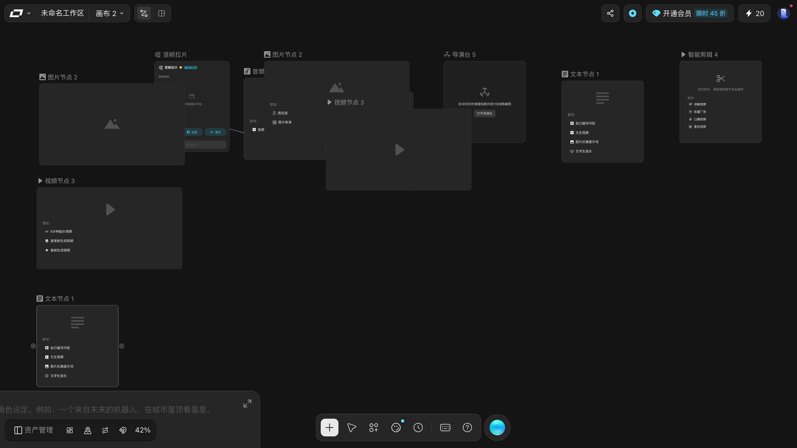

> **文本节点是唯一没有顶部工具条的节点** —— 实测它的面板里
> `参考` / `标记` / `风格` 一枚都没有（图片三枚、视频五枚、音频一枚）。
> 它也不带 `⚙`，也就没有「高级设置」分区。

文本节点的参数条是四类节点里**最简的**，只有三枚：

| # | 内容 | 悬停提示 |
|---|---|---|
| 1 | `GVLM 3.1 ▾` | （无） |
| 2 | `文A` | **翻译提示词** |
| 3 | 生成按钮 | **请输入提示词** |

> `翻译提示词` 这一枚是**四类节点都有**的（视频 / 图片 / 音频 / 文本），
> 是参数条上最通用的一个工具。📖 本手册没点过它（会调翻译、可能扣积分）。

### 图片节点

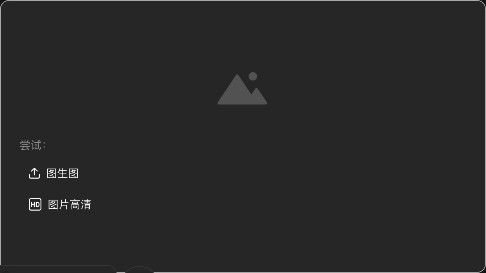

**「尝试：」**：`图生图` · `图片高清`

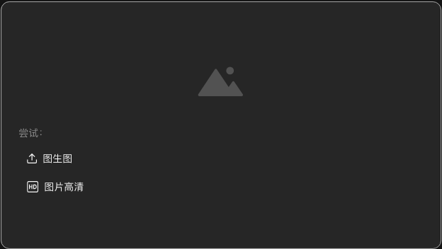

- 顶部工具：`参考` · `标记` · `风格`（三枚）—— `参考` 和 `标记` 与视频节点是**同一套切模式**，
  `风格` 打开风格广场
- 提示词框占位：`可直接文字生图，或上传图片输入文字指令对图片进行编辑，如：将背景改为雪夜`
- 底部参数条：`Lib Image 2.5 Pro` · `16:9 · 标准画质 · 2K · 1张` · `15`（积分），
  外加四枚纯图标按钮（无文字），其中两枚带 `aria`
- 点开 `⚙` 之后，下面会多出「高级设置」分区：`智能引用 AutoLink`（一个开关，默认开）

`16:9 · 标准画质 · 2K · 1张` 是一串四段式读法：**比例 / 画质档 / 分辨率 / 张数**，点它可以改。

点「标记」进入的也是同一个**元素选择模式**（画布变暗，顶部蓝条写「元素选择模式 / 点击图片选择局部元素」）：

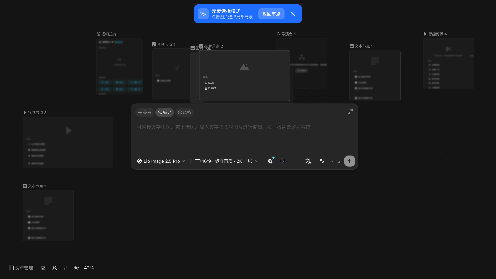

点「参考」则是同一套「从画布或资产管理选择参考」点选模式：

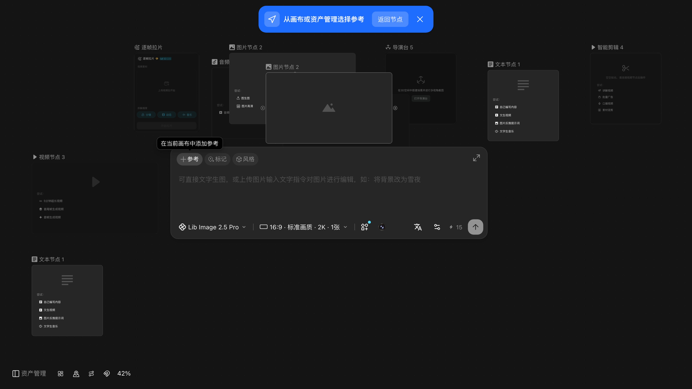

#### 底部那四枚纯图标按钮

这四枚**没有文字**，图标也不像中文。认它们靠的是**形状**和**位置**：

| 按钮 | 怎么认出来 | 点开是 |
|---|---|---|
| 第一枚 | 带 `aria-label="预设"` | **预设工作流选择器**（见下） |
| 第二枚 | 无文字、无 `aria`、**连 SVG 都没有** | **摄像机面板**（见下） |
| 第三枚 | 图标形似「文+A」 | **翻译提示词** —— 悬停提示实测就是这四个字 ✅ |
| 第四枚 | 滑块图标 `⚙` | 「高级设置」开关（toggle） |

> 💡 **认按钮的通用办法：把鼠标停在上面等一秒。**
> 视频、音频、文本三类节点的参数条上，好几枚按钮**既无文字也无 `aria`**，
> **悬停提示里却直接写着官方名字**。
> 本手册就是靠这一招，把此前完全没记的两枚按钮认了出来 ——
> `📄` **提示词优化** 和 `文A` **翻译提示词**。
>
> ⚠️ **图片节点这一列本轮没验。**
> 上面第三枚 `文A` 在视频 / 音频 / 文本节点上是同一枚（图标相同），
> 但**图片节点当时被另一个节点压住、始终没选中成功**，
> 所以图片节点参数条上到底有没有 `📄` 那一枚、总共几枚，
> 本手册**没有实测** 📖。以你屏幕上实际看到的为准。

#### 参数条上的两枚通用工具

在**视频、图片、音频、文本**四类节点上都出现（或应当出现）的两枚：

| 图标 | 官方名（悬停实测） | 行为 |
|---|---|---|
| `📄` 文档带横线 | **提示词优化** | 提示词为空时**弹顶部提示拒绝执行**：「提示词为空，请输入内容后点击」。**不弹面板、不打开任何窗口** |
| `文A` | **翻译提示词** | 📖 本手册**没点**（会调翻译、可能扣积分） |

> 💡 `提示词优化` 这个「**先检查、再拒绝**」的行为值得留意：
> 它**不是坏了**，是提示词还没填。
> 同类里最右那枚生成按钮也有一样的脾气，见下。

#### 最右那枚白圆按钮：什么时候点得动

参数条**最右边**那枚白色圆形上箭头是**生成按钮**。
本手册**没有点过它**（会真实消耗积分、触发生成），
它的作用是从**禁用状态**读出来的 —— 提示词为空时它点不动，而且会告诉你缺什么：

| 节点 | 提示词为空时 | 悬停提示 |
|---|---|---|
| **音频节点** | `disabled`、`cursor: not-allowed` | **请输入提示词或添加参考素材** |
| **文本节点** | 点不动 | **请输入提示词** |
| **视频 / 图片节点** | `disabled: false`、`cursor: pointer` | （无提示） |

> 💡 所以「点了没反应」有时候是**它本来就点不动**，
> 而**它会把缺什么写在提示里** —— 先读这一句，比反复点省事。
> 顺带把生成按钮的位置也确认了：它**永远是参数条最右一枚**。
>
> ⚠️ 视频 / 图片节点这一枚在提示词为空时**实测是可点的**，
> 但本手册**仍然没有点**，因为它会真的扣掉 `135` / `15` 积分发起生成。
> 它点下去具体会发生什么（进度在哪、能不能取消），📖 本手册未验证。

右上角还有一枚 `⤢` 展开图标，**但它在图片节点上是 `cursor: not-allowed` ——
点不动**（视频节点上同一枚是可点的）。

#### 预设：十一个开箱即用的工作流

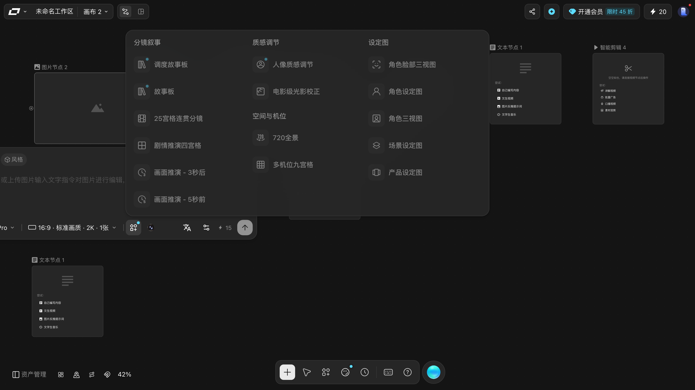

这一整块手册此前完全没有。四列分组是：

| 分组 | 条目 |
|---|---|
| **分镜叙事** | `调度故事板` · `故事板` · `25宫格连贯分镜` · `剧情推演四宫格` · `画面推演 - 3秒后` · `画面推演 - 5秒前` |
| **质感调节** | `人像质感调节` · `电影级光影校正` |
| **空间与机位** | `720全景` · `多机位九宫格` |
| **设定图** | `角色脸部三视图` · `角色设定图` · `角色三视图` · `场景设定图` · `产品设定图` |

`调度故事板` / `故事板` / `人像质感调节` 三个图标右上角带**蓝点**（推测是推荐或新功能标记，含义未验证）。

> 📖 **点其中任意一条会发生什么，本手册没验** ——
> 它们看起来会往画布里加节点或改参数，属于「会写数据」的操作，本轮不碰。

#### 摄像机：模拟真实拍摄器材

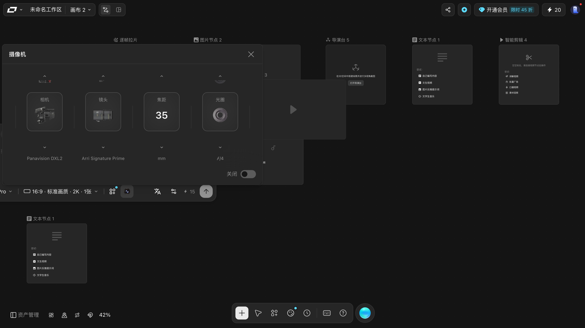

| 项 | 当前值 | 可选值（实测） |
|---|---|---|
| `相机` | `Panavision DXL2` | 有上下箭头可切换，未逐个试 |
| `镜头` | `Arri Signature Prime` | 同上 |
| `焦距` | `35` `mm` | `8` `14` `24` `35` `50` `75` `125` |
| `光圈` | `ƒ/4` | 有上下箭头，未逐个试 |

底部还有一个 **`关闭` 开关**（本轮是关的）。它的作用应该是「是否把这套虚拟摄影机参数送进生成」——
**具体影响本手册没验** 📖。

### 视频节点

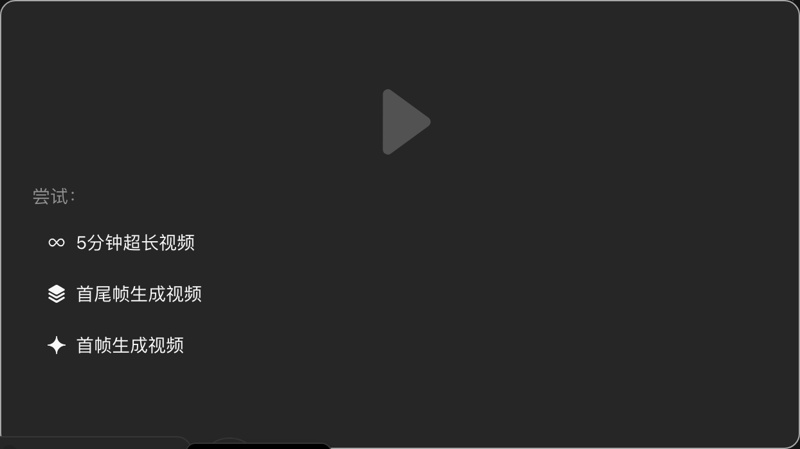

**「尝试：」**：`5分钟超长视频` · `首尾帧生成视频` · `首帧生成视频`

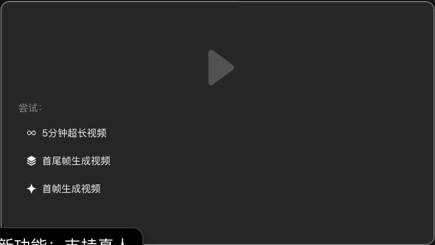

- 顶部工具：`参考` · `标记` · `特效` · `角色库` · `运镜`（五枚，右上角还有一枚 `⤢` 展开图标）
- 提示词框占位：`描述你想要生成的画面内容，@引用素材`
- 底部参数条实测七枚，从左到右：

| # | 内容 | 说明 |
|---|---|---|
| 1 | `2.0 ▾` | 模型，带下拉箭头 |
| 2 | `全能参考 ▾` | 参考类型 |
| 3 | `16:9 · 720P · 5s · 1个 · 🔊 ▾` | 规格四段式 + 声音开关 |
| 4 | `📄` | 悬停提示 **提示词优化** |
| 5 | `文A` | 悬停提示 **翻译提示词** |
| 6 | `⚙` | 「高级设置」开关 |
| 7 | 白色圆形上箭头 | **生成按钮**（最右，详见上文） |

`⚡135` 是积分数字，**不是按钮**，排在生成按钮左边。

- 点开 `⚙`（参数条右侧那枚滑块图标）之后，下面会多出「高级设置」分区：
  `联网搜索` · `自动校验素材` · `智能引用 AutoLink`（三个开关，默认全开）

视频节点是可选功能最多的一个：特效、角色库、运镜都挂在这。

#### 五枚工具各自点开什么

这五枚**行为完全不同**，手册此前只写了名字，一个都没被点开过。实测如下：

| 工具 | 点开之后 | 形态 |
|---|---|---|
| `参考` | **进入点选模式**：顶部出现蓝色提示条「**从画布或资产管理选择参考**」，画布上每个节点的提示变成「**在当前画布中添加参考**」 | 顶部横条 + 画布高亮 |
| `标记` | **进入点选模式**：顶部提示条写「**元素选择模式** / **点击图片选择局部元素**」，画布整体变暗 | 顶部横条 + 画布变暗 |
| `特效` | 打开**特效广场** | 全屏模态框 |
| `角色库` | 打开**角色库**，但**上面先叠一层合规承诺书**（见下） | 全屏模态框 × 2 层 |
| `运镜` | 打开**运镜广场** | 全屏浮层 |

**前两枚不是「弹出一个列表」，而是把你切进一个交互模式** ——
顶部会挂一条蓝色提示条，右边有 `返回节点` 按钮和 `×`；
在这个模式里直接点画布上的图片/节点来完成选择。
不点提示条上的 `×` 或 `返回节点`，就一直停在这个模式里。

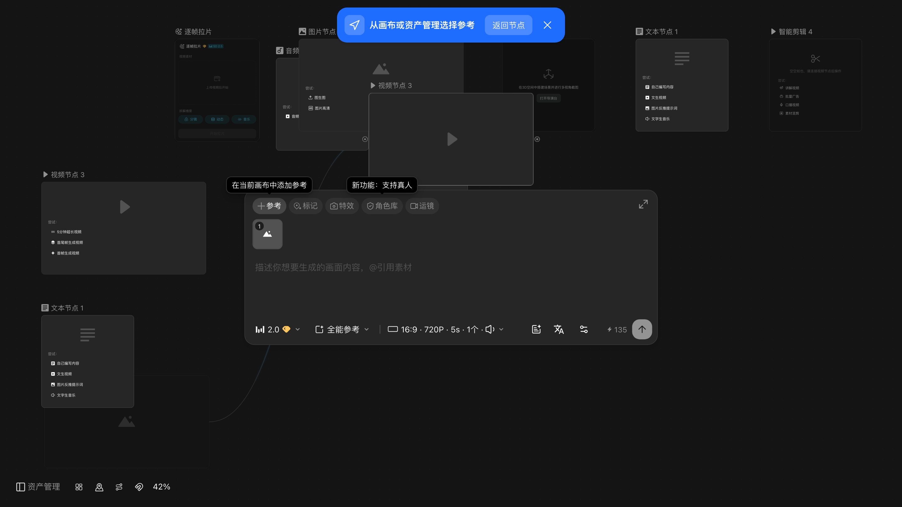

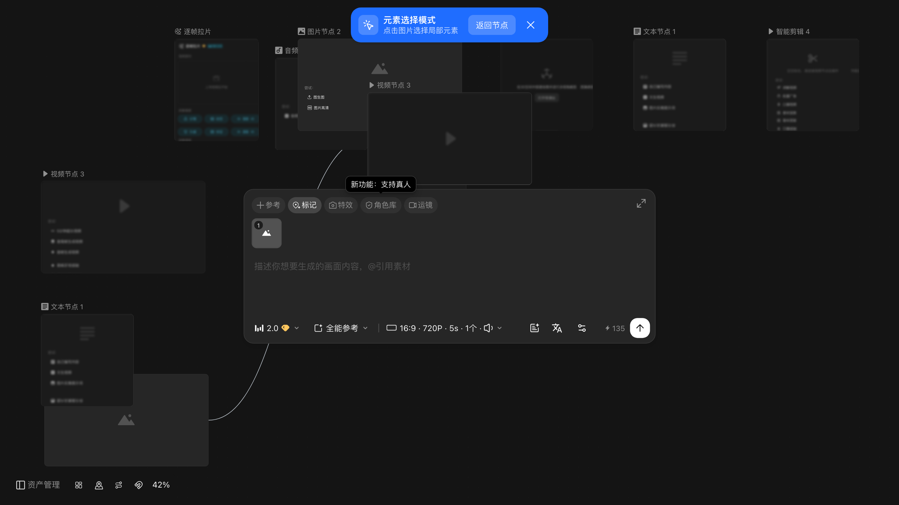

#### `特效` 打开的是特效广场

和从底栏「素材库 → 特效库」进去的是**同一个全屏模态框**，见
[asset-library.md 的特效广场](asset-library.md#特效广场同一套结构多一个价格列)。

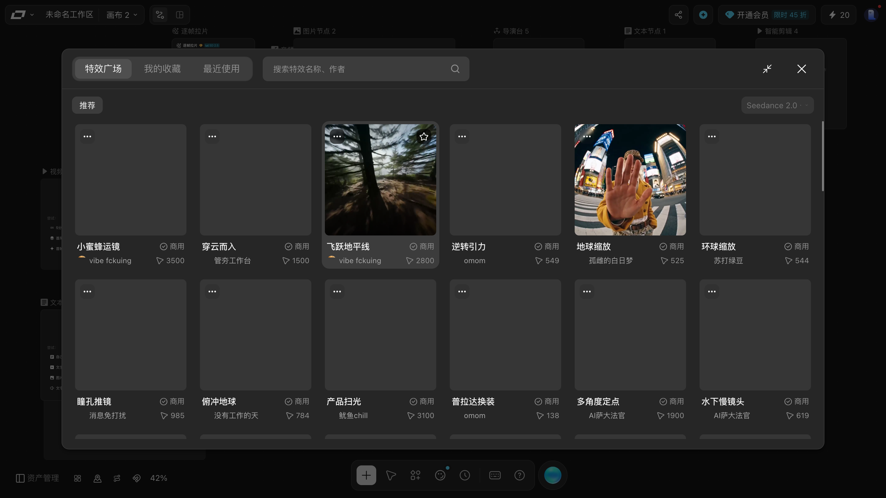

#### `运镜` 打开的是运镜广场

顶部三个标签 `运镜广场`（当前）`我的收藏` `我的运镜`，下面是**内置的运镜预设**，实测读到这 22 个：

`固定镜头` · `跟随拍摄` · `盘旋抬升` · `盘旋下降` · `镜头上摇` · `镜头下摇` ·
`镜头左摇` · `镜头右摇` · `镜头上升` · `镜头下降` · `镜头左移` · `镜头右移` ·
`镜头前推` · `镜头后移` · `变焦推进` · `变焦拉远` · `柯克变焦` · `环绕拍摄` ·
`滚筒旋转` · `第一视角` · `无人机` · `高空航拍` · `手持拍摄`

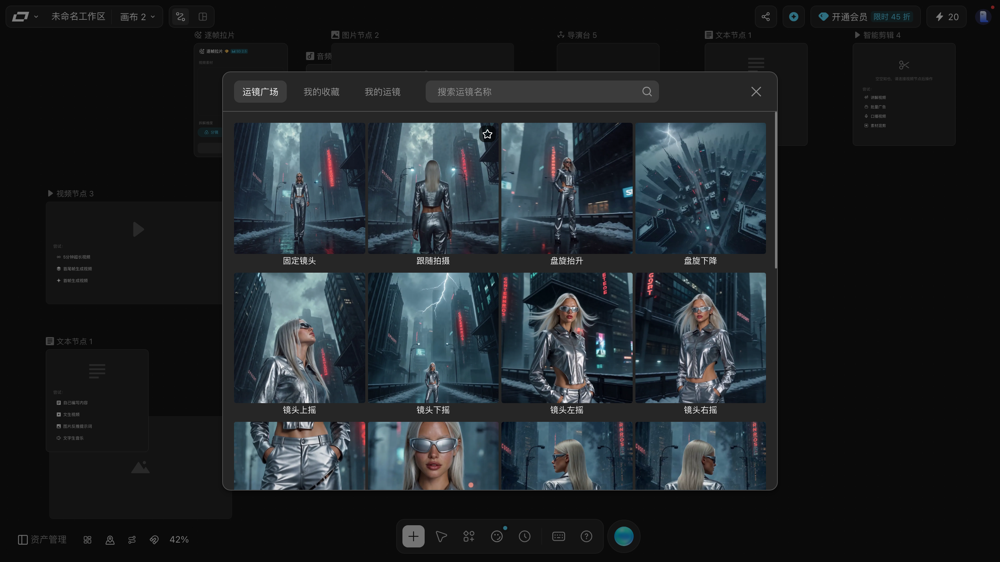

#### `角色库` 会先拦一道合规承诺书 ⚠️

**第一次点「角色库」不会直接看到角色列表** —— 会先弹出一份
**《Seedance模型使用承诺书》**，必须**勾选同意**才能点「同意并使用」。
这也是顶栏那条黄色提示「未签署人像安全协议…去签署」的来处。

承诺书正文是三条：

1. **您对即将上传或使用的素材拥有充分合法权益** —— 包括但不限于图片/视频/音频/文本/
   人物形象/虚拟人像/声音/品牌元素等；涉及他人肖像/声音/生物识别特征、
   或商标/版权等知识产权元素的，须确保已获授权；
2. **您将自行对所生成内容及使用后果负责** —— 平台明示 AI 生成结果具有不确定性，
   是否发布、传播或商业使用由用户自行判断并承担相应法律责任；
3. **如您存在违规使用行为，平台将有权采取限制措施** —— 滥用含第三方合法权益的素材
   会被视为违规，可能被拦截生成、删除内容、限制下载、暂停或终止服务。

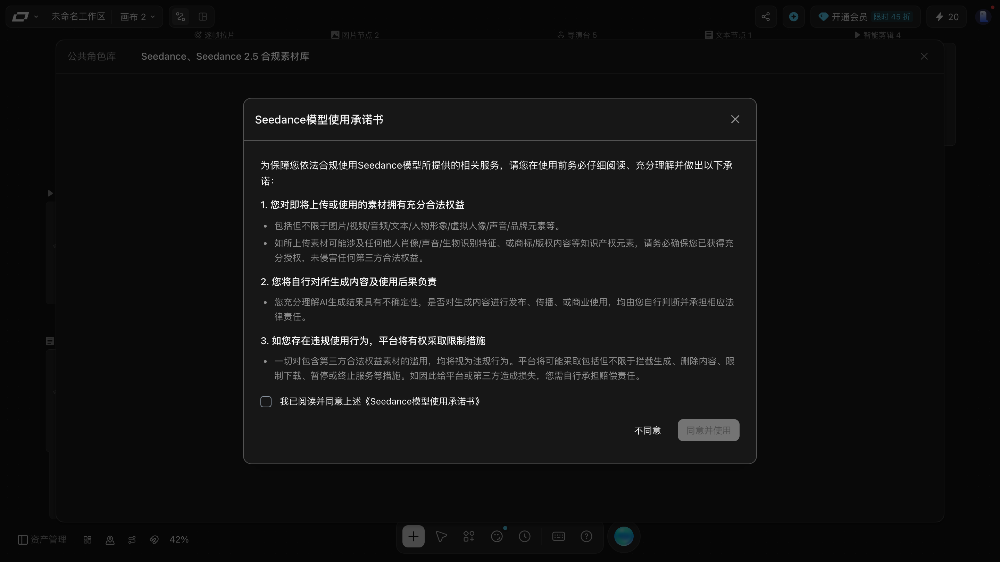

> 📖 **本手册没有勾选、也没有点「同意并使用」** —— 那是签署协议，不代签。
> 所以**角色库里的角色列表长什么样、有多少个、怎么挑，本手册没验**。
> 能确认的只有：它有两个标签 `公共角色库` 和 `Seedance、Seedance 2.5 合规素材库`。

### 智能剪辑节点

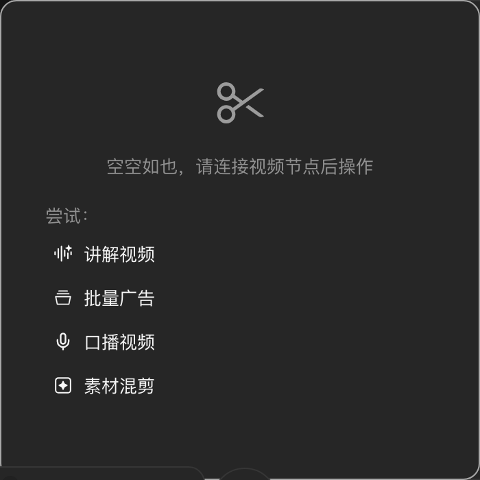

空状态文案很直白：**「空空如也，请连接视频节点后操作」** —— 它不是拿来凭空生成的，得先接视频。

**「尝试：」**：`讲解视频` · `批量广告` · `口播视频` · `素材混剪`
其余：`参考` · `描述想剪成什么效果` · `默认模式` · `16:9 · 720P · 30s`

### 导演台节点

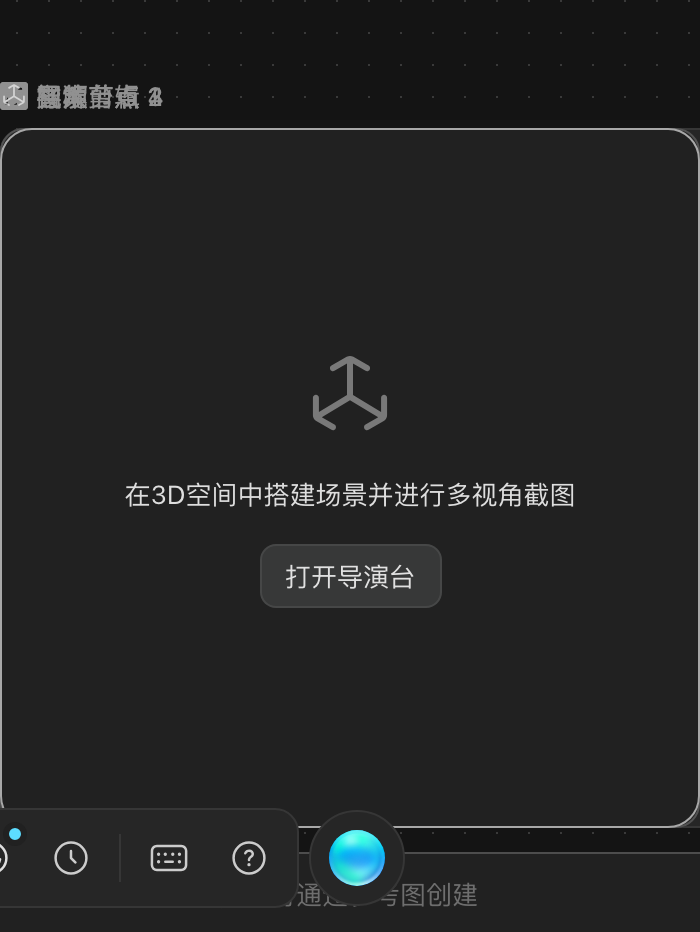

整张卡片只有一句话和一个按钮：

> 在3D空间中搭建场景并进行多视角截图
> `打开导演台`

点「打开导演台」会进入一个**全屏三维工作区**（地址栏不变，仍是 `/canvas`）。

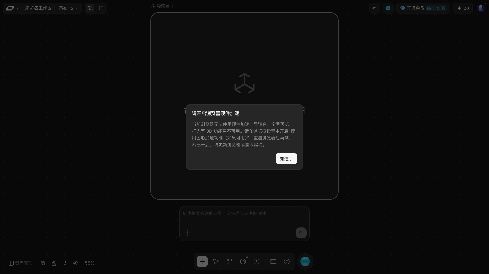

工作区的三块结构：

| 位置 | 内容 |
|---|---|
| 顶部 | 节点名「导演台 N」 |
| 中央 | 3D 视窗（未加载时是一个占位图标 + 「在3D空间中搭建场景并进行多视角截图」+ `打开导演台`） |
| 底部 | 输入框，占位「**描述想要搭建的场景，支持通过参考图创建**」，左边 `+`（上传图片）、右边 `↑`（发送） |

> ### ⚠️ 导演台 3D 需要浏览器硬件加速
>
> 如果浏览器没开硬件加速，点「打开导演台」会直接弹这个框：
>
> > **请开启浏览器硬件加速**
> >
> > 当前浏览器无法使用硬件加速，导演台、全景预览、打光等 **3D 功能暂不可用**。
> > 请在浏览器设置中开启“使用图形加速功能（如果可用）”，重启浏览器后再试；
> > 若已开启，请更新浏览器或显卡驱动。
>
> 这不是账号问题、也不是画布坏了 —— 是浏览器的图形加速没开。
> 详见 [../90-troubleshooting.md](../90-troubleshooting.md)。

界面上还有一组「**正在跟随 / 取消**」的提示和「**按 ESC 退出**」。本轮进入后 `Esc` 没有立刻退出工作区 ⚠️。

> ⚠️ 3D 视窗内部本轮**没有真正加载出来**（取证环境无硬件加速），所以**搭建场景、参考图、打光、多视角截图这些操作本手册都没有验证**。

### 逐帧拉片节点

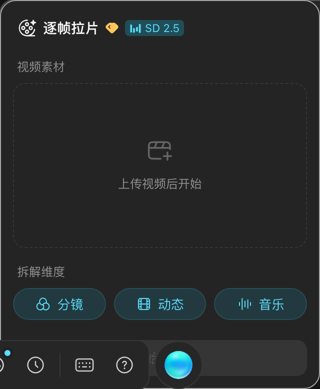

- `视频素材` 区，提示「上传视频后开始」
- **拆解维度**：`分镜` · `动态` · `音乐`
- 底部按钮 `开始拉片`

> 三个拆解维度是**可多选**的，选哪几个决定从视频里拆出什么信息。

### 音频节点

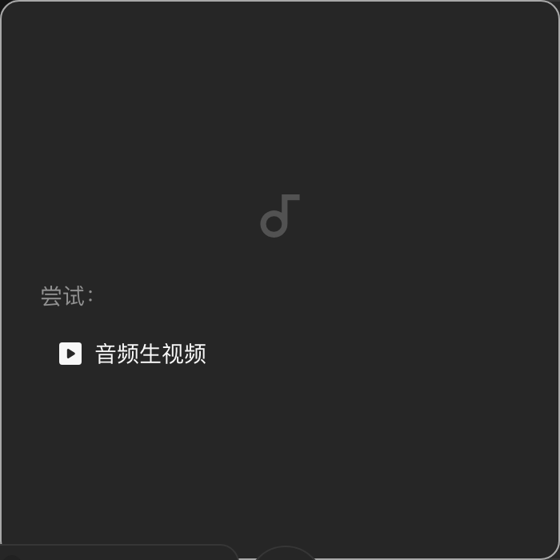

**「尝试：」**：`音频生视频`
提示词框占位：`描述你想要的音频效果，可用 @ 引用音频`
底部：`Seed Audio 1.0` · `中文 · 24k · wav` · `0/2000`（已用/上限字数）· `1`（积分）

音频节点的顶部工具条**只有 `参考` 一枚** —— 视频节点那五枚里的 `标记` / `特效` / `角色库` / `运镜`，音频节点都没有。

点它开的是和视频节点**同一套**「从画布或资产管理选择参考」点选模式（顶部蓝条 +「返回节点」+`×`）。

底部参数条实测**五枚**：

| # | 内容 | 悬停提示 |
|---|---|---|
| 1 | `Seed Audio 1.0 ▾` | （无） |
| 2 | `中文 · 24k · wav ▾` | （无） |
| 3 | `文A` | **翻译提示词** |
| 4 | `⚙` | （无） |
| 5 | 生成按钮 | **请输入提示词或添加参考素材** |

> ⭐ **第 5 枚是全手册最好用的一条线索**：
> 提示词为空时它是 `disabled` + `cursor: not-allowed`，
> **提示里直接告诉你缺什么**（音频节点写「提示词**或添加参考素材**」，
> 文本节点写「提示词」—— 音频节点多一个「加参考素材」的出路）。
>
> 本手册正是靠它，才认出视频 / 图片节点最右那枚白圆按钮也是同一枚生成按钮 ——
> **不用去点那枚会扣积分的按钮。**

点开同一枚 `⚙`，音频节点展开的是**三个滑杆**：`语速` · `声调` · `音量`，
详见下面的「『高级设置』的入口是 ⚙」。

---

## 选中节点会发生什么

- **折叠态**：只露出预览区 + 「尝试：」几个模式；
- **选中态**：卡片**展开**，露出提示词框、顶部工具、底部参数条。

点空白处或按 `Esc` 收起。

---

## 节点里的「高级设置」

先说清楚一件容易误会的事：**参数面板不是节点卡片的一部分，是挂在节点下方的一张独立卡片。**

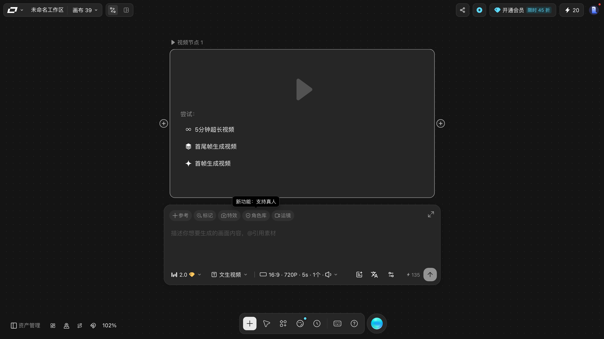

实测框的位置关系（1440×810 视口）：

| 部分 | 说明 |
|---|---|
| 节点本体 | 视频 `311×175`、音频 `175×175`（50% 缩放下实测） |
| 节点标题浮条 | 节点上方一条 `263×20` 的小条（`⏵ 视频节点 3`），class `node-floating-ui transition-[transform,opacity]` |
| 参数面板 | 节点下方一张约 `660` 宽的独立卡片 |

> ⚠️ **两个 float 的 class 都在 `node-floating-ui` 家族里，但它们不是同一个东西**：
> 那条 20px 高的**标题浮条**才是 `node-floating-ui`；
> 真正的**参数面板**是另一张 660 宽的卡片。找面板时别拿 `node-floating-ui` 当判据 —— 会量到标题条。

所以 `⌘0`（框住所有节点）**只框节点、不框参数面板** —— 面板会挂在框外甚至视口外，
这时候只能靠手动平移把它拉回来。

> **单击节点中央 = 打开/收起参数面板。** 实测图片节点元素数 `42 → 140`（折叠 → 展开）。
>
> ⚠️ **参数面板还有两个前置条件**，本手册花了三轮才摸清：
> 1. **右侧的 TV Director 对话抽屉必须关掉，面板才会渲染。**
>    抽屉开着时，DOM 里照样有完整面板（`innerText` 读得到全文），**画面上一个像素都看不到**。
>    按 `Esc` 能关掉它，**点画布空白关不掉**（实测两次）。
> 2. 面板的**宽度不随画布缩放改变**。缩放 42% 和 50%，`getBoundingClientRect()` 都报 `660` 宽。
>    所以「把画布缩小就能看见面板」这条路不成立。

### 「高级设置」的入口是 `⚙`，不是「高级设置」那四个字

这是最容易走弯路的一处，单独说清楚：

> **入口是参数条右侧那枚 32×32 的滑块图标按钮（`⚙`）。**
> 面板里那行灰色的「高级设置」四个字是**标题**，**点了没有任何反应**。

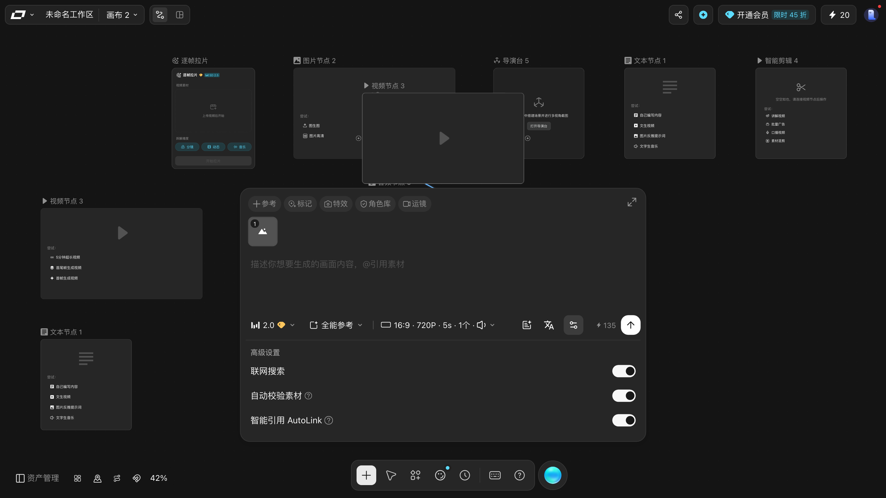

上面这张图里能看到三件事：

1. `⚙` 按钮**变成深色高亮态** —— 这是它被打开的视觉信号；
2. 参数条下面出现一条**分隔线**，线下面是灰色的「高级设置」标题；
3. 标题下面就是内容区。视频节点这里是**三个开关，全部默认打开**：
   `联网搜索` · `自动校验素材` · `智能引用 AutoLink`。
   其中 `自动校验素材` 和 `智能引用 AutoLink` **各带一个 `?` 问号图标**（点它有说明），
   `联网搜索` 没有。

音频节点的同一枚 `⚙` 打开的是**三个滑杆**：

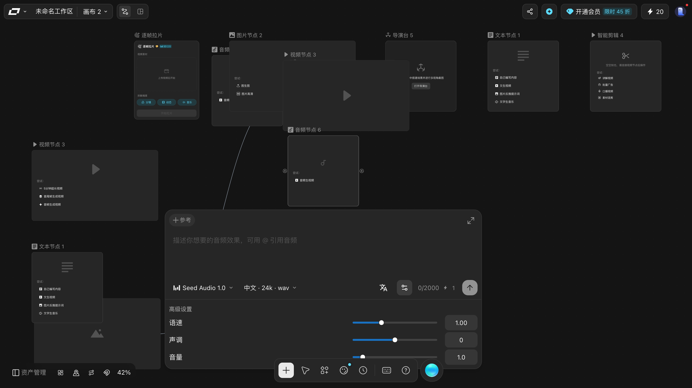

| 滑杆 | 当前值 | 取值范围 |
|---|---|---|
| `语速` | `1.00` | `0` – `2` |
| `声调` | `0` | `0` – `12` |
| `音量` | `1.0` | `0` – `10` |

再点一次 `⚙` 就收回去，**是开关（toggle）不是单向展开**。

> ⚠️ **这里更正手册早先的两版说法**：
> ① 「`高级设置` 是可折叠分区、点**那四个字**展开/收起」—— **点它没反应**，
>    正确入口是 `⚙` 那枚图标按钮。
> ② 「音频是 3 个滑杆、**没有**数字输入框」—— **画面上就摆着三个数值框**
>    （`1.00` / `0` / `1.0`）。它们确实不是 `input[type=number]`
>    （实测该选择器恒为 0 个），但**用户是能看见数字的**，
>    手册说「没有数字框」会让人以为看不到数值。
>
> 另外一个小差异：滑杆自己的 `aria-valuenow` 读出来是 `1` / `0` / `1`，
> 而**显示在框里的是 `1.00` / `0` / `1.0`** —— 同一个值，两种写法。

折叠机制本身是在 `grid-template-rows` 的两个值之间切换：

| 状态 | class | `grid-template-rows` 计算值 |
|---|---|---|
| 收起 | `grid-rows-[0fr]` | `0px` |
| 展开 | `grid-rows-[1fr]` | `157px` |

面板高度也跟着变：视频节点 **246px → 411px**。

> 💡 **这一段踩的坑值得记一笔**：我盯着「高级设置」那四个字试了十几轮，
> 每次都点不到（它只是标题），于是先写下「它默认就是展开的」、
> 后来又写下「产品根本没有展开态」—— **两次都是把「我没找到入口」当成了产品事实**。
> 真正的入口一直就在旁边那排图标按钮里，只是没有文字也没有无障碍名，
> 前两轮按文字/aria 找控件时**根本没把它列进候选**。
> **「我点不到」≠「它不存在」**。

---

## 框选：一次选多个节点

**`Shift` + 在空白处左键拖出一个矩形**，框完整包住的节点会一起被选中。

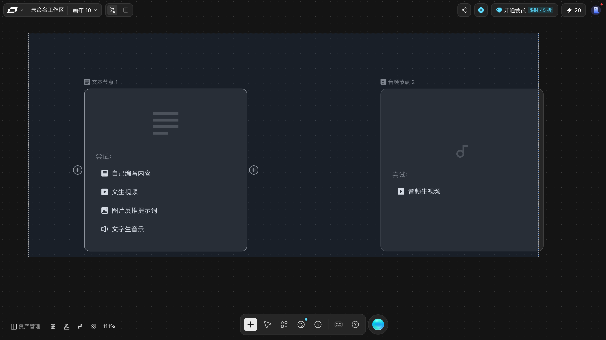

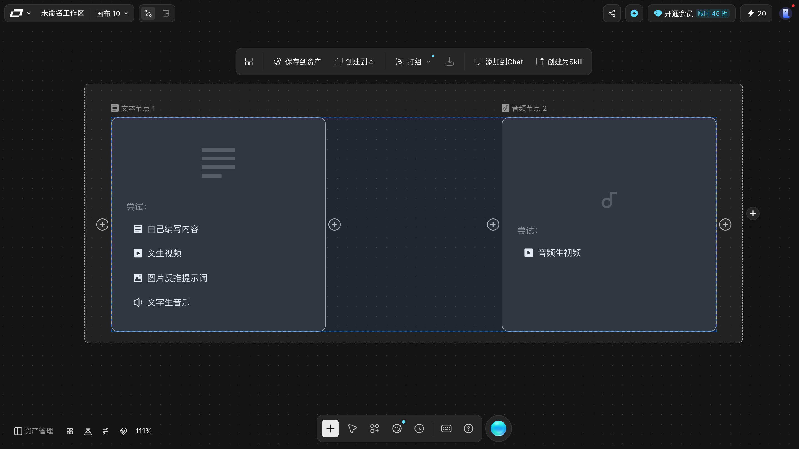

> ### ⚠️ 两条最容易踩空的
>
> 1. **在空白处直接左键拖，画布是拖不动的。** 实测鼠标走 220px，视口只挪了 16.3px、纵向一点没动。所以「想框选却拖出一片空白」不是操作错了，是**没按住 `Shift`**。
> 2. **必须框完整包住节点才算选中**，擦着边不算。本手册的验证方式是：先量出两张卡的完整外框，再按外框 +14px 拖，松开后 2 / 2 全中。

框选是成组、解组、批量复制的前置动作 —— 这几个键位只在多选状态下才有意义。

## 成组 / 解组

| 动作 | 键 | 界面上发生了什么 |
|---|---|---|
| 成组 | `⌘G` | 出现一个包住所有成员的框，组名叫 `Group 1` |
| 解组 | `⌘⇧G` | 框消失，成员恢复成独立节点 |

成组后画布上的节点总数会 **+1**（多出来的是组本身），解组后减回去。

### 组操作条

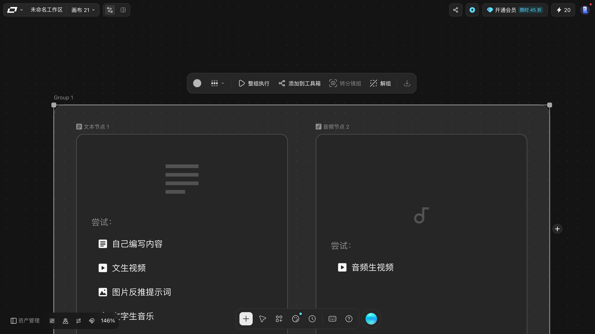

**组被选中时**，它上方浮出一条操作条。注意这些按钮**在 DOM 里不是 `<button>`，而是 `div` / `span`**，
所以如果你想用自动化工具按文案找它们，`getByRole('button')` 一律返回空 —— 必须按文字去定位叶子 `div`。

从左到右是 7 个动作，中间夹着 2 条竖分隔线：

| # | 按钮 | 实测结果 |
|---|---|---|
| 1 | 颜色圆点 | ✅ 可用，展开 10 色色板，**选了真的会变色** |
| 2 | `⊞˅` 排列 | ✅ 可用，菜单 3 项，**三种排列都实测生效** |
| — | 竖分隔线 | — |
| 3 | `▶ 整组执行` | ⚠️ **会真的跑生成、扣积分，本手册没点过** |
| 4 | `添加到工具箱` | ✅ 可用，打开「创建/更新工具箱」弹窗 |
| 5 | `转分镜组` | ❌ **灰的**（实测 `opacity: 0.45`），点了什么也不会发生 |
| 6 | `解组` | ✅ 可用 |
| — | 竖分隔线 | — |
| 7 | `⬇ 批量下载` | ❌ 灰的（`opacity: 0.45`，组里还没有生成产物时不可用） |

> `转分镜组` 是灰的，这同时解释了快捷键面板上的 `⌘⌥G 合并分镜组` 为什么按了没反应 ——
> 它对应的是同一个功能，在普通工作流画布上就是不可用的 📖。
> **快捷键面板上的 `⌘⌥G`，本手册实按过，画布毫无变化，也没有任何提示。**

#### 1｜颜色圆点：10 色色板，选了组真的会变色

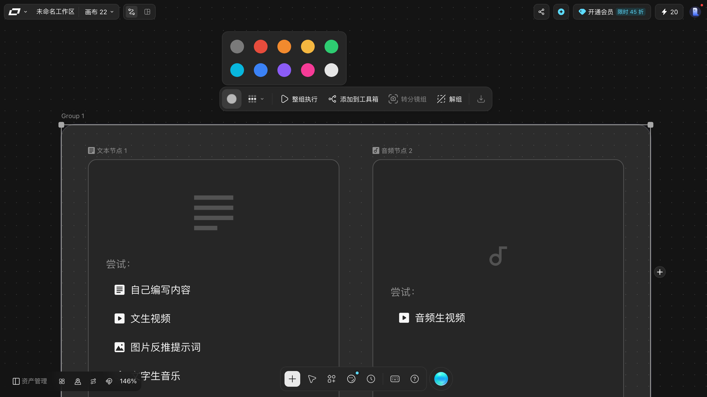

点最左边那个 20×20 的圆点，浮出一块 **5 列 × 2 行 = 10 个** 圆形色块，每块 36×36：

| 行 | 色板从左到右 |
|---|---|
| 上排 | 灰 `rgb(122,122,122)` · 红 `rgb(231,76,60)` · 橙 `rgb(242,138,46)` · 黄 `rgb(244,183,64)` · 绿 `rgb(46,204,113)` |
| 下排 | 青 `rgb(8,182,221)` · 蓝 `rgb(59,130,246)` · 紫 `rgb(139,92,246)` · 粉 `rgb(246,59,151)` · 白 `rgb(230,230,230)` |

**实测换色**：点第 2 块红色之后，组的框色和底色立刻从 `rgba(255,255,255,0.1)` 变成
`rgba(231,76,60,0.2)` / `rgba(231,76,60,0.1)`，圆点自己也变红，连左上角的 `Group 1` 标签底色一起变红：

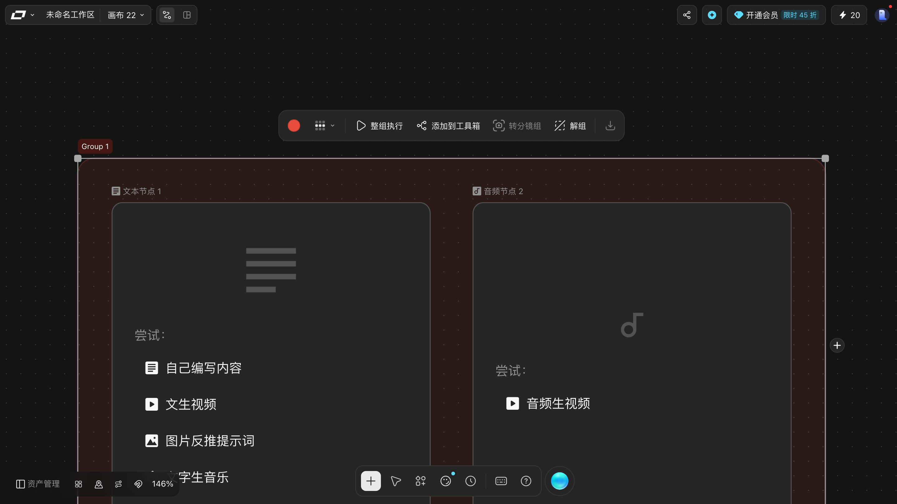

> **给组上色是最容易被忽略的整理手段。** 一屏里组很多时，先按用途给组分配颜色，
> 后面找东西就不用逐个读组名了。

#### 2｜排列：宫格 / 水平 / 垂直，三种都实测生效

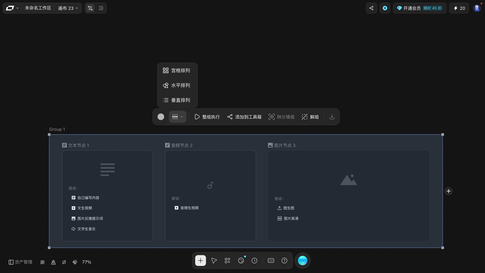

点 `⊞˅` 弹出三个排列方式。**三个都真按过，节点坐标都真的变了**，
节点间距实测 298px = 节点高 270 + 间隙 28。

**水平排列** —— 三个节点排成一行，`y` 全部对齐：

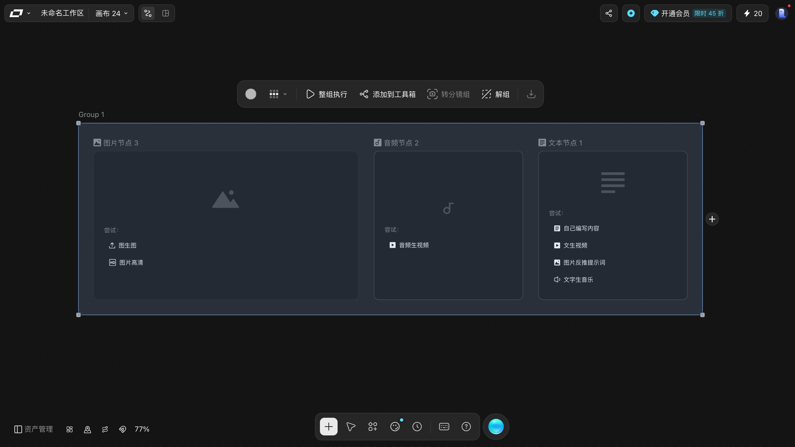

> 文本 `x=180 → 975`（`+795`）、音频 `x=486 → 677`（`+191`）、图片 `x=792 → 169`（`-623`），
> 三者 `y` 统一到 `273`。

**垂直排列** —— 三个节点排成一列，`x` 全部对齐：

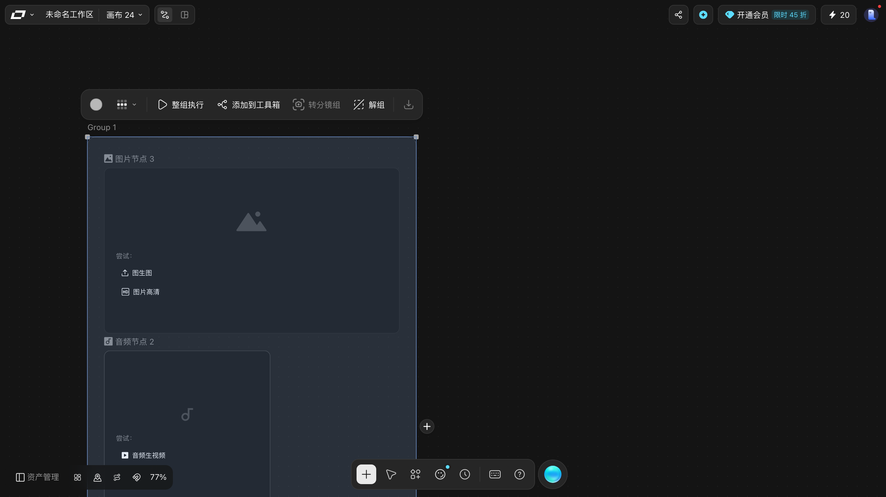

> 图片停在 `x=169, y=273`，音频移到 `x=169, y=571`（`dx=-508, dy=+298`），`x` 统一到 `169`。
> 第三个节点被排到视口外，会从 DOM 里消失（见 [organize-canvas.md](organize-canvas.md) 的虚拟化说明），
> 所以读数只剩两个 —— 这是**读数不全，不是排列出错**。

**宫格排列** —— 排成 2×2 方阵：

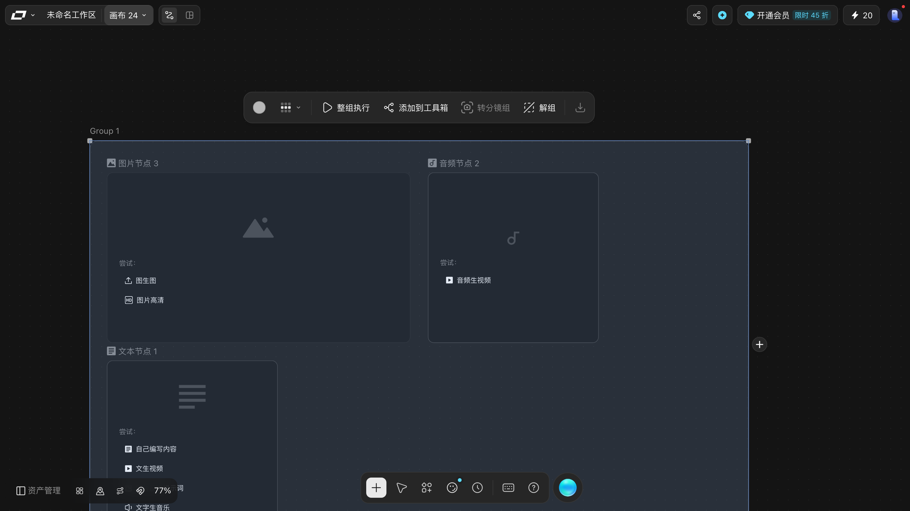

> 图片 `(169, 273)` 左上、文本 `(169, 571)` 左下、音频 `(677, 273)` 右上，右下角空着。

排列完之后**组框会跟着变大变小**（水平排列后 `1170 → 1132` 宽；垂直排列后变成 `536 × 945`），
这是正常的：组框本来就是包住成员的动态框。

#### 4｜添加到工具箱

点它打开一个「**创建新工具箱 / 更新工具箱**」双标签弹窗，详见 [asset-library.md](asset-library.md#把-组存进工具箱)。

### 整组可以当一个节点拖

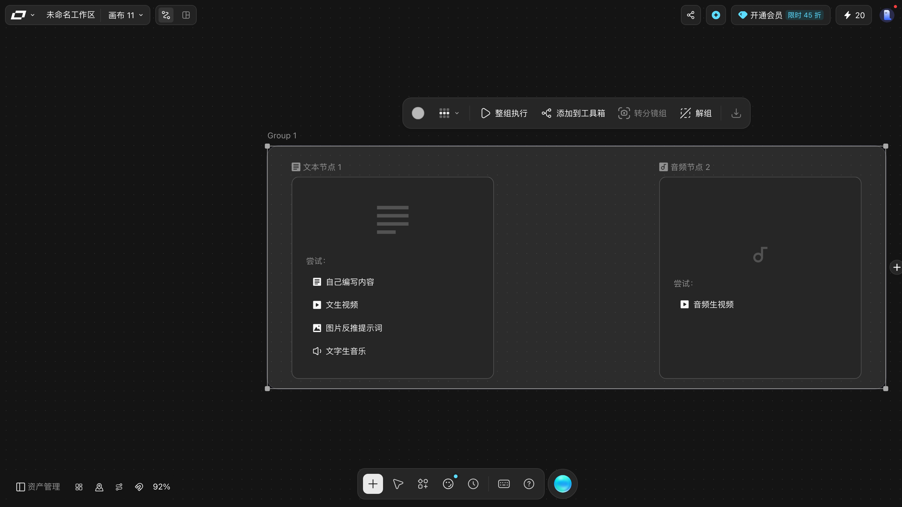

按住组的标题栏（或框边）拖，整组连同里面的所有成员一起移动。实测组框和两个成员同步位移 `(+195, +38)`。

## 复制节点

| 方式 | 键 | 结果 |
|---|---|---|
| 复制选中节点 | `⌘D` | 节点数 +1 |
| 拖出一份副本 | 按住 `Option` 拖动节点 | 节点数 +1，副本自动命名「**原名 - 副本**」 |

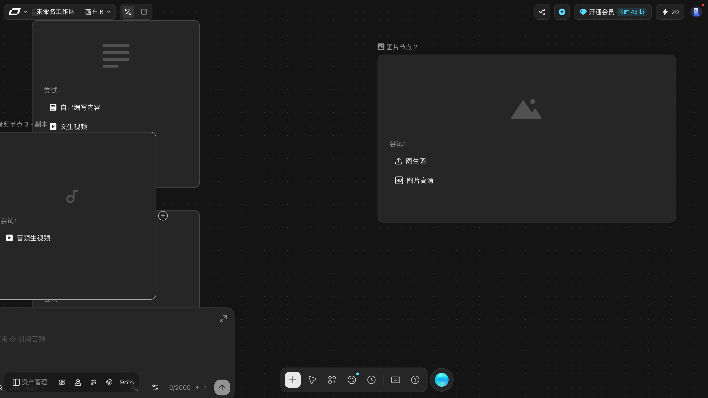

`⌘Z` 撤销、`⌘⇧Z` 重做，两者都实测有效（节点数 `4 → 3 → 4`）。

## 新建节点的另一个入口

焦点在画布上时按 `Tab`，会直接弹出「添加节点」面板，和点 `+` 是同一个面板。

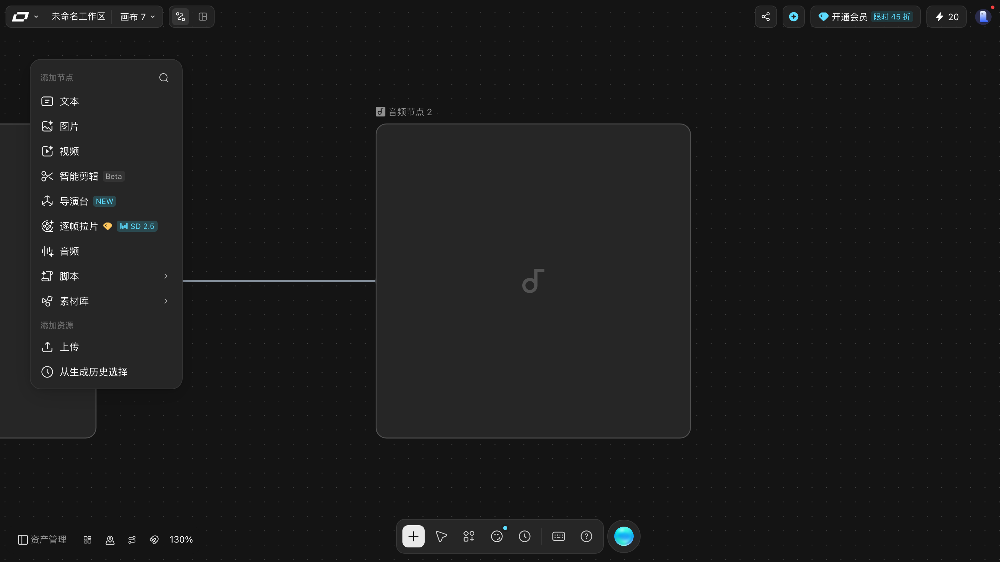

> ⚠️ `Tab` **只开菜单、不直接建节点**，还得再点一次类型。
> 焦点还停在某个输入框里时按 `Tab` 什么也不会发生 —— 先点一下画布空白处再按。

## 找不到节点时用搜索

按 `⌘F` 打开「搜索画布元素」，输入框边打边筛，底部实时显示「共 N 节点」。

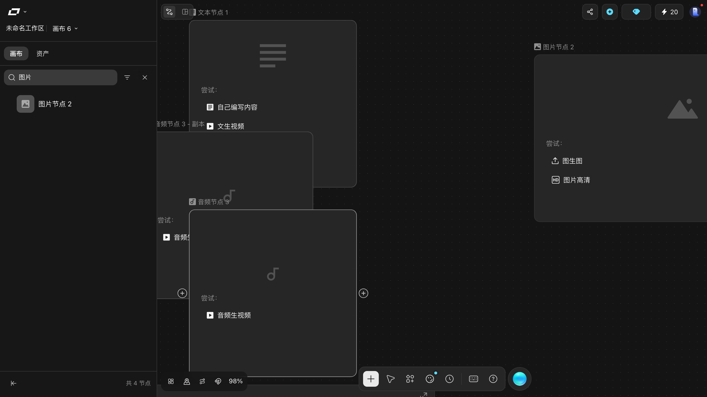

搜索面板**不受视口影响**：即使用 `Space` 把视口拖到离所有节点一万多像素外、画面上一个节点都看不见（见 [organize-canvas.md](organize-canvas.md)），`⌘F` 依然能列出全部节点。**节点很多、又不知道画在哪，这是最可靠的找法。**

---

## 取消与恢复

- 建错类型：选中节点 → 让焦点回到画布 → `⌘A` 全选 → `⌫` 删除。
  ⚠️ **只选中单个节点时直接按删除键是没用的**，实测 `Delete` 和 `Backspace` 单独按都不生效；必须先点画布空白处让焦点离开输入框，再全选删除。
- 建多了想重来：直接删，不需要「回收站」。

## 相关

- [connect-nodes.md](connect-nodes.md) —— 把节点串起来
- [generate-media.md](generate-media.md) —— 参数和积分怎么改
- [shortcuts.md](shortcuts.md) —— 成组 / 复制 / 删除
