# 创建节点：九类节点与它们各自能调什么

> 目标：知道该建哪种节点，建完之后每个旋钮是干什么的。
> 适用角色：普通创作者 · 验证状态：✅ 九类节点全部实跑建出；⚠️ **一次都没有提交过生成**

## 两种建节点的入口

| 入口 | 操作 | 节点落点 |
|---|---|---|
| 添加节点面板 | 点底部工具条最左的「+」 | 固定落在同一个位置 |
| 双击画布 | 在空白处**双击**，再选类型 | **锚在双击点** |

两种入口弹出的是**同一个面板**（下方那张图就是双击弹出的），只是锚点不同。想把节点摆到画布某个特定位置，用双击。

---

## 面板结构


- 顶部有搜索框（无障碍名「搜索画布节点」）；
- 九类节点；
- 底部「**添加资源**」分区：`上传` · `从生成历史选择`。

每一类长这样（下图依次高亮）：

| 文本 | 图片 |
|---|---|
|  |  |

| 视频 | 音频 |
|---|---|
|  |  |

| 脚本（右侧有 ›） | 素材库（右侧有 ›） |
|---|---|
|  |  |

### 面板里那枚「+」会变成「×」

这是判断「面板到底开没开」最快的办法 —— **打开时底栏那枚 `+` 会变成 `×`**，
关掉之后又变回 `+`：


> 这张图还比上面那张旧图多两处细节：`逐帧拉片` 后面跟着一个 🏷 标签和一枚蓝色的 `SD 2.5` 徽标；
> `素材库` 是**带 `›` 的子菜单项**，不是直接建节点。

### 「素材库」下面还有一层

`素材库` 展开后是三项，不是正文里早先记的两项：


| 项 | 副标题 | 角标 |
|---|---|---|
| 风格库 | `新增风格节点` | `NEW` |
| 特效库 | `新增特效节点` | `NEW` |
| **打开工具箱** | — | — |

> ⚠️ 这个面板**不是**从「+」里点出来的 —— 底栏有一枚**独立的** `素材库` 按钮
> （无障碍名就叫「素材库」），点它直接弹这个面板，比走「+」→`素材库` 少一步。

### 「打开工具箱」里有什么

弹出的浮层标题是「**我的工具箱**」，内容是**三列网格的预设卡片**（每张 = 一张预览图 + 名称）：


| 观察 | 实测 |
|---|---|
| 卡片数 | 本次读到 **28** 张 |
| 平台预设的命名 | 一律带前缀 **`【预设】`** —— `【预设】左弧滑行`、`【预设】咖啡杯出场`、`【预设】Live 2D`、`【预设】旅拍转场 zoom in`… |
| 自己建的 | **不带**前缀，本账户的是 `手册取证测试箱` |
| 标题旁 | 一枚 `?` 圆形图标（无障碍名「工具箱模板说明」） |
| 关闭 | 右上角 `×`（`24×24`，无文字无无障碍名 —— 第几次了） |

#### 「使用」按钮要悬停才看得见

每张卡片右下角都有一枚 `使用` 按钮（`50×24`），但**平时看不见**：


这里有个**容易判错的地方**，本手册专门量过两次：

| 读数 | 未悬停 | 悬停后 |
|---|---|---|
| 按钮 `opacity` | `1` | `1` |
| `display` / `visibility` | `flex` / `visible` | `flex` / `visible` |
| 看得见吗 | **否** | 是 |

也就是说 —— 它**不是**故事板那种「`opacity: 0` 悬停变 1」，
而是**一直实实在在、只是被预览图压在下面**，悬停时才浮到图上面。
所以拿「按钮在不在 DOM 里 / opacity 多少」判断它，**一定会判错**。

> 本手册**没有点过任何一枚「使用」** —— 点了会把工具箱套到画布上，属于写操作。

### 九类节点一览

| 节点 | 面板角标 | 点下去会发生什么 |
|---|---|---|
| 文本 | — | 直接建出文本节点 |
| 图片 | — | 直接建出图片节点 |
| 视频 | — | 直接建出视频节点 |
| 智能剪辑 | `Beta` | 直接建出智能剪辑节点 |
| 导演台 | `NEW` | 先在画布建一张卡片，卡片上只有「打开导演台」按钮 |
| 逐帧拉片 | `SD 2.5` | 直接建出逐帧拉片节点 |
| 音频 | — | 直接建出音频节点 |
| 脚本 | 右侧有 `›` | ⚠️ **只展开子菜单**，不建节点 |
| 素材库 | 右侧有 `›` | ⚠️ **只展开子菜单**，不建节点 |

### 两个带子菜单的入口


`脚本` 展开后是 `脚本 NEW` 和 `脚本（旧版）Beta`；`素材库` 展开后是 `风格库` 和 `特效库`。

> 角标含义：`Beta` = 测试期功能，可能变；`NEW` = 新上线；`SD 2.5` = 该节点绑定的模型版本。

---

## 逐类看节点

> 下面每一类都在**一张干净的空画布**上单独建出，保证卡片完整入镜：


### 文本节点


**「尝试：」** 四个模式：`自己编写内容` · `文生视频` · `图片反推提示词` · `文字生音乐`

同一个文本节点能当四种活干，选哪个模式决定下方提示词框的提示语和模型。


提示词框占位文案：`写下你想讲的故事、场景或角色设定。例如：一个来自未来的机器人，在城市屋顶看星星。`

底部显示模型 `GVLM 3.1` 和花费 `6`（积分）。


> **文本节点是唯一没有顶部工具条的节点** —— 实测它的面板里
> `参考` / `标记` / `风格` 一枚都没有（图片三枚、视频五枚、音频一枚）。
> 它也不带 `⚙`，也就没有「高级设置」分区。

文本节点的参数条是四类节点里**最简的**，只有三枚：

| # | 内容 | 悬停提示 |
|---|---|---|
| 1 | `GVLM 3.1 ▾` | （无） |
| 2 | `文A` | **翻译提示词** |
| 3 | 生成按钮 | **请输入提示词** |

> `翻译提示词` 这一枚是**四类节点都有**的（视频 / 图片 / 音频 / 文本），
> 是参数条上最通用的一个工具。
>
> ⭐ **在提示词为空的节点上实点过**：顶部弹一条
> **「提示词为空，请输入内容后点击」** —— 与视频节点那枚 `📄 提示词优化`
> **弹的是同一句话**。
> 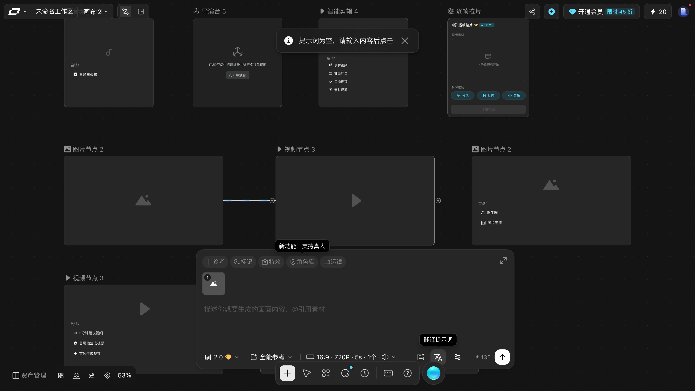
>
> ⚠️ **有内容时点它会发生什么，本手册没试** —— 那会真的发翻译请求，不在取证范围内。
> 手册只保证「空提示词下会弹这条提示」这一条。

### 图片节点


**「尝试：」**：`图生图` · `图片高清`


- 顶部工具：`参考` · `标记` · `风格`（三枚）—— `参考` 和 `标记` 与视频节点是**同一套切模式**，
  `风格` 打开风格广场
- 提示词框占位：`可直接文字生图，或上传图片输入文字指令对图片进行编辑，如：将背景改为雪夜`
- 底部参数条：`Lib Image 2.5 Pro` · `16:9 · 标准画质 · 2K · 1张` · `15`（积分），
  外加四枚纯图标按钮（无文字），其中两枚带 `aria`
- 点开 `⚙` 之后，下面会多出「高级设置」分区：`智能引用 AutoLink`（一个开关，默认开）

`16:9 · 标准画质 · 2K · 1张` 是一串四段式读法：**比例 / 画质档 / 分辨率 / 张数**，点它可以改。

#### ⭐⭐ 参数条最左边那两枚下拉：怎么知道「现在用的是哪个」

参数条最左边两枚带 `⌄` 的按钮，一枚管**用哪个模型**，一枚管**出图参数**。
它们都是「点开选一选就立刻生效」的那种，⛔ 本手册**只打开读，没点过任何一项**。

**第一枚 `Lib Image 2.5 Pro ⌄` —— 模型清单（实测 20 款）**：

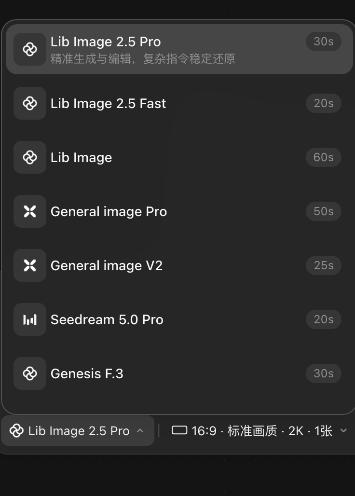

- 每行：左边一枚图标方块，中间模型名，**右边一个耗时角标**（`30s` / `20s` / `15s` …）。
- 20 款逐字为：`Lib Image 2.5 Pro`(30s) · `Lib Image 2.5 Fast`(20s) · `Lib Image`(60s，上新) ·
  `General image Pro`(50s) · `General image V2`(25s) · `Seedream 5.0 Pro`(20s) · `Genesis F.3`(30s) ·
  `Qwen image 3.0`(60s，上新) · `Style Image V8.2`(50s) · `Style Image V8.1`(50s) · `Style Image V7`(50s) ·
  `Style Image Niji 7`(50s) · `Seedream 4.6`(20s) · `Seedream 5.0 Lite`(20s) · `Seedream 4.5`(15s，限时 5 折) ·
  `Z-image Turbo`(10s) · `Qwen Image`(60s) · `Qwen Edit`(60s) · `Seedream 4.0`(15s)。
- ⭐⭐ **当前那一行怎么认**：底色 `rgba(255, 255, 255, 0.15)`，**全列表只有这一行是这个色**
  （其余 56 个可点容器全是 `rgba(0, 0, 0, 0)`）。
  ⭐ 而且**只有当前行多出一行灰色描述**（`精准生成与编辑，复杂指令稳定还原`），别的行没有。
- ⛔ **没有对勾、没有「当前使用」字样、没有 `aria-selected`、没有 `role="option"`** ——
  全列表 20 行一个都没有（实测）。

**第二枚 `16:9 · 标准画质 · 2K · 1张 ⌄` —— 不是一个尺寸列表，是一整块参数面板**：

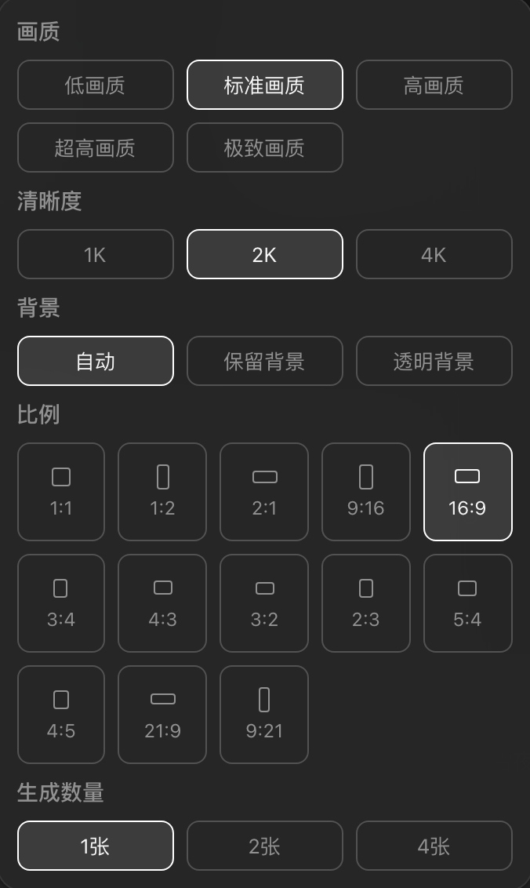

面板是 `342×571` 的一整块（`mantine-Popover-dropdown`，`z-index: 300`），**五组、27 项**：

| 组 | 项数 | 选项 |
|---|---|---|
| **画质** | 5 | `低画质` `标准画质` `高画质` `超高画质` `极致画质` |
| **清晰度** | 3 | `1K` `2K` `4K` |
| **背景** | 3 | `自动` `保留背景` `透明背景` |
| **比例** | 13 | `1:1` `1:2` `2:1` `9:16` `16:9` / `3:4` `4:3` `3:2` `2:3` `5:4` / `4:5` `21:9` `9:21` ——⭐ **每一项上面还有一个按真实宽高比画的空心矩形预览** |
| **生成数量** | 3 | `1张` `2张` `4张` |

- ⭐⭐ **当前值怎么认**：**白色描边**的那一项。读数上清清楚楚 ——
  选中项 = `border-color: rgb(255,255,255)` + `background: rgba(255,255,255,0.1)`；
  未选项 = `border-color: rgb(82,82,82)` + `background: rgba(0,0,0,0)`。
  ⛔ **没有对勾、没有「当前使用」字样、没有 `aria-pressed`**。
- ⭐⭐ **两头对得上**（这是本节结论的交叉验证）：
  五组里白边的那一项分别是 `标准画质` / `2K` / `自动` / `16:9` / `1张`，
  连起来正好就是触发按钮上那串 **`16:9 · 标准画质 · 2K · 1张`**。
  ⇒ **触发按钮上的摘要文字本身就是「当前值」的指示器**，不用点开也能一眼看到。

> 💡 所以「怎么知道现在选的是哪个」在这两处的答案是一样的：
> **看触发按钮上写的是什么。** 点开只是为了改。
> ⛔ 界面里**从来不会**在这两处出现「当前使用」四个字
> —— 全视口搜 `当前使用`，实测 **0 个命中**。

##### ⭐⭐ 四类节点的参数面板**结构完全不同**，别照着图片那一套去找

第二枚下拉点开的面板，**每一类节点都是不一样的一套**。
面板本体都是 `342` 宽的 `mantine-Popover-dropdown`（`z-index: 300`），但**高度和分组都不一样**：

| 节点 | 触发器上写的摘要 | 面板里的分组（逐字） | 面板高 |
|---|---|---|---|
| **图片** | `16:9 · 标准画质 · 2K · 1张` | `画质` 低画质/标准画质/高画质/超高画质/极致画质 · `清晰度` 1K/2K/4K · `背景` 自动/保留背景/透明背景 · `比例` 13 项 · `生成数量` 1张/2张/4张 | `571` |
| **视频** | `16:9 · 720P · 5s · 1个` | `比例` **Auto**/16:9/4:3/1:1/3:4/9:16/21:9 · `清晰度` 480P/720P/1080P/**4K** · `视频时长` · ⭐ **`生成音频` 开启/关闭** · `生成数量` 1个/2个/4个 | `488` |
| **音频** | `中文 · 24k · wav` | `语种` 中文/英文 · `采样率` 8k/16k/24k/48k · `输出格式` wav/mp3/pcm/ogg_opus | `302` |
| **智能剪辑** | `16:9 · 720P · 30s` | `比例` 21:9/16:9/9:16/1:1/4:3/3:4 · `时长` · `清晰度` 480P/720P/1080P | `312` |
| **文本** | —— | ⛔ **没有这个下拉**。文本节点参数条上只有 `GVLM 3.1` 一个文字项，**没有可调参数** | — |

> ⭐⭐ **最容易踩的三个坑**：
> 1. **视频节点的比例里有一项叫 `Auto`**，图片节点**没有** —— 两边的比例选项**不是同一套**。
> 2. ⭐⭐ **视频节点多一个「生成音频：开启 / 关闭」的开关**，别的节点都没有。
>    摘要里**不会显示**它当前是开是关 ⇒ **想知道这个开关的状态，只能把面板点开看**。
> 3. **清晰度档位也不同**：图片是 `1K/2K/4K`，视频是 `480P/720P/1080P/4K`，
>    智能剪辑只有 `480P/720P/1080P`。
>
> 💡 摘要的**分段顺序固定为「比例 / 画质或清晰度 / 时长或张数」**，
> 但**每一段写什么字取决于节点类型**（视频写 `720P`，图片写 `标准画质`）。
> 想知道当前值，**读摘要就够了**，不必点开。
> ⛔ 唯独视频的「生成音频」不在摘要里，是本节唯一一个「必须点开才知道」的设置。

##### ⭐⭐⭐ 视频那块面板长这样（结构和图片的**完全不同**）

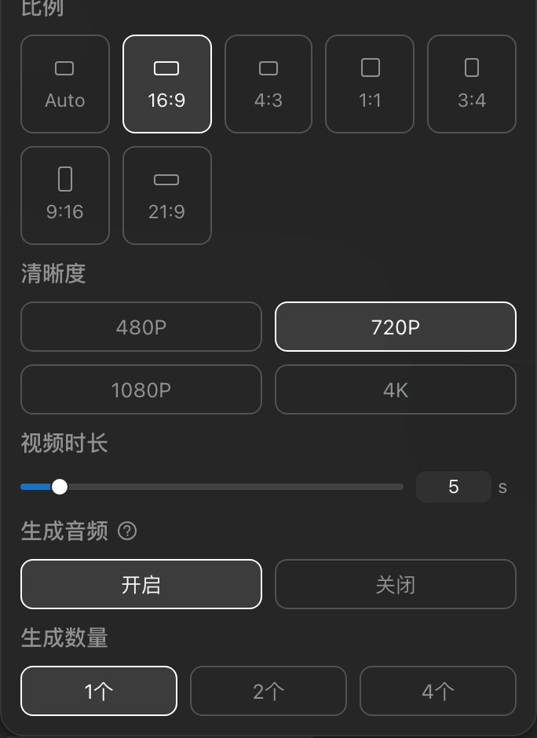

| 组 | 里面是什么 | 当前值（白描边） |
|---|---|---|
| **比例** | `Auto` `16:9` `4:3` `1:1` `3:4` `9:16` `21:9` —— 每项带一个**按真实宽高比画的空心矩形** | **`16:9`** |
| **清晰度** | `480P` `720P` `1080P` `4K` | **`720P`** |
| **视频时长** | ⭐⭐ **不是档位！是一条蓝色滑块 + 一个数字输入框 + 单位 `s`**（现在框里是 `5`） | 滑块位置 |
| **生成音频** ⓘ | ⭐ **`开启` / `关闭` 两段选择器**。标题右边还带一枚 **ⓘ 问号图标** | ⭐ **`开启`**（实测默认） |
| **生成数量** | `1个` `2个` `4个` | **`1个`** |

> ⭐⭐ **「生成音频」默认是「开启」** —— 也就是说**视频节点默认会连带产出音频**，
> 而参数条上的摘要 `16:9 · 720P · 5s · 1个` **一个字都没提它**。
> ⇒ **想关掉它只能把面板点开。** ⛔ 本手册**没有点过**这两枚（会改变出图产物）。
>
> ⓘ 那枚问号图标是新功能提示 —— 画布左上角同时浮着一条「新功能:」的提示条。
> ⛔ 提示条的具体文案本手册**没有读全**。
>
> ⭐ **滑块和档位是两种控件**：图片的「清晰度」是四个按钮，视频的「视频时长」是一条滑块。
> 拖滑块 vs 点按钮，摘要里的那一段字数也跟着变（`5s` / `10s` / `30s` …）。
> ⛔ **滑块的取值范围、最短/最长是多少，本手册没量**（拖它会真的改参数）。


点「标记」进入的也是同一个**元素选择模式**（画布变暗，顶部蓝条写「元素选择模式 / 点击图片选择局部元素」）：


点「参考」则是同一套「从画布或资产管理选择参考」点选模式：


#### 底部那四枚纯图标按钮

图片节点的参数条一共**七枚**，其中四枚是纯图标按钮：

| # | 悬停提示 | 认法 | 点开是 |
|---|---|---|---|
| 3 | **`预设`** | 带 `aria-label="预设"` | **预设工作流选择器**（见下） |
| 4 | **`Panavision DXL2` / `已关闭` / `Arri Signature Prime` / `35mm` / `ƒ/4`** | **无文字、无 `aria`、连 SVG 都没有** | **摄像机面板**（见下） |
| 5 | **`翻译提示词`** | 图标形似「文+A」 | **空提示词时点它**：顶部弹「提示词为空，请输入内容后点击」。有内容时的行为 📖 未试 |
| 6 | （无提示） | 滑块图标 `⚙` | 「高级设置」开关（toggle） |
| 7 | **`请输入提示词或添加参考素材`** | 白色圆形上箭头 | **生成按钮**（本手册没点） |

> 💡 **认按钮的通用办法：把鼠标停在上面等一秒。**
> 参数条上好几枚按钮**既无文字也无 `aria`**，**悬停提示里却直接写着官方名字**。
> 本手册就是靠这一招，把此前完全没记的两枚认了出来 ——
> `文A` = **翻译提示词**、`nosvg` 那枚 = **摄像机面板**。
>
> ⭐ **摄像机那枚的提示最值钱**：它直接把当前的
> `相机 / 镜头 / 焦距 / 光圈` 四个值和开关状态（`已关闭`）写在提示里。
> **不点开也能一眼看出虚拟摄影机现在是设成什么。**
>
> ⚠️ `⚙` 那一枚**悬停什么提示都不给**，只能靠位置认。


#### 参数条上的两枚通用工具

| 图标 | 官方名（悬停实测） | 出现在 | 行为 |
|---|---|---|---|
| `📄` 文档带横线 | **提示词优化** | **只有视频节点** | 提示词为空时**弹顶部提示拒绝执行**：「提示词为空，请输入内容后点击」。**不弹面板、不打开任何窗口** |
| `文A` | **翻译提示词** | **四类节点都有** | 📖 本手册**没点**（会调翻译、可能扣积分） |


> ⚠️ **`提示词优化` 不是每种节点都有** —— 实测**只有视频节点**有这枚。
> 图片节点那个位置是 `预设`，音频和文本节点那个位置没有第三枚。
> 别按位置套用，按悬停提示认。
>
> 💡 `提示词优化` 这个「**先检查、再拒绝**」的行为值得留意：
> 它**不是坏了**，是提示词还没填。
> 同类里最右那枚生成按钮也有一样的脾气，见下。


#### 五类节点的参数条对照

每一类节点参数条上的**纯图标按钮并不相同**，这张表是逐枚悬停实测的：

| 节点 | 参数条总数 | 纯图标按钮（悬停提示） | 生成按钮 |
|---|---|---|---|
| **视频** | 7 | `提示词优化` · `翻译提示词` · `⚙` | ⚡135 |
| **图片** | 7 | `预设` · `摄像机` · `翻译提示词` · `⚙` | 15 |
| **音频** | 5 | `翻译提示词` · `⚙` | ⚡1 |
| **文本** | 3 | `翻译提示词` | 6 |
| **智能剪辑** | 3 | （无纯图标按钮） | `aria-label="发送"` |

> ⭐⭐ **表里那个 `⚙` 是整张表唯一一个「悬停读不出名字」的按钮。**
> Batch EM 用修正后的判据把 **11 个节点逐个点开**重测（每条结论都在同一条参数条上
> 先读到阳性对照、并用 `:hover` 链确认过指针位置），实测 `⚙` 滑块和卡片右上角的
> `⤢` 展开箭头在**每一类节点上都没有悬停气泡**，`⚙` 在视频 / 图片 / 音频上有、
> 文本和智能剪辑上**没有这枚**。详见 [../20-reference.md](../20-reference.md#十一类节点逐个普查的结果)。
>
> ⭐ `⤢` 展开箭头**每一类节点都有**（含逐帧拉片、导演台以外的全部），
> 但它**不在参数条上** —— 它 `28×28`，参数条上的按钮全是 `32×32`。

> **只有「翻译提示词」是有文字/图标节点里四类都有的那枚** —— 参数条上最通用的一个工具。
>
> ⚠️ 智能剪辑**一枚纯图标按钮都没有**，它的生成按钮反而是唯一有无障碍名的。
> 另外它在 DOM 里也是 `react-flow__node-video`（和视频节点同一个 class），
> 只有 `data-id` 前缀 `v-` 和卡片文案能区分 —— 脚本里别拿 class 当类型判据。

#### 最右那枚白圆按钮：什么时候点得动

参数条**最右边**那枚白色圆形上箭头是**生成按钮**，
本手册**没有点过它**（会真实消耗积分、触发生成）。
它的作用是从**禁用状态**读出来的 —— 条件没满足时它点不动，而且会告诉你缺什么：

| 节点 | 提示词为空时 | 悬停提示 |
|---|---|---|
| **图片节点** | `disabled`、`cursor: not-allowed` | **请输入提示词或添加参考素材** |
| **音频节点** | `disabled`、`cursor: not-allowed` | **请输入提示词或添加参考素材** |
| **文本节点** | 点不动 | **请输入提示词** |
| **视频节点** | `disabled: false`、`cursor: pointer` | （无提示） |

> 💡 所以「点了没反应」有时候是**它本来就点不动**，
> 而**它会把缺什么写在提示里** —— 先读这一句，比反复点省事。
> 注意图片和音频写的是「提示词**或添加参考素材**」——
> 意思是**光有文字不够，挂了参考素材也能生成**。
>
> ⚠️ 视频节点这一枚在提示词为空时**实测是可点的**，
> 但本手册**仍然没有点**，因为它会真的扣掉 `135` 积分发起生成。
>
> ⭐⭐ **Batch EM 逐节点复核过这张表，四行全部逐字对上**（每一行都是在同一条参数条上
> 先读到阳性气泡、再下结论，并用 `:hover` 链确认过指针精确压在那个元素上）：
>
> | 节点 | 实测读到的气泡原文 | 复核 |
> |---|---|---|
> | 图片 | `请输入提示词或添加参考素材` | ✅ 与上表一致 |
> | 音频 | `请输入提示词或添加参考素材` | ✅ 与上表一致 |
> | 文本 | `请输入提示词` | ✅ 与上表一致（**没有**「或添加参考素材」那半句） |
> | 视频 | ⛔ **一个气泡都不出** | ✅ 与上表「（无提示）」一致 |
>
> ⇒ 「视频节点这一枚不灰、也没提示」是**真阴性**：同一根参数条上它左边两枚
> （`提示词优化`、`翻译提示词`）都能正常读出气泡，只有它读不出。
> 它点下去具体会发生什么（进度在哪、能不能取消），📖 本手册未验证。

右上角还有一枚 `⤢` 展开图标。**它的用途在 2026-10 的复核里查清了：打开这个节点的「大编辑器」** ——
详见 [「⤢」打开节点的大编辑器](#大编辑器) 那一小节。
⚠️ 早先这里写着「**它在图片节点上是 `cursor: not-allowed` 点不动**」——
**那条是错的，已更正**：节点**选中**状态下实测，图片节点上它是 `pointer`，点得动，而且真的会收起卡片。

<a id="大编辑器"></a>

<a id="尝试栏"></a>

#### ⭐⭐ 节点卡片上还有一栏「尝试：」—— 手册此前完全没写

⭐⭐⭐ **每个节点卡片的正文里都有一栏 `尝试：`，列着这个节点能被怎么用。**
它是**一枚枚带图标的按钮**（`<button>` + 一枚 SVG 图标 + 一行文字，`cursor: pointer`），
不是文字、不是标签。

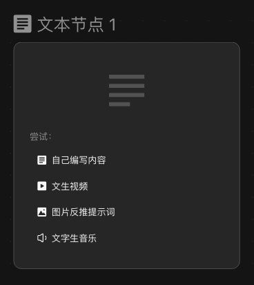

**取证画布上 11 个节点的全量普查**（逐个读 DOM，不是抽几个）：

| 节点 | 有没有「尝试」栏 | 栏里逐字写着 |
|---|---|---|
| 文本节点 1（`t-2AK3Ukyxj3`） | ✅ | `自己编写内容` · `文生视频` · `图片反推提示词` · `文字生音乐` |
| 文本节点 1（`t-UtVx3lZmrV`） | ✅ | 同上（**两个同名节点内容一致**） |
| 视频节点 3（`v-v2hlWY4Br3`） | ✅ | `5分钟超长视频` · `首尾帧生成视频` · `首帧生成视频` |
| 智能剪辑 4（`v-oZNpH99MtM`） | ✅ | `讲解视频` · `批量广告` · `口播视频` · `素材混剪` |
| 图片节点 2（`i-sODTbgLUm1`） | ✅ | `图生图` · `图片高清` |
| 音频节点 6 ⚠️ `（原 a-CUfJfmKzUJ）` | ✅ | `音频生视频` |
| 音频节点 1（`a-THmbuJXQj4`） | ✅ | `音频生视频` |
| 音频节点 7（`a-GgqvrVz0pw`，Batch ED 新建） | ⛔ **没有** | 它是**误删后重建的空节点**，预置尝试项没有跟着回来 |
| 图片节点 2（`i-9nlG6HdjK2`） | ⛔ **没有** | — |
| 视频节点 3（`v-eMpqKtiLlx`） | ⛔ **没有** | — |
| 逐帧拉片（`b-mfkcQNULC3`） | ⛔ **没有** | — |
| 导演台 5（`n-56F19pXVB4`） | ⛔ **没有** | — |

> ⭐⭐⭐ **关键：这不是「节点类型」的属性，是「每一个节点」各自的状态。**
> 同一种类型、同一个名字的两个节点，**一个有、一个没有** ——
> `图片节点 2` 的两个副本（`i-sODTbgLUm1` 有 / `i-9nlG6HdjK2` 没有）、
> `视频节点 3` 的两个副本（`v-v2hlWY4Br3` 有 / `v-eMpqKtiLlx` 没有）都是这样。
> ⇒ **别按类型推断某一类节点有没有这一栏**，要一张一张看。

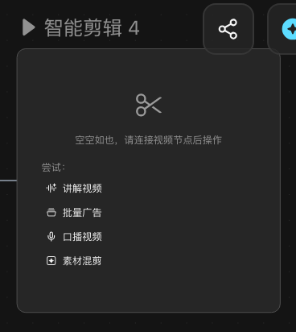

⭐⭐ **智能剪辑那四项，和大编辑器「模式」菜单里那五个是同一批** ——
「模式」菜单是 `默认模式` 加这四个，节点卡片上的「尝试」就是这四个。
（视频 / 文本 / 图片 / 音频那几类**没有**这个对应关系。）

> ⛔ **一个都没点过。** 这些按钮各自通向什么（新建一个节点？改这个节点？直接开始生成？）
> **本手册没有测** —— 那必然要写盘，而「是哪一种写盘」在动手前说不清。
> ⛔ 也不排除有些按钮是**禁用的**（灰色）：本轮只确认了它们可被命中、
> `cursor: pointer` 读数正常，**没有逐个点下去看有没有反应**。
>
> ⭐ **唯一一条间接线索**（Batch CZ 已复核，**这条不成立**）：
> 早先一轮说「进入参考选择模式时，这一栏末尾在 DOM 里多出一个 `取消选择`」，
> 本轮**两种状态各量一次几何**（未选中 / 已选中），**都没有这一项**：
> 视频节点 3 的「尝试」栏只有 `尝试：` + `5分钟超长视频` + `首尾帧生成视频` + `首帧生成视频` 四行，
> 栏 `scrollHeight == clientHeight`、祖先链 6 层全是 `overflow: visible`
> ⇒ **既没有「多出一项」，也没有任何裁切**。
> 📖 早先那一轮为什么读到过，本手册**说不清**，只如实记在这里。

> 💡 认这一栏**只能靠位置**（卡片正文里 `尝试：` 下面那一列）：
> 按钮既没有 `aria-label`、也没有 `role`，文字各不相同。
> 节点标题那一行的 class 是 `text-[13px] cursor-text pointer-events-auto`，
> 和「尝试」项的 `<button>` 完全是两回事，别认混。

#### ⭐⭐⭐ 「⤢」：打开节点的大编辑器


| | 实测结果 |
|---|---|
| 它在哪 | 参数卡片**右上角**，`28×28`，图标是**双向斜箭头**（左下 ↔ 右上），父容器就是那张参数卡 |
| 悬停有没有名字 | ⛔ **一个字的提示都没有**（阳性对照：同一次悬停采样里读出了 15 条按钮附近的文字，唯独没有它的） |
| 点它之后 | ⭐⭐⭐ **不是收起卡片 —— 是弹出一个居中的大编辑器** |
| 大编辑器多大 | 起点 `[320, 105]`、`800×600`，`z-index: 601`；它后面压一层 `bg-black/50` 遮罩（`z-index: 600`）把整块画布压暗 |
| 为什么**看着像**收起 | 模态一开，节点里那张内联卡片**整个不渲染了**：提示词框没了、`⤢` 也没了，只剩标题那几行字 |
| 怎么关 | ✅ **点模态外面那层压暗的遮罩**；也可以点模态**右上角那枚 `28×28` 的收拢箭头**（`absolute right-2 top-2`，实点一下模态就关了） |
| ⛔ **ESC 不是可靠的关闭方式** | 三组对照，差别只在**焦点在哪**：见下一小节 |
| ⛔ **点模态以内关不掉** | 见下下小节 |
| 存不存盘 | ⭐ **不存**：刷新后遮罩和模态都没了，节点变回**未选中**态 |
| 扣不扣积分 | ⭐ **不扣**（顶栏 `20 → 20`） |


↑ 这是 `⤢` 平时待着的位置：**压在参数卡片的右上角**，
它**不在参数条上** —— 参数条上的按钮全是 `32×32`，`⤢` 是 `28×28`。

**四类节点弹出来的都是同一个 800×600 模态，只是里面的内容按节点类型换**（模态全文逐字抄）：

| 节点 | 模态里逐字写着 |
|---|---|
| 智能剪辑 | `参考 1` · `描述想剪成什么效果` · `默认模式` · `16:9 · 720P · 30s` |
| 图片 | `参考 标记 风格` · `可直接文字生图，或上传图片输入文字指令对图片…` |
| 文本 | `写下你想讲的故事、场景或角色设定。例如：一个来自未来…` |
| 音频 | `参考` · `描述你想要的音频效果，可用 @ 引用音频` · `Seed Audio 1.0` · `中文 · 24k · wav` · `0/2000` · `1` · `高级设置` · `语速` |

> ⭐⭐ **新发现：参考缩略图角上那枚 `15×15` 的角标，气泡和图标对不上。**
> 在**智能剪辑**节点上悬停它（class `absolute right-0.5 top-0.5 z-20 flex size-[15px]`，
> 背景 `rgb(51, 51, 51)`，图标 path 以 `M15.8.12a.4.4` 开头），
> 读出来的气泡逐字是 —— **`双击可聚焦至节点`**。
> 而它长得像个 `×`（删参考素材）。
> ⇒ 这枚角标**自己没有文案，气泡是从父容器（缩略图）继承来的**。
> ⛔ **本手册仍然没有点过它**（不确定点下去是删素材还是别的动作）。
>
> 💡 顺带：**双击参考缩略图本身可以把这个节点聚焦到屏幕中央** ——
> 节点飘到画面外、又不想用 `⌘F` 找的时候，这是第三条路。

**大编辑器里有哪些东西**（视频节点逐个读出来的 `6` 枚按钮 + `1` 个输入区，**一个都没点**）：

| 位置 | 是什么 | 备注 |
|---|---|---|
| 左上 | `参考` `54×26` | 视频节点还挂着一枚带角标 `1` 的参考缩略图 |
| 缩略图右上角 | `15×15` 的 `×` | ⛔ 它的父容器是那枚 `48×48` 的参考缩略图 —— **是删参考素材的按钮，本手册没点过**。⭐⭐ **但它悬停出来的气泡写的是「双击可聚焦至节点」**（见下） |
| 输入区 | `774×25` 的可编辑区域 | 空的时候占位是「描述想剪成什么效果」 |
| 底部左 | `默认模式` `102×32` | 带下拉箭头 |
| 底部中 | `16:9 · 720P · 30s` `157×32` | 带下拉箭头 |
| 底部右 | 无障碍名 `发送` `32×32` | ⛔ **描述为空时是灰的，点不动**（`disabled: true`）。真要生成得先写描述，那是**扣积分**的动作 |
| 右上角 | 收拢箭头 `28×28` | ⭐ **它有 `aria-label="缩小"`** —— 和风格详情浮层右上角那枚**逐字相同**（同一个 path `M9.76 10.59c.28 0 .5.22.5.5v8a.4.4…`）。⛔ 悬停没有气泡；⭐ **实点有效**，点了就回画布 |

#### ⛔ `ESC` 到底能不能关 —— 三组对照，差别只在**焦点在哪**

| 组 | 按 `ESC` 之前做过什么 | 焦点 | 按下 `ESC` 之后 |
|---|---|---|---|
| A | 打开模态后**什么都不点** | `body` | ⛔ **模态纹丝不动** |
| B | 先点一下模态内的空白处 | 仍是 `body` | ⛔ **模态纹丝不动** |
| C | 先点开一个下拉菜单 | `button.flex h-8 min-w-0 shrink items-center…`（菜单那枚按钮） | ✅ **模态关掉了** |

👉 所以 **`ESC` 不是这个浮层的快捷键** —— 它关不关得掉，取决于**焦点有没有落在浮层里的某个控件上**。
**别指望键盘**：点屏幕角落的遮罩永远有效。

> ⚠️⭐⭐ **但这不能推广成「所有浮层的 `ESC` 都不靠谱」。**
> ⭐ **风格广场那一层就关得掉**：广场开着、焦点在 `body` 上，直接按 `ESC`
> ⇒ 实测 z=701 的广场和 z=700 的压暗层**一起消失**，
> 屏幕上只剩那个常驻的「正在跟随 / 取消 / ESC 按 ESC 退出」小横幅。
> ⇒ `ESC` 的行为**逐层不同**，别拿一层的读数去推另一层。
> 见 [asset-library.md](asset-library.md)。

#### ⭐⭐⭐ 底部左边那个下拉是「模式」—— 一共五个

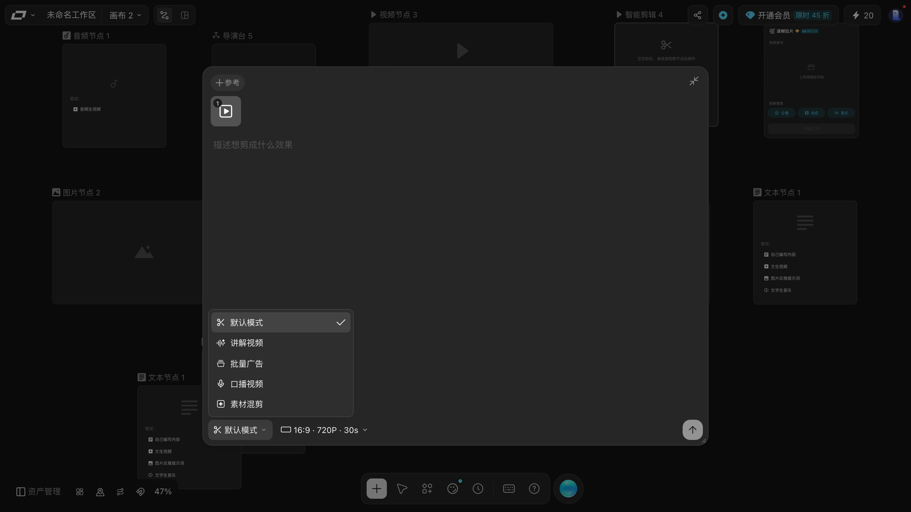

| 顺序 | 模式 | 图标 |
|---|---|---|
| 1 | **`默认模式`**（当前选中，带对勾） | 剪刀 |
| 2 | `讲解视频` | 声波 |
| 3 | `批量广告` | 清单 |
| 4 | `口播视频` | 麦克风 |
| 5 | `素材混剪` | 方框加号 |

⭐⭐ **这五个名字和节点卡片上那一栏「尝试：」是同一批** ——
`智能剪辑 4` 的卡片上写着 `尝试：讲解视频 / 批量广告 / 口播视频 / 素材混剪`，
正好是这个菜单去掉「默认模式」之后的那四个。
👉 也就是说：**节点卡片上的「尝试」就是这些模式的快捷入口。**

> ⛔ **本手册一个选项都没选过** —— 换模式会改写这个节点的设置。
> 下拉选项**没有 `role="option"`**，是普通 `div`，所以按语义查是查不到的。

#### ⭐⭐⭐ 底部右边那个下拉是「规格」—— 比例 / 时长 / 清晰度三合一

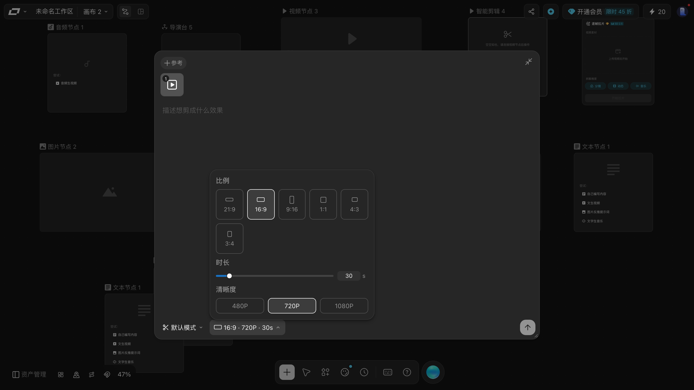

| 段 | 内容 | 实测参数 |
|---|---|---|
| **比例** | `21:9` · `16:9` · `9:16` · `1:1` · `4:3` · `3:4`（**六档**） | 每档一枚 `div` 按钮，各带一个**画框形状图标**（宽屏 / 标准 / 竖屏 / 方 / 横 4:3 / 竖 4:3）。当前选中的那档高亮 |
| **时长** | ⭐ **是一根滑杆，不是一排选项** | `role="slider"`，`aria-valuemin=0`、`aria-valuemax=300`、`aria-valuenow=30`；右边跟一个数值框和单位 `s` |
| **清晰度** | `480P` · `720P` · `1080P`（**三档**） | 当前选中的那档高亮（截图里是 `720P`） |

> 💡 顶部那行 `16:9 · 720P · 30s` **三个值各对应下面一段** ——
> 改比例改第一段、改时长改第二段、改清晰度改第三段，不是三个独立下拉。
>
> ⚠️ **时长滑杆上限是 300 秒**，不是 30 —— `30s` 只是当前值。
>
> ⛔ 同样**一个都没选过**：改比例 / 时长 / 清晰度都是在改这个节点的生成参数。

<a id="另外三类的大编辑器"></a>

#### ⭐⭐⭐ 壳是同一个，**内容四类几乎不重叠** —— 而图片节点那一类最丰富

上面盘的是**智能剪辑**。另外三类逐个盘过之后发现：壳（`800×600` + 压暗遮罩 + 右上角收拢箭头）四类共用，
**里面装的东西几乎没有任何重叠**。逐字抄的模态全文：

| 节点 | 大编辑器全文 |
|---|---|
| 图片 | `参考 标记 风格` · `可直接文字生图，或上传图片输入文字指令对图片进行编辑，如：将背景改为雪夜` · `Lib Image 2.5 Pro` · `16:9 · 标准画质 · 2K · 1张` · `15` · `高级设置` · `智能引用 AutoLink` |
| 文本 | `写下你想讲的故事、场景或角色设定。例如：一个来自未来的机器人，在城市屋顶看星星。` · `GVLM 3.1` · `6` |
| 音频 | `参考` · `描述你想要的音频效果，可用 @ 引用音频` · `Seed Audio 1.0` · `中文 · 24k · wav` · `0/2000` · `1` · `高级设置` · `语速` · `声调` · `音量` |

##### ⭐⭐ 图片节点：模型菜单 19 个，规格面板分五段

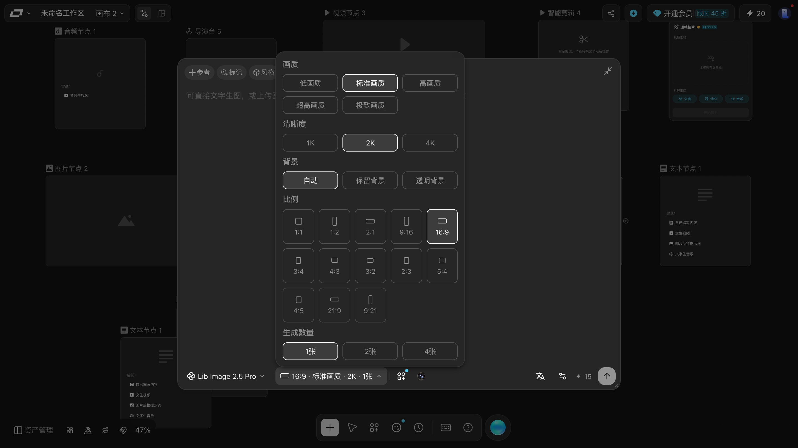

| 那一行写着 | 点开是什么 | 档数 |
|---|---|---|
| `Lib Image 2.5 Pro` | **模型菜单**：读出 **19 个模型**，每个后面跟一个耗时（`10s`～`60s`）；`Lib Image 2.5 Pro` 带一句说明「精准生成与编辑，复杂指令稳定还原」；`Qwen image 3.0` 标着 `上新`，`Seedream 4.5` 标着 `限时5折` | **19** |
| `16:9 · 标准画质 · 2K · 1张` | ⭐ **五段规格面板**（视频只有三段） | 见下 |
| └ `画质` | 低画质 / 标准画质 / 高画质 / 超高画质 / 极致画质 | **5** |
| └ `清晰度` | `1K` / `2K` / `4K` | **3** |
| └ `背景` | `自动` / `保留背景` / `透明背景` | **3** |
| └ `比例` | ⭐ `1:1` `1:2` `2:1` `9:16` `16:9` `3:4` `4:3` `3:2` `2:3` `5:4` `4:5` `21:9` `9:21` | **13** |
| └ `生成数量` | `1张` / `2张` / `4张` | **3** |

模型菜单里读到的 19 个（逐字）：
`Lib Image 2.5 Pro` · `Lib Image 2.5 Fast` · `Lib Image` · `General image Pro` · `General image V2` ·
`Seedream 5.0 Pro` · `Qwen image 3.0` · `Style Image V8.2` · `Style Image V8.1` · `Style Image V7` ·
`Style Image Niji 7` · `Seedream 4.6` · `Seedream 5.0 Lite` · `Seedream 4.5` · `Z-image Turbo` ·
`Qwen Image` · `Qwen Edit` · `Genesis F.3` · `Seedream 4.0`

##### ⭐⭐ 图片节点还有三枚**内联卡片上没有**的按钮

| 位置 | 认它的依据 | 点开是什么 |
|---|---|---|
| 顶部工具排 | 文字 `标记` | ⭐ **元素选择模式**（见下） |
| 顶部工具排 | 文字 `风格` | ⭐ **风格广场**（和素材库里是同一个，见下） |
| 底部第二排 | 一枚**深色镜头球**；**没有 SVG 路径**；悬停气泡读出 **`Panavision DXL2`** 和 **`已关闭`** | ⭐ **相机参数面板**：`摄像机` → `相机` `Panavision DXL2` → `镜头` `Arri Signature Prime` → `焦距`（`8` `14` `24` `35` `50` `75` `125` `mm`，**七档**）→ `光圈`（`ƒ/4`）→ `关闭`。⭐⭐ 更正：早先记「那颗球是 CSS 背景画的」**是错的** —— 球里是**两枚 ``**（产品给贴了 `data-camera-control-icon="light"` / `"dark"`，亮暗两套切换） |
| 底部第二排 | 图标 `M14 17H5M19 7h-9` | ⭐ **就是手册里那个 `⚙` 高级设置**，和内联卡片**同一套机制** —— 点它多出 `高级设置` / `智能引用 AutoLink` 那一行。⭐ 独立复现过：那一次同时读到**底栏 7 枚按钮整体上移了 85px**（`y 664 → 579`），和「多出一行」对得上 |
| 底部第二排 | 无障碍名 `预设` | ⭐ **19 条预设**，分五组：`分镜叙事`（`故事板` `25宫格连贯分镜` `剧情推演四宫格` `画面推演 - 3秒后` `画面推演 - 5秒前`）· `质感调节`（`人像质感调节` `电影级光影校正`）· `空间与机位`（`720全景` `多机位九宫格`）· `设定图`（`角色脸部三视图` `角色设定图` `角色三视图` `场景设定图` `产品设定图`） |

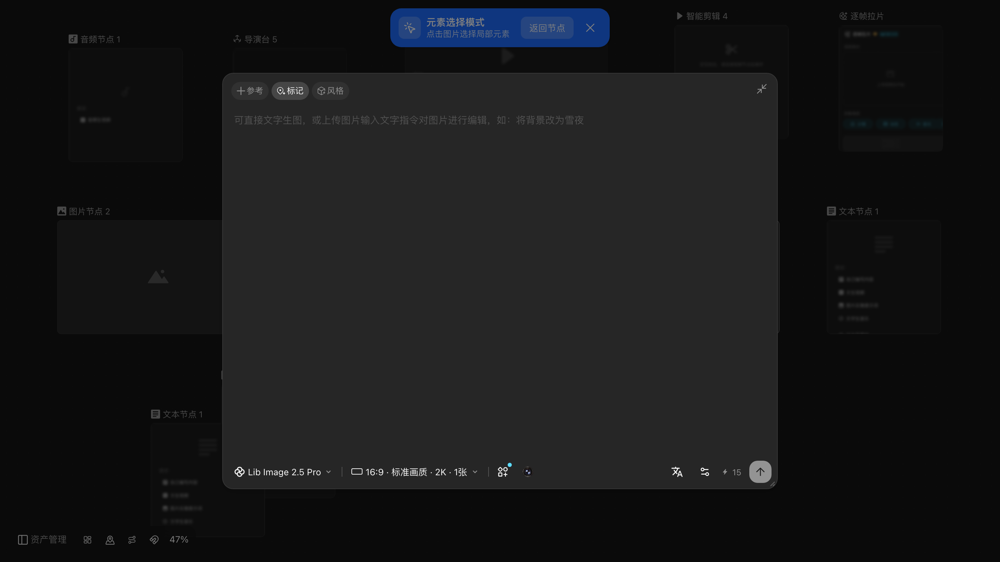

⭐ **`标记` = 元素选择模式**：顶栏正中浮出蓝色横幅 `元素选择模式`，
副标 **`点击图片选择局部元素`**，右边是 `返回节点` 和 `×`。
（和下面那条「参考选择模式」的横幅**同一个位置、同一个结构**，只是文案不同。）

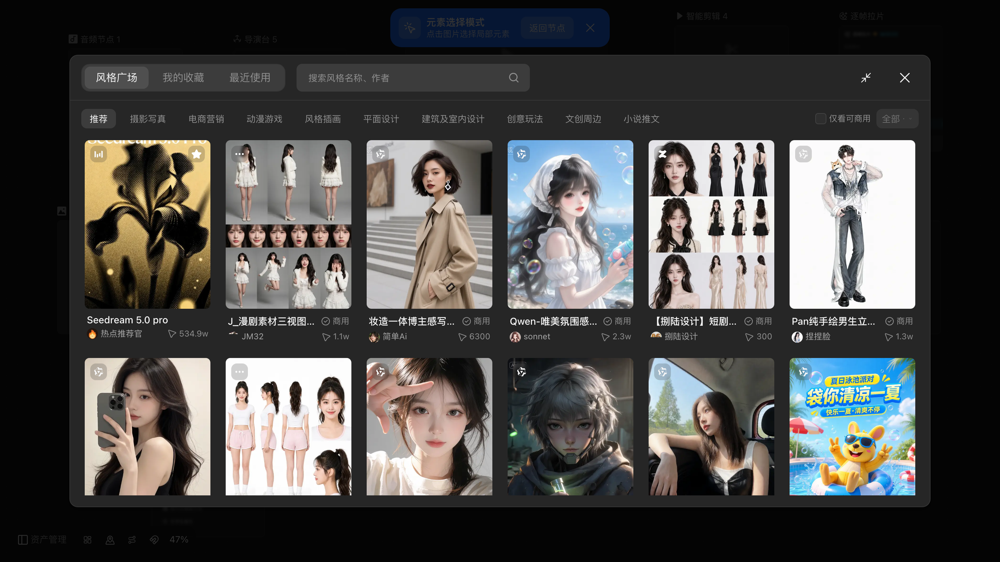

⭐⭐ **`风格` 打开的广场和素材库里那个是同一个** ——
分类行逐项一致：`推荐` `摄影写真` `电商营销` `动漫游戏` `风格插画` `平面设计` `建筑及室内设计`
`创意玩法` `文创周边` `小说推文`（**10 个**）+ `仅看可商用` 勾选 + `全部` 下拉。
⇒ [asset-library.md](asset-library.md) 里「**点一下卡片就进画布**」的结论**在这里同样成立**。

> ⭐ **卡面那枚扇形图标配的数字，单位是「万」** ——
> 同一屏上既有 `534.9w` `2.3w` `1.1w`（带 `w`），也有 `6300` `300`（不带），
> `w` 就是「万」，不到一万的直接写原值。
> ✅ **这个数字统计的是什么也已结清（Batch DU/DV/DX）**：它是 `runCount`，即这张风格
> **被使用过多少次**；`< 10000` 原样显示、`≥ 10000` 缩写成 `(值÷10000).toFixed(1)` + `w`
> （`10700 → 1.1w`、`5375500 → 537.5w`），跨风格与特效两个广场**累计 99 个样本、零例外**。
> ⭐⭐ 顺带一条实操提醒：**点一下卡片不会让它加 1**（DK 实测，刷新重进差值 `0`），
> 所以别把「我点过它」当成「它在涨」。
> 详见 [asset-library.md](asset-library.md) 的「风格广场」一节。

##### 文本节点：只有一个模型菜单

| 那一行写着 | 点开是什么 |
|---|---|
| `GVLM 3.1` | **4 个模型**：`GVLM 3.1`（`20s`，带说明「多模态文本模型Pro」）· `CVLM 5.5`（`10s`）· `GVLM 3.1 Flash`（`15s`）· `Qwen 3 VL Flash`（`10s`） |

⭐ 文本节点的大编辑器**没有规格下拉**（底部只有 `GVLM 3.1`、两枚图标按钮、`发送`），
顶排也**没有** `参考` / `标记` / `风格` 那一排。

##### 音频节点：模型 + 音频规格

| 那一行写着 | 点开是什么 |
|---|---|
| `Seed Audio 1.0` | **6 个模型**：`Seed Audio 1.0`（带说明「多模态音频生成，支持人声、音效、音乐一体化创作」）· `Minimax-speech-2.8-hd` · `Minimax-speech-2.8-turbo` · `Eleven V3` · `Eleven Music V3` · `Mureka V8` |
| `中文 · 24k · wav` | ⭐ **三段**：`语种`（`中文` / `英文`）· `采样率`（`8k` `16k` `24k` `48k`）· `输出格式`（`wav` `mp3` `pcm` `ogg_opus`） |

⭐ 音频节点顶排**只有 `参考` 一枚**（没有 `标记` / `风格`）；
`高级设置` 点开是 `语速` / `声调` / `音量` 三个滑杆 —— 和内联卡片那三个是同一套。

> ⛔ **以上所有菜单、所有选项，除「点开看看」外一个都没点过** ——
> 换模型、改规格、选风格、开相机模拟，全都是在改这个节点的设置。
> ⛔ **本轮唯一点过的「危险」按钮是那枚灰着的发送键**：
> 描述为空时它读作 `disabled: true`、`cursor: not-allowed`，
> **隔离重测点它 ⇒ 画面上什么都没发生、新出现 0 条、顶栏积分仍是 20**。
> ⭐ 所以「描述没写就点发送」既不报错也不扣分 —— **它就是一块砖**。
> （第一轮我一度把浮出来的 `提示词为空，请输入内容后点击` 记在这枚按钮头上，
> 隔离重测推翻了那个归因：那句话是序列里点旁边另一枚按钮时出现的。）

#### ⭐⭐ 「参考」按钮点开不是面板，是**整个换一种模式**

点大编辑器左上角那枚 `参考`，发生的是这一整套：

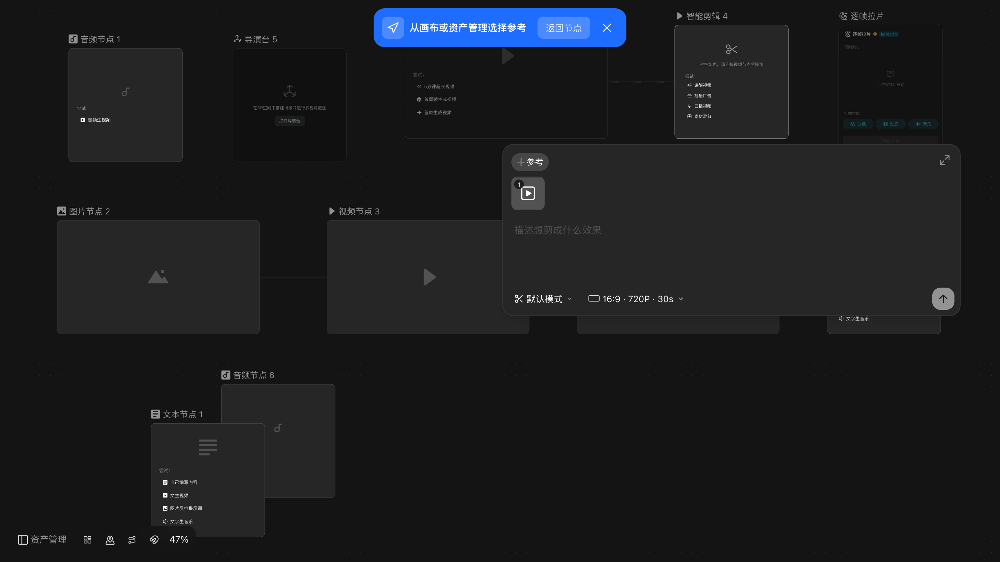

| 变化 | 实测 |
|---|---|
| 大编辑器 | ⭐ **整个关掉**（`z-index: 601` 那一层没了） |
| 节点内联卡片 | ⭐ **回来了** —— 屏幕空间里那枚 `660×248` 的卡片（它不随画布缩放） |
| 顶栏正中 | ⭐ 浮出一条横幅：`pointer-events-auto absolute left-1/2 z-50 -translate-x-1/2`，`[538, 12, 364×56]`，逐字写着 **`从画布或资产管理选择参考`** |
| 横幅上的按钮 | `返回节点` `76×32`；以及一枚 `32×32` 的 `×`，**无障碍名是 `退出`** |
| 候选节点 | ⭐ **每个节点的卡片上都多出一栏「尝试：」**，写出它能怎么被用（见下表） |
| 画布缩放 | ⭐ **没有变化**。进模式前 / 进模式后 / 退出后三次读数**完全一致**（`matrix(0.468869, 0, 0, 0.468869, …)`）—— 左下角那个 `47%` 是 `⌘0` 适合屏幕的结果，不是这次变的 |
| 怎么退出 | ✅ 点横幅上的 `×`（无障碍名 `退出`）—— 实点有效，横幅消失、节点卡片回到原样 |

**每个候选节点「尝试」栏里写的东西**（逐个读出来的）：

| 节点 | 「尝试」栏 |
|---|---|
| 智能剪辑 4 | `讲解视频` · `批量广告` · `口播视频` · `素材混剪` |
| 视频节点 3 | `5分钟超长视频` · `首尾帧生成视频` · `首帧生成视频` |
| 文本节点 1 | `自己编写内容` · `文生视频` · `图片反推提示词` · `文字生音乐` |
| 图片节点 2 | `图生图` · `图片高清` |
| 音频节点 | `音频生视频` |

> ⛔ **没有点过任何一个候选节点** —— 那会把素材真的接进节点、写盘。
> 📖 所以「在这个模式里点一下候选节点会发生什么」本手册**没有测**。
> ⭐ 已确认的只有：悬停候选节点**不会**浮出「参考」按钮
> （读到的 `音频生视频` 是它自己那栏「尝试」里的条目，不是选择按钮）。
>
> ⛔ **更正一条旧读数**（Batch CZ）：这里原来写「读到过一个 `取消选择`，
> 但卡片高度把它裁掉了」。本轮两种状态各量一次几何，**`取消选择` 这一项根本没有渲染**，
> 也没有任何裁切（`scrollHeight == clientHeight`、六层祖先全是 `overflow: visible`）。
> ⇒ 「被裁掉」这个解释是错的。**用户看不到它，也点不到它。**

#### ⭐⭐ 「点一下节点标题能不能恢复」—— 取决于标题在不在模态框里

大编辑器盖住的是**屏幕正中那一块 `800×600`**，其余地方都是能点的遮罩。
所以「点一下节点标题」这条规律**不是通用的**，它只取决于标题栏**落在模态框内还是框外**：

| 节点 | 节点标题的位置 | 在模态框内？ | 点标题的结果 |
|---|---|---|---|
| 视频 `智能剪辑 4` | `(1018, 22)` | ⛔ 框外（落在遮罩上） | ✅ `45 → 104`，模态关了 |
| 文本 `文本节点 1` | `(263, 596)` | ⛔ 框外（`x=263 < 320`） | ✅ `46 → 83`，模态关了 |
| 图片 `图片节点 2` | `(877, 304)` | ✅ **框内** | ⛔ `39 → 39`，点进了模态的提示词区，关不掉 |

👉 **可靠的关法只有一个：点模态外面那层压暗的遮罩**（屏幕四角任意一处都行）。

> ⭐⭐⭐ **撤回本手册早先关于这枚按钮的整串旧账。**
> 此前写的是「`⤢` 把参数卡片收起来」，并由此派生出一整串结论。**全部作废**，机制就是上面这一条：
>
> | 旧结论 | 实际 |
> |---|---|
> | 「点它整张卡片收起来，节点只剩标题」 | ⛔ **不是收起**。是弹出了大编辑器、节点内联卡片停止渲染 —— 读数一样，机制完全不同 |
> | 「⛔ 收起用不回来」 | ⛔ **作废**。能关：点遮罩，或点模态右上角那枚收拢箭头 |
> | 「✅ 点一下节点标题就能恢复」 | ⚠️ **只在标题栏落在模态框外时成立**（视频 ✅ / 文本 ✅ / 图片 ⛔ 三条实测各占一半） |
> | 「⛔ 刷新页面不管用」 | ⛔ **作废**。刷新后读到的小数字是**节点变成了未选中**，不是「还收着」—— 实测 `选中: false` |
> | 「文本节点上 `⤢` 点了没反应」 | ⛔ **作废**。那个节点的 `⤢` 落在 `x=1566`，而视口只有 `1440` 宽 —— **点的是视口外的空气** |
> | 「图片节点『点标题恢复』不稳定，遇到多试一次」 | ⛔ **作废**。不是不稳定，是**取决于节点在画布上的位置**：标题栏被模态框盖住就点不动 |
>
> ⭐ 一连错这么多轮，是因为**判据只量了「卡片在不在」**，
> 而「卡片不在」这件事**有两个成因**（模态开着 / 节点没选中）—— **只量它必然读出假的稳定值**。
> 补上「铺满视口的固定层有哪几枚」这一读数，真相一步就出来了。

#### ⚠️⚠️ `⤢` 点不到的三种原因（三条都实测过，互不相同）

| # | 原因 | 读数 | 怎么办 |
|---|---|---|---|
| 1 | **被 TV Director 抽屉盖住** | 抽屉占 `[1024, 154, 400×640]`，靠右节点的 `⤢` 正好落在 `[1022, 217]` | 先把抽屉收起来（点它右上角的「—」或无障碍名 `关闭` 的按钮） |
| 2 | **被画布底栏压住下半截** | 底栏是一枚 `fixed`、`z-index: 20` 的 `[571, 748, 299×50]`（`class` 开头 `b768:bottom-3 border-hair border-(--topnav-btn…`，里面含 `TV Director` 那个胶囊）。那个音频节点的 `⤢` 在 `[694, 734, 28×28]` | ⭐ 点的时候**往上偏 8px**：点 `(708, 748)` 落在底栏上、毫无反应；点 `(708, 740)` 就正常弹出模态 |
| 3 | **`⤢` 整个跑到视口外** | 那个文本节点的 `⤢` 在 `x=1566`，而视口宽 `1440` | ⭐ **先把节点拖到画布中间再点** |

> ⚠️ **认这枚按钮只能认图标和位置**（参数卡右上角 `28×28` 那枚双向斜箭头）——
> 它既没有文字，也没有 `aria-label`，悬停也不给气泡。
>
> 💡 这三条都是**遮挡 / 越界**问题，不是按钮坏了：
> 换个位置、换个高度再点一次，往往就好了。

#### ⭐⭐⭐ 给节点改个名字：**双击标题**

节点名字**不是死的**。**双击节点顶上那行名字**，就会变成一个可以编辑的输入框。

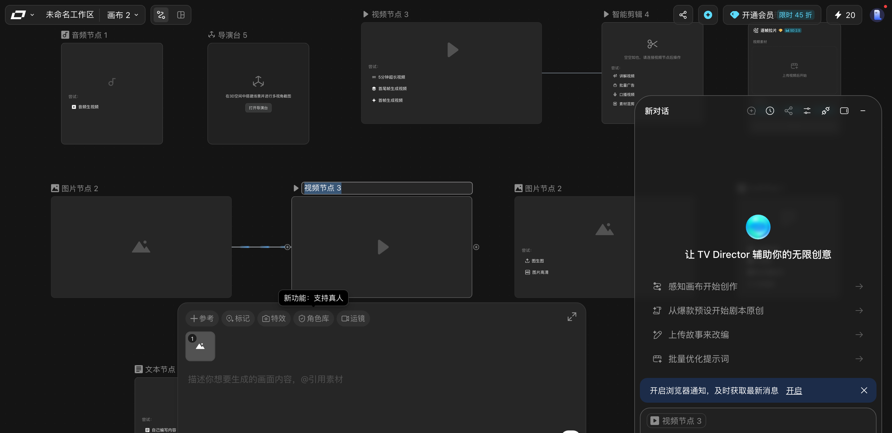

| 动作 | 结果 |
|---|---|
| **单击**标题 | ⛔ **什么都不发生** —— 不会误进编辑 |
| **双击**标题 | ⭐ 变成一个输入框，里面**预先全选**了当前名字，直接打字就能覆盖 |
| 打完按 **回车** | ✅ 生效 |
| 打完按 **Esc** | ✅ **放弃修改**，名字回到原样（实测：打了「这个名字应该被放弃」，按 Esc 后仍是 `视频节点 3`） |
| 改完**刷新页面** | ⭐ **新名字还在** —— 改名**会存盘** |

> ⭐⭐ **改名会同步到故事板。** 实测：把一个视频节点改成 `CH故事板改名5`，
> 切到故事板，**视频列里那一行就写着新名字**。
>
> ⭐ **而且同名节点是各自独立的。** 本手册的取证画布上**有两个节点都叫 `视频节点 3`** ——
> 改了其中一个，故事板里另一个**还是原名**。
> ⭐⭐ 这也说明**自动命名会撞车**，画布大了以后**改名几乎是必做的一步**。
>
> ⛔ **本手册没有试「把名字清空再回车」** —— 万一清空后标题消失、就再也双击不回来，
> 这个节点就永久没法改名了。**风险大于收益，故意不测。**

> 💡 节点名的作用范围：它是**给你自己看的标签**。
> 画布、故事板、节点列表里显示的都是它；
> 但它**不参与连线、不参与生成**，改它不会动到任何产物。

#### 预设：十一个开箱即用的工作流


这一整块手册此前完全没有。本轮逐条读过结构之后更正两处：
**是三列（不是四列）、一共 15 项（不是 11 项）**。
中间那一列上下分成**两个组**，所以一共四个组标题。

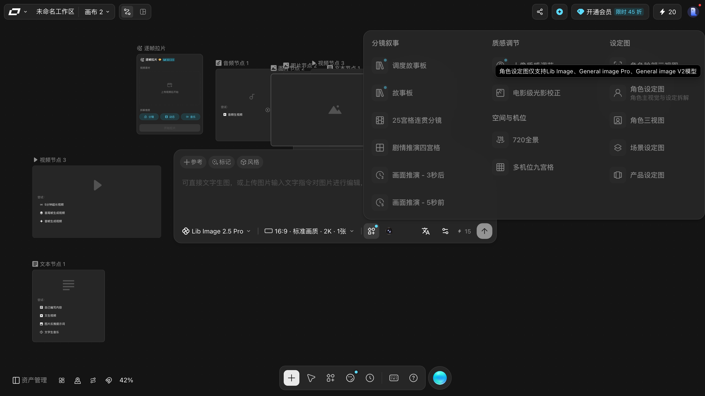

| 列 | 组 | 条目（每条后面的灰字是**它自己的说明**） |
|---|---|---|
| 左 | **分镜叙事**（6 项） | `调度故事板`（生成带有运动轨迹等调度草图分镜）· `故事板`（生成完整剧情片段）· `25宫格连贯分镜`（生成连续分镜长图）· `剧情推演四宫格`（生成四格剧情推演）· `画面推演 - 3秒后`（推演画面后续动作）· `画面推演 - 5秒前`（还原画面前置状态） |
| 中·上 | **质感调节**（2 项） | `人像质感调节`（降低 AI 感，优化人物质感与光影）· `电影级光影校正`（调整画面光影质感） |
| 中·下 | **空间与机位**（2 项） | `720全景`（生成全景场景图）· `多机位九宫格`（生成多视角机位图） |
| 右 | **设定图**（5 项） | `角色脸部三视图`（基于一张参考图生成脸部细节三视图）· `角色设定图` · `角色三视图`（正侧背视图与脸部特写）· `场景设定图` · `产品设定图`（`角色设定图`/`场景设定图`/`产品设定图` 三项说明**都是同一句**「角色主视觉与设定拆解」） |

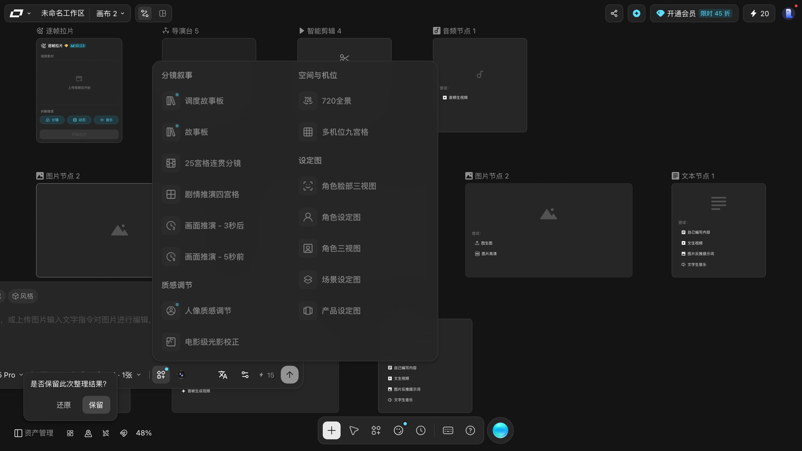

#### ⭐ 蓝点：它**收不到悬停**，所以不可能有提示

`调度故事板` / `故事板` / `人像质感调节` 三个条目的图标右上角各带一个**蓝点**。
本轮把整个蓝点逐个查清了：

| 观察项 | 实测值 |
|---|---|
| 尺寸 | `6×6`（另有两枚 `12×12` 的，在别处，见下） |
| 颜色 | `rgb(93, 220, 255)`，亮青 |
| 圆角 | `border-radius: 9999px`，正圆 |
| **`pointer-events`** | **`none`** |
| class | `bg-nt-icon-brand pointer-events-none absolute right-[3px] top-…` |

`pointer-events: none` 决定了一件事：**鼠标穿得过去，蓝点永远不会被悬停**。
所以**它不可能有自己的 tooltip** —— 手册此前写「推测是推荐或新功能标记，含义未验证」
其实还留了个尾巴：**就算想去悬停它读提示，也读不到，因为它的样式就是不让鼠标落在上面。**

> 💡 顺带一个坑：正因为穿得过去，鼠标停在蓝点上时弹出来的提示
> **是它底下那个条目自己的提示**。比如停在「调度故事板」的蓝点上，
> 读到的是「**调度故事板仅支持Lib Image模型**」——
> 那是条目被禁用的原因，**不是蓝点在讲什么**。很容易读成「蓝点的含义是模型不支持」。

> 📖 蓝点**具体代表什么**（推荐？新功能？Beta？）本手册**仍然没验**，
> 页面上没有可读的说明，也不存在能悬停的地方。

#### 蓝点不止出现在预设里：全画面一共 **5 个**

| 位置 | 尺寸 | 挂在谁身上 |
|---|---|---|
| 预设工作流 · `调度故事板` | `6×6` | 该条目 |
| 预设工作流 · `故事板` | `6×6` | 该条目 |
| 预设工作流 · `人像质感调节` | `6×6` | 该条目 |
| 图片节点参数条的**模型下拉**（`Lib Image 2.5 Pro` 右上角） | `6×6` | 模型下拉那一格 |
| 底部中央工具条的 **`TV Director`** 蓝圆钮 | `12×12` | 整个 TV Director 入口 |

> 💡 所以「看到蓝点 = 推荐/新功能」这个直觉**不成立**——
> 五个里至少有一个（`TV Director`）明显不是「推荐某个预设」。
> **蓝点更像是「这一项有更新或值得留意」的通用提示**，但这是推测，页面上没有依据。


#### ⭐ 本轮全都没点得动，原因是**模型对不上**

15 项**每一枚的 `cursor` 都是 `not-allowed`**，画面上整片是灰的。
把鼠标停在任意一条上，它会**直接告诉你为什么点不动**：

| 条目 | 悬停提示（实测原文） |
|---|---|
| `调度故事板` | **调度故事板仅支持Lib Image模型** |
| `故事板` | **故事板仅支持Lib Image模型** |
| `角色设定图` | **角色设定图仅支持Lib Image、General image Pro、General image V2模型** |
| `人像质感调节` | **人像质感调节仅支持Lib Image、General image Pro、General image V2模型** |

#### ✅ 「换模型就能用」—— 亲手验过

这不是推断，**本手册换了一次、又换回来了**：

| 步骤 | 15 条里可点的条数 |
|---|---|
| 原模型 `Lib Image 2.5 Pro` | **0 条** |
| 换成 `Lib Image` | **15 条（全部）** |
| 换回 `Lib Image 2.5 Pro` | **0 条**（已复原） |

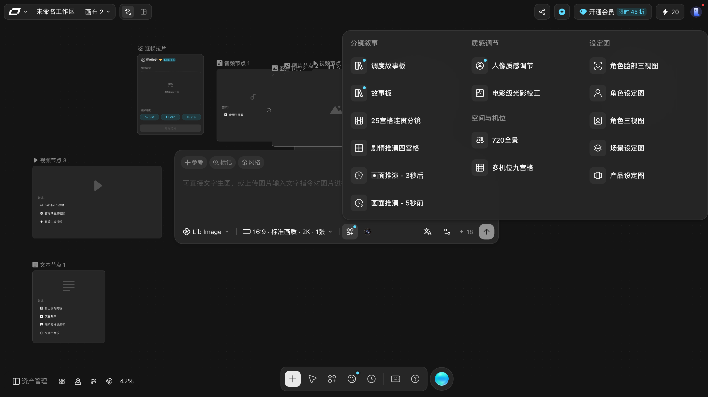

> 💡 **所以遇到整片灰，动手换一下模型就好** ——
> 提示里点名的 `Lib Image` 一换，**不是「几条变亮」，是全部 15 条都亮了**。
>
> ⚠️ **换模型会改价格**：上面这张图里，花费从 `⚡15` 变成了 `⚡18`。
> 换之前先看一眼右边那个闪电数字。
>
> 📖 **点其中任意一条会发生什么，本手册仍然没验** ——
> 它们看起来会往画布里加节点或改参数，属于「会写数据」的操作，本轮不碰。
> 这批只把「**为什么点不动**」和「**怎么让它可点**」两件事查清楚了。

#### 摄像机：模拟真实拍摄器材


| 项 | 当前值 | 可选值（实测） |
|---|---|---|
| `相机` | `Panavision DXL2` | 有上下箭头可切换，未逐个试 |
| `镜头` | `Arri Signature Prime` | 同上 |
| `焦距` | `35` `mm` | **七个**： `8` `14` `24` `35` `50` `75` `125` |
| `光圈` | `ƒ/4` | 有上下箭头，未逐个试 |

#### 「关闭」开关的文字会跟着状态变（实测开→关并复原）

面板容器是 `[640×345]`（位置随节点走），实测里面**共 44 个可交互元素**，
但**表面上你只看到四组东西**：

| 组 | 构成 |
|---|---|
| `相机` | `Panavision DXL2`，上下各一枚 `20×20` 箭头按钮切换 |
| `镜头` | `Arri Signature Prime`，同样上下箭头 |
| `焦距` | **七个独立按钮** `8` `14` `24` `35` `50` `75` `125`，外加 `mm` 标注 |
| `光圈` | `ƒ/4`，上下箭头 |
| **开关** | 一枚 `mantine-Switch-root`，`38×20` |

开关**没有 `aria-label`**，`innerText` 也是空的 —— 它的状态**只写在旁边的文字上**：

| 开关状态 | 面板上那行字 | `data-checked` |
|---|---|---|
| 关（本手册的默认实测态） | **`关闭`** | `false` |
| 开 | **`开启`** | `true` |

本手册**开了一次、又关回去了**，复原读数与初始**逐字一致**
（`data-checked` 走完 `false → true → false`）。

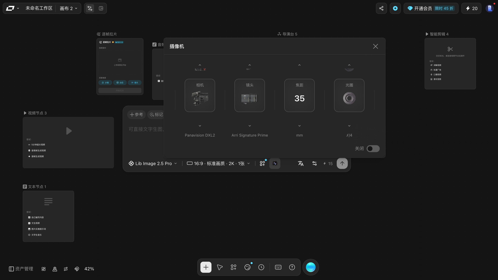

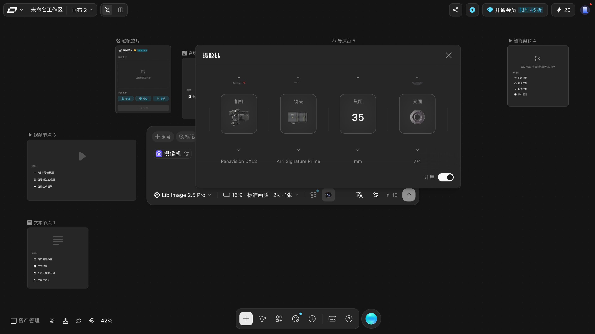

> ⭐ 所以判断这台虚拟摄影机开没开，**看面板底部那两个字就行** ——
> 它也是图片节点参数条上那枚摄像机按钮**悬停提示**里会写的内容
> （`Panavision DXL2 已关闭 Arri Signature Prime / 35mm / ƒ/4`）。

> 📖 **开关打开之后，摄影机参数会不会真的送进生成，本手册仍然没验** ——
> 那要真实提交一次生成才知道，而生成会扣积分。

### 视频节点


**「尝试：」**：`5分钟超长视频` · `首尾帧生成视频` · `首帧生成视频`


- 顶部工具：`参考` · `标记` · `特效` · `角色库` · `运镜`（五枚，右上角还有一枚 `⤢` 展开图标）

  > 📌 选中视频节点后，这排工具的**左上角常驻一枚「新功能：支持真人」的引导标记**
  > （`114×27`，`position: absolute`，箭头指向右下方）。
  > ⭐ 它**不是悬停气泡** —— 静置 4 秒不消失、鼠标移开也不消失，会一直挂在画面上。
  > 箭头落点约在 `x≈616`，而 `角色库` 按钮中心约 `x≈619`，**看起来是在提示角色库的新能力**；
  > ⚠️ 但**锚点没有正面坐实**，按推测读。
- 提示词框占位：`描述你想要生成的画面内容，@引用素材`
- 底部参数条实测七枚，从左到右：

| # | 内容 | 说明 |
|---|---|---|
| 1 | `2.0 ▾` | 模型，带下拉箭头 |
| 2 | `全能参考 ▾` | 参考类型 |
| 3 | `16:9 · 720P · 5s · 1个 · 🔊 ▾` | 规格四段式 + 声音开关 |
| 4 | `📄` | 悬停提示 **提示词优化** |
| 5 | `文A` | 悬停提示 **翻译提示词** |
| 6 | `⚙` | 「高级设置」开关 |
| 7 | 白色圆形上箭头 | **生成按钮**（最右，详见上文） |

`⚡135` 是积分数字，**不是按钮**，排在生成按钮左边。

- 点开 `⚙`（参数条右侧那枚滑块图标）之后，下面会多出「高级设置」分区：
  `联网搜索` · `自动校验素材` · `智能引用 AutoLink`（三个开关，默认全开）

视频节点是可选功能最多的一个：特效、角色库、运镜都挂在这。

#### 五枚工具各自点开什么

这五枚**行为完全不同**，手册此前只写了名字，一个都没被点开过。实测如下：

| 工具 | 点开之后 | 形态 |
|---|---|---|
| `参考` | **进入点选模式**：顶部出现蓝色提示条「**从画布或资产管理选择参考**」，画布上每个节点的提示变成「**在当前画布中添加参考**」 | 顶部横条 + 画布高亮 |
| `标记` | **进入点选模式**：顶部提示条写「**元素选择模式** / **点击图片选择局部元素**」，画布整体变暗 | 顶部横条 + 画布变暗 |
| `特效` | 打开**特效广场** | 全屏模态框 |
| `角色库` | 打开**角色库**，但**上面先叠一层合规承诺书**（见下） | 全屏模态框 × 2 层 |
| `运镜` | 打开**运镜广场** | 全屏浮层 |

**前两枚不是「弹出一个列表」，而是把你切进一个交互模式** ——
顶部会挂一条蓝色提示条，右边有 `返回节点` 按钮和 `×`；
在这个模式里直接点画布上的图片/节点来完成选择。
不点提示条上的 `×` 或 `返回节点`，就一直停在这个模式里。


#### `特效` 打开的是特效广场

和从底栏「素材库 → 特效库」进去的是**同一个全屏模态框**，见
[asset-library.md 的特效广场](asset-library.md#特效广场-同一套结构-数字不带「万」)。


#### `运镜` 打开的是运镜广场

顶部三个标签 `运镜广场`（当前）`我的收藏` `我的运镜`，下面是**内置的运镜预设**，实测读到这 22 个：

`固定镜头` · `跟随拍摄` · `盘旋抬升` · `盘旋下降` · `镜头上摇` · `镜头下摇` ·
`镜头左摇` · `镜头右摇` · `镜头上升` · `镜头下降` · `镜头左移` · `镜头右移` ·
`镜头前推` · `镜头后移` · `变焦推进` · `变焦拉远` · `柯克变焦` · `环绕拍摄` ·
`滚筒旋转` · `第一视角` · `无人机` · `高空航拍` · `手持拍摄`


#### `角色库` 会先拦一道合规承诺书 ⚠️

**第一次点「角色库」不会直接看到角色列表** —— 会先弹出一份
**《Seedance模型使用承诺书》**，必须**勾选同意**才能点「同意并使用」。
这也是顶栏那条黄色提示「未签署人像安全协议…去签署」的来处。

承诺书正文是三条：

1. **您对即将上传或使用的素材拥有充分合法权益** —— 包括但不限于图片/视频/音频/文本/
   人物形象/虚拟人像/声音/品牌元素等；涉及他人肖像/声音/生物识别特征、
   或商标/版权等知识产权元素的，须确保已获授权；
2. **您将自行对所生成内容及使用后果负责** —— 平台明示 AI 生成结果具有不确定性，
   是否发布、传播或商业使用由用户自行判断并承担相应法律责任；
3. **如您存在违规使用行为，平台将有权采取限制措施** —— 滥用含第三方合法权益的素材
   会被视为违规，可能被拦截生成、删除内容、限制下载、暂停或终止服务。


> 📖 **本手册没有勾选、也没有点「同意并使用」** —— 那是签署协议，不代签。
> 所以**角色库里的角色列表长什么样、有多少个、怎么挑，本手册没验**。
> 能确认的只有：它有两个标签 `公共角色库` 和 `Seedance、Seedance 2.5 合规素材库`。


### 智能剪辑节点


空状态文案很直白：**「空空如也，请连接视频节点后操作」** —— 它不是拿来凭空生成的，得先接视频。

**「尝试：」**：`讲解视频` · `批量广告` · `口播视频` · `素材混剪`

参数面板实测 `[660×192]`，结构是五类节点里**最接近视频节点的**：


| # | 内容 | 说明 |
|---|---|---|
| 1 | `参考` | 顶部工具条**只有这一枚** |
| 2 | `描述想剪成什么效果` | 提示词框占位 |
| 3 | `默认模式` | 模式选择 |
| 4 | `16:9 · 720P · 30s` | 规格三段式：**比例 · 分辨率 · 时长**（它固定 30 秒） |
| 5 | 灰色圆按钮 | **`aria-label="发送"`** —— 它的生成按钮 |

> ⭐ **这是五类节点里唯一给生成按钮写了 `aria-label` 的**：
> 视频、图片、音频、文本四类那枚白色圆按钮都**无文字无 aria**，
> 智能剪辑这枚叫 `发送`。
> 空状态（还没接视频节点）时它是 `disabled` + `cursor: not-allowed`。
>
> ⚠️ 它不提供「请输入提示词」那类悬停提示 —— 读不出缺什么。

### ⭐ 接上视频节点之后，到底变了什么

上面那句「空空如也，请连接视频节点后操作」很容易让人以为：**不连视频，这块面板就用不了**。
实测把一个视频节点连到智能剪辑的入口之后，**三件事要分开说**：

| | 连线之前 | 连线之后 |
|---|---|---|
| 参数面板能不能打开 | ✅ **能**，内容与之后完全一样 | ✅ 能 |
| 面板里有什么 | `参考` · 提示词框 · `默认模式` · `16:9 · 720P · 30s` · `发送` | 同样的四样，**外加一枚带「1」的视频缩略图**（见下一节） |
| 卡片上那句提示 | 空空如也，请连接视频节点后操作 | **一字未变，还是这句** |

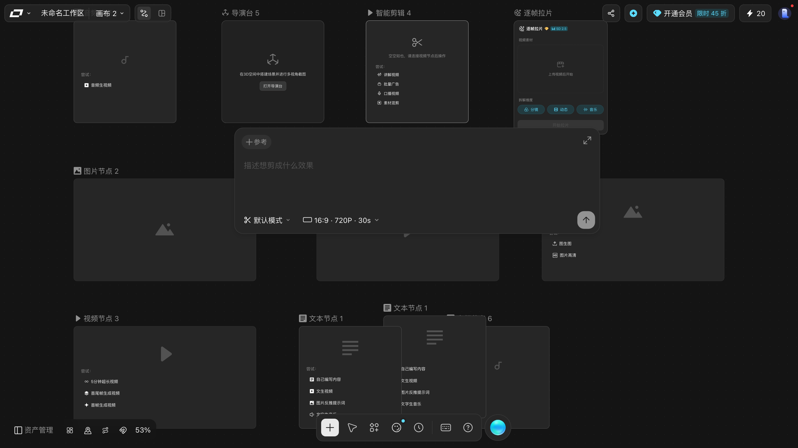

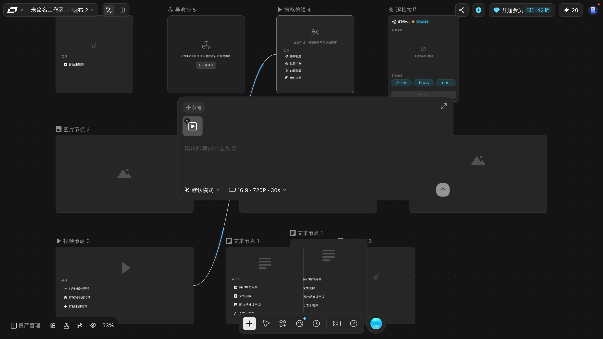

⭐ 所以真正该记住的是这两条：

1. **参数面板本来就能打开，不连线也能编辑。**
2. **连上之后卡片上那句「请连接视频节点后操作」不会消失。**
   判断有没有接上，**别看卡片，看面板里有没有多出那枚带编号的小卡片**。

### ⭐ 那枚编号卡片就是「接进来的视频素材」—— 已做成可逆对照

早先这里只写得出「**连接之后出现了**」，因为当时想用 `⌘L` 断开连线做对照，
而 `⌘L` 断不了线（断线办法见 [connect-nodes.md](connect-nodes.md#断开连线)）。
现在断线做得到了，对照补上 —— **三步读数，全都取自面板正文**：

| 步骤 | 面板正文（`参考` 与提示词框之间） |
|---|---|
| ① 已连着一个视频 | `参考` **`1`** `描述想剪成什么效果` |
| ② **把连线断掉**（连线数 `2 → 1`） | `参考` `描述想剪成什么效果` ← **`1` 没了** |
| ③ **再接回来** | `参考` **`1`** `描述想剪成什么效果` ← **`1` 又回来了** |

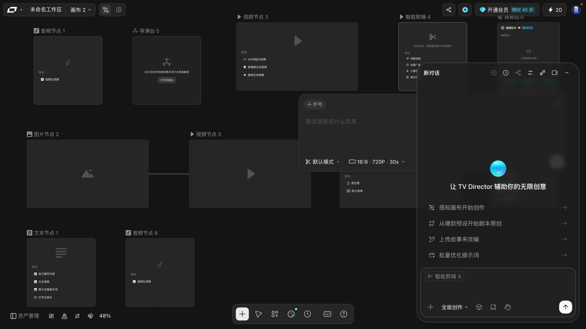

> ⭐ 所以这枚卡片**不是装饰，是「已接入素材」的清单**：
> 它是一张**视频缩略图**，左上角那个数字是**序号**，出现在 `参考` 按钮的正下方。
> 接第几个就编几号。断掉一根，对应那张缩略图就消失。
>
> 💡 顺带一条读图的门道：这块面板**不在节点卡里，是盖在画布上的**。
> 所以那枚 `1` 的屏幕坐标落在节点矩形**外面**（实测 `[750,282]` vs 节点 `[979,55,169,169]`）——
> **别拿「坐标是否落在节点矩形内」当判据**，那是我的仪器栽过的坑。
>
> ⚠️ 接回来的边 **id 会变**（两端与方向不变）—— 画布上的连线是重建的，不是原来那一条。

### 导演台节点


整张卡片只有一句话和一个按钮：

> 在3D空间中搭建场景并进行多视角截图
> `打开导演台`

#### 还没进 3D 工作区之前，画布上就有一整套输入区

⚠️ 手册此前把导演台当成「一句话 + 一个按钮」，**漏掉了它下面挂着的输入区**。
实测选中导演台节点后，节点卡片是 `148×197`、只有 5 个可点元素，
但**另有一块 `node-floating-ui` 的 `[684,263,384×104]` 浮在节点左侧** ——
它的左边界 684 **在节点左边界 802 之外**，所以第一眼很容易当成不存在。

| 元素 | `aria` / 占位 | 状态 |
|---|---|---|
| 描述框 | **`描述想要搭建的场景，支持通过参考图创建`** | 可输入 |
| `上传图片` | `aria="上传图片"` | 点它打开文件选择（上传，未执行） |
| `发送` | `aria="发送"` | **`cursor: not-allowed`** —— 描述为空时点不动 |

> 💡 导演台是**唯一一个把占位符写在 `aria` 上、而不是 `placeholder` 上**的输入框。
> 底下还藏着一个 `type="file"` 的真 input，尺寸 `1×1` ——
> **你在画面上找不到它，但查 DOM 一定查得到。**

点「打开导演台」会进入一个**全屏三维工作区**（地址栏不变，仍是 `/canvas`）。


工作区的三块结构：

| 位置 | 内容 |
|---|---|
| 顶部 | 节点名「导演台 N」 |
| 中央 | 3D 视窗（未加载时是一个占位图标 + 「在3D空间中搭建场景并进行多视角截图」+ `打开导演台`） |
| 底部 | 输入框，占位「**描述想要搭建的场景，支持通过参考图创建**」，左边 `+`（上传图片）、右边 `↑`（发送） |

> ### ⚠️ 导演台 3D 需要浏览器硬件加速
>
> 如果浏览器没开硬件加速，点「打开导演台」会直接弹这个框：
>
> > **请开启浏览器硬件加速**
> >
> > 当前浏览器无法使用硬件加速，导演台、全景预览、打光等 **3D 功能暂不可用**。
> > 请在浏览器设置中开启“使用图形加速功能（如果可用）”，重启浏览器后再试；
> > 若已开启，请更新浏览器或显卡驱动。
>
> 这不是账号问题、也不是画布坏了 —— 是浏览器的图形加速没开。
> 详见 [../90-troubleshooting.md](../90-troubleshooting.md)。

界面上还有一组「**正在跟随 / 取消**」的提示和「**按 ESC 退出**」。本轮进入后 `Esc` 没有立刻退出工作区 ⚠️。

> ⭐ 这组提示**就是顶栏正中那条「正在跟随」横幅**，不是 3D 视窗自己的东西
> —— 它是 `fixed left-1/2 top-0` 的页面级元素，进没进 3D 视窗都在。
> 逐字拆解与实测见 [../20-reference.md](../20-reference.md#顶栏「正在跟随」横幅)。
> 所以「`Esc` 没有立刻退出工作区」更可能是 **3D 视窗把 `Esc` 吃掉了**，
> 而不是横幅失效；⚠️ 这一点**没有单独验证**。

> ⚠️ 3D 视窗内部本轮**没有真正加载出来**（取证环境无硬件加速），所以**搭建场景、参考图、打光、多视角截图这些操作本手册都没有验证**。


### 逐帧拉片节点

> ⚠️ **逐帧拉片没有参数面板。** 选中它之后，整张卡片就是全部内容 ——
> 不存在那张 660 宽、挂在下方、带提示词框和参数条的卡。
> 实测选中后节点是 `135×164`，里面**只有 5 个可点元素**，
> 并且**没有任何宽度超过卡片本身的容器**。

| 元素 | 尺寸 | 状态 |
|---|---|---|
| `上传视频后开始` | `124×70` | 点它打开文件选择（上传，未执行） |
| `分镜` / `动态` / `音乐` | 各 `39×14` | 可多选，决定从视频里拆出什么 |
| `开始拉片` | `124×15` | **`disabled`、`cursor: not-allowed`** —— 没上传视频时点不动 |

模型 `SD 2.5` 只是卡片上的一行字，**不是按钮**。

> 💡 **「开始拉片」灰着就是「还没上传视频」**，
> 和参数条上那枚生成按钮灰着是同一种「正常状态」，不是坏了。


- `视频素材` 区，提示「上传视频后开始」
- **拆解维度**：`分镜` · `动态` · `音乐`
- 底部按钮 `开始拉片`

> 三个拆解维度是**可多选**的，选哪几个决定从视频里拆出什么信息。

### 音频节点


**「尝试：」**：`音频生视频`
提示词框占位：`描述你想要的音频效果，可用 @ 引用音频`
底部：`Seed Audio 1.0` · `中文 · 24k · wav` · `0/2000`（已用/上限字数）· `1`（积分）


音频节点的顶部工具条**只有 `参考` 一枚** —— 视频节点那五枚里的 `标记` / `特效` / `角色库` / `运镜`，音频节点都没有。

#### 音频节点参数面板的完整逐字读数

本轮用「选中前后面板差集」的办法，把音频节点参数面板的**全部文字**捞了出来
（面板差集法的好处是**不会漏也不会混**——它只看「点选之后新出现了哪些面板」）：

```
参考
描述你想要的音频效果，可用 @ 引用音频
Seed Audio 1.0   中文 · 24k · wav   0/2000   1   高级设置
语速  声调  音量
```

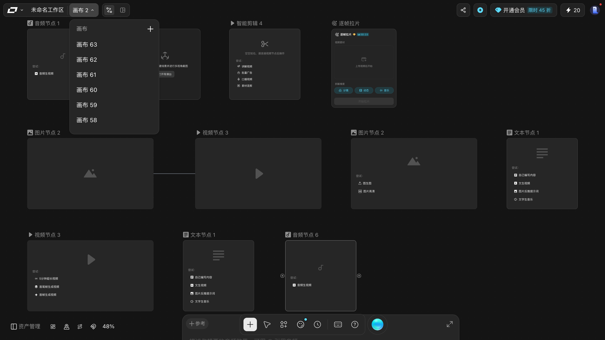

对照着看，有两处是这份读数**新补上的**：

| 位置 | 内容 |
|---|---|
| 描述框下方一行 | `Seed Audio 1.0` · `中文 · 24k · wav` · `0/2000` · `1` |
| 再下面一整行 | **`高级设置`** —— 它是**写在面板里的一行文字**，点开是 `语速` / `声调` / `音量` 三个滑杆 |

> 💡 `高级设置` 出现在**面板正文**里（不是参数条上那枚 `⚙`），
> 两处都能打开同一组滑杆 —— 这是本轮读数里最容易看漏的一处。

点它开的是和视频节点**同一套**「从画布或资产管理选择参考」点选模式（顶部蓝条 +「返回节点」+`×`）。

底部参数条实测**五枚**：

| # | 内容 | 悬停提示 |
|---|---|---|
| 1 | `Seed Audio 1.0 ▾` | （无） |
| 2 | `中文 · 24k · wav ▾` | （无） |
| 3 | `文A` | **翻译提示词** |
| 4 | `⚙` | （无） |
| 5 | 生成按钮 | **请输入提示词或添加参考素材** |

> ⭐ **第 5 枚是全手册最好用的一条线索**：
> 提示词为空时它是 `disabled` + `cursor: not-allowed`，
> **提示里直接告诉你缺什么**（音频节点写「提示词**或添加参考素材**」，
> 文本节点写「提示词」—— 音频节点多一个「加参考素材」的出路）。
>
> 本手册正是靠它，才认出视频 / 图片节点最右那枚白圆按钮也是同一枚生成按钮 ——
> **不用去点那枚会扣积分的按钮。**

点开同一枚 `⚙`，音频节点展开的是**三个滑杆**：`语速` · `声调` · `音量`，
详见下面的「『高级设置』的入口是 ⚙」。

---

## 选中节点会发生什么

- **折叠态**：只露出预览区 + 「尝试：」几个模式；
- **选中态**：卡片**展开**，露出提示词框、顶部工具、底部参数条。


点空白处或按 `Esc` 收起。

### ⭐ 一张表看全「尝试：」的全部快捷选项

每一类节点的「尝试：」都不同，**本轮逐个节点扫过一遍**（11 个节点全部读到）：

| 节点 | 「尝试：」有几个 | 分别是 |
|---|---|---|
| **文本节点** | 4 | `自己编写内容` · `文生视频` · `图片反推提示词` · `文字生音乐` |
| **智能剪辑** | 4 | `讲解视频` · `批量广告` · `口播视频` · `素材混剪` |
| **视频节点** | 3 | `5分钟超长视频` · `首尾帧生成视频` · `首帧生成视频` |
| **图片节点** | 2 | `图生图` · `图片高清` |
| **音频节点** | 1 | `音频生视频` |
| **逐帧拉片** | — | ⚠️ **没有「尝试：」这一行**，但另有一组三枚胶囊 `分镜` · `动态` · `音乐`（标题是「**拆解维度**」） |
| **导演台** | — | 没有「尝试：」，只有一个 `打开导演台` 按钮 |

> 💡 这几项**就是上手最快的路径** —— 不想自己想提示词，点一个现成模式就有东西可改。
> 它们的顺序在同类节点之间是**一致的**（比如两个文本节点都是同样这四个、同样顺序）。
>
> ⚠️ **它们是普通按钮，不是下拉项**（`tag=BUTTON`、无 `aria`、无 `title`），
> 所以既搜不到名字也没有悬停提示 —— 只能靠位置和文字认。
> 本手册**一个都没点过**（点了会往节点里灌内容）📖。

---

## 节点里的「高级设置」

先说清楚一件容易误会的事：**参数面板不是节点卡片的一部分，是挂在节点下方的一张独立卡片。**


实测框的位置关系（1440×810 视口）：

| 部分 | 说明 |
|---|---|
| 节点本体 | 视频 `311×175`、音频 `175×175`（50% 缩放下实测） |
| 节点标题浮条 | 节点上方一条 `263×20` 的小条（`⏵ 视频节点 3`），class `node-floating-ui transition-[transform,opacity]` |
| 参数面板 | 节点下方一张约 `660` 宽的独立卡片 |

> ⚠️ **两个 float 的 class 都在 `node-floating-ui` 家族里，但它们不是同一个东西**：
> 那条 20px 高的**标题浮条**才是 `node-floating-ui`；
> 真正的**参数面板**是另一张 660 宽的卡片。找面板时别拿 `node-floating-ui` 当判据 —— 会量到标题条。

所以 `⌘0`（框住所有节点）**只框节点、不框参数面板** —— 面板会挂在框外甚至视口外，
这时候只能靠手动平移把它拉回来。

> **单击节点中央 = 打开/收起参数面板。** 实测图片节点元素数 `42 → 140`（折叠 → 展开）。
>
> ⚠️ **参数面板还有两个前置条件**，本手册花了三轮才摸清：
> 1. **右侧的 TV Director 对话抽屉必须关掉，面板才会渲染。**
>    抽屉开着时，DOM 里照样有完整面板（`innerText` 读得到全文），**画面上一个像素都看不到**。
>    按 `Esc` 能关掉它，**点画布空白关不掉**（实测两次）。
> 2. 面板的**宽度不随画布缩放改变**。缩放 42% 和 50%，`getBoundingClientRect()` 都报 `660` 宽。
>    所以「把画布缩小就能看见面板」这条路不成立。

### 「高级设置」的入口是 `⚙`，不是「高级设置」那四个字

这是最容易走弯路的一处，单独说清楚：

> **入口是参数条右侧那枚 32×32 的滑块图标按钮（`⚙`）。**
> 面板里那行灰色的「高级设置」四个字是**标题**，**点了没有任何反应**。


上面这张图里能看到三件事：

1. `⚙` 按钮**变成深色高亮态** —— 这是它被打开的视觉信号；
2. 参数条下面出现一条**分隔线**，线下面是灰色的「高级设置」标题；
3. 标题下面就是内容区。视频节点这里是**三个开关，全部默认打开**：
   `联网搜索` · `自动校验素材` · `智能引用 AutoLink`。
   其中 `自动校验素材` 和 `智能引用 AutoLink` **各带一个 `?` 问号图标**（点它有说明），
   `联网搜索` 没有。

音频节点的同一枚 `⚙` 打开的是**三个滑杆**：


| 滑杆 | 当前值 | 取值范围 |
|---|---|---|
| `语速` | `1.00` | `0` – `2` |
| `声调` | `0` | `0` – `12` |
| `音量` | `1.0` | `0` – `10` |

再点一次 `⚙` 就收回去，**是开关（toggle）不是单向展开**。

> ⚠️ **这里更正手册早先的两版说法**：
> ① 「`高级设置` 是可折叠分区、点**那四个字**展开/收起」—— **点它没反应**，
>    正确入口是 `⚙` 那枚图标按钮。
> ② 「音频是 3 个滑杆、**没有**数字输入框」—— **画面上就摆着三个数值框**
>    （`1.00` / `0` / `1.0`）。它们确实不是 `input[type=number]`
>    （实测该选择器恒为 0 个），但**用户是能看见数字的**，
>    手册说「没有数字框」会让人以为看不到数值。
>
> 另外一个小差异：滑杆自己的 `aria-valuenow` 读出来是 `1` / `0` / `1`，
> 而**显示在框里的是 `1.00` / `0` / `1.0`** —— 同一个值，两种写法。

折叠机制本身是在 `grid-template-rows` 的两个值之间切换：

| 状态 | class | `grid-template-rows` 计算值 |
|---|---|---|
| 收起 | `grid-rows-[0fr]` | `0px` |
| 展开 | `grid-rows-[1fr]` | `157px` |

面板高度也跟着变：视频节点 **246px → 411px**。

> 💡 **这一段踩的坑值得记一笔**：我盯着「高级设置」那四个字试了十几轮，
> 每次都点不到（它只是标题），于是先写下「它默认就是展开的」、
> 后来又写下「产品根本没有展开态」—— **两次都是把「我没找到入口」当成了产品事实**。
> 真正的入口一直就在旁边那排图标按钮里，只是没有文字也没有无障碍名，
> 前两轮按文字/aria 找控件时**根本没把它列进候选**。
> **「我点不到」≠「它不存在」**。

---

## 框选：一次选多个节点

**`Shift` + 在空白处左键拖出一个矩形**，框完整包住的节点会一起被选中。


> ### ⚠️ 两条最容易踩空的
>
> 1. **在空白处直接左键拖，画布是拖不动的。** 实测鼠标走 220px，视口只挪了 16.3px、纵向一点没动。所以「想框选却拖出一片空白」不是操作错了，是**没按住 `Shift`**。
> 2. ⭐⭐ **框选是「碰到就选中」，不是「框完整包住才选中」** —— 这条是 Batch EI 推翻的旧结论。
>    旧写法只做了**正向**验证（包住 ⇒ 选中），把充分条件当成了必要条件。
>    Batch EI 补上阴性对照后实测（`47%` 缩放，目标节点 `292×164`）：
>
>    | 框选矩形与节点的关系 | 结果 |
>    |---|---|
>    | 完全包住（**阳性对照**） | ✅ 选中 |
>    | 只压住顶部 **8px** | ✅ **仍然选中** |
>    | 矩形差 **6px** 完全不碰（**阴性对照**） | ❌ 未选中 |
>
>    ⇒ 判定标准是**有没有交集**。
>    💡 实操上还是建议框全：多选工具条贴在**选区包围盒**的上沿（见下节），
>    框得越全工具条越靠上，越不容易被顶出视口。

框选是成组、解组、批量复制的前置动作 —— 这几个键位只在多选状态下才有意义。

> ⭐⭐⭐ **框选之后，选区上方会浮出一条「多选工具条」—— 它和「组操作条」是两层不同的东西**（Batch EI 补记）。
>
> ⭐ **本手册原来只记了「组操作条」（成组之后那一条），漏了它前面还有一条。**
> 两者的文案**完全不同**，别混：
>
> | | 多选工具条（框选**之后**） | 组操作条（**成组**之后） |
> |---|---|---|
> | 出现时机 | **框选**出 ≥2 个节点 | 已经**成组** |
> | 逐字文案 | 排列 · `保存到资产` · `创建副本` · **`打组`** · `批量下载` · `添加到Chat` · `创建为Skill` | 颜色圆点 · 排列 · 整组执行 · 添加到工具箱 · **转分镜组** · 解组 · 批量下载 |
> | 「打组 / 成组」在哪 | ⭐ **在多选工具条上**（按钮文字就是 `打组`） | — |
>
> ⚠️ ⭐ **`合并分镜组` 在多选工具条上**（`打组` 的下拉里），**`转分镜组` 在组操作条上** —— 是同一个功能的两个入口。

### ⭐ 多选工具条：框选后第一眼看到的那一条

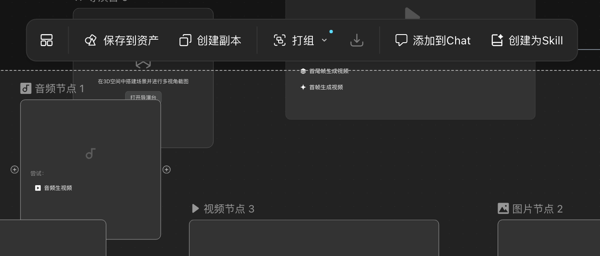

Batch EI 实测读数（框选 5 个节点，`47%` 缩放）：

| # | 按钮 | 读数（`[x, y, 宽, 高]`） | `aria-label` |
|---|---|---|---|
| 1 | ⭐ 排列（**纯图标**） | `[290,91,30,32]` | **无** |
| — | 竖分隔线 | — | — |
| 2 | `保存到资产` | `[341,91,103,32]` | 无 |
| 3 | `创建副本` | `[452,91,88,32]` | 无 |
| 4 | ⭐ **`打组`**（带 `▾`，可展开下拉） | `[561,91,82,32]` | `打组菜单` |
| 5 | ⭐ `批量下载`（**纯图标**） | `[651,91,32,32]` | `批量下载` |
| 6 | `添加到Chat` | `[704,91,104,32]` | 无 |
| 7 | `创建为Skill` | `[815,91,100,32]` | 无 |

> ⭐ **`批量下载` 悬停会告诉你它为什么点不动**：

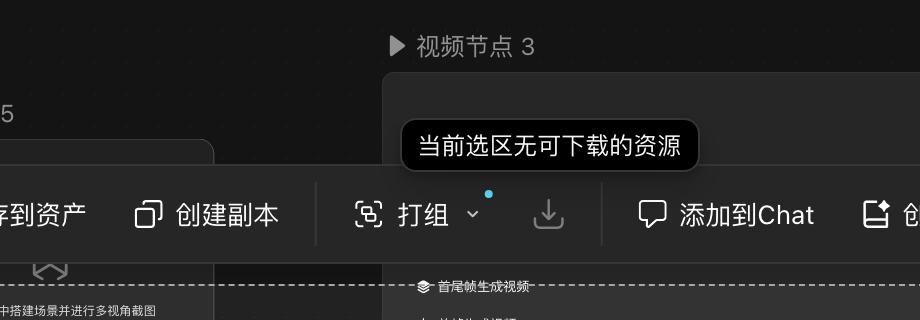

气泡写的是 **`当前选区无可下载的资源`** `[592,59,150,27]`。
也就是说它是**按「选区里有没有已生成的产物」来置灰的**，不是坏了。
本手册基线上的节点都还没跑生成，所以它是灰的。

> ⭐ **它用的是和 `合并分镜组` 完全一样的禁用表达**：
> `opacity: 0.45` + `cursor: not-allowed`，
> **没有 `disabled` 属性、没有 `aria-disabled`**。
> 实测工具条七键的视觉态，只有它一个不是 `opacity: 1 / pointer`：
>
> ```
> (无名) 1 pointer ｜ 保存到资产 1 pointer ｜ 创建副本 1 pointer ｜ 打组 1 pointer
> 批量下载 0.45 not-allowed ｜ 添加到Chat 1 pointer ｜ 创建为Skill 1 pointer
> ```

> ⭐ **`打组` 按钮右上角有一枚 `4×4` 的天蓝小圆点**（`rgb(93, 220,255)`）。
> 源码里它的判据是「打组菜单的新功能提示」，
> **只有真的点一次菜单里的某一项才会消掉**（会往 `localStorage` 写一个键）——
> 光把菜单打开再按 `Esc`，圆点还在（实测）。

#### ⭐⭐ 这条工具条是「框选」的附属 UI —— 点选出来的多选**没有**它

这是本节最容易踩空的一条：

| 怎么选出多个节点 | 选区 | 工具条 |
|---|---|---|
| **框选**（空白处拖出选框） | 多个节点被选中 | ✅ **出现** |
| 单击一个 → `Shift`（或 `⌘`）点第二个 | 同样多个节点被选中 | ❌ **不出现** |

实测：点选 + `Shift` 加选 2 个节点后，`.react-flow__node.selected` 确实有 2 个，
但**全视口扫不到任何一条工具条**，截图里也没有。
源码印证了这一点 —— 这条工具条的挂载条件里有一项是「**框选框当前是否可见**」，
所以它只在**框选**这条路径上挂载。

> 💡 **所以「成组」不用记快捷键**：**框选**完，点工具条上那枚 `打组` 就行；
> 想用点选多选的话，得改按 `⌘G`。

#### 工具条的位置不是固定的 —— 它跟着选区走

工具条不是钉在画布某个高度的，它**贴着选区包围盒的上沿**：

- 水平方向**居中于选区**（实测偏差 `0.5px`）；
- 底边比选区顶边**高 `45px`**（实测选区顶边 `y=177`、工具条 `[281,82,643,50]`）。

> ⚠️ **由此带来一个真实的坑**：如果选区很高（框住了画布顶部的节点），
> 工具条会被顶到**视口外面去** —— 实测出现过按钮落在 `y = -50` 的情况，整条工具条直接看不见。
> 遇到「框选完找不到工具条」，先往下拖一点选区，或者把画布往下平移。

#### 最左那枚无名按钮：排列菜单（菜单**向上**弹）

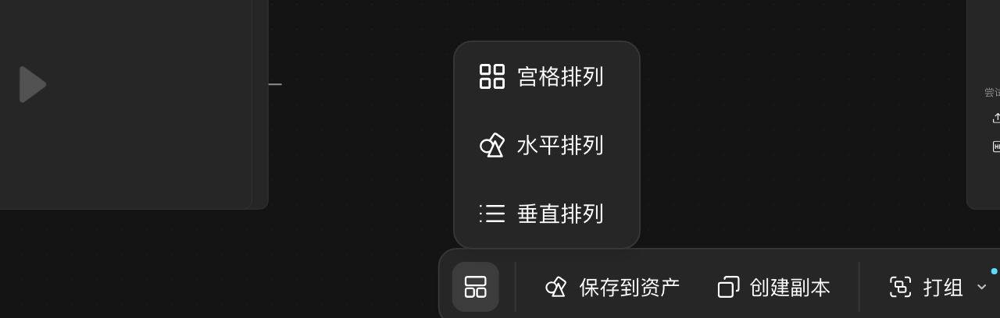

它没有文字也没有 `aria-label`，但源码里写得很清楚：图标是 `LayoutPanelTop`，
回调是 `onLayoutChange` —— **它就是排列菜单的开关**。

| 菜单项 | 读数 |
|---|---|
| `宫格排列` | `[364,190,110,36]` |
| `水平排列` | `[364,234,110,36]` |
| `垂直排列` | `[364,278,110,36]` |

菜单容器 `[359,185,120,134]`，三项**全亮**（`opacity: 1`、`cursor: pointer`），
样式和工具条是同一套毛玻璃。

三个必须知道的细节：

1. ⭐ **菜单是向上弹的**，底边正好贴着工具条的顶边。
   工具条贴着选区上沿，所以**选区位置高的时候，菜单会被顶出视口** ——
   本手册实测过一次，最上面那项「宫格排列」直接被切掉一半，只剩下面两项。
2. ⭐⭐ **菜单项在 DOM 里是 `DIV`，不是 `<button>`**。
   用 `getByRole('button')` 或 `querySelectorAll('button')` **一个都找不到**，
   必须按文字去定位（和下面「组操作条」是同一个坑）。
3. ⭐ 菜单打开时，那枚无名按钮**自身的背景会变亮**（按下态）——
   这是判断「菜单开没开」最快的办法。

> 📖 **本手册没有点过菜单里的任何一项** —— 三种排列都会真的重排节点。
> 排列本身在下面的「组操作条」一节里验证过（宫格 / 水平 / 垂直三种都实测生效），
> 这里只确认**两个入口的菜单项完全一致**。

#### 点开 `打组` 的下拉：里面有两项，其中一项会变灰

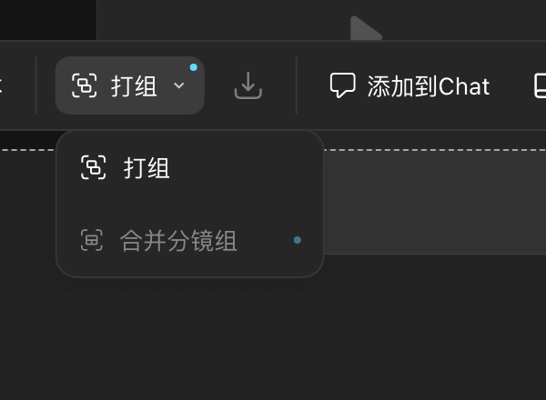

下拉里就 **2 项**，从左到右：

| 菜单项 | 实测视觉态 |
|---|---|
| `打组` | 白字、`cursor: pointer`、**可用** |
| `合并分镜组` | ⭐ `opacity: 0.45` + `cursor: not-allowed` —— **灰的，点不动** |

> ⭐⭐ **这枚灰按钮的「禁用信号」很特别，自动化时极易判错**：
>
> | 检查项 | `合并分镜组` 灰的时候 |
> |---|---|
> | `button.disabled` | **`false`** ❌ |
> | `aria-disabled` | **`null`** ❌ |
> | `data-disabled` | **`null`** ❌ |
> | 文字颜色 | `rgb(255,255,255)` —— **和可用的那项一模一样** ❌ |
> | `opacity` | **`0.45`** ✅ |
> | `cursor` | **`not-allowed`** ✅ |
>
> ⇒ **三个标准禁用信号全部缺席**，只有 `opacity` 和 `cursor` 这两个非标准信号。
> 如果你（或脚本）只查 `disabled` 属性，会把灰按钮读成「可用」——
> 本手册就在这里判错过一次（Batch EI-5 报「两项都亮」，实际其中一项是灰的）。

> ⭐ **`合并分镜组` 什么时候能用**（源码 `canStoryboardGroup`）：
> **选中 2～25 个节点，且每一个都是「图片节点」**。
> 文案表里那句禁用说明正好对上：`分镜组仅支持图片节点，且组内节点数量不可超过 25 个`。
>
> **实测**：选区 = 2 个图片 + 1 个音频 ⇒ `合并分镜组` **仍然灰**（符合条件，不是坏了）。
>
> 📖 **「选区刚好是 2 个纯图片节点时它会变亮」这个阳性对照，本手册没取到**：
> 全画布只有 2 个图片节点，而它们之间正好卡着一个视频节点，
> 任何一条框选矩形都必然把它一起圈进来；用修饰键把节点移出选区也没成功。
> 所以上面那条是**源码条件**，不是实测结论。

## 成组 / 解组

| 动作 | 键 | 界面上发生了什么 |
|---|---|---|
| 成组 | `⌘G` | 出现一个包住所有成员的框，组名叫 `Group 1` |
| 解组 | `⌘⇧G` | 框消失，成员恢复成独立节点 |

成组后画布上的节点总数会 **+1**（多出来的是组本身），解组后减回去。

### 组操作条


**组被选中时**，它上方浮出一条操作条。注意这些按钮**在 DOM 里不是 `<button>`，而是 `div` / `span`**，
所以如果你想用自动化工具按文案找它们，`getByRole('button')` 一律返回空 —— 必须按文字去定位叶子 `div`。

从左到右是 7 个动作，中间夹着 2 条竖分隔线：

| # | 按钮 | 实测结果 |
|---|---|---|
| 1 | 颜色圆点 | ✅ 可用，展开 10 色色板，**选了真的会变色** |
| 2 | `⊞˅` 排列 | ✅ 可用，菜单 3 项，**三种排列都实测生效** |
| — | 竖分隔线 | — |
| 3 | `▶ 整组执行` | ⚠️ **会真的跑生成、扣积分，本手册没点过** |
| 4 | `添加到工具箱` | ✅ 可用，打开「创建/更新工具箱」弹窗 |
| 5 | `转分镜组` | ⚠️ **它在「组内」呈灰色**，但 ⭐ 原因已查清（Batch EI，见下） |
| 6 | `解组` | ✅ 可用 |
| — | 竖分隔线 | — |
| 7 | `⬇ 批量下载` | ❌ 灰的（`opacity: 0.45`，组里还没有生成产物时不可用） |

> ⭐⭐ **`转分镜组` 什么时候能用 —— 源码给了充要条件**（Batch EI 查清，`3-mou5v69wxmq.js`）：
>
> ```js
> canStoryboardGroup = 选中的节点数 >= 2 && <= 25 && 每一个都是「图片节点」
> ```
>
> 文案表里那句禁用说明也正好对上：
> `分镜组仅支持图片节点，且组内节点数量不可超过 25 个`
>
> ⇒ **组里全是图片节点、且 2～25 个**时它才可用。
> ⚠️ 本手册的基线组里**混着文本/视频/音频节点**，所以看到的是灰的 —— **这符合条件，不是坏了**。
>
> ⭐ **同一个功能的另一个入口在多选工具条上，叫 `合并分镜组`**（见上面「点开 `打组` 的下拉」一节），
> 两者用的是同一段判断逻辑。
>
> ⭐ **灰色的表达方式和 `合并分镜组` 完全一致**：`opacity: 0.45` + `cursor: not-allowed`，
> **没有 `disabled` 属性、没有 `aria-disabled`**。
> 本手册早前只记了 `opacity: 0.45`，现在把 `cursor` 也补上了。
>
> 📖 **阳性对照没取到**：本手册没能构造出「2～25 个纯图片节点」的选区或组
> （全画布只有 2 个图片节点，且它们之间正好卡着一个视频节点，任何框选矩形都会把它圈进来）。
> 所以「满足条件后它真的能转」**仍是未验项**，上面那段是**源码条件**，不是实测结论。

> `转分镜组` 是灰的，这同时解释了快捷键面板上的 `⌘⌥G 合并分镜组` 为什么按了没反应 ——
> 它对应的是同一个功能，在**不满足上面那个条件**的组上就是不可用的 📖。
> **快捷键面板上的 `⌘⌥G`，本手册实按过，画布毫无变化，也没有任何提示。**

#### 1｜颜色圆点：10 色色板，选了组真的会变色


点最左边那个 20×20 的圆点，浮出一块 **5 列 × 2 行 = 10 个** 圆形色块，每块 36×36：

| 行 | 色板从左到右 |
|---|---|
| 上排 | 灰 `rgb(122,122,122)` · 红 `rgb(231,76,60)` · 橙 `rgb(242,138,46)` · 黄 `rgb(244,183,64)` · 绿 `rgb(46,204,113)` |
| 下排 | 青 `rgb(8,182,221)` · 蓝 `rgb(59,130,246)` · 紫 `rgb(139,92,246)` · 粉 `rgb(246,59,151)` · 白 `rgb(230,230,230)` |

**实测换色**：点第 2 块红色之后，组的框色和底色立刻从 `rgba(255,255,255,0.1)` 变成
`rgba(231,76,60,0.2)` / `rgba(231,76,60,0.1)`，圆点自己也变红，连左上角的 `Group 1` 标签底色一起变红：


> **给组上色是最容易被忽略的整理手段。** 一屏里组很多时，先按用途给组分配颜色，
> 后面找东西就不用逐个读组名了。

#### 2｜排列：宫格 / 水平 / 垂直，三种都实测生效


点 `⊞˅` 弹出三个排列方式。**三个都真按过，节点坐标都真的变了**，
节点间距实测 298px = 节点高 270 + 间隙 28。

**水平排列** —— 三个节点排成一行，`y` 全部对齐：


> 文本 `x=180 → 975`（`+795`）、音频 `x=486 → 677`（`+191`）、图片 `x=792 → 169`（`-623`），
> 三者 `y` 统一到 `273`。

**垂直排列** —— 三个节点排成一列，`x` 全部对齐：


> 图片停在 `x=169, y=273`，音频移到 `x=169, y=571`（`dx=-508, dy=+298`），`x` 统一到 `169`。
> 第三个节点被排到视口外，会从 DOM 里消失（见 [organize-canvas.md](organize-canvas.md) 的虚拟化说明），
> 所以读数只剩两个 —— 这是**读数不全，不是排列出错**。

**宫格排列** —— 排成 2×2 方阵：


> 图片 `(169, 273)` 左上、文本 `(169, 571)` 左下、音频 `(677, 273)` 右上，右下角空着。

排列完之后**组框会跟着变大变小**（水平排列后 `1170 → 1132` 宽；垂直排列后变成 `536 × 945`），
这是正常的：组框本来就是包住成员的动态框。

#### 4｜添加到工具箱

点它打开一个「**创建新工具箱 / 更新工具箱**」双标签弹窗，详见 [asset-library.md](asset-library.md#把组存进工具箱)。

### 整组可以当一个节点拖


按住组的标题栏（或框边）拖，整组连同里面的所有成员一起移动。实测组框和两个成员同步位移 `(+195, +38)`。

## 复制节点

| 方式 | 键 | 结果 |
|---|---|---|
| 复制选中节点 | `⌘D` | 节点数 +1 |
| 拖出一份副本 | 按住 `Option` 拖动节点 | 节点数 +1，副本自动命名「**原名 - 副本**」 |


`⌘Z` 撤销、`⌘⇧Z` 重做，两者都实测有效（节点数 `4 → 3 → 4`）。

## 新建节点的另一个入口

焦点在画布上时按 `Tab`，会直接弹出「添加节点」面板，和点 `+` 是同一个面板。


> ⚠️ `Tab` **只开菜单、不直接建节点**，还得再点一次类型。
> 焦点还停在某个输入框里时按 `Tab` 什么也不会发生 —— 先点一下画布空白处再按。

## 找不到节点时用搜索

按 `⌘F` 打开「搜索画布元素」，输入框边打边筛，底部实时显示「共 N 节点」。


搜索面板**不受视口影响**：即使用 `Space` 把视口拖到离所有节点一万多像素外、画面上一个节点都看不见（见 [organize-canvas.md](organize-canvas.md)），`⌘F` 依然能列出全部节点。**节点很多、又不知道画在哪，这是最可靠的找法。**

---

## 取消与恢复

- 建错类型：选中节点 → 让焦点回到画布 → `⌘A` 全选 → `⌫` 删除。
  ⚠️ **只选中单个节点时直接按删除键是没用的**，实测 `Delete` 和 `Backspace` 单独按都不生效；必须先点画布空白处让焦点离开输入框，再全选删除。
- 建多了想重来：直接删，不需要「回收站」。

## 相关

- [connect-nodes.md](connect-nodes.md) —— 把节点串起来
- [generate-media.md](generate-media.md) —— 参数和积分怎么改
- [shortcuts.md](shortcuts.md) —— 成组 / 复制 / 删除
