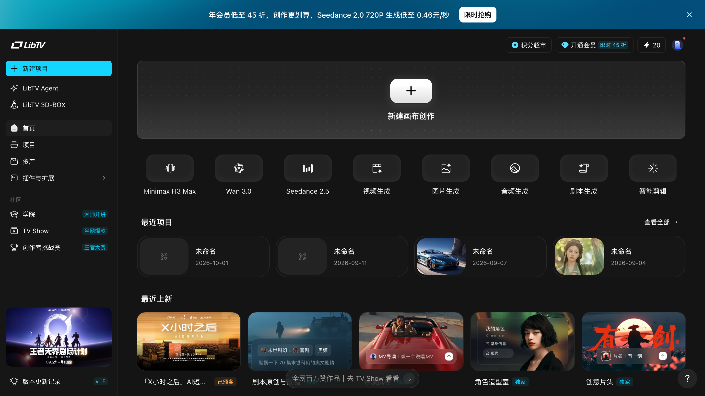
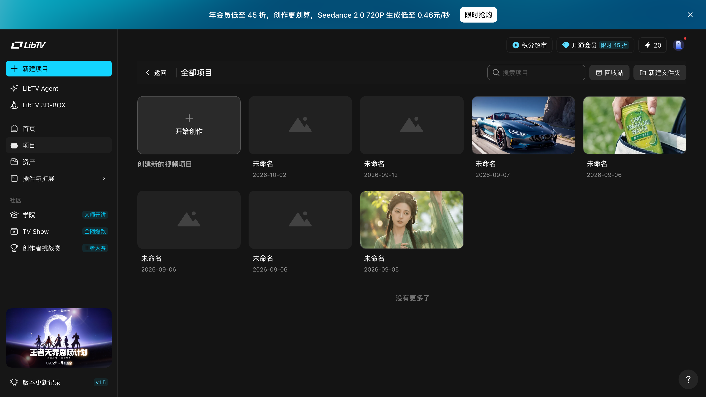
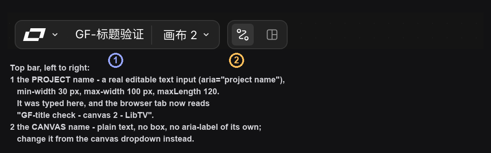

# 进入画布：从首页到一张空画布

> 目标：开出一张属于自己的画布，并知道它和「项目」是什么关系。
> 适用角色：普通创作者 · 验证状态：✅ 实跑（2026-10-01）

## 前置条件

- 已登录 LibTV（左侧栏最下方能看到头像与积分余额）；
- 建议先把浏览器窗口调到 **1440 宽左右**再开始 —— 太窄的话底部工具条和右侧抽屉会挤在一起。

---

## 入口一：首页「新建项目」（最常用）

打开 `https://www.liblib.tv`，左侧栏从上到下依次是：

`首页` · **`新建项目`** · `LibTV Agent` · `LibTV 3D-BOX` —— 然后是导航 `首页` `项目` `资产` `插件与扩展`，再往下是 `学院` `TV Show` `创作者挑战赛`。



点「**新建项目**」。

> **实测要点**：这一步**不弹对话框**。点了就直接建好并跳转 —— 项目名默认「未命名工作区」，画布名默认「画布 1」。
> 很多人第一次用会以为按钮失灵，又点一下，结果建出两张画布。**点一次就好。**

## 入口二：项目页「开始创作」

左侧栏点「项目」进入 `/project`。



这一页同时是**项目总览**和**回收站入口**：

| 控件 | 作用 |
|---|---|
| 回收站 | 删除的项目在这里，找回来用 |
| 新建文件夹 | 把项目归类 |
| 开始创作 | 新开一张画布 |

## 入口三：首页的快捷生成按钮

首页主区还有一排更快的入口：

`Minimax H3 Max` · `Wan 3.0` · `Seedance 2.5` · `视频生成` · `图片生成` · `音频生成` · `剧本生成` · `智能剪辑`

前三个是**指定模型**直接开跑，后五个是**按类型**开跑。

> ⚠️ 这排按钮会直接进入带生成参数的画布，**提交就会扣积分**。想先熟悉界面，从「新建项目」进。

---

## 成功判据

- 地址栏变成 `/canvas?spaceId=…&projectId=…`；
- 顶栏出现项目名（可点击编辑）和「画布 1」下拉；
- 画布中央显示「双击画布 自由生成节点」；
- 底部中央出现七枚工具条按钮。

## 一件必须讲清楚的事：画布和项目的关系

LibTV 里有**两层**，很容易混：

```
项目（顶栏那个可编辑的名字，如「未命名工作区」）
  └── 画布 1   ← 顶栏 URL 里的 projectId
  └── 画布 2   ← 另一个 projectId
```

**一张画布 = 一个独立的 projectId。** 实测点下拉里另一张画布，`spaceId` 不变而 `projectId` 变了：

- 切到「手册取证画布」后 → `projectId=34226ef1…`
- 切回另一张 → `projectId=7491cfb2…`

这解释了两件用户常问的事：

1. **画布链接可以直接发给别人** —— 链接里带着具体的画布地址，打开就是那一张；
2. **改画布名不会改项目名** —— 顶栏那个 `aria-label="项目名称"` 的输入框在所有画布下都显示同一个名字，它绑的是更上面那一层。

### 顶栏两个名字，一个能改一个不能

顶栏上挨着有两个名字，很容易搞混：



| | 项目名（左边那枚输入框） | 画布名（右边那行字） |
|---|---|---|
| 长什么样 | **带边框的可编辑输入框** | 纯文字 + 一个 `▾` |
| 怎么改 | ⭐ **直接点进去打字** | 画布下拉 → 行级菜单「重命名画布」 |
| 影响谁 | 这一整个项目下的**所有画布** | 只有这一张 |
| 画布之间的显示 | 换画布时**不变** | 换画布时**跟着换** |

**改项目名的实测**：

- 输入框宽 `86~96px`（随名字长度变），最长 120 字符；
- 改完**按 `Enter` 或者点别处让它失焦**，都会生效；
- ⭐⭐ **浏览器标签页的标题会跟着变** —— 改完从
  `未命名工作区 - 画布 2 - LibTV - 专业视频创作工具`
  变成
  `GF-标题验证 - 画布 2 - LibTV - 专业视频创作工具`；
- 这个名字**对所有画布生效**：切到别的画布，标题里变的是画布名那一段，项目名那一段不变。

> 💡 建议进画布先改项目名 —— 它是你在浏览器标签、历史记录、分享窗口里最先看到的那一段。
> 画布名可以等布局定了再改。

## 取消与恢复

- 建错了画布：画布下拉 → 行级菜单「删除画布」，有二次确认，见 [manage-canvases.md](manage-canvases.md)。
- 名字难听：点顶栏项目名直接改（上面那节有完整步骤）；画布名在画布下拉里改。

## 相关

- 下一步 → [create-nodes.md](create-nodes.md)
- 多张画布怎么管 → [manage-canvases.md](manage-canvases.md)
