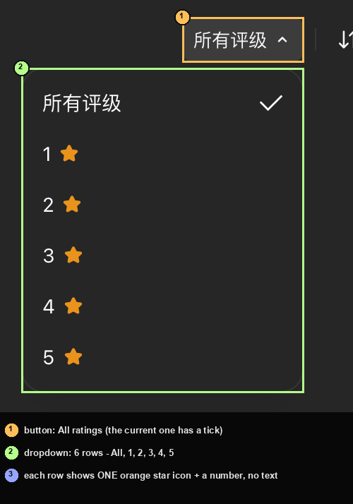
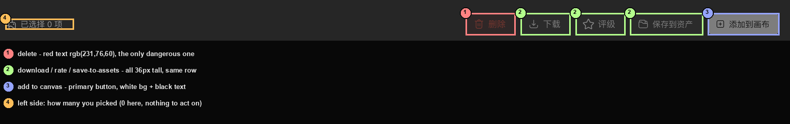

# 生成历史：找回生成过的东西

> 目标：知道画布上的东西生成过之后去哪了、怎么找回来、怎么一次处理一批。
> 适用角色：普通创作者 · 验证状态：✅ 面板逐控件实跑（0 条记录的状态，有记录时的行为 📖）

---

## 它是什么，不是什么

「生成历史」在**底栏中央**（一个钟表图标，无障碍名就是 `生成历史`）。
点它弹出一块**居中的面板**，浮在画布上——四周的画布节点还看得见，
不是那种把整个屏幕涂黑的遮罩。

| 它**是** | 它**不是** |
|---|---|
| 你**生成过的图片 / 视频 / 音频**的清单 | ⛔ **不是回收站**。画布里删掉的东西不会进这里 |
| 可以按类型、评级、时间筛 | ⛔ 不是「画布上的节点列表」。节点在画布上，不在这儿 |
| 可以批量下载 / 加回画布 | ⛔ 不存你自己上传的文件（那在[资产管理](organize-canvas.md)里） |

> 💡 一句话记法：**「生成历史」里全是「生成」出来的，「资产管理」里全是「传上来」的。**

---

## 面板长什么样

- **面板外壳**实测 `[73, 158, 1294, 571]` —— 居中，四边露出画布。
- 空的时候正中写的是 **`暂无历史记录`**（不是「暂无素材」——
  素材库那两个页签空的时候写的是「暂无素材」，别混）。

---

## 三组筛选（可以叠着用）

### ① 看哪个范围的：全部画布 / 本画布

两枚是**单选**（不是两个独立的开关）——选中哪个，另一个就取消。

| | 含义 |
|---|---|
| `全部画布` | 你所有画布里生成过的东西（默认） |
| `本画布` | 只看当前这张画布的 |

> ⭐ **想在别的画布里找东西，就一定要留在「全部画布」**，
> 切到「本画布」之后就只剩这一张画布的了。

### ② 看什么类型的：图片 / 视频 / 音频

三枚**各带一个计数徽标**：`图片 0`、`视频 0`、`音频 0`。
数字就是你名下各有几条，点一下只看那一类。

> ⚠️ **按文字找它们会踩坑**：界面上的字是「图片 0」而不是「图片」，
> 用「精确匹配『图片』」是**找不到**的。本手册第一版脚本就这么空跑过一轮。

### ③ 评价和排序（右上角三枚）

| 控件 | 类型 | 读数 |
|---|---|---|
| `所有评级 ▾` | ⭐ **真·下拉** | 展开是一个 `200×230` 的浮层，**六档** |
| `时间倒序` | ⭐ **不是下拉，是两态切换** | 见下 |
| `批量操作` | 开关 | 见下 |

**「所有评级」展开后是六行**：

> ⚠️ **每档只有一枚星**——它是「这一档」的图标，不是「点几颗星」。
> 数字 `1`～`5` 和星图一起才是完整的一档。

**「时间倒序」是点一下切一下**，没有下拉箭头、也不弹浮层：

| 点之前 | 点之后 |
|---|---|
| `时间倒序` · 悬停写「**当前：最新优先**」 | `时间正序` · 悬停写「**当前：最早优先**」 |

连点四轮读数：`倒 → 正 → 倒 → 正`，**两态循环**。

> 💡 **想知道现在是哪一态，把鼠标停在上面**：气泡里会写「当前：最新优先」还是「当前：最早优先」。
> ⛔ 光看按钮上的四个字容易以为它没生效——它换了文字，但长得几乎一样。

---

## 「批量操作」：先选，再处理

点一下 `批量操作`，**面板底部会展开一条操作条**。按钮上的提示写得很清楚：

> 「**进入后可按住左键在素材上滑动多选，或在空白处拖拽框选**」

也就是说，它是**先进入多选模式**，让你自己划/框要处理的那几条。
⭐ **不是**「点一下它就替你把全部选中」。

| 按钮 | 做什么 | 本手册验没验 |
|---|---|---|
| `删除` | 删掉选中的记录 | ⛔ **没点**。红字 `rgb(231,76,60)`，是这一排里唯一的危险操作 |
| `下载` | 存到本地 | ⛔ 没点 |
| `评级` | 给选中的打星 | ⛔ 没点 |
| `保存到资产` | 把选中的存进资产管理 | ⛔ 没点 |
| `添加到画布` | 把选中的变成画布上的节点 | ⛔ 没点（会新建节点） |

> ⛔ **本轮一条记录都没有**（`图片 0` `视频 0` `音频 0`），
> 所以这五枚**点了会怎样，只有等你有记录之后才知道**——这里标 📖，不当保证。
> ⭐ 唯一确定的是：**它们在「已选择 0 项」时就在那儿**，不是禁用、只是没东西可选。

**再点一次 `批量操作` 就退出**，面板回到原样（实测退出后多出来的元素 0 个）。

---

## 右上角那枚滑块

标题栏右上角，除了关闭 `×`，还有一枚**密度滑块**——左右各一枚网格图标（疏 / 密）夹着一条滑杆。

| 项 | 读数 |
|---|---|
| 取值范围 | `0` ～ `4` |
| 步长 | `1` |
| **默认值** | **`2`** |
| 宽度 | `100` px |

⭐ **它不落盘**：本轮把它拖到 `0`，关掉面板、下次重新开，**读回来还是 `2`**。
⇒ 每次打开都是默认值，**别指望它记住你的选择**。

---

## ⚠️ 收下拉的时候，别按 Esc

在「所有评级」下拉**开着**的时候按 `Esc`：

| 收法 | 下拉关了吗 | **面板还在吗** |
|---|---|---|
| 按 `Esc` | ✅ 关了 | ⛔ **整个面板被一起关掉了** |
| 点面板里的空白处 | ✅ 关了 | ✅ 还在 |
| 再点一次同一枚按钮 | ✅ 关了 | ✅ 还在 |

⇒ ⭐ **想只收起下拉，就点空白处、或者再点一次那枚按钮。**

---

## 找不到东西时先看这几处

| 症状 | 先查 |
|---|---|
| 面板里空空如也 | 是不是切到了「本画布」？切回「全部画布」 |
| 只有图片没有视频 | 是不是被「视频 0」那一档筛掉了 |
| 排序看着没动 | 它已经换了字（倒↔正），**把鼠标停上去看气泡** |
| 找不到删除过的东西 | ⛔ **这里没有回收站**。画布上删掉的节点不会出现在这儿 |

> ⚠️ **「批量操作」里那个红色的 `删除` 删的是历史记录，不是画布上的节点。**
> 两者是两回事，别混。

---

## 📖 没有验证的部分

- 有记录时，`下载` / `评级` / `保存到资产` / `添加到画布` 各自的后果；
- 记录卡长什么样、怎么单击/多选；
- 「全部画布」跨画布时的排序是否真的按时间全局排；
- 密度滑块 `0` 和 `4` 到底差多少（0 条记录时看不出差别）。

⛔ 本轮**没有生成过任何东西**（会扣积分），
所以这一页能给你的，是**面板长什么样、每个控件是什么脾气**，
不是「生成完再去哪里取」的全流程。

---

## 相关

- [素材库](asset-library.md) —— 风格 / 特效 / 上传的素材
- [整理画布：资产管理](organize-canvas.md) —— 左边那枚「资产管理」抽屉
- [故障排查](../90-troubleshooting.md) —— 按症状查
