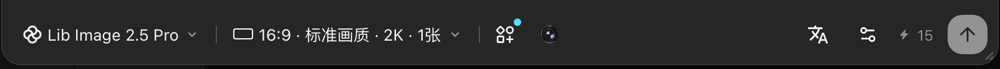
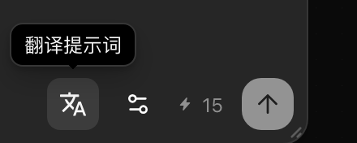
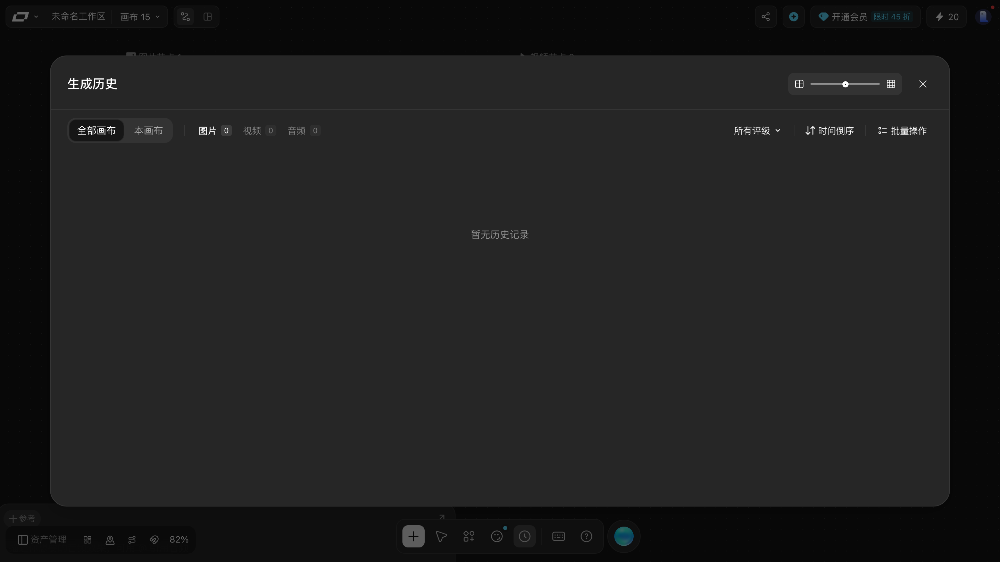
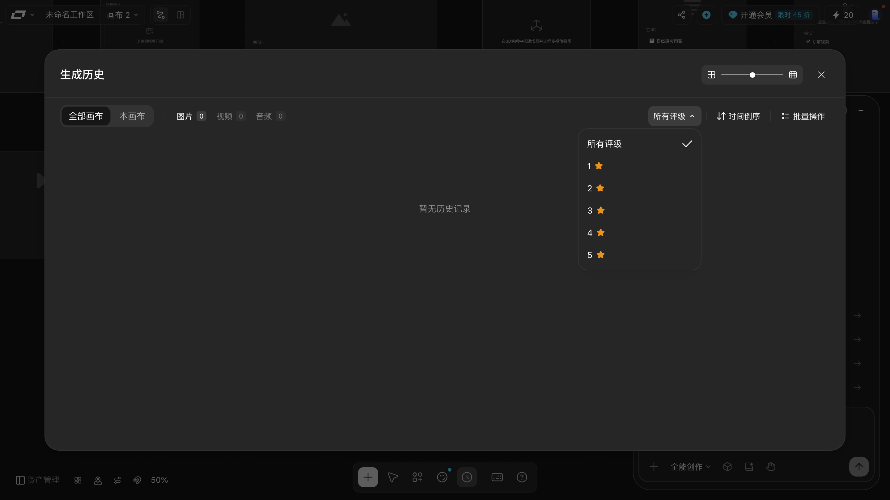
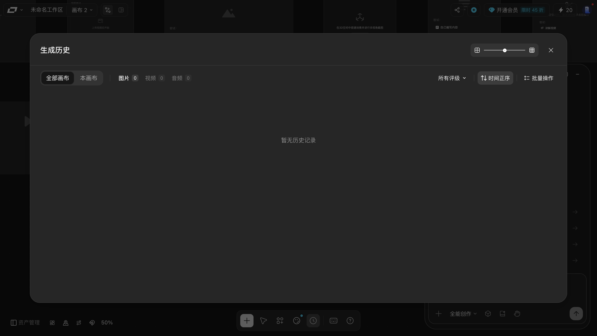

# 生成图片、视频、音频

> 目标：看懂每个生成节点的参数、模型和积分花费，知道提交按钮在哪。
> 适用角色：普通创作者 · 验证状态：⚠️ **参数面板全部实跑；一次都没有真正提交**

## ⚠️ 这一页的边界

LibTV 的生成按量扣积分。取证时测试账户余额 **20 积分**，而一张图片要 `15`、一条 5 秒视频要 `135`。

> **本手册从头到尾没有点过任何一次提交。**
> 所以下面分成两层：
> - ✅ **实测**：参数、模型名、积分数字、提交按钮的位置 —— 全部来自真实界面；
> - 📖 **推断**：生成要多久、失败长什么样、产物落在哪 —— **没有验证**，别当保证。

---

## 提交前：每个节点长什么样

### 图片节点 ✅

| 项 | 实测值 |
|---|---|
| 模型 | `Lib Image 2.5 Pro` |
| 规格串 | `16:9 · 标准画质 · 2K · 1张` |
| 花费 | `15` |
| 其他 | `参考` `标记` `风格` + 四枚纯图标按钮（`预设` / 镜头球 / `文A` = 翻译提示词 / `⚙`）+ `高级设置` `智能引用 AutoLink` |

规格串是四段式：**比例 / 画质档 / 分辨率 / 张数**，点它逐项改。

> ⭐ 那枚**没有文字也没有 `aria` 的深色镜头球**，是这一排里**唯一不用点就知道当前设置**的 ——
> 悬停它，气泡直接报出 `Panavision DXL2 / 已关闭 / Arri Signature Prime / 35mm / ƒ/4`
> （相机 / 状态 / 镜头 / 焦距 / 光圈）。逐枚悬停实名见 [create-nodes.md](create-nodes.md)。

### 视频节点 ✅

| 项 | 实测值 |
|---|---|
| 模型 | `2.0` |
| 生成方式 | `文生视频`（还有首尾帧 / 首帧 / 超长视频等，由「尝试：」决定） |
| 规格串 | `16:9 · 720P · 5s · 1个` |
| 花费 | `135` |
| 开关 | `联网搜索` `自动校验素材` `智能引用 AutoLink` |

### 音频节点 ✅

| 项 | 实测值 |
|---|---|
| 模型 | `Seed Audio 1.0` |
| 规格串 | `中文 · 24k · wav` |
| 字数 | `0/2000`（已用 / 上限） |
| 花费 | `1` |
| 高级设置 | 可折叠分区（入口是参数条上那枚 `⚙`，**点「高级设置」四个字没反应**），内含 `语速` `声调` `音量` 三行，**每行一条滑杆 + 一个数值框**。取值范围 `0.5–2` / `−12 ~ +12` / `0.01–10` |

---

## 提交按钮在哪

选中节点、卡片**展开**之后，编辑区右下角有一个**圆形上箭头**按钮 —— 那是提交。

> ⚠️ 它就在提交按钮旁边，很容易误触。**调参数时手别放在那儿。**

---

## ⭐ 还有第二个入口：点 `⤢` 打开大编辑器

> ⚠️ 这一节补的是本页此前的**交叉引用缺口**：
> 全手册只讲了「卡片展开后调参数」这一条路，
> 没讲**同一个生成器还有一个放大版入口**。两条路通向同一套参数。

节点卡片右上角有一枚 **`⤢`**（向外斜箭头）。点它 —— **不是收起卡片**，
而是弹出一个**居中的大编辑器**（`800×600` 的浮层，画布被压暗，四周的画布还露着）。

大编辑器底栏一整条，**7 枚**（图片节点实测）：

| 位置 | 控件 | 产品自己贴的锚点 | hover |
|---|---|---|---|
| 1 | 模型下拉 `Lib Image 2.5 Pro ▾` | `data-practice-anchor="gen.model"` + `data-quick-guide-anchor="generator-model-select"` | — |
| 2 | 规格下拉 `16:9 · 标准画质 · 2K · 1张 ▾` | `data-practice-anchor="gen.params.count"` | — |
| 3 | 预设（**右上角有蓝点徽标**） | `data-feature-id="generator:preset-menu"` | — |
| 4 | 一颗**深色镜头球** | `data-camera-control-icon="light"` / `"dark"` | ✅ 气泡直接报出当前相机镜头焦距光圈 |
| 5 | **文A** = 翻译提示词 | `data-practice-generator-lock` | ✅ **气泡逐字「翻译提示词」** |
| 6 | 滑块 | `data-practice-generator-lock` | ⛔ 无气泡 |
| 7 | 花费 + 白色圆角方块里的**上箭头**（提交） | `data-practice-anchor="gen.submit"` + `data-quick-guide-anchor="generator-submit"` | — |

> ⭐⭐ 底栏**不是均匀排的**。7 枚按钮实测的相邻空隙依次是
> `9 / 9 / 4 / 183 / 8 / 48` 像素 —— 镜头球和「文A」之间有 **183px 的空洞**，
> 别以为那里藏着按钮，它就是空的。

两条路的差别，值得知道：

| | 卡片展开 | 大编辑器（`⤢`） |
|---|---|---|
| 位置 | 节点卡片内部 | 画布正中，压暗画布 |
| 关掉 | 点别处 / 选中别的节点 | 点压暗层，或点**右上角的收拢箭头** |
| 快捷键 | — | ⚠️ `ESC` **不可靠**（焦点在 `body` 上关不掉） |
| 存盘 / 扣积分 | 不存盘、不扣积分 | 不存盘、不扣积分 |

> ⚠️ **别把两条路当成两套参数。** 大编辑器的模型、规格、预设、镜头、翻译
> 和卡片上的是同一批（名字逐字相同）。大编辑器是**同一套东西的放大版**。

---

## 生成前的检查清单

按顺序过一遍，能省掉大部分返工：

1. **提示词写具体了吗** —— 视频节点占位文案是「描述你想要生成的画面内容」，注意它要的是**画面**不是情节；
2. **素材挂对了吗** —— 上游节点连线接好了吗？`参考` 里该传的传了吗？
3. **规格对了吗** —— 比例、时长、分辨率是不是你要的；
4. **积分够吗** —— 看一眼花费数字和右上角余额；
5. **试小样** —— 第一次先把时长/张数调到最小，确认方向对了再上大规格。

---

## 生成历史：面板本身已实跑

底部工具条那枚时钟图标「生成历史」，点开是一整块面板：

| 区域 | 内容 |
|---|---|
| 范围 | `全部画布` / `本画布` —— 两个并排按钮，默认选中「全部画布」 |
| 类型 | `图片 0` `视频 0` `音频 0` —— **按钮上带计数徽标** |
| 右列 | `所有评级 ▾` · `时间倒序` · `批量操作` |
| 视图 | 右上角两枚图标 + 中间一根滑杆（合成一个圆角容器），再右边是 `×` 关闭 |

### 三枚控件逐个点开的结果

| 控件 | 坐标 | 实测 |
|---|---|---|
| `所有评级 ▾` | `[1049,172,86×32]` | ✅ 点开 `mantine-Popover-dropdown`（200×230），六档 `所有评级 / 1⭐ / 2⭐ / 3⭐ / 4⭐ / 5⭐` —— **和资产管理抽屉里那枚评级筛选是同一套** |
| `时间倒序` | `[1152,172,86×32]` | ✅ **不是下拉，点一下直接换**：文案 `时间倒序`（`title="当前：最新优先"`）↔ `时间正序`（`title="当前：最早优先"`），两态循环。连点三轮实测 `倒 → 正 → 倒 → 正`，全程没有浮层 |
| `批量操作` | `[1255,172,88×32]` | ⚠️ 点开**没有浮层**，面板也没变。估计要有记录才能操作 |
| `全部画布` / `本画布` | `[111,177]` / `[193,177]` | 是**一组切换按钮**（当前选中那个是深色高亮），点一下就换，没有浮层 |

### 面板本身的形态

它是一块**浮在画布上的居中面板**（约 `[72,80,1296×640]`），**不是全屏遮罩** ——
画布在它四周露着，TV Director 面板也在右下角继续露着。
点右上角那枚 `×`（`[1315,107,28×28]`，纯图标、无文字无 `aria`）关闭，
关掉之后画布原样回来，不会像遮罩那样吞掉操作。

> ⚠️ **顶部那两枚图标和滑杆本手册没验证出效果。**
> 它们不是 `<button>`，只是一枚 `div`（`[1135,105,164×32]`）里的两个 `<svg>` 加一根轨道。
> 点下去**面板上没有任何可见变化** —— 但这张画布上**从来没有过一条历史记录**，
> 网格/瀑布流切换、缩放大小在空列表上都看不出差别。
> **不能据此说它们无效**，只能说本手册没验证。
> 有记录之后这三枚控件才值得再看一遍。

本轮测试账户**一次都没真正提交过生成**，所以三类的计数都是 `0`，面板显示「暂无历史记录」。
**有记录时长什么样、能不能点开复用、删除入口在哪，本手册都没有验证** ⚠️。

> 所以「生成失败了怎么办」这一类问题，现在只能靠 [../90-troubleshooting.md](../90-troubleshooting.md)
> 里的自查建议（先看余额、先用最小规格、去生成历史和资产两个入口各看一次）。

---

## 📖 没有验证的部分

| 问题 | 状态 |
|---|---|
| 生成要等多久 | 📖 未验证 |
| 生成中节点显示什么（进度？转圈？排队？） | 📖 未验证 |
| 生成失败了会提示什么 | 📖 未验证 |
| 产物落在节点哪个位置 | 📖 未验证 |
| 生成历史在哪看 | 底部工具条「生成历史」，**面板本身已实跑**，见下 |
| 积分扣了但没产物怎么办 | 📖 未验证，见 [../90-troubleshooting.md](../90-troubleshooting.md) |

这些空缺是**故意留白**：宁可写「没试过」，也不给你一段编出来的操作步骤。

---

## 相关

- [create-nodes.md](create-nodes.md) —— 节点是怎么建出来的
- [connect-nodes.md](connect-nodes.md) —— 先把上游接好
- [../20-reference.md](../20-reference.md) —— 参数与名词对照
