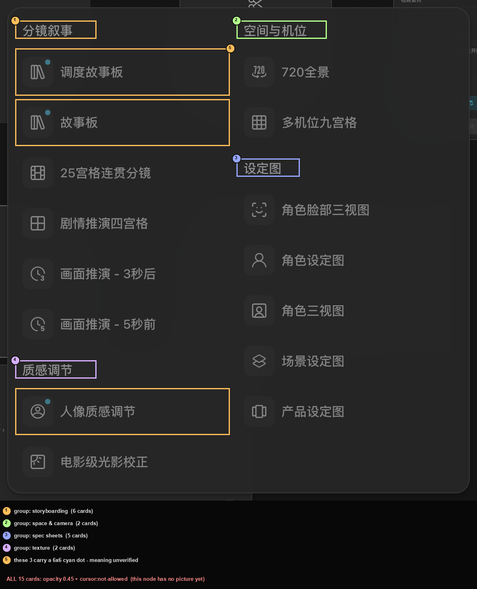
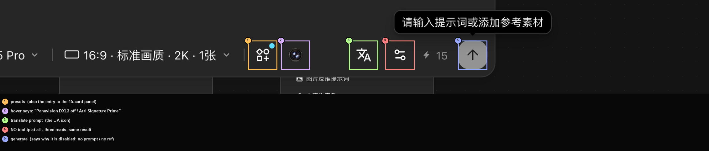
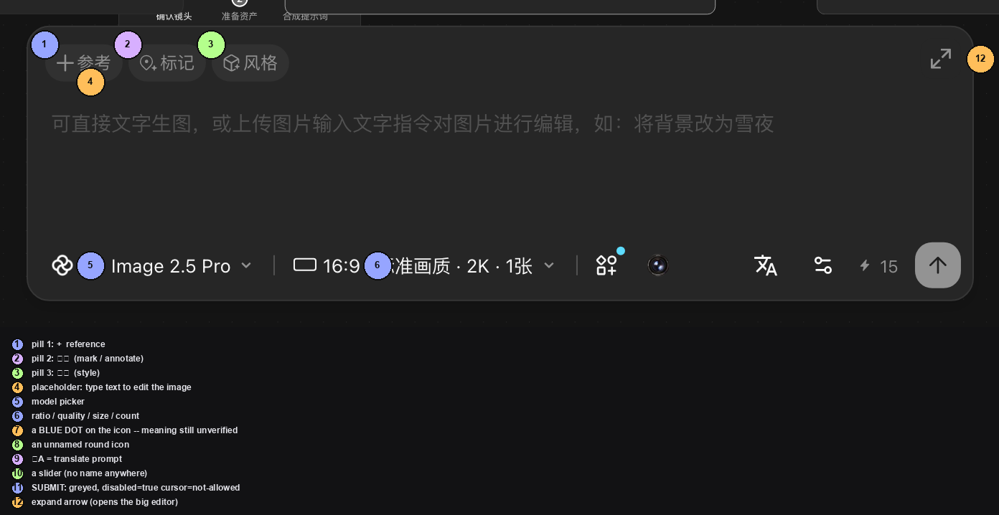

# 图片节点的「预设」面板：15 张卡片，和它们为什么是灰的

> 目标：知道图片节点参数条上那枚「预设」点开是什么、有哪些卡片，以及**最要紧的一条**——整片灰不是坏了。
> 适用角色：普通创作者 · 验证状态：✅ 面板与 15 张卡逐张实读、逐张悬停读原因（**一张都没点**）

---

## 入口

**先选中一个图片节点**，它的参数条上有一枚 **`预设`** 按钮
（`aria-label="预设"`，图标是一个带 `+` 的小方框，右上角带一枚蓝点）。

点它弹出一块**居中的浮层**，盖住画布中间。
实测 class 含 `border-hair fixed z-[calc(var(--z-overlay)+2)] backdrop-blur-2xl rounded-2xl`。

---

## 里面是 15 张卡片，分成四个组

### 分镜叙事（6 张）

| 卡片 | 它自己写的一句话 |
|---|---|
| `调度故事板` | 生成带有运动轨迹等调度草图分镜 |
| `故事板` | 生成完整剧情片段 |
| `25宫格连贯分镜` | 生成连续分镜长图 |
| `剧情推演四宫格` | 生成四格剧情推演 |
| `画面推演 - 3秒后` | 推演画面后续动作 |
| `画面推演 - 5秒前` | 还原画面前置状态 |

### 质感调节（2 张）

| 卡片 | 说明 |
|---|---|
| `人像质感调节` | 降低 AI 感，优化人物质感与光影 |
| `电影级光影校正` | 调整画面光影质感 |

### 空间与机位（2 张）

| 卡片 | 说明 |
|---|---|
| `720全景` | 生成全景场景图 |
| `多机位九宫格` | 生成多视角机位图 |

### 设定图（5 张）

| 卡片 | 说明 |
|---|---|
| `角色脸部三视图` | 基于一张参考图生成脸部细节三视图 |
| `角色设定图` | 角色主视觉与设定拆解 |
| `角色三视图` | 正侧背视图与脸部特写 |
| `场景设定图` | 角色主视觉与设定拆解 |
| `产品设定图` | 角色主视觉与设定拆解 |

> 💡 每张卡都是「标题 + 一句话说明」两行，**高度固定 `52px`**，左边一枚方形图标。

---

## ⭐⭐⭐ 全都点不动，是因为**当前模型不支持它们**

这是这一页最该记住的一条。**把鼠标停在任意一张灰卡上，它会告诉你原因**：

| 卡片 | 悬停气泡逐字写的是 |
|---|---|
| `调度故事板` | **「调度故事板仅支持Lib Image模型」** |
| `故事板` | **「故事板仅支持Lib Image模型」** |
| `人像质感调节` | 「人像质感调节仅支持Lib Image、General image Pro、General image V2模型」 |
| `25宫格连贯分镜` | 「25宫格连贯分镜仅支持Lib Image、General image Pro、General image V2模型」 |
| `720全景` | 「720全景仅支持Lib Image、General image V2模型」 |
| `角色脸部三视图` | 「角色脸部三视图仅支持Lib Image、General image Pro、General image V2模型」 |

本轮节点上选的模型是 **`Lib Image 2.5 Pro`** ——
⭐⭐ **它不在任何一个名单里**，所以 **15 张卡片全部灰着**。

> 👉 **一句话：灰着不是坏了，是这个模型用不了它们。**
> 👉 **要解锁：把参数条最左边那枚模型名换成气泡里提到的那几个之一。**
> ⚠️ 本轮**换过模型**：早期批次实测换到 `Lib Image` 之后 **15 张卡片全部变亮**，
> ⛔ 但**换模型会改价格**（`⚡15` → `⚡18`）—— 换之前先看一眼闪电旁边的数字。
> 📖 换了之后这 15 条各自会写出什么，本手册没有验（那会提交生成）。

### 「灰」的完整形态

| 读数 | 值 |
|---|---|
| `opacity` | **`0.45`** |
| `cursor` | **`not-allowed`** |
| `disabled` 属性 | ⛔ **没有**（`disabled` 读出来是 `false`） |

> ⭐⭐ **判「能不能点」，光看 `disabled` 会读错** —— 这些按钮 `disabled=false`。
> 👉 **要看 `opacity` 和 `cursor` 两个字段。**

---

## ⭐ 卡片排成几列会变

面板内容区的 class 是
`tiny-scrollbar flex flex-col flex-wrap gap-2 overflow-y-auto`
—— 注意那个 **`flex-wrap`**。

⇒ ⭐ **列数由容器宽度自动决定**：

| 批次 | 容器实测 | 列数 |
|---|---|---|
| 本轮（FP-3） | `[282, 118, 496, 522]`，左列 `x=282` 宽 `238`（8 张）、右列 `x=528` 宽 `250`（7 张） | **2 列** |
| 早期批次（BA1） | 更宽的容器 | **3 列** |

⇒ ⭐ **所以「它是几列」这个问题没有唯一答案** ——
**卡片总数 15、四组分组才是稳定的**。
按「第几列第几个」去数卡片会数错，**按组名去数**才对。

---

## 三张卡上带蓝点

`调度故事板`、`故事板`、`人像质感调节` 的图标右上角有一枚 **`6×6` 的青色圆点**
（`rgb(93, 220, 255)`）。

⚠️ **别把蓝点当成「新功能」或「推荐」的标记**：整块画面上一共能数到 **5 枚**蓝点，
另外两枚分别在**模型下拉**（`6×6`）和**底栏的 TV Director 圆钮**（`12×12`）上 ——
它们和「预设」没关系。⇒ **蓝点的含义至今没有解释**。

---

## 参数条上那几枚「不悬停就没名字」的按钮

选中图片节点后，参数条上从左到右：

| | 气泡写的是 | 有没有名字 |
|---|---|---|
| ① `预设` | — | ✅ `aria-label="预设"` |
| ② `[309, 657, 32, 32]` | ⚠️ **「Panavision DXL2 已关闭 Arri Signature Prime / 35mm / ƒ/4」** | ⛔ 无文字、无 `aria` |
| ③ `[384, 657, 32, 32]` | `翻译提示词` | ⛔ 无 `aria`，靠悬停 |
| ④ `[424, 657, 32, 32]` | ⛔ **什么气泡都没有**（连读三次都一样） | ⛔ 无 |
| ⑤ `[504, 657, 32, 32]` | `请输入提示词或添加参考素材` ← **它在告诉你为什么现在点不动** | ⛔ 无 |

> ⭐ **② 那句气泡不是按钮名，是一条状态播报**（某个镜头风格已关闭、当前是另一套参数）。
> 它**不悬停就完全认不出来**。
>
> ⭐ **④ 是彻底「没名字」的**：既没 `aria-label`、没 `title`、也没气泡，
> **只能靠位置认** —— 它在「翻译提示词」右边、「生成」左边。

---

## ⛔ 一条要更正的旧说法

早前版本的参考表列过一组名字：
`扩图` `擦除` `抠图` `旋转` `旋转镜像` `裁剪` `补光` `打光` `重绘` `增强` `高清放大`
`多角度` `标注`，外加六个「生成器」和两个「增强」。

**本轮实测：把参数条、预设面板都打开，把整页文字（含透明度为 0 的）抓一遍，
这 21 个名字在界面上一个都没出现（0 / 21）。**

⇒ ⭐ **它们是代码里的内部命名，不是画布上的一张工具菜单。**
你在界面上找不到「扩图」「抠图」，**不是它藏起来了。**

---

## ⭐⭐ 顺带把「图片编辑区」这层浮层量准了

> 拍预设面板的时候撞出一层**本手册从未完整描述过**的东西：选中图片节点后，
> 会在节点**下方**浮出一整块编辑区。预设面板和参数条都长在它身上。

| # | 内容 | 说明 |
|---|---|---|
| ① | `+ 参考` | 加参考图 |
| ② | `标记` | 打标记 |
| ③ | `风格` | 加风格 |
| ④ | `可直接文字生图，或上传图片输入文字指令对图片进行编辑，如：将背景改为雪夜` | ⭐⭐⭐ **这句占位说明这层能做两件事：直接文字生图，或上传图片后用文字指令改图** —— 「按文字指令编辑图片」这个用法本手册此前一个字都没写过 |
| ⑤ | `Lib Image 2.5 Pro` | 模型下拉 |
| ⑥ | `16:9 · 标准画质 · 2K · 1张` | 规格四段 |
| ⑦ | 一枚带**蓝点**的纯图标 | 蓝点含义 📖 未验（和上面「三张卡上带蓝点」是同一个未验问题） |
| ⑧ | 一枚无字无 aria 的圆形图标 | 名字 📖 未验 |
| ⑨ | `文A` | 翻译提示词 |
| ⑩ | 一枚滑块形图标 | 名字 📖 未验（与上面参数条那枚是同一枚） |
| ⑪ | 圆形上箭头（提交） | ⭐ **本手册第一次读到它的禁用态**：`disabled: true` + `cursor: not-allowed` |
| ⑫ | `⤢` 展开箭头 | 打开大编辑器 |

**几何**（Batch FT-4 / FT-5 实测）：

- 浮层壳 `[655,506,660,192]`；它的**祖父** class 是
  `node-floating-ui nodrag nowheel nopan origin-top … absolute -bottom-4 left-1/2 z-20 -translate-x-1/2`
  ⇒ ⭐⭐ **`node-floating-ui` 是这一类浮层的统一 class 名**，以后直接拿它找。

> ⭐⭐⭐ **顺带更正本手册一条旧说法**：以前写的是
> 「折叠态图片节点只有 169 高，参数条在框外 150px」。
> ⛔ **参数条不是固定偏移** —— 它长在**这层浮层**上，浮层跟着节点走，
> 位置随节点在画布上的位置变。
> ⇒ 找参数条要用**相对锚点**（节点框下方 200px 内）或直接读 `node-floating-ui`。
> ⛔ **别再用固定的 `y 600~800`** —— Batch FT-1 用 `y > 500` 去扫，
> 一枚节点参数条按钮都没扫到（扫到的全是底栏和右侧面板）。

> ⛔ 本轮**没有**在这层里点过任何会消耗积分或改内容的按钮：
> 「参考」「标记」「风格」「预设」「提交」「⤢」一个都没点。

## 📖 没有验证的部分

| 项 | 为什么没验 |
|---|---|
| 卡片点亮之后点下去的结果 | 会提交生成、扣积分 |
| 换成支持的模型之后，卡片具体写出什么 | 同上 |
| 三张卡上那枚蓝点的含义 | 界面上没有任何文字解释它 |
| ② 号（摄像机）按钮点开会是什么 | 气泡内容不像按钮名 |
| ④ 号（无气泡那枚）是什么 | ⛔ 界面上真的没有它的名字 |
| 这个面板在**视频 / 音频**节点上是不是同一套 | 本轮只测了图片节点 |

---

## 相关

- [创建节点](create-nodes.md) —— 图片节点的模型、规格、提示词
- [生成图片视频音频](generate-media.md) —— 提交生成会花多少积分
- [参考表](../20-reference.md) —— 各节点参数的完整对照
