# 管理画布：新建 / 切换 / 重命名 / 复制 / 删除

> 目标：掌握一个项目里多张画布的全部操作。
> 适用角色：重度创作者 · 验证状态：✅ 五项全部实跑（2026-10-01）

## 前置条件

- 已经站在任意一张画布里（顶栏能看到「画布 N」）。

---

## 第 1 步：打开画布下拉

点顶栏的「**画布 N**」按钮。面板宽度固定 `214px`，结构分两部分：分区标题「画布」+ 右上角一个加号按钮，下面是画布行列表（**新的在最上面**）。

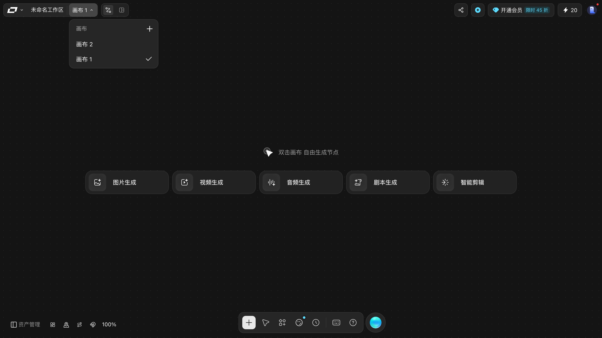

同一次下拉展开的另两个瞬间（面板宽度固定 214px，行按钮悬停才出现）：

| 刚展开 | 悬停行后 |
|---|---|
| 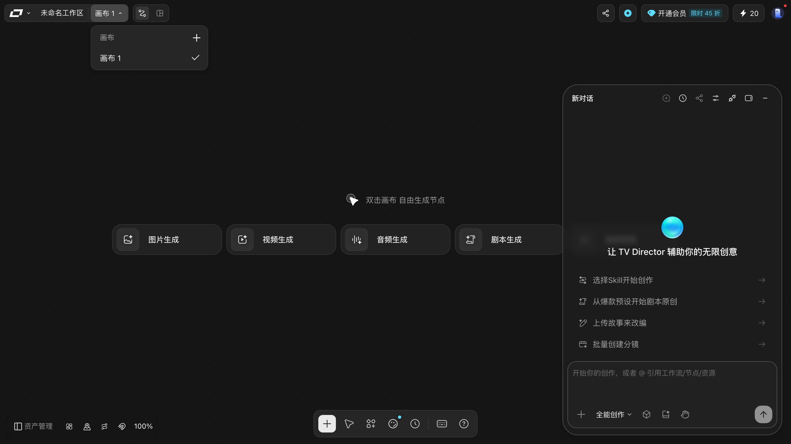 | 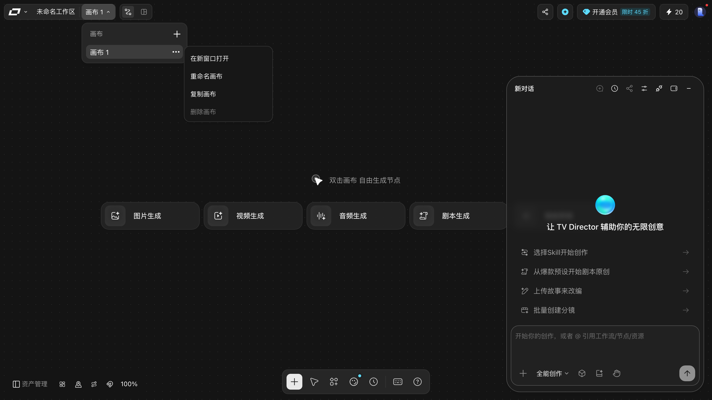 |

每一行包含两个元素：

| 元素 | 说明 |
|---|---|
| `切换到画布 {名称}` | 点它切过去。**地址栏的 `projectId` 会变** |
| `更多操作` | 平时看不见，鼠标移到那一行上才显形 |

> ⚠️ 那个「更多操作」是**悬停才显形**的按钮。直接点它没反应，要先把鼠标移到那一行上。

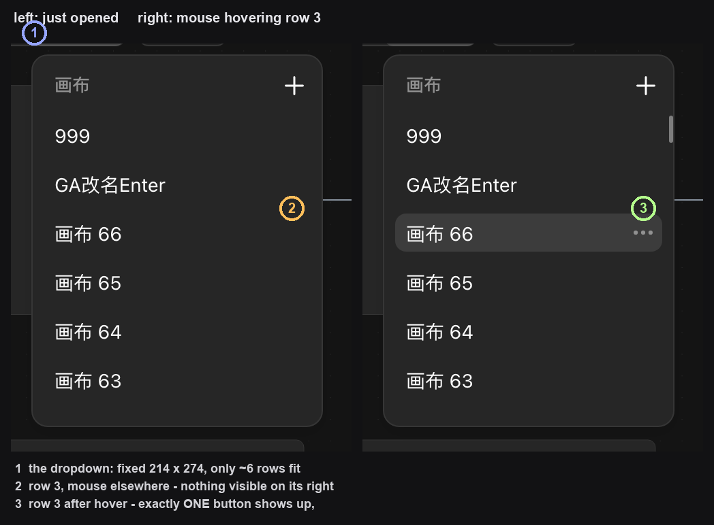

**「悬停才出现」到底是什么机制**（实测）：那一枚 24×24 的按钮**从头到尾都在页面里**，面板打开的瞬间就可以查到它，只是被设成 `opacity: 0` 且 `pointer-events: none`。鼠标移进某一行时，**只有那一行**的这一枚变成 `opacity: 1`、恢复可点，上下的行仍然是 0。所以「没出现」不等于「不存在」——它只是透明且点不到。

### 面板有多大、能放下几行

面板是个**固定尺寸**的浮层，不随画布数量变大：

| 部件 | 实测尺寸 |
|---|---|
| 面板整体 | **214 × 274** |
| 顶部分区标题「画布」那一行 | 高 28 |
| **真正能看见的列表窗口** | **212 × 220** |
| 每一行 | 高 21，行与行之间再空 15 ⇒ **步进 36** |

⇒ ⭐ **220 ÷ 36 ≈ 6**：**不管你有 6 张还是 60 张画布，下拉里永远只看得到 6 行左右**（实测 64 张时，可视区内完整可见 6 行、另有一行露出一部分）。

翻页的办法是**在列表上滚滚轮**：滚多少列表就跟着走多少（实测滚 6 次 ×200px，列表正好上移 1200px）。有两个细节：

- ⭐ 这里**没有滚动条**可以拖，只能靠滚轮；
- ⭐ 在这里滚滚轮**不会误伤画布缩放**（实测前后缩放都是 48%）；
- ⭐ 方向键 `↓` **不翻这个列表**。

最后一张画布是**可以滚到的**，但要滚到底（约 12 次滚轮）才看得到。

> 💡 画布多了以后要快速找某一张，只能一直滚到底部附近。本手册**没有验证**是否存在按名称搜索的入口 —— 下拉里**没有搜索框**。

> 📌 一个容易误判的地方：这段列表在页面上挂着一个叫 `generator-prompt-scroll-region`（"生成提示词滚动区"）的 class。**class 名和它装的东西完全无关**，认界面元素要以实际内容为准。

### 行菜单就是这四项

「更多操作」点开的是一个**只有四项**的浮层，位置贴在按钮右侧：

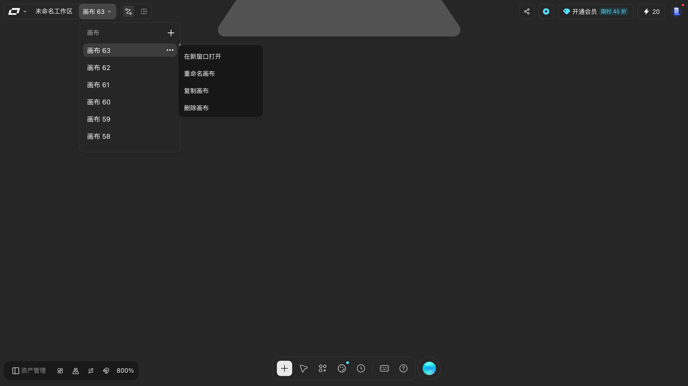

> **在新窗口打开** / **重命名画布** / **复制画布** / **删除画布** —— 没有第五项，也没有分组线或图标。

本手册在**同一张下拉里连着点了第 1、2、3 行的「更多操作」**，三次读出的菜单内容**逐字一致**：都是这四项，顺序也一样。行与行之间没有差别（不随是否活动画布、是否已改名而变）。

### 第一项「在新窗口打开」实测

这一项实按过（拦截新标签页，读完立刻关掉）：

- **真的开一个新标签页**（页签数 `1 → 2`），**不是**当前页跳转；
- 新标签页的 `projectId` 换成**那一行画布自己的** id，不是当前这张的；
- 标签标题变成 `画布 63 - LibTV - 专业视频创作工具`；
- **原来那个标签页纹丝不动** —— URL、画布内容、节点数全都没变。

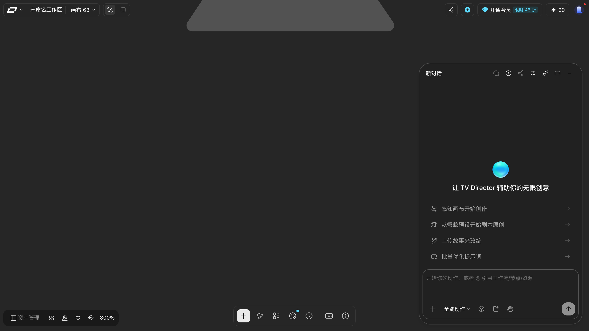

> 想同时开着两张画布对照看，用这一项。剩下三项的后果见下面各步。

## 第 2 步：新建画布

点面板右上角的加号（无障碍名「**新建画布**」）。

### 它不是弹窗，是把第一行就地改成输入框

⭐⭐⭐ **最容易误解的一点**：点下加号后，**没有任何弹窗出现**。真正发生的是——**列表最前面那一行，就地变成了一个输入框**（和「重命名画布」用的是同一个行内控件）。所以此刻你在面板里看到的仍是原来那张画布，只不过它的位置被输入框顶替了。

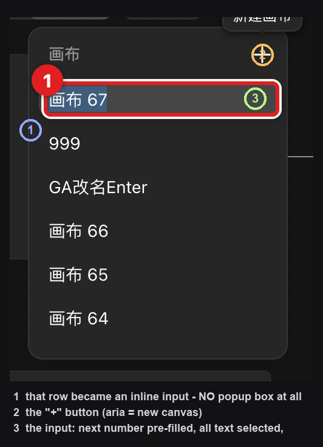

这个输入框一出现就已经处于可打字状态：

| 特征 | 实测 |
|---|---|
| 预填内容 | **下一个编号**（如 `画布 67`） |
| 选中状态 | **整段全选** |
| 焦点 | **自动聚焦** |
| 长度上限 | `maxLength` = **120** 字符 |

⇒ 所以你**不用先删掉**「画布 67」这几个字，**直接打字就是改名**。

### 画布是在你「离开输入框」的那一刻才建出来的

⭐⭐⭐ **这一步的时序是本手册此前写错的地方**（Batch FZ 记的是「点加号那一刻画布就已经建出来了」，实测**不成立**）：

| 你做的动作 | 发出创建请求了吗 |
|---|---|
| 点下加号 | ❌ **没有**。只发出当前画布的草稿心跳 |
| 在输入框里打字 / 删字 | ❌ 没有 |
| **按 `Enter`** | ✅ **创建** |
| 按 `Esc` | ⚠️ **也会创建** |
| 点一下画布空白处 | ⚠️ **也会创建** |

真实原因：这一行是**就地替换**的，它一失焦就算「填完了」。`Esc` 关掉的是整个下拉，点空白处让输入框失焦——两者都触发了同一个提交。

⇒ ⛔⭐⭐ **新建画布没有「取消」这条路。** 想不建，唯一的办法是**什么都不输入、直接离开**——

⇒ ⭐⭐ **把名字留空（或者只敲空格）就不会建**：实测点下加号、清空输入框、点画布空白处，**一个创建请求都没发出**，画布数量不变。

这既是唯一的「不落地」的办法，也解释了为什么它值得记住：**光按 `Esc` 以为取消掉了，其实已经建出一张空白画布。**

### 名字按你打的原样保存

实测同一批里建了 4 张画布，得到这些名字：

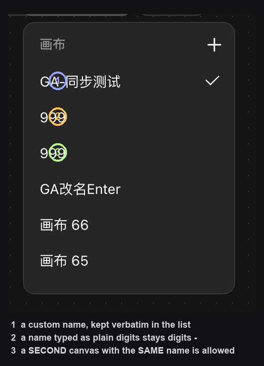

- `GA-同步测试` → 就叫 `GA-同步测试`，中文、连字符、英文混排都原样保留；
- `999` → 就叫 **`999`**，⭐ **不会**被改写成「画布 999」；
- ⭐⭐ **`999` 建了两次，列表里就有两张都叫 `999` 的画布** —— **重名不报错**。

⇒ 💡 正因为可以重名，**光看名字认不出是哪一张**。认画布要靠地址栏的 `projectId`，或者靠画布里的内容。

### 建完之后

- 新画布**插在列表最前面**（和「复制画布」插在源画布正下方不一样）；
- **自动切换**到新画布，地址栏 `projectId` 变成新画布的；
- 顶栏的标签**立刻**换成你起的名字，而且**按钮会变宽**以容下名字（实测「画布 2」69px 宽，`GA-同步测试` 108px 宽）；刷新页面后仍是这个名字。

> 📌 顶栏那枚按钮**没有无障碍名**，只有文字（`画布 2`、`999`、`GA-同步测试`…）。想找它只能按文字或位置认。

### 速查：想建一张画布该怎么做

1. 点顶栏「画布 N」打开下拉；
2. 点右上角加号 —— 第一行变成输入框，已预填下一个编号且全选；
3. **直接打字**起名（可留空、可纯数字、可与别的画布重名）；
4. 按 `Enter` 创建并切过去。

⚠️ 想中途反悔，**不要按 `Esc`、也不要随手点画布**——那两条路都会把画布建出来。

## 第 3 步：切换画布

直接点某一行的名称。切换后顶栏标签和地址栏的 `projectId` 一起变。

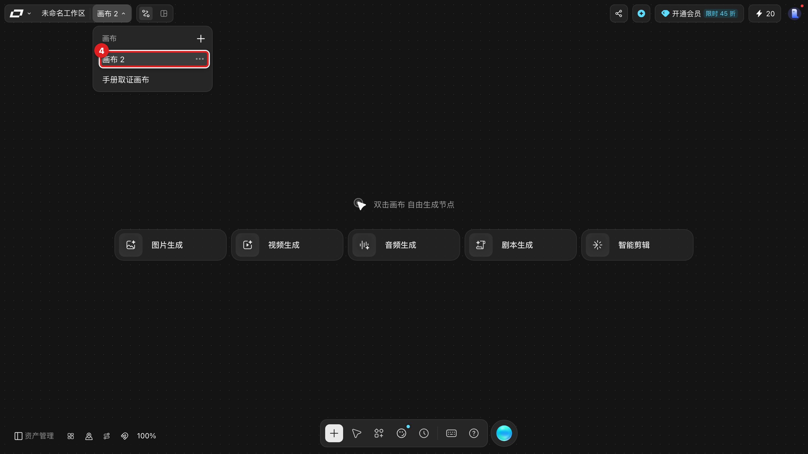

> 这不是「视图切换」—— 每张画布是一个独立的项目地址。

## 第 4 步：重命名画布

1. 鼠标移到要改的那一行，「更多操作」浮现；
2. 点开菜单，选「**重命名画布**」；
3. 该行变成行内输入框（原名全选），无障碍名是「画布名称」；
4. 直接输入新名，**按 `Enter` 提交**。

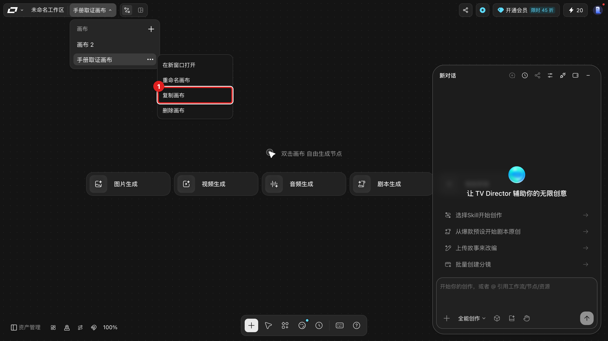

实测证据：提交后发出 `POST /api/canvas/project/update`，行名和顶栏标签同时更新。

### 名字不能清空

⭐⭐ 把行内输入框**清空后按 `Enter`，什么都不会发生** —— 实测**一个请求都没发出**，原来的名字**原样保留**。只敲空格也一样。

这和「新建画布」的行为**完全一致**（空名一律不提交），
说明这两件事用的是同一套校验。

> 💡 所以想「先把名字删掉回头再填」是做不到的 —— 必须一次给一个非空名字。

下面是操作前的基线，方便对照改名/复制/删除前后：

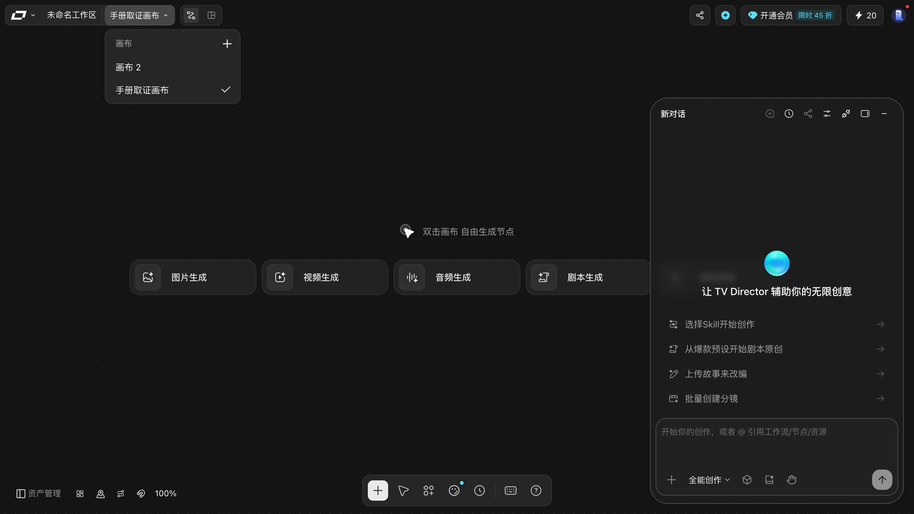

> **易错点**：行内输入框和顶栏的项目名输入框长得像，但改的是两个东西。改画布名**不会**改顶栏项目名。

## 第 5 步：复制画布

行级菜单 → 「**复制画布**」。

实测行为：

- 新画布命名为 `{原名}副本{序号}` —— 实测「手册取证画布」复制三次，得到
  `手册取证画布副本1` → `副本2` → `副本3`，序号**连续递增**；
- ⭐⭐ **插在源画布的「正上方」**（列表里紧挨着源画布，比它更靠前）——
  和「新建画布」一律插到**最前**不同；
- ⭐⭐ **复制完不会把你切到副本上** —— 地址栏 `projectId` 原地不动，顶栏还是原来那张。

> ⚠️ 本手册此前把副本位置写成「源画布的正下方」、把切换写成「自动切换到副本」，**两处都与实测相反**，已更正。

⭐ **序号是按「同名一族」递增的，而且会叠加**：再复制一张 `手册取证画布副本3`，
新副本叫 **`手册取证画布副本3副本1`** —— 直接在原名后接「副本1」，不做去重。
复制得越多，名字会越长。

### 复制是新旧并存，不是搬家

复制**只新增一张，原画布原封不动**（节点、内容都在）。所以它是安全实验的入口：

- 想大改一张画布 ⇒ 先复制，改坏了删副本，原画布不受影响；
- 想留一份长期备份 ⇒ 复制后**立刻把副本改名**，否则名字会越来越难认。

### 各操作到底切不切画布

这是最容易记混的一处，实测汇总：

| 操作 | 会切到新画布吗 |
|---|---|
| 新建 | ✅ 会 |
| 复制 | ⛔ **不会** |
| 删除（删的不是当前画布） | ⛔ 不会 |
| 删除（删的就是当前画布） | ✅ 切到另一张 |

## 第 6 步：删除画布

行级菜单 → 「**删除画布**」，会弹二次确认：

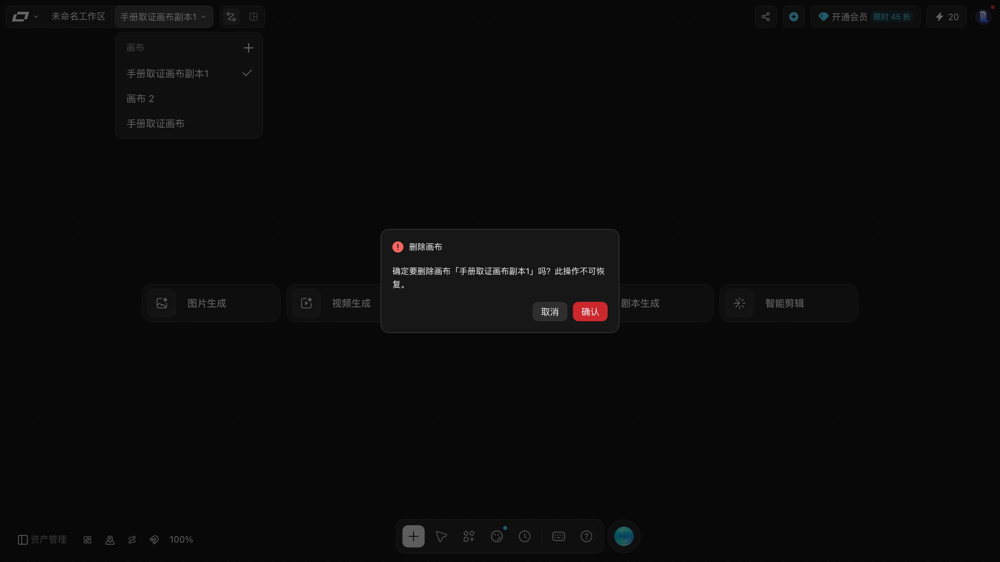

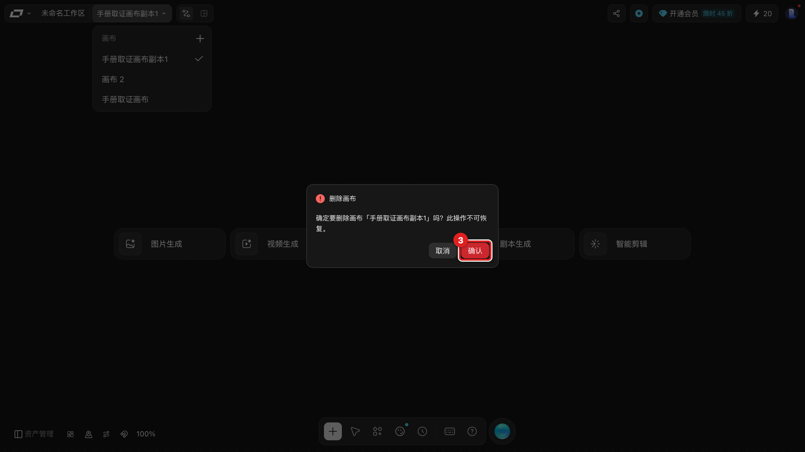

原文：

> **删除画布**
> 确定要删除画布「{画布名}」吗？此操作不可恢复。
> `取消` `确认`

Batch GA 连删 7 张时逐字复核过这四行文案，**完全一致**，而且确认框里会**逐字带上你要删的那张画布的名字** —— 这是核对「别删错」的唯一现场依据：

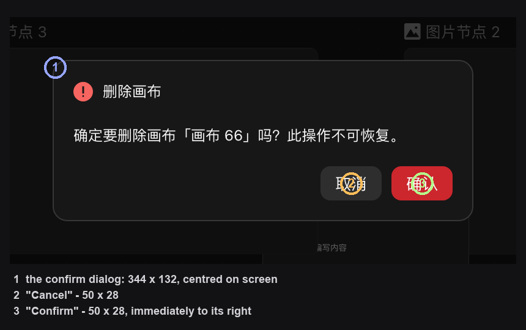

本批实测到的框与按钮尺寸（视口 1440×810）：

| 元素 | 位置与尺寸 |
|---|---|
| 确认框 | `[548, 339, 344, 132]` |
| `取消` | `[767, 426, 50, 28]` |
| `确认` | `[825, 426, 50, 28]` |

行菜单本身的位置是固定的：贴在「更多操作」按钮右侧，四项依次 `在新窗口打开` → `重命名画布` → `复制画布` → `删除画布`，每项 154×18、步进 36。

确认后：

- 该行从列表消失；
- **如果删的是当前正在编辑的画布，会自动切换到另一张**，`projectId` 随之改变；
- 顶栏项目名不受影响。

> ⚠️ 「此操作不可恢复」是界面原文。本手册**没有验证过**删除后能否从回收站找回画布（项目级回收站存在，但画布级未验证）。

> ⭐ **删非当前画布不会把你切走**：本批删的 7 张里，有 6 张都不是正在编辑的那张，每删一张地址栏的 `projectId` 都**原样不动**。

> ⚠️⭐⭐ 删错名字很容易被忽略：菜单是**贴着光标那一行**弹出来的，而面板一次只显示 6 行、翻滚时行会移动。**动手前先核对确认框里的画布名**——认名字比认位置可靠。

---

## 四项操作速查

| 操作 | 入口 | 命名规则 | 列表位置 | 自动切换 |
|---|---|---|---|---|
| 操作 | 入口 | 命名规则 | 列表位置 | 自动切换 |
|---|---|---|---|---|
| 新建 | 面板右上角加号 | **按你打的原样**（空则不建） | 最前 | ✅ |
| 切换 | 点行名 | — | — | ✅ |
| 重命名 | 行菜单 → 重命名画布 | 自定，**不能为空** | 原位 | — |
| 复制 | 行菜单 → 复制画布 | `{原名}副本{序号}`（会叠加） | 源画布正上方 | ⛔ 不切 |
| 删除 | 行菜单 → 删除画布 | — | 移除 | 仅删活动画布时回落 |

## 取消与恢复

- **后悔新建了**：直接删掉那张空画布（它一个节点都没有，删了不丢东西）。⭐ 注意**按 `Esc` 取消不掉**。
- **后悔删了**：本轮未验证画布级回收站。见 [../90-troubleshooting.md](../90-troubleshooting.md)。
- **后悔复制**：把副本删掉即可，源画布不受影响。
- **后悔重命名**：再改一次名，没有历史记录。

## 三条最容易踩的坑

| 坑 | 后果 | 怎么办 |
|---|---|---|
| ⭐ 按 `Esc` 或点画布想「取消」新建 | **画布已经建出来了** | 要真取消就把名字**留空**再离开 |
| ⭐ 以为画布名唯一 | 两张都叫 `999`，分不清 | 认 `projectId` 或画布内容 |
| ⭐ 下拉一次只显示 6 行 | 想删的那张不在眼前 | 先滚到它，删前核对确认框里的名字 |
| ⭐⭐ 以为复制完已经切过去了 | 还停在原画布上，改了半天 | 复制**不切换**；要切就自己点那一行 |
| ⭐ 反复复制同一个画布 | 名字叠成 `副本3副本1` | 复制后立刻给它起个正经名字 |

## 相关

- [enter-canvas.md](enter-canvas.md) · [organize-canvas.md](organize-canvas.md)
