# 整理画布：平移、缩放、整理、小地图

> 目标：节点多了也能一眼看清，找回看丢的东西。
> 适用角色：普通创作者 / 重度创作者 · 验证状态：✅ 实跑

---

## 缩放

### 三种方式

| 方式 | 操作 |
|---|---|
| 缩放菜单 | 点左下角的百分比（如 `100%`） |
| 键盘 | `⌘+` 放大 · `⌘-` 缩小 · `⌘0` 适合屏幕 |
| 菜单里直接给档位 | `缩放至50%` / `缩放至100%` / `缩放至800%` |

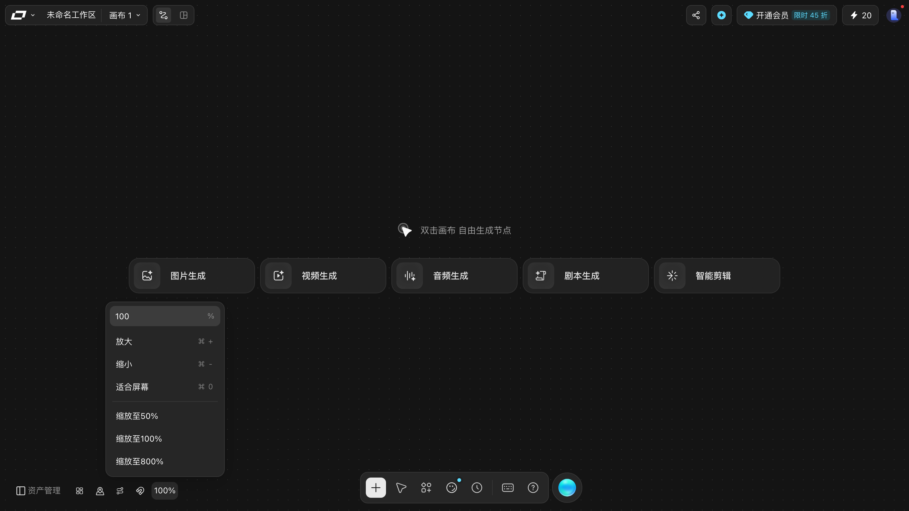

### 菜单里藏着一个可以敲数字的输入框

菜单最上面那一格**不是装饰**，是一个真的输入框（无障碍名「**缩放比例**」）。实测把 `200` 敲进去、按 `Enter`，左下角的标签立刻从 `100%` 变成 `200%`，画布同步放大：

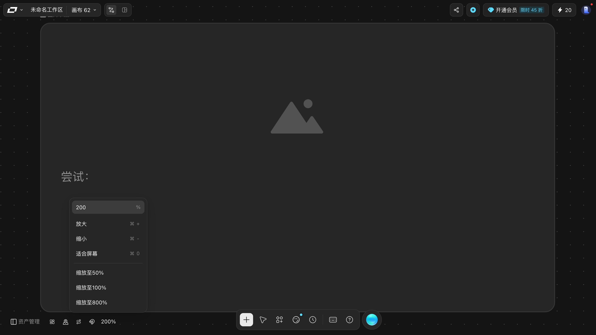

这是菜单里唯一能落到**任意比例**的入口 —— 下面三档预设只给 `50 / 100 / 800`。

> 输入框和左下角标签**双向同步**：在菜单里改完标签跟着变；用 `⌘+` / `⌘-` 改完之后再打开菜单，输入框里也是当前值。

### 三档预设逐个点过，都真的生效

「缩放至50/100/800%」不是摆设。本手册在同一张画布上按顺序点了三遍，逐次读画布容器的 `scale`：

| 点了哪一档 | 点之前 | 点之后 |
|---|---|---|
| 缩放至50% | `2.106`（`211%`） | `0.5`（`50%`） ✅ |
| 缩放至100% | `0.5`（`50%`） | `1`（`100%`） ✅ |
| 缩放至800% | `1`（`100%`） | `8`（`800%`） ✅ |

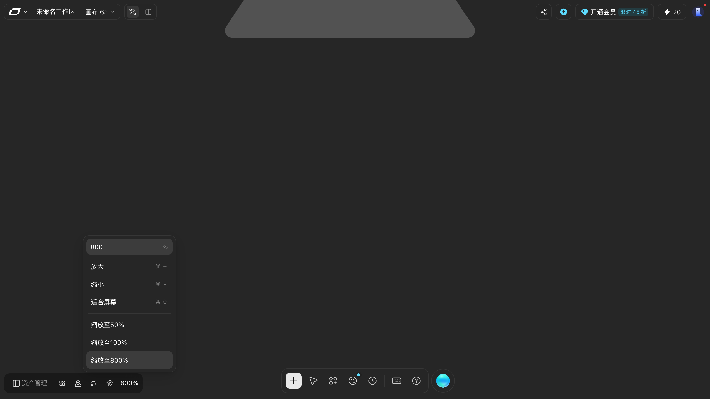

> 注意 `211%` 这种数字 —— 它是「适合屏幕」算出来的 `2.106` 四舍五入来的，**不是预设档位**。菜单里的预设只有 50 / 100 / 800 三档。

### 「适合屏幕」不是「回到 100%」

`⌘0`（菜单里叫**适合屏幕**）是把**所有节点框进当前视口**，不是重置缩放比。节点少的时候它会**放大到超过 100%**（本手册实测就出现过 `211%`），节点多的时候会缩得很小。

想要固定比例，用菜单顶部的输入框，或者 `缩放至50%` / `100%` / `800%`。

> 触摸板双指捏合也能缩放，无需按任何键。

### 缩放比例是**按画布记下来的**

调完缩放**关掉页面再回来，比例还在**。本手册这样验的：

| 步骤 | 左下角显示 |
|---|---|
| 起点 | `50%` |
| 菜单点「缩放至800%」 | `800%` |
| **刷新**一次 | `800%` |
| **再刷新**一次 | `800%` |

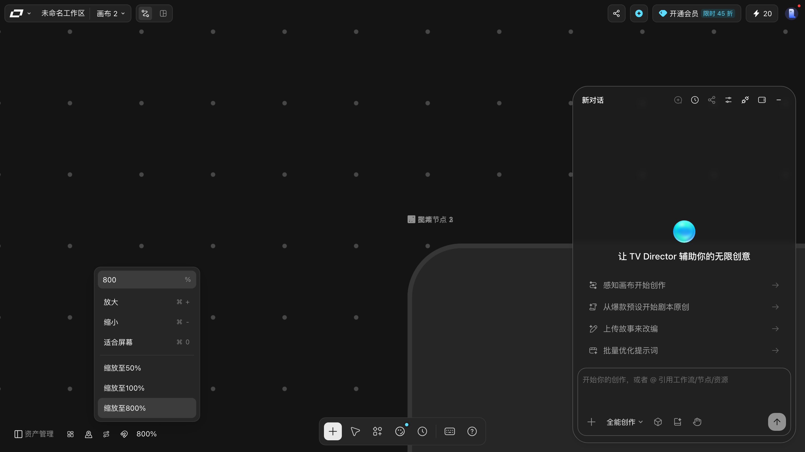

> **为什么刷新了两次？** 因为刷新一次只能证明「页面重新加载后还是这个值」，
> 分不清是**服务端记住了**还是**浏览器缓存里还留着上一次的状态**。
> 连着刷新两次还稳，才能说它是真的存下来了。
>
> 这也意味着：**换一张画布是另一个比例**。
> 你在一张画布上调到 800%，换到另一张会看到它自己的值。

### 菜单长什么样

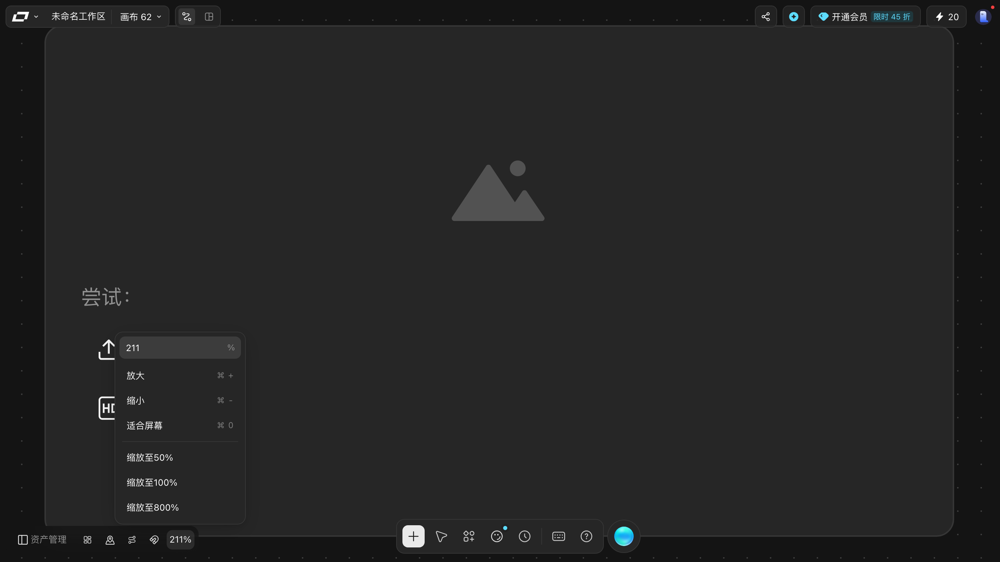

| 档位 | 快捷键 | 说明 |
|---|---|---|
| 顶部输入框 | — | 任意百分比，`Enter` 生效 |
| 放大 | `⌘+` | 逐档放大 |
| 缩小 | `⌘-` | 逐档缩小 |
| 适合屏幕 | `⌘0` | **框进所有节点**，不是重置 |
| 缩放至50% | — | 固定档 |
| 缩放至100% | — | 固定档 |
| 缩放至800% | — | 固定档 |

> 「放大 / 缩小」和三个固定档之间**有一条分隔线**，前三行是连续调节，后三行是跳档。

## 平移

> ### ⚠️ 空白处直接拖，画布是拖不动的
>
> 这是本页最容易踩空的一条。本手册用**同一段鼠标位移 `(+220, +120)`** 分别试了四种操作，
> 量出各自的「视口实际位移」：
>
> | 操作 | 视口实际位移 | 跟手吗 |
> |---|---|---|
> | 空白处**无修饰键**左键拖 | `(+16.3, 0)` | ❌ 基本等于拖不动，纵向完全没反应 |
> | `Space` + 左键拖 | `(+220, +120)` | ✅ 严格 1:1 |
> | 抓手工具（`H`）+ 左键拖 | `(+220, +120)` | ✅ 严格 1:1 |
> | **中键**拖 | `(+220, +120)` | ✅ 严格 1:1 |
>
> 「抓手工具按 `H` 切到抓手，然后左键拖空白」这句话在面板上是这么写的，但**更省事的是直接 `Space`**：
> 不用切工具、随时能松手回到选择状态，中键拖也是同等的 1:1 且完全不用管工具。
>
> 抓手工具唯一多出来的东西是**光标**会变成 `grab`，适合长时间拖着看大片区域时用。

---

## 平移

| 方式 | 操作 |
|---|---|
| **临时平移（最省事）** | 按住 `Space`，再左键拖空白 |
| 中键 | 按住滚轮拖动（不用切工具） |
| 抓手工具 | 按 `H` 切到抓手（左键拖；光标变 `grab`），再按 `V` 切回选择 |
| 滚动 | 鼠标滚轮 / 触摸板双指滚动 |

底部中央工具条上那枚按钮就是抓手工具：默认显示「**移动**」，按 `H` 之后变成「**抓手工具**」，按 `V` 又变回「移动」。

## 整理画布

`⌥` + `⇧` + `F`，或点底部工具条上那个「整理画布」按钮（按钮的悬浮提示里就写着这个键）。

> ### ⚠️ 整理完一定会问你一次
>
> 左下角弹出「**是否保留此次整理结果？**」，两个按钮 `还原` / `保留`。
>
> - 点「**保留**」→ 这次布局落盘，刷新后还在；
> - 点「还原」→ 回到整理前的位置。
>
> **这是「以为整理没生效」的头号原因** —— 不点「保留」，下次打开就白整理了。

## 其他三个底部开关

| 按钮 | 作用 |
|---|---|
| 切换小地图 | 显示/隐藏右下角缩略图，节点多时用它定位 |
| 隐藏节点连线 | 连线太密、互相压着时先关掉 |
| 网格吸附 | 拖动节点时是否自动对齐网格 |

三个都是**开关型**，再点一次恢复。

## 找到「我刚才建的那张节点在哪」

- 先按 `⌘0` 框住全部节点；
- 实在太多，再点「切换小地图」用缩略图找；
- 节点在视口外，直接按 `⌘F` 搜名字（见 [create-nodes.md](create-nodes.md)）。

### ⚠️ 「当前视窗没有节点」不是画布空了

用 `Space` 把视口拖远，会拖到**一个节点都看不见**。这时候画面底部中央会弹出一条提示：

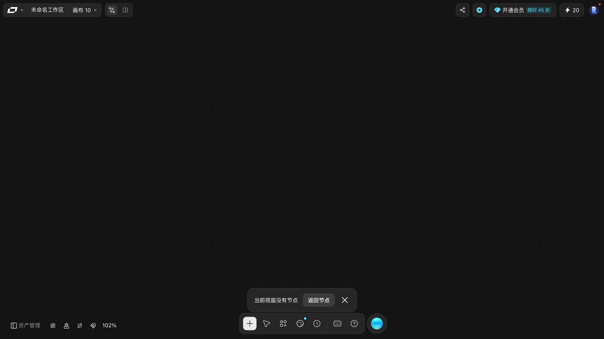

**这不是画布被清空了。** 本手册量过一次完整的轨迹 —— 按住 `Space` 每轮向右拖 420px（视口每轮精确位移 420）：

| 轮次 | 画布 DOM 里的节点数 | 提示 |
|---|---|---|
| 1 | 3 | 无 |
| 2 | 2 | 无 |
| 3 | 1 | 无 |
| 4 | **0** | **「当前视窗没有节点」出现** |

也就是说：**只有落在视口内的节点才被渲染进页面**，拖远了它们就从页面上消失了（所以此刻按 `⌘A` + `⌫` 是危险的 —— 你以为在删节点，其实什么都没选中）。

两个按钮：

- **`返回节点`** → 把视口飞回有节点的地方。实测点完之后节点重新回到页面（DOM 节点数 0 → 3），提示自动消失 ✅
- **`✕`** → 关掉提示，视口留在原地。

**结论：看到这个提示，点「返回节点」，不要刷新。**

---

## 小地图

左下角「切换小地图」打开。

实测尺寸 `150 × 110`，里面按比例画出画布上每个节点的位置，外加一个高亮框表示**当前视口**。节点多、视口又缩得很小时，用它一眼看出自己「在整张图的哪儿」。

> ### ⚠️ 小地图会盖住左下角工具条
>
> 小地图的实际渲染位置是**左下角**（`x≈145`），紧跟在左工具条后面 —— 尽管它的
> class 写的是 `bottom right`。打开之后，左工具条右侧的图标（**角色造型室**等）会被压住。
> 不用小地图时随手关掉。

---

## 资产管理：左抽屉

左下角「资产管理」打开一个**从左边滑出来的抽屉**，不遮画布，可以边看边改。

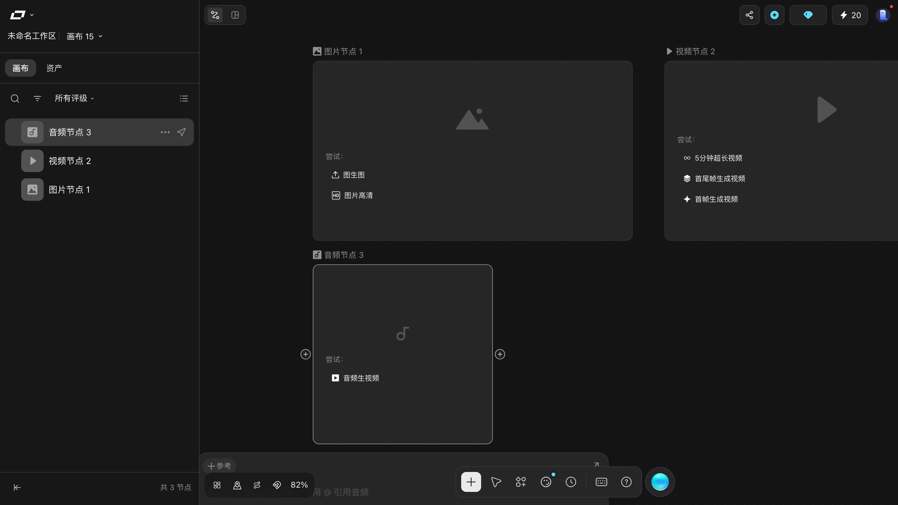

### 抽屉本体：320 宽，四层从上到下

抽屉从**左边**滑出，**320 宽 × 810 高**，不遮画布，可边看边改。
从上到下是四层：

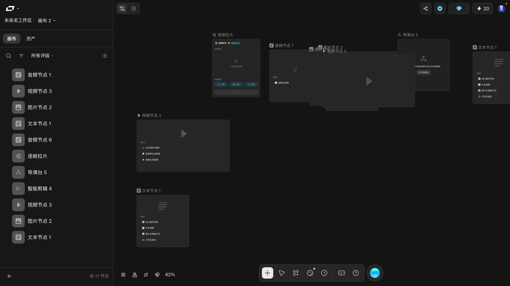

| 层 | 位置 | 内容 |
|---|---|---|
| **工作区栏** | `[12,48]`、`[99,44]` | `未命名工作区`（**可编辑的输入框**）· `画布 2`（按钮，切换画布） |
| **标签栏** | `[8,95]`、`[62,95]` | `画布` · `资产` 两个 tab，各 `50×28` |
| **工具行** | y≈142 / 146 | 见下（两个 tab 的工具行**不一样**） |
| **底部栏** | y≈766 | 左下 `收起节点侧栏`，右下 `共 N 节点` |

> 💡 **`未命名工作区` 是个能改的输入框**，`画布 2` 旁边的 `⌄` 是画布切换。
> 也就是说抽屉顶部这层管的是「**你在哪张画布上**」，不是节点列表本身。
>
> ⚠️ 本轮**没有改名、没有切画布**（改工作区名会写账户数据）。

> 💡 **节点可以重名，列表里会重复出现。**
> 上面这张图里 `视频节点 3` / `图片节点 2` / `文本节点 1` **各出现了两次**，
> 画布上确实有两张同名卡片 —— 列表 11 行与底部「共 11 节点」是对得上的。
> 后果是：看到重名时，光看名字**分不清是哪一张**，
> 得靠那一行的缩略图或点下去看落点 📖 本手册没验「定位到节点」碰到重名时选哪一个。

### 「画布」标签：四个筛选 / 视图控件

「画布」标签下的工具行从左到右是**四枚**控件，三枚是纯图标、只有一枚有文字：

| 控件 | 坐标 | `aria-label` | 悬停提示 | 实测 |
|---|---|---|---|---|
| 🔍 | `[8,142,32,32]` | `搜索节点` | `搜索节点` | 点开才出现输入框，**实时过滤** |
| ≔ | `[44,142,32,32]` | `筛选：全部` | `筛选：全部` | 按**节点类型**筛，当前档位写在 aria-label 里 |
| `所有评级 ▾` | `[80,142,80,32]` | `所有评级` | `所有评级` | 按**星级**筛 |
| ☰ | `[279,142,32,32]` | `展示设置` | `展示设置` | 列表 / 宫格切换 + 展开收起全部分组 |

> 💡 四枚按钮的**悬停提示和 `aria-label` 完全一致** ——
> 所以**悬停读到的名字可以直接当无障碍名用**，两边不打架。
>
> ⚠️ **「筛选：全部」和「所有评级」是两个独立的筛选器。**
> 前者筛**节点类型**，后者筛**星级**。它们挨在一起，很容易以为是一枚。

#### 🔍 搜索节点

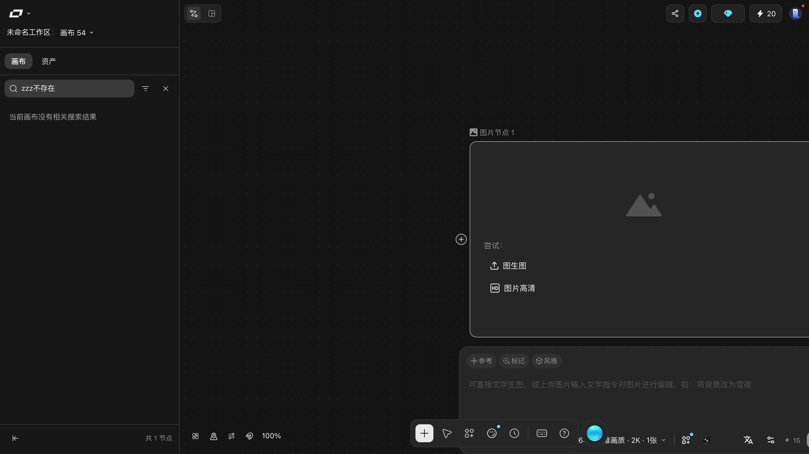

工具行上**平时没有搜索框**，点一下 🔍 才展开（`placeholder="搜索节点"`，
`aria-label="搜索画布元素"`）。**边打边筛，不用回车**：

| 输入 | 列表 |
|---|---|
| （空） | 全部节点 |
| `节点` | 只剩名字里带「节点」的 |
| `音频` | 只剩音频节点（画布上没有音频节点时**列表直接空掉**） |
| `zzz不存在` | 空 → 显示「**当前画布没有相关搜索结果**」 |

框子右边有筛选图标和 `×`，`×` 清空输入。

#### ≔ 按节点类型筛

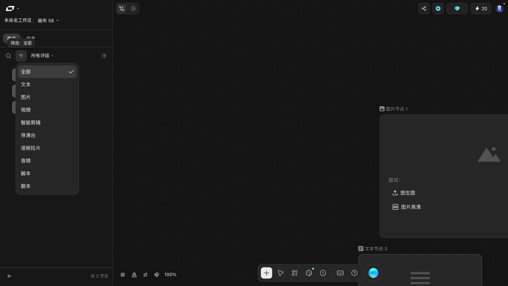

十个档位，和「添加节点」面板的九类节点对得上（多了「全部」）：

`全部` · `文本` · `图片` · `视频` · `智能剪辑` · `导演台` · `逐帧拉片` · `音频` · `脚本` · `剧本`

实测选「文本」：列表从 3 行收到 1 行（只剩文本节点），按钮的 `aria-label`
从 `筛选：全部` 变成 **`筛选：文本`**。

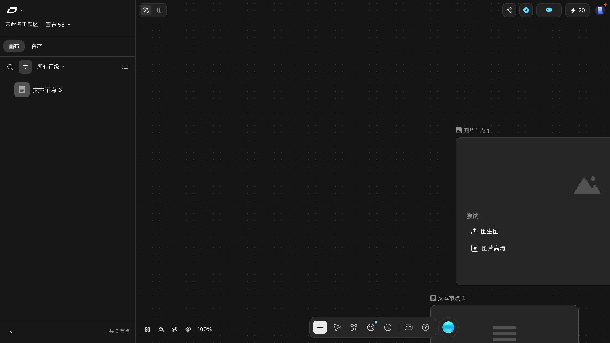

> 底部的「共 N 节点」数的是**整张画布**的节点，不跟着筛选走。
> 筛选后判断「我这张画布一共几个节点」，别拿它当准。

#### 所有评级：按星级筛

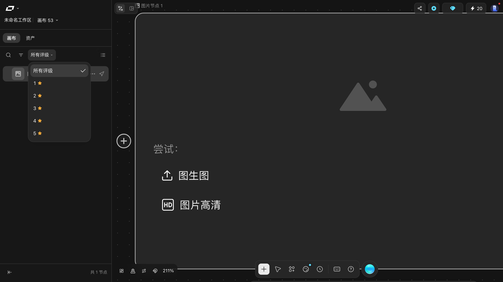

六档：`所有评级`（当前选中，带 ✓）· `1⭐` · `2⭐` · `3⭐` · `4⭐` · `5⭐`。

实测选「1」：列表从 1 行收到 0 行（这张测试画布上的节点没有星级）。
**节点上怎么打星级，本手册没测过** —— 评级大概来自生成历史或画布列表，那里没点过。

#### ☰ 展示设置：列表 / 宫格

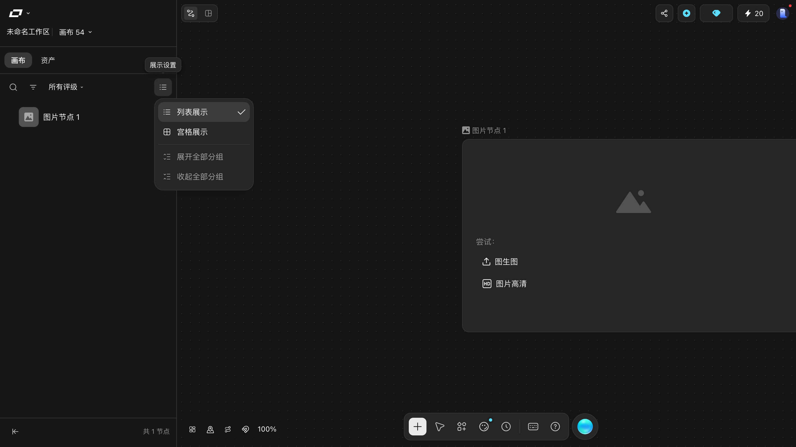

四项：

| 菜单项 | 实测 |
|---|---|
| `列表展示` | 默认态（带 ✓） |
| `宫格展示` | ✅ 实测：列表变成 **3 列宫格卡片**（`grid grid-cols-3 gap-0.5`），每张卡是「缩略图 + 节点名」；工具行那枚按钮的图标也从 ☰ 变成 ⊞ |
| `展开全部分组` | 📖 没测出差别，见下 |
| `收起全部分组` | 📖 同上 |

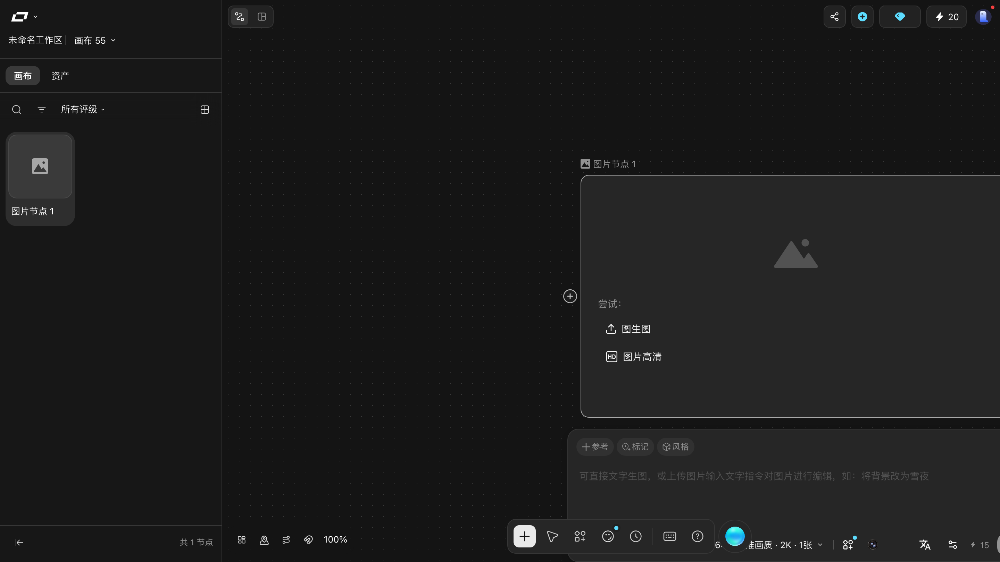

切回 `列表展示` 实测正常，行结构原样回来。

> **「展开/收起全部分组」这两项本手册没测出效果。**
> 菜单里确实有这两项、也确实能点（点完列表不变、没有报错），
> 但要看出差别得先在画布上**有组** ——
> 而这两轮建组都没成功（详见 [create-nodes.md](create-nodes.md) 的成组说明），
> 所以在**没有组**的画布上点它们，列表纹丝不动。
> 这不代表它们无效，只代表**本手册没验证**。

---

### 「画布」标签

列出这张画布上的**每一个节点**。每行的结构是「图标 + 节点名（可点）+ 行尾两枚 24×24 图标按钮」：

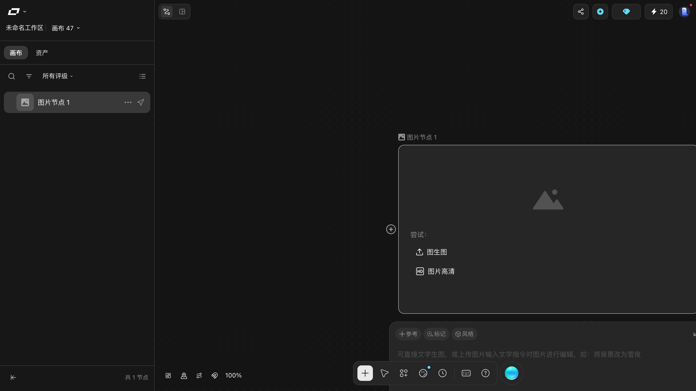

| 元素 | 作用 | 实测 |
|---|---|---|
| **节点名本身** | 点一下视口直接飞到那个节点 —— 它自己就带 `aria-label="定位到节点 {名}"` | ✅ 实测：把画布平移 −360px 让节点跑到左边，点它之后节点 `x` 从 `464` 回到 `569`，**视口确实被拉回去了** |
| `⋯`（`aria-label="更多操作"`） | 弹出四项菜单 | ✅ 菜单内容见下 |
| 纸飞机图标（`aria-label="定位到节点 {名}"`） | 和点节点名一样，也是定位 | ✅ |

> 两枚按钮都是**纯图标**，`innerText` 是空的，只能靠 `aria-label` 认。
> 节点名按钮和那枚纸飞机图标的 `aria-label` **完全一样**，所以从无障碍标签看不出区别 ——
> 但实测两处都能定位到节点。

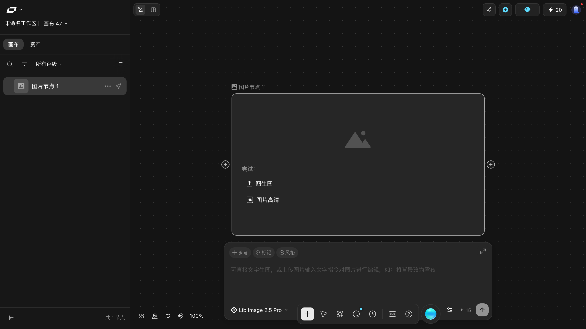

#### `⋯` 菜单里的四项

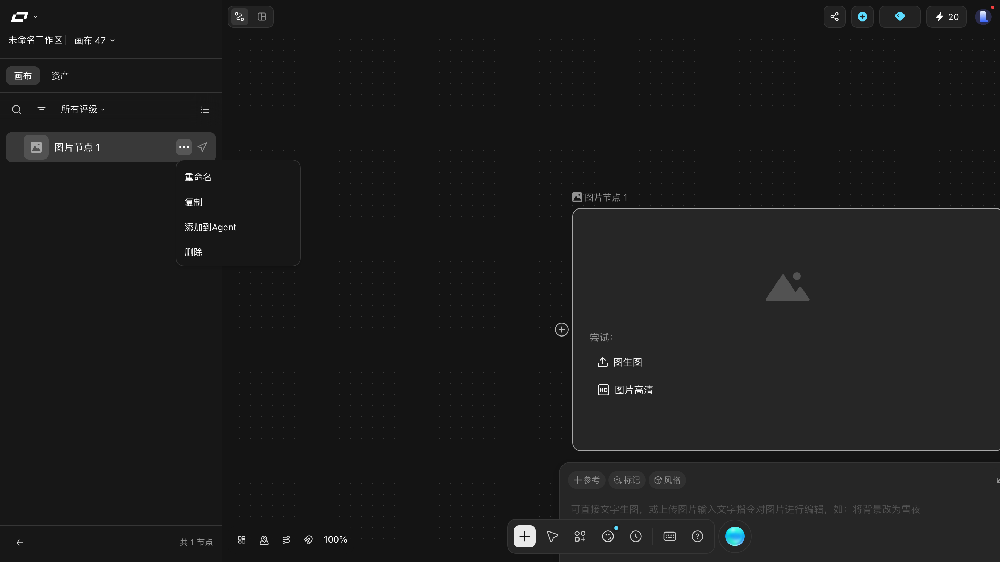

| 菜单项 | 做什么 | 实测 |
|---|---|---|
| `重命名` | 改节点名 | ✅ 抽屉那一行就地变成输入框，回车即生效，画布上同步 |
| `复制` | 复制这个节点 | ✅ 副本叫「`原名 - 副本`」，落在**原节点正下方** |
| `添加到Agent` | 把它交给 TV Director | ✅ 右侧滑出对话抽屉，节点以**附件**挂进输入框，**不自动发送** |
| `删除` | 删掉这个节点 | ⚠️ **立刻消失，没有二次确认，`⌘Z` 也撤不回来** |

> 菜单的 class 是 `mantine-Menu-dropdown`，锚在 `⋯` 按钮正下方。

##### 重命名：改的是抽屉里的那一行

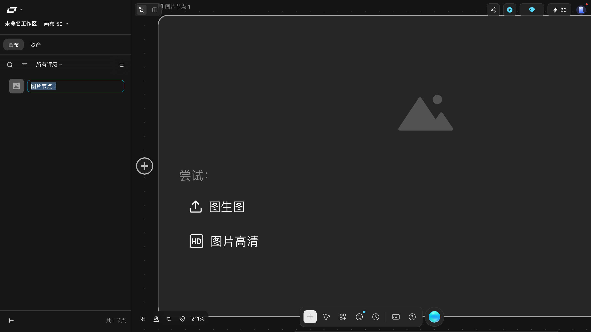

输入框长在**资产管理抽屉的行内**，不是画布节点上 —— 实测 `document.activeElement` 是那个
`aria-label="节点名称"` 的 `<input>`，沿祖先链往上第一个命中的就是抽屉容器，
画布节点里找不到任何输入框（节点卡片上**没有**同时冒出编辑框）。

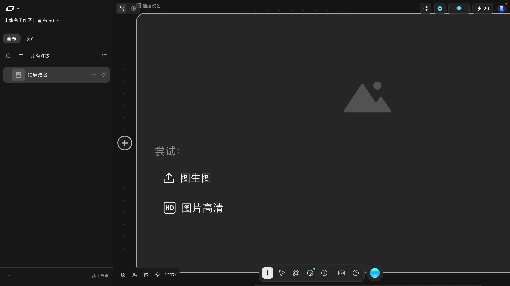

输入框是**自动聚焦**的，原名已经全选，直接打字覆盖、回车提交。两边同步更新，
**没有任何成功提示**。清空输入框再回车会怎样没有试过。

##### 复制：副本在原节点正下方

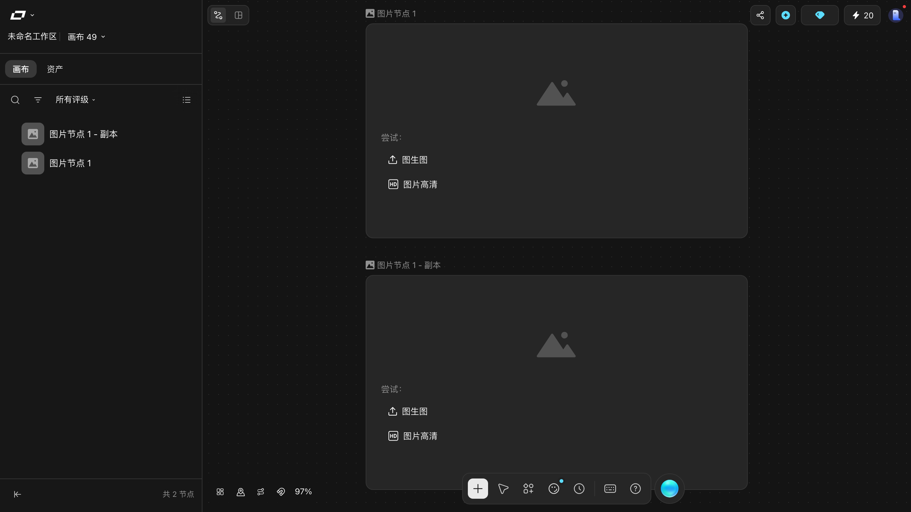

副本命名规则是「`原名 - 副本`」。

> ⚠️ **复制完可能「看不见」，别以为没成功。**
> 副本确实建出来了（资产管理列表立刻变成「共 2 节点」），但它落在原节点**下方**约一个身位。
> 如果你刚才用 `⌘0` 把画布放大到只装得下一个节点，副本就在视口外 ——
> 画布上一个节点都不会多。**按 `⌘0` 适应画布**就出来了。
> 实测：复制完立刻数 = 1 个，`⌘0` 之后 = 2 个，刷新页面 = 2 个。

> 这跟 `⌘D` 复制出来的副本是同一个命名规则（见 [create-nodes.md](create-nodes.md)）。

##### 添加到Agent：挂上去，不替你发

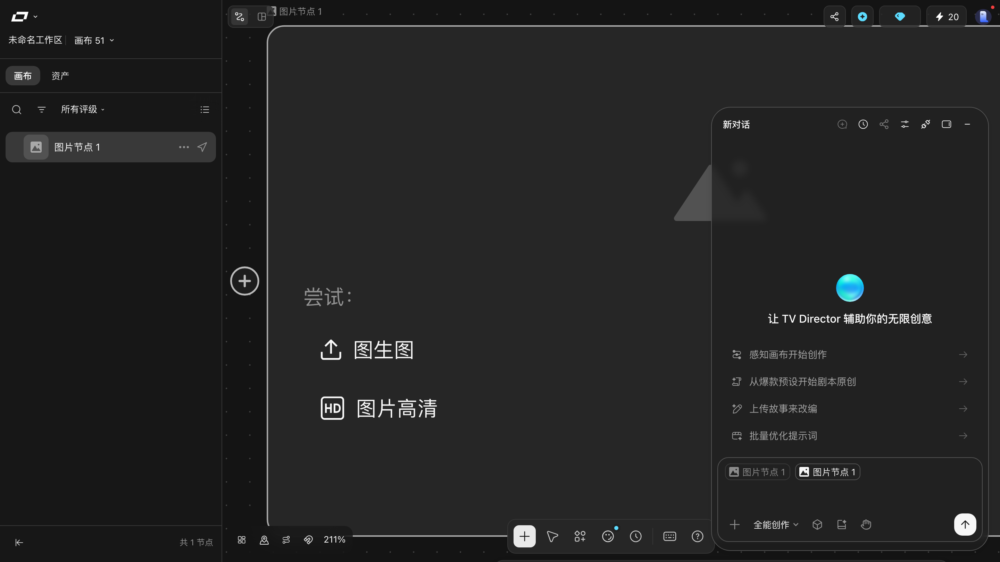

- 画布上**什么都没多出来**（点前 1 个节点，点后还是 1 个）。
- 右侧滑出一张 TV Director 对话抽屉（位置 `[1024,154]`、400×640），停在欢迎页。
- 节点是以**附件 chip** 的形式挂进输入框的，**不是正文文字**。
  正文编辑区里能读到的就是那几个 chip 的名字。
- **没有自动发送** —— 面板还停在欢迎页，消息列表是空的。发不发由你点右下角的 `Send` 决定。

> ⚠️ **实测会挂上两个一模一样的附件 chip。** 画布上只有 1 个节点、只点了 1 次「添加到Agent」，
> 输入区里却并排出现两枚文字完全相同的 chip（同一个 class、同样的 16px 高、DOM 上分辨不出差别）。
> 这个现象在两张不同的测试画布上各复现了一次。
> 手册**无法判断这两个 chip 各自代表什么** —— 如果介意多挂一个，
> 发送前先把不需要的那个处理掉。

抽屉底栏从左到右是：`添加附件` · `全能创作`（`title="选择创作模式"`）· `选择模型` · `Skill` ·
`手动生成` · `Send`。**只挂附件、没打字时 `Send` 就已经是可点态**（`disabled=false`）——
手别抖。面板顶部一排是：`当前已是新对话`（灰）· `历史对话` · `新对话无法分享`（灰）·
`TV Director 全局设置` · `LibTV Plugin` · `停靠到右侧` · `关闭`。

##### 删除：没有后悔药

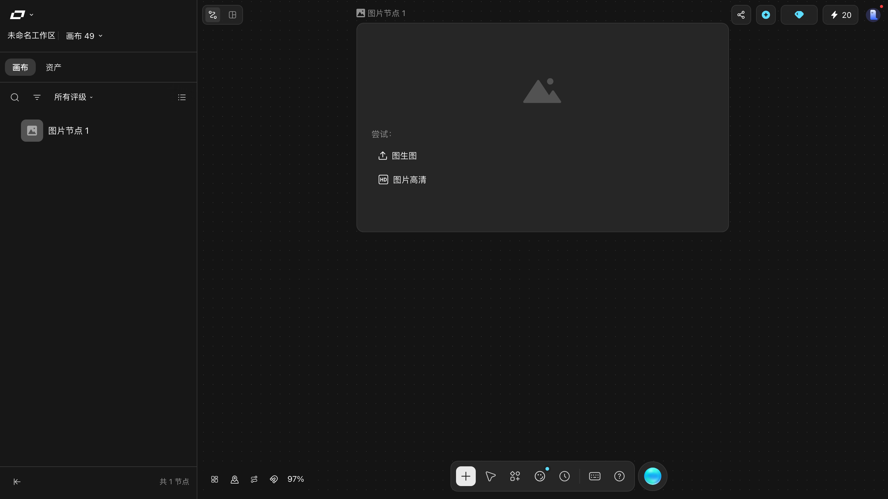

⚠️ **点下去就没了。** 实测数据：

| 检查项 | 结果 |
|---|---|
| 二次确认弹窗 | **没有** —— 点完 200 毫秒扫全屏，`role="dialog"` 的只有资产管理抽屉自己 |
| `⌘Z` 撤销 | **撤不回来** —— 焦点交回画布（`document.activeElement` 变成 `BODY`）后再按，画布仍是 0 个节点 |
| `⌘⇧Z` 重做 | 同上，没有变化 |
| 成功提示 | 无 |

> 和画布列表里的「删除画布」不同 —— **那一条是有二次确认的**（见 [manage-canvases.md](manage-canvases.md)）。
> 这里删的是**单个节点**，一步到位。
>
> **删之前先按 `⌘D` 复制一份**，或者用 `Option` + 拖动复制（见 [create-nodes.md](create-nodes.md)）。

##### 「全能创作」点开是 Skill 选择面板

「全能创作」不是固定模式，它是一个**下拉选择器**（`title="选择创作模式"`）。
点开后弹出 450×400 的 Skill 面板：顶栏 `+ 创建 ▾` 和 `全部`，标签页 `通用` / `收藏` / `我的`，
右上角「搜索 Skill」。默认「通用」页列出的条目（每条都带一个 `/命令名`）：

| Skill | `/` 命令 | 说明 |
|---|---|---|
| 皮克斯动画广告 | `/pixar-animated-ad-creator` | 从角色立绘、分镜草图到最终合成带广告歌的完整成片 |
| 爆款拉片复刻 | `/viral-video-replicator` | AI 拆解爆款视频，一键复刻同款 |
| 新中式美学TVC | `/neo-chinese-aesthetic-tvc` | 新中式美学全案：从妆造、布景到广告成片，一站式惊艳视觉 |
| 古典武侠电影全流程导演 | `/huijinquanwuxia` | 把模糊的武侠主题和灵感转化为视频生产方案 |
| 游戏实机PV | `/gameplay-pv-builder` | 自制多类游戏 PV，UI 像素锚定不形变，打造 3A 级游戏效果 |

> 这里只**打开**了面板、读了列表，**一条 Skill 都没选、没建** ——
> 选 Skill 会改对话的默认行为，新建 Skill 会写账户数据。

> **是比 `⌘F` 更好用的「按名字找节点」入口** —— 它是列表式的，一眼扫过去就知道有哪些节点；
> `⌘F` 要你记得名字才搜得到。底部实时显示「**共 N 节点**」。

> ⚠️ **底部的「共 N 节点」数的是整张画布，不跟着筛选走。**
> 用类型筛选把列表收到 1 行之后，它照样写着「共 3 节点」。
> 判断画布上一共几个节点，别拿这个数。

### 「资产」标签

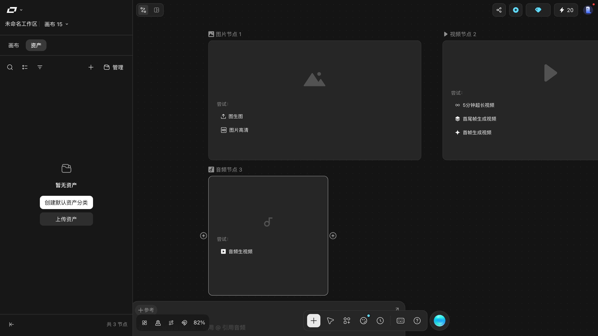

这一页管的是**素材分类**，不是节点。工具行是**五枚**纯图标，比「画布」标签多一枚：

| 控件 | 坐标 | `aria-label` | 悬停提示 | 实测 |
|---|---|---|---|---|
| 🔍 | `[8,146,32,32]` | `搜索` | `搜索` | 点开出现 `placeholder="搜索资产"` 的输入框 |
| ⊹ | `[44,146,32,32]` | `批量操作` | `批量操作` | 点开底部文案从「共 N 节点」变成「**已选择 0 项** 共 N 节点」 |
| ≔ | `[80,146,32,32]` | `筛选` | `筛选` | 打开筛选面板，见下 |
| `+` | `[203,146,32,32]` | `创建` | `创建` | 下拉两项：`新建文件夹` / `上传资产` |
| `📁 管理` | `[239,146,72,32]` | `资产管理` | （无） | ⚠️ 点开**没有浮层也没有可见变化**，见下 |

> 💡 两个 tab 的工具行**位置是对齐的**（都在 y≈142/146 那一行），
> 但**第一枚不同**：「画布」页是 `搜索节点`（80 宽的 `所有评级` 在第二、三格），
> 「资产」页是 `搜索` + `批量操作` + `筛选`。
> 第五枚 `管理` 是**全宽 72** 的那枚，不是 32 见方。

**空状态里直接摆两枚行动按钮**（本轮**未点**，会写账户数据）：

| 按钮 | 坐标 | 说明 |
|---|---|---|
| `创建默认资产分类` | `[96,472,128,32]` | 建六个预置标签分类 |
| `上传资产` | `[96,512,128,32]` | 从本地传文件 |

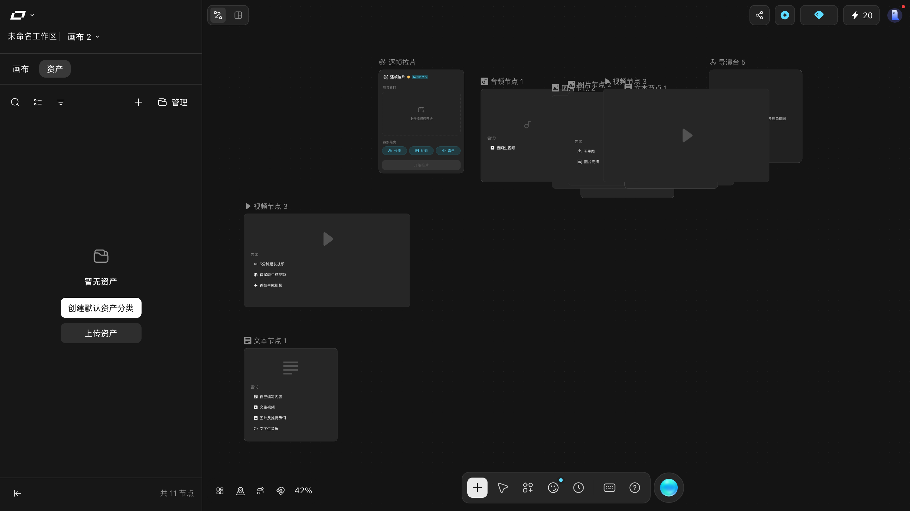

> ⚠️ 注意**底部那行「共 11 节点」在「资产」页也在** ——
> 它数的是**整张画布的节点**，跟当前 tab 无关。
> 所以在「资产」页看到「共 11 节点」，**不是**「有 11 个资产」。

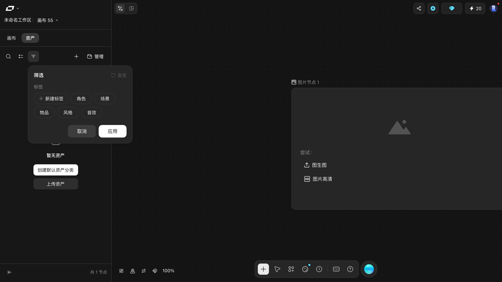

| 筛选面板里有什么 | 说明 |
|---|---|
| `重置` | 清掉当前筛选条件 |
| `标签` 分组 | 六个预置标签胶囊：`+ 新建标签` `角色` `场景` `物品` `风格` `音效` |
| `取消` / `应用` | 关掉面板 / 真正生效 |

> ⚠️ **`+ 新建标签` 和「应用」本手册都没点** —— 建标签写账户数据。
> 六个预置标签是 `创建默认资产分类` 建出来的分类，这一步也没点过。

#### 两处实测下来「点了没反应」的地方

- **`管理`（`aria-label="资产管理"`）**：点开**没有浮层、没有弹窗、抽屉文案一个字没变**。
  它可能需要先选中某个分类才有东西可管，但**本手册没有资产，无法验证**。
- **`批量操作`**：功能是进「勾选模式」——底部多出「**已选择 0 项**」。
  没有资产可勾，所以选不中任何东西。

> ⚠️ **创建分类和上传都会写入账户数据**，本手册**没有点过**
> `创建默认资产分类`、`上传资产`、`新建文件夹`、`+ 新建标签` 任何一个。
> 所以支持的格式、体积上限、标签能不能改名，都还不知道。

---

## 底部两条工具栏全清单

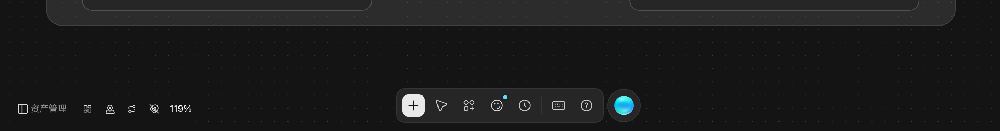

**底部中央（七键 + 一个圆钮）**

| 按钮 | `data-sidebar-btn` | 作用 |
|---|---|---|
| `+` 添加节点 | `add-node` | 打开「添加节点」面板 |
| 移动 / 抓手工具 | `tool-mode` | 按 `H` 在这两态之间切换 |
| 素材库 | `open-asset` | 打开素材库面板 |
| 角色造型室 | `character-library` | 打开角色造型室 |
| 生成历史 | `history` | 打开生成历史 |
| 快捷键 | `keyboard` | 打开快捷键面板 |
| 教程 | `contact` | ⚠️ 实为联系入口，点了没反应，见 [shortcuts.md](shortcuts.md) |
| TV Director（蓝圆钮） | `data-guide-target=agent-entry` | 打开 TV Director 抽屉 |

**底部左侧**

`资产管理` · `整理画布，Option+Shift+F` · `切换小地图` · `隐藏节点连线` · `网格吸附` · `缩放选项`（点它/点百分比打开缩放菜单）

---

## 取消与恢复

- 缩放乱了：`⌘0` 或菜单里的 `缩放至100%`。
- 整理后悔了：在确认条上点「还原」，或者整理前先复制一张画布（见 [manage-canvases.md](manage-canvases.md)）。

## 相关

- [manage-canvases.md](manage-canvases.md) · [connect-nodes.md](connect-nodes.md) · [shortcuts.md](shortcuts.md)
