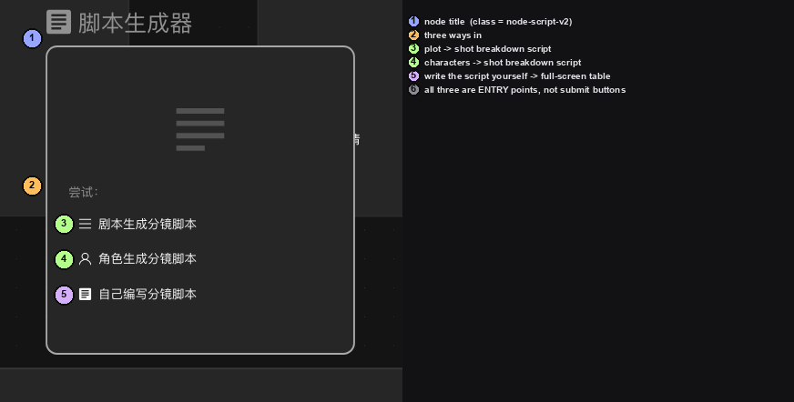
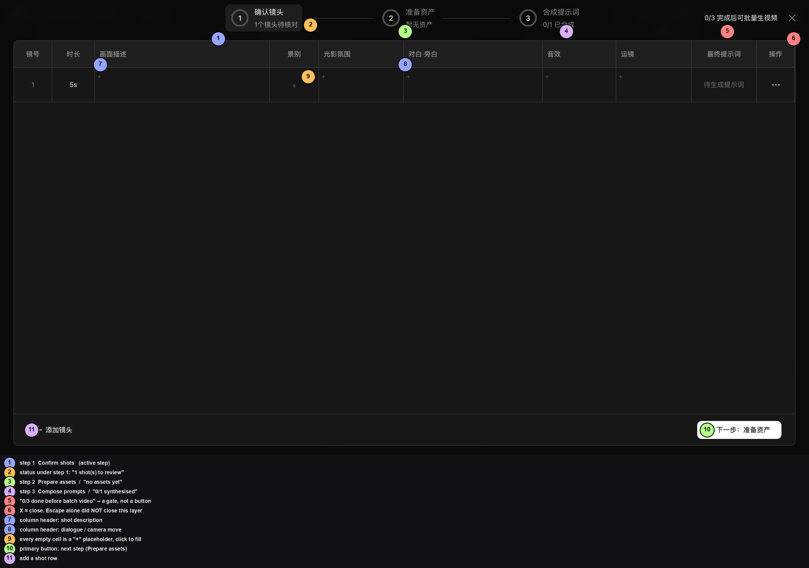

# 脚本节点：从「三个入口」到全屏分镜表

> 适用角色：想做分镜脚本的创作者 · 验证状态：✅ 三个入口的节点卡片全部实拍；
> ✅ **「自己编写分镜脚本」的全屏编辑器整个界面全部实拍**；⛔ **一次都没有点过任何会消耗积分的按钮**

这一页讲的是**画布上那个写着「脚本生成器」的节点**。

> ⭐⭐⭐ **先更正一条旧结论。**
> [创建节点](create-nodes.md)那一页过去写的是：`脚本` 那一行 ⚠️ **只展开子菜单，不建节点**。
> 实测**只对「脚本」这一行成立** —— 点它确实只是展开子菜单；
> 但子菜单里的 **`脚本 NEW` 真的能建出节点**，建出来的节点 class 是
> `react-flow__node-script-v2`，卡片标题是 **`脚本生成器`**。
> ⛔ 顺带更正另一句：`脚本（旧版）Beta` 那一项本轮**没点**，不知道它建不建得出东西。

---

## 一、怎么建出来

和别的节点一样，从底栏那个 **`+`（无障碍名「添加节点」）** 进：

1. 点底栏的 **`+`**；
2. 在面板里找到 **`脚本`** 这一行 —— 它右边带一个 **`›`**，
   这表示点它只会**展开子菜单**；
3. 子菜单里有两项：**`脚本 NEW`** 和 **`脚本（旧版）Beta`**；
4. 点 **`脚本 NEW`**，画布上就多出一张卡片，标题是 **`脚本生成器`**。

> ① 节点标题 `脚本生成器`，卡片左上角还有一个文档形状的图标。
> ② 「尝试：」是**这个节点的三个入口**，不是「推荐模板」——
> 点哪一个都会进入**下一步**，本身不消耗积分。
> ③④⑤ 三个入口，含义见下表。
> ⑥ ⭐ **三个都是「入口」，不是「提交」按钮。**
> 真正消耗积分的是点进去之后**各页面里的生成按钮**（见本文末尾的边界表）。

| 入口 | 界面上写的 | 点进去是 |
|---|---|---|
| ③ | `剧本生成分镜脚本` | 让产品按一段剧情描述生成分镜脚本 |
| ④ | `角色生成分镜脚本` | 先有角色，再由角色生成分镜脚本 |
| ⑤ | `自己编写分镜脚本` | ⭐ **打开全屏的分镜表编辑器**，自己在表里逐格填 |

> ⭐ 节点标题上**没有**角标 —— 与 `智能剪辑` 的 `Beta`、`逐帧拉片` 的 `SD 2.5` 不同。

---

## 二、⭐ 核心界面：全屏分镜表编辑器

点 **`自己编写分镜脚本`**，会打开一个**铺满整个窗口**的分镜表。
这是脚本节点最核心、也是本手册此前一个字都没写过的界面。

### 顶部：三步进度条

它不是普通的「上一步 / 下一步」，而是**固定的三步**，每一步都带自己的进度数字：

| | 步骤 | 下面那行小字 |
|---|---|---|
| ① | `确认镜头` | `1个镜头待核对`（本轮实测值） |
| ③ | `准备资产` | `暂无资产` |
| ④ | `合成提示词` | `0/1 已合成` |

⭐ **这三行数字的格式不一样，别混读**：

- ①② 是**计数**：`1个镜头待核对` = 有 1 个镜头还没被确认；
- ③ 是**状态**：`暂无资产`；
- ④ 是**分数**：`0/1 已合成` = 要合成的 1 条里，已合成 0 条。

### 右上角：批量生视频的门槛

- ⑤ `0/3 完成后可批量生视频` —— ⭐ **这是一句话，不是按钮**。
  它在告诉你：**满 3 条**才允许「批量生视频」。
- ⑥ 旁边的 `×` 是**唯一**的关闭入口。
  ⛔⚠️ **按 `Esc` 关不掉这一层**（本轮实测：按了 `Esc`，独占文案没消失，
  界面原样留在那儿）。必须点那个 `×`。

### 中间：十列表格

| 列头 | 是什么 |
|---|---|
| `镜号` | 第几个镜头，本轮是 `1` |
| `时长` | 本轮是 `5s` |
| `画面描述` | 这一格画什么 |
| `景别` | 远景 / 全景 / 近景 …… |
| `光影氛围` | 光线和气氛 |
| `对白·旁白` | 这一镜的台词或旁白 |
| `音效` | 环境音 / 音效 |
| `运镜` | 镜头怎么动 |
| `最终提示词` | ⭐ 由前面几格**合成**出来的结果 |
| `操作` | 那一行的更多动作（`⋯`） |

- ⑦⑧ 列头是同一层的字段，两两成对（`画面描述` / `景别` …）。
- ⑨ **每个空格都显示一个 `+`** —— 那是「点我开始填」的占位符，
  ⛔ 不是「加一列」的意思。
- 第一行的 `最终提示词` 格里写的是 **`待生成提示词`** ——
  也就是说**这一格不是你手填的，是点「合成提示词」之后由产品算出来的**。

### 底部

- ⑪ `＋ 添加镜头` —— 加一行镜头。
  ⛔ 本轮**没点**（点了会多一行，撤不干净）。
- ⑩ **`→ 下一步：准备资产`** —— 白底主按钮，跳到第 ② 步。
  ⛔ 本轮**没点**（下一步要去给角色/场景/道具准备形象图，是要花积分的）。

---

## 三、这张表一次坐实了 20 条文案

站点内部有一张文案表（8189 条），其中 `scriptV2*` 这一族**共 93 条**，
在本手册写下这一页之前，**手册正文一次都没出现过它们中的任何一个**。
这一张界面图就把其中 20 条对上了：

| 界面上的字 | 对应的内部文案 key |
|---|---|
| `确认镜头` | `scriptV2StageProgressConfirm` |
| `准备资产` | `scriptV2StageProgressText7176dc` |
| `合成提示词` | `scriptV2StageProgressPrompt` |
| `1个镜头待核对` | `scriptV2StagesShotsPending` |
| `暂无资产` | `scriptV2StagesEmpty` |
| `0/1 已合成` | `scriptV2StagesPromptsSynthesized` |
| `0/3 完成后可批量生视频` | `scriptV2FullscreenBatchVideoHint` |
| `关闭(ESC)` | `scriptV2FullscreenChromeClose` |
| `剧本生成分镜脚本` | `scriptV2NodeScriptStoryboardGenerate` |
| `描述剧情片段、故事，为你生成分镜脚本` | `scriptV2GeneratorScriptStoryboardGenerate` |
| `重新生成` | `scriptV2FloatingToolbarRegenerate` |
| `批量生成分镜` | `scriptV2FloatingToolbarGenerateStoryboard` |
| `批量生视频` | `scriptV2FloatingToolbarBatchVideo` |
| `下载` | `scriptV2FloatingToolbarDownload` |
| `参考图` | `scriptV2ReferenceLabel` |
| `→ 下一步：准备资产` | `scriptV2NextStepPrepareAssets` |
| `打开脚本节点 →` | `scriptV2StageOpenScriptNode` |
| `点击编辑画面描述` / `点击选择景别` / `点击编辑光影氛围` / `点击编辑对白·旁白` | `scriptV2Stages*` 系列 |
| `脚本 V2 1` | `scriptV2DefaultName`（默认名）+ 一个数字 |

> ⭐⭐ **这说明一件事**：文案表里的 key 前缀 **确实对应界面**，
> 不全是僵尸 key —— 前提是**先找到那个界面**。
> 完整对照见 [../20-reference.md](../20-reference.md#_4-画布整张文案表-手册没写、但产品做过的功能)。

---

## 四、⛔ 本手册没做、也不该替你做的事

打开编辑器本身是免费的（它只建了一个空表，**没有提交任何生成**）。
但界面里下列动作**会消耗积分或需要你本人授权**，
本手册一律**不代做**，你请自己在确认价格后操作：

| 动作 | 后果 |
|---|---|
| `重新生成` / `剧本生成分镜脚本` / `角色生成分镜脚本` | 调模型生成，**消耗积分** |
| `批量生成分镜` | 同上，而且是**批量** |
| `批量生视频` | 生成视频，价格最高 |
| `合成提示词` 之后生成 | 先生成资产图，再合成视频 |
| `下载` | 无消耗，但会把内容存到本地 |

> 💡 界面自己也提示过这件事：进编辑器前会弹
> **`开始批量生成前，请先完成：`**，逐条列出前置条件
> （至少 1 条镜头有画面内容 / 为角色场景道具准备形象图 / 每镜生成分镜与视频运动提示词 /
> 至少保留 1 个镜头 / 切换到支持「首帧生视频」的视频模型）。
> ⭐ 最后一条尤其值得注意 —— **模型不支持首帧生视频，「批量生视频」就不会亮**。

---

## 五、📖 还没验的

- ⛔ `剧本生成分镜脚本` / `角色生成分镜脚本` 两个入口**点下去是什么界面** —— 本轮没点。
- ⛔ 表格里那些 `+` 点下去是什么控件（单选？下拉？自由输入？）—— 本轮没点。
- ⛔ 「景别」「光影氛围」「运镜」各自有哪些**可选项** —— 本轮没点。
- ⛔ `重新生成` 那条弹窗：文案表里写着
  `重新生成会覆盖当前脚本内容及最终提示词，是否继续？`，
  ⛔ 没点，所以这句**只在文案表里，没在界面上见过**。
- 📖 节点标题上那个**数字**（本轮读到 `脚本 V2 1`）是什么，
  📖 与画布上其它节点标题里的数字（`视频节点 3` / `智能剪辑 4` / `导演台 5`）
  是不是同一套编号，本轮**没验**。
  ⭐ 已经排除的一种解释：**不是同名节点的实例序号** ——
  画布上两个 `音频节点` 都写着 `1`，两个 `图片节点` 都写着 `2`。

---

## 相关页

- [创建节点](create-nodes.md) —— 九类节点总览与它们各自的参数条
- [连接节点](connect-nodes.md) —— 把视频连进智能剪辑、把资产连进脚本节点
- [生成媒体](generate-media.md) —— 各类生成的按钮在哪、价格怎么算
- [../20-reference.md](../20-reference.md) —— 站点文案表里另外 77 条 `scriptV2*` 文案
