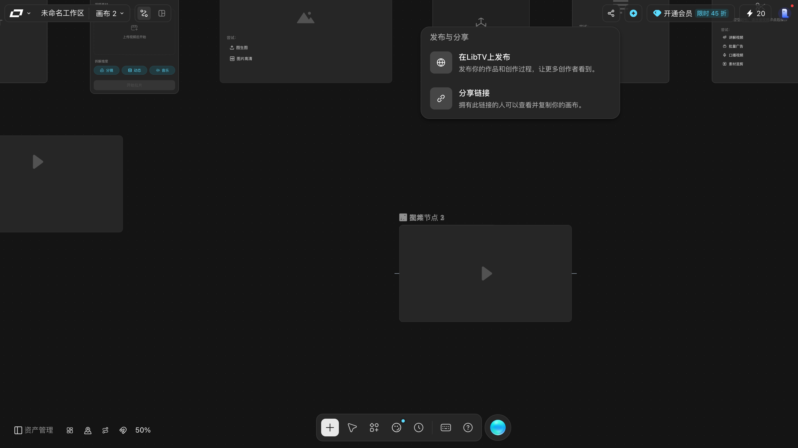

# 发布与分享

> 目标：知道「发布与分享」里**确切**有什么，以及哪些操作本手册没有替你试。
> 适用角色：普通创作者 · 验证状态：🔍 **面板逐控件读过了，四个按钮一个都没点**

## ⚠️ 先读这一段

「在LibTV上发布」会让作品**对外可见**，「分享链接」会让**拿到链接的人能访问你的画布**。这两件事都不可逆，所以：

> **本手册只打开了面板、读了每一枚按钮的文案，没有点过其中任何一枚。**
> 下面关于「点下去会发生什么」的部分，都是按界面措辞推断的，标了 📖。

---

## 打开面板

点顶栏右上角那枚**分享图标**（`32×32`，无障碍名就是「**发布与分享**」，图标本身没有文字）。

它是个**小浮层**，不是居中弹窗：实测 `360×167`，挂在触发按钮下方，画布**照常可见、照常能点**。

## 面板里实测到的全部内容

就这些 —— **两枚按钮，没有任何别的东西**：

| 按钮 | 说明文字 | 实测 |
|---|---|---|
| 🌐 **在LibTV上发布** | 发布你的作品和创作过程，让更多创作者看到。 | 整行卡片 `342×57`，**可点**（非灰态） |
| 🔗 **分享链接** | 拥有此链接的人可以查看并复制你的画布。 | 整行卡片 `342×57`，**可点**（非灰态） |

本手册在这个面板里做过一次完整清点：

- 按钮 —— **只有 2 枚**，就是上面两枚，`opacity: 1`，**都不是灰的**；
- 输入框 —— **0 个**（**没有**链接输入框、**没有**「复制链接」按钮）；
- 链接 / 标签页 / 复选框 / 开关 —— **各 0 个**。

也就是说，**这个面板只负责「跳转到别处」**。真正的发布表单和真正的链接，都不在这一层里，点下去会带到别的地方去（📖 推断，本轮没点）。

> **两枚按钮的鼠标悬停提示都是「按 ESC 退出」** —— 但这句话**不成立**，见下。

## ⚠️ 按 `Esc` 关不掉它，只能再点一次那枚图标

面板自己提示「按 ESC 退出」，但实测**按了没用**：

| 操作 | 面板 | 地址栏 `projectId` | 画布节点数 |
|---|---|---|---|
| 点图标打开 | 出现 | `34226ef1…` | `10` |
| 按 `Esc` | **纹丝不动** | `34226ef1…` | `10` |
| **再点一次那枚图标** | 关闭 | `34226ef1…` | `10` |

好消息是 `Esc` **什么也没改**（URL、节点数都没动），所以按错了不会有损失。

**关它的正确办法是再点一次顶栏那枚「发布与分享」图标** —— 它是个开关。

## 怎么理解这两个按钮

| 区域 | 含义 | 风险 |
|---|---|---|
| 在LibTV上发布 | 把作品挂到 LibTV 的公开内容流里 | 作品对外可见 |
| 分享链接 | 生成一个 URL | **拿到链接的人可以查看并复制你的画布** |

「复制你的画布」这句话值得划重点 —— 链接不只是只读预览。**发之前想清楚这一点。**

---

## 分享前请自己确认的三件事 📖

以下为按界面措辞推断，本轮未验证：

1. **画布里有没有不该公开的东西** —— 私有素材、未完成的草稿、别人的东西；
2. **链接会不会外流** —— 群发到群里之后基本等于公开；
3. **要不要设有效期** —— 这一层面板里**没有**有效期设置（实测输入框 0 个），但它会跳去别处，📖 那里可能有。

## 想撤销怎么办

📖 本轮**没有验证**发布后如何撤回、链接能否失效。面板里**没有**任何撤回或失效入口（清点过：0 个输入框、0 个链接、0 个开关）。如果你要发布重要内容，建议先自己发一条测试内容试一遍撤回流程。

---

## 另一条路：「在新窗口打开」

行菜单里的「**在新窗口打开**」（见 [manage-canvases.md](manage-canvases.md)）本轮也实按了：

实测行为：

- **真的开一个新标签页**（页签数 `1 → 2`），**不是**当前页跳转；
- 新标签页的 `projectId` 变成**那一行画布自己的** id，不是当前这张的；
- 浏览器标签标题变成 `画布 63 - LibTV - 专业视频创作工具`；
- **原来那个标签页完全没动** —— URL 不变、画布内容不变、节点数不变。

> 也就是说：想同时开着两张画布对照着看，用这一项最省事。

---

## 相关

- [manage-canvases.md](manage-canvases.md) —— 行菜单四项的完整说明
- [agent-director.md](agent-director.md) —— TV Director 抽屉里也有一个分享入口（当前灰态）
- [../90-troubleshooting.md](../90-troubleshooting.md) —— 找不到刚才发出去的东西怎么办
