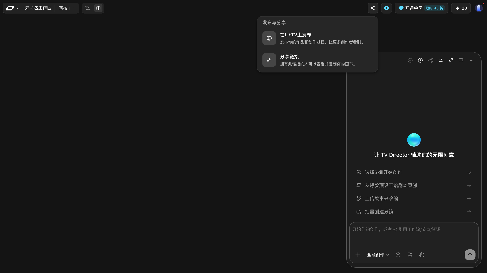

# 发布与分享

> 目标：知道「发布与分享」里有什么，以及哪些操作本手册没有替你试。
> 适用角色：普通创作者 · 验证状态：⚠️ **只读了面板，点过的一切都没点**

## ⚠️ 先读这一段

「发布」会让作品**对外可见**，「分享链接」会让**拿到链接的人能访问你的画布**。这两件事都不可逆，所以：

> **本手册只打开了面板、读了文案，没有点发布、没有生成链接、没有分享给任何人。**
> 下面关于「点下去会发生什么」的部分，都是按界面措辞推断的，标了 📖。

---

## 打开面板

点顶栏右上角的「**发布与分享**」。

## 面板里实测到的文案

**发布区**

> 发布你的作品和创作过程，让更多创作者看到。

**分享链接区**

> 分享链接
> 拥有此链接的人可以查看并复制你的画布。

## 怎么理解

| 区域 | 含义 | 风险 |
|---|---|---|
| 发布 | 把作品挂到 LibTV 的公开内容流里 | 作品对外可见 |
| 分享链接 | 生成一个 URL | **拿到链接的人可以查看并复制你的画布** |

「复制你的画布」这句话值得划重点 —— 链接不只是只读预览。

---

## 分享前请自己确认的三件事 📖

以下为按界面措辞推断，本轮未验证：

1. **画布里有没有不该公开的东西** —— 私有素材、未完成的草稿、别人的东西；
2. **链接会不会外流** —— 群发到群里之后基本等于公开；
3. **要不要设有效期** —— 面板上没看到有效期设置选项（📖 推断，可能藏在别处）。

## 想撤销怎么办

📖 本轮**没有验证**发布后如何撤回、链接能否失效。面板里没看到对应的入口。如果你要发布重要内容，建议先自己发一条测试内容试一遍撤回流程。

---

## 相关

- [agent-director.md](agent-director.md) —— 头图上那个分享按钮在抽屉里也有一个
- [../90-troubleshooting.md](../90-troubleshooting.md) —— 找不到刚才发出去的东西怎么办
