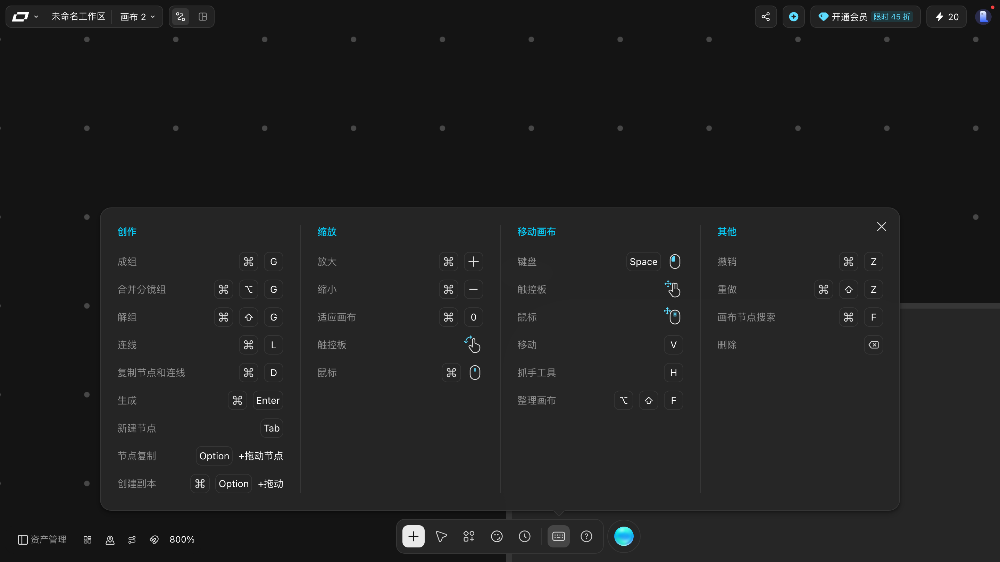
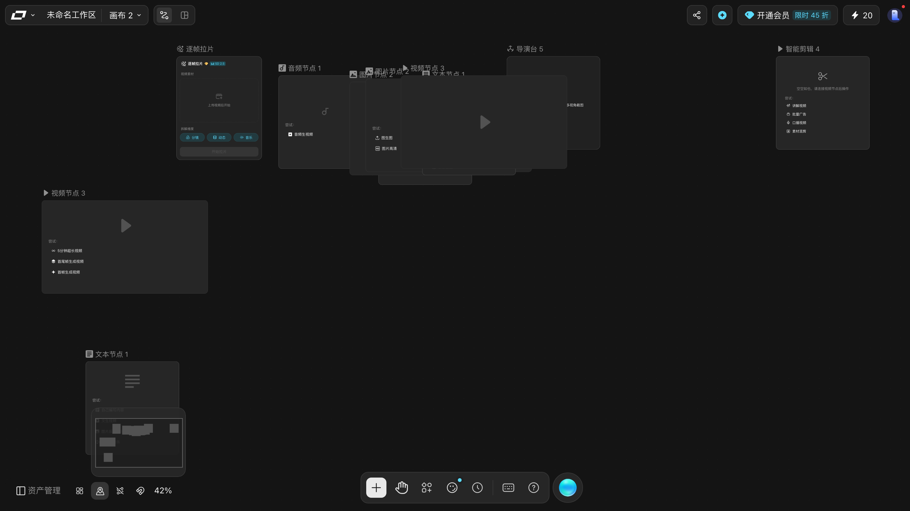
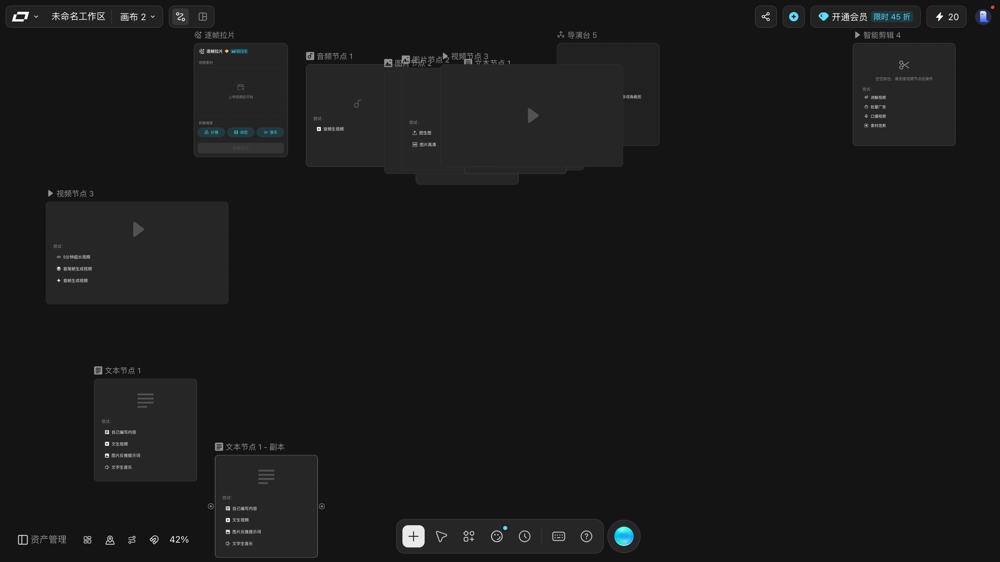

# 快捷键

> 目标：知道四组快捷键分别管什么，以及哪些是本手册真的按过验证的。
> 适用角色：普通创作者 · 验证状态：面板原文 ✅；**除「生成」外全部实按** ✅

## 打开

底部工具条的「**快捷键**」（键盘图标，无障碍名就叫「快捷键」）。
面板**锚在底栏那枚按钮正上方**，居中 `1152×437`，分**四列**。

> 💡 判断面板开没开最快的办法：**底栏那枚「快捷键」按钮会变成高亮态**，
> 面板下方还会多出一个指向它的小三角。

> 面板是 **macOS 键位**。Windows 上 `⌘` → `Ctrl`，`⌥` → `Alt`，`⇧` → `Shift`。

> ⚠️ **有三处读不到文字，认的时候别以为是自己没找到**：
> 「**删除**」的键帽画的是一枚 **⌫ 退格图标**，没有文字；
> 「缩放 → 触控板」画的是**捏合手势图标**；
> 「移动画布 → 触控板 / 鼠标」画的是**带 ✥ 符号的图标**。
> 读 `innerText` 时这三行会少掉键位，只剩下动作名。

---

## 创作

| 动作 | 键 |
|---|---|
| 成组 | `⌘G` |
| 合并分镜组 | `⌘⌥G` |
| 解组 | `⌘⇧G` |
| 连线 | `⌘L` |
| 复制节点和连线 | `⌘D` |
| 生成 | `⌘Enter` |
| 新建节点 | `Tab`（**没有 ⌘ 前缀**） |
| 节点复制 | `Option` + 拖动节点（**没有 ⌘ 前缀**） |
| 创建副本 | `⌘` `Option` + 拖动 |

## 缩放

| 动作 | 键 |
|---|---|
| 放大 | `⌘ +` |
| 缩小 | `⌘ -` |
| 适应画布 | `⌘ 0` |
| 触控板 | 捏合手势（**不用按任何键**） |
| 鼠标 | `⌘` + 滚轮 |

## 移动画布

| 动作 | 键 |
|---|---|
| 移动画布 · 键盘 | `Space` + 鼠标左键拖 |
| 移动画布 · 触控板 | 双指平移 |
| 移动画布 · 鼠标 | 滚轮下拖 / 中键拖 |
| **移动**（选择工具） | `V` |
| **抓手工具** | `H` |
| 整理画布 | `⌥ ⇧ F` |

> 「整理画布」在面板上是**第三列的最后一行**，不单独成组 —— 别以为漏了。

## 其他

| 动作 | 键 |
|---|---|
| 撤销 | `⌘Z` |
| 重做 | `⌘⇧Z` |
| 画布节点搜索 | `⌘F` |
| 删除 | `⌫` |

---

## ✅ 实按验证过的

面板上的键位除「生成」外，本手册**逐条实按过**，每一行都有前后读数：

| 键 | 实测行为（括号里是读数） |
|---|---|
| `Shift` + 左键拖 | 框选。拖出的矩形**完整包住**的节点全部选中（选中 2 / 共 2） |
| `⌘L` | 把选中的节点连起来（连线数 0 → 1） |
| `⌘G` | 成组（组元素 0 → 1，组节点名为「Group 1」，节点总数 2 → 3） |
| `⌘⇧G` | 解组（组元素 1 → 0，节点总数 3 → 2） |
| `⌘D` | 复制节点和连线（节点数 3 → 4） |
| `⌘Z` | 撤销（节点数 4 → 3） |
| `⌘⇧Z` | 重做（节点数 3 → 4） |
| `Option` + 拖动节点 | 节点复制（节点数 4 → 5），副本自动命名「**原名 - 副本**」 |
| `Tab` | 在画布上弹出「添加节点」面板（**只开菜单，不直接建节点**） |
| `⌘F` | 画布节点搜索：输入框占位「搜索画布元素」，边打边筛，底部显示「共 N 节点」 |
| `V` / `H` | 底部中央工具条第二枚按钮切换 —— 但**两个键是不对称的**，见下方更正 |
| `⌘0` | 框住所有节点（**不是**重置到 100%） |
| `⌘+` / `⌘-` | 缩放生效，缩放菜单里的百分比同步变化 |
| `⌥⇧F` | 节点被铺开，并弹出「是否保留此次整理结果？」 |
| `⌘A` + `⌫` | 全选节点并删除 |

### 成组之后：顶部多出一条「组操作条」

这条操作条是**成组之后才有的**，7 个按钮依次是：

`●` 颜色圆点 · `⊞˅` 排列 · `▶ 整组执行` · `添加到工具箱` · `转分镜组` · `解组` · `⬇` 批量下载

其中**颜色**和**排列**本手册都逐个实测过：颜色能换出 10 色并真的改变组的配色；
排列菜单有「宫格 / 水平 / 垂直」三项，点下去节点坐标真的会重排。
详见 [create-nodes.md](create-nodes.md#组操作条)。

> **`整组执行` 会真的跑生成、扣积分。** 本手册只读了它的存在，**没有点过**。

### ⚠️ 三个必须知道的坑

1. **删除键要先把焦点交回画布。** 面板写的是「删除 `⌫`」，但选中一个节点后**直接按 `Delete` 或 `Backspace` 都不生效**；必须先点画布空白处，再 `⌘A` 全选，再 `⌫`。原因很直白：节点里有提示词输入框，焦点在框里时 `⌘A` 选中的是**框里的文字**。

2. **`Tab` 只在焦点在画布上时才有用。** 点一下画布空白处（焦点变成页面 `body`）再按 `Tab`，「添加节点」面板就会弹出；焦点还停在某个输入框里时按 `Tab`，什么也不会发生。

3. **框选要用 `Shift` 拖。** 在空白处直接左键拖是**拖不动画布的**（实测鼠标走 300px、视口只挪了 5.8px，详见 [organize-canvas.md](organize-canvas.md)）。想在空白处拉一个选区，必须按住 `Shift`。

---

## ⭐ 更正：`V` 和 `H` 是不对称的，`H` **退不出**抓手模式

这一条**推翻本手册此前写的「`V` / `H` 在两态间切换」**。
本轮连着三轮（B1/B2/B3）各验一次，结论完全一致：

| 从「移动」态出发 | 结果 |
|---|---|
| 按 `H` | ✅ 切到**抓手工具**，画布空白处光标变成 `grab` |
| 再按 `H` | ❌ **还是抓手工具** |
| 再按 `H` | ❌ **还是抓手工具**（连按三次，状态序列 `移动 → 抓手 → 抓手 → 抓手`） |
| 按 `⇧` + `H` | ❌ 仍是抓手工具 |
| **直接点底栏那枚按钮本身** | ❌ 仍是抓手工具 |
| 按 `V` | ✅ 终于回到「移动」 |

> 💡 **也就是说：进去靠 `H`（或点按钮），出来只能靠 `V`。**
> 万一进了抓手模式又忘了这件事，最直接的后果是
> **拖节点拖不动**（此时空白处拖动 = 平移画布，和你在
> [「画布拖不动」](../90-troubleshooting.md) 里读到的那条是同一件事）。
>
> ⚠️ 两个键都**不是**「切换」语义：`H` 是单向进入，`V` 是单向退出。
> 记住这一条能省掉一整轮「为什么我按了没反应」的困惑。

### 顺带更正：移动态的光标不是普通箭头

`移动` 态下画布空白处是**一枚自定义箭头图标**（内联 SVG 做的 `cursor: url(...)`，20×20，
描边 + 阴影），不是系统默认箭头。抓手态才是标准的 `grab`。
这也是判断「现在到底是哪一态」最快的办法 —— **不用看按钮，扫一眼光标就行**。

---

## `Option` + 拖动 vs 裸拖动：做了对照

之前只验了「`Option` + 拖动会多出一个副本」，没有对照组。
本轮在同一张画布上各做一次（拖的是同一个节点、同样的位移）：

| 做法 | 节点数变化 |
|---|---|
| 按住 `Option` 拖动节点 | **11 → 12**，多出一个 `文本节点` |
| 什么修饰键都不按，直接拖 | **12 → 12**，一个都没多 |

所以「拖出一份副本」确实得**按住 `Option`** 才成立，光拖是纯粹的移动。

> 📖 **`⌘` `Option` + 拖动这一条本手册仍然没验。** 快捷键面板同时列了
> 「节点复制 `Option` + 拖动」和「创建副本 `⌘` `Option` + 拖动」两行，
> 两者差一个 `⌘`。**含义完全可能一样**（`⌘` 只是个更「通用」的修饰键），
> 也可能是另一套行为。验证它需要同时按住两个修饰键，
> 本轮的自动化环境按不住，所以留着。
> 想验的话：按住 `⌘` 和 `Option` 再拖，看节点数变不变、变几个。

---

## `⌥⇧F`（整理画布）：**按钮管用，键盘不一定**

手册此前把 `⌥⇧F` 和底栏那枚「整理画布」按钮当成同一条路。本轮在**同一张确实乱的画布**上
分两条路径各试一次（先手动把 3 个节点拖到不在网格上的位置，
并用**画布坐标**确认过「确实是乱的」），结论**不一样**：

| 做法 | 节点位置变化 | 确认条 |
|---|---|---|
| 键盘 `⌥` `⇧` `F` | **0 个** | 不弹 |
| 底栏「整理画布，Option+Shift+F」按钮 | **11 个（全部）** | 弹「是否保留此次整理结果？」 |

**两次独立复现都是这个结果。**

> ⚠️ **但这不等于「快捷键坏了」** —— macOS 上 `⌥`+字母可能被输入法或系统层吃掉，
> 自动化环境分不清这一层和产品层。能确定的只有一句：**按钮一定管用，键盘不一定**。
> 要整理画布就点按钮。详见 [organize-canvas.md](organize-canvas.md#整理画布)。

### 整理完在**已经整齐**的画布上按，什么都不会发生

| 观察项 | 结果 |
|---|---|
| 节点数 | 11 → 11 |
| 位置发生变化的节点 | **0 个** |
| 弹出确认框 | 无 |

这**不代表它坏了** —— `⌥⇧F` / 整理按钮是**幂等**的，画布本来就整齐时自然无事可做。
当前画布的 11 个节点本来就排成整齐的三行。

> 💡 想知道它到底会不会动，**先把画布弄乱**（随手把几个节点拖散）再点按钮。
> 在本来就整齐的画布上试，永远看不到效果 —— 很容易误判成「这功能没用」。

> ⚠️ **别用「页面上还剩几个节点」判断整理有没有生效。**
> 整理会把节点铺开，一部分会落到视口外，而**视口外的节点不渲染** ——
> 页面上会「看起来」少了很多。要数真实数量，看资产管理抽屉底部的「**共 N 节点**」。

---

## ⚠️ 没有实按 / 没有反应的三个键

| 键 | 状态 |
|---|---|
| `⌘Enter` 生成 | **按了就会扣积分**，本手册全程没按。见 [generate-media.md](generate-media.md) |
| `⌘⌥G` 合并分镜组 | 实按了，**画布毫无变化**（组元素 1 → 1，也没有任何提示）。它对应组操作条上的「转分镜组」，而那枚按钮实测是**灰的**（`opacity: 0.45`），点了也没反应 📖 |
| `⌘` `Option` + 拖动 | 差一个 `⌘` 的变体，自动化环境按不住两个修饰键，见上 📖 |

其余面板上列的键位（`⌘`+滚轮、触控板捏合、滚轮下拖 / 中键拖）本手册没有实按，属于面板自称 ⚠️。

---

## 「教程」按钮不是教程

底部工具条上那枚标着「**教程**」的按钮，实测实现上是 `data-sidebar-btn="contact"`（联系入口）。点下去：

- 没有弹出任何面板；
- 没有跳转；
- 没有新窗口；
- 只发出一条 `POST /log/ocpcagl` 埋点。

**不要指望它能打开教程中心。** 本手册实测范围内，LibTV 画布里**没有找到教程中心入口**。

---

## 相关

- [organize-canvas.md](organize-canvas.md) —— 缩放与整理
- [create-nodes.md](create-nodes.md) —— 成组 / 解组 / 复制的使用场景
- [../20-reference.md](../20-reference.md) —— 完整键位表
