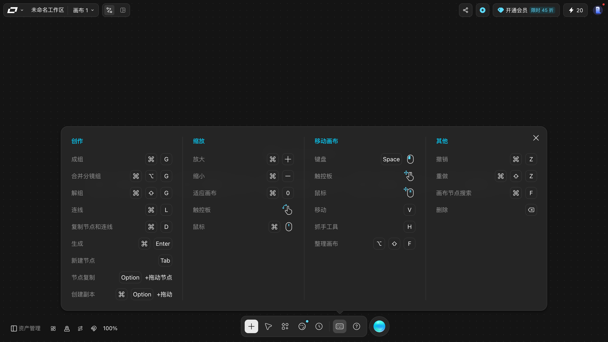
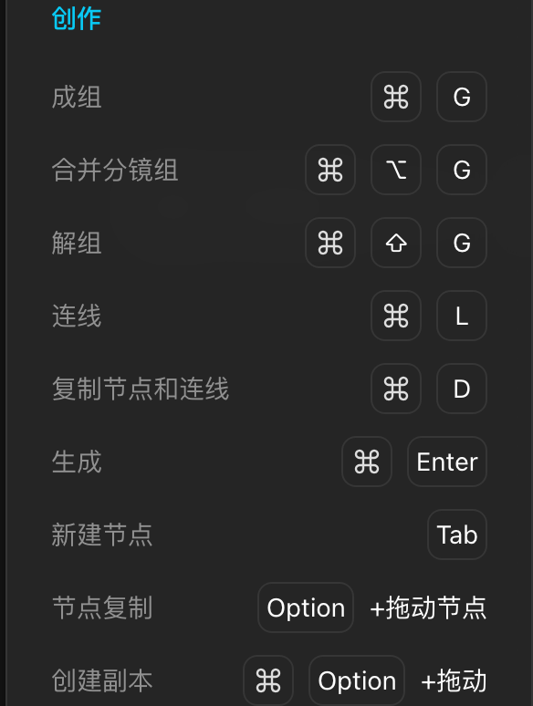
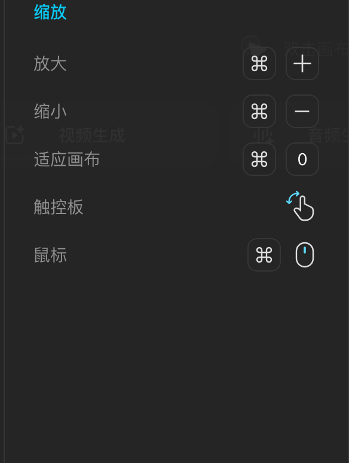
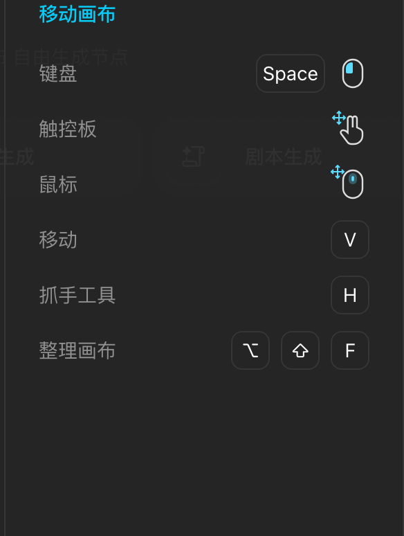
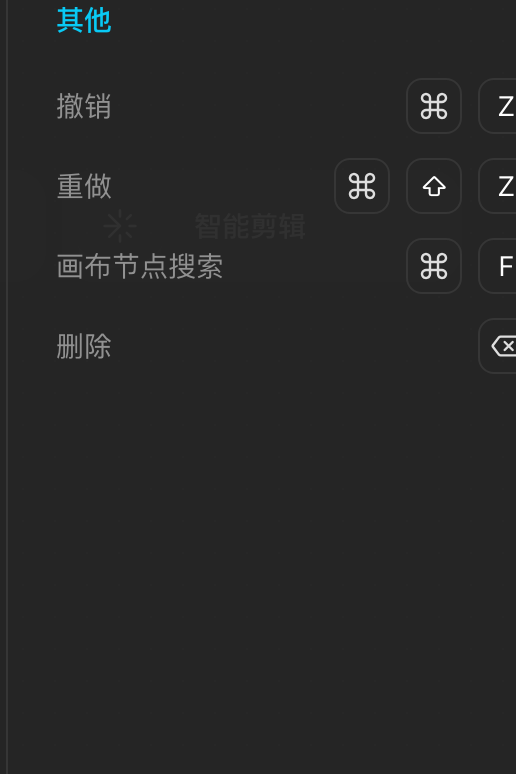
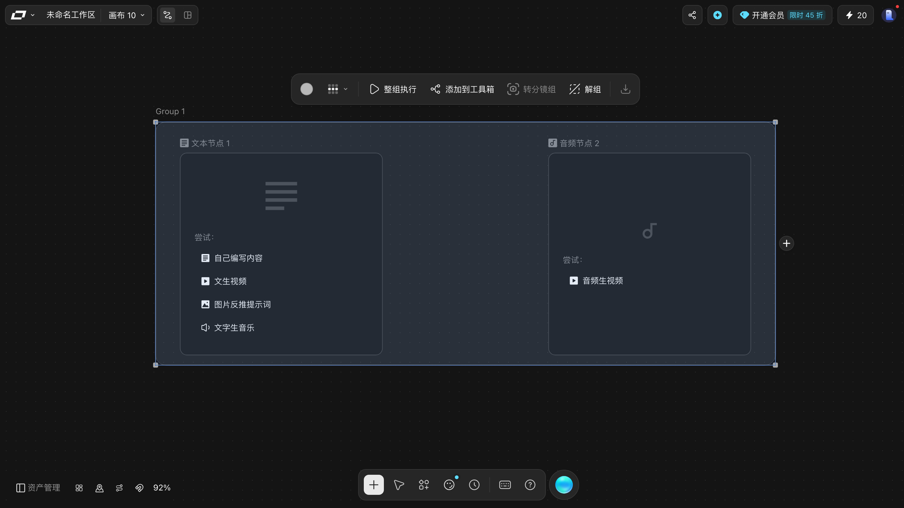

# 快捷键

> 目标：知道四组快捷键分别管什么，以及哪些是本手册真的按过验证的。
> 适用角色：普通创作者 · 验证状态：面板原文 ✅；**除「生成」外全部实按** ✅

## 打开

底部工具条的「**快捷键**」（键盘图标）。面板自带关闭 `×`，但它**会挡住第四列**，关掉右侧的 TV Director 抽屉才看得全。

> 面板是 **macOS 键位**。Windows 上 `⌘` → `Ctrl`，`⌥` → `Alt`，`⇧` → `Shift`。

---

## 创作

| 动作 | 键 |
|---|---|
| 成组 | `⌘G` |
| 合并分镜组 | `⌘⌥G` |
| 解组 | `⌘⇧G` |
| 连线 | `⌘L` |
| 复制节点和连线 | `⌘D` |
| 生成 | `⌘Enter` |
| 新建节点 | `Tab`（**没有 ⌘ 前缀**） |
| 节点复制 | `Option` + 拖动节点（**没有 ⌘ 前缀**） |
| 创建副本 | `⌘` `Option` + 拖动 |

## 缩放

| 动作 | 键 |
|---|---|
| 放大 | `⌘ +` |
| 缩小 | `⌘ -` |
| 适应画布 | `⌘ 0` |
| 触控板 | 捏合手势（**不用按任何键**） |
| 鼠标 | `⌘` + 滚轮 |

## 移动画布

| 动作 | 键 |
|---|---|
| 移动画布 · 键盘 | `Space` + 鼠标左键拖 |
| 移动画布 · 触控板 | 双指平移 |
| 移动画布 · 鼠标 | 滚轮下拖 / 中键拖 |
| **移动**（选择工具） | `V` |
| **抓手工具** | `H` |
| 整理画布 | `⌥ ⇧ F` |

## 其他

| 动作 | 键 |
|---|---|
| 撤销 | `⌘Z` |
| 重做 | `⌘⇧Z` |
| 画布节点搜索 | `⌘F` |
| 删除 | `⌫` |

---

## ✅ 实按验证过的

面板上的键位除「生成」外，本手册**逐条实按过**，每一行都有前后读数：

| 键 | 实测行为（括号里是读数） |
|---|---|
| `Shift` + 左键拖 | 框选。拖出的矩形**完整包住**的节点全部选中（选中 2 / 共 2） |
| `⌘L` | 把选中的节点连起来（连线数 0 → 1） |
| `⌘G` | 成组（组元素 0 → 1，组节点名为「Group 1」，节点总数 2 → 3） |
| `⌘⇧G` | 解组（组元素 1 → 0，节点总数 3 → 2） |
| `⌘D` | 复制节点和连线（节点数 3 → 4） |
| `⌘Z` | 撤销（节点数 4 → 3） |
| `⌘⇧Z` | 重做（节点数 3 → 4） |
| `Option` + 拖动节点 | 节点复制（节点数 4 → 5），副本自动命名「**原名 - 副本**」 |
| `Tab` | 在画布上弹出「添加节点」面板（**只开菜单，不直接建节点**） |
| `⌘F` | 画布节点搜索：输入框占位「搜索画布元素」，边打边筛，底部显示「共 N 节点」 |
| `V` / `H` | 底部中央工具条第二枚按钮在「移动」↔「抓手工具」之间切换 |
| `⌘0` | 框住所有节点（**不是**重置到 100%） |
| `⌘+` / `⌘-` | 缩放生效，缩放菜单里的百分比同步变化 |
| `⌥⇧F` | 节点被铺开，并弹出「是否保留此次整理结果？」 |
| `⌘A` + `⌫` | 全选节点并删除 |

### 成组之后：顶部多出一条「组操作条」

这条操作条是**成组之后才有的**，五个按钮依次是：

`●` 颜色 · `⊞˅` 布局下拉 · `▶ 整组执行` · `添加到工具箱` · `转分镜组` · `解组` · `⬇` 下载

> **`整组执行` 会真的跑生成、扣积分。** 本手册只读了它的存在，**没有点过**。

### ⚠️ 三个必须知道的坑

1. **删除键要先把焦点交回画布。** 面板写的是「删除 `⌫`」，但选中一个节点后**直接按 `Delete` 或 `Backspace` 都不生效**；必须先点画布空白处，再 `⌘A` 全选，再 `⌫`。原因很直白：节点里有提示词输入框，焦点在框里时 `⌘A` 选中的是**框里的文字**。

2. **`Tab` 只在焦点在画布上时才有用。** 点一下画布空白处（焦点变成页面 `body`）再按 `Tab`，「添加节点」面板就会弹出；焦点还停在某个输入框里时按 `Tab`，什么也不会发生。

3. **框选要用 `Shift` 拖。** 在空白处直接左键拖是**拖不动画布的**（实测鼠标走 300px、视口只挪了 5.8px，详见 [organize-canvas.md](organize-canvas.md)）。想在空白处拉一个选区，必须按住 `Shift`。

---

## ⚠️ 没有实按 / 没有反应的两个键

| 键 | 状态 |
|---|---|
| `⌘Enter` 生成 | **按了就会扣积分**，本手册全程没按。见 [generate-media.md](generate-media.md) |
| `⌘⌥G` 合并分镜组 | 实按了，**画布毫无变化**（组元素 1 → 1，也没有任何提示）。它对应组操作条上的「转分镜组」，而那枚按钮实测是**灰的**（`opacity: 0.45`），点了也没反应 📖 |

其余面板上列的键位（`⌘`+滚轮、触控板捏合、滚轮下拖 / 中键拖）本手册没有实按，属于面板自称 ⚠️。

---

## 「教程」按钮不是教程

底部工具条上那枚标着「**教程**」的按钮，实测实现上是 `data-sidebar-btn="contact"`（联系入口）。点下去：

- 没有弹出任何面板；
- 没有跳转；
- 没有新窗口；
- 只发出一条 `POST /log/ocpcagl` 埋点。

**不要指望它能打开教程中心。** 本手册实测范围内，LibTV 画布里**没有找到教程中心入口**。

---

## 相关

- [organize-canvas.md](organize-canvas.md) —— 缩放与整理
- [create-nodes.md](create-nodes.md) —— 成组 / 解组 / 复制的使用场景
- [../20-reference.md](../20-reference.md) —— 完整键位表
