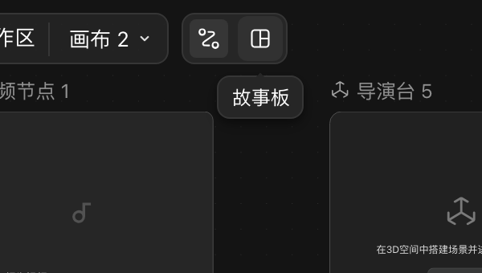
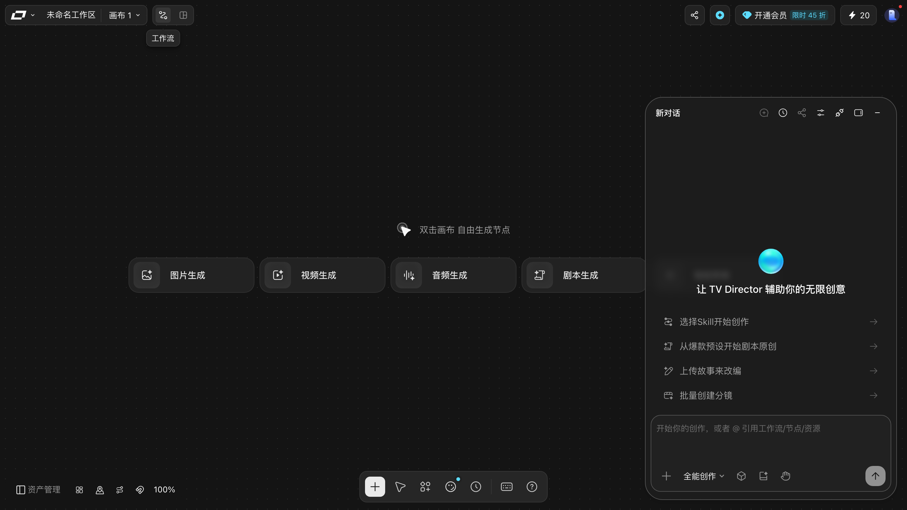
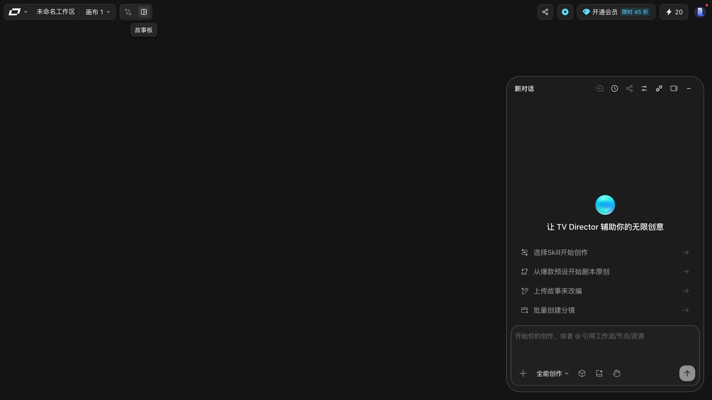
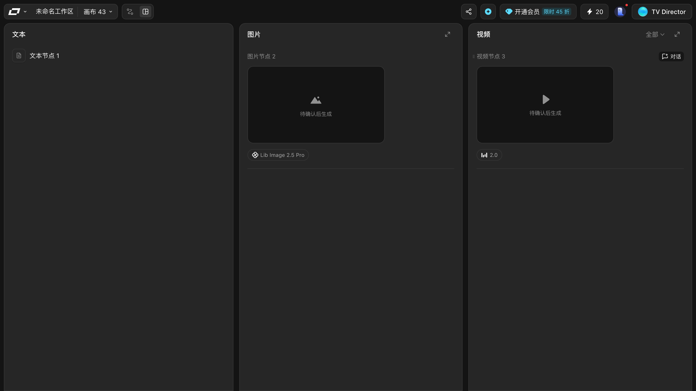
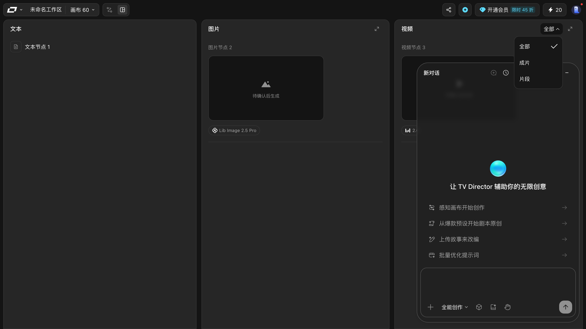
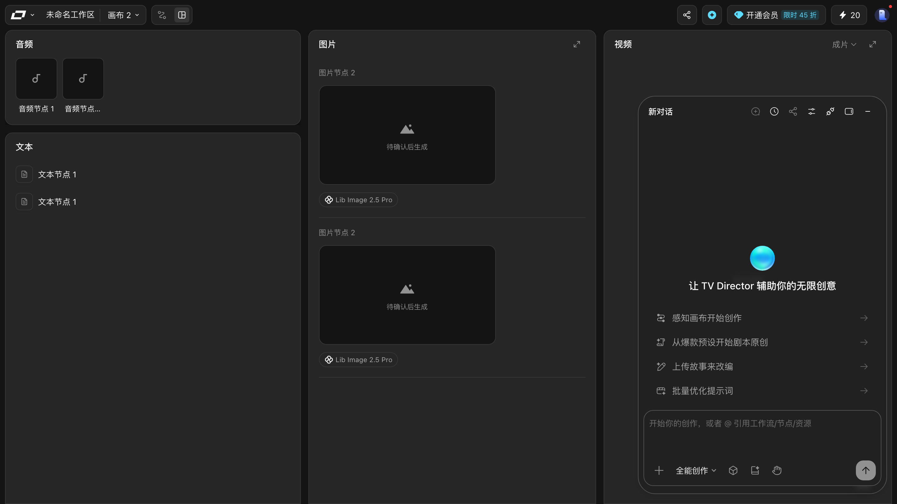
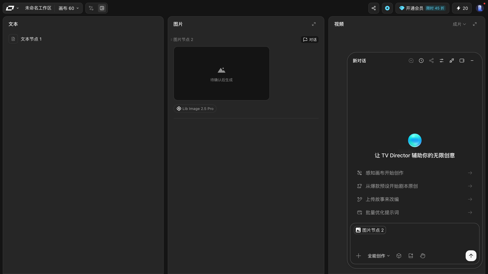
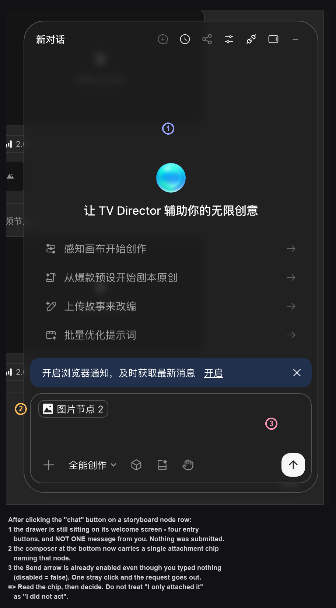
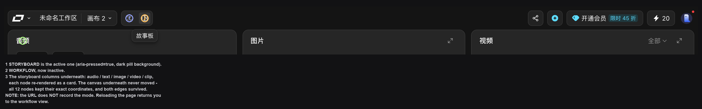
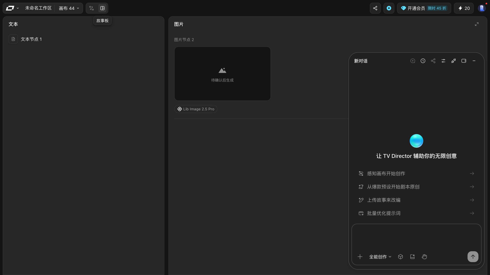

# 故事板模式：按时间顺序看内容

> 目标：在「工作流」和「故事板」之间切换，知道两种视图各自适合做什么。
> 适用角色：普通创作者 · 验证状态：✅ 实跑

---

## 两个视图的区别

顶栏画布名右边有**两个小图标**：左边那个是**工作流**，右边那个是**故事板**。

> ⚠️⚠️ **它们身上没有任何文字** —— 本手册早期写的是「顶栏中间有一个切换开关：`工作流` | `故事板`」，
> **这个形态说法是错的，已更正**。
> 页面上**搜不到「工作流」「故事板」这几个字**（实测两个都读不到），
> 想知道哪枚是哪一枚，只有两个办法：
> ① **把鼠标停在上面等一秒**，气泡会写出名字；
> ② 读无障碍名（`aria-label`）：分别是 `工作流` 和 `故事板`。

| | 工作流 | 故事板 |
|---|---|---|
| 画布上是什么 | **节点和连线** | **三列内容** |
| 回答的问题 | 「谁依赖谁」 | 「先播什么后播什么」 |
| 适合 | 搭流程、调依赖 | 检查叙事顺序、交付给客户看 |

> ⭐ **切来切去不会丢东西** —— 两种视图是同一批内容的两种排布。
> 实测：故事板 ⇄ 工作流来回切，节点数 `11 → 11`，一个不少。
> ⭐ **改过的节点名会带过来** —— 故事板里列的就是节点名，改名后这边同步变
> （见 [create-nodes.md](create-nodes.md) 的「给节点改个名字」）。

## 故事板的列

切到故事板后，画布内容换成**按产物类型分列**的清单。**空画布**时前三列是空状态：

| 列 | 空状态文案 |
|---|---|
| 文本 | 暂无文本 |
| 图片 | 暂无图片 |
| 视频 | 暂无视频 |

> ⭐ **不止三列。** 早期本手册写的是「三列」，那是在**只建了文本/图片/视频三个节点**的
> 画布上取的样。画布上**有音频节点时，左上角会多出第四列「音频」**，
> 两个音频节点就是两张卡片（第二个名字会被截成「音频节点…」）。
> 所以列数是**跟着画布上有什么节点走的**，不是固定三列。

但**有内容时长什么样**，才是你真正会遇到的。建一个文本、一个图片、一个视频再切过来：

| 列 | 有内容时 | 备注 |
|---|---|---|
| 文本 | 一行「文本节点 1」 | 纯文字，**没有预览框** |
| 图片 | 「图片节点 2」+ 灰色占位框，框内写 **待确认后生成** + 下面挂 `Lib Image 2.5 Pro` 模型标签 | 占位框右上角有 `⤢` |
| 视频 | 「视频节点 3」+ 占位框「待确认后生成」+ `2.0` 标签；列头右上角多一个 **「全部」筛选下拉** | |
| **音频** | 有音频节点时才出现这一列，每个音频节点一张卡片 | ⭐ 不建音频节点就没有这一列 |

> ⚠️ 「对话」按钮**不是视频列专属** —— 图片列的节点行尾也有一枚，只是平时看不见（见下）。

> **「待确认后生成」是这几个节点的真实状态**：还没跑过生成，所以没有产物。
> 故事板这一列显示的就是「这一格将来要出什么」，而不是「现在出了什么」。
> 换句话说，**故事板是按产物类型分的待办清单**，正好用来检查「这一段该有图还是该有视频」。

> 切换**不会丢内容** —— 这是同一批内容的两种排布方式。切回工作流，节点和连线都还在。
> 实测：切过去再切回来，工作流态节点数 `3 → 3`，一个不少。

### 视频列的「全部」筛选：筛的是成片还是片段

**只有视频列有这枚筛选**，三个选项：

| 选项 | 含义 |
|---|---|
| `全部` | 不筛（默认，带 ✓） |
| `成片` | 只看整段成片 |
| `片段` | 只看单个片段 |

选完之后列头文案**跟着变**（`全部 ⌄` → `成片 ⌄`），再点一次可以切回来。

⭐ **三档逐个实点的结果**（同一个画布，点完先把鼠标移开再回读）：

| 档 | 按钮文案变成 | 视频列可见行 |
|---|---|---|
| `成片` | `成片` | **0 行**（整列空） |
| `片段` | `片段` | **2 行** |
| `全部` | `全部` | 2 行 |

> 💡 **在没生成过视频的画布上，「成片」必然筛空，「片段」和「全部」看起来一样。**
> 这不是坏了 —— 没有成片可显示。三档里只有「成片」会真的改变可见内容。
>
> ⚠️ 「成片 / 片段」这个区分**只在跑过生成之后才有意义**。
> 本手册没有生成过任何视频，所以「有产物之后两档各自筛出什么」**没有验证** 📖。

### 节点行尾的「对话」：把这一格丢给 TV Director

**这枚按钮平时是隐形的** —— 它在 DOM 里，但 `opacity` 为 0，
**鼠标移到节点行上才显形**（行尾右侧，一枚带气泡图标的 `52×20` 胶囊）。
所以「节点行尾什么都没有」不是没有按钮，是没悬停。

- ⭐⭐ **这枚按钮只存在于故事板态**。实测在工作流态下数了一遍：可见的「对话」按钮
  **一个都没有**（`[]`）。⇒ 别在工作流里找它。
- **图片列和视频列的节点都有**，不只是视频列。
- 点它 = 右侧滑出 TV Director 对话抽屉，**把这个节点挂成输入框里的一个附件 chip**，
  然后**停在那里等你** —— 面板还停在欢迎页，**没有自动发消息**。
  和资产管理抽屉里的 `⋯ → 添加到Agent` 是同一套机制（见
  [organize-canvas.md](organize-canvas.md#⋯-菜单里的四项)）。
- ⚠️ **两处挂的附件数不一样**：资产管理里的 `添加到Agent` 实测挂了**两个**同名 chip，
  故事板这里的 `对话` 实测只挂**一个**。

> ⛔⭐⭐ **「只挂了附件」不等于「什么都没发生」** ——
> 实测挂完 chip 之后，那枚 `aria-label="Send"` 的提交键读出来是
> **`disabled: false`**、`opacity: 1`，而且**视觉上是白色圆底的高亮态**。
> 也就是说：**一个字没打，它就能点。** 在这个状态下顺手点一下就发出去了。
>
> 💡 正确的用法：挂完 chip 先**看一眼 chip 上的名字对不对**（认节点别认位置），
> 然后**先把要问的话打完**，再点提交。

## 怎么切

点顶栏的「工作流」或「故事板」按钮即可，来回切没有代价，也没有确认框。

两枚键的表达方式（实测）：

| | 位置 | 当前激活时 |
|---|---|---|
| `工作流` | `[244, 8, 32, 32]` | `aria-pressed="true"`，底色深灰 `rgb(54,54,54)` |
| `故事板` | `[276, 8, 32, 32]` | `aria-pressed="true"`，底色深灰 `rgb(54,54,54)` |

没激活的那枚 `aria-pressed="false"`、底色透明。⭐ **两枚都没有文字**，只能靠悬停气泡或位置认。

### ⭐⭐⭐ 切换不会丢任何东西，实测逐项对过

在有 12 个节点、2 条连线的画布上往返切了一次，**逐项比对**：

| 项目 | 切换前 | 故事板态 | 切回来 |
|---|---|---|---|
| 节点数 | 12 | **12** | 12 |
| 12 个节点的类型 + 标题 + 坐标 | — | **逐个相同** | ⭐ **逐字一致** |
| 连线数 | 2 | **2** | 2 |
| 地址栏 | `?spaceId=…&projectId=…` | ⭐ **完全没变** | 没变 |

⇒ ⭐⭐ **故事板不是「另一个画布」，而是给同一批节点套了一层分栏卡。**
底下的画布**一寸没动** —— 节点还在原来的位置，连线还是那两条。
变的只是每个节点卡片里显示的内容：从节点本身改成了「对话 / 待确认后生成 / 模型名」那一套。

> 📌 **由此得出一条**：故事板态下**点节点会落到分栏卡上，而不是节点本身**（实测
> `elementFromPoint` 返回的是「图片节点 2 / 对话 / 待确认后生成 / Lib Image 2.5 Pro」
> 那一整块分栏卡）。要编辑节点本身，**先切回工作流**。

### ⚠️ 模式不会被地址栏记住

⭐⭐ **切换不写进 URL** —— 两种模式下地址栏字符串一模一样
（`?spaceId=10354929&projectId=34226ef1…`）。

⇒ 所以**刷新页面会回到工作流**。想让别人直接看到你的故事板，只能先把模式切过去，
**再当场看**；发链接过去的人打开仍是工作流。

## 一个容易踩的坑

**空画布切到故事板，几乎什么都看不到** —— 只有三列空状态。所以别把「切过去一片空白」当成切换失败，它只是忠实地告诉你：你的画布里还没有内容。

## TV Director 面板不是「点故事板」带出来的

⚠️ **更正本手册的旧账。** 早先记的是「点「故事板」的同时，右侧会滑出一个 TV Director 面板」，
并据此推断「切故事板会把 TV Director 拉出来跟着」。**这个因果是错的** ⛔

全新浏览器会话打开画布、**一次故事板都没点、一次画布切换都没做**，
右侧的 TV Director 抽屉**已经开着**（class `mantine-Drawer-inner`，可见），
顶栏正中的「正在跟随」横幅**也已经在**。两者都是**开屏就有**，不是切模式触发的。

| 面板位置 | 实测 |
|---|---|
| 浮层框 | `[1024, 154, 400×640]`，class 是 `mantine-Drawer-inner` |
| 标题 | `让 TV Director 辅助你的无限创意` |
| 四个入口 | `感知画布开始创作` · `从爆款预设开始剧本原创` · `上传故事来改编` · `批量优化提示词` |
| 输入框底栏 | `+` · **`全能创作` ▾** · 立方体 · 文件夹 · 手掌 · 提交 `↑` |

它右上角有一枚「—」，点一下就收起（实测收起后再读页面，浮层确实不在了）。

> ⚠️ **那四个入口本手册一个都没点。** 点它们会**给 TV Director 派发任务、进而可能触发生成**，
> 属于安全边界里「需要单独授权」那一类。所以这张图只证明「面板长这样」，
> 不证明「点下去会发生什么」。
>
> ⛔ 同理，画面里那条 `正在跟随 / 取消 / 按 ESC 退出` **本手册也一个都没点过**，
> 而且早先把它写成了「底部状态条、内容是 `故事板 正在跟随`」—— **两处都是错的**。
> 它在**顶栏正中**，正文里**没有「故事板」三个字**。逐条实测见
> [../20-reference.md](../20-reference.md#顶栏「正在跟随」横幅)。

## 取消与恢复

- 切错了：再点另一个按钮切回来。
- 故事板里想改内容：点具体的列去看，或者切回工作流改节点 —— 两个视图操作的是同一份数据。

## 相关

- [enter-canvas.md](enter-canvas.md) · [organize-canvas.md](organize-canvas.md)
