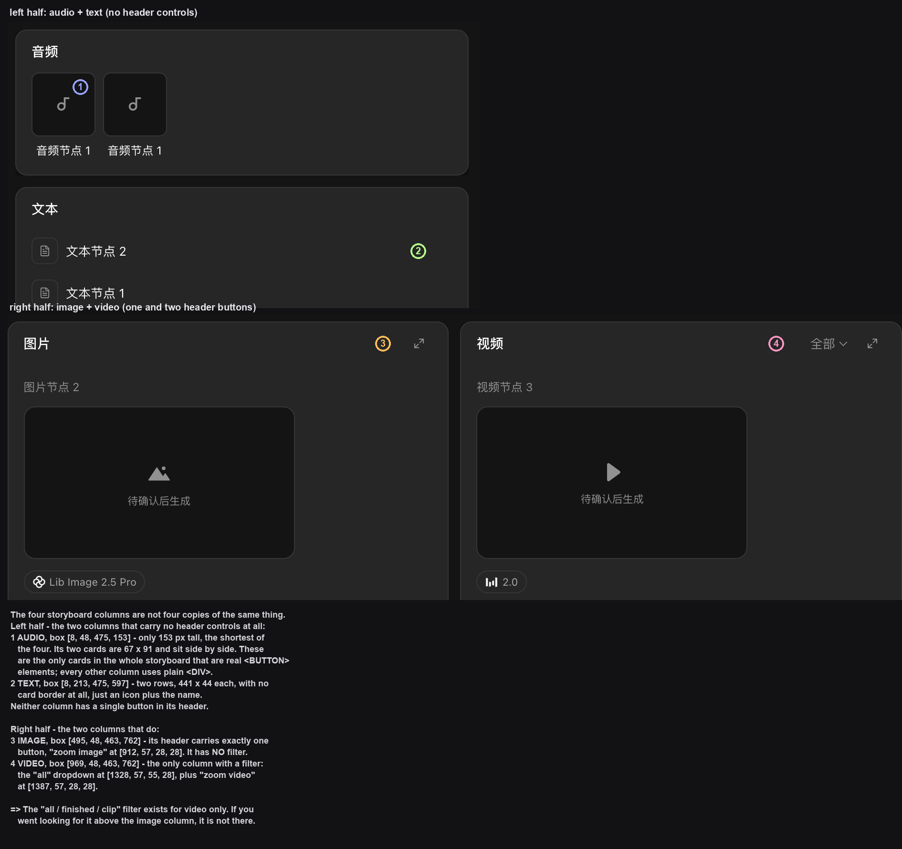
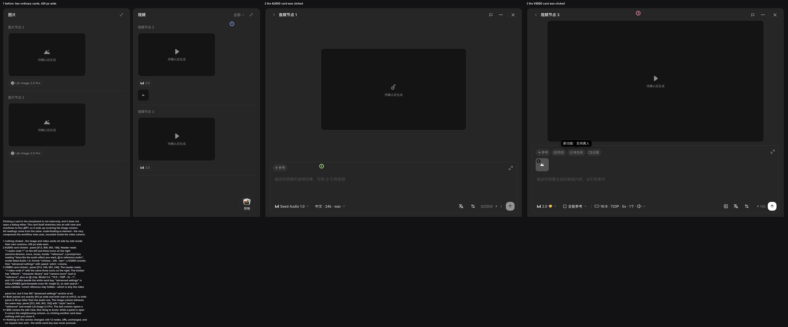
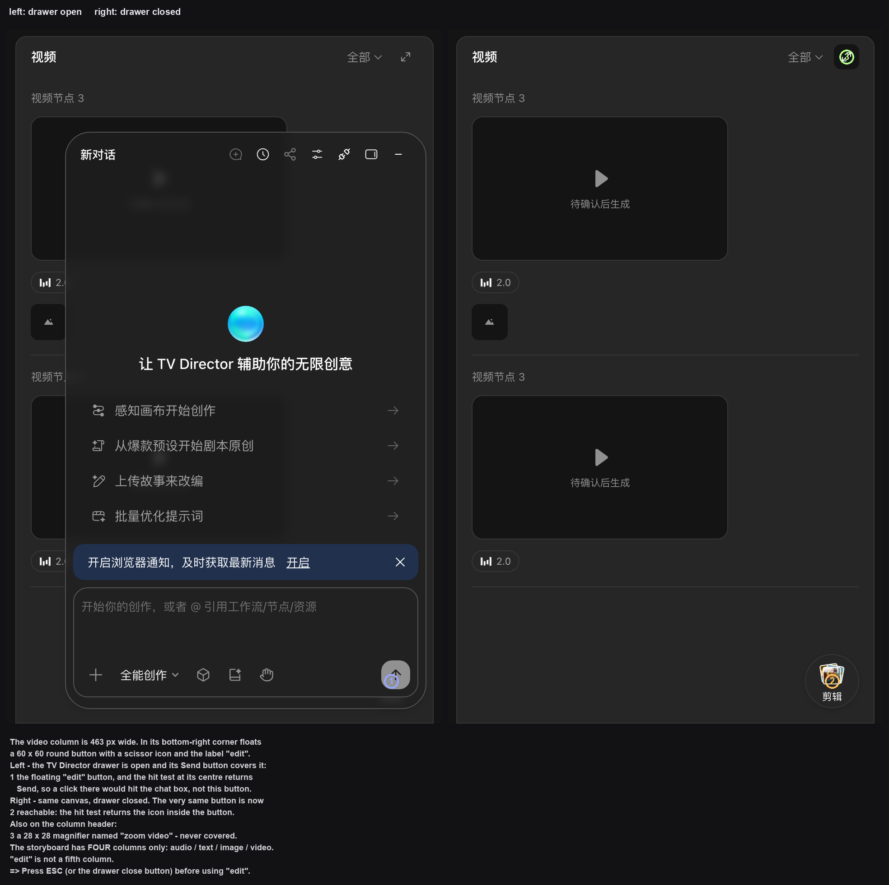
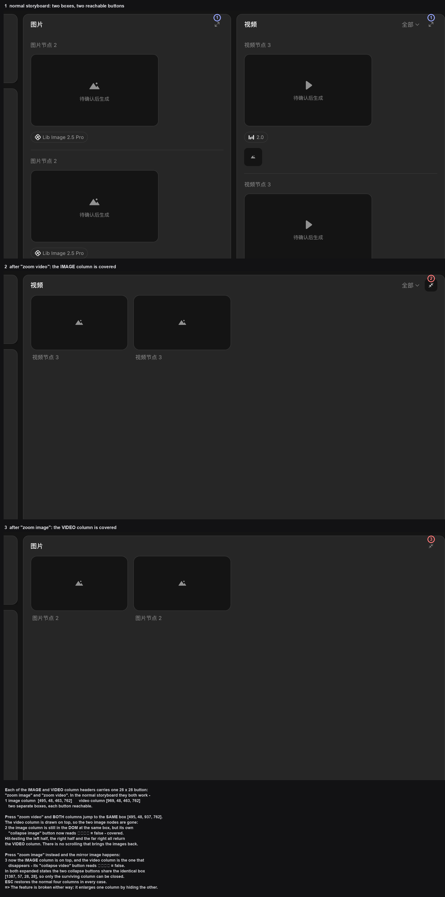
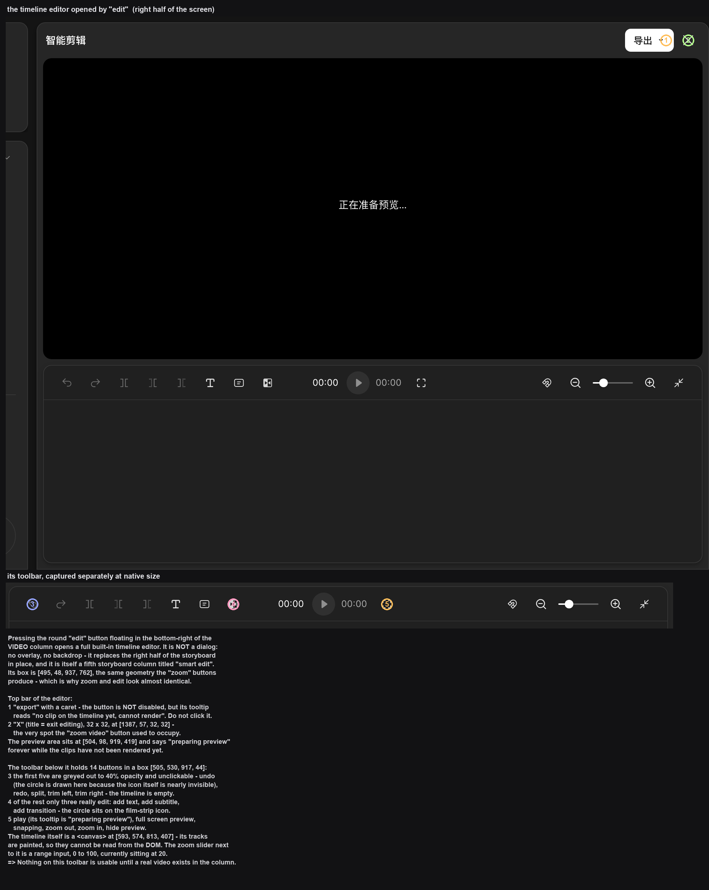

# 故事板模式：按时间顺序看内容

> 目标：在「工作流」和「故事板」之间切换，知道两种视图各自适合做什么。
> 适用角色：普通创作者 · 验证状态：✅ 实跑

---

## 两个视图的区别

顶栏画布名右边有**两个小图标**：左边那个是**工作流**，右边那个是**故事板**。

> ⚠️⚠️ **它们身上没有任何文字** —— 本手册早期写的是「顶栏中间有一个切换开关：`工作流` | `故事板`」，
> **这个形态说法是错的，已更正**。
> 页面上**搜不到「工作流」「故事板」这几个字**（实测两个都读不到），
> 想知道哪枚是哪一枚，只有两个办法：
> ① **把鼠标停在上面等一秒**，气泡会写出名字；
> ② 读无障碍名（`aria-label`）：分别是 `工作流` 和 `故事板`。

| | 工作流 | 故事板 |
|---|---|---|
| 画布上是什么 | **节点和连线** | **三列内容** |
| 回答的问题 | 「谁依赖谁」 | 「先播什么后播什么」 |
| 适合 | 搭流程、调依赖 | 检查叙事顺序、交付给客户看 |

> ⭐ **切来切去不会丢东西** —— 两种视图是同一批内容的两种排布。
> 实测：故事板 ⇄ 工作流来回切，节点数 `11 → 11`，一个不少。
> ⭐ **改过的节点名会带过来** —— 故事板里列的就是节点名，改名后这边同步变
> （见 [create-nodes.md](create-nodes.md) 的「给节点改个名字」）。

## 故事板的列

切到故事板后，画布内容换成**按产物类型分列**的清单。**空画布**时前三列是空状态：

| 列 | 空状态文案 |
|---|---|
| 文本 | 暂无文本 |
| 图片 | 暂无图片 |
| 视频 | 暂无视频 |

> ⭐⭐ **最多四列，就是这四个：`音频` `文本` `图片` `视频`。**
> 早期本手册写的是「三列」，那是在只建了文本/图片/视频三个节点的画布上取的样。
> 画布上**有音频节点时会多出第四列「音频」**，两个音频节点就是两张卡片
> （第二个名字会被截成「音频节点…」）。
>
> Batch GI 直接数了列容器（class `assetboard-panel`），**实测就是 4 个**：
>
> | 列 | 容器框（视口 1440×810） |
> |---|---|
> | `音频` | `[8, 48, 475, 153]` |
> | `文本` | `[8, 213, 475, 597]` |
> | `图片` | `[495, 48, 463, 762]` |
> | `视频` | `[969, 48, 463, 762]` |
>
> ⇒ 列数**跟着画布上有什么节点走**，但**上限就是这四类**。
>
> ⚠️⭐ 视频列里还有两个字样叫 **`剪辑`**，**它不是第五列** —— 见下面那节。

但**有内容时长什么样**，才是你真正会遇到的。建一个文本、一个图片、一个视频再切过来：

| 列 | 有内容时 | 备注 |
|---|---|---|
| 文本 | 一行「文本节点 1」 | 纯文字，**没有预览框** |
| 图片 | 「图片节点 2」+ 灰色占位框，框内写 **待确认后生成** + 下面挂 `Lib Image 2.5 Pro` 模型标签 | 占位框右上角有 `⤢` |
| 视频 | 「视频节点 3」+ 占位框「待确认后生成」+ `2.0` 标签；列头右上角多一个 **「全部」筛选下拉** | |
| **音频** | 有音频节点时才出现这一列，每个音频节点一张卡片 | ⭐ 不建音频节点就没有这一列 |

> ⚠️ 「对话」按钮**不是视频列专属** —— 图片列的节点行尾也有一枚，只是平时看不见（见下）。

> **「待确认后生成」是这几个节点的真实状态**：还没跑过生成，所以没有产物。
> 故事板这一列显示的就是「这一格将来要出什么」，而不是「现在出了什么」。
> 换句话说，**故事板是按产物类型分的待办清单**，正好用来检查「这一段该有图还是该有视频」。

> 切换**不会丢内容** —— 这是同一批内容的两种排布方式。切回工作流，节点和连线都还在。
> 实测：切过去再切回来，工作流态节点数 `3 → 3`，一个不少。

### ⭐⭐ 四列长得完全不一样，不只是内容不同

上面那张表说的是「有什么」，但**四列的形状和按钮数也不一样**，
Batch GK 拿同一张画布把四列并排量了一遍：

| 列 | 列框 | 卡片是什么 | 列头有几枚按钮 |
|---|---|---|---|
| `音频` | `[8,48,475,153]` | ⭐ **`<BUTTON>`，67×91，两张并排** | ⛔ **0 枚** |
| `文本` | `[8,213,475,597]` | `441×44` 的行，**没有卡片边框** | ⛔ **0 枚** |
| `图片` | `[495,48,463,762]` | `429×241` 的卡 | **1 枚**：`放大图片` `[912,57,28,28]` |
| `视频` | `[969,48,463,762]` | `429×293` 的卡 | **2 枚**：`全部 ▾` `[1328,57,55,28]` + `放大视频` `[1387,57,28,28]` |

- ⭐⭐ **音频列的卡片是整个故事板里唯一用 `<BUTTON>` 的**，
  别的三列都是普通 `
`。（这条不写在正文里你也看不出来，但它决定了
  「为什么点音频卡会打开编辑态」—— 见下一节。）
- ⭐⭐⭐ **只有视频列有筛选。** 「全部 / 成片 / 片段」那个下拉**不在图片列** ——
  你在图片列头找半天也找不到，它压根就没渲染。

### ⭐⭐⭐ 点分栏卡上的卡片 = 那张卡片自己撑成编辑态

**故事板不是只读视图。** 点任意一列里的卡片，那张卡片会**就地撑大成编辑态** ——
不是弹窗、没有遮罩，**而且一律向左溢出、盖住图片列那一块**。

四列点开都是同一个组件（`.node-floating-ui`，和工作流态用的**是同一套**）：

| 点的卡 | 面板框 | 面板里有什么 |
|---|---|---|
| 音频 | `[512, 609, 903, 188]` | `参考` / 提示框「描述你想要的音频效果，可用 @ 引用音频」/ `Seed Audio 1.0` / `中文 · 24k · wav` / `0/2000` / 高级设置：**语速 · 声调 · 音量** |
| 文本 | — | 提示框（占位符是「写下你想讲的故事、场景或角色设定。例如：一个来自未来的机器人，在城市屋顶看星星。」）/ `GVLM 3.1` / `6`；⭐ **没有「高级设置」** |
| 图片 | `[512, 605, 903, 192]` | `参考` + `风格` / 提示框「可直接文字生图，或上传图片输入文字指令对图片进行编辑…」/ `Lib Image 2.5 Pro` / `16:9 · 标准画质 · 2K · 1张` / 高级设置：智能引用 AutoLink |
| 视频 | `[512, 549, 903, 248]` | `参考` + `特效` + `角色库` + `运镜` / `@` chip / 提示框「描述你想要生成的画面内容，@引用素材」/ `2.0` / `全能参考` / `16:9 · 720P · 5s · 1个` / `135` 积分 / 高级设置：**默认收起**（`grid-template-rows: 0fr`、框高 `0`），展开后才有 联网搜索 · 自动校验素材 · 智能引用 AutoLink |

四行要点：

1. ⭐⭐⭐ **三块面板的宽都是 `903`、左边缘都是 `x = 512`** ——
   也就是说**不管点哪一列，它都会盖住图片列**。视频面板最高（248），所以封面区也最大。
2. ⭐ **顶栏形状一致**：左边 `‹ 节点名`，右边三枚图标（丢给 TV Director / `⋯` / `✕`）。
3. ⭐⭐ **`Esc` 能关掉**（实测关掉后节点数、URL 全部不变）。
4. ⚠️⭐⭐ **面板开着的时候，它盖住的那一列点不动** ——
   第一次想「点下一张卡」会毫无反应，因为那一击打在面板自己身上。
   👉 **先 `Esc` 关掉，再点下一张。**

> ⛔ 面板右下角那枚白色 ↑ 是**真的生成键**（旁边就写着要花多少积分）。
> 本手册**从头到尾没有按过它**，也没有改过任何提示词、模型或规格。
> 面板上所有参数的实际效果 📖 未验。

> 📖 顺带说明 Batch GG 那条结论的适用范围：GG 记的是
> 「故事板态下点**画布上节点的位置**会落到分栏卡上，节点本身点不到」——
> 那条仍然成立（分栏卡盖住了底下的画布）。
> 但**点分栏卡上的卡片本身是有反应的**，两者不冲突，别混成一句「故事板里什么都点不了」。

### 视频列的「全部」筛选：筛的是成片还是片段

**只有视频列有这枚筛选**，三个选项：

| 选项 | 含义 |
|---|---|
| `全部` | 不筛（默认，带 ✓） |
| `成片` | 只看整段成片 |
| `片段` | 只看单个片段 |

选完之后列头文案**跟着变**（`全部 ⌄` → `成片 ⌄`），再点一次可以切回来。

⭐ **三档逐个实点的结果**（同一个画布，点完先把鼠标移开再回读）：

| 档 | 按钮文案变成 | 视频列可见行 |
|---|---|---|
| `成片` | `成片` | **0 行**（整列空） |
| `片段` | `片段` | **2 行** |
| `全部` | `全部` | 2 行 |

> 💡 **在没生成过视频的画布上，「成片」必然筛空，「片段」和「全部」看起来一样。**
> 这不是坏了 —— 没有成片可显示。三档里只有「成片」会真的改变可见内容。
>
> ⚠️ 「成片 / 片段」这个区分**只在跑过生成之后才有意义**。
> 本手册没有生成过任何视频，所以「有产物之后两档各自筛出什么」**没有验证** 📖。

### 视频列右下角那枚「剪辑」：不是一列，是一枚浮动按钮

⚠️⭐ 视频列里能看到两个字样叫 `剪辑`。**它不是第五列**（列数实测就 4 个，见上）——
它是**视频列右下角浮着的一枚圆形按钮**：

| | 实测 |
|---|---|
| 框 | `[1355, 733, 60, 60]` |
| 无障碍名 | `剪辑` |
| 内部 | 一张剪刀图标（`clip-compose-icon`）+ 下方 `剪辑` 两个字 |
| 定位方式 | `absolute bottom-4 right-4`，贴在视频列自己那一格里 |
| 存在条件 | ⭐ **只在故事板态有**（工作流态实测可见数为 `[]`） |

> ⛔⭐⭐ **抽屉开着的时候这枚按钮点不到** —— 和 [../90-troubleshooting.md](../90-troubleshooting.md) 里
> 「空画布芯片被压住」是同一类问题。实测 `elementFromPoint` 的落点：
>
> | 状态 | 落点属主 | 能点吗 |
> |---|---|---|
> | 抽屉开着 | `Send`（抽屉的提交键） | ⛔ **不能** |
> | 抽屉关掉 | 按钮内的图标 `IMG` | ✅ 能 |
>
> **修**：先按 `Esc` 或点抽屉右上角关闭键，再点「剪辑」。
>
> 👉 点开之后是什么界面，见下面的
> [「剪辑」点开是什么](#「剪辑」点开是什么-内嵌的时间轴剪辑器)。

### ⭐ 页面顶部常驻一条点不动的「正在跟随」

故事板页面的**正上方居中**永远挂着一条 `174×34` 的小牌：`正在跟随` + 一枚
`退出ESC` 胶囊。翻遍 DOM 才找得到它，因为它：

| | 实测 |
|---|---|
| 框 | `[633, 0, 174, 34]`（`z-index: 305`） |
| 容器 `opacity` | **`0`** |
| 容器 `pointer-events` | **`none`** |
| 里面那枚 `退出ESC`（提示 `退出跟随`）的 `pointer-events` | **`none`** |
| 什么时候出现 | ⭐ **一直都在** —— 正常故事板、放大态、剪辑态三种状态下读数完全一样 |

👉 **它既看不见也点不着，是一条死元素。** 你不会在界面上遇到它，
写在这里只是为了下次在 DOM 里撞见它时别以为找错了。

> 📌 探针插曲：GJ-1 那轮我只筛「`position: fixed` 且宽 > 200px」的浮层，
> 这条 `174` 宽的元素被门槛筛掉了，于是我一度以为「点放大视频才冒出这条」。
> —— **探针的尺寸门槛会把目标筛掉，还让我误以为「它不存在」。**

### ⭐⭐⭐ 列头右上角那两枚「放大」按钮：两枚都是坏的

**图片列和视频列的列头右上角各有一枚 `28×28` 的放大按钮** —— 无障碍名分别是
`放大图片` 和 `放大视频`（内部是 `iconify` 图标）。两枚都**从来不会被抽屉挡住**
（实测抽屉开/关两种状态下落点属主都是它自己）。

| 按钮 | 框 | 在哪一列 |
|---|---|---|
| `放大图片` | `[912, 57, 28, 28]` | 图片列头 |
| `放大视频` | `[1387, 57, 28, 28]` | 视频列头，`全部 ▾` 筛选右边 |

⛔⭐⭐⭐ **别用它们。这两枚按钮不管点哪一枚，都只会把另一列整列吃掉。**

三个状态逐字读数（`.assetboard-panel` 的框）：

| 状态 | 图片列 | 视频列 | 收起图片键中心属主 | 收起视频键中心属主 |
|---|---|---|---|---|
| 正常 | `[495,48,463,762]` | `[969,48,463,762]` | — | — |
| 点「放大视频」 | `[495,48,937,762]` | `[495,48,937,762]` | ⛔ `false` | ✅ `true` |
| 点「放大图片」 | `[495,48,937,762]` | `[495,48,937,762]` | ✅ `true` | ⛔ `false` |

⇒ **放大时两列被拉到完全相同的框**，后渲染的那列盖住前一个。
在「点放大视频」那一态里，分别取样左半 / 右半 / 最右三个点，
**三个点的落点属主全部是「视频」列** —— 被吃掉的图片列**一张卡片都看不到，也没有滚动条能翻出来**。

⇒ 放大态下两枚按钮的无障碍名会**同时**变成 `收起图片` 和 `收起视频`，
而且**框也变成完全相同的 `[1387,57,28,28]`** —— 重叠在一起，
所以只有**活下来那一列**的收起键点得到（另一枚实测 `中心属主 = false`）。

- ✅ **`Esc` 能完整还原**（三种状态来回切换，四列的框逐字相同）。
- ⛔ **想退出「放大」，别去点收起键** —— 你不知道点到的会是谁。**直接按 `Esc`。**
- ⚠️⭐ **在放大态里按 `Esc` 关掉「全部 ▾」筛选菜单，会把放大态一起关掉**（实测：
  `Esc` 之后列框立刻回到 `[495,48,463,762]` / `[969,48,463,762]`，两枚放大键重新出现）。
  ⇒ 要退出筛选菜单，**点菜单外面**，不要按 `Esc`。

> 📖 源码侧备注：本仓库 `src/components/StoryboardBoard.tsx:300-309` 里这枚按钮写成
> `放大视频栏` / `还原视频栏`，且 `expandedColumn === "video"` 时图片列应该缩到
> `w-[26%]`。但那个文件第 122-123 行自己标了 `CLONE_DECISION`（源站目标行为未采得），
> 而且线上 DOM 里**一个 `data-storyboard-expand` 属性都没有**（实测 `0` 个），
> `aria-label` 也确实是「放大视频」而不是「放大视频栏」。
> ⇒ **本仓库源码不是线上那一版，源码只能当参考，不能当依据。**

### 「剪辑」点开是什么：内嵌的时间轴剪辑器

`剪辑` 那枚浮动按钮点开**不是弹窗** —— 没有遮罩、没有浮层，
它**就地占住整个右半屏** `[495, 48, 937, 762]`，
而且它**自己就是第五个 `.assetboard-panel`**，标题写着 `智能剪辑`。

**顶部**：

| | 实测 |
|---|---|
| `导出 ▾` | `[1315, 57, 68, 32]`，⛔ `disabled = false` |
| ⛔ 它的悬停提示 | **`时间轴上暂无片段，无法合成`** |
| `✕` | `[1387, 57, 32, 32]`，提示 `退出剪辑` |

⚠️⭐⭐ **`导出` 按钮并没有被禁用**（灰度正常、`cursor: pointer`），
但它的提示已经写明**时间轴上没有片段时合不成**。
👉 **在视频列里还没有真实产物之前，别点它。**

**预览区** `[504, 98, 919, 419]`：没有产物时一直转圈显示 `正在准备预览…`。
本手册没有跑过任何生成，所以这一屏**永远停在「准备中」** 📖。

**工具条** `[505, 530, 917, 44]`，一排 **14 枚**按钮，逐枚读数如下：

| # | 无障碍名 / 提示 | 框 | 能不能点 |
|---|---|---|---|
| 1 | `撤销` | `[521,534,32,32]` | ⛔ 禁用（`opacity 0.4`） |
| 2 | `重做` | `[561,…]` | ⛔ 禁用 |
| 3 | `分割` | `[601,…]` | ⛔ 禁用 |
| 4 | `向左裁剪` | `[641,…]` | ⛔ 禁用 |
| 5 | `向右裁剪` | `[681,…]` | ⛔ 禁用 |
| 6 | `添加文字` | `[721,…]` | ✅ |
| 7 | `添加字幕` | `[761,…]` | ✅ |
| 8 | `添加转场` | `[801,…]` | ✅ |
| 9 | 提示 = `正在准备预览…` | `[927,…]` | ⛔ 禁用（`opacity 0.5`） |
| 10 | `全屏预览` | `[1015,…]` | ✅ |
| 11 | `吸附` | `[1190,…]` | ✅ |
| 12 | `缩小` | `[1230,…]` | ✅ |
| 13 | `放大` | `[1334,…]` | ✅ |
| 14 | `收起预览` | `[1374,…]` | ✅ |

- ⭐ **前五枚（撤销 / 重做 / 分割 / 两种裁剪）全都灰着**，因为时间轴是空的。
  图里那枚撤销键**淡到几乎看不见**，得对着它画圈才找得到。
- ⭐ 第 9 枚是**播放键**，但它**没有无障碍名**，只有一句跟着状态变的提示
  （没产物时就是 `正在准备预览…`）。旁边的两个时间码此时都是 `00:00`。
- ⭐⭐ **时间轴本身是一个 `<canvas>`** `[593, 574, 813, 407]` ——
  轨道是画上去的，**在 DOM 里读不到任何一格**。
  旁边的缩放滑块是个 `range` 输入框，`min=0 max=100`，**当前值 20**。
- ⛔ 本手册**没有往时间轴里放过片段**（那需要真实视频），
  所以分割 / 裁剪 / 文字 / 字幕 / 转场**实际是什么效果，全部未验证** 📖。

> ✅ 退出：点右上角 `✕`，或按 `Esc`。
> ⚠️ 别把 `✕` 和视频列头那枚 `放大视频` 搞混 —— **它们在同一个坐标 `[1387,57]`**，
> 只是视频列头那枚是 `28×28`、退出键是 `32×32`。

### 节点行尾的「对话」：把这一格丢给 TV Director

**这枚按钮平时是隐形的** —— 它在 DOM 里，但 `opacity` 为 0，
**鼠标移到节点行上才显形**（行尾右侧，一枚带气泡图标的 `52×20` 胶囊）。
所以「节点行尾什么都没有」不是没有按钮，是没悬停。

- ⭐⭐ **这枚按钮只存在于故事板态**。实测在工作流态下数了一遍：可见的「对话」按钮
  **一个都没有**（`[]`）。⇒ 别在工作流里找它。
- **图片列和视频列的节点都有**，不只是视频列。
- 点它 = 右侧滑出 TV Director 对话抽屉，**把这个节点挂成输入框里的一个附件 chip**，
  然后**停在那里等你** —— 面板还停在欢迎页，**没有自动发消息**。
  和资产管理抽屉里的 `⋯ → 添加到Agent` 是同一套机制（见
  [organize-canvas.md](organize-canvas.md#⋯-菜单里的四项)）。
- ⚠️ **两处挂的附件数不一样**：资产管理里的 `添加到Agent` 实测挂了**两个**同名 chip，
  故事板这里的 `对话` 实测只挂**一个**。

> ⛔⭐⭐ **「只挂了附件」不等于「什么都没发生」** ——
> 实测挂完 chip 之后，那枚 `aria-label="Send"` 的提交键读出来是
> **`disabled: false`**、`opacity: 1`，而且**视觉上是白色圆底的高亮态**。
> 也就是说：**一个字没打，它就能点。** 在这个状态下顺手点一下就发出去了。
>
> 💡 正确的用法：挂完 chip 先**看一眼 chip 上的名字对不对**（认节点别认位置），
> 然后**先把要问的话打完**，再点提交。

## 怎么切

点顶栏的「工作流」或「故事板」按钮即可，来回切没有代价，也没有确认框。

两枚键的表达方式（实测）：

| | 位置 | 当前激活时 |
|---|---|---|
| `工作流` | `[244, 8, 32, 32]` | `aria-pressed="true"`，底色深灰 `rgb(54,54,54)` |
| `故事板` | `[276, 8, 32, 32]` | `aria-pressed="true"`，底色深灰 `rgb(54,54,54)` |

没激活的那枚 `aria-pressed="false"`、底色透明。⭐ **两枚都没有文字**，只能靠悬停气泡或位置认。

### ⭐⭐⭐ 切换不会丢任何东西，实测逐项对过

在有 12 个节点、2 条连线的画布上往返切了一次，**逐项比对**：

| 项目 | 切换前 | 故事板态 | 切回来 |
|---|---|---|---|
| 节点数 | 12 | **12** | 12 |
| 12 个节点的类型 + 标题 + 坐标 | — | **逐个相同** | ⭐ **逐字一致** |
| 连线数 | 2 | **2** | 2 |
| 地址栏 | `?spaceId=…&projectId=…` | ⭐ **完全没变** | 没变 |

⇒ ⭐⭐ **故事板不是「另一个画布」，而是给同一批节点套了一层分栏卡。**
底下的画布**一寸没动** —— 节点还在原来的位置，连线还是那两条。
变的只是每个节点卡片里显示的内容：从节点本身改成了「对话 / 待确认后生成 / 模型名」那一套。

> 📌 **由此得出一条**：故事板态下**点节点会落到分栏卡上，而不是节点本身**（实测
> `elementFromPoint` 返回的是「图片节点 2 / 对话 / 待确认后生成 / Lib Image 2.5 Pro」
> 那一整块分栏卡）。要编辑节点本身，**先切回工作流**。

### ⚠️ 模式不会被地址栏记住

⭐⭐ **切换不写进 URL** —— 两种模式下地址栏字符串一模一样
（`?spaceId=10354929&projectId=34226ef1…`）。

⇒ 所以**刷新页面会回到工作流**。想让别人直接看到你的故事板，只能先把模式切过去，
**再当场看**；发链接过去的人打开仍是工作流。

## 一个容易踩的坑

**空画布切到故事板，几乎什么都看不到** —— 只有三列空状态。所以别把「切过去一片空白」当成切换失败，它只是忠实地告诉你：你的画布里还没有内容。

## TV Director 面板不是「点故事板」带出来的

⚠️ **更正本手册的旧账。** 早先记的是「点「故事板」的同时，右侧会滑出一个 TV Director 面板」，
并据此推断「切故事板会把 TV Director 拉出来跟着」。**这个因果是错的** ⛔

全新浏览器会话打开画布、**一次故事板都没点、一次画布切换都没做**，
右侧的 TV Director 抽屉**已经开着**（class `mantine-Drawer-inner`，可见），
顶栏正中的「正在跟随」横幅**也已经在**。两者都是**开屏就有**，不是切模式触发的。

| 面板位置 | 实测 |
|---|---|
| 浮层框 | `[1024, 154, 400×640]`，class 是 `mantine-Drawer-inner` |
| 标题 | `让 TV Director 辅助你的无限创意` |
| 四个入口 | `感知画布开始创作` · `从爆款预设开始剧本原创` · `上传故事来改编` · `批量优化提示词` |
| 输入框底栏 | `+` · **`全能创作` ▾** · 立方体 · 文件夹 · 手掌 · 提交 `↑` |

它右上角有一枚「—」，点一下就收起（实测收起后再读页面，浮层确实不在了）。

> ⚠️ **那四个入口本手册一个都没点。** 点它们会**给 TV Director 派发任务、进而可能触发生成**，
> 属于安全边界里「需要单独授权」那一类。所以这张图只证明「面板长这样」，
> 不证明「点下去会发生什么」。
>
> ⛔ 同理，画面里那条 `正在跟随 / 取消 / 按 ESC 退出` **本手册也一个都没点过**，
> 而且早先把它写成了「底部状态条、内容是 `故事板 正在跟随`」—— **两处都是错的**。
> 它在**顶栏正中**，正文里**没有「故事板」三个字**。逐条实测见
> [../20-reference.md](../20-reference.md#顶栏「正在跟随」横幅)。

## 取消与恢复

- 切错了：再点另一个按钮切回来。
- 故事板里想改内容：点具体的列去看，或者切回工作流改节点 —— 两个视图操作的是同一份数据。

## 相关

- [enter-canvas.md](enter-canvas.md) · [organize-canvas.md](organize-canvas.md)
