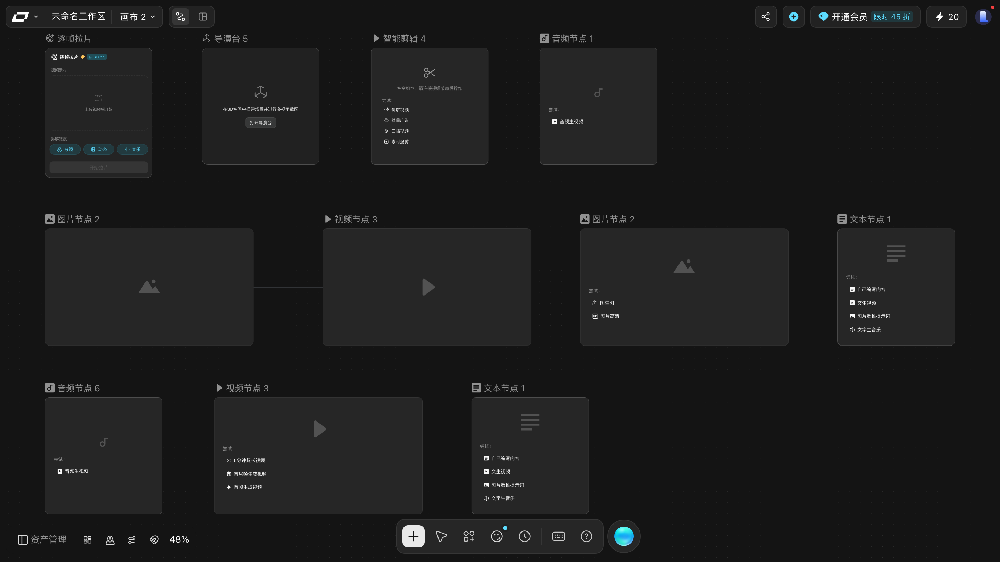
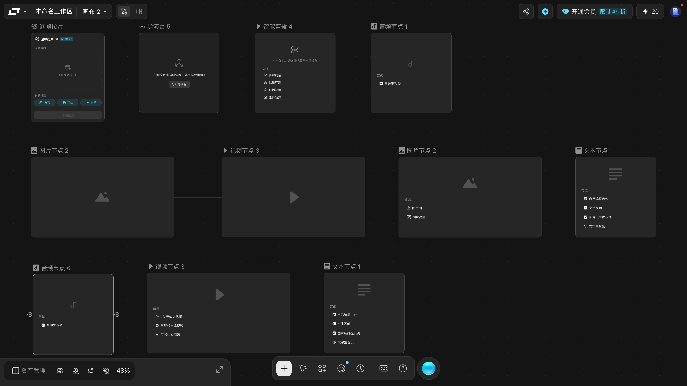
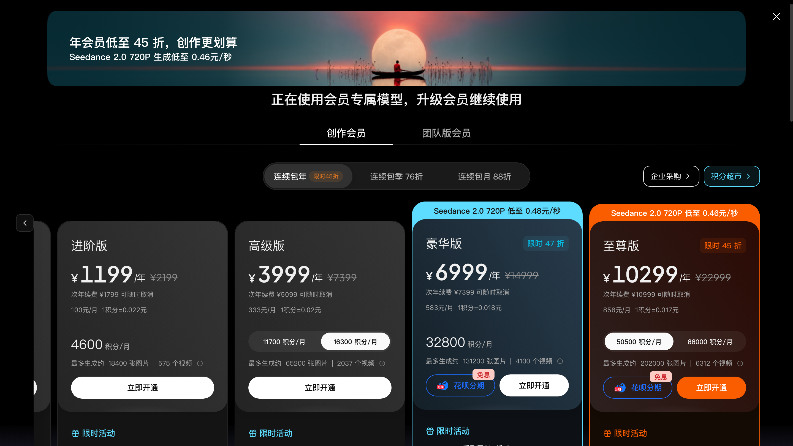
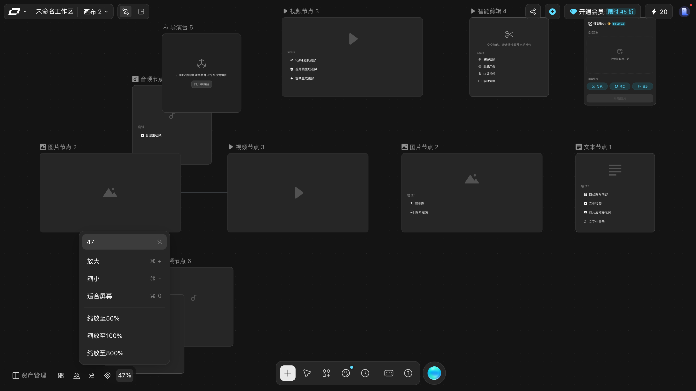

# 参考表

按「查东西」组织，不讲流程。所有文案逐字取自真实界面。

---

## 完整快捷键

四组，来自画布内「快捷键」面板。macOS 键位；Windows 对应 `Ctrl` / `Alt` / `Shift`。

### 创作

| 动作 | 键 | 验证 |
|---|---|---|
| 成组 | `⌘G` | ✅ 需先多选 |
| 合并分镜组 | `⌘⌥G` | ❌ 实按无反应；对应「转分镜组」按钮，本身是灰的 |
| 解组 | `⌘⇧G` | ✅ |
| 连线 | `⌘L` | ✅ 需先多选 |
| 复制节点和连线 | `⌘D` | ✅ |
| 生成 | `⌘Enter` | ⚠️ 会扣积分，没按 |
| 新建节点 | `Tab`（无 ⌘） | ✅ 只开「添加节点」菜单 |
| 节点复制 | `Option` + 拖动节点（无 ⌘） | ✅ 做了对照组：按住 `Option` 拖 11 → 12 个节点，裸拖 12 → 12 |
| 创建副本 | `⌘` `Option` + 拖动 | 📖 差一个 `⌘`，自动化按不住两个修饰键 |
| 框选 | `Shift` + 空白处左键拖 | ✅ 面板未列，实测可用 |

### 缩放

| 动作 | 键 | 验证 |
|---|---|---|
| 放大 | `⌘ +` | ✅ |
| 缩小 | `⌘ -` | ✅ |
| 适合屏幕 | `⌘ 0` | ✅ 是「框住所有节点」，不是重置到 100% |
| 触控板缩放 | 捏合手势 | 📖 |
| 鼠标缩放 | `⌘` + 滚轮 | ✅ 缩放 133% → 201%，左下角百分比同步 |

### 移动画布

| 动作 | 键 | 验证 |
|---|---|---|
| 移动画布（键盘） | `Space` + 左键拖 | ✅ 严格 1:1 跟手 |
| 移动画布（触控板） | 双指平移 | 📖 |
| 移动画布（鼠标） | 滚轮下拖 / **中键拖** | ✅ 中键拖实测 1:1 |
| 移动工具 | `V` | ⚠️ **单向**：`V` 只能从抓手切回移动，切不到抓手 |
| 抓手工具 | `H` | ✅ `H` 只能**进入**抓手，再按 `H` 无效（连按三次复现） |
| 整理画布 | `⌥⇧F` | ⚠️ **按钮有效（11/11 节点移动）、键盘按不出效果**，两次复现。分不清是键位没绑还是 macOS 吃掉 `⌥` |

### 其他

| 动作 | 键 | 验证 |
|---|---|---|
| 撤销 | `⌘Z` | ✅ |
| 重做 | `⌘⇧Z` | ✅ |
| 画布节点搜索 | `⌘F` | ✅ 输入框占位「搜索画布元素」 |
| 删除 | `⌫` | ⚠️ 需先让焦点回到画布 |

---

## 画布壳层控件

### 顶栏

| 控件 | 无障碍名 | 说明 |
|---|---|---|
| 项目名 | `项目名称` | 可编辑输入框；**所有画布共用同一个名字** |
| 画布切换 | 按钮正文 `画布 N` | 弹一个**可滚动的长列表**（容器 `212×220`，内部内容高 `2260`）。本账户实测 **28 张**画布，编号**不连续**（`画布 2`~`画布 8`、`画布 44`~`画布 63` + `手册取证画布`）—— 中间的号是被删掉的画布，**编号不回收**。只看首屏会以为只有二十来张 |
| 工作流 / 故事板 | `工作流` `故事板` | 视图切换 |
| 发布与分享 | `发布与分享` | 见 [10-tasks/share-canvas.md](10-tasks/share-canvas.md) |
| 积分超市 | `积分超市` | 充值入口 |
| 余额 | — | 顶栏显示当前积分 |

### 顶栏「正在跟随」横幅

画布加载完成后约 **4 秒**，顶栏**正中**会挂出一条通知条（贴顶居中，不是底部状态条）：

| 位置 | 实测 |
|---|---|
| 容器 | `174×34`，`fixed left-1/2 top-0 z-[305] -translate-x-1/2`，class `flex items-center gap-2 rounded-b-xl border px-3 py-1.5 text-white shadow-md pointer-events-none` |
| 正文 | `正在跟随`（`span.text-sm`，`56×20`） |
| 退出钮 | 白色胶囊 `64×16`，无障碍名 **`退出跟随`**，按钮里是 `取消` + 一个 `ESC` 键帽 |
| 副标 | `按 ESC 退出`，`absolute left-1/2 top-full z-10 mt-2`，`82×24`，`pointer-events-none` |
| 悬停退出钮 | **读不到任何气泡**（阳性对照：同一手法悬停顶栏「工作流」图标能读出「工作流」） |

**它不是一次性的提示。** 全新浏览器会话打开画布、一次故事板都没点，它就已经在；
静置 55 秒不消失；切到故事板、切回工作流、把 TV Director 抽屉收起来，位置和内容都不变。

> ### ⭐⭐ 「它到底什么时候才显示」—— 已排除的范围（2026-10 复核）
>
> 早先的猜测是「它由动画驱动，所以总在」。本轮换了个方向：
> **既然它是页面级的一层，那就去戳页面，看能不能把它点亮。**
> 累计 `opacity` 沿祖先链连乘（`opacity` 不继承，只量自己必然读出假的 0/1）：
>
> | 戳了什么 | `z-[305]` 累计 opacity | `z-[180]` 累计 opacity |
> |---|---|---|
> | 开屏未交互 | `0` | `0` |
> | 空白处**左键拖拽**（画选区）按下 / 拖到 `(180,120)` / 松手 | `0` / `0` / `0` | `0` / `0` / `0` |
> | **`Space` + 拖**（平移）途中与松手 | `0` / `0` | `0` / `0` |
> | **中键拖**途中 | `0` | `0` |
> | 点顶栏 `故事板` → 点回 `工作流` | `0` / `0` | `0` / `0` |
> | 打开「资产管理」面板 | `0` | `0` |
> | 静置 15s / 30s / 45s / 60s | `0` × 4 | `0` × 4 |
> | 另一个**全新会话** | `0` | `0` |
>
> ⇒ **12 次采样，一次都没亮过。** 两层都是。
>
> ⭐⭐ **Batch DG 补一条：那两层不是「等触发」，它们一直都在。**
> 把画布**基线状态**（刚进页面、什么都没点）下的**所有 `position: fixed` 层**枚举一遍，
> 只有 **4 个**，两层**都在里面**：
>
> | z | 尺寸 | 里面是什么 |
> |---|---|---|
> | `305` | `[633,0,174,34]` | 逐字 **`正在跟随` / `取消`+`ESC` / `按 ESC 退出`** |
> | `180` | `[0,0,1440,810]` | **空**（无文字、无子元素） |
> | `20` | `[571,748,299,50]` | `TV Director` 胶囊 |
> | `10` | `[8,758,274,40]` | `资产管理` + 缩放百分比 |
>
> 再戳 4 个动作（`ESC` 关广场 / 开资产面板 / 选中节点 / 点 `⤢` 开大编辑器），
> 固定层**始终是这 4 个、z 值一个没变**。
>
> ⚠️ **所以上面那张表问的是「亮不亮」，不是「在不在」** ——
> 两层是**常驻的空壳**，`opacity: 0` 而已。
> **问「在不在」的答案是「一直在」；问「什么时候亮」的答案仍然是「12 种都试过，没亮」。**
> 两问不能混：把常驻层的 `opacity: 0` 读成「没这个层」，正是本手册栽过的坑
> （工作账本 `AUDIT.md` 里「元素在 DOM 里 + 有尺寸 + opacity=1 ⇒ 可见」那条反例）。

> ### ⚠️⚠️ 本手册的**无头浏览器会关掉所有动画** —— 影响每一句「有没有动画」的结论
>
> ⭐⭐ **`z-[180]` 的 class 是**：
> `pointer-events-none fixed inset-0 z-[180] motion-safe:transition-opacity motion-safe:duration-200`
> —— 它明确要求「**在支持动画时**、用 `200ms` 过渡 `opacity`」。
>
> ⭐⭐ **但在这个测试环境里算出来是 `transition-duration: 0s`。** 原因已实测坐实：
>
> | 读数 | 无头默认 | 用 CDP 覆盖成 `no-preference` 之后 |
> |---|---|---|
> | `prefers-reduced-motion: reduce` | **`true`** | `false` |
> | `z-[180]` 的 `transition-duration` | **`0s`** | ⭐ **`0.2s`** |
> | `z-[180]` 的 `transition-property` | `all` | ⭐ `opacity` |
>
> ⇒ `motion-safe:` 编译出来是 `@media (prefers-reduced-motion: no-preference)`，
> 而**无头 Chrome 默认报 `reduce`** ⇒ **整条规则不匹配**。
>
> ⚠️ **这条的影响面比 `z-[180]` 大得多**：
> **本手册所有用无头浏览器做的「这个元素没有动画 / 淡入淡出读不出来」类结论，
> 都不能直接当产品事实** —— 在正常桌面浏览器里，那些过渡**是存在的**。
> 本手册**尚未**因此作废哪一条具体结论（此前量的是 `opacity` 最终值，不是过渡时长）；
> 但**今后**凡是要断言「某处有/没有动画」，必须先覆盖 `reduced-motion` 再测。
>
> ⛔ 顺带说明一处**看起来矛盾、其实不矛盾**的地方：
> 早先那一轮也用 `no-preference` 重开过，结论是「横幅的 `opacity` 仍然是 `0`」。
> 那测的是 **`z-[305]` 的 `opacity`**；本轮测的是 **`z-[180]` 的 `transition-duration`**。
> **两个不同的量** —— 前者仍成立（横幅确实一直透明），后者才是被 reduced-motion 影响的。
>
> ⭐⭐ **但「是不是 reduced-motion 让它们不亮」这个猜测，本轮实测证伪了。**
> 覆盖成 `no-preference` 之后，用**同一套 7 个动作**再逐个量**祖先链 opacity 连乘**：
>
> | | `z-[180]` 累计 opacity | `z-[305]` 累计 opacity |
> |---|---|---|
> | `reduce`（默认）下 7 个动作 | 全部 `0` | 全部 `0` |
> | `no-preference` 下 **同一套** 7 个动作 | **全部 `0`** | **全部 `0`** |
>
> 7 个动作是：基线 / 空白处左键拖画选区 / `Space`+拖平移 / 点 `⤢` 开大编辑器 /
> `ESC` 关大编辑器 / 开资产面板 / `ESC` 关资产面板。
> ⛔ **两次都是一次都没亮过** ⇒ **reduced-motion 不是它们不亮的原因**，
> 这两层需要**别的条件**才会亮，而那个条件**仍未找到**（已排除 14 种状态）。

>
>
> ⛔⭐ **顺手证伪了一个很像的假设**：早先猜那个铺满视口的 `z-[180]` 空层是
> 「**画框选时的选区高亮**」—— **不成立**。左键拖拽画选区时它的累计 opacity 恒为 `0`；
> 而且全页搜 `selection` / `marquee` / `rubber` / `lasso` 之类的类名，**0 命中**。

> ### ⭐⭐⭐ 找到了：这两层是**多人协作的跟随功能**（Batch DO 结案）
>
> 上面那句「触发条件仍然未知」**到此作废**。 DG 那两轮只在 DOM 祖先链和内嵌 payload 里找过，
> **从没翻过 JS 源码** —— 换成去页面加载的 **152 个 JS chunk**（19 MB）里搜字面量，一次就搜到了：
>
> | 层 | 源码里的 `data-testid` | 它是什么 | 实测读数（未激活状态） |
> |---|---|---|---|
> | `z-[180]` | `collab-follow-border` | ⭐ **跟随边框**：跟随时在**画布四周**画一圈彩色框 | `1440×810` `fixed` `inset-0` `opacity:0` `pointer-events:none` `aria-hidden=true` |
> | `z-[305]` | `collab-follow-banner` | ⭐ **顶部跟随横幅** | `174×34` `@633,0`（**视口正中**）`opacity:0` `inert` |
>
> ⭐⭐ 横幅里的文字逐字读到了：**`正在跟随`** · `取消ESC`（一枚 `aria-label="退出跟随"` 的按钮）
> · **`按 ESC 退出`**。⇒ **跟随时按 `ESC` 就能退出**，不需要找菜单。
> ⭐ 边框那个 `1440×810` **就是整个视口大小**（源码 `inset-0` + `inset 0 0 0 4px ${对方颜色}`）
> ⇒ 它是**套住整张画布的一圈高亮框**，颜色取自被跟随者的标识色。
>
> ✅ **DG 批次那条「它们从基线起就一直都在」的读数是对的**，现在也解释了为什么：
> 两个元素都是 `pointer-events-none fixed` + `style.opacity = +!!active` ——
> **常驻挂载、只靠 opacity 显隐**，所以「一直在 DOM 里」是设计如此，不是没渲染。

> ### 「跟随」跟随的是什么：**别人的视角**

> 源码里这组文案把话说全了（**31 条，全部是界面上真实会出现的字**）：

> | 场景 | 界面文案 |
> |---|---|
> | 跟随时 | `正在跟随 @{name}` · `已开始跟随` · `正在定位` |
> | **退出** | ⭐ `按 ESC 退出` · `退出跟随` · `已停止跟随` · `已退出跟随` · `已退出跟随@{nickname}` |
> | 出状况 | `协作连接已断开，跟随已停止` · `对方暂不可跟随或网络异常，已退出跟随` · `@{nickname} 已离开` |
> | 边界情况 | `@{nickname} 正在跟随你，无需再跟随 TA` |
> | 谁能跟随 | ⭐ `跟随 {name} 的视角` |
> | 同节点冲突 | ⭐ `该节点正在被其他用户编辑` · `{context}正在被「{name}」编辑` · `{context}暂时不可编辑，协作状态正在同步，请稍候重试` |
> | 在线成员 | `协作者 · {count}` · `协作者：{count} 人` · `暂无其他协作者在线` · `正在加载协作成员…` · `未连接` · `连接不稳定` |
> | 入口与席位 | `邀请协作` · `升级团队版解锁更多协作能力` · `增加席位` |
> | 会话与同步 | `协作会话已过期` · `此协作画布已在其他标签页打开` · `协作画布会实时同步，无需手动全量保存` |

> ⇒ **跟随 = 实时看别人正在编辑的那张画布**（多人协作功能）。
> 早先那句「它和 TV Director 面板同时开屏就有」纯属巧合，**两者无关**。
>
> ⛔ **本手册是单人测试，所以这套东西从来没被激活过**（需要两个人同时编辑同一张画布）。
> 上面关于**形态**的读数（尺寸、位置、文案、怎么退出）**是实测的**；
> 关于**激活后长什么样**的部分只能标 📖。
>
> ⭐ **可信阴性：界面上没有协作入口。** 全视口枚举 `aria-label` 按钮 19 个，
> **没有一个是协作相关的**；扫全页「协作 / 跟随 / 邀请协作 / 协同 / 实时同步 / 团队 / 席位」，
> 可见文字 **0 命中**。⚠️ 阳性对照：同一轮扫出了 `退出跟随` 那枚按钮
> （就在视口里，只是 `opacity:0`）⇒ **扫描方法本身是有效的**。
> ⇒ 与源码吻合：协作挂在**团队版席位管理**下（`TEAM_SEAT_MAX_COUNT`、`增加席位`），
> 本账户不是团队版，所以没有入口。

> ### ⚠️ 为什么这一节没有配图
>
> ⭐ 取证时发现：这条横幅**挂载了，但一直是透明的**。它的外层容器由动画驱动 `opacity`，
> 本手册在**两张**画布上、从加载完成一直采到 20 秒，累计 `opacity` **一次都没大于 0**
> （其中一整轮还专门用 `prefers-reduced-motion: no-preference` 重开过，结果仍是 `0`）。
>
> 也就是说：**本手册从头到尾没有亲眼见过它亮起来**，能给出的只有 DOM 层面的结构。
> **拍不到的东西不配图** —— 与其放一张「顶着这条横幅但横幅根本没出现」的图误导人，
> 不如把结构写清楚、把未知标出来。
>
> ✅ **现在知道它为什么一直不亮了**：`opacity: +!!active`，而 `active` 来自**协作状态**，
> 单人测试永远是 `false`。**一直透明不是 bug —— 是没人跟你一起编辑这张画布。**

> ### ⭐ 更正：早先把它记成「底部状态条 / `故事板 正在跟随`」，两处都错
>
> ① **位置错**：它在**顶栏正中**（`top-0` 居中），不在底部。
> ② **文案错**：这条横幅里**没有「故事板」三个字**。逐字拆开只有
> `正在跟随`（`span.text-sm`）· `取消`+`ESC`（一枚 `aria-label="退出跟随"` 的按钮）·
> `按 ESC 退出`（`absolute top-full` 的副标）。早先那行是把附近的文字并进一行读的。
> ③ **因果错**：早先记的是「点故事板 → TV Director 跟着出来」，
> 实测**开屏就有**，跟切视图无关。详见
> [10-tasks/storyboard-mode.md](10-tasks/storyboard-mode.md#tv-director-面板不是「点故事板」带出来的)。

### 底部中央工具条

| 无障碍名 | `data-sidebar-btn` | 说明 |
|---|---|---|
| `添加节点` | `add-node` | 打开「添加节点」面板（`Tab` 同效） |
| `移动` / `抓手工具` | `tool-mode` | 同一枚按钮，`H` 在两态间切换 |
| `素材库` | `open-asset` | 打开素材库面板 |
| `角色造型室` | `character-library` | 打开角色造型室（全屏浮层，Esc 关不掉） |
| `生成历史` | `history` | 打开生成历史 |
| `快捷键` | `keyboard` | 打开快捷键面板 |
| `教程` | `contact` | ⚠️ 实为联系入口，不是教程中心 |
| `TV Director` | `data-guide-target=agent-entry` | 打开 TV Director 抽屉（蓝色圆钮） |

### 底部左工具条

五枚，从左到右的**真实坐标**（`1440×810` 视口，元素框 `28×28`，`y=764`；最左边还有一枚带文字的 `资产管理`）：

| # | 无障碍名 | 左上角 | 宽 | 实测行为 |
|---|---|---|---|---|
| 0 | `资产管理` | `(61,764)` | 94 | **唯一带文字**的一枚，不是开关 |
| 1 | `整理画布，Option+Shift+F` | `(112,764)` | 28 | 动作按钮，不是开关；**没有开关那种状态** |
| 2 | `切换小地图` | `(144,764)` | 28 | 开关，**用高亮表达状态**，能来回切 |
| 3 | `隐藏节点连线` | `(176,764)` | 28 | 开关，**用文案改名表达状态**，能来回切 |
| 4 | `网格吸附` | `(208,764)` | 28 | ⚠️ 本轮**点了没有任何可观察变化**，见下 |
| 5 | `缩放选项` | `(240,764)` | 36 | 弹缩放菜单，按钮正文就是当前百分比 |

#### ⭐ 同一排按钮用了**两种不同的方式**表达开关状态

这是本轮最容易踩的坑，单独记一笔：

| 按钮 | 开启时的表现 | 关着的表现 |
|---|---|---|
| `切换小地图` | class 多出 **`bg-canvas-controls-active`**，背景 `rgba(255,255,255,0.15)` | class 干净，背景 `rgba(0,0,0,0)` |
| `隐藏节点连线` | 无障碍名**变成 `显示节点连线`** | 无障碍名是 `隐藏节点连线` |

- `隐藏节点连线` 实测往返：点一下，**连线元素从画布上真的消失**
  （`.react-flow__edge` 从 1 条变 0 条、内部 `path` 从 2 个变 0 个），无障碍名变 `显示节点连线`；
  再点一下全部回来（1 条 / 2 个），名字也变回去。
- 两枚**都没有** `aria-pressed`。
- ⚠️ **正因为它靠改名而不是靠高亮**，按名字找它的脚本在点完之后会「找不到」——
  这不是 bug，是脚本还在找旧名字。

> ⚠️ **看背景色判断开关状态是不可靠的。**
> 鼠标点完还停在按钮上时，悬停样式会把背景染成 `rgba(255,255,255,0.1)`，
> 跟「开启」只差 `0.05` 的透明度，肉眼和正则都分不开。
> **可靠判据只有两个**：class 里有没有 `bg-canvas-controls-active`，
> 或者**无障碍名有没有改名**。而且回读之前**必须先把鼠标移开**。

#### ⚠️ `网格吸附`：点了没有任何可观察变化

本轮把这枚按钮反复试过，**三种触发方式**（坐标点击 / DOM `el.click()` /
手动派发 `pointerdown`+`mousedown`+`pointerup`+`mouseup`+`click`）**全都无效**：

| 观察项 | 点之前 | 点之后 |
|---|---|---|
| 无障碍名 | `网格吸附` | `网格吸附`（没改名） |
| class 里的 `bg-canvas-controls-active` | 无 | **无** |
| 背景色 | `rgba(0,0,0,0)` | `rgba(0,0,0,0)` |

用业务判据再验一次也不成立：点它之后拖一个节点，
请求位移 `(+37, +28)`，实际落点 `(+34, +25)` —— **不是 4 / 8 / 10 / 20 任何一种网格步长的整数倍**，
也就是**没有发生吸附**。

作为对照，同一排的 `切换小地图` 用完全相同的代码点一下就开了。

> 📖 **本手册的结论是「在这张画布上，点它没有用」，而不是「这个功能不存在」。**
> 「格子太小看不出来」这个解释已经**被排除**：本轮把画布放大到 **83%**
> （行内相邻节点的间距从 226px 变成 **640px**）重试，结论完全一样 ——
> 按钮依然无变化，拖动请求 `(+37,+29)`、落点 `(+34,+27)`，对 640 的步长取模仍是 `34,27`。
> 唯一没排除的可能是它在**别的画布 / 别的项目设置**里才生效。

### 连接口与连线

| 元素 | 读法 | 实测 |
|---|---|---|
| 端口（入口） | `[data-handleid="target"]` | 贴节点**左边界**，class 含 `react-flow__handle-left` `connectable`，光标 `crosshair` |
| 端口（出口） | `[data-handleid="source"]` | 贴节点**右边界**，class 含 `react-flow__handle-right` `connectable`，光标 `crosshair` —— ⚠️ **`逐帧拉片` 的出口是 `grab`** |
| 端口数量 | 每个节点 2 个 | 11/11 个节点都是 |
| ⭐ 端口的可见标记 | **默认 `opacity: 0`（看不见）** | 完整 `innerHTML`（684 字）：外层 0×0 → 内层 **`80×80` 圆形**（`pointer-events:auto`，就是可点区）→ 再内层 **`20×20` 图标**（一个 `circle` + 一个加号 `path d="M10 6.5v7M6.5 10h7"`），**该图标 `opacity:0`**，且被 `transform: translate(25px,0)` 从圆心往外推。⚠️ **`opacity` 不继承** —— 读 `<svg>` 自己的 `getComputedStyle().opacity` 恒为 `1`，要读**它父级那个 `20×20` 的 DIV** |
| ⭐ 端口什么时候看得见 | **鼠标指到它那一带，或节点被选中** | 亮起来时是个 **`⊕` 圆圈**（圆圈里一个加号）。四态实测：鼠标停画布角落 `0` / 悬停**别的**节点的口 `0` / **悬停本节点的口**（没点）`1` / 已选中 `1` —— **逐节点点亮**，不是全局开关 |
| ⭐ 端口的真实可点范围 | 端口元素**本身 `0×0`**，真正能点的是**套在里面的 `80×80` 透明圆形** | 所以节点左右边缘往外一带的 80 像素都起得了线，不必精确对准小圆点 |
| ⭐ **连线的两端** | **`aria-label="Edge from <源id> to <目标id>"`** | ⚠️ `.react-flow__edge` 上**没有** `data-source` / `data-target`；`data-id` 是随机串（`e-5U2jB82fuL`），**从 path 的 `d` 坐标反推距离 969~1325 全错** |
| 连线其他属性 | `data-testid="rf__edge-<id>"` · `role="group"` · `aria-roledescription="edge"` · `tabindex="0"` | class `react-flow__edge react-flow__edge-default nopan selectable` |
| 连线的可点范围 | `stroke: rgba(0,0,0,0)`（**透明**）+ `stroke-width: 20px` | 线条本身看不见，是靠 **20 像素宽的透明描边**撑出可点区域 |
| 拖动中的临时连线 | `data-id="__temp_connection_edge__"` | 松手成功变正式连线；**失败会自己消失，不落盘**（本轮 DOM 数到 2 条、刷新后仍是 1 条） |
| 智能剪辑连上视频之后 | 面板**多出一张带序号「1」的视频缩略图**（角标 `14×14`），出现在 `参考` 按钮正下方；**卡片上那句「空空如也，请连接视频节点后操作」一字不变** | ⭐ 连线本身**确实落盘**（刷新后 `Edge from v-v2hlWY4Br3 to v-oZNpH99MtM` 仍在）。✅ **因果已做成可逆对照**：断掉连线（`2 → 1`）→ 缩略图从面板正文里消失；再接回来 → 重新出现。⚠️ 判读门道：这块面板**盖在画布上、不在节点卡里**，所以角标坐标落在节点矩形**外面**（`[750,282]` vs `[979,55,169,169]`）——**别拿「是否落在节点矩形内」当判据** |
| 连线的断法 | ① 悬停 → 点中点那枚**剪刀**（`div.scissors-enter`，只在悬停时挂载）② **点选**连线后按 `Delete` / `Backspace` | 两条都实测能断（连线数 −1），**都没有二次确认**。⭐ 断了按 `⌘Z` 能**原样接回来**；断完刷新**不会自己回来**（真断了） |
| 组的真身 | `.react-flow__node-group`，`data-id="g-…"` | ⚠️ class 是 **`react-flow__node-group`**，**不是** `react-flow__group`（写错就找不到）。组操作条逐字：`整组执行` / `添加到工具箱` / `转分镜组` / `解组` + 组名 `Group 1` |
| 成组后底部计数 | **`共 N 节点` = 真节点数 + 组数** | 建组前 `共 11 节点` → 建 1 个组 `共 12 节点` → 建 2 个组 **`共 13 节点`**，**每个组各算一个节点** |
| `收起全部分组` | ✅ 实测有效：组内成员**从抽屉列表里消失**，只留组名一行 | 组名行左侧箭头由 `⌄` 变 `›`，前缀一枚**文件夹图标** |
| `展开全部分组` | ✅ 实测有效：成员**缩进**回到组名下面 | 可逆对照做过：收起 → 展开后列表与起点**逐项一致** |
| ⭐ **组行左侧那枚箭头** | ⭐ **「只展开这一个组」的开关，实测成立** | 必须造**两个互不包含的组**才测得出：两个都收起后点 A 的箭头，B 的成员**不回来**；再点一次 A 会**收回去**。它是最左一枚 `24×24` 图标、`cursor:pointer`、**无文字**（`innerText` 搜必然 0 命中）。⚠️ 转向的**机制没定位**：`<path d>` 点前点后逐字相同，`svg` 与外层 `span` 的 `computed transform` 都是 `none` |
| ⛔ **断开连线** | **本手册没找到入口** 📖 | `⌘L` **只证实能加线**（`0 → 1`），**断不了**：上游 / 下游 / `Shift` 双选 / 点中连线 / 连按两次 / `⌘⇧L` / `⌘⌥L` / `⌥L` 共 **8 种条件**实测连线数全部不变。⚠️ 点中连线**确实会进选中态**（`.react-flow__edge.selected`），只是按 `⌘L` 无效。一次读到过 class 含 `scissors` 的悬停元素，**换一轮读不到**（`[class*="scissors"]` 实查 0 个），**不能作为断线依据** |
| 智能剪辑参数面板 | `[660×248]`，逐字：`参考` · `1` · `描述想剪成什么效果` · `默认模式` · `16:9 · 720P · 30s` | ⭐ **不连线也能打开、也能编辑**。`16:9 · 720P · 30s` 那枚带 `data-practice-anchor="gen.params.count"`；生成按钮 **`aria-label="发送"`**（五类节点里唯一给生成按钮写了这个名的） |
| ⭐⭐⭐ **产品自己贴的功能锚点**（画布默认状态下全页枚举所有名字含 `feature` / `practice` / `anchor` 的 `data-*`） | 命中 **14 个元素、去重后只有 5 个取值**，分属**三个不同的属性家族** | ⭐ **认控件的第四招**：此前只靠 `aria-label` / 悬停气泡 / 图标 path，**没看过产品自己的锚点属性**。⭐ 先**全页枚举**再认领 —— 枚举出来才发现属性分三家、其中一家的数量恰好等于节点数 |
| └ `data-academy-guide-anchor`（教程引导锚点） | `storyboard-mode` ×1（顶栏故事板切换）· `workspace-asset-management` ×1（左下「资产管理」）· **`agent` ×1（只在故事板视图下出现，挂在 TV Director 那张 `398×586` 的引导卡上，卡里逐字写着「让 TV Director 辅助你的无限」）** | 同一个 `agent` 值只在切到故事板后才在 DOM 里 |
| └ `data-quick-guide-anchor`（快速引导锚点） | `node-add-handle` **×11** —— 每个节点一枚的连接把手，`9×9` 的 `div`，**无文字、无 aria** | ⭐ **11 恰好等于节点数** ⇒ 「每个节点都有出口」有了机械证据 |
| └ `data-practice-anchor`（练习锚点） | `director.open` ×1（「打开导演台」按钮） | 智能剪辑面板那枚 `16:9 · 720P · 30s` 带的是 `data-practice-anchor="gen.params.count"`。⭐ **大编辑器里它成对出现**：`gen.model` ↔ `generator-model-select`、`gen.submit` ↔ `generator-submit`，同一语义两套拼写 |
| ⛔ **`data-practice-generator-lock` ≠ 「锁定按钮」** | ⭐ 它**同时挂在两枚功能完全不同的按钮上**：大编辑器底栏的 **`文A`（hover 气泡逐字「翻译提示词」）** 和它右边的**滑块**。两枚的值都是空字符串 | ⭐⭐ **属性名会骗人。** 一枚按钮「有某个属性」**不等于**「这个属性描述了它」。属性只能用来**缩小候选范围**，认按钮仍要靠气泡 / 图标 path。⚠️ 滑块那枚点下去本手册**没测出可见变化** —— 只读到**底栏 7 枚整体上移了 85px**，机制没定位 |
| ⭐ `data-camera-control-icon` | `"light"` / `"dark"` 各 1 —— 就是那枚**镜头球**里的**两枚 ``** | ⭐⭐ **更正**：早先记「那颗球是 CSS 背景画的」**是错的**。它里面是**两枚真图片**（亮 / 暗两套，用 `canvas-light:block … dark:hidden` 切换），产品自己给贴了名字 |
| ⭐ `data-sidebar-btn` | `add-node` `tool-mode` `open-asset` `character-library` `history` `keyboard` `contact` —— 正好是画布左下工具条那 **7** 枚 | ⭐ 和 `node-add-handle ×11 = 节点数` 同一路证据：**产品自己贴的名字，数量对得上肉眼数得出来的东西**。⚠️ ⭐⭐ **但属性值不等于产品文案**：最后那个 `contact`（联系）的真名是 **`教程`** |
| ⭐ `data-node-focus-surface` ×11 · `data-handleid` / `data-handlepos` ×22 | `data-node-focus-surface="true"` **11** 个 = 11 个节点；`data-handleid="target"` + `data-handlepos="left"` 各 **11**，`data-handleid="source"` + `="right"` 各 **11** | ⭐⭐ **连线把手有三套身份**：这套 `data-handleid` 的把手实测**宽高都是 0**（在 DOM 里、屏幕上不可见），真正能看见能拖的是另一套 `9×9` 的 `data-quick-guide-anchor="node-add-handle"`。见 [10-tasks/connect-nodes.md](10-tasks/connect-nodes.md) |
| ⛔ 哪些面板**没有**新锚点 | 资产管理 · 抽屉里的「资产」页 · 角色造型室 · 快捷键面板 · 底栏「帮助」—— **逐个打开后差分，新增都是 0 个** | ⭐ 这个阴性**自带阳性对照**：同一套手法在切故事板时确实新增了 1 个（`agent`），所以「新增 0」是读出来的，不是没扫 |
| `data-feature-id` | ⛔ **画布默认状态下 0 个**。它**只出现在节点大编辑器里** —— 例如那枚「预设」按钮带 **`data-feature-id="generator:preset-menu"`** | ⇒ 想用这个属性认控件，得先把大编辑器打开 |

### 组操作条（成组后浮出）

组被选中时浮现在组上方，7 个动作**不是 `<button>`，是 `div` / `span`**，中间夹 2 条竖分隔线：

| 顺序 | 文案 | 实测状态 |
|---|---|---|
| 1 | 颜色圆点 | ✅ 展开 5×2 = 10 色色板，选中后组框色 / 底色 / 标签底色同步变 |
| 2 | `⊞˅` 排列 | ✅ 菜单 3 项：宫格排列 / 水平排列 / 垂直排列，三种都实测让节点重排 |
| 3 | `整组执行` | 可用 ⚠️ 会跑生成扣积分，本手册没点 |
| 4 | `添加到工具箱` | ✅ 打开「创建新工具箱 / 更新工具箱」双标签弹窗 |
| 5 | `转分镜组` | ❌ **灰**（`opacity: 0.45`），点击无反应 |
| 6 | `解组` | 可用 |
| 7 | `批量下载`（`⬇`） | ❌ 灰（`opacity: 0.45`，组内无产物时） |

组节点默认名为 `Group 1`。成组后**不要按 `Esc` / `⌘0` / `⌘-`** —— 这三个都会清掉组的选中态，
组操作条会整个从 DOM 消失，后面就找不到任何按钮了。想平移画布请用 `Space` + 拖。

### 空画布提示与快捷芯片

`双击画布 自由生成节点`
`图片生成` `视频生成` `音频生成` `剧本生成` `智能剪辑`

### 生成历史面板

底部工具条「生成历史」打开的大面板：

| 区域 | 内容 |
|---|---|
| 标题 | `生成历史` |
| 右上 | 视图切换（网格 / 列表）+ 缩放滑杆 + `×` |
| 范围 | `全部画布` / `本画布` |
| 类型 | `图片 {n}` `视频 {n}` `音频 {n}` |
| 右列 | `所有评级 ▾` `时间倒序` `批量操作` |
| 空状态 | `暂无历史记录` |

### 底部工具条完整清单

两段。**每一枚都有无障碍名**（视口 `1440×810` 下的实测坐标）：

| 无障碍名 | 坐标 | 尺寸 | 备注 |
|---|---|---|---|
| `资产管理` | `(61,778)` | `94×28` | **唯一带文字**的一枚 |
| `整理画布，Option+Shift+F` | `(126,778)` | `28×28` | 快捷键直接写进 aria |
| `切换小地图` | `(158,778)` | `28×28` | |
| `隐藏节点连线` | `(190,778)` | `28×28` | |
| `网格吸附` | `(222,778)` | `28×28` | |
| 缩放选项 | `(262,778)` | `44×28` | **唯一正文就是百分比**的一枚（`100%`） |
| `添加节点` | `(596,773)` | `32×32` | 就是那个 `+`；面板打开时变 `×` |
| `移动` | `(636,773)` | `32×32` | 抓手工具 |
| `素材库` | `(676,773)` | `32×32` | **独立入口**，不经过「+」 |
| `角色造型室` | `(716,773)` | `32×32` | |
| `生成历史` | `(756,773)` | `32×32` | |
| `快捷键` | `(805,773)` | `32×32` | |
| `教程` | `(845,773)` | `32×32` | 实为联系入口 |

右半段（属于 TV Director 抽屉的输入区）：
`添加附件`(1058,756) · `全能创作 / 选择创作模式`(1118,756) · `选择模型`(1177,756) ·
`Skill`(1212,756) · `手动生成`(1247,756) · `Send`(1390,756)

> ⚠️ **别再按「无名图标按钮」去筛这一排了** —— 十三枚里**每一枚都有 aria**。
> 早期取证脚本筛「`innerText` 为空且无 `aria`」，结果**一枚都筛不出来**，
> 还会拿到同一排里的邻居（比如把 `快捷键` 当成 `+`）。
> 这一列的 aria 就是最稳的定位方式。

### 我的工具箱

素材库面板 →「打开工具箱」。网格排布的镜头运动预设，标题一律以 `【预设】` 开头，
每张卡片有 `使用` 按钮。弹层右上 `?` 与 `×`。

### 资产管理抽屉

左下角「资产管理」滑出的左侧抽屉，两个标签：

- **`画布`**：逐行列出画布上的每个节点，每行 `定位到节点 {名}` + `更多操作`；底部 `共 N 节点` 与 `←` 收起。
- **`资产`**：工具行 **五枚** `🔍 搜索` / `⊹ 批量操作` / `≔ 筛选` / `+ 创建` / `📁 管理`；
  空状态 `暂无资产` + `创建默认资产分类` + `上传资产`。
  底部 `共 N 节点` **仍然数的是整张画布的节点**，跟当前标签无关。

#### 「资产」标签里那些实测出来的坐标

| 控件 | 坐标 | `aria-label` | 实测 |
|---|---|---|---|
| 🔍 | `[8,146,32,32]` | `搜索` | 展开 `placeholder="搜索资产"` 的输入框 |
| ⊹ | `[44,146,32,32]` | `批量操作` | 进勾选模式，底部变「**已选择 0 项** 共 N 节点」 |
| ≔ | `[80,146,32,32]` | `筛选` | 面板：`重置` + `标签` 分组胶囊（`+ 新建标签` `角色` `场景` `物品` `风格` `音效`）+ `取消` / `应用` |
| `+` | `[203,146,32,32]` | `创建` | 下拉**两项**：`新建文件夹` / `上传资产` |
| 📁 | `[239,146,72,32]` | `资产管理` | **打开「资产管理」弹窗** `[72,80,1296,650]`，不是开关 |

> 💡 第五枚 `管理` 是**唯一一枚 72 宽**的，其余四枚都是 32 见方。

#### 「创建默认资产分类」建出来的是什么

建出来的是一个名叫 **`待分类资产`** 的**分类文件夹**，不是六个预置标签
（那五个标签 `角色` `场景` `物品` `风格` `音效` 本来就印在 `筛选` 面板和上传面板里）。

#### 资产行的八项菜单

行末那枚 `•••`（`aria-label="更多操作"`）点开：

| 菜单项 | 颜色 | `›` 子菜单 | 实测点开 |
|---|---|---|---|
| `添加到Agent` | `rgb(247,247,247)` | — | **空操作**：无新浮层 / 抽屉不变 / 节点 +0 |
| `添加到画布` | `rgb(247,247,247)` | — | **空操作**：同上 |
| `更改图标` | `rgb(247,247,247)` | ✅ | 「图标选择」面板：6×4 共 24 枚 + `清除` / `应用` |
| `新建子文件夹` | `rgb(247,247,247)` | — | 父分类下缩进一行输入框，**默认名全选并自动聚焦** |
| `移动到` | `rgb(247,247,247)` | ✅ | 📖 两轮读数不一致，没拿到稳定复现 |
| `下载` | `rgb(247,247,247)` | — | 对**空文件夹**不触发下载（等满 8 秒无 `download` 事件） |
| `重命名` | `rgb(247,247,247)` | — | **就地编辑** `[80,198,195,28]`，现值整段全选并自动聚焦 |
| `删除` | **`rgb(245,63,63)`** | — | 确认框，**正文插值文件夹名** |

> ⭐ **`删除` 是整份菜单唯一的红字**，扫颜色就能认出它。

#### 删除确认框

`删除文件夹` / `确定删除「{文件夹名}」吗？删除后不可恢复。` /
`取消`（半透明 `rgba(255,255,255,0.1)`）/ `删除`（实心红 `rgb(203,39,45)`）。

> ⭐ **它把文件夹名插值进正文** —— 不可恢复的删除前，读一眼框里的名字就知道在删哪一个。

#### 「上传资产」面板（`[361,146,718,527]`）

| 面板件 | 坐标 | 实测 |
|---|---|---|
| 虚线投放区 | `[385,219,410,430]` | 📖 没选过真文件 |
| 格式与体积提示 | `[385,611,410,38]` | `支持的文件格式 🖼 jpg/jpeg/png ▶ mp4 🔊 mp3`、`单个文件大小不超过 20MB` |
| `保存位置 *` | `[819,219,236,20]` | **必填**（红星 `*`） |
| `请选择文件夹` | `[819,247,236,36]` | **目录树**，就地展开在面板里；每行末一枚 `+` |
| `设置标签` / `请选择标签` | `[819,291,236,60]` / `[819,319,236,32]` | 五个预置标签 + `新建标签` |
| `保存` | `[1005,617,50,32]` | **`disabled=true`**，必填项没填就是灰的 |

> ⚠️ **`上传资产` 不是一按就弹系统选文件框** —— 它先弹这个表单让你**先定保存位置**，
> 再在虚线框里放文件。顺序是：填 `保存位置` → 选文件 → `保存`。

#### 「资产管理」弹窗

侧栏 `个人资产库`（本账号选中）/ `可灵主体库`；
主区工具条 `搜索` / `批量操作` / `筛选` / `+ 新建`；
主区每个分类一张文件夹卡片，**卡片下方写着创建日期**。

`可灵主体库` 下是六个标签 `全部` `人物` `场景` `道具` `特效` `其他`，
各 `50×28`、间距 62（`x = 329/391/453/515/577/639`，`y` 都在 `200`），
选中态 = 背景 `rgba(255,255,255,0.15)`。

> 📖 那枚 `创建主体` 按钮点了**毫无变化**（正文长度 `336 → 336`）。

### 小地图

`class="react-flow__panel react-flow__minimap bottom right"`，实测 `150 × 110`，
**实际渲染在左下角**（`x≈145`），会压住左工具条右侧的图标。

### 视口丢失提示

视口内一个节点都没有时，底部中央浮出：

`当前视窗没有节点` + 按钮 `返回节点` / `✕`

节点只在**视口内**才被渲染进页面；拖远后页面里一个节点都不剩，但 `⌘F` 仍能搜到全部节点。点「返回节点」可飞回。

---

## 画布下拉

| 元素 | 形态 |
|---|---|
| 分区标题 | `画布` |
| 新建 | 右上角加号按钮，`aria-label="新建画布"` |
| 行 | `aria-label="切换到画布 {名称}"` |
| 活动行 | 左侧带 `✓` |
| 行菜单 | `更多操作`，**悬停才出现** |

行菜单四项：`在新窗口打开` · `重命名画布` · `复制画布` · `删除画布`
重命名输入框：`aria-label="画布名称"`
删除确认：`删除画布` / `确定要删除画布「{名称}」吗？此操作不可恢复。` / `取消` `确认`

---

## 九类节点

| 节点 | 角标 | 「尝试：」模式 | 面板标题原文 |
|---|---|---|---|
| 文本 | — | 自己编写内容 / 文生视频 / 图片反推提示词 / 文字生音乐 | `文本节点 N` |
| 图片 | — | 图生图 / 图片高清 | `图片节点 N` |
| 视频 | — | 5分钟超长视频 / 首尾帧生成视频 / 首帧生成视频 | `视频节点 N` |
| 智能剪辑 | `Beta` | 讲解视频 / 批量广告 / 口播视频 / 素材混剪 | `智能剪辑 N` |
| 导演台 | `NEW` | —（卡片只有「打开导演台」） | `导演台 N` |
| 逐帧拉片 | `SD 2.5` | —（拆解维度：分镜/动态/音乐） | `逐帧拉片` |
| 音频 | — | 音频生视频 | `音频节点 N` |
| 脚本 | `›` 子菜单 | `脚本 NEW` / `脚本（旧版）Beta` | 📖 |
| 素材库 | `›` 子菜单 | `风格库` / `特效库` | 📖 |

---

## 各节点实测参数

> 以下全部取自真实界面，**未提交生成**。

| 节点 | 模型 | 规格串 | 花费（积分） | 其他控件 |
|---|---|---|---|---|
| 文本 | `GVLM 3.1` | — | `6` | 模式随「尝试」变 |
| 图片 | `Lib Image 2.5 Pro` | `16:9 · 标准画质 · 2K · 1张` | `15` | 参考/标记/风格/预设/摄像机/翻译提示词/`⚙`（参数条共 7 枚）；⚙ 打开后：智能引用 AutoLink 开关。**15 条预设工作流全部 `cursor: not-allowed`，悬停提示写明「仅支持 XX 模型」** |
| 视频 | `2.0` · `全能参考` | `16:9 · 720P · 5s · 1个` | `135` | 参考/标记/特效/角色库/运镜/`⤢`；⚙ 打开后：联网搜索 / 自动校验素材 / 智能引用 AutoLink 三个开关（默认全开） |
| 智能剪辑 | `默认模式` | `16:9 · 720P · 30s`（比例·分辨率·时长，固定 30s） | 📖 | 顶部只有 `参考` 一枚；参数条只有 3 枚；生成按钮 **`aria-label="发送"`**（五类节点里唯一有无障碍名的）；空态「空空如也，请连接视频节点后操作」 |
| 音频 | `Seed Audio 1.0` | `中文 · 24k · wav` | `1` | 字数 `0/2000`；顶部只有「参考」一枚；`⚙` 打开后：语速 `1.00`(0–2) / 声调 `0`(0–12) / 音量 `1.0`(0–10) 三个滑杆，**每条右侧带数值框** |
| 导演台 | — | — | 📖 | 仅「打开导演台」 |
| 逐帧拉片 | `SD 2.5` | — | 📖 | 上传视频后开始；拆解维度：分镜/动态/音乐；开始拉片 |

### 规格串的读法

`16:9 · 720P · 5s · 1个` = **比例 · 分辨率 · 时长 · 数量**（节点顺序不同，图片节点第二段是画质档）。

### 提示词占位文案（实测原文）

| 节点 | 占位文案 |
|---|---|
| 文本 | `写下你想讲的故事、场景或角色设定。例如：一个来自未来的机器人，在城市屋顶看星星。` |
| 图片 | `可直接文字生图，或上传图片输入文字指令对图片进行编辑，如：将背景改为雪夜` |
| 视频 | `描述你想要生成的画面内容，@引用素材` |
| 智能剪辑 | `描述想剪成什么效果` |
| 音频 | `描述你想要的音频效果，可用 @ 引用音频` |
| 逐帧拉片 | `上传视频后开始` |

### 模型与规格下拉的完整选项（实测，打开→读→Esc）

> 全部只读打开过，**一个都没改**。

#### 图片节点 · 模型（18 个）

每项后面是这个模型的**典型耗时**和一句官方说明：

| 模型 | 耗时 | 说明 |
|---|---|---|
| `Lib Image 2.5 Pro` | 30s | 精准生成与编辑，复杂指令稳定还原 |
| `Lib Image 2.5 Fast` | 20s | 极速高质量图像生成，兼顾效果与效率 |
| `Lib Image` | 60s | 最新图片模型、长文本能力突出 |
| `General image Pro` | 50s | 最强图片编辑模型，一致性好 |
| `General image V2` | 25s | 支持联网搜索、文字准确、速度更快 |
| `Seedream 5.0 Pro` | 20s | 精准交互式编辑，支持原生多语言排版 |
| `Qwen image 3.0` | 60s | 擅长复杂版面与精准文字的高质量生图模型（标 `上新`） |
| `Style Image V8.2` | 50s | 电影感全面升级，精准还原光影、人物与真实材质 |
| `Style Image V8.1` | 50s | 生图更连贯、细节更丰富、美学水准大幅提升 |
| `Style Image V7` | 50s | 最佳美学，电影质感，创意能力强 |
| `Style Image Niji` | 50s | 动漫高审美模型，风格多样 |
| `Seedream 4.6` | 20s | 提升人像一致性、平面设计效果 |
| `Seedream 5.0 Lite` | 20s | 支持联网搜索，擅长中式风格、审美提升 |
| `Seedream 4.5` | 15s | 多角度…（标 `限时5折`） |
| `Z-image Turbo` | 10s | 极速生成 |
| `Qwen Image` | 60s | Qwen 生图模型 |
| `Qwen Edit` | 60s | Qwen 系编辑模型 |
| `Seedream 4.0` | 15s | 极速高质出图 |

#### 视频节点 · 模型（33 个）

同样每项带**典型时长**与说明。只有 `Seedance 2.0` 标着 `VIP`，
末项 `Kling3.0 动作迁移` 是**灰的（禁用）**：

`Seedance 2.5` 2min · `Seedance 2.5（样片模式）` 1min · `Seedance 2.0` VIP 2min ·
`Wan 3.0` 3min · `Wan 3.0 Prime` 1min · `Minimax H3` 2min · `Minimax H3 Max` 30s ·
`Seedance 2.0 Fast` · `Seedance 2.0 Mini` · `Happy Horse 1.1` 3min · `Happy Horse 1.0` 3min ·
`Kling O3` 3min · `Kling 3.0 Turbo` 3min · `Kling 3.0` 3min · `Wan 2.7` 3min ·
`Kling O1` 3min · `Wan 2.6` 3min · `Hailuo 2.3 Fast` 1min · `Hailuo 2.3` 2min ·
`Kling 2.6` 2min · `Style Video` 2min · `Hailuo 02` 2min · `Vidu Q2` 3min ·
`Vidu Q2 Pro` · `Vidu Q2 Turbo` · `Vidu Q3 Pro` 2min · `OmniHuman 1.5` 3min ·
`Kling 2.5` 2min · `Wan 2.2` 3min · `Wan 2.5` 3min · `Pixverse V5.5` 3min ·
`Pixverse V5` 3min · `Kling3.0 动作迁移` 8min **（禁用）**

> ⚠️ 参数条上显示的 `2.0` 是**当前模型的简写**，
> 下拉里对应的是 **`Seedance 2.0 VIP`**。

#### 视频节点 · 参考类型（5 个）

`文生视频`（**禁用**）· `全能参考`（当前）· `图生视频` · `首尾帧` · `图片参考`

#### 音频节点 · 模型（6 个）

`Seed Audio 1.0`（多模态音频生成，当前）· `Minimax-speech-2.8-hd`（文字转语音）·
`Minimax-speech-2.8-turbo` · `Eleven V3`（文字转语音）· `Eleven Music V3`（智能音乐生成）·
`Mureka V8`（智能音乐生成）

#### 音频节点 · 规格（10 个）

三组各管一件事：`中文` `英文`｜`8k` `16k` `24k` `48k`｜`wav` `mp3` `pcm` `ogg_opus`

#### 图片节点 · 规格（27 个）

| 组 | 选项 |
|---|---|
| 画质 | `低画质` `标准画质` `高画质` `超高画质` `极致画质` |
| 分辨率 | `1K` `2K` `4K` `自动` |
| 背景 | `保留背景` `透明背景` |
| 比例 | `1:1` `1:2` `2:1` `9:16` `16:9` `3:4` `4:3` `3:2` `2:3` `5:4` `4:5` `21:9` `9:21` |
| 张数 | `1张` `2张` `4张` |

> 💡 这就是规格串 `16:9 · 标准画质 · 2K · 1张` 的四段来源 ——
> **点它一次就能改其中任意一段**，不用逐段找。
> 文本节点那一栏是 `GVLM 3.1`，智能剪辑那一栏是 `默认模式`（见下）。

#### 智能剪辑节点 · 模式（5 个）

`默认模式`（当前）· `讲解视频` · `批量广告` · `口播视频` · `素材混剪`

> 💡 这五个和节点卡片上的「尝试：」是同一组，
> 在参数条上改和在卡片上点，效果一致 📖（后者本手册没逐个点过）。

> ⚠️ **换模型会改价格**：同一个图片节点，
> `Lib Image 2.5 Pro` 是 `⚡15`，换成 `Lib Image` 就是 `⚡18`。

---

### 无文字按钮的识别办法：悬停读提示

参数条上有不少按钮**既没有文字、也没有 `aria-label`**。
**把鼠标停在上面等一秒**，绝大多数会给出官方名字：

| 节点 | 悬停提示 | 形状 |
|---|---|---|
| **视频** | `提示词优化` | `📄` 文档带横线。⛔ **只在视频节点上有这枚**；**有内容时点它会怎样，本手册没试过**（见下方说明） |
| 视频 / 图片 / 音频 / 文本 | `翻译提示词` | `文A`。⭐⭐⭐ **四种节点全部实点过，译文逐字相同**。**两种前置条件、两种表现**：**提示词为空**时弹顶部提示「提示词为空，请输入内容后点击」（与 `提示词优化` 逐字相同）；**有内容**时**把整句翻译成中文、原地替换掉原文**，约 5–6 秒出结果、**不弹任何提示**、**不扣积分**。⭐ **卡片上和大编辑器里各有一枚**（同一枚按钮的两种呈现，坐标不同） |
| 图片 | `预设` | 带 `aria-label="预设"` |
| 图片 | `Panavision DXL2 / 已关闭 / Arri Signature Prime / 35mm / ƒ/4` | ⭐ 镜头球。⚠️ 「无文字、无 aria、**连 SVG 都没有**」这句仍然成立 —— 但「那颗球是 CSS 背景画的」**是错的**：球里是**两枚 ``**（`data-camera-control-icon="light"` / `"dark"`，亮暗两套切换） |
| 图片 / 音频（条件不满足时） | `请输入提示词或添加参考素材` | 生成按钮，**灰色不可点** |
| 文本（提示词为空时） | `请输入提示词` | 生成按钮，**灰色不可点** |
| **视频（提示词为空时）** | **什么都不写** | ⭐⭐ **不灰**，`disabled` 仍是关的 |

#### ⭐⭐ 悬停是命中率最高的一招：全画布只有 2 枚控件它也读不出

把画布上的可交互元素按「文字 / `aria-label` / `[title]` / 悬停气泡」四个来源
**逐层普查**过一遍（`46` 个视口内元素 + 节点卡片展开后 + 大编辑器内部），
结论是：

| 面 | 无文字的控件 | 悬停读出真名 | ⭐ 三处都没有 |
|---|---|---|---|
| 默认画布 | 15 | **15 / 15** | **0** |
| 节点卡片（图片节点 2 展开） | 6 | 4 / 6 | **2** |
| 节点大编辑器内部 | 6 | 4 / 6 | **2** |

> ⭐⭐ **「三处都没有」的那 2 枚，在节点卡片上和大编辑器里是同一对：**
>
> | 是什么 | 卡片上 | 大编辑器里 | 认它的唯一办法 |
> |---|---|---|---|
> | **高级设置滑块** | `[437,640,32,32]` | `[999,664,32,32]` | 图标 path `M14 17H5M19 7h-9`（lucide `sliders-horizontal`） |
> | **展开/收起箭头** | `[521,498,28,28]`（`⤢` 打开大编辑器） | `[1083,114,28,28]`（右上角收拢箭头） | 位置 + class `bg-panel-background absolute right-2 top-2 z-10 flex size-7` |
>
> ⭐ 这两枚**都没有 `aria`、没有 `[title]`、没有悬停气泡，也没有任何 `data-*`**。
> ⇒ 手册对它们只写位置和图标形状，是**对的**，不是偷懒。

#### ⭐ 悬停气泡和 `aria-label` 会有出入（以底栏为例）

| 位置 | `aria-label` | 悬停气泡 | |
|---|---|---|---|
| 底栏第 7 枚 | `教程` | `教程` | 属性却是 `data-sidebar-btn="contact"`（**联系**）⭐ |
| 资产管理第 1 枚 | `整理画布，Option+Shift+F` | **`整理画布`** + 换行 + **`⌥⇧F`** | ⭐ 气泡把快捷键**单独放一行** |
| 资产管理第 2 枚 | `切换小地图` | **`画布小地图`** | ⭐ **措辞不同** |
| 最右那枚 `47%` | `缩放选项` | `缩放选项` | |

> ⭐ 两条该记住的：**读名字要读气泡**（它最接近用户真正看到的东西，
> 而且 `aria` 可能和它措辞不同）；**读身份不能只信属性名**（`contact` 是「教程」）。
> 两处悬停的实拍见 [10-tasks/organize-canvas.md](10-tasks/organize-canvas.md) 的
> 「左下角那 4 枚工具：逐枚实名」。

> ⚠️ **「灰 = 缺提示词」这条规律不适用于视频节点。**
> 实测在**视频节点上把提示词清空**，最右那枚生成按钮**依然亮着、依然可点**
> （而同一时刻图片 / 音频 / 文本三种节点都是灰的）。
> ⇒ 在视频节点上，**别用灰不灰来判断能不能生成** ——
> 要判断得看**积分够不够**（视频要 135），余额不够时点了才会被拦。
> 这枚亮着的按钮点下去**是真扣积分**的（见 [90-troubleshooting.md](90-troubleshooting.md) 的「亮着的不代表随便点」）。
| 抽屉「画布」页工具行 | `搜索节点` / `筛选：全部` / `所有评级` / `展示设置` | 四枚 32×32 |
| 抽屉「资产」页工具行 | `搜索` / `批量操作` / `筛选` / `创建` / `资产管理` | **五枚**：前四枚 32×32，第五枚 `管理` 是 72 宽 |

**一枚例外，悬停什么都不给**：`⚙`（高级设置）——
它只能靠**位置**认：永远排在参数条靠右。

还有一枚**同样什么都不给**的：**参数卡片右上角那枚 28×28 的 `⤢` 双向斜箭头**
（`class` = `bg-panel-background absolute right-2 top-2 z-10 flex size-7 …`，
父容器就是那张参数卡；⭐ **它不在参数条上** —— 参数条上全是 `32×32` 的按钮）。
⭐⭐⭐ 它**不是收起开关，是「打开节点大编辑器」的入口**：
点一下弹出居中的 `800×600` 浮层（起点 `[320, 105]`、`z-index: 601`），
后面压一层 `bg-black/50` 遮罩（`z-index: 600`）；节点内联卡片随之停止渲染，
**看起来像被收起了，其实是被浮层顶掉的**。
✅ **关法**：点遮罩，或点浮层右上角那枚 `28×28` 收拢箭头。
⛔ **`ESC` 关不掉**；⛔ **点浮层以内关不掉**。
⚠️ **「点节点标题能恢复」只在标题栏落在 `800×600` 之外时成立**
（视频 ✅ / 文本 ✅ / 图片 ⛔ 各占一半）—— **别赌它，点屏幕角落的遮罩**。
**不扣积分、不存盘**（刷新后浮层和遮罩都消失，节点回到未选中）。
⚠️ **点不到的三种原因**：被 TV Director 抽屉盖住 / 被画布底栏
（`fixed z-index: 20` 的 `[571, 748, 299×50]`）压住下半截 / `⤢` 整个落到视口外。
详见 [10-tasks/create-nodes.md](10-tasks/create-nodes.md) 的「⤢：打开节点的大编辑器」。

| 节点大编辑器 | 是什么 | 备注 |
|---|---|---|
| 浮层本身 | `800×600`，起点 `[320, 105]`，`z-index: 601`，`class` = `fixed left-1/2 top-1/2 z-[calc(var(--z-overlay)+1)] flex max-h-[90dvh] …` | 四类节点共用同一个壳，**内容按类型换** |
| 压暗遮罩 | `1440×810`，`z-index: 600`，`class` = `z-(--z-overlay) fixed inset-0 bg-black/50` | ⭐ **点它就关浮层**；它也决定了「哪些点关得掉」 |
| 浮层里的控件（视频节点读全） | `6` 枚按钮 + `1` 个输入区 | `参考` `54×26`；参考缩略图角上的 `×` `15×15`（⛔ 是**删素材**，没点过）；输入区 `774×25`；`默认模式` `102×32`；`16:9 · 720P · 30s` `157×32`；无障碍名 `发送` `32×32`（⛔ 描述为空时 `disabled: true`）；右上收拢箭头 `28×28`（悬停无气泡，实点有效） |
| 四类节点的浮层文案 | 智能剪辑 `参考 1 / 描述想剪成什么效果 / 默认模式 / 16:9 · 720P · 30s`；图片 `参考 标记 风格 / 可直接文字生图…`；文本 `写下你想讲的故事、场景或角色设定。例如：一个来自未来…`；音频 `参考 / 描述你想要的音频效果，可用 @ 引用音频 / Seed Audio 1.0 / 中文 · 24k · wav / 0/2000 / 1 / 高级设置 / 语速` | 逐字抄的浮层全文 |
| `ESC` 能不能关浮层 | ⛔ **取决于焦点**：焦点在 `body` 上（开屏后什么都不点、或只点浮层内空白）时按 `ESC` 毫无反应；**点开过某个下拉、焦点停在那枚按钮上**时按 `ESC` 才关得掉 | 三组对照各测一次 |
| 「模式」下拉（浮层底部左） | `5` 项：`默认模式`（当前，带对勾）· `讲解视频` · `批量广告` · `口播视频` · `素材混剪`；各带一枚不同图标（剪刀 / 声波 / 清单 / 麦克风 / 方框加号） | ⭐⭐ 与节点卡片上那栏「尝试：」是同一批名字 |
| 「规格」下拉（浮层底部中） | ⭐ **三合一**：`比例` **6 档** `21:9` `16:9` `9:16` `1:1` `4:3` `3:4`（各带画框图标）；`时长` 是 **`role="slider"`**，`aria-valuemin=0` / `aria-valuemax=300` / `aria-valuenow=30`，单位 `s`；`清晰度` **3 档** `480P` `720P` `1080P` | 顶部那行 `16:9 · 720P · 30s` 的三个值分别对应这三段 |
| ⭐⭐ **下拉菜单不在浮层子树里** | 菜单是 **portal 到 `body`** 的：同一次点击、同一时刻，**全页**差分读到 `5` / `13` 条，**只扫浮层子树**读到 `0` / `0` 条 | ⚠️ 按语义查也查不到：菜单项**没有 `role="option"`**，是普通 `div` |
| 「参考」按钮点开后进入的模式 | 大编辑器**整个关闭**；节点内联卡片（`660×248`，屏幕空间）回来；顶栏正中横幅 `pointer-events-auto absolute left-1/2 z-50 -translate-x-1/2`、`[538, 12, 364×56]`、文字 `从画布或资产管理选择参考`；按钮 `返回节点` `76×32` + `×` `32×32`（**`aria-label="退出"`**）；每个候选节点卡片多出一栏「尝试：」 | ⭐ **画布缩放不变**（进模式前/后/退出后三次读数全等 `matrix(0.468869, …)`）|

> ⚠️ **`提示词优化` 只在视频节点上**。图片节点那个位置是 `预设`，
> 音频和文本没有第三枚 —— **别按位置套用，按悬停提示认**。
>
> ⭐ **悬停这一招的可靠性有个前提：鼠标得真的移上去。**
> 实测两枚按钮（`提示词优化` / `翻译提示词`）**既没有文字，也没有 `aria-label`**，
> 名字**只存在于悬停气泡里**。所以读不到名字时先别下结论 ——
> 检查一下**那个按钮是不是还在视口内**，以及**你是不是停够时间了**。
> （参数条经常落在视口边缘外，这时鼠标根本够不着，气泡永远不会出现。）
>
> ⛔ **为什么没点「提示词优化」**：测试账户余额只有 20 积分，
> 而**无法在不消耗积分的前提下确认它是否收费**。
> 「翻译提示词」不扣积分是**实测**出来的（前后都读余额），
> 不能拿这个结论去推断「提示词优化」也一样 —— **没测就是没测**。
>
> ⭐ **摄像机那枚的提示会直接报出当前设置**（相机 / 镜头 / 焦距 / 光圈 + 开关状态），
> 不点开也能一眼看出虚拟摄影机现在设成什么。

> 💡 这个办法的价值在于**悬停不会触发任何操作**，
> 所以可以安全地拿它去认那些「点了会花钱」的按钮。

---

## 一级页面

| 路由 | 内容 |
|---|---|
| `/` | 首页：新建画布创作、8 个快捷生成、最近项目、最近上新、TV Show |
| `/project` | 全部项目列表、`回收站`、`新建文件夹`、`开始创作` |
| `/assets` | `生成历史` / `个人资产库` / `可灵资产库`；`所有评级`、`排序`；tab `全部` `图片` `视频` `音频` |
| `/canvas`（裸路由） | **会跳回首页**，必须带 `spaceId` + `projectId` |
| `/plugins` | **404**；左栏「插件与扩展」不走这个路由 |

---

## 会员与积分

会员订阅页长这样（**入口说明更正见下**）：

> ⭐⭐ **更正本手册的旧账（入口写错了）**
>
> 早先这里写「**参数面板参数条最右端有一枚 `⤢` 展开图标按钮，点它会跳到会员订阅页**」。
> **两处都错**：
> ① **参数条上没有 `⤢`** —— 逐枚读下来，视频节点参数条最右那枚 `32×32` 的按钮
>    图标路径是 `M8.3.3a1 1 0 0 1 1.4 0l8 8a1 1 0 0 1-1.4 1.4L10 3.42…`，
>    那是**生成按钮**；
> ② 整个画布范围内**只有一枚 `⤢`** —— 就是参数卡片右上角那枚 `28×28` 的**收起开关**，
>    作用见上一节，**点它不会跳页**。
>
> 📖 **「什么情况下会出现会员升级入口」本手册仍未查清**（本页只留下了订阅页本身的实测内容）。

四档套餐与积分换算（本轮实测，价格随时可能调整）：

| 套餐 | 年费 | 月度积分 | 1 积分 | 最多生成约 |
|---|---|---|---|---|
| `进阶版` | ¥1199/年（原价 ¥2199） | `4600` | ¥0.022 | `18400` 张图片 · `575` 个视频 |
| `高级版` | ¥3999/年（原价 ¥7399） | `11700` / `16300` 两档 | ¥0.02 | `65200` 张图片 · `2037` 个视频 |
| `豪华版` | ¥6999/年（原价 ¥14999，限时 47 折） | `32800` | ¥0.018 | `131200` 张图片 · `4100` 个视频 |
| `至尊版` | ¥10299/年（原价 ¥22999，限时 45 折） | `50500` / `66000` 两档 | ¥0.017 | `202000` 张图片 · `6312` 个视频 |

页面上还有 `企业采购` 和 `积分超市` 两个入口，右上角有 `×` 关闭。

> 📖 **本手册没有开通任何会员、没有充值**。
> 「花呗分期」「立即开通」这些按钮**一次都没点过**；
> 上面这张表是从页面上读到的宣传数字，**不是实际到账承诺** ——
> 实际积分与生成量受哪些因素影响（比如模型、分辨率、时长），本手册**没验**。
>
> 想按自己的量级估成本，可以拿节点上标的积分对照：视频节点 `135`、图片节点 `15`、音频节点 `1`（单次生成）。
> 按进阶版 `4600` 积分/月算，大约够 `34` 次视频生成或 `306` 次图片生成 —— **仅供量级参考**。

---

## TV Director 抽屉

| 区域 | 控件 |
|---|---|
| 头部 | `新对话`；`当前已是新对话`(灰) `历史对话` `新对话无法分享`(灰) `TV Director 全局设置` `LibTV Plugin` `停靠到右侧` `关闭` |
| 引导语 | `让 TV Director 辅助你的无限创意` |
| 技能卡 | 四张，**文案会轮换** |
| 通知条 | `开启浏览器通知，及时获取最新消息` |
| composer | `添加附件` `选择创作模式`(全能创作) `选择模型` `Skill` `手动生成` `Send`（空输入时灰） |
| 占位文案 | `开始你的创作，或者 @ 引用工作流/节点/资源` |

---

## 其他面板

| 面板 | 内容 |
|---|---|
| 缩放 | 容器 `mantine-Menu-dropdown` `189×278`。⭐ **固定四行**：`%`（输入框本身）· `放大 ⌘ +` · `缩小 ⌘ -` · `适合屏幕 ⌘ 0`（菜单不关）→ 分隔线 → **百分比档位**。⭐ **前三个动作项点完菜单不关**（可以连着点），**百分比档位点完会关**。📖 **百分比档位是动态的**，见下方说明 |
| 评级筛选 | 资产管理抽屉工具行 `所有评级`，下拉**六档**：`所有评级`（带勾）/ `1` / `2` / `3` / `4` / `5`。⚠️ **每档右侧都有一个 `12×12` 的橙色五角星图标**（`iconify--libtv`）—— **整个星级 UI 一个文字都没有**，所以按文字搜是搜不到它的 |
| 素材库 | `风格库`(新增风格节点 NEW) `特效库`(新增特效节点 NEW) `打开工具箱` |
| 角色造型室 | `我的角色库` `官方角色库`；筛选 `性别` `年龄段` `文化区域`；`创建新角色` |
| 故事板 | 三列 `文本` `图片` `视频`，空态 `暂无文本` `暂无图片` `暂无视频` |
| 发布与分享 | 浮层 `360×167`，标题 `发布与分享`；两枚整行按钮 `在LibTV上发布` / `分享链接`。**面板内 0 输入框 / 0 链接 / 0 开关**；**按 Esc 关不掉**，要再点一次触发图标 |
| 整理确认 | `是否保留此次整理结果？` `还原` `保留` |

### ⭐ 缩放菜单的百分比档位是**动态的**（Batch DQ 更正）

早先这里写的是「**七行**，末行 `缩放至800%`」，读起来像一组**固定档位**。
源码查清后要更正 —— **它不是固定的**：

| 源码 key | 字面 | 本轮界面上 |
|---|---|---|
| `zoomTo50` | `缩放至50%` | ✅ 出现 |
| `zoomTo100` | `缩放至100%` | ✅ 出现 |
| `zoomTo200` | `缩放至200%` | ⛔ **没出现** |
| ⭐ `zoomToPercent` | ⭐ **`缩放至{percent}%`** | ✅ 由它生成 `缩放至800%` |
| `zoomReset` | `恢复 100%` | ⛔ **没出现** |
| `fitScreen` | `适合屏幕` | ✅ 出现 |

⇒ **`缩放至{percent}%` 是一个带占位符的模板**：菜单里那些**不是写死档位**的百分比，
是由这个模板**按本画布的缩放历史**填出来的。
`缩放至800%` 就是这么来的（本项目被缩到过 800%，菜单记住了）。

⚠️ **本轮实测**（`189×278`，点开只读、没点任何一项、读完按 `ESC`）：
`%` · `放大 ⌘ +` · `缩小 ⌘ -` · `适合屏幕 ⌘ 0` · `缩放至50%` · `缩放至100%` · `缩放至800%`。
⭐ 早先那句「**七行**」的**读数本身没错**（这轮也是七行），错的是**把它当固定结构**。
⭐ 菜单顶部那个 `%` 不是装饰 —— 它是**输入框，显示当前缩放值**（本轮读到 `47`，
和画布左下角的 `47%` 对得上）。

⚠️ **两处仍未解释** 📖：`缩放至200%` 和 `恢复 100%` 这轮都没出现
（源码里有字面量 ⇒ 它们有各自的触发条件，本轮没触发）。**没找到触发条件，不猜。**

### 素材广场的数据从哪来

广场的卡片不是画布本地数据，是从下面这个接口拉的（**只读观察，没有自己发过请求**）：

| 观察点 | 读数 |
|---|---|
| 接口 | `POST api2.liblib.art/api/www/model/feed/stream` |
| 单次响应体大小 | 每个分类 **379 KB ～ 452 KB** |
| 分类在哪传 | ⭐ **在请求体的 `tagIds` 里**，不在 query。`摄影写真` = `510005,510006,510007,510008`；`动漫游戏` = `520034,520035,520048,520049,510049`；`电商营销` = `520014,520015,520027,520056,…` |
| ⭐ **`推荐` 是个例外** | 它的请求体里**根本没有 `tagIds`**，改用 `types:[27,42,43,79,40,70,37,39,53,55,68]`。⇒ **它不是第十个标签分类，是「不按标签筛」的默认视图**（`tag/v3` 返回的标签表里也确实没有它） |
| 固定不变的参数 | `platform:"libtv"`、`models:[21,5]`、`isTemplate:"true"`、`sort:0` —— ⭐ **十个分类逐个点过，这四个值全程不变**。⚠️ `sort` 恒为 `0` **不能证明「没有排序功能」**，只能说**没观察到它变过** |
| ⭐ 勾选「仅看可商用」时 | 请求体**多出** `modelLicense:["1"]`；**不勾时该字段不出现**。两轮独立测过，判据干净 |
| 分页字段 | `page` / `pageSize`（**写死 40**）/ `total` / `hasMore` |
| ⚠️ **首屏会多给 1 条** | `pageSize` 写 40，但**进广场的第一个请求返回 41 条**。切分类之后的第 1 页才老实给 40 条。⇒ 算总量时首屏要单独算（`推荐` = `41 + 26×40 + 5 = 1086`） |
| ⭐ `total` 的含义 | **这一页有几条**，不是分类总量 —— 满页 `40`、末页 `18`（实测 `风格插画` 滚到底） |
| 到底了怎么表现 | 末页 `hasMore = false`，界面出现居中一行 **`没有更多了`** |
| 一条卡片记录 | 顶层 **58 个字段**、连嵌套共 **126 个**；⭐ **九个分类的字段清单逐字相同** |
| ⭐ 卡面那个数字 | 挂在 **`runCount`** 上，带 `w` 时是「万」（`1.1w` → `1100`） |
| ⚠️ **卡面「商用」徽标对应哪个字段，找不到** | 逐字段比对「被筛掉的卡」与「保留下来的卡」，**没有任何字段能完全区分**。其中 `openAccess` 是**反的** —— 勾选后的结果里 `openAccess=0` 占 **507/641**，而被筛掉的那批里 `openAccess=1` 占 73/96。`isRunnable` 全 `0`、`checkpointType` 全 `0`，无区分力 |

⭐ **另有一个接口直接给出「分类 ↔ 标签」的对照表**：
`POST api2.liblib.art/api/www/public/tag/v3`，请求体 `{"categoryCode":"model"}`，
响应是一张「九个分类各自管哪几号标签」的表（`推荐` 不在里面）：

| 分类 | 管的标签数 | 分类 | 管的标签数 |
|---|---:|---|---:|
| `摄影写真` | 4 | `创意玩法` | 20 |
| `文创周边` | 5 | `电商营销` | 9 |
| `小说推文` | 10 | `动漫游戏` | 5 |
| `平面设计` | 11 | `风格插画` | 14 |
| `建筑及室内设计` | **23** | `推荐` | **0（不按标签筛）** |

> ⚠️ **这一节读的是网络层，不是界面。** 写在这里是因为它能解释界面上几个反常的现象
> （为什么「数出来的张数」和「实际张数」对不上、为什么滚到底会有收尾提示），
> 但**正常用广场不需要知道这些** —— 日常操作看 [asset-library.md](10-tasks/asset-library.md) 就够了。

### 素材库 / 广场的界面文案，逐字对上了 i18n key

Batch DO 把页面已加载的 **152 个 JS chunk（19 MB）** 只读下载下来之后，
可以**把界面上的字和它在源码里的 key 一一对上**：

| 界面上的字 | 源码 key | 状态 |
|---|---|---|
| `风格广场` | `materialTabStylePlaza` | ✅ 见过 |
| `特效广场` | `materialTabLensPlaza` | ✅ 见过 |
| `我的收藏` | `materialTabFavorite` | ✅ 见过 |
| `最近使用` | `materialTabRecent` | ✅ 见过 |
| `仅看可商用` | `commercialOnlyFilter` | ✅ 见过 |
| `搜索风格名称、作者` | `searchStylePlaceholder` | ✅ 见过 |
| `搜索特效名称、作者` | `searchLensPlaceholder` | ✅ 见过 |
| `全部适配模型` | `allAdaptedModels` | ✅ 见过 |
| `商用` | `commercialUsable` | ✅ 见过 |
| ⭐ `没有更多了` | **`noMore`** | ✅ 见过（滚到底那一句） |
| ⭐ `风格详情` | **`styleDetail`** | ✅ 见过（Batch DR 实测浮层） |
| `特效详情` | `lensDetail` | 📖 界面上没捕捉到 |
| `正在加载更多` | `loadingMore` | ⭐ 有调用点，⛔ 没在界面上捕捉到（加载太快，来不及看） |
| `已加载全部` | `allLoaded` | ⛔ **文案表里有，渲染代码里找不到调用点**（只有定义） |
| ⭐⭐ `生成内容可商用` | `generatedContentCommercialUsable` | ✅ **见过**（Batch DS 实测，在卡名右边同行） |
| ⭐ `首选推荐模型` | `preferredRecommendedModel` | ✅ **见过**（浮层里的分区标题） |
| ⭐⭐ `其余适配模型` | `otherAdaptedModels` | ✅ **见过**（Batch DS 实测，6 模型卡有 4 项） |
| ⭐ `当前使用` | `currentlyInUse` | ⭐ 有调用点，⛔ 界面上未捕捉到。**Batch DT 做过可信阴性**：广场里两次成功悬停（分别读出 2 行、5 行模型，阳性对照通过）都没出现 ⇒ 它属于**画布节点参数条**那一侧，广场里没有「当前模型」概念 |
| `当前节点已使用风格，模型不可切换` | `modelLockedByStyle` | ⭐ 有调用点，⛔ 没在界面上捕捉到（模型选择器 `mode==='locked'` 时的 title，⛔ 那时按钮是 28px 高的灰字禁用态） |
| `该素材缺少版本信息，无法收藏` | `materialMissingVersionCannotFavorite` | ⭐ 有调用点，⛔ 没在界面上捕捉到 |

> ⚠️ **这张表最容易读错的地方：key 存在 ≠ 界面上会出现。**
> 三种状态要分清：
> **✅ 见过**（界面上真的拍到了）、
> **⭐ 有调用点但没在界面上捕捉到**（渲染代码里确实有它，但要满足条件才显示）、
> **⛔ 只有定义**（文案表里有，但渲染代码里找不到任何调用点 —— 大概率是废弃文案）。
> **别把没实测过的当功能说明。**

> ⭐⭐ **Batch DR 把本表推翻重写了一次，教训记在这里：**
> Batch DP 当时标了 6 条「📖 只有定义没调用点」，**结论是错的** ——
> 原因是他**只搜了文案表那个 chunk**（`3xjlk8cm1g3m9.js`），
> 而**真正写渲染逻辑的是另一个 chunk**（`3-mou5v69wxmq.js`），
> 那 6 条的调用点全在渲染 chunk 里。
> ⭐ 正确姿势：**搜调用点时必须排除文案表那个 chunk**，
> 否则每个 key 都「有定义」，判据直接失效。

> ⭐ 顺带查清了一件差点搞混的事：
> **`商用`（素材本身可商用）和 `生成内容可商用`（用它生成的东西可商用）是两个不同的 key** ——
> 界面上一旦同时出现，含义完全不同。⚠️ 本手册**只在卡面见过前者**，后者标 ⛔ 未测。

### 还有几个只在源码里看得到的名字

| key | 字面 | 手册状态 |
|---|---|---|
| `canvasContextMenuMaterial` | `素材` | ⛔ 节点右键菜单 —— 无头环境拿不到系统菜单，但**菜单项确实存在** |
| `canvasContextMenuText5110a0` | `资产` | 同上 |
| `canvasStoreDelete` / `canvasStoreDelete2` | `删除边` / `批量删除边` | ⛔ **断开连线在状态层存在**，但本手册在界面上**没找到入口** |
| `canvasStoreCanvas` / `canvasStoreCanvas2` | `清空画布` / `重置画布` | 📖 界面上没见到这两个入口 |
| `canvasCapture` | `画布抓取` | 📖 未验证 |
| `canvasLoadingScreenText061c5b` | `团队版可见` | 📖 与上面协作一节呼应 |
| `canvasNavbarCollabPortal*` | `已同步` / `同步中` / `待同步` / `已离线` | 📖 协作同步状态在**顶栏**呈现 |

---

## 覆盖边界

> 这一节是**全书的诚实声明**：哪些事本手册**没有验证**，以及**为什么**。
> 正文里散布的 `📖` 标记都是这一节的明细。

本手册的取证有一个硬约束：**测试账户余额 20 积分，而一张图片要 15、一条 5 秒视频要 135。**
所以**从头到尾没有点过任何一次提交**。由此产生的空白分五类：

### ① 故意不测 —— 会写盘、扣积分或动账户

不是「测不了」，是**测了就有代价**。这一类里的每一项，本手册都选择留白。

| 没验的事 | 为什么留白 |
|---|---|
| 生成要多久 / 生成中显示什么 / 失败了提示什么 / 产物落在哪 | 唯一能测的方式是**真提交一次**，要花 15–135 积分 |
| 节点卡片「尝试：」栏里每一项点下去会发生什么 | 同上，多半是生成入口 |
| 「提示词优化」有内容时点它会怎样 | 无法在不消耗积分的前提下确认它是否收费 |
| 19 条预设工作流点下去会做什么 | 是写数据的操作 |
| 参考选择模式里点一下候选节点 | 会写盘 |
| 上传真文件、勾选并同意协议 | 写账户数据 / 签署协议，不代签 |
| 建角色、删角色 | 写入账户数据 |
| 充值、开通会员 | 需要付费 |

### ② 环境限制测不了

| 没验的事 | 为什么留白 |
|---|---|
| 导演台的三维工作区内部 | 无头浏览器**没有 GPU** |
| 节点**右键**菜单 | 无头环境拿不到浏览器原生菜单 |
| 触控板**捏合缩放**、**双指平移** | 自动化发不出触控板手势 |
| `⌘`+`Option` 拖动、创建副本 | 自动化**按不住两个修饰键同时** |
| 发布 / 分享出去之后的实际效果 | 会产生对外可见的东西，需你授权 |
| 故事板两档筛选在「有产物之后」筛出什么 | 本手册从未生成过任何视频 |

### ③ 找不到入口 —— 结论是「没找到」，不是「不存在」

| 界面 | 本手册实测到什么程度 |
|---|---|
| **断开连线** | `⌘L` 只证实能**加**线（`0 → 1`），**断不了**：上游 / 下游 / `⇧` 双选 / 点中连线 / 连按两次 / `⌘⇧L` / `⌘⌥L` / `⌥L` 共 **8 种**条件实测连线数全部不变 |
| 节点右键菜单 | 无菜单弹出（原因见 ②） |
| 「什么情况下会出现会员升级入口」 | 订阅页本身已实测，**触发条件**没查清 |
| `网格吸附` | 三种点法全试过都无效，**放大到 83% 复验过一次**；是不是要别的项目设置才生效，未验 |
| `创建副本` / `移动到` / `下载` | 按钮都找得到，行为未验（`移动到` 的目标面板两轮读数颜色不一致） |

### ④ 读数不稳定，或读不出

| 没验的事 | 具体情况 |
|---|---|
| ~~卡面那个数字统计什么~~ | ✅ **已结案（Batch DJ）：是 `runCount`（运行次数）。** 证据是**同值匹配** —— 界面上的 `6300` / `218` / `62` / `8800` / `3700` 逐个对应到接口 `api/www/model/feed/stream` 里的 `runCount`；带 `w` 的 `1.1w → 1100`、`4.2w → 4200` ⇒ **万字口径坐实**。⭐ **DK 又做了一步**：实点一张卡、刷新重进，**差值 `0`、同屏其它 10 张也没变** ⇒ **点卡不会让它加 1**。⛔ 「什么时候会加」仍未验（真正生成需授权） |
| 预设按钮右上角的**蓝点**代表什么 | 推荐？新功能？Beta？未验 |
| `z-[180]` / `z-[305]` 那两层什么时候**真正显示** | ⭐ **两层是常驻的**（基线枚举里就在，Batch DG），`opacity: 0`；**排除 12 种状态**都不点亮。**「在不在」已答（一直在），「什么时候亮」仍未答** |
| ~~广场的「全部适配模型」面板~~ | ✅ **已结案**：卡面左上角 `✧` 按钮**悬停**即出，**两个广场是同一枚**。见 [10-tasks/asset-library.md](10-tasks/asset-library.md) |
| 视频节点 3「尝试」栏末尾的 `取消选择` | **DOM 里有、像素上没有**（被卡片高度裁掉），未二次确认 |
| 圆角下拉菜单的「转向」机制 | `<path d>` 点前点后逐字相同，`svg` 与外层 `span` 的 `computed transform` 都是 `none` |

### ⑤ 纯按界面措辞推断

- [10-tasks/share-canvas.md](10-tasks/share-canvas.md) 里「点下去会发生什么」的部分，是按界面上的措辞推的，**没有实测**。
- 本手册首页（`README.md`，随站点发布的首页）里标「按界面推断」的段落同理。

> ⭐⭐ **这张表本身就是结论的一部分。** 一份手册说清「我哪些没验、为什么不验」，
> 比假装处处都验过要有用得多。
> ⭐ 但也要提醒：**没验不等于不能用** —— 上面前三类里，有不少是
> 「界面上能看见、但行为没测」，用的时候留意就行。

### ⛔ 另一类：明确需要你授权，本手册不代做

| 事项 | 说明 |
|---|---|
| **真实提交一次生成** | 扣积分（15 / 135） |
| **派发 TV Director 任务** | 会对画布做真实操作 |
| **发布 / 对外分享** | 产生对外可见的内容 |
| **签署 Seedance 承诺书** | `create-nodes.md` 里那枚「同意并使用」 |
| **充值 / 买会员** | 涉及付费 |

---
