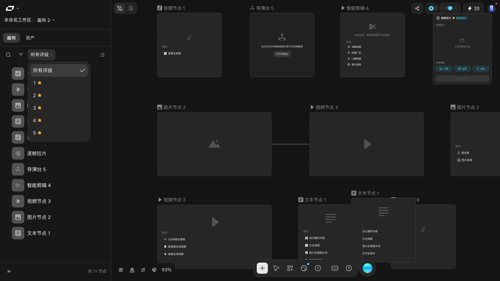
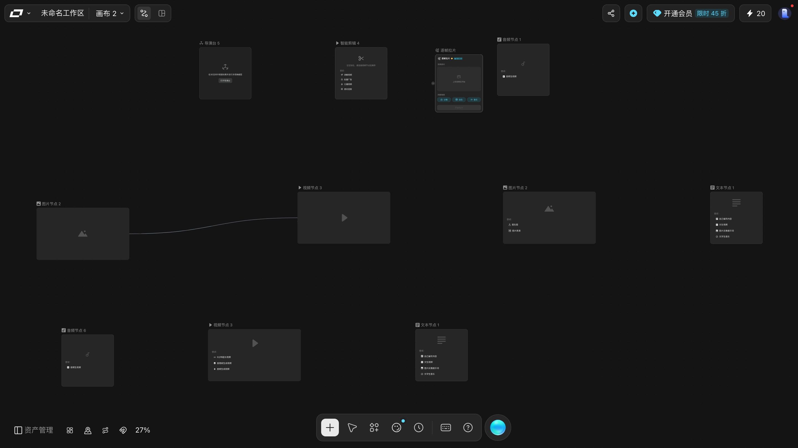
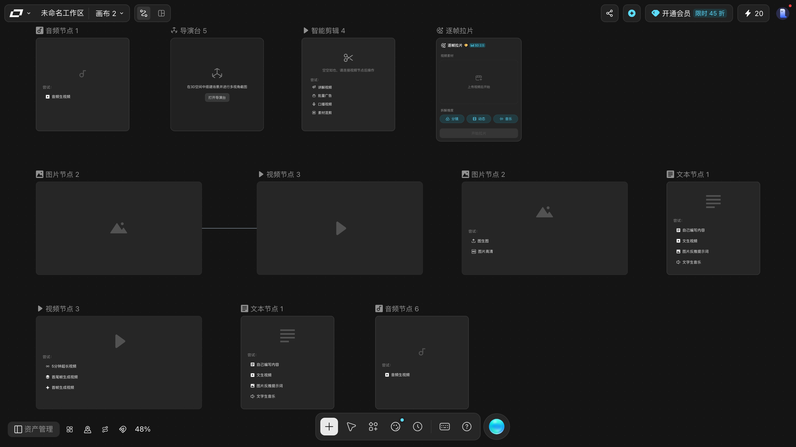
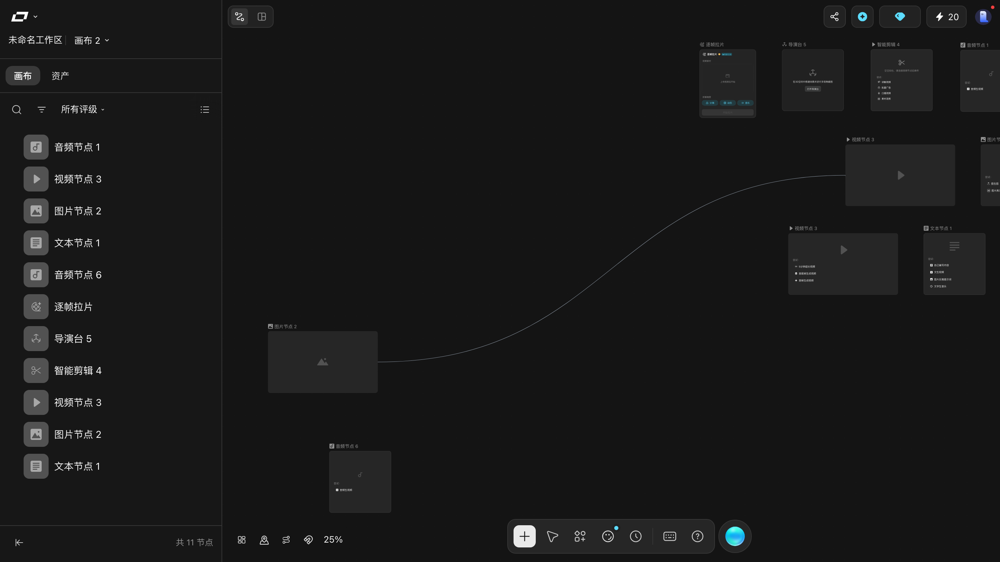
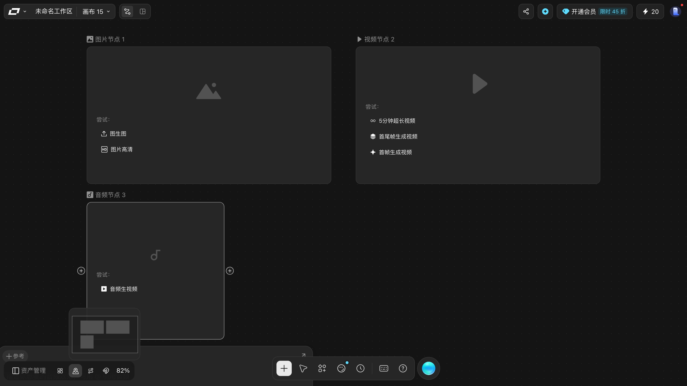
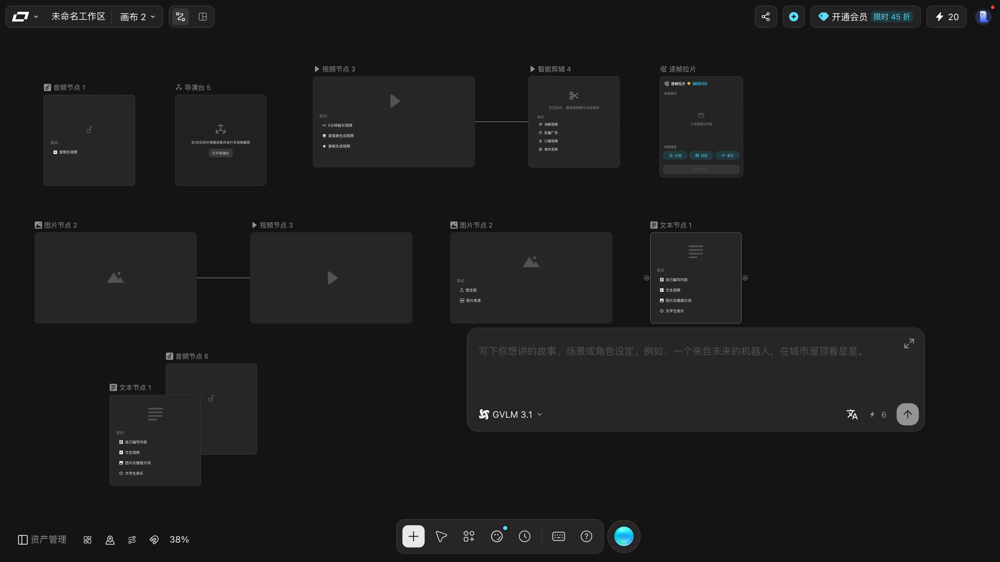

# 故障排查

按**症状**查。每条都写清楚：现象 → 原因 → 怎么修。

---

## 画布打不开 / 一进去就被弹回来

**症状**：访问 `/canvas` 被弹回首页。

**原因**：`/canvas` 裸路由**不带参数会跳首页**。画布必须带两个 id：

```
https://www.liblib.tv/canvas?spaceId=…&projectId=…
```

**修**：从顶栏「画布 N」下拉里点进去，或从项目页重新进入。别手敲地址。

---

## 打开我的画布，界面显示「会话已过期，请刷新页面以继续编辑」

**症状**：同一张画布在两处打开时，后打开的那处被挡住。

**原因**：LibTV 有**单画布单编辑者保护** —— 同一张画布同一时间只允许一处编辑。

**修**：关掉另一个标签页/窗口后刷新。

> 这是设计如此，不是故障。复制链接给自己另开窗口试也会撞上。

---

## 点「新建项目」以为没反应，又点了一下，结果建了两张

**症状**：画布下拉里多出两张几乎一样的画布。

**原因**：这个按钮**没有确认对话框**，点一次就已经建好并跳转了。

**修**：多出来的那张删掉，见 [10-tasks/manage-canvases.md](10-tasks/manage-canvases.md)。

---

## 删除键按了没用

**症状**：选中节点，按 `Delete` / `Backspace`，节点还在。

**原因**：节点里有提示词输入框，焦点还在框里 —— 此时 `⌘A` 选中的是**框里的文字**。

**修**（实测有效）：

1. 点一下画布空白处，把焦点交回画布；
2. `⌘A` 全选；
3. `⌫` 删除。

---

## 在资产管理里点了「复制」，画布上一个节点都没多

**症状**：资产管理左抽屉的行尾 `⋯` → `复制`，列表里明明多出了一行「原名 - 副本」，
底部也从「共 1 节点」变成「共 2 节点」，可画布上还是老样子。

**原因**：**副本建出来了，只是没在你眼前。** 副本排在**原节点正下方约一个身位**，
而 LibTV 只渲染视口内的节点。复制之前如果你按过 `⌘0` 把画布放大到「一个节点占满屏」，
那副本就在视口外面。

**修**：按 **`⌘0` 适合屏幕**，副本立刻出现。实测：复制完立刻数 = 1 个，`⌘0` 之后 = 2 个。

> 拿「画布上渲染了几个节点」当「我复制成功了吗」的判据，在这一步上会判错 ——
> **资产管理抽屉底部的「共 N 节点」才是准的。**

---

## 在资产管理里点了「删除」，想反悔

**症状**：节点没了，想找回。

**实测结论：找不回来。** 逐条核过：

| 检查 | 结果 |
|---|---|
| 二次确认弹窗 | **没有**，点完 200 毫秒全屏扫一遍，除了资产管理抽屉自己没有任何 `role="dialog"` |
| `⌘Z` | 无效 —— 焦点交回画布（`document.activeElement` 变成 `BODY`）后再按，画布仍是 0 个节点 |
| `⌘⇧Z` | 无效 |
| 成功提示 | 无 |

**预防**：

1. 删之前按 `⌘D` 复制一份（副本会落在原节点下方）；
2. 或者用 **`Option` + 拖动节点**复制；
3. 或者**先复制一张画布**再在里面随便删（见 [10-tasks/manage-canvases.md](10-tasks/manage-canvases.md)）。

> ⚠️ 画布**列表**里删整张画布是有二次确认的，删**单个节点**这一步没有。别拿前者的经验套后者。

---

## 点「添加到Agent」之后，节点挂了两次

**症状**：资产管理里点 `⋯ → 添加到Agent`，TV Director 抽屉的输入框里并排出现**两枚一模一样的附件 chip**。

**实测**：画布上只有 1 个节点、只点了 1 次菜单，输入区里就有 2 枚文字完全相同的 chip。
两枚的 DOM 完全一样（同一个 class、同样的 16px 文字高度、没有任何 `title` / `aria` / `data-*` 能区分），
在两张不同的测试画布上各复现了一次。

**手册判断不了这两个 chip 各自代表什么**，只把现象记在这里。

**修**：发送前把不需要的那枚处理掉 —— chip 上有 `×` 就点 `×`。
（chip 的删除按钮是 hover 才出现的，本手册没去点它。）

> 顺带一提：这个动作**只挂载、不发送**。发不发由你点右下角 `Send` 决定。
> 而只挂附件、没打字时 `Send` **已经可点**了。

---

## ⭐ 在资产侧栏点「添加到Agent」/「添加到画布」，什么也没发生

**症状**：左下角 `资产管理` → `资产` 标签 → 行末 `•••` → 点 `添加到Agent`（或 `添加到画布`），
菜单「啪」一下关掉了，然后什么都没发生。

**这不是点错了 —— 实测就是空操作。** 四条判据同时为空：

| 判据 | `添加到Agent` | `添加到画布` |
|---|---|---|
| 界面里有没有新东西冒出来 | 0 个 | 0 个 |
| 抽屉里的文字变没变 | 没变 | 没变 |
| 画布上的节点数变没变 | `+0` | `+0` |
| 有没有新的输入框 | 没有 | 没有 |

> ⚠️ **同一个名字，两处行为不一样**：
> **画布节点**侧栏的 `⋯ → 添加到Agent` 是**有效的**（右侧滑出 TV Director 抽屉、节点挂成附件 chip）。
> **资产**侧栏这一条同名项，在没有素材的这个状态下没有反应。
> 别拿前者去推断后者。

**修**：手册**判不了**它需要什么前置条件 📖。
目前能确定的是：它**不是**节点那条路，也不是一个坏掉的按钮。

---

## 建子文件夹时打出来的是「新建文件夹XXX」

**症状**：点 `新建子文件夹`，输入框里已经有「新建文件夹」了，
你敲上自己的名字，结果变成了 **`新建文件夹我的名字`**。

**原因**：那个输入框**开出来就已经自动聚焦、默认名已经全选好了**，
**直接打字就是改名**。如果你先**点了一下框里**，
光标会从「全选」变成「停在末尾」，于是你打的字变成**追加**。

**修**：⛔ 下次**别点那个框**，看到输入框直接打字，回车提交。
不需要手动删原名，也不需要全选。

---

## 资产分类建错了，想删掉

**症状**：在 `资产管理 → 资产` 里建错了分类或文件夹，想清理掉。

**做法**：那一行最右边的 `•••` → 最下面那枚 **`删除`**（整份菜单里**唯一的红字**）。

⚠️ 会先弹一道确认框，正文是：

> 确定删除「`{文件夹名}`」吗？删除后不可恢复。

> ⭐ **框里会写你要删的那个名字** —— 不可恢复的删除之前，**先核对一眼框里的字**，
> 那是它插值进去的，不会认错对象。

框里两枚按钮：`取消`（半透明）/ `删除`（**实心红**）。

**注意**：`删除` 删的是**那一个文件夹**。手册实测过完整的
「建子文件夹 → 回车 → 删掉 → 账户回到原样」，删完抽屉里和之前**一个字都没变**。

---

## 点「下载」没反应

**症状**：资产行菜单里点 `下载`，什么都没发生。

**手册的实测**：等满 8 秒，**没有触发任何下载**，画面也没变。

**原因（合理解释，不是实测结论）**：被测的那个分类是**空的**，
没有内容可以打包。📖 分类里放了素材之后 `下载` 是什么行为，手册不知道。

---

## 上传资产时，右下角「保存」是灰的

**症状**：点 `上传资产`，面板出来了，但右下角 `保存` 点不动。

**原因**：面板右侧的 **`保存位置 *`** 是**必填项**（标签后面带一颗红星 `*`）。
没填之前 `保存` 就是禁用的 —— 实测它的 `disabled` 属性就是 `true`。

**做法**：先点 `请选择文件夹` 选一个位置，`保存` 才可用。

> 💡 **顺带一提：这个面板不是系统选文件框。**
> 正确顺序是：**先定「保存到哪个文件夹」** → 再在左边虚线框里放文件 → `保存`。
>
> ⭐ **支持哪些格式，界面自己写着**，就在面板左下角：
> `支持的文件格式 🖼 jpg/jpeg/png ▶ mp4 🔊 mp3`，外加 `单个文件大小不超过 20MB`。

---

## 点「管理」以为没反应，其实弹窗被遮住了

**症状**：在 `资产` 标签点 `管理`，好像什么都没变。

**实测**：它**确实打开了一个弹窗** —— 一整块居中的「资产管理」窗，
上面写着「资产管理」，左侧栏是 `个人资产库` / `可灵主体库`。
**按 `Esc` 能关掉**。

> ⚠️ 这条之所以容易被误判成「没反应」，是因为**抽屉还在原地**，
> 而那块弹窗又是深色的 —— 不留意会以为页面没动。
>
> 💡 顺带记一条：在抽屉里按 `Esc`，**会把整个抽屉一起关掉**，
> 不只是关菜单。所以「按 Esc 收尾」之后通常要重新把抽屉打开。

---

## 资产管理里搜不到东西，是画布上没有还是搜错了地方

**症状**：在资产管理抽屉里搜一个节点名，列表空掉，出现「当前画布没有相关搜索结果」。

**先确认你搜的是哪个列表。** 这个抽屉有**两个**标签，各带一套独立的搜索：

| 标签 | 搜的东西 | 打开搜索的方式 |
|---|---|---|
| `画布` | **节点名** | 点工具行的 🔍（`aria-label="搜索节点"`） |
| `资产` | **资产名** | 点工具行的 🔍（`aria-label="搜索"`） |

> ⚠️ **工具行平时没有搜索框**，得先点一下 🔍 才会展开。
> 直接往抽屉里打字，打到的是上面那个工作区名称框里去 —— 本手册的取证脚本就踩过这个坑，
> 在「工作区名称」里打了「音频」，列表纹丝不动。

**搜的是节点名，不是节点类型、也不是提示词。** 按类型筛要用旁边那枚 `筛选：…`（十个档位），
按星级筛要用 `所有评级`（六档）—— 三者是分开的。

**两个筛选器会叠在一起。** 类型筛选 + 星级筛选 + 搜索框同时生效时，
列表可能空得莫名其妙 —— 把 `筛选：…` 切回「全部」、`所有评级` 切回「所有评级」再搜一次。

> 底部那个「共 N 节点」**数的是整张画布**，不跟着筛选走。
> 列表被筛到 1 行时它照样写着「共 3 节点」，别拿它当「我筛出来几个」的依据。

---

## ⭐ 找不到给节点评星级的入口

**症状**：想给节点标个重要程度，翻遍节点卡片、参数条、顶底栏，**一个星星也没找到**。

**本手册的结论：截至最后一次取证，这个入口在界面上确实找不到** 📖。

为了不把「没找到」和「不存在」混为一谈，取证时**穷举了五处**带星级语义的位置，全部 0 命中：

| 找过的地方 | 判据 | 结果 |
|---|---|---|
| 11 个节点的卡片 | 中文关键词 + `★☆` | 0 |
| 五类节点的参数条 | 同上 | 0 |
| 节点右键菜单 | 同上 | 无菜单弹出（无头环境拿不到浏览器菜单）📖 |
| 资产管理列表行内 | 同上 | 0 |
| 顶栏 + 底栏全部可交互元素 | 逐个过一遍，**共 58 个** | 0 |

**别用错判据。** ⭐ 评级档位那一列**不是文字，是图标** —— 每档右侧是一枚 `12×12` 的橙色五角星（`iconify--libtv`）。
所以「找一个带星字的元素」或者用正则 `/\d\s*[★☆]/` 去筛，**必然 0 命中**，
那是判据错了，不是这个 UI 不存在。同理，用这套办法去找「设置星级的按钮」也找不到，结论并不可比。



**现在能用的办法**：只有 `所有评级` 这个**筛选器**。
它能按星级过滤列表，**但没有任何界面能改星级** —— 本账户的 11 个节点全是未评级状态 📖。

---

## 画布空了，节点全不见了

**症状**：画面上一片空白，底部中央浮出「**当前视窗没有节点**」。

**这多半不是画布被清空了**，只是**视口飘到了所有节点之外**。

**原因**：LibTV 的画布只渲染**落在视口内**的节点。实测按住 `Space` 每轮向右拖 420px，四轮之后页面里渲染的节点数从 `3 → 3 → 2 → 1 → 0`，提示就是在 DOM 节点数归零那一刻出现的。

**修**（按顺序）：

1. 点提示条上的 **`返回节点`** —— 实测点完视口飞回，节点重新出现，提示自动消失；
2. 或者按 `⌘0` 适合屏幕；
3. 还找不到就按 `⌘F` 搜节点名字 —— 搜索面板**不受视口影响**，节点在页面外也照样列得出来（见 [10-tasks/create-nodes.md](10-tasks/create-nodes.md)）。

> ⚠️ **在这个状态下别按 `⌘A` + `⌫`**。你看到的「一个节点都没有」其实是「一个节点都没渲染」，删除操作很可能打空。

---

## 点「打开导演台」弹出「请开启浏览器硬件加速」

**症状**：导演台节点点进去，3D 视窗是空的，中间弹一个框：

> **请开启浏览器硬件加速**
> 当前浏览器无法使用硬件加速，导演台、全景预览、打光等 **3D 功能暂不可用**。


**原因**：**和账号、画布、积分都无关**，是浏览器没开图形硬件加速。LibTV 的 3D 功能（导演台、全景预览、打光）都要 GPU。

**修**：按弹窗里的指引走 —— 在浏览器设置里打开「使用图形加速功能（如果可用）」，**重启浏览器**再进。已经是开的还报这个，就更新浏览器或显卡驱动。

> ⚠️ 这条提示挡住的只是**3D 视窗本身**。导演台工作区其余部分（顶部标题、底部「描述想要搭建的场景，支持通过参考图创建」输入框、左侧 `+` 上传、右边 `↑` 发送）仍然在，截图里能看到。
> 至于搭建场景、参考图、多视角截图这些具体操作，**本手册没能进入 3D 视窗验证** —— 取证环境无硬件加速，所以这一段不写。

---

## 进导演台之后按 Esc 退不出来

**症状**：进了导演台工作区，按 `Esc` 画面没变化。

**本轮实测确实如此** —— 界面上提示着「按 ESC 退出」，但自动化的 `Esc` 没有退出工作区 ⚠️。

**修**：直接刷新页面回画布（画布状态是自动保存的）。人工点一次可能有效，但本手册**没法区分**是「Esc 对人有效、对自动化无效」还是「Esc 本来就无效」。

---

## 拖动画布拖不动

**症状**：在空白处按住左键拖，画布纹丝不动。

**这在默认状态下是正常的**。实测同一段鼠标位移 `(+220, +120)`，四种操作的结果差得很远：

| 操作 | 视口实际位移 |
|---|---|
| 空白处无修饰键左键拖 | `(+16.3, 0)` —— 基本等于拖不动 |
| `Space` + 左键拖 | `(+220, +120)` ✅ |
| 抓手工具（`H`）+ 左键拖 | `(+220, +120)` ✅ |
| 中键拖 | `(+220, +120)` ✅ |

**修**：按住 `Space` 再拖（最省事），或用中键拖。

> 顺带一提：如果你本来是想**框选**节点，那要按住 **`Shift`** 拖 —— 不按 `Shift` 是拖不动画布的。见 [10-tasks/create-nodes.md](10-tasks/create-nodes.md)。

---

## ⭐ 节点拖不动，而且空白处一拖就整张画布跑了

**症状**：想去拖一个节点，结果节点纹丝不动，反而整张画布跟着鼠标跑。

**原因**：**你处在「抓手工具」模式下。** 这一模式下拖任何东西都是平移画布，不是拖节点。

**怎么确认自己处在抓手模式**：看**画布空白处的光标**。

| 模式 | 空白处光标 |
|---|---|
| 移动 | 一枚**自定义箭头图标**（内联 SVG 做的 `cursor: url(...)`） |
| **抓手工具** | 标准的 **`grab` 手形** |

> 💡 看光标比看按钮可靠 —— 底栏那枚按钮没有高亮，两种状态下长得几乎一样，
> **只有它的无障碍名会变**（「移动」↔「抓手工具」）。

**修**：按 **`V`** 切回移动。

### ⚠️ `H` 是单向的：进得去，出不来

这是本轮实测中最容易让人卡住的一条：

| 你的动作 | 结果 |
|---|---|
| 按 `H` | ✅ 进了抓手模式 |
| **再按 `H`** | ❌ **还是抓手模式**（连按三次，状态序列 `移动 → 抓手 → 抓手 → 抓手`） |
| 按 `⇧` + `H` | ❌ 还是抓手模式 |
| **点底栏那枚按钮本身** | ❌ 还是抓手模式 |
| 按 **`V`** | ✅ 这才回到移动 |

**进抓手靠 `H` 或点按钮，退出只能靠 `V`。**
如果卡在抓手模式又忘了这件事，表现就是上面那个「节点拖不动」的坑。

---

## 点「网格吸附」没反应

**症状**：点左下角工具条上的「网格吸附」，按钮**看不出任何变化**，拖节点也没有吸附到网格上。

**本轮实测**（三种触发方式全试过：坐标点击、DOM `click()`、手动派发完整鼠标事件序列）：

| 观察项 | 点之前 | 点之后 |
|---|---|---|
| 按钮无障碍名 | `网格吸附` | `网格吸附`（没改名） |
| 背景色 | 透明 | 透明 |
| 拖动节点落点 | 请求 `(+37,+28)` | 实际 `(+34,+25)`，**不是任何常见网格步长的整数倍** |

同一排的「切换小地图」用完全相同的代码点一下就正常开启了。

**这不像是你点错了。** 但本手册**也不能断言这功能不存在**——
两个没排除的可能：吸附可能只在**某个缩放比例**下才有意义
（当前视口缩放约 42%，20px 的网格在屏幕上只有 8px），
或者它需要**别的画布/项目设置**才生效。这两条本手册都没验 📖。

**绕开的办法**：既然吸附不可靠，**拖完节点自己对齐**更省事 ——
用 [⌥⇧F 整理画布](10-tasks/shortcuts.md) 一次性把所有节点铺整齐。

> ⚠️ 顺带提醒一个容易误判的现象：鼠标点完按钮**还停在按钮上**，
> 这时按钮会因为悬停而变色，看上去「开了」。
> **那只是悬停。** 要判断状态，得先把鼠标移开再看。

---

## 点了「转分镜组」/ 按了 `⌘⌥G`，什么都没发生

**症状**：成组后点组操作条上的「转分镜组」，或者按快捷键 `⌘⌥G` 合并分镜组，画布毫无变化，也没有任何提示。

**原因**：**这个功能当前是灰的**。实测该按钮的 `opacity` 是 `0.45`（半透明 = 不可用），点击后节点数、分组数、提示都没变。快捷键 `⌘⌥G` 指向的是同一个功能，所以同样没反应。

**这不是你操作错了。** 本手册推测它只在特定条件下（比如故事板模式下）才可用 📖，但**没有在那个条件下试过**，所以无法告诉你怎么触发。

---

## 整理完画布，刷新又乱回去了

**症状**：按 `⌥⇧F` 整理完看着挺好，刷新后节点又叠在一起。

**原因**：整理完左下角会弹「**是否保留此次整理结果？**」，必须点「**保留**」。点「还原」或者直接忽略，这次布局就不落盘。

**修**：重新整理，这次记得点「保留」。

> 这是最容易「以为整理没生效」的地方。

---

## ⭐ 按 `⌥⇧F` / 点整理画布，一个节点都没动

**症状**：整理画布按下去，画面纹丝不动。

**有两种完全不同的原因，先分清是哪种：**

| 情况 | 判断 | 修 |
|---|---|---|
| 画布本来就整齐 | 整理是**幂等**的，没东西可整理 | 不用修。**想看它动，先把画布弄乱** |
| 画布确实是乱的，但按了没反应 | 见下 | **改点底栏那枚按钮** |



### ⭐ 键盘 `⌥⇧F` 按不出效果，**但按钮一定管用**

本轮在**一张确实乱的画布**上分两条路径各试了两次：

| 做法 | 节点位置变化 | 确认条 |
|---|---|---|
| 键盘 `⌥` `⇧` `F` | **0 个** | 不弹 |
| 底栏「整理画布，Option+Shift+F」按钮 | **11 个（全部）** | 弹「是否保留此次整理结果？」 |

**修**：**点底栏那枚按钮**（左下工具条第二枚，无障碍名里直接写着 `Option+Shift+F`）。

> ⚠️ 手册没法替你断定这是不是「快捷键坏了」——
> macOS 上 `⌥`+字母可能被输入法或系统层吃掉，自动化分不清这一层和产品层。
> 但**按钮一定管用**，这一点没有疑问。

### ⚠️ 怎么判断画布到底整不整齐

**别用眼睛数间距** —— 节点卡片宽度不一样（文本/视频/图片/音频各有各的宽度），
间距是「卡片宽 + 固定间隙」算出来的，本来就不一样。

**可靠办法**：按 `⌘0` 把所有节点框进视口，看它们是不是排成**规整的若干行**、每行**大致等距**。



---

## ⭐ 整理完画布，页面上「节点少了好几个」

**症状**：整理完往回一看，画布上好像只剩两三个节点了，**吓一跳以为被删了**。

**放心，一个都没丢。**

整理会把节点**铺开**，铺开之后有一部分落到**当前视口之外**，
而**视口外的节点根本不渲染** —— 页面上就是「看起来」少了。

**判断有没有真丢，要看资产管理抽屉底部的「**共 N 节点**」**，它数的是整张画布：



| 怎么打开 | 怎么做 |
|---|---|
| 资产管理抽屉 | 点左下角那枚**唯一带文字**的「资产管理」按钮 |
| 停在哪个页 | 停在「**画布**」标签就看得见底部计数 |
| 怎么关 | 按 `Esc` |

> 💡 **同一条经验在别处也用得上**：判断「复制有没有成功」「删除有没有生效」，
> 都不能数页面上有几个节点，要数抽屉里的「共 N 节点」。

---

## 连线拖不出来

**症状**：从出口拖到入口，松手后没有连线。

**原因**：三件事之一 ——

1. **两张节点完全重叠**。从「+」建出来的节点一律落在同一个位置，两张卡叠在一起时两个端口坐标几乎重合，拖拽被当成空操作。实测两张叠放的节点端口坐标只差 1 像素。
2. **方向接反了**。必须**右出左进**。
3. ⭐ **你盯着的那条边上根本没画连接口**。那枚 ⊕ 图标**默认 `opacity: 0`**，**鼠标不在它那一带、节点也没被选中时，它就是不显形**的 —— 看上去「这节点没有出口」，其实只是还没点亮。

**修**：

- 先把**鼠标移到那个节点的左右边缘**（不用点，划过就现形）—— 见上面第 3 条；
- 再用**双击画布空白处**把节点建在不同的位置（面板会锚在双击点），避免重叠。

> 💡 显形是**逐节点**的：同一时刻只有光标指着（或已选中）的那一个会亮，其余照旧是空的。
>
> 
>
> 💡 出来后别去死磕那个小圆点：真正能点的不是它，是**套在里面的一个 `80×80` 透明圆形**。
> 节点左右边缘往外一带的 80 像素内随手拖，都能起线。
>
> 

---

## ⭐ 找不到「删除连线」的按钮

**症状**：想把一根线断开，鼠标在连线上来回划，**什么都没冒出来**。

**原因**：这枚按钮**确实极难被发现**，但不是没有。四条实测：

| 它是什么样 | 所以你才会找不到 |
|---|---|
| 是个 `div`，**不是** `<button>`，也没有 `aria-label` / `title` / `role` | 它不在任何「按钮列表」里 |
| **只在指针悬停时挂载**，指针一移开就卸载 | 不划着它就查不到 |
| 藏在 `foreignObject` 里 | 按标签名或按可见区域找都容易漏 |
| 悬停后线会**亮成浅蓝**，中点浮出一枚**圆形剪刀** | 不盯着线看会以为什么都没变 |

**修**（两条路都实测能断，挑顺手的）：

1. 把鼠标**停在那根线上别动**（不用点选），中点会浮出一枚剪刀，**点它一下就断**；
2. 或者**点一下把线选中**（线会变成选中态），按 `Delete` 或 `Backspace` —— 面板上那个笼统的「删除 ⌫」对连线也生效。

> ⚠️ 两种都**没有确认框**。好在断了之后按 `⌘Z` 能**原样接回来**。
> 断完刷新页面也不会自己回来 —— 那是真断了。

---

## ⭐ 误删了节点或连线，找不到「回收站」

**症状**：删错了，想去回收站捞回来，翻遍界面找不到垃圾桶。

**原因**：⭐ **LibTV 画布里没有画布级回收站。** 这一条是**逐处查过的阴性结论**，不是「没找到」：

| 查过的地方 | 读到的内容 | 有回收站吗 |
|---|---|---|
| 全页文本 | 搜「回收 / 垃圾桶 / 废纸 / 历史 / 还原 / trash / recycle / bin」 | **零命中** |
| 全页带名字的控件 | **49 个**，逐个点名 | 无 |
| 底栏那枚**生成历史**按钮 | 全部画布 / 本画布 · 图片 / 视频 / 音频 计数 · 所有评级 · 时间倒序 · 批量操作 | 无（它管的是**生成记录**，不是删除记录） |
| 顶栏「画布 N ▾」 | 画布列表（画布 63、62、61…） | 无 |
| 右上角头像菜单 | 存储空间 / 管理资产 / 个人中心 | 无 |
| 资产管理抽屉 | `画布` / `资产` 两个页签 | 无 |
| 页面资源路径 | 含 `trash` / `recycle` / `bin` / `history` / `undo` 的请求 | **0 条** |

**修**：

1. **先按 `⌘Z`** —— 这是唯一的回头路。断线能撤回来（[connect-nodes.md](10-tasks/connect-nodes.md#断开连线)）；
2. 撤销用完了、或者已经刷新过页面 → **没有别的地方可以捞**，只能重建。
   所以**大动作之前先想清楚**。

> 💡 「生成历史」听起来像回收站，但它存的是**你生成过的图片/视频/音频**，
> 和「被你删掉的节点/连线」是两回事。

> ⭐ 顺带更正一个很容易想当然的说法：**面板上写着 `⌫ 删除`，不代表它管所有东西** ——
> 同理，`⌘L` 写着「连线」是**加线**的意思，不是断线。断线在连线上。

---

## 明明拖出了预览线，松手却没连上

**症状**：从出口拖出去，那条蓝色曲线**跟着光标跑了**，看着完全正常；可一松手，**连线数没变**。

**原因**：**这一对节点已经连过了** —— 同一对之间连不出第二根线。

这一点做过**阳性 + 阴性配对**的对照：两次拖的是**完全相同的动作**（手势、坐标、时长都一样），
只有「这一对已经连过没有」不同：

| | 拖到一半 | 松手之后 |
|---|---|---|
| 第 1 遍（还没连过） | 预览线出现 | 连线数 **+1** |
| 第 2 遍（已经连过） | **预览线照样出现** | 连线数 **不变** |

**分辨办法**：往回退一步，看**拖到一半有没有预览线**。

| 拖到一半 | 含义 |
|---|---|
| 有蓝色曲线跟手 | 手势被识别了，问题在**松手那一下**（多半是重复连） |
| 完全没有曲线 | 手势**没被识别** —— 多半是没对准端口，往[连线拖不出来](#连线拖不出来)那条走 |

> ⚠️ **界面不会给你任何提示**：重复连线时松手既不弹窗，落点也不变色
> （落点处的 `valid` / `connectable` 类名两次读到的都是空的）。
> 所以它看起来就像「卡住了」。

---

## 打开小地图之后，左下角的图标点不动

**症状**：点了「切换小地图」，缩略图出来了，但左下角工具条右边几个图标（角色造型室等）被盖住。

**原因**：小地图的实际渲染位置是**左下角**（`x≈145`），紧跟在左工具条后面。虽然它的 class 写着 `bottom right`，但实际落在左边，正好压住工具条。



**修**：把「切换小地图」当临时开关用，看一眼就关掉。

---

## 连线看不出「谁连谁」

**症状**：节点一多，连线缠成一团。

**修**（按顺序试）：

1. 点底部「**隐藏节点连线**」，专心摆节点；
2. `⌥⇧F` 整理画布；
3. 还是乱就开「切换小地图」看整体。

---

## 快捷键面板的第四列被挡住了

**症状**：「快捷键」面板右侧「其他」那列看不全。

**原因**：TV Director 抽屉停靠在右侧，正好压住第四列。

**修**：先关掉右侧抽屉（点它头部的「关闭」），再打开快捷键面板。

---

## 点「教程」什么都没发生

**症状**：底部那枚标着「教程」的按钮点下去，没有任何面板、跳转或新窗口。

**这不是故障**。实测该按钮的实现是联系入口（`data-sidebar-btn="contact"`），点击只发出一条埋点请求。

**结论**：LibTV 画布里**没有教程中心入口**。要学操作，看本手册。

---

## 智能剪辑节点写着「空空如也，请连接视频节点后操作」

**症状**：新建智能剪辑节点，什么也干不了。

**原因**：它不能凭空生成，必须先接一个视频节点。

**修**：建一个视频节点，用 [10-tasks/connect-nodes.md](10-tasks/connect-nodes.md) 的方法把视频节点出口连到智能剪辑入口。

---

## 发送按钮是灰的（TV Director）

**症状**：右侧抽屉里输入框空着，右下角上箭头点不动。

**原因**：**空输入时就是灰的**，这是正常状态不是故障。

**修**：先写点什么，或用 `@` 引用工作流/节点/资源。

---

## 节点参数条上有按钮点了没反应

**症状**：选中一个节点，底部那排按钮点几枚都没动静 —— 不弹面板、不报错。

**原因**：**三枚按钮都有「前置条件」，行为各不相同**，得先分清是哪一种：

| 按钮 | 什么时候没反应 | 你会看到什么 |
|---|---|---|
| `📄` **提示词优化** | 提示词是空的 | 顶部弹一条提示「**提示词为空，请输入内容后点击**」 |
| `文A` **翻译提示词** | 提示词为空 | 顶部弹一条提示「**提示词为空，请输入内容后点击**」（与 `提示词优化` **逐字相同**） |
| 最右白圆按钮（**生成**） | 条件没满足 | 按钮**变灰**，`cursor` 变 `not-allowed` |

**修**：

1. **先写点提示词** —— 三枚里有两枚都是这个前置条件；
2. **分不清是哪一枚就把鼠标停在上面等一秒** —— 悬停提示会直接写出它的名字
   （`提示词优化` / `翻译提示词`），不用猜图标；
3. **生成按钮灰着时，悬停它会告诉你缺什么**：
   - 音频节点写「请输入提示词**或添加参考素材**」——
     意思是**光有文字还不够，加个参考音频也能生成**；
   - 文本节点写「请输入提示词」。

> 💡 「点了没反应」和「它本来就点不动」在界面上长得一模一样。
> 区别只有一个：**灰的那枚会告诉你缺什么** —— 先读这句，比反复点省事。
>
> ⭐ `提示词优化` 和 `翻译提示词` 是**一对孪生按钮**：提示词为空时，
> **两者弹出的是同一条提示、同一句话**，都写「提示词为空，请输入内容后点击」。
> 也就是说 —— 弹了这条提示，就说明你缺的是提示词，**跟按的是哪一枚无关**。
>
> ⚠️ 反过来，**亮着的不代表随便点**：
> 生成按钮一旦点亮，点下去就**真的会扣积分**（视频 135 / 图片 15 / 音频 1）。

---

## 「提示词框打不进字」/「打完字刷新就没了」

**症状**：想在节点的提示词框里写点什么，结果敲了半天没反应；或者写了、刷新一下内容不见了。

**原因**：四条实测出来的规矩，每一条都对应一个真实的坑。

| 现象 | 实测 |
|---|---|
| ⭐ **它不是多行输入框** | 提示词框**不是 `textarea`**，是一块 `contenteditable="true"` 的 `div`。用「页面上有没有 `<textarea>`」去找它，**必然找不到** —— 本手册前几轮就是这么把「找不到」写成了 📖 |
| ⭐ **不选中就没有** | 提示词框**只在节点被选中时**才渲染。没选中时扫全页，读到的就是「0 个」 —— 那是**没选中**，不是**不存在** |
| ⭐ **它常常在画面外** | 选中之后，它常常落在**视口下沿之外**（读到的坐标是 `y≈803~842`，而画面高只有 810）。这时你**看得见节点、看不见输入框**，点不到也正常 |
| ⭐⭐ **打字是立刻存盘的** | 往框里打字之后**刷新，内容还在** —— 也就是说它**每敲一下就在存**。没有「保存」按钮，也没有「确定」 |


> ⭐⭐ **最后这一条对用户最要紧**：因为打字即存盘，
> **「先随便打点字看看」这种习惯会真的改掉你的画布**。
> 本手册自己就踩了 —— 测试文本落进了一个节点，**只能靠事后逐字删掉才能还原**。



**怎么把框挪进画面里**：

1. 选中那个节点；
2. 按 `⌘0`（**适合屏幕**）把整张画布收进画面；
3. 还够不着就用**中键拖拽**平移画布 —— 提示词框在节点的**正下方**，所以要**往下**拖；
4. ⛔ 缩放菜单里**没有 35% 这一档** —— 只有 `缩放至50%` / `缩放至100%` / `缩放至800%`。
   想要更小就**连按 `⌘-`**。

> ⚠️ 本手册早期有一处写着「缩到 35% 后就能读到」—— **这个说法要改**：
> 菜单里根本没有 35% 这一档，35% 是**连按 `⌘-`** 缩出来的，不是从菜单里选的。

> ⛔ **有内容时点「翻译提示词」到底会发生什么，本手册仍然没测到。**
> 这不是「点了没反应」—— 是**三次都没能证实点击落到了那枚按钮上**
> （阳性对照不通过，见 `PROGRESS.md` §55）。所以这里**不给结论**，也不写「它没用」。

---

## 逐帧拉片的「开始拉片」点不动 / 导演台的「发送」点不动

**症状**：这两个节点上有一枚按钮灰着，怎么点都没反应。

**原因**：**两个都是「前置条件没满足」，不是坏了** —— 而且这两个节点的形态和其他节点不一样：

| 节点 | 灰着的那枚 | 它要什么 |
|---|---|---|
| **逐帧拉片** | `开始拉片` | 先在上面那块 `上传视频后开始` 里传视频 |
| **导演台** | `发送` | 先在描述框里写点什么 |

> 💡 **逐帧拉片和导演台都没有那套 660 宽的参数面板。**
> 其他节点选中后会展开一张大卡（提示词框 + 模型 + 规格 + 积分），
> 这两个节点**选中后还是原来那张小卡片** ——
> 所以「点了节点没反应」在这里**是正常的**，它本来就是那样。
>
> ⚠️ **导演台另有一个容易看不见的地方**：它的描述输入区是一块
> 浮在节点**左侧**的独立面板，节点本身一动它就跟着动。
> 找不到就拖一下节点，或者放大画布（`⌘0` 适合屏幕）。

---

## 首访时弹出一堆东西挡住了画布

**症状**：刚进画布时出现促销弹窗、「Agent 已升级为 TV Director」提示、浏览器通知条。

**修**：

- 促销模态 —— 按 `Esc` 或点关闭；
- 升级提示 —— 点「知道了」；
- 通知条 —— 点右边的 `×` 或「关闭浏览器通知提示」。

---

## 画布上空白，什么都没有

**症状**：切到故事板后只有三列「暂无文本 / 暂无图片 / 暂无视频」。

**原因**：**这是对的**。故事板展示的是画布里已有的内容，画布空它就空。

**修**：切回工作流模式确认一下节点还在（切换不会丢内容），没有的话回 [10-tasks/enter-canvas.md](10-tasks/enter-canvas.md) 重新建。

---

## 生成失败了 / 太慢了 / 扣了积分没产物

> ⚠️ **这一节是空缺，而且是故意的。**
>
> 取证时测试账户余额只有 20 积分，而一次视频生成要 135 积分。本手册**一次都没有真正提交过生成**，
> 所以**没有**生成耗时、进度显示、失败提示、产物落位、失败退款这些实测证据。
>
> 与其给你一段编出来的步骤，不如直接说：**这部分本手册没试过。**

已知的只有界面信息：

| 你能看到 | 说明 |
|---|---|
| 花费数字 | 印在参数条末尾（如 `135`），提交前就能看到 |
| 余额 | 顶栏右上角 |
| 生成历史 | 底部工具条「生成历史」按钮；资产页也有 `生成历史` 入口 |

自查建议：

1. **提交前看一眼余额够不够**；
2. **第一次先调最小规格**（时长短、张数少）试方向；
3. **扣了积分没产物**，去 `生成历史` 和 `资产` 两个入口各看一次 —— 生成过的内容会留在历史里可以复用（见 [10-tasks/asset-library.md](10-tasks/asset-library.md) 的「从生成历史选择」）。

---

## 发布之后想撤回

> ⚠️ 同样**没有验证**。
>
> 发布会让作品对外可见，分享链接会让**拿到链接的人可以查看并复制你的画布**。
> 本手册只读了面板文案，**没有点过发布、没有生成过链接**，因此无法告诉你撤回路径。

`发布与分享` 面板里（实测只有这些）：

> 发布你的作品和创作过程，让更多创作者看到。
> 分享链接
> 拥有此链接的人可以查看并复制你的画布。

**建议**：重要内容先发一条测试内容，自己把撤回流程走一遍，再发正式的。

---

## 还是没解决

带着下面这些信息去反馈，能省掉一轮来回：

- 你的 `spaceId` / `projectId`（地址栏里）；
- 顶栏左下角的版本号（取证时为 `v1.5`）；
- 你的系统（macOS / Windows）、浏览器；
- 完整复现步骤；
- 出问题那一刻的截图。

---

## 相关

- [10-tasks/](10-tasks/README.md) —— 任务指南索引
- [20-reference.md](20-reference.md) —— 参数与名词
- [task-inventory.yml](task-inventory.yml) —— 本手册的验证边界逐条登记
