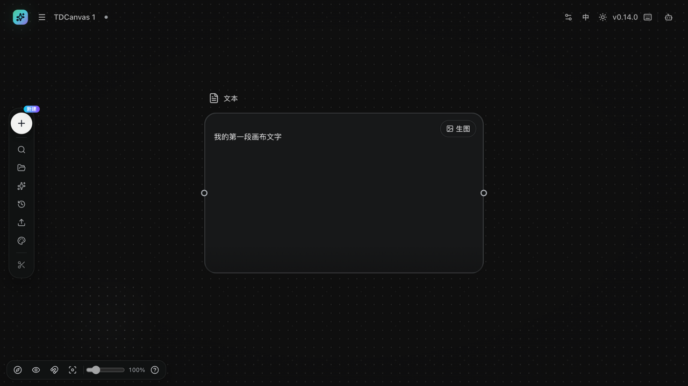

# TDCanvas 快速上手：从空画布到第一个节点

> 目标读者：首次使用 TDCanvas 的创作者。
> 承诺结果：按本文 5 步操作，你将在 2 分钟内创建一个画布项目，并在画布上写下第一段文字。
> 更完整的项目管理操作见 [10-tasks/create-canvas-project.md](10-tasks/create-canvas-project.md)。

## 开始前

- 打开 TDCanvas（桌面客户端，或本地运行的 Web 版 `http://localhost:3000`）。
- 无需登录：TDCanvas 的画布数据保存在本机。

## 五步上手

1. **新建画布**：在首页点击紫色的「新建画布 →」按钮。TDCanvas 会自动创建项目（自动命名，如「TDCanvas 1」）并直接进入画布编辑页。
2. **认识画布**：中央是无限画布，中央提示「双击画布，自由创作」；左侧竖直工具栏从上到下是 新建、搜索、资产、提示词库、历史、上传、外观、快捷键；左下角是 小地图、连线显隐、网格吸附、重置视图 和缩放滑杆。

   

3. **创建第一个节点**：点击中央的「文字创作」芯片，画布上会出现一个文本节点（自动选中，下方打开「文本创作」面板）。
4. **输入文字**：双击节点内容区域，输入文字（例如「我的第一段画布文字」），然后点击画布空白处完成输入。
5. **确认成果**：节点中显示你输入的文字，右上角出现「生图」按钮——最短路径完成。

## 下一步

- 想上传自己的图片、视频、音频？见 [10-tasks/upload-materials.md](10-tasks/upload-materials.md)。
- 想把两个节点连起来做引用？见 [10-tasks/connect-references.md](10-tasks/connect-references.md)。
- 想改项目名称或回到项目列表？见 [10-tasks/project-management.md](10-tasks/project-management.md)。

## 常见第一次的问题

- **滚轮是在缩放，不是滚动页面**——TDCanvas 画布中滚轮永远缩放视图；平移请直接按住空白处拖动。
- **项目标题是「TDCanvas 1」这样的自动名字**——双击顶栏标题即可改名，见项目管理任务。
- **关闭页面内容会丢吗**——不会。画布自动保存在本机，重新打开首页点击项目卡即可继续。
