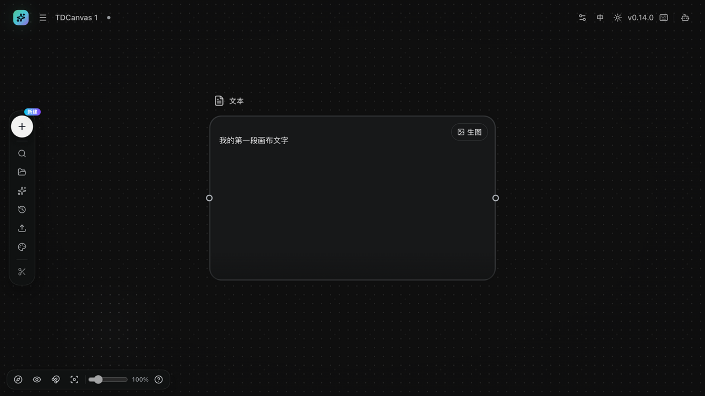

# TDCanvas 快速上手：从空画布到第一个节点

> 目标读者：首次使用 TDCanvas 的创作者。
> 承诺结果：按本文 5 步操作，你将在 2 分钟内创建一个画布项目，并在画布上写下第一段文字。
> 更完整的项目管理操作见 [10-tasks/create-canvas-project.md](10-tasks/create-canvas-project.md)。

## 开始前

- 打开 TDCanvas（桌面客户端，或本地运行的 Web 版 `http://localhost:3000`）。
- 无需登录：TDCanvas 的画布数据保存在本机。

## 五步上手

1. **新建画布**：在首页点击紫色的「新建画布 →」按钮。TDCanvas 会自动创建项目（自动命名，如「TDCanvas 1」）并直接进入画布编辑页。
2. **认识画布**：中央是无限画布，中央提示「双击画布，自由创作」；左侧竖直工具栏从上到下是 新建、搜索、资产、提示词库、历史、上传、外观、快捷键；左下角是 小地图、连线显隐、网格吸附、重置视图 和缩放滑杆。

   

3. **创建第一个节点**：点击中央的「文字创作」芯片，画布上会出现一个文本节点（自动选中，下方打开「文本创作」面板）。
4. **输入文字**：双击节点内容区域，输入文字（例如「我的第一段画布文字」），然后点击画布空白处完成输入。
5. **确认成果**：节点中显示你输入的文字，右上角出现「生图」按钮——最短路径完成。

## 这五步背后发生了什么

上面五步只做了「创建一个文本节点」，但它其实已经展示了 TDCanvas 的全部工作方式：

- **你写的内容就存在节点里**——不需要额外的「文档」或「输入框」，节点本身就是内容容器；
- **右下角的「生图」按钮**意味着这个节点已经可以参与生成。只要配上 API Key，点它就能把这段文字变成图片；
- **顶部标题「TDCanvas 1」就是项目名**——双击即可改名；
- **所有东西都自动保存在本机**——现在就可以关掉页面，下次从首页点卡片回来。

也就是说，**上手不需要任何配置或注册**。唯一的门槛在生成环节：点「生图」前需要先到「配置」填 API Key（见下表最后一行）。

## 想继续往下走

- 想上传自己的图片、视频、音频？见 [10-tasks/upload-materials.md](10-tasks/upload-materials.md)。
- 想把两个节点连起来做引用？见 [10-tasks/connect-references.md](10-tasks/connect-references.md)。
- 想改项目名称或回到项目列表？见 [10-tasks/project-management.md](10-tasks/project-management.md)。
- 想把常用提示词存起来复用？见 [10-tasks/manage-assets.md](10-tasks/manage-assets.md)（顶部导航「我的资产」）。
- 节点多了想整理？见 [10-tasks/organize-canvas.md](10-tasks/organize-canvas.md)（用「组」圈起来）。
- 还不理解「连线」到底意味着什么？见 [30-concepts.md](30-concepts.md) 的一句话心智模型。

## 顶部导航都有什么

首页之外的五个入口，都在页面最上方的导航栏里：

| 入口 | 用途 | 详见 |
|---|---|---|
| 我的画布 | 画布项目列表，新建、重命名、导出、删除 | [project-management.md](10-tasks/project-management.md) |
| ComfyUI 本地 | 本地 ComfyUI 工作流环境（**仅桌面客户端可用**，浏览器里是提示页） | [20-reference.md](20-reference.md#comfyui-本地与-404-两个走不到底的页面) |
| 提示词库 | 浏览提示词（进入后页面标题为「提示词中心」） | [use-prompt-library.md](10-tasks/use-prompt-library.md) |
| 我的资产 | 提示词与参考图的素材仓库，可导出备份 | [manage-assets.md](10-tasks/manage-assets.md) |
| 配置 | 填写 AI 土豆 API Key（生成类功能必需） | [generate-images.md](10-tasks/generate-images.md) |

> 首次使用生成类功能前，务必先到「配置」填写 API Key，否则生成按钮不可用。

## 常见第一次的问题

- **滚轮是在缩放，不是滚动页面**——TDCanvas 画布中滚轮永远缩放视图；平移请直接按住空白处拖动。
- **项目标题是「TDCanvas 1」这样的自动名字**——双击顶栏标题即可改名，见项目管理任务。
- **关闭页面内容会丢吗**——不会。画布自动保存在本机，重新打开首页点击项目卡即可继续。
