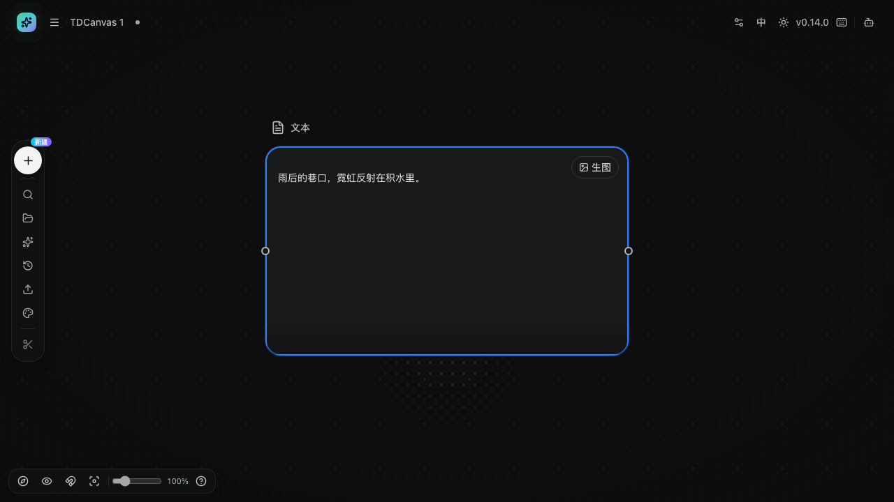
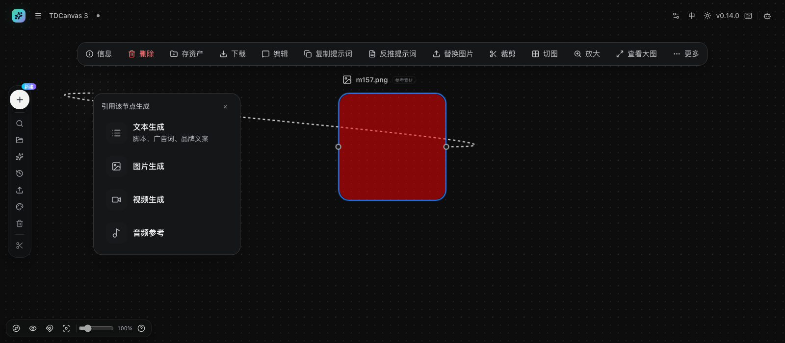
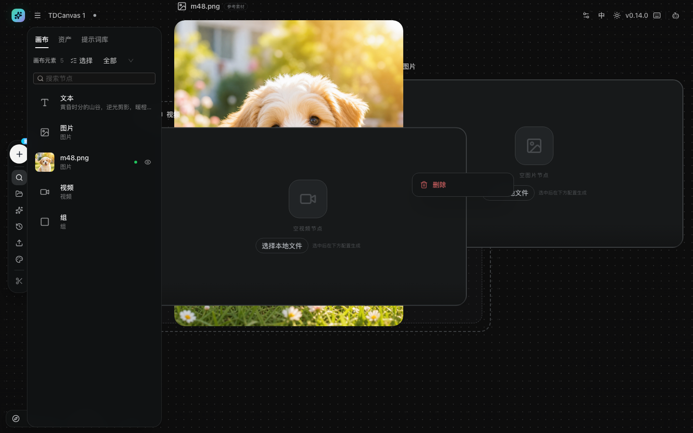

# 连线引用与无线引用

- **适用角色**：所有 TDCanvas 用户。
- **目标**：把上游节点（图片/视频/音频/文本）作为参考，接到下游节点上参与生成。
- **前置条件**：画布中已有至少两个节点（见 [create-nodes.md](create-nodes.md)、[upload-materials.md](upload-materials.md)）。
- **入口**：节点左右两侧的圆形端口；画布外观 flyout 的「画布输入模式」。

## 方式一：拖线连接（连线模式）

节点被选中时，左右两侧各出现一个**小圆点**——这就是端口。左边是输入（接收上游），右边是输出（提供内容给下游）：

- **左侧端口**：输入口，别人可以连进来；
- **右侧端口**：输出口，你可以从这里拖出去。

### 端口上的 `any` 是什么意思

把鼠标**停在端口上不动**，会弹出一行小字：

| 停在 | 弹出的字 | 读法 |
|---|---|---|
| 左侧端口 | **输入 · any** | 这是一个「输入」，类型是 `any` |
| 右侧端口 | **输出 · any** | 这是一个「输出」，类型是 `any` |

格式恒为「**名称 · 类型**」。**`any` 是「通用」的意思——这个口什么都收。** 所以在 v0.14.0 里，**普通节点之间随便连**，不会出现「类型不匹配所以连不上」：图片能连视频，视频能连文本，判据只有一条——`any` 对 `any` 永远放行。

> **为什么端口明明有名字，画布上却看不到？** 因为这两个口是**通用兜底口**，画布上只画一个小圆点，**不渲染文字标签**。「输入」「输出」这两个名字只存在于鼠标悬停的那行提示里。这是本版本的设计，不是标签没加载出来。

> **`any` 只有一个例外：ComfyUI 工作流节点。** 这类节点的端口是从工作流里读出来的**真类型**（图片 / 视频 / 音频 / 文本 / 数字 / 布尔 / JSON），并且**输入口一个只收一条线**。把普通节点的输出连到 ComfyUI 节点上时，因为那边不是 `any`，就要看类型对不对得上；两个都是 `any` 的普通节点之间则永远连得上。详见下方[「连线时的常见限制」](#连线时的常见限制)。
>
> **2026-10-02 M107 实测补强**：「普通节点之间随便连」此前只有两个节点、四个端口的**一次单点观察**（都是 `any`），并没有覆盖「不同类型之间」。现把文本 / 图片 / 视频 / 音频两两互连的 **4×4 十六组全跑完，全部连得上**，没有一组出现类型不匹配。
>
> **但 ComfyUI 这个例外有个缺口，值得知道**：**它输出「文件」时，端口类型会被降级成 `any`**（源码里就是 `resourceType === "file" ? "any" : resourceType`）。也就是说，**当工作流产出的是图片 / 视频 / 音频这类文件时，类型那关照样不拦你**。真正会被拦的是数字、布尔、JSON 这类非文件参数——**参数型端口之间类型对不上时才会看到「连不上」**。所以「ComfyUI 节点会按类型拦你」这句话只在它处理参数时成立。
>
> **为什么普通节点之间必然随便连**：它们**压根没定义过端口类型**，全部回退到两个通用兜底口，兜底口的类型就写死成 `any`——所以不是「规则宽松」，是**根本没有类型规则**。

具体操作：

1. 鼠标移到节点上（点击选中），左右两侧出现圆形**端口**。
2. 从上游节点的**右侧输出口**按住拖动，出现一条跟随指针的连线。
3. 拖到目标节点附近松手——连线以贝塞尔曲线生成，两端节点高亮。

连线画好后，下游节点的参考素材区就会出现对应条目——这就是「引用已经建立」的可视证据。

## 方式二：拖线到空白处，直接创建下游节点

把连线拖到画布空白处松手，会弹出「**引用该节点生成**」菜单（按上游类型提供 文本生成 / 图片生成 / 视频生成 / 音频参考 等项）。选择一项后：

- 在松手位置自动创建新节点；
- 新节点与上游自动连线；
- 生成面板自动打开（生成动作本身需要已配置 API Key，见 [generate-images.md](generate-images.md)）。

> **这个菜单换过名字。** 更早的版本里它叫「**利用画布节点生成**」，**当前 v0.14.0 界面上写的是「引用该节点生成」**，菜单里的四项没有变。配套截图已按当前界面重拍；如果你在别处（比如旧教程或旧截图）看到的是那个旧名字，看这一段就够了。

> **2026-10-02 M112 实测：松手位置决定一切，而其中一种结果是「什么都不发生」。**
>
> 菜单本身与手册描述完全一致——实测标题确为「引用该节点生成」，四项为 **文本生成**（副标题「脚本、广告词、品牌文案」）/ **图片生成** / **视频生成** / **音频参考**，菜单尺寸 300×330；点其中任意一项，**节点数 2 → 3、连线 0 → 1**，即「自动建节点 + 自动连上上游」成立。
>
> **但松手位置有三种截然不同的结果**（四个位置逐一实测）：
>
> | 松手位置 | 结果 |
> |---|---|
> | 远离所有节点的空白处 | **弹出「引用该节点生成」菜单** |
> | **目标节点身上（不必瞄准端口）** | **直接连上** |
> | **源节点自己身上** | **什么都不发生**——没有连线、没有菜单、没有任何提示 |
> | **节点框外约 32 个画布单位以内** | **同样什么都不发生** |
>
> **两条反直觉的事实，值得记住**：
>
> 1. **连普通节点时不用瞄准端口**——把线拖到目标节点的**任意位置**松手都能连上。实测把线拖到目标节点正中心（离端口很远）照样 `0 → 1` 建线。
> 2. **每个节点周围有一圈「死区」，落进去就静默失败**——节点框外约 32 个画布单位这一圈，既不算「落在节点上」、又不够远到能弹菜单，于是**线一松手就消失，不给任何提示**。**把线拖回自己出发的那条线上（源节点身上）也是同一个结果。**
>
> **所以「线拖过去没反应」不是坏了，是松手位置落在了死区。** 往目标节点**身上**再靠近一点就能连上；想要弹菜单就把线拖到**明显远离一切节点**的地方。

## 引用的作用

连线把上游素材**接进**下游的参考素材区：图片/视频/音频成为参考图/参考视频/参考音频，文本成为一条名为「文本N」的缩略图。

**但「接进来」不等于「一定被用上」。** 在 v0.14.0 里，未被点名的素材会盖着「**不参与生成**」标签，面板顶部同时提示「N 个素材不符合当前模型的输入要求」；即使在提示词里用 `@` 选中了它，这个标签也不会消失。因此**关键描述请直接打进提示词框**，不要指望连线替你传话。完整实测与成因见 [30-concepts.md](../30-concepts.md#连线不等于自动生效)。

**连线不是执行顺序。** 这是最容易误解的一点：连线不表示「先做这个再做那个」，而表示「把这个素材挂到这个节点上」。所以你可以随时增删连线、随时调整节点摆放位置，生成结果只取决于当下连了谁，不取决于谁在画布的左边。

这也是为什么改一个上游会同时影响所有连到它的下游——它们读的是同一份内容。

## 方式三：无线引用（objects 模式）

不想让画布上出现连线时（比如项目节点很多、线已经织成一团）：

1. 左侧 Dock「**画布外观**」→「画布输入模式」→ 切换为「**无线模式**」。
2. 此时改用对象引用方式组织输入（连线隐藏，原有连线关系保留但不显示）。
3. 切回「连线模式」即恢复连线显示。

两种模式的引用关系是同一套，切换不会丢失已建立的引用——只是表达方式从「画线」变成「列表」。

## 管理连线

画布上共有**三个右键菜单**，它们互不相同——右键的位置决定你看到哪一个：

| 右键的位置 | 弹出的菜单 | 能做什么 |
|---|---|---|
| **空白处** | 六项（上传资产 / 添加节点 / 撤销 / 重做 / 复制所有节点 / 粘贴） | 见 [navigate-canvas.md](navigate-canvas.md#画布里两个不显眼的菜单) |
| **节点上** | 两项（复制 / 删除） | 复制出一个副本，副本向右下偏移 +36,+36 像素 |
| **连线上** | **只有一项（删除）** | 只能删除这条连线 |

### 删除连线

两种方式，任选其一：

- 点一下连线选中它，按 `Delete`；
- **右键连线**，从弹出的菜单里选「删除」。

> **为什么连线菜单只有「删除」**：三条线各有各的职责。连线只表达"谁引用谁"这一个关系，没有可复制的内容（复制一条连线毫无意义——同样的两端本来就只能连一条），也没有别的属性可改。节点菜单多一项「复制」，是因为节点有内容可以复制。**菜单项的多少不是随意设计的，它反映了这个对象到底有多少种操作。**

> **一个容易踩的点：连线很细，被节点盖住时点不中。** 连线可点击的区域就是那条贝塞尔曲线本身，没有额外的加粗命中层。实测中有一条连线整段压在另一个节点下面，用鼠标在它中间点右键，命中的始终是节点（弹出的是节点菜单），怎么点都弹不出连线菜单。两个绕法：
> 1. 先把节点**拖开**，让连线露出来再右键；
> 2. 或者用第一种方式——点选连线后按 `Delete`，不需要菜单。
>
> 另外注意删除节点和删除连线是两件事：删掉上游节点，它发出的连线会一并消失；想保留节点只拆掉关系，才用连线菜单的「删除」。

### 引用版本

图片节点有多版本历史时，引用可固定（pinned）到某一版，或跟随最新版。

## 连线时的常见限制

这些规则能避免你反复尝试无效连线（2026-09-30 源码与运行时一致）：

- 同一对节点之间**不会重复连线**——已有连线时再拖一次会被忽略；
- **节点不能连自己**；
- **组节点不参与连线**（它只是视觉容器）；
- **类型要对得上**——`any` 对 `any` 永远放行；只有连到 ComfyUI 工作流节点时才会被类型拦住（那边是真类型，不是 `any`）；**且 ComfyUI 输出文件类资源时类型被降级成 `any`，那一关同样不拦**；
- 非多选输入口**只接受一条入线**，占线后再拖入会被忽略。

> **最后一条在 v0.14.0 几乎用不上。** 它只对「只收一条」的口生效，而**内置节点的输入口都是多选口**——2026-10-01 实测，画布上 4 个端口（2 个节点 × 输入输出）全部是 `any` **且**允许多条入线。真正"一个口只收一条"的是 **ComfyUI 工作流节点的每一个输入口**。所以你把三张参考图连到同一个图片节点上是允许的，连不上通常是被类型拦的，不是被条数拦的。

## 成功判据

- 连线生成后，下游节点面板的参考素材区出现上游条目（如「图片 1」）；
- 删除上游节点时连线一并消失；「历史 → 撤销」可恢复。

## 相关任务

- [generate-images.md](generate-images.md)：连接完成后发起生成。
- [edit-nodes.md](edit-nodes.md)：删除与恢复。
- [30-concepts.md](../30-concepts.md)：连线语义与 latest/pinned 的设计意图。

