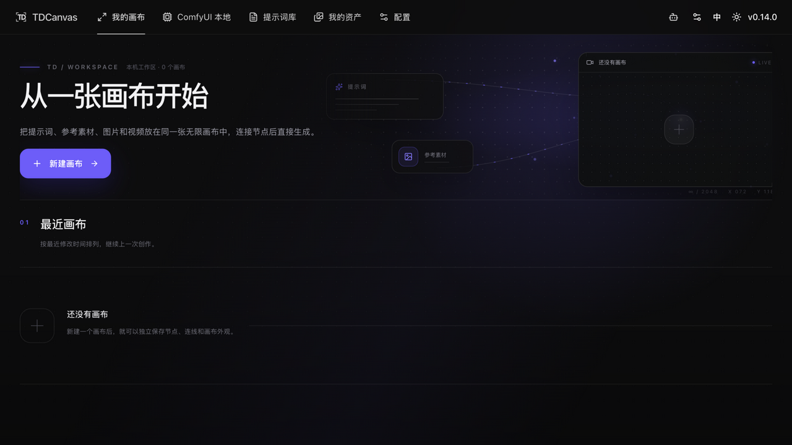
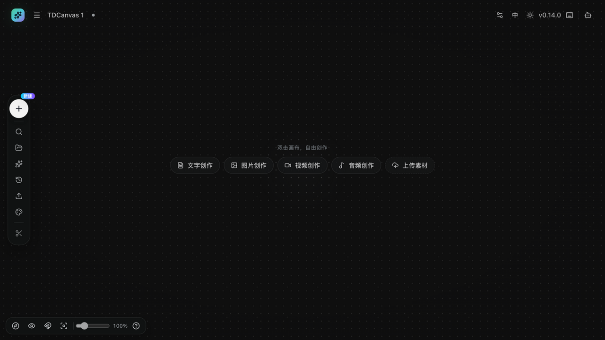
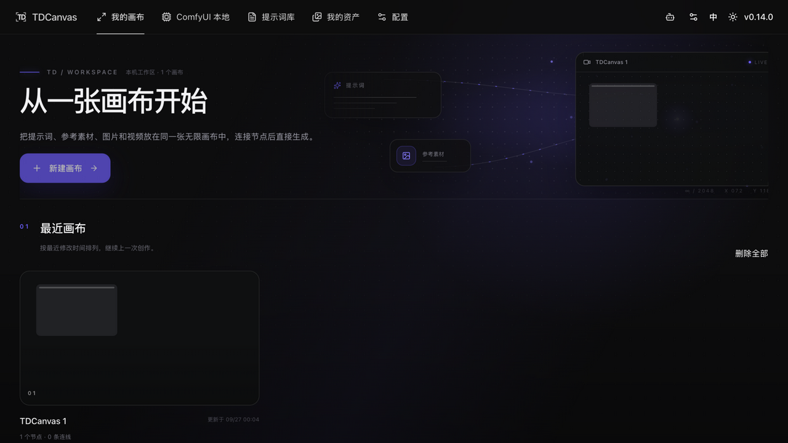

# 创建画布项目并认识工作区

- **适用角色**：所有 TDCanvas 用户（无需登录，本地使用）。
- **目标**：创建一个画布项目，认识编辑页的工作区布局，并学会回到项目列表。
- **前置条件**：TDCanvas 已启动（桌面客户端，或本地 Web 版）。
- **入口**：首页「新建画布 →」按钮；或首页顶部导航「我的画布」。

## 步骤

### 1. 打开首页

启动 TDCanvas 后默认进入首页 `我的画布`。首次使用时页面显示：

- 大标题「从一张画布开始」与紫色「新建画布 →」按钮；
- 「最近画布」区（首次为空，显示「还没有画布」）；
- 右上角实时预览窗（当前为空时显示占位）。

> 顶部导航还可以前往：ComfyUI 本地、提示词库、我的资产、配置；右上角提供 Agent 面板、中/EN 切换与明暗主题切换。

### 2. 新建画布

点击「新建画布 →」。TDCanvas 会立即创建一个新项目（自动命名，如「TDCanvas 1」；再新建会是「TDCanvas 2」，编号自动递增），并直接进入画布编辑页。

### 3. 认识编辑页工作区

| 区域 | 内容 |
|---|---|
| 顶栏 | 主页（返回首页）、画布菜单、项目标题（双击可改名）、本地 Codex 面板、配置、中/EN、明暗主题、快捷键 |
| 中央 | 无限画布；空画布时提示「双击画布，自由创作」，下方一排快捷芯片：文字创作、图片创作、视频创作、音频创作、上传素材 |
| 左侧 Dock | 新建（+）、搜索节点、资产、提示词库、历史（撤销/重做）、上传资产、画布外观、（有选中内容时）删除、快捷键 |
| 左下缩放 Dock | 打开小地图、隐藏连线、网格吸附、重置视图、5%–500% 缩放滑杆 |

画布内容会**自动保存**在本机，无需手动保存。

### 4. 回到项目列表

点击顶栏「主页」按钮回到首页。「最近画布」区现在会显示项目卡（标题、节点数与连线数、更新时间），点击卡片即可重新进入画布。

## 成功判据

- 浏览器地址为 `/canvas/<项目ID>`，顶栏显示项目标题；
- 首页「最近画布」出现该项目卡片，卡片显示正确的节点计数与更新时间。

## 取消与恢复

- 误建了空项目：回到首页，将鼠标悬停在项目卡上使用删除（有确认弹窗）；首页多选模式下可批量删除。
- 项目标题想改：见 [project-management.md](project-management.md)（双击顶栏标题或首页卡片重命名）。

## 相关任务

- [create-nodes.md](create-nodes.md)：在画布上创建各类节点。
- [undo-persistence.md](undo-persistence.md)：撤销、重做与自动保存的边界。
